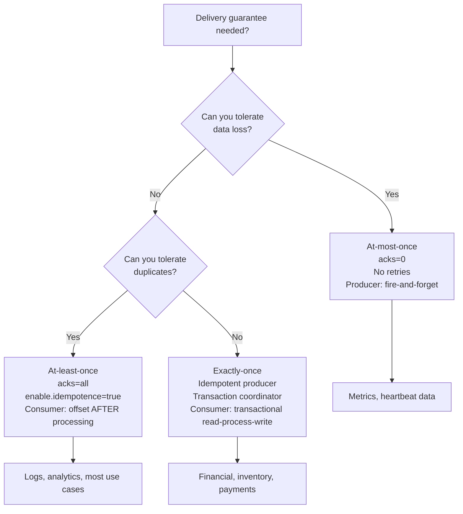
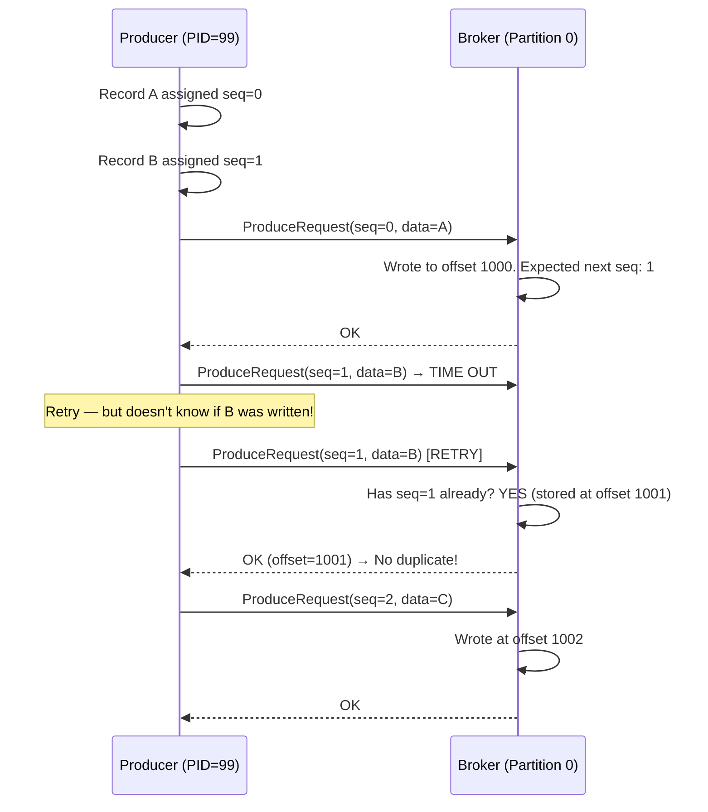
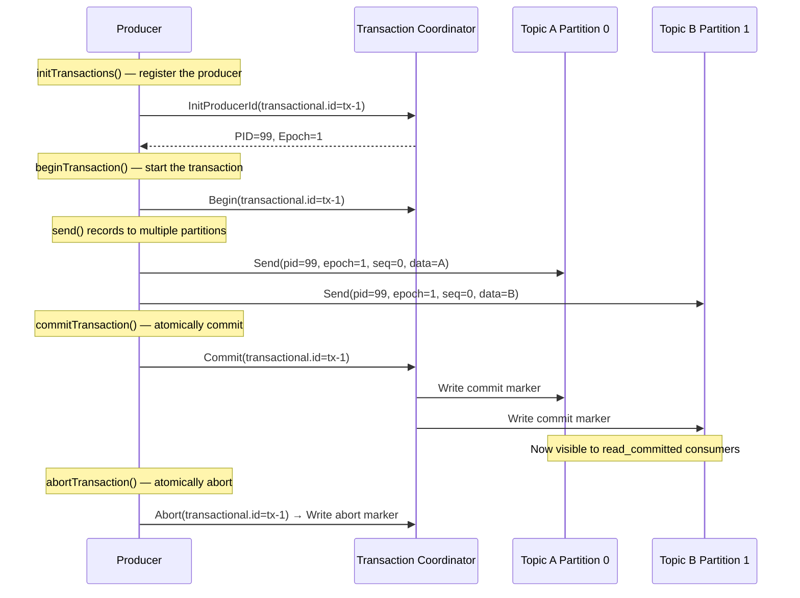

# Delivery Semantics and Exactly-Once

> [!summary] Goal
> Master Kafka's delivery semantics: at-most-once, at-least-once, exactly-once. Understand idempotent producers (sequence numbers), transactional producers (commit/abort), exactly-once in Kafka Streams, and consumer-side idempotency patterns.

## Table of Contents

1. [Three Delivery Semantics](#three-delivery-semantics)
2. [Idempotent Producer](#idempotent-producer)
3. [Transactional Producer](#transactional-producer)
4. [Exactly-Once Consumer Patterns](#exactly-once-consumer-patterns)
5. [Pitfalls](#pitfalls)

---

## Three Delivery Semantics

> [!info] Delivery semantics
> Kafka provides configurable delivery guarantees. At-most-once (messages may be lost), at-least-once (messages may be duplicated — the most common choice), and exactly-once (neither lost nor duplicated — requires coordination between producer, broker, and consumer).



| Semantic | Duplicates | Data loss | Producer config | Consumer config | Performance |
|:--------:|:----------:|:---------:|-----------------|-----------------|:-----------:|
| **At-most-once** | No | Yes | `acks=0`, no retries | Commit before processing | Highest |
| **At-least-once** | Yes | No | `acks=all`, retries | Commit after processing | High |
| **Exactly-once** | No | No | `enable.idempotence=true` + transactions | Read-process-write in transaction | Medium |

---

## Idempotent Producer

> [!info] Idempotent producer
> An idempotent producer guarantees that retries do NOT create duplicates within the Kafka cluster. The producer assigns a **monotonically increasing sequence number** per partition. The broker tracks the last 5 sequence numbers per producer ID. If a duplicate arrives, the broker silently ignores it.

```java
Properties props = new Properties();
props.put(ProducerConfig.ENABLE_IDEMPOTENCE_CONFIG, true);
// When idempotence is enabled:
// - acks is automatically set to "all" (was "1")
// - max.in.flight.requests.per.connection is set to 5 (was 1)
//   (5 concurrent requests are safe because the broker tracks sequence numbers)
// - retries is set to MAX_INT (effectively infinite)
```



### Sequence number tracking

```text
The broker maintains a per-partition-per-producer state:
  - Producer ID (PID): assigned by the broker when the producer starts
  - Epoch: incremented each time a producer is re-initialized (fencing)
  - Last 5 sequence numbers: allows broker to detect duplicates within 5 in-flight requests

Storing more than 5 sequence numbers isn't needed because:
  - max.in.flight.requests.per.connection = 5 (at most 5 unacknowledged requests)
  - If epoch changes (producer restarted), all prior state is invalidated
```

---

## Transactional Producer

> [!info] Transactional producer
> A transactional producer allows atomically writing to multiple partitions (possibly on different topics). Either ALL writes succeed or NONE are visible to consumers. Consumers with `isolation.level=read_committed` will not see records from aborted transactions.



```java
Properties props = new Properties();
props.put(ProducerConfig.BOOTSTRAP_SERVERS_CONFIG, "localhost:9092");
props.put(ProducerConfig.ENABLE_IDEMPOTENCE_CONFIG, true);
props.put(ProducerConfig.TRANSACTIONAL_ID_CONFIG, "my-transactional-id");

try (KafkaProducer<String, String> producer = new KafkaProducer<>(props)) {
    producer.initTransactions();          // Register with coordinator

    // First transaction
    producer.beginTransaction();
    try {
        producer.send(new ProducerRecord<>("orders", "order-1", "data1"));
        producer.send(new ProducerRecord<>("payments", "pay-1", "data2"));
        producer.commitTransaction();     // Both orders AND payments atomically committed
    } catch (Exception e) {
        producer.abortTransaction();
    }
}
```

### exactly_once_v2 in Kafka Streams

```java
Properties props = new Properties();
props.put(StreamsConfig.PROCESSING_GUARANTEE_CONFIG, "exactly_once_v2");
// v2 is more efficient than v1 (uses fewer transactions, lower latency)
```

---

## Exactly-Once Consumer Patterns

### Idempotent consumer (dedup table)

```java
// Store processed record IDs + commit in the same database transaction
// This is the ONLY way to achieve exactly-once end-to-end

@Transactional
public void processOrder(String orderId, OrderData data) {
    // 1. Check if this ID was already processed
    if (dedupTable.exists(orderId)) return;  // Duplicate!

    // 2. Process (insert into business tables)
    orderRepository.insert(data);

    // 3. Mark as processed (same transaction!)
    dedupTable.markProcessed(orderId);
    // Database transaction ensures both 2 and 3 succeed or fail together
}
```

### Transactional consumer (offsets in transaction)

```java
// Consume → process → produce + commit offset — all in one transaction
// Uses transactional producer + EOS consumer

KafkaConsumer<String, String> consumer = new KafkaConsumer<>(consumerProps);
KafkaProducer<String, String> producer = new KafkaProducer<>(producerProps);

producer.initTransactions();

while (true) {
    ConsumerRecords<String, String> records = consumer.poll(Duration.ofMillis(100));
    producer.beginTransaction();

    for (ConsumerRecord<String, String> record : records) {
        // 1. Read from Kafka
        String processed = process(record.value());

        // 2. Produce to output topic
        producer.send(new ProducerRecord<>("output", processed));

        // 3. Commit offset for this partition
        producer.sendOffsetsToTransaction(
            Map.of(new TopicPartition(record.topic(), record.partition()),
                   new OffsetAndMetadata(record.offset() + 1)),
            consumer.groupMetadata());
    }

    producer.commitTransaction();  // Atomically: produce + offset commit
}
```

---

## Pitfalls

### Transaction timeout too short

If a transaction takes longer than `transaction.timeout.ms` (default 60000 = 1 minute), the coordinator aborts it. For long-running batch processing, increase this timeout. Also monitor `transaction.max.timeout.ms` on the broker side — it's the maximum the producer can request.

### Coordinator failure during commit

If the transaction coordinator crashes between `beginTransaction()` and `commitTransaction()`, the new coordinator reads the transaction log (an internal topic) and either completes or aborts the pending transaction. This is safe but can delay commits by the time it takes the new coordinator to recover.

### Zombie fencing with transactional IDs

If a producer restarts with the same `transactional.id`, it gets a new epoch. The old producer's transactions (with the old epoch) are fenced (rejected). This prevents "zombie" producers from writing after a new producer has taken over. The epoch is tracked in the transaction log.

---

> [!question]- Interview Questions
>
> **Q: How does the idempotent producer prevent duplicates?**
> A: The producer assigns a monotonically increasing sequence number per record per partition. The broker tracks the last 5 sequence numbers per producer ID. If a retry arrives with a sequence number that was already committed, the broker acknowledges it without writing a duplicate. This requires `enable.idempotence=true`.
>
> **Q: What is the difference between idempotent and transactional producers?**
> A: Idempotent prevents duplicates within a single partition (sequence numbers). Transactions allow atomic writes across multiple partitions and topics — either all partitions see the write or none do. Transactions build on idempotence (require `enable.idempotence=true`) and add a coordinator that manages commit/abort markers and fencing.
>
> **Q: How do you achieve exactly-once end-to-end?**
> A: The ONLY reliable way is: store the processing result and the Kafka offset in the same transactional store (e.g., same database transaction). Read from Kafka → process → write result + mark offset in same DB transaction → commit. If the consumer crashes before committing, the DB rolls back, and the record is reprocessed. This avoids the dual-write problem (writing to DB and committing offset in separate operations).

---

## Cross-Links

- [[CICD/Kafka/01_Foundations/03_Producers_Deep_Dive]] for producer config basics
- [[CICD/Kafka/01_Foundations/04_Consumers_Deep_Dive]] for consumer offset management
- [[CICD/Kafka/04_Playbooks/01_Troubleshoot_Consumer_Lag]] for lag with EOS consumers
- [[CICD/Kafka/05_Projects/01_Exactly_Once_Pipeline_With_Idempotent_Consumers]] for full EOS project
