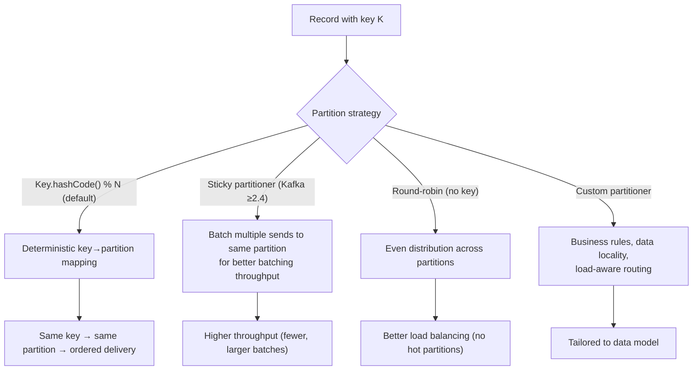
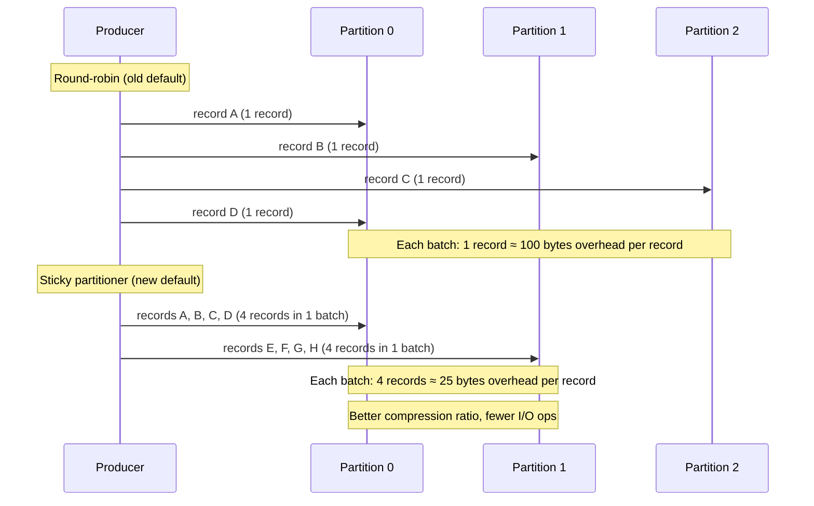

# Partitioning Strategies

> [!summary] Goal
> Master Kafka partitioning: default partitioners (sticky, round-robin), custom partitioners, partition key design, data locality, hot-spot avoidance, and common partitioning patterns.

## Table of Contents

1. [Why Partitioning Matters](#why-partitioning-matters)
2. [Default Partitioners](#default-partitioners)
3. [Custom Partitioner](#custom-partitioner)
4. [Key Design Patterns](#key-design-patterns)
5. [Pitfalls](#pitfalls)

---

## Why Partitioning Matters

> [!info] Partitioning
> Partitioning determines which partition a record is written to. This directly affects: **ordering** (records with the same key go to the same partition, maintaining order), **parallelism** (consumers = min(partitions, consumer count)), **storage balancing** (leader distribution), and **performance** (hot partitions vs even distribution).



---

## Default Partitioners

### Sticky Partitioner (Kafka ≥ 2.4, default)

> [!info] Sticky partitioner
> Instead of round-robin (one record per partition per batch), the sticky partitioner sends many records to the same partition before switching. This creates fewer, larger batches — reducing per-batch overhead and improving compression ratios. It's the default when `batch.size` > 0 and no key is provided.

```java
// Behavior when key is null (Kafka ≥ 2.4):
// 1. Pick a random partition
// 2. Write multiple records to it (up to linger.ms or batch.size)
// 3. Switch to another random partition
// This is called "sticky" — it sticks to one partition for a while

Properties props = new Properties();
// sticky partitioner can be tuned indirectly:
props.put(ProducerConfig.LINGER_MS_CONFIG, 5);           // How long to wait (5ms)
props.put(ProducerConfig.BATCH_SIZE_CONFIG, 16384);      // Max batch size (16 KB)
props.put(ProducerConfig.COMPRESSION_TYPE_CONFIG, "snappy"); // Compression (works better with sticky)
```



### Round-robin (Kafka < 2.4, or explicitly requested)

```text
For < 2.4 or when key is null:
  partition = counter.incrementAndGet() % numPartitions

  Each record is sent to the next partition in sequence.
  This creates many small batches (one per partition per send),
  reducing throughput due to per-batch overhead.
```

---

## Custom Partitioner

> [!info] Custom partitioner
> Implement the `Partitioner` interface to route records based on business logic: data gravity (keep related data together), geo-location (route to region-local partition), load-aware routing (avoid hot partitions), or semantic grouping (orders from the same customer in the same partition).

```java
import org.apache.kafka.clients.producer.Partitioner;
import org.apache.kafka.common.Cluster;
import org.apache.kafka.common.PartitionInfo;

import java.util.List;
import java.util.Map;

/**
 * Partitions orders by customer tier:
 *   - VIP customers → first partition (dedicated, faster consumer)
 *   - Regular customers → hash by customerId across remaining partitions
 *
 * Why: VIP customers need priority processing. Regular customers get
 * fair distribution. Without this, a single high-volume VIP customer
 * could flood one partition and delay other customers.
 */
public class CustomerTierPartitioner implements Partitioner {

    private String vipPrefix;

    @Override
    public void configure(Map<String, ?> configs) {
        // Read custom config from producer properties
        this.vipPrefix = (String) configs.get("vip.customer.prefix");
    }

    @Override
    public int partition(String topic, Object key, byte[] keyBytes,
                         Object value, byte[] valueBytes, Cluster cluster) {
        List<PartitionInfo> partitions = cluster.partitionsForTopic(topic);
        int numPartitions = partitions.size();

        if (numPartitions < 2) return 0; // Not enough partitions for VIP routing

        String keyStr = (String) key;

        if (keyStr != null && keyStr.startsWith(vipPrefix)) {
            // VIP customers go to partition 0 (always!)
            return 0;
        }

        // Regular customers: hash across remaining partitions (1..N-1)
        int regularPartitions = numPartitions - 1;
        return 1 + Math.abs(keyStr.hashCode()) % regularPartitions;
    }

    @Override
    public void close() {}
}

// Producer configuration
Properties props = new Properties();
props.put(ProducerConfig.PARTITIONER_CLASS_CONFIG, CustomerTierPartitioner.class.getName());
props.put("vip.customer.prefix", "VIP-");
```

### Partition-aware producer: checking partition count at runtime

```java
// Some partitioners need to know the partition count to distribute evenly.
// Use cluster.partitionsForTopic(topic).size() in partition() — 
// but cache it to avoid repeated metadata lookups.
```

---

## Key Design Patterns

### Data locality (co-partitioning)

```text
When joining two topics in Kafka Streams, records with the same key
must be in the same partition. This requires:

  1. Both topics have the same number of partitions
  2. Both use the same partitioning strategy (same key hashing)

Kafka Streams enforces this automatically for co-partitioned joins.
If partition counts don't match, Kafka Streams throws an error at startup.
```

### Avoiding hot partitions

```text
A "hot partition" has more traffic than others. Common causes:

  1. All records have the same key (e.g., "default" or null)
     → Fix: add a salt prefix (e.g., "user-1", "user-2") or use sticky partitioner
     
  2. A single high-volume customer dominates one partition
     → Fix: custom partitioner that balances across partitions, OR
       split the customer into sub-keys (e.g., "customer-1-page-1", "customer-1-page-2")
       
  3. Partition count is too low for throughput
     → Fix: increase partition count (but this changes ordering guarantees!)
```

### Ordering vs parallelism trade-off

```text
More partitions = more parallelism but less ordering scope:
  - 1 partition: fully ordered. 1 consumer. 100 MB/s max.
  - 6 partitions: ordered within each partition. 6 consumers. 600 MB/s max.
  - 100 partitions: ordered within each partition. 100 consumers. 10 GB/s max.

Choose partition count based on:
  - Throughput requirement (MB/s needed / single-consumer throughput)
  - Ordering needs (can you re-order at read time?)
  - Consumer group size (max consumers = partitions)
  - Regulatory concern (partition count is immutable for existing topic)
```

---

## Pitfalls

### Changing partition count breaks ordering

You cannot change partition count on an existing topic (except by deleting/recreating). If you need more partitions, you create a new topic and migrate. Changing partition count also changes the `key.hashCode() % N` mapping — records with the same key now go to different partitions, breaking ordering guarantees.

### Custom partitioner is not used for Kafka Streams internal topics

Kafka Streams manages its own partitioning for internal topics (changelog, repartition) using its own `StreamsPartitioner`. Custom `ProducerConfig.PARTITIONER_CLASS_CONFIG` is ignored by Streams internal producers. Use `StreamsConfig` partitioner configs instead (Streams 3.x+).

### Sticky partitioner with very low `linger.ms`

If `linger.ms` is set to 0, the sticky partitioner can't actually "stick" — it sends immediately. This causes many small batches (one batch per send) and negates the benefit. Keep `linger.ms` at least 1-5ms for sticky to work.

---

> [!question]- Interview Questions
>
> **Q: How does the sticky partitioner improve throughput?**
> A: Instead of round-robin (send one record per partition, then switch), the sticky partitioner sends multiple records to the same partition before switching. This creates fewer, larger batches, reducing per-batch overhead (TCP connections, acks, compression dictionaries). Compression ratios improve because more similar data is batched together. Kafka 2.4+ uses the sticky partitioner by default when no key is provided.
>
> **Q: When would you need a custom partitioner?**
> A: When the default hash-based partitioning doesn't match your data model. Examples: geo-location routing (all EU data to partition 0-2, US data to 3-5), customer-tier routing (VIP customers get dedicated low-latency partitions), data locality (related entities must co-exist in the same partition for joins), or load-aware routing to avoid hot partitions caused by key skew.

---

## Cross-Links

- [[CICD/Kafka/01_Foundations/02_Topics_Partitions_and_Offsets]] for partition fundamentals
- [[CICD/Kafka/01_Foundations/03_Producers_Deep_Dive]] for producer batching and config
- [[CICD/Kafka/02_Core/01_Delivery_Semantics_and_Exactly_Once]] for EOS + partitioning
- [[CICD/Kafka/02_Core/03_Consumer_Group_Rebalancing]] for partition assignment strategies
