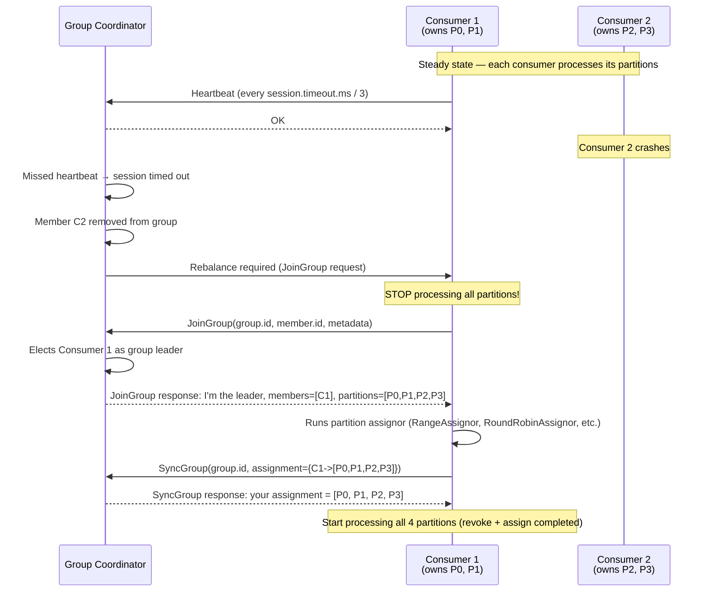
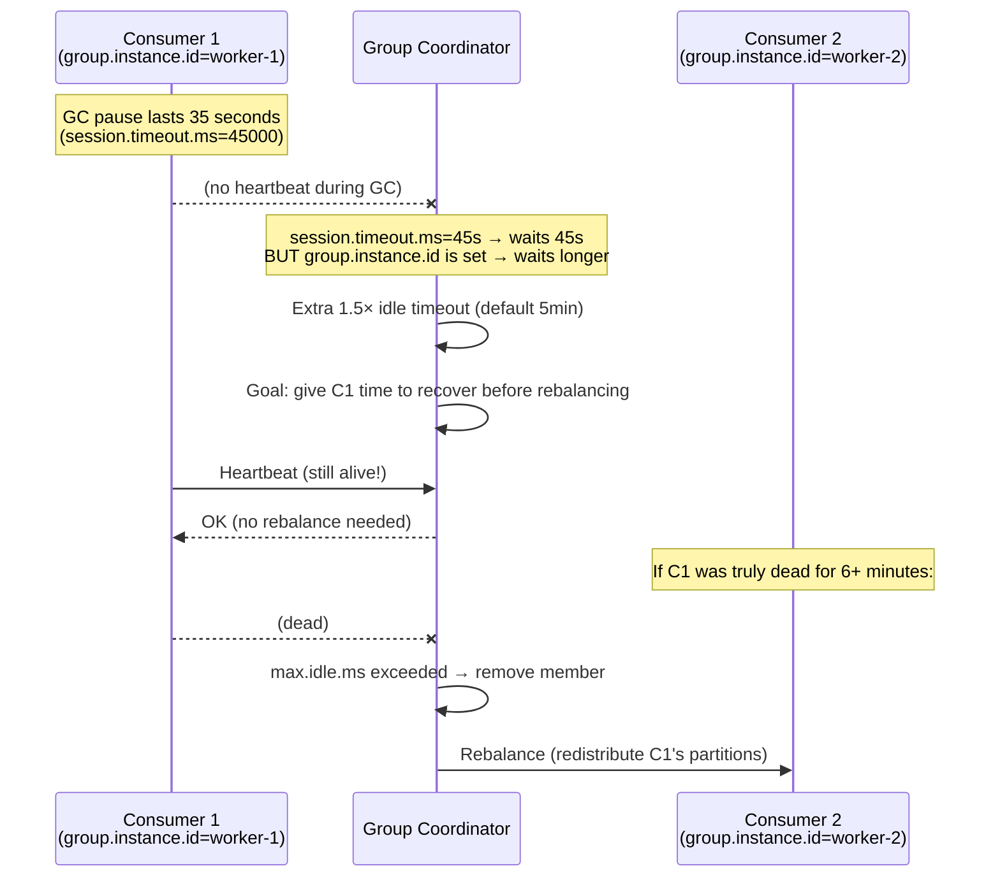

# Consumer Group Rebalancing

> [!summary] Goal
> Understand Kafka consumer group rebalancing: the rebalance protocol, eager vs cooperative rebalance, static group membership, partition assignment strategies, and how to minimize rebalance impact.

## Table of Contents

1. [Rebalance Protocol](#rebalance-protocol)
2. [Assignment Strategies](#assignment-strategies)
3. [Eager vs Cooperative Rebalance](#eager-vs-cooperative-rebalance)
4. [Static Group Membership](#static-group-membership)
5. [Minimizing Rebalance Impact](#minimizing-rebalance-impact)
6. [Pitfalls](#pitfalls)

---

## Rebalance Protocol

> [!info] Rebalance
> A rebalance is the process where Kafka redistributes partition ownership among members of a consumer group. This happens when: a consumer joins/leaves the group, a consumer is detected as failed (session timeout), new partitions are added to a topic, or the group subscription changes.



### Consumer lifecycle states

```text
A consumer goes through these states during rebalance:

  STABLE           → REBALANCE_IN_PROGRESS →  COMPLETING_REBALANCE  → STABLE
  (processing)        (stop processing)        (new assignment)       (processing)

  - REBALANCE_IN_PROGRESS: consumer stops processing, revokes partitions
  - COMPLETING_REBALANCE: consumer receives its new assignment, starts fetching
  - If a consumer's session times out → group enters REBALANCE_IN_PROGRESS
```

---

## Assignment Strategies

> [!info] Partition assignment
> The group leader runs an assignment strategy to decide which consumer gets which partitions. The strategy is configured via `partition.assignment.strategy`. Different strategies trade off evenness, stickiness, and rebalance cost.

| Strategy | Rebalance type | Stickiness | Evenness | Use case |
|:--------:|:--------------:|:----------:|:--------:|----------|
| **RangeAssignor** | Eager (stop-the-world) | Poor | Good | Default (< 3.0). Per-topic: partitions[0..N] → consumer[0]. High churn |
| **RoundRobinAssignor** | Eager (stop-the-world) | Good | Best | Even distribution across all subscribed topics. Good for multi-topic subscriptions |
| **StickyAssignor** | Eager (stop-the-world) | Best | Good | Minimizes partition movement across rebalances. Preferred (3.0 default) |
| **CooperativeStickyAssignor** | Cooperative (incremental) | Best | Good | **Recommended for production**. No stop-the-world. Partitions stay until explicitly revoked |

### CooperativeStickyAssignor (Kafka ≥ 2.4)

```text
This is the most production-ready assignor. Benefits:
  - No stop-the-world: consumers keep processing partitions that aren't being revoked
  - Minimal partition movement: keeps as many partitions as possible on current owners
  - Incremental: rebalance happens in multiple rounds (revoke → assign → maybe revoke again)

Configure:
  props.put(ConsumerConfig.PARTITION_ASSIGNMENT_STRATEGY_CONFIG,
            CooperativeStickyAssignor.class.getName());
```

---

## Eager vs Cooperative Rebalance

> [!info] Eager vs Cooperative
> **Eager** (stop-the-world): all consumers revoke ALL partitions, then get reassigned. Simple but causes a global pause during rebalance. **Cooperative** (incremental): consumers only revoke partitions that need to move. Most consumers keep processing during rebalance. Multiple short rounds instead of one long pause.

```mermaid
flowchart TD
    subgraph "Eager Rebalance (stop-the-world)"
        A1["Consumer 1 owns [P0, P1]"] --> A2["Consumer 2 joins group"]
        A2 --> A3["REVOKE ALL partitions!"]
        A3 --> A4["[All consumers stop processing]"]
        A4 --> A5["Reassign: C1=[P0,P1,P2], C2=[...]"]
        A5 --> A6["All consumers resume"]
    end

    subgraph "Cooperative Rebalance (incremental)"
        B1["C1 owns [P0,P1,P2,P3,P4,P5]"] --> B2["C2 joins group"]
        B2 --> B3["C1: revoke P3,P4,P5 (keep P0,P1,P2)"]
        B3 --> B4["C1 continues processing P0,P1,P2<br/>while C2 takes P3,P4,P5"]
        B4 --> B5["Done in 1 round (or more if needed)"]
    end
```



```text
Eager (stop-the-world):
  - Time: revoke(3s) + assign(2s) = 5s total pause for ALL consumers
  - All processing stops → messages pile up → lag spikes
  - Simple to implement (consumer starts fresh)

Cooperative (incremental):
  - Time: revoke part(1s) + assign(2s) = 3s, but only affected partitions pause
  - 50% of consumers may never stop processing
  - Requires consumer to handle partial revocation (revoke callback fires for subset)
```

---

## Static Group Membership

> [!info] Static group membership
> By default, consumers have dynamic membership — rebalance triggers when a consumer disconnects, even briefly (e.g., GC pause). Static membership (`group.instance.id`) makes the coordinator wait longer for a known consumer before triggering rebalance. The coordinator reserves the consumer's partitions for up to `session.timeout.ms * 1.5`.

```java
Properties props = new Properties();
props.put(ConsumerConfig.GROUP_INSTANCE_ID_CONFIG, "consumer-instance-1");
// Each consumer gets a unique, stable ID
// On restart: consumer re-joins with the same ID → coordinator doesn't rebalance
// It simply hands back the old partitions

// Combine with cooperative rebalancing for maximum stability:
props.put(ConsumerConfig.PARTITION_ASSIGNMENT_STRATEGY_CONFIG,
          CooperativeStickyAssignor.class.getName());
```



---

## Minimizing Rebalance Impact

```properties
# Recommended config for production (minimizes rebalance frequency + impact)

# Session timeout: how long before coordinator declares consumer dead
# Higher = more tolerance for GC pauses, longer rebalance detection
session.timeout.ms=45000          # Default: 45000 (45s)

# Heartbeat interval: how often consumer sends heartbeats
# Lower = faster rebalance detection, higher network churn
heartbeat.interval.ms=15000       # Default: 3000 (3s)

# Max poll interval: max time between poll() calls
# Higher = more time for processing, longer rebalance detection
max.poll.interval.ms=300000       # Default: 300000 (5 min)

# Static group membership: avoid rebalance on restart
group.instance.id=consumer-${HOSTNAME}

# Cooperative rebalancing: no stop-the-world
partition.assignment.strategy=org.apache.kafka.clients.consumer.CooperativeStickyAssignor
```

### Rebalance detection time

```text
Total time to detect a dead consumer:

  WITHOUT static membership:
    heartbeat.interval.ms × 3 = session.timeout.ms  (e.g., 15s × 3 = 45s)
    After timeout: coordinator triggers immediate rebalance

  WITH static membership:
    session.timeout.ms + group.idle.max.ms  (e.g., 45s + 300s = ~6 min)
    Coordinator waits for the static member to rejoin before rebalancing

  Choose based on:
    - Short-lived interruptions (GC, rolling restart): prefer static + long timeout
    - Fast failover (can't afford 6 min lag): prefer dynamic + short timeout
```

---

## Pitfalls

### Rebalance storm (all consumers restart simultaneously)

If all consumers in a group restart at the same time (e.g., during a deployment), the group coordinator sees all members leave and rejoin in quick succession. Each join triggers a rebalance (with eager: stop-the-world). This can cause repeated rebalances for minutes.

**Fix**: Use rolling restarts (one consumer at a time) with static group membership. The coordinator keeps partitions assigned to the restarting consumer and hands them back without rebalance.

### Processing time exceeds max.poll.interval.ms

If processing a batch of records takes longer than `max.poll.interval.ms`, the consumer hasn't called `poll()` in time. The coordinator assumes the consumer is stuck and removes it from the group, triggering a rebalance.

**Fix**: Use `ConsumerFactory.unbounded()` or adjust `max.poll.interval.ms` to match worst-case processing time. Alternatively, use `pause()` to stop fetching while processing.

### Cooperative rebalance with old consumer

If one consumer in the group uses `CooperativeStickyAssignor` but another uses `RangeAssignor`, the coordinator rejects the group because all members must use the **same** assignor. This causes a "failed to rebalance" error.

---

> [!question]- Interview Questions
>
> **Q: What is the difference between eager and cooperative rebalancing?**
> A: Eager stops ALL consumers, revokes ALL partitions, then reassigns everything. Cooperative revokes only the partitions that need to move, in multiple rounds. Most consumers keep processing during cooperative rebalance. Cooperative requires `CooperativeStickyAssignor` and consumer code that handles `onPartitionsRevoked()` for a subset of partitions.
>
> **Q: How does static group membership help with rebalances?**
> A: With `group.instance.id`, the coordinator reserves the consumer's partitions for a longer period (`group.idle.max.ms`, default 5 min) even if the consumer disconnects. When the consumer restarts with the same ID, it gets its old partitions back without a rebalance. This eliminates unnecessary rebalances during rolling deployments or short GC pauses.
>
> **Q: What causes a rebalance storm and how to prevent it?**
> A: All consumers restarting simultaneously triggers repeated rebalances as the group forms and reforms. Prevent with: (1) rolling restarts (one at a time), (2) static group membership (`group.instance.id`), (3) cooperative rebalancing, (4) adequate `session.timeout.ms`.

---

## Cross-Links

- [[CICD/Kafka/01_Foundations/04_Consumers_Deep_Dive]] for consumer config and offset management
- [[CICD/Kafka/02_Core/02_Partitioning_Strategies]] for partition assignment trade-offs
- [[CICD/Kafka/04_Playbooks/01_Troubleshoot_Consumer_Lag]] for lag during rebalances
- [[CICD/Kafka/03_Advanced/A00_Storage_and_Replication_Internals]] for leader election protocol
