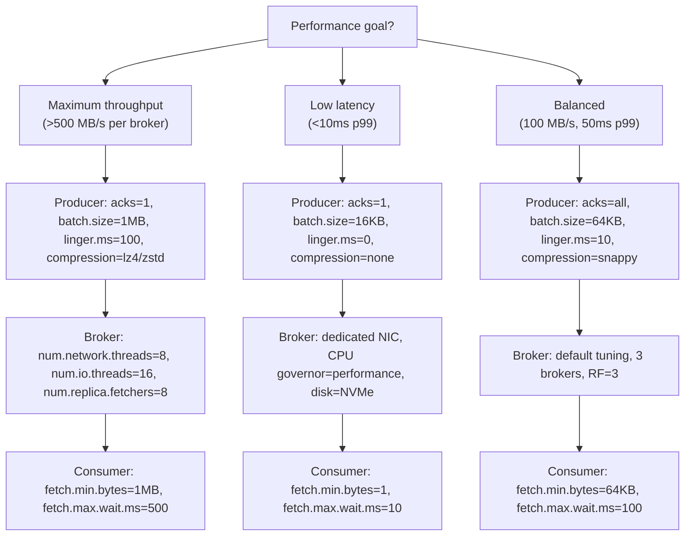

# Performance Tuning

> [!summary] Goal
> Optimize Kafka throughput, latency, and resource utilization — broker config, producer tuning, consumer tuning, OS tuning, compression trade-offs, and benchmarking methodology.

## Table of Contents

1. [Performance Dimensions](#performance-dimensions)
2. [Broker Tuning](#broker-tuning)
3. [Producer Tuning](#producer-tuning)
4. [Consumer Tuning](#consumer-tuning)
5. [OS and Network Tuning](#os-and-network-tuning)
6. [Benchmarking](#benchmarking)
7. [Pitfalls](#pitfalls)

---

## Performance Dimensions

> [!info] Performance dimensions
> Kafka performance has three dimensions: **throughput** (MB/s or records/s), **latency** (p99 end-to-end delivery time), and **durability** (acks, replication factor). Tuning involves trade-offs — improving one often worsens another.



---

## Broker Tuning

```properties
# server.properties — broker performance tuning

# Network threads: handles incoming connections
# Rule of thumb: num.network.threads = CPU cores × 2
num.network.threads=8

# I/O threads: handles disk reads/writes
# Rule of thumb: num.io.threads = CPU cores × 4
num.io.threads=16

# Replica fetcher threads: handles replication from leader to follower
# Increase for high-throughput replication
num.replica.fetchers=4

# Compression: compress messages on the broker
# Only useful when producers send uncompressed data
compression.type=producer        # Use whatever the producer set

# Log segment size: larger = fewer segments, more sequential I/O
# Smaller = faster cleanup, more files
log.segment.bytes=1073741824     # 1 GB (default)

# Log retention: how long to keep data
log.retention.hours=168          # 7 days (default)

# Cleanup policy: delete (time/space based) or compact (key-based)
log.cleanup.policy=delete

# Background threads for log compaction
log.cleaner.threads=2

# Unclean leader election: can replicas become leader if not in-sync?
# false = stronger durability, lower availability
unclean.leader.election.enable=false

# JVM heap: 6-8 GB for moderate workloads, 16-32 GB for heavy
# KAFKA_HEAP_OPTS="-Xmx16g -Xms16g"
```

### Page cache tuning

```text
Kafka reads/writes from/to the OS page cache, not directly from disk.
This means:
  - More free memory → more page cache → faster reads
  - Kafka's JVM heap should be MINIMAL (6-8 GB) — leave rest for page cache
  - A broker with 64 GB RAM: heap=8 GB, page cache=56 GB
  - Page cache holds recently written/read data — avoids disk I/O for hot data

  Best practice: don't let Kafka share memory with other apps.
  Dedicate the machine to Kafka so page cache is maximized.
```

### Disk layout

```text
Kafka uses sequential I/O — but multiple topics writing simultaneously
causes random I/O on a single disk.

  - Use multiple disks (JBOD or RAID-0, NOT RAID-5/6 — too slow for writes)
  - Mount each disk at a separate path: /data/kafka-1, /data/kafka-2, ...
  - Set log.dirs=/data/kafka-1,/data/kafka-2 (comma-separated)
  - Kafka distributes partitions across disks based on directory count
  - RAID-10 for redundancy + performance
  - NVMe > SSD > HDD (by far)
```

---

## Producer Tuning

```properties
# Producer config — throughput vs latency

# acks: number of replicas that must acknowledge
#   acks=0: fastest, can lose data
#   acks=1: leader only (good throughput, some risk)
#   acks=all: strongest durability (slower)
acks=all

# Compression: reduces network + storage, increases CPU
#   none (no compression): lowest CPU, highest network
#   gzip: highest compression, highest CPU (good for text, slow)
#   snappy: moderate compression, low CPU (good default)
#   lz4: moderate compression, very low CPU (recommended)
#   zstd: best compression, moderate CPU (Kafka ≥ 2.1)
compression.type=snappy

# Batching parameters (throughput vs latency trade-off)
batch.size=65536          # 64 KB. Larger batches = higher throughput, higher latency
linger.ms=5               # Wait up to 5ms before sending a batch
buffer.memory=33554432    # 32 MB. Total memory for buffered sends

# Retries: idempotent producer retries indefinitely
enable.idempotence=true

# Request timeout: how long to wait for ack
request.timeout.ms=30000  # 30s

# Max in-flight requests per connection
# With enable.idempotence=true: max=5 (safe)
# Without idempotence: max=1 to prevent reordering
max.in.flight.requests.per.connection=5

# If you prioritize throughput over latency:
# batch.size=1048576      # 1 MB
# linger.ms=100            # 100ms
# compression.type=zstd    # Best compression

# If you prioritize latency over throughput:
# batch.size=16384         # 16 KB
# linger.ms=0              # Send immediately
# compression.type=none    # No compression
```

### Throughput vs latency trade-off

```text
The producer's main trade-off: how long to wait before sending a batch.

linger.ms=0:
  - Send immediately when batch is full OR buffer.ready condition is met
  - Lowest latency (milliseconds)
  - Lower throughput (many small batches, more overhead)

linger.ms=100:
  - Wait up to 100ms for batch to fill
  - Higher latency (100ms add to end-to-end)
  - Higher throughput (fewer, larger batches, better compression)

Best practice: set linger.ms to the maximum acceptable latency added.
  If your app needs 50ms p99 end-to-end, set linger.ms ≤ 10ms.
```

---

## Consumer Tuning

```properties
# Consumer config — fetch size, throughput, latency

# Fetch parameters:
fetch.min.bytes=1             # Minimum data per fetch (1 byte = immediate return)
fetch.max.wait.ms=500         # Max time before returning (500ms)
fetch.max.bytes=52428800      # 50 MB. Max data per fetch request
max.partition.fetch.bytes=1048576  # 1 MB. Max per-partition fetch

# For throughput:
# fetch.min.bytes=1048576     # Wait for 1 MB before returning
# fetch.max.wait.ms=1000      # Or at most 1 second

# For latency:
# fetch.min.bytes=1           # Return immediately
# fetch.max.wait.ms=10        # Or wait 10ms max

# Processing
max.poll.records=500          # Max records per poll() call
max.poll.interval.ms=300000   # 5 min max between polls (including processing time)

# Offset commit
enable.auto.commit=false      # Manual commit recommended for production
auto.offset.reset=earliest    #
```

### Prefetching strategy

```text
How the consumer fetch loop works:
  1. Send FetchRequest to broker for all assigned partitions
  2. Broker responds with data (up to fetch.max.bytes or max.partition.fetch.bytes)
  3. Consumer returns data on poll()
  4. While the consumer processes, it sends the next FetchRequest
     (pipelining — always one in-flight fetch per partition)

This means:
  - Consumer is always fetching while processing
  - No idle time between batches
  - Processing slower than fetching → data piles up in consumer's buffer
```

---

## OS and Network Tuning

```bash
# OS tuning for Kafka (sysctl.conf)

# Increase max open files (Kafka opens many file handles)
# In /etc/security/limits.conf:
# kafka soft nofile 100000
# kafka hard nofile 100000

# Network tuning
net.core.rmem_max = 16777216        # 16 MB receive buffer
net.core.wmem_max = 16777216        # 16 MB send buffer
net.ipv4.tcp_rmem = 4096 87380 16777216   # TCP read buffer
net.ipv4.tcp_wmem = 4096 65536 16777216   # TCP write buffer
net.core.netdev_max_backlog = 5000       # Backlog for incoming packets

# File system: mount with noatime (disable access time tracking)
# /dev/nvme0n1 /data/kafka ext4 defaults,noatime 0 0

# Disable swap (Kafka should use page cache, not swap)
vm.swappiness = 1

# Increase dirty page limits (more buffered writes before flushing)
vm.dirty_background_ratio = 10
vm.dirty_ratio = 40
```

---

## Benchmarking

```bash
# Kafka ships with kafka-producer-perf-test and kafka-consumer-perf-test

# 1. Create a topic with the right partition count
kafka-topics.sh --bootstrap-server localhost:9092 \
  --create --topic perf-test --partitions 6 --replication-factor 3

# 2. Producer benchmark (throughput test)
kafka-producer-perf-test.sh \
  --topic perf-test \
  --num-records 10000000 \
  --record-size 1024 \
  --throughput -1 \            # -1 = max throughput (no throttling)
  --producer-props \
    bootstrap.servers=localhost:9092 \
    acks=1 \
    batch.size=65536 \
    linger.ms=5 \
    compression.type=snappy \
    buffer.memory=67108864

# Sample output:
# 10000000 records sent, 250000.0 records/sec (244.14 MB/sec),
#   1.50 ms avg latency, 12.30 ms max latency, 2.10 ms 50th, 4.50 ms 95th, 8.20 ms 99th

# 3. Consumer benchmark
kafka-consumer-perf-test.sh \
  --topic perf-test \
  --messages 10000000 \
  --broker-list localhost:9092 \
  --group perf-group

# Sample output:
# start.time, end.time, data.consumed.in.MB, MB.sec,
#   data.consumed.in.nMsg, nMsg.sec, rebalance.time.ms, fetch.time.ms
# 2024-01-01, 2024-01-01, 9765.63, 488.28, 10000000, 250000.0, 500, 39500
```

### What to benchmark

```text
1. End-to-end throughput (producer → broker → consumer)
   - Use kafka-producer-perf-test + kafka-consumer-perf-test
   - Test with different message sizes (100B, 1KB, 10KB, 100KB)
   - Test with different acks values (0, 1, all)

2. Latency under load
   - Measure p50, p95, p99, p999 latency while producing at 80% max throughput
   - Latency usually spikes near throughput limits (queueing theory)
   - Monitor GC pauses (Young GC, Full GC) during the test

3. Rebalance time
   - Start N consumers, measure time from consumer join → partition assignment
   - Test with static vs dynamic membership
   - Test with eager vs cooperative rebalancing

4. Disk I/O under sustained load
   - Monitor iostat, disk queue depth, disk utilization
   - Kafka's sequential I/O should show high write throughput
   - If disk is 100% busy → add more disks or partitions
```

---

## Pitfalls

### Too many partitions hurts performance

More partitions = more parallelism but also more overhead. Each partition has: a leader/follower pair, its own log segment files, its own in-memory index. At 10,000+ partitions per broker, broker performance degrades due to file descriptor limits, memory pressure (index caching), and request overhead (each fetch touches more partitions).

**Rule of thumb**: max partitions per broker = 4000 (recommended: 2000). Monitor file descriptors (`lsof | wc -l`). 100,000 partitions is possible but requires significant tuning.

### Linger.ms=0 and compression don't mix

When `linger.ms=0`, the producer sends each batch immediately. Compression on a single-record batch is useless — the compressed output may be larger than the input. If you need low latency and compression, use `linger.ms=5` (or higher) to accumulate enough records for meaningful compression.

### Page cache poisoning by consumer

A consumer that reads old data (days old) forces Kafka to read from disk instead of page cache. This "poisons" the page cache — new hot data may evict old data, causing disk reads for other consumers. Separate consumer clusters for real-time and batch processing, or set `log.retention.bytes` to limit old data.

---

> [!question]- Interview Questions
>
> **Q: How do you tune Kafka for maximum throughput vs lowest latency?**
> A: For max throughput: `acks=1`, `batch.size=1MB`, `linger.ms=100`, `compression=zstd`, `num.io.threads=16+`, dedicate the machine to Kafka with NVMe disks, use multiple disks (JBOD). For lowest latency: `acks=1` (or 0), `batch.size=16KB`, `linger.ms=0`, `compression=none`, CPU governor=performance, use a separate NIC with IRQ affinity.
>
> **Q: Why does Kafka use the OS page cache instead of its own cache?**
> A: The OS page cache provides: (1) automatic memory management — free memory is automatically used as cache, (2) no GC overhead (C-based page cache), (3) all processes share a single cache, (4) on restart, the cache is still warm (Kafka process restarts, but OS page cache persists), (5) zero-copy transfer from page cache to network socket. All of these make page cache more efficient than an in-process cache.

---

## Cross-Links

- [[CICD/Kafka/01_Foundations/03_Producers_Deep_Dive]] for producer configuration
- [[CICD/Kafka/01_Foundations/04_Consumers_Deep_Dive]] for consumer configuration
- [[CICD/Kafka/03_Advanced/A00_Storage_and_Replication_Internals]] for disk/segment internals
- [[CICD/Kafka/04_Playbooks/03_Performance_Optimization_Playbook]] for practical step-by-step optimization
