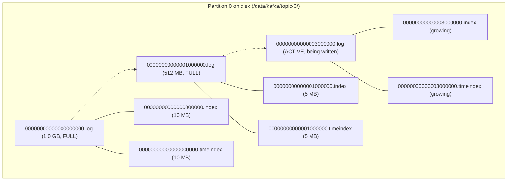
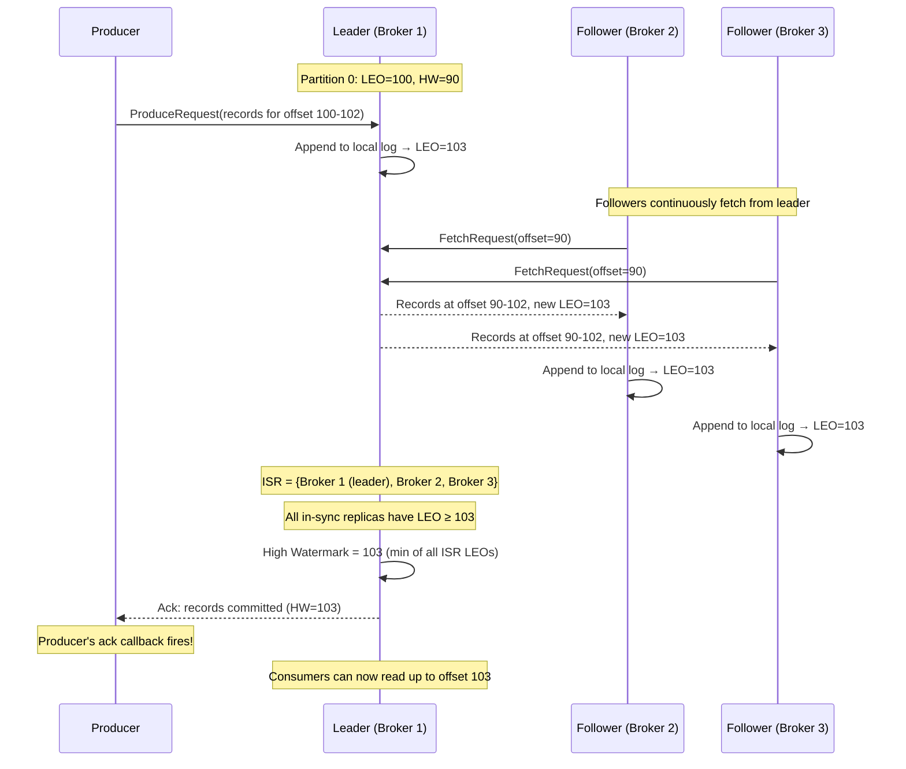
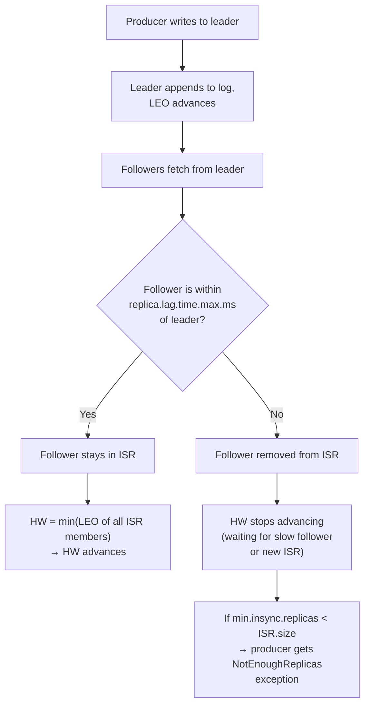

# Storage and Replication Internals

> [!summary] Goal
> Deep-dive into Kafka's storage engine (segment files, index files, compaction) and replication protocol (leader/follower, ISR, high watermark, LSO/Epoch, fetch request mechanics). Covers exactly how data flows from producer acknowledgment to consumer visibility.

## Table of Contents

1. [Log Segment Internals](#log-segment-internals)
2. [Replication Protocol](#replication-protocol)
3. [ISR and High Watermark](#isr-and-high-watermark)
4. [Log Compaction](#log-compaction)
5. [Cache and Zero-Copy](#cache-and-zero-copy)
6. [Pitfalls](#pitfalls)

---

## Log Segment Internals

> [!info] Log segment
> A partition's data is split into **segment files** on disk. Each segment is a pair of files: `<base_offset>.log` (the data), `<base_offset>.index` (offset-to-position mapping), and `<base_offset>.timeindex` (timestamp-to-offset mapping). Only the **active segment** (the last one) accepts new writes; older segments are read-only.



### Segment naming

```text
Segment file name = the base offset (the offset of the first record in the segment),
padded to 20 digits with leading zeros.

Examples:
  00000000000000000000.log  →  first record at offset 0
  00000000000001000000.log  →  first record at offset 1,000,000
  00000000000003000000.log  →  first record at offset 3,000,000

The base offset allows Kafka to find the right segment by binary search
over segment file names (listing the directory and comparing names).
```

### Index file (.index) — sparse offset → position map

```text
The index file stores (offset, position) pairs. It is SPARSE — one entry
per ~4096 bytes of log data (config: log.index.interval.bytes).

Index entry format (8 bytes per entry):
  [relative_offset: 4 bytes] [position: 4 bytes]

  relative_offset = absolute_offset - segment_base_offset
  position = byte offset within the .log file

Example:
  Segment base offset: 0
  Index entries:
    [0,    0]        → record at offset 0 starts at byte 0
    [5000, 4194304]  → record at offset 5000 starts at byte 4,194,304
    [10000, 8388608] → record at offset 10000 starts at byte 8,388,608

Lookup offset 7500:
  1. Binary search index → nearest entry ≤ 7500 is [5000, 4194304]
  2. Seek to byte 4,194,304 in the .log file
  3. Scan forward (sequential read) until record at offset 7500 is found
  → ~4MB of scanning (worst case if log.index.interval.bytes = 4096)

Worst case scan distance = log.segment.bytes / (bytes per index entry) × log.index.interval.bytes
  = 1 GB / 8 bytes × 4096 bytes ≈ 512 KB average scan
```

### Time index (.timeindex) — timestamp → offset

```text
Same sparse structure as .index but maps timestamps to offsets.

Entry format (12 bytes):
  [timestamp: 8 bytes] [relative_offset: 4 bytes]

Lookup "give me records after timestamp T":
  1. Binary search .timeindex → nearest entry with timestamp ≥ T
  2. Get the corresponding offset
  3. Use .index to find the position in .log
  4. Scan forward until the first record with timestamp ≥ T
```

---

## Replication Protocol

> [!info] Replication protocol
> Kafka replicates each partition across multiple brokers (replication factor). One broker is the **leader** (handles all produce/consume requests). The others are **followers** (replicate data from the leader). Followers send FetchRequests to the leader, just like consumers — this is called "follower fetching."



### Follower fetch loop

```scala
// Simplified follower logic (Kafka source: ReplicaFetcherThread)
while (true) {
    val response = leaderBroker.fetch(
        replicaId = thisBrokerId,
        fetchOffset = localLogEndOffset
    )
    response.records.foreach { recordBatch =>
        localLog.append(recordBatch)
        // Update local LEO
    }
    // After fetching, the follower sends a new FetchRequest
    // with the updated fetchOffset (its new LEO)
}
```

### Replica Manager — LEO, HW, ISR tracking

```text
Each broker's ReplicaManager maintains per-partition:
  - LEO (Log End Offset): the offset of the last record written to the local log
  - HW (High Watermark): the offset up to which ALL ISR replicas have replicated
  - ISR (In-Sync Replicas): the set of replicas that are "caught up" with the leader

HW update rule:
  HW = min(leader.LEO, min(follower.LEO among ISR))
  → HW cannot advance until the SLOWEST in-sync follower has caught up
```

---

## ISR and High Watermark

> [!info] ISR (In-Sync Replicas)
> A replica is "in sync" if it is within `replica.lag.time.max.ms` (default 30s) of the leader's LEO. Followers that fall behind are removed from the ISR. Only ISR members are eligible to become leader. This prevents a very-out-of-date replica from becoming leader (which would lose data).



### Leader epoch

```text
Each leader change increments the "leader epoch". The epoch is stored
in the partition's log (as a special record) and used to resolve
conflicts during leader failover.

Leader epoch sequence:
  1. Broker 1 is leader for partition 0, epoch = 0
  2. Broker 1 crashes
  3. Broker 2 becomes leader, epoch = 1
  4. Broker 2 serves writes at epoch 1

When Broker 1 comes back, it becomes a follower. It truncates its log
to the HW from epoch 0 (Leader Epoch = 0). Any records that Broker 1
wrote at epoch 0 but were not replicated to ISR are TRUNCATED.

Benefits:
  - Prevents data inconsistency (diverging logs after leader failover)
  - Allows followers to safely truncate to the correct point
  - Replaces the pre-0.11 behavior of "truncate to HW" (which could
    be wrong if HW was not propagated correctly)
```

### Unclean leader election

```text
If ALL replicas in the ISR are down (e.g., 3 brokers all crash),
the partition is unavailable. With unclean.leader.election.enable=false
(default), no new leader is elected — partition stays offline.

With unclean.leader.election.enable=true, a non-ISR replica can become
leader. This RESTORES availability but LOSES data (the non-ISR replica
doesn't have all the records).

Choose based on:
  - Availability > consistency: unclean.leader.election.enable=true
  - Consistency > availability: unclean.leader.election.enable=false
```

---

## Log Compaction

> [!info] Log compaction
> Log compaction ensures that Kafka retains at least the **last known value** for each record key within a partition. It's a per-topic setting (`cleanup.policy=compact`). Compaction runs in the background (log cleaner threads) and deletes old records with the same key, keeping only the most recent one. This is essential for key-value stores and table-like topics (e.g., changelog topics in Kafka Streams).

```text
Before compaction (topic "user-profiles", cleanup.policy=compact):

  Offset  Key     Value
  0       user-1  {"name": "Alice", "city": "NYC"}
  1       user-2  {"name": "Bob",   "city": "LA"}
  2       user-1  {"name": "Alice", "city": "SFO"}   ← newer value for user-1
  3       user-3  {"name": "Charlie"}
  4       user-2  {"name": "Bob",   "city": "CHI"}   ← newer value for user-2

After compaction:

  Offset  Key     Value
  2       user-1  {"name": "Alice", "city": "SFO"}   ← latest for user-1
  3       user-3  {"name": "Charlie"}
  4       user-2  {"name": "Bob",   "city": "CHI"}   ← latest for user-2

  Offsets 0 and 1 are deleted (old values for user-1 and user-2).
  Offsets 2, 3, 4 are RETAINED (including deleted offsets — compaction
  marks them as "tombstoned" at the log level).

  Note: Offsets don't change — compaction creates a new, clean segment
  and swaps it in. Old segment is deleted. The offset numbering on the
  remaining records stays the same.
```

### Compaction mechanics

```text
Log cleaner threads work in the background:

  1. Pick a partition (round-robin)
  2. Determine "dirty ratio" = (uncompacted bytes) / (total bytes)
     → If dirty ratio > min.cleanable.dirty.ratio (default 0.5), compact
  3. Build a map of (key → last offset) for all records in dirty segments
  4. Read the dirty segments from start to end
  5. For each record: if this offset is the latest for its key → KEEP
     Otherwise → SKIP (delete)
  6. Write the kept records to a new, clean segment
  7. Swap new segment for the old dirty segments
  8. Delete old segments

This is CPU and I/O intensive — compaction competes with produce/consume.
Tune log.cleaner.threads (default 1) and log.cleaner.dedupe.buffer.size.
```

### Tombstone records

```text
A tombstone is a record with a key and a null value.
  - Compaction treats tombstones as the "latest value" for that key
  - The key is deleted from the compacted view
  - The tombstone itself is deleted after tombstone retention
    (delete.retention.ms, default 24 hours)

Tombstone lifecycle:
  1. Producer sends key="user-1", value=null → tombstone
  2. Compaction runs → user-1 removed from active data
  3. After delete.retention.ms → tombstone is deleted
```

---

## Cache and Zero-Copy

> [!info] Zero-copy
> When a consumer fetches records, Kafka sends data from the page cache (or disk) to the network socket WITHOUT copying through the application buffer. This is called "zero-copy" and uses the OS's `sendfile()` system call. For consumers reading recently-produced data, data is served entirely from the page cache — no disk I/O at all.

```mermaid
flowchart LR
    subgraph Traditional["Traditional approach"]
        A["Disk"] -->|"read()"| B["Kafka JVM heap"]
        B -->|"copy"| C["Application buffer"]
        C -->|"write()"| D["Socket buffer"]
        D --> E["NIC"]
    end

    subgraph ZeroCopy["Kafka zero-copy"]
        F["Disk"] -->|"page fault"| G["OS Page Cache"]
        G -->|"sendfile()"| H["Socket buffer"]
        H --> I["NIC"]
        Note over F,I: No data copied through JVM heap!
    end
```

```java
// Kafka source: Log.read() → FileRecords → TransferableRecords
// The consumer fetch response uses sendfile() to transfer data directly
// from the page cache file descriptor to the socket:

// Java NIO equivalent:
FileChannel fileChannel = new FileInputStream(segmentFile).getChannel();
// sendfile() is called in native code:
//   transfered = fileChannel.transferTo(position, count, socketChannel);
```

### Page cache behavior

```text
How page cache serves reads:
  - Hot data (recently written): in page cache → served at memory speed
  - Warm data (written hours ago): may still be in page cache → memory speed
  - Cold data (written long ago, never read after write): evicted to disk

Page cache is the PRIMARY reason Kafka doesn't manage its own cache.
  - No GC overhead for cached data (page cache is kernel memory)
  - All processes share the same cache (even the CLI tools benefit)
  - On process restart, cache stays warm
  - On read, if data is in page cache, sendfile() sends it directly
```

---

## Pitfalls

### HW not advancing due to a single slow follower

One slow follower in the ISR blocks the HW from advancing. The leader waits for all ISR members to reach the current LEO before raising the HW. During this time, producers with `acks=all` experience increased latency.

**Fix**: Reduce `replica.lag.time.max.ms` (default 30s) to evict slow followers from ISR more quickly. Or increase the number of replicas so a single slow one doesn't matter as much.

### Compaction I/O storm

If `min.cleanable.dirty.ratio` is low (e.g., 0.1), compaction runs very frequently, causing I/O spikes. If it's too high (0.9), dirty segments grow large and compaction takes a long time, causing long pauses.

**Recommendation**: Keep default 0.5. Monitor "max dirty ratio" metric. If compaction takes too long, increase `log.cleaner.threads` or `log.cleaner.dedupe.buffer.size`.

### Zero-copy only for uncompressed, non-transactional reads

Zero-copy (sendfile) is used for consumers reading uncompressed data. If the consumer requests compressed data or the topic has compression, Kafka decompresses/compresses in the JVM, bypassing zero-copy. Similarly, transactions add metadata that prevents sendfile usage.

---

> [!question]- Interview Questions
>
> **Q: How does Kafka find a record at offset 500,000 in a partition?**
> A: (1) List the segment files in the partition directory, binary search file names to find the segment whose base offset ≤ 500,000 and next segment's base offset > 500,000. (2) Within the segment's `.index` file, binary search the (relative_offset, position) entries to find the nearest entry ≤ 500,000. (3) Seek to that position in the `.log` file and scan forward sequentially until the record at offset 500,000 is found.
>
> **Q: What happens when a follower is removed from ISR?**
> A: The ISR shrinks. The new HW = min(leader LEO, min(follower LEO among remaining ISR)). If `min.insync.replicas` is now greater than the ISR size, producers with `acks=all` get `NotEnoughReplicasException`. When the slow follower catches up (within `replica.lag.time.max.ms`), it re-joins the ISR and the HW can advance again.
>
> **Q: What is the leader epoch used for?**
> A: Leader epoch prevents data inconsistency after leader failover. Each leader change increments the epoch. When a former leader rejoins as a follower, it truncates its log to the epoch boundary (discarding any records it wrote that were not replicated to ISR). This prevents diverging logs if two brokers believe they were both leaders.

---

## Cross-Links

- [[CICD/Kafka/01_Foundations/02_Topics_Partitions_Offsets]] for partition/segment basics
- [[CICD/Kafka/02_Core/01_Delivery_Semantics_and_Exactly_Once]] for ack/durability in replication
- [[CICD/Kafka/02_Core/04_Performance_Tuning]] for disk/OS/page-cache tuning
- [[CICD/Kafka/03_Advanced/A06_KRaft_and_ZooKeeper_Removal]] for KRaft replication metadata quorum
