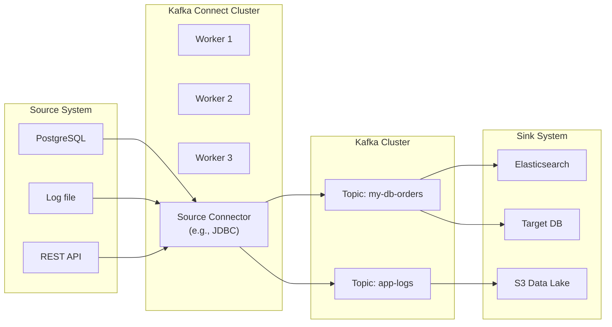
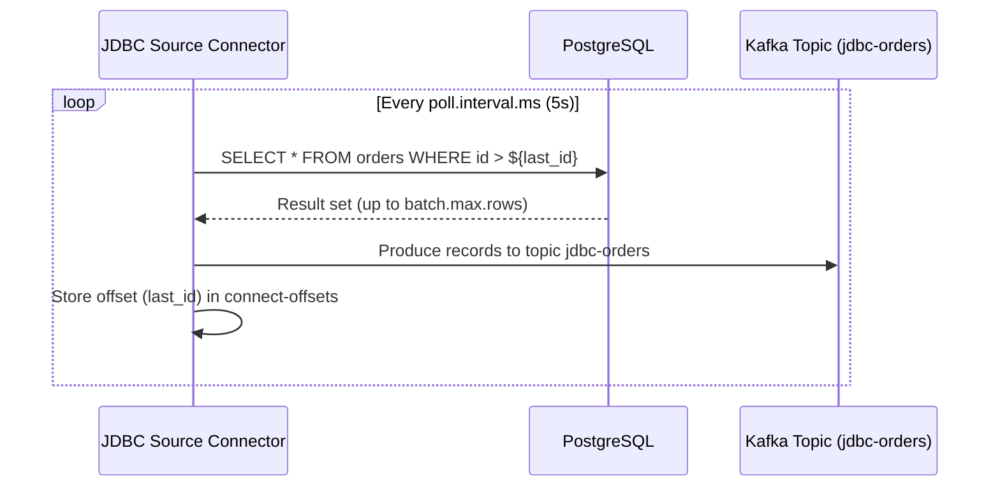

# Kafka Connect

> [!summary] Goal
> Master Kafka Connect for streaming data between Kafka and external systems (databases, files, cloud services). Covers source/sink connectors, converters, transforms, REST API, distributed vs standalone mode, fault tolerance, and production best practices.

## Table of Contents

1. [Architecture Overview](#architecture-overview)
2. [Connector Types](#connector-types)
3. [Converters and Transforms](#converters-and-transforms)
4. [Configuration](#configuration)
5. [REST API](#rest-api)
6. [Fault Tolerance and Scaling](#fault-tolerance-and-scaling)
7. [Pitfalls](#pitfalls)

---

## Architecture Overview

> [!info] Kafka Connect
> Kafka Connect is a framework for streaming data between Kafka and other systems. Connectors (plugins) implement the actual I/O. Connect runs in **standalone** (single process, for dev) or **distributed** (cluster of workers, for production) mode. Workers coordinate via an internal topic (`connect-status`, `connect-config`, `connect-offsets`).



### Distributed worker coordination

```text
In distributed mode:
  1. Workers form a group (consumer group on the internal `connect-config` topic)
  2. Connectors and tasks are assigned across workers (rebalance if a worker joins/leaves)
  3. Configuration is stored in `connect-config` topic (durable, replicated)
  4. Offsets are stored in `connect-offsets` topic (source connector positions)
  5. Status is stored in `connect-status` topic

Worker rebalance:
  - Connector: a logical job (e.g., "import orders from PostgreSQL")
  - Task: an actual worker thread (each connector can have many tasks)
  - Workers distribute tasks evenly. If a worker fails, its tasks restart on other workers.
```

---

## Connector Types

> [!info] Source vs Sink
> **Source connectors** pull data from external systems and write to Kafka topics. **Sink connectors** read from Kafka topics and push data to external systems. A connector plugin handles both the serialization (via converters) and the connection management.

| Aspect | Source connector | Sink connector |
|--------|:----------------:|:--------------:|
| Data flow | External → Kafka | Kafka → External |
| Offset | Tracks position in source (e.g., DB row ID, file byte offset) | Tracks Kafka offset |
| State | `connect-offsets` topic | Kafka consumer group |
| Scaling | Tasks by source partitions (e.g., DB tables) | Tasks by Kafka partitions |

### JDBC Source Connector

```properties
# jdbc-source-connector.json
{
  "name": "jdbc-orders",
  "config": {
    "connector.class": "io.confluent.connect.jdbc.JdbcSourceConnector",
    "connection.url": "jdbc:postgresql://db:5432/orders",
    "connection.user": "connect",
    "connection.password": "${file:/etc/connect/secrets/db.properties:db.password}",
    "table.whitelist": "orders,order_items",
    "mode": "incremental",
    "incrementing.column.name": "id",
    "topic.prefix": "jdbc-",
    "tasks.max": "4",
    "poll.interval.ms": "5000",
    "batch.max.rows": "1000"
  }
}
```



### S3 Sink Connector

```properties
# s3-sink-connector.json
{
  "name": "s3-sink",
  "config": {
    "connector.class": "io.confluent.connect.s3.S3SinkConnector",
    "s3.bucket.name": "my-data-lake",
    "s3.region": "us-east-1",
    "topics": "jdbc-orders",
    "flush.size": "10000",
    "rotate.interval.ms": "3600000",
    "format.class": "io.confluent.connect.s3.format.avro.AvroFormat",
    "partitioner.class": "io.confluent.connect.storage.partitioner.TimeBasedPartitioner",
    "path.format": "'year'=YYYY/'month'=MM/'day'=dd/'hour'=HH",
    "locale": "UTC",
    "tasks.max": "4"
  }
}
```

### FileStream Source (for dev/test)

```properties
# file-source.json
{
  "name": "file-source",
  "config": {
    "connector.class": "FileStreamSource",
    "file": "/var/log/app.log",
    "topic": "app-logs",
    "tasks.max": "1"
  }
}
```

---

## Converters and Transforms

> [!info] Converters
> Converters handle serialization between Kafka's byte format and the connector's data format. Common converters: Avro (with Schema Registry), JSON (for dev), Protobuf. The converter is set per connector via `key.converter` and `value.converter`.

```properties
# Worker-level converter defaults (worker.properties)
key.converter=io.confluent.connect.avro.AvroConverter
key.converter.schema.registry.url=http://schema-registry:8081
value.converter=io.confluent.connect.avro.AvroConverter
value.converter.schema.registry.url=http://schema-registry:8081

# Per-connector override
# "value.converter": "org.apache.kafka.connect.json.JsonConverter",
# "value.converter.schemas.enable": "false"
```

### Single Message Transforms (SMT)

```text
SMTs are lightweight transformations applied to each record as it passes
through the connector (source: before writing to Kafka; sink: after reading
from Kafka). They are configured in the connector config.

Common SMTs:
  - InsertField: add metadata (topic, timestamp, partition)
  - ReplaceField: rename or drop fields
  - MaskField: mask sensitive data (PII)
  - TimestampRouter: set topic name based on timestamp
  - RegexRouter: rewrite topic name via regex
  - Filter: drop records matching a condition
  - Flatten: flatten nested structures
  - ValueToKey: extract a field from the value and set it as the key

Example:
  "transforms": "renameTopic, addSource",
  "transforms.renameTopic.type": "org.apache.kafka.connect.transforms.RegexRouter",
  "transforms.renameTopic.regex": "jdbc-(.*)",
  "transforms.renameTopic.replacement": "raw-$1",
  "transforms.addSource.type": "org.apache.kafka.connect.transforms.InsertField$Value",
  "transforms.addSource.source.field": "source_system",
  "transforms.addSource.source.value": "postgres-prod"
```

---

## Configuration

### Worker config (distributed mode)

```properties
# connect-distributed.properties
bootstrap.servers=kafka-1:9092,kafka-2:9092,kafka-3:9092

# Internal topics (auto-created by Connect)
config.storage.topic=connect-config
offset.storage.topic=connect-offsets
status.storage.topic=connect-status

# Fault tolerance
offset.storage.replication.factor=3
config.storage.replication.factor=3
status.storage.replication.factor=3
offset.storage.partitions=25
config.storage.partitions=1
status.storage.partitions=5

# REST API
rest.port=8083
rest.advertised.host.name=connect-worker-1

# Producer/consumer overrides (applied to all connectors)
producer.acks=all
producer.compression.type=snappy
consumer.isolation.level=read_committed

# Plugin path (directory containing connector jars)
plugin.path=/usr/share/java,/etc/connect/plugins
```

---

## REST API

```bash
# Check worker health
curl -s http://localhost:8083/ | jq
# {"version":"3.7.0","commit":"...","kafka_cluster_id":"..."}

# List connectors
curl -s http://localhost:8083/connectors | jq
# ["jdbc-orders", "s3-sink"]

# Create connector
curl -X POST http://localhost:8083/connectors \
  -H "Content-Type: application/json" \
  -d @jdbc-source-connector.json

# Get connector status
curl -s http://localhost:8083/connectors/jdbc-orders/status | jq
# {
#   "name": "jdbc-orders",
#   "connector": {"state": "RUNNING", "worker_id": "connect-1:8083"},
#   "tasks": [{"state": "RUNNING", "id": 0}, {"state": "RUNNING", "id": 1}]
# }

# Get connector config
curl -s http://localhost:8083/connectors/jdbc-orders/config | jq

# Update connector config (restarts the connector)
curl -X PUT http://localhost:8083/connectors/jdbc-orders/config \
  -H "Content-Type: application/json" \
  -d '{"connector.class":"...","batch.max.rows":5000,...}'

# Pause/resume
curl -X PUT http://localhost:8083/connectors/jdbc-orders/pause
curl -X PUT http://localhost:8083/connectors/jdbc-orders/resume

# Restart connector (or specific task)
curl -X POST http://localhost:8083/connectors/jdbc-orders/restart
curl -X POST http://localhost:8083/connectors/jdbc-orders/tasks/0/restart

# Delete connector
curl -X DELETE http://localhost:8083/connectors/jdbc-orders

# List connector plugins
curl -s http://localhost:8083/connector-plugins | jq '.[].class'
# "io.confluent.connect.jdbc.JdbcSourceConnector"
# "FileStreamSinkConnector"
# ...
```

---

## Fault Tolerance and Scaling

### Connector restart behavior

```text
When a worker fails:
  1. Other workers detect the failure (heartbeat timeout)
  2. A rebalance occurs — tasks from the failed worker are reassigned
  3. Failed tasks restart on healthy workers
  4. Source connectors resume from the last committed offset
  5. Sink connectors resume from the last committed Kafka offset

When a connector is in FAILED state:
  - The task thread threw an unhandled exception
  - The connector will NOT auto-restart (it stays FAILED)
  - Use `curl -X POST .../restart` to manually restart
  - Or configure auto-restart: `restart.interval.ms=10000`,
    `restart.max.retries=10` (worker-level config)
```

### Scaling connectors

```text
Each connector can have multiple tasks (tasks.max). The number of
tasks determines parallelism:

  JDBC source: tasks ≤ number of tables (each task reads one or more tables)
  S3 sink: tasks ≤ number of Kafka partitions (each task handles some partitions)
  File source: typically 1 task (single file)

To scale:
  1. Increase tasks.max (up to the parallelism limit of the source/sink)
  2. Workers rebalance and redistribute new tasks
  3. Monitor "connector-total-task-count" metric

Tasks should be CPU-bound, not I/O-bound. If a task is I/O-bound,
increase tasks.max so the connector can overlap I/O with other tasks.
```

---

## Pitfalls

### Schema Registry + Connect = schema explosion

Each connector creates its own schema subjects. If you use JDBC source and a table has 100 columns, every record has a 100-field Avro schema. Schema Registry stores this. Changing a column type can break compatibility.

**Mitigation**: Use SMTs (`ReplaceField`, `MaskField`) to reduce schema size. Set `value.converter.schemas.enable=false` for JSON converter to skip schema embedding.

### Connector config in wrong state

If you update `tasks.max` from 1 to 10 on a running connector, the connector restarts all tasks (brief downtime). For zero-downtime scaling, create a second connector and balance load, then delete the old one.

### Offset lost for source connector

If the `connect-offsets` topic is compacted too aggressively (offsets subject to compaction), a source connector may lose its position and start from scratch. Set `log.cleanup.policy=compact,delete` and `retention.ms=Long.MAX_VALUE` for the `connect-offsets` topic.

---

> [!question]- Interview Questions
>
> **Q: How does Kafka Connect handle exactly-once delivery?**
> A: Source connectors track offsets (the position in the source system, e.g., DB `id` column or file byte offset). If the connector restarts, it resumes from the last committed offset. With exactly-once source (KIP-618, Kafka 3.3+), Connect uses transactions: the connector writes offsets and data in the same transaction. Sink connectors use the standard Kafka consumer offset — they commit the offset after the sink write completes. End-to-end exactly-once requires idempotent sinks or transactional Connect.
>
> **Q: What's the difference between standalone and distributed mode?**
> A: Standalone runs a single worker process (no fault tolerance, no scaling). Used for development or trivial pipelines. Distributed runs a cluster of workers that coordinate via internal Kafka topics. If a worker fails, tasks are reassigned. Distributed is the only production-ready mode.

---

## Cross-Links

- [[CICD/Kafka/01_Foundations/05_Messages_Serialization_and_Schema_Registry]] for Schema Registry + converters
- [[CICD/Kafka/02_Core/04_Performance_Tuning]] for producer/consumer tuning applied to Connect
- [[CICD/Kafka/02_Core/01_Delivery_Semantics_and_Exactly_Once]] for EOS in Connect
- [[CICD/Kafka/04_Playbooks/02_Production_Hardening]] for securing Connect workers
