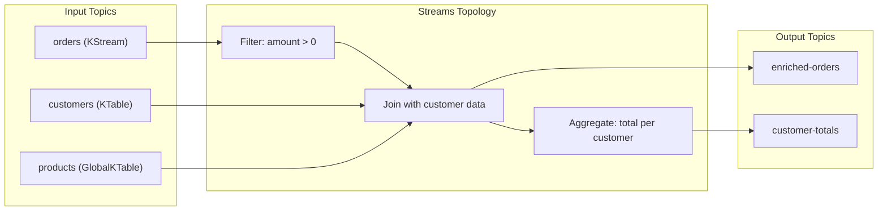
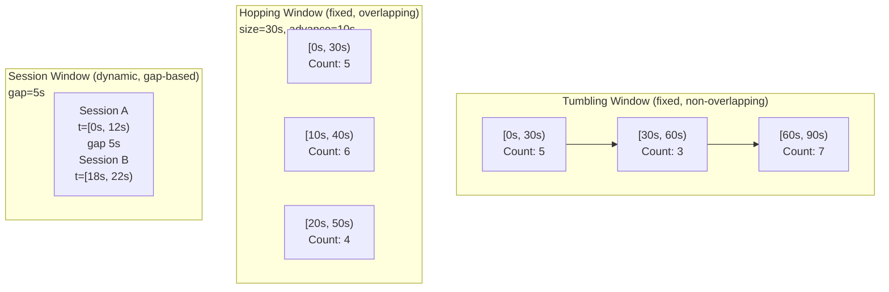

# Kafka Streams

> [!summary] Goal
> Understand Kafka Streams for building stream processing applications. Covers KStream/KTable/GlobalKTable, stateful vs stateless operations, windowing, joins, exactly-once semantics, and the Processor API.

## Table of Contents

1. [Core Abstractions](#core-abstractions)
2. [Stateless Operations](#stateless-operations)
3. [Stateful Operations and State Stores](#stateful-operations-and-state-stores)
4. [Windowing](#windowing)
5. [Joins](#joins)
6. [Exactly-Once Semantics](#exactly-once-semantics)
7. [Pitfalls](#pitfalls)

---

## Core Abstractions

> [!info] Kafka Streams
> Kafka Streams is a client library for building stateful stream processing applications. It runs as a standard Java application (no separate cluster). It uses Kafka topics as both input and output. The core abstractions are KStream (record stream), KTable (changelog), and GlobalKTable (fully replicated table).



### KStream vs KTable vs GlobalKTable

| Aspect | KStream | KTable | GlobalKTable |
|--------|:-------:|:------:|:------------:|
| Semantics | Record stream (INSERT only) | Changelog (UPSERT/DELETE) | Fully replicated table |
| Partitions | Partitioned by key | Partitioned by key | ALL partitions on ALL instances |
| State | No local state (stateless) | RocksDB state store (keyed) | RocksDB state store (all keys) |
| Key semantics | Each record is independent | Latest value per key | Latest value per key (global) |
| Use case | Event processing | Lookup table, aggregation | Small reference data (< 10K records) |
| Co-partitioning | Required for joins | Required for joins | NOT required |

```java
// Building a Kafka Streams topology
StreamsBuilder builder = new StreamsBuilder();

// KStream: unbounded stream of records
KStream<String, Order> orders = builder.stream(
    "orders",
    Consumed.with(Serdes.String(), orderSerde)
);

// KTable: changelog (latest value per key)
KTable<String, Customer> customers = builder.table(
    "customers",
    Consumed.with(Serdes.String(), customerSerde)
);

// GlobalKTable: fully replicated on all instances
GlobalKTable<String, Product> products = builder.globalTable(
    "products",
    Consumed.with(Serdes.String(), productSerde)
);

// Stateless: filter
KStream<String, Order> validOrders = orders.filter(
    (key, order) -> order.getAmount() > 0
);

// Stateful: group + aggregate (creates a KTable)
KTable<String, Double> totalByCustomer = validOrders
    .groupBy((key, order) -> order.getCustomerId(),
             Grouped.with(Serdes.String(), orderSerde))
    .aggregate(
        () -> 0.0,
        (key, order, total) -> total + order.getAmount(),
        Materialized.with(Serdes.String(), Serdes.Double())
    );

totalByCustomer.toStream().to("customer-totals",
    Produced.with(Serdes.String(), Serdes.Double()));

// Join: enrich orders with customer data
KStream<String, EnrichedOrder> enriched = validOrders.join(
    customers,
    (order, customer) -> new EnrichedOrder(order, customer),
    Joined.with(Serdes.String(), orderSerde, customerSerde)
);

enriched.to("enriched-orders",
    Produced.with(Serdes.String(), enrichedOrderSerde));
```

### Topology and sub-topologies

```text
Kafka Streams builds a DAG (directed acyclic graph) called the Topology.
The topology is split into sub-topologies at stateful operations
(re-partitioning points). Each sub-topology can be parallelized
independently.

A topology has:
  - Source nodes: read from Kafka topics
  - Processor nodes: apply transformations
  - Sink nodes: write to Kafka topics
  - State stores: local RocksDB instances for stateful operations

Sub-topology example:
  orders → filter → join(customers) → to(enriched-orders)  [Sub-topology 1]
  products → to(products)                                     [Sub-topology 2]
```

---

## Stateless Operations

```text
Stateless operations process each record independently — no state store needed.

Common stateless operations:
  filter(Predicate)        → Keep records matching the predicate
  filterNot(Predicate)     → Drop records matching the predicate
  map(KeyValueMapper)      → Transform key AND value (re-partitions!)
  mapValues(ValueMapper)   → Transform value only (no re-partition)
  flatMap(ValueMapper)     → One record → zero or more records
  flatMapValues(ValueMapper) → One record → zero or more values (no re-partition)
  selectKey(KeyValueMapper)→ Change the key (re-partitions!)
  branch(Predicate...)     → Split stream into multiple streams
  merge(KStream...)        → Merge multiple streams into one
  peek(ForeachAction)      → Side effect (logging, metrics)
  through(String)          → Write → read (explicit re-partition)
```

```java
// Stateless: filter, map, branch
KStream<String, Order> orders = builder.stream("orders");

// Filter out negative amounts
KStream<String, Order> valid = orders.filter(
    (key, order) -> order.getAmount() >= 0
);

// Mask PII: remove email from value (no re-partition)
KStream<String, Order> masked = valid.mapValues(order -> {
    order.setEmail(null);
    return order;
});

// Branch: split orders by amount
KStream<String, Order>[] branches = valid.branch(
    (key, order) -> order.getAmount() > 1000,   // large orders
    (key, order) -> true                         // everything else
);
KStream<String, Order> largeOrders = branches[0];
KStream<String, Order> normalOrders = branches[1];
```

### When re-partition happens

```text
Re-partition occurs when:
  - The key changes (map, selectKey, flatMap)
  - The operation requires co-partitioning (join, groupBy)
  - You explicitly call through() or repartition()

Re-partition writes to an internal topic (named like
"${application.id}-${operatorName}-repartition").
This is expensive — it serializes, sends to Kafka, reads back.

Avoid unnecessary re-partitions:
  1. Prefer mapValues over map (value-only = no re-partition)
  2. Design keys ahead of time (set key when producing)
  3. Use through() only when absolutely needed
```

---

## Stateful Operations and State Stores

> [!info] State store
> State stores hold local state for stateful operations. Default implementation is **RocksDB** (embedded, disk-backed, fast for range scans). State stores can be **persistent** (survive restarts via changelog topic) or **in-memory** (lost on restart). Each state store has a corresponding **changelog topic** for fault tolerance.

```text
Stateful operations:
  count()                   → Count records per key
  aggregate(initializer, adder) → Custom aggregation per key
  reduce(Reducer)          → Reduce records per key (same type)
  join()                   → Combine two streams/tables by key
  leftJoin()               → Left outer join
  windowedBy()             → Time-windowed aggregation

State store types:
  KeyValueStore<String, Long>       → Simple key-value (for count, aggregate)
  WindowStore<String, Long>         → Time-windowed key-value (for windowed aggregation)
  SessionStore<String, Long>        → Session windows (for sessionize)
  TimestampedKeyValueStore          → Key-value + timestamp metadata
```

### Local state in a distributed app

```text
Each Streams instance owns a subset of partitions (and their state stores).
State is distributed across instances. If an instance fails:
  1. Its partitions are reassigned to other instances
  2. The new instance replays the changelog topic to rebuild the state store
  3. During replay, processing for those partitions is paused
  4. Once the state store is fully rebuilt, processing resumes

Changelog topics:
  - Name: "${application.id}-${storeName}-changelog"
  - Cleanup policy: compact (keep latest value per key)
  - Replication factor: same as source topics
  - Can be read by external consumers for debugging
```

```java
// Custom state store usage (Processor API)
// See also: stateful aggregation KTable example above

// Querying state stores (interactive queries)
KafkaStreams streams = new KafkaStreams(topology, props);
streams.start();

// After startup, query a state store by name
ReadOnlyKeyValueStore<String, Double> store =
    streams.store(
        StoreQueryParameters.fromNameAndType(
            "customer-totals",
            QueryableStoreTypes.keyValueStore()
        )
    );

Double aliceTotal = store.get("alice");  // Direct lookup
KeyValueIterator<String, Double> range = store.range("a", "m");  // Range scan
```

---

## Windowing

> [!info] Windowing
> Windowing divides a stream into finite time buckets for aggregation. Required for operations like "count orders per minute" or "sum revenue per hour." Kafka Streams supports tumbling windows (fixed, non-overlapping), hopping windows (fixed, overlapping), session windows (dynamic, gap-based), and sliding windows (for joins).



```java
// Tumbling window (non-overlapping, 1 minute)
KTable<Windowed<String>, Long> minuteCounts = orders
    .groupByKey(Grouped.with(Serdes.String(), orderSerde))
    .windowedBy(TimeWindows.ofSizeWithNoGrace(Duration.ofMinutes(1)))
    .count();

// Hopping window (30 minute window, advance every 5 minutes)
KTable<Windowed<String>, Long> hoppingCounts = orders
    .groupByKey()
    .windowedBy(HoppingWindows.ofSizeWithNoGrace(
        Duration.ofMinutes(30))
        .advanceBy(Duration.ofMinutes(5)))
    .count();

// Session window (5 second inactivity gap)
KTable<Windowed<String>, Long> sessionCounts = orders
    .groupByKey()
    .windowedBy(SessionWindows.withInactivityGapAndNoGrace(
        Duration.ofSeconds(5)))
    .count();
```

### Grace period

```text
grace = how long after the window ends to accept LATE records.
Default: no grace (24 hours in older versions — can cause memory issues).
Explicitly set grace:
  .windowedBy(TimeWindows.ofSizeWithNoGrace(Duration.ofMinutes(5)))
  // No grace — all late records are dropped.
  // Use for strict event-time processing.

  .windowedBy(TimeWindows.of(Duration.ofMinutes(5)).grace(Duration.ofMinutes(1)))
  // 1 minute grace — late records within 1 minute of window end are accepted.
```

---

## Joins

> [!info] Joins in Kafka Streams
> Joins combine two streams or tables by key. Co-partitioning is required for KStream-KStream and KStream-KTable joins (both topics must have the same number of partitions AND the same key structure). GlobalKTable joins do NOT require co-partitioning.

| Join type | Left | Right | Result emitts when | Co-partitioning |
|:---------:|:----:|:-----:|:------------------:|:---------------:|
| KStream-KStream (inner) | KStream | KStream | Both records arrive within join window | Required |
| KStream-KStream (left) | KStream | KStream | Left record (right may be null) | Required |
| KStream-KTable (inner) | KStream | KTable | KStream record + KTable has matching key | Required |
| KStream-KTable (left) | KStream | KTable | KStream record always (KTable may be null) | Required |
| KStream-GlobalKTable | KStream | GlobalKTable | KStream record + GlobalKTable has key | NOT required |

```java
// KStream-KStream join (time-bounded, inner)
// Emits when both events arrive within the same 1-hour window
KStream<String, EnrichedOrder> joined = clicksStream.join(
    purchasesStream,
    (click, purchase) -> new EnrichedOrder(click, purchase),
    JoinWindows.ofTimeDifferenceAndNoGrace(Duration.ofHours(1)),
    StreamJoined.with(Serdes.String(), clickSerde, purchaseSerde)
);

// KStream-KTable join (table lookup)
// Emits for every KStream record (look up customer data)
KStream<String, EnrichedOrder> enriched = ordersStream.join(
    customersTable,
    (order, customer) -> new EnrichedOrder(order, customer),
    Joined.with(Serdes.String(), orderSerde, customerSerde)
);

// KStream-GlobalKTable join (no co-partitioning needed!)
// Good for small reference data (e.g., product catalog)
KStream<String, EnrichedOrder> enrichedWithProduct = ordersStream.join(
    productsGlobalTable,
    (key, order) -> order.getProductId(),   // FK lookup (not the stream key!)
    (order, product) -> new EnrichedOrder(order, product)
);
```

---

## Exactly-Once Semantics

> [!info] Exactly-once in Kafka Streams
> Kafka Streams supports exactly-once semantics (`processing.guarantee=exactly_once_v2`). This ensures that: each input record is processed exactly once, state store updates are atomic, and output records are committed atomically with offset advancement.

```properties
# Streams config for exactly-once
processing.guarantee=exactly_once_v2
# v2 (Kafka 2.5+): fewer transactions, lower latency
# v1: one transaction per task per commit

# When exactly-once is enabled:
# - Streams uses transactional producers internally
# - Input offsets, state store updates, and output writes are in the same transaction
# - If the application crashes mid-processing, the transaction is rolled back
# - On restart, the application replays from the last committed offset
```

### Idempotent state store

```text
State stores are backed by changelog topics (compact, keyed by record key).
When the state store is updated:
  1. The change is written to the local RocksDB instance
  2. A "change record" is produced to the changelog topic
  3. The input offset + changelog offset are committed in the same transaction

On restart:
  1. Read the changelog topic from the last committed offset
  2. Replay all changes to rebuild the RocksDB state
  3. Resume processing from the last committed input offset
```

---

## Pitfalls

### Co-partitioning violation

If you join two KStreams or a KStream and KTable, the topics MUST have the same number of partitions. If they don't match, Kafka Streams throws an error at startup: `"Topics not co-partitioned"`.

**Fix**: Ensure both topics have the same partition count. Use `through()` or `repartition()` to force co-partitioning (but this is expensive).

### State store size explosion

RocksDB stores state on disk. For windowed aggregations, old windows accumulate. Without a grace period, Kafka Streams retains closed windows for 24 hours (default). For high-cardinality key spaces, this can use terabytes of disk.

**Fix**: Always set a grace period on windows (`withNoGrace()` or `grace(Duration.ofMinutes(5))`). Monitor RocksDB disk usage. Set `rocksdb.config.setter` to tune RocksDB (block cache size, compression).

### Re-partitioning cost

Calling `map()` (changes key), `selectKey()`, or `groupBy()` triggers a re-partition — writing all data to an internal topic and reading it back. This doubles the data volume and adds latency.

**Fix**: Design the key when producing to the input topic. If you need to join by a different field, consider a GlobalKTable (if the data is small) or a separate enrichment stream.

---

> [!question]- Interview Questions
>
> **Q: What is the difference between KStream and KTable?**
> A: KStream is an unbounded stream of records — each record is an independent event (INSERT semantics). KTable is a changelog — each record is an UPDATE or DELETE for a key (UPSERT semantics). KStream emits every record; KTable emits only the latest value per key. Internally, KTable reads from a compacted topic and maintains a RocksDB state store.
>
> **Q: How does Kafka Streams handle fault tolerance for state stores?**
> A: Each state store has a changelog topic (compacted, keyed). When the state store is updated, the change is written to the changelog topic in the same transaction as the output records and offset commit. If the application crashes, on restart, it reads the changelog topic from the last committed offset and replays all changes to rebuild the RocksDB state store. This ensures that the state store is always consistent with the processing position.
>
> **Q: Why does co-partitioning matter for joins?**
> A: For KStream-KStream and KStream-KTable joins, records with the same key must be on the same partition (and therefore on the same Streams instance). Without co-partitioning, records with matching keys would be on different instances and the join would miss them. Co-partitioning requires both topics to have the same number of partitions and the same key structure.

---

## Cross-Links

- [[CICD/Kafka/02_Core/01_Delivery_Semantics_and_Exactly_Once]] for EOS fundamentals
- [[CICD/Kafka/02_Core/02_Partitioning_Strategies]] for co-partitioning requirements
- [[CICD/Kafka/01_Foundations/02_Topics_Partitions_Offsets]] for partition fundamentals
- [[CICD/Kafka/03_Advanced/A00_Storage_and_Replication_Internals]] for changelog topics and compaction
