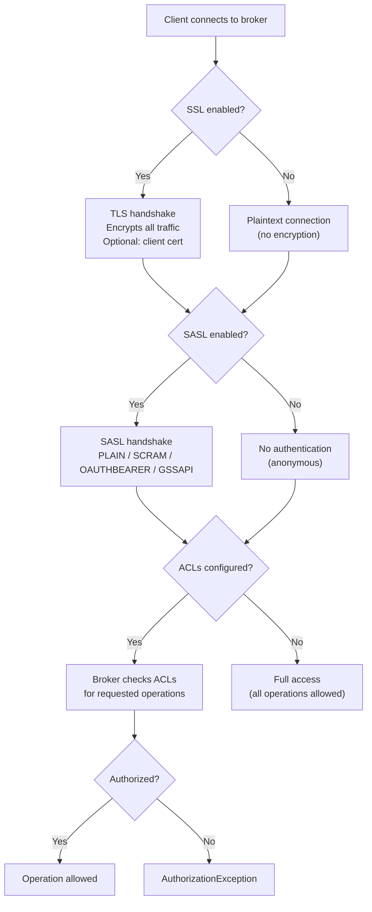

# Security

> [!summary] Goal
> Understand Kafka's security: encryption in transit (SSL/TLS), authentication (SSL, SASL/PLAIN, SASL/SCRAM, OAuth, Kerberos), authorization (ACLs), and best practices for securing a production cluster.

## Table of Contents

1. [Security Layers](#security-layers)
2. [Encryption (SSL/TLS)](#encryption)
3. [Authentication (SASL)](#authentication)
4. [Authorization (ACLs)](#authorization)
5. [Pitfalls](#pitfalls)

---

## Security Layers

> [!info] Kafka security
> Kafka security is multi-layered: **encryption** (SSL protects data in transit), **authentication** (verify client identity via SSL or SASL), **authorization** (ACLs control which clients can do what), and **auditing** (logs of security-relevant events). These layers are independent — you can enable encryption without authentication, for example.



---

## Encryption (SSL/TLS)

> [!info] SSL/TLS
> SSL encrypts data between clients and brokers (and between brokers). It also provides optional client authentication (mTLS). Kafka uses standard Java JKS (keystore/truststore) or PEM files.

```bash
# 1. Generate a Certificate Authority (CA)
openssl req -new -x509 -keyout ca-key -out ca-cert -days 3650 \
  -subj "/CN=Kafka-CA"

# 2. Generate server certificate for each broker
keytool -genkey -keystore broker.keystore.jks -alias broker \
  -keyalg RSA -keysize 2048 -validity 365 \
  -dname "CN=broker-1.kafka.local" \
  -storepass changeit -keypass changeit

# 3. Sign server certificate with CA
keytool -certreq -keystore broker.keystore.jks -alias broker \
  -file broker.csr -storepass changeit
openssl x509 -req -CA ca-cert -CAkey ca-key -in broker.csr \
  -out broker-signed.crt -days 365 -CAcreateserial

# 4. Import CA + signed cert into keystore
keytool -keystore broker.keystore.jks -alias CARoot -import \
  -file ca-cert -storepass changeit -noprompt
keytool -keystore broker.keystore.jks -alias broker -import \
  -file broker-signed.crt -storepass changeit

# 5. Create truststore (import CA cert)
keytool -keystore broker.truststore.jks -alias CARoot -import \
  -file ca-cert -storepass changeit -noprompt

# 6. Create client truststore (same CA)
keytool -keystore client.truststore.jks -alias CARoot -import \
  -file ca-cert -storepass changeit -noprompt
```

### Broker SSL config

```properties
# server.properties
listeners=SSL://:9093

# Keystore (server cert + private key)
ssl.keystore.location=/etc/kafka/secrets/broker.keystore.jks
ssl.keystore.password=changeit
ssl.key.password=changeit

# Truststore (CA cert)
ssl.truststore.location=/etc/kafka/secrets/broker.truststore.jks
ssl.truststore.password=changeit

# Require client authentication (mTLS)
# ssl.client.auth=required

# TLS version and cipher suites
ssl.protocol=TLSv1.3
ssl.enabled.protocols=TLSv1.2,TLSv1.3
ssl.cipher.suites=TLS_AES_256_GCM_SHA384,TLS_CHACHA20_POLY1305_SHA256
```

### Client SSL config

```properties
# Consumer/Producer SSL config
security.protocol=SSL
ssl.truststore.location=/etc/kafka/secrets/client.truststore.jks
ssl.truststore.password=changeit

# For mTLS (client authentication):
# ssl.keystore.location=/etc/kafka/secrets/client.keystore.jks
# ssl.keystore.password=changeit
# ssl.key.password=changeit
```

---

## Authentication (SASL)

> [!info] SASL
> SASL provides authentication over SSL-encrypted connections. Kafka supports: **SASL/PLAIN** (username/password, simple but no credential rotation), **SASL/SCRAM** (username/password with salt/hash, credentials stored in ZooKeeper/KRaft), **SASL/GSSAPI** (Kerberos, enterprise), **SASL/OAUTHBEARER** (OAuth 2.0, for SSO/JWT).

| Mechanism | Credential storage | Rotation | Complexity | Use case |
|:---------:|:------------------:|:--------:|:----------:|----------|
| **PLAIN** | File or broker config | Manual (restart) | Low | Dev / legacy |
| **SCRAM** | ZooKeeper/KRaft (dynamic) | Dynamic (no restart) | Low | **Recommended for most clusters** |
| **GSSAPI** | Kerberos KDC | Kerberos lifecycle | High | Enterprise with existing Kerberos |
| **OAUTHBEARER** | OAuth 2.0 provider | Token-based (auto) | Medium | SSO, JWT tokens, cloud-native |

### SASL/SCRAM

```bash
# Create a user (stored in ZooKeeper/KRaft)
kafka-configs --bootstrap-server localhost:9092 \
  --entity-type users --entity-name admin \
  --alter --add-config 'SCRAM-SHA-512=[password=admin-secret]'

# List users
kafka-configs --bootstrap-server localhost:9092 \
  --entity-type users --describe

# Delete a user
kafka-configs --bootstrap-server localhost:9092 \
  --entity-type users --entity-name old-user \
  --alter --delete-config 'SCRAM-SHA-512'
```

```properties
# Broker SASL/SCRAM config (server.properties)
listeners=SASL_SSL://:9093
security.inter.broker.protocol=SASL_SSL
sasl.mechanism.inter.broker.protocol=SCRAM-SHA-512

# JAAS config for broker
sasl.enabled.mechanisms=SCRAM-SHA-256,SCRAM-SHA-512
# JAAS file (kafka_server_jaas.conf):
# KafkaServer {
#   org.apache.kafka.common.security.scram.ScramLoginModule required;
# };
```

```properties
# Client SASL/SCRAM config
security.protocol=SASL_SSL
sasl.mechanism=SCRAM-SHA-512

# JAAS config (in client properties or via JVM arg)
sasl.jaas.config=org.apache.kafka.common.security.scram.ScramLoginModule required \
  username="admin" \
  password="admin-secret";
```

### SASL/OAUTHBEARER

```properties
# Client OAuth 2.0 config
security.protocol=SASL_SSL
sasl.mechanism=OAUTHBEARER
sasl.login.callback.handler.class=com.example.CustomOAuthLoginCallbackHandler
sasl.jaas.config=org.apache.kafka.common.security.oauthbearer.OAuthBearerLoginModule required;
```

---

## Authorization (ACLs)

> [!info] ACLs
> ACLs control which principals (authenticated users) can perform which operations on which resources. Resources are hierarchical: cluster, topic, group, transactional ID. Operations include: READ, WRITE, CREATE, DELETE, DESCRIBE, ALTER, DESCRIBE_CONFIGS, ALTER_CONFIGS.

```bash
# ACL format:
# Principal: User:<name>
# Resource: topic/group/cluster/transactional-id
# Operation: Read / Write / Describe / Create / Delete / Alter / ...
# Permission: Allow / Deny

# Grant read access to topic "orders" for user "app-consumer"
kafka-acls --bootstrap-server localhost:9092 \
  --add --allow-principal User:app-consumer \
  --operation Read --operation Describe \
  --topic orders

# Grant write access to topic "orders" for user "app-producer"
kafka-acls --bootstrap-server localhost:9092 \
  --add --allow-principal User:app-producer \
  --operation Write --operation Describe \
  --topic orders

# Grant full access to admin user
kafka-acls --bootstrap-server localhost:9092 \
  --add --allow-principal User:admin \
  --operation All --topic '*' --group '*'

# Deny specific user from a topic
kafka-acls --bootstrap-server localhost:9092 \
  --add --deny-principal User:bad-actor \
  --operation All --topic sensitive-topic

# List ACLs
kafka-acls --bootstrap-server localhost:9092 --list

# Remove ACL
kafka-acls --bootstrap-server localhost:9092 \
  --remove --allow-principal User:app-consumer \
  --operation Read --topic orders
```

### ACL evaluation order

```text
ACLs are evaluated in this order:
  1. If no ACLs exist for this resource → ALLOW (default: open access)
  2. If DENY matches → DENY (deny overrides allow)
  3. If ALLOW matches → ALLOW
  4. Otherwise → DENY (implicit deny)

With super.users configured:
  super.users=User:admin;User:kafka
  → These users bypass all ACL checks
```

### Resource patterns

```text
ACL resources support literal and prefixed patterns:
  --topic 'orders'          → Literal match: only "orders"
  --topic 'orders-' --resource-pattern prefixed
                            → Prefix match: "orders-1", "orders-prod"

Wildcard '*' matches all resources of that type.
```

---

## Pitfalls

### SSL without client authentication is not enough

SSL encrypts traffic but does NOT authenticate clients (if `ssl.client.auth=none`). Anyone can connect if they have network access. Always use `ssl.client.auth=required` for mTLS, or combine SSL + SASL. A common setup is `SASL_SSL` with SCRAM-SHA-512.

### ACLs are not enforced by default

If no ACLs exist for a resource, ALL operations are allowed. You must set `allow.everyone.if.no.acl.found=false` (broker config) to DENY operations with no matching ACL. Otherwise, ACLs only restrict if explicitly denied.

### Password rotation with SASL/PLAIN

SASL/PLAIN stores credentials in JAAS config files or broker config. Rotating passwords requires restarting brokers or clients. Use SASL/SCRAM for dynamic credential management — credentials can be added/removed without restart.

---

> [!question]- Interview Questions
>
> **Q: What's the difference between SSL and SASL?**
> A: SSL encrypts data in transit (confidentiality) and optionally authenticates clients via certificates (mTLS). SASL authenticates clients (identity verification). SSL + SASL is the most common production setup: SSL encrypts, SASL authenticates. They solve different problems and can be used independently.
>
> **Q: How does SASL/SCRAM work?**
> A: SCRAM (Salted Challenge Response Authentication Mechanism) uses a challenge-response protocol — the password never leaves the client. The broker stores a salted hash of the password. The client proves knowledge of the password without sending it. The salt and iteration count make SCRAM resistant to offline dictionary attacks even if the broker's credential store is compromised.

---

## Cross-Links

- [[CICD/Kafka/04_Playbooks/02_Production_Hardening]] for security hardening checklist
- [[CICD/Kafka/01_Foundations/01_Kafka_Architecture_and_Core_Concepts]] for broker architecture
- [[CICD/Kafka/03_Advanced/A06_KRaft_and_ZooKeeper_Removal]] for KRaft security implications
