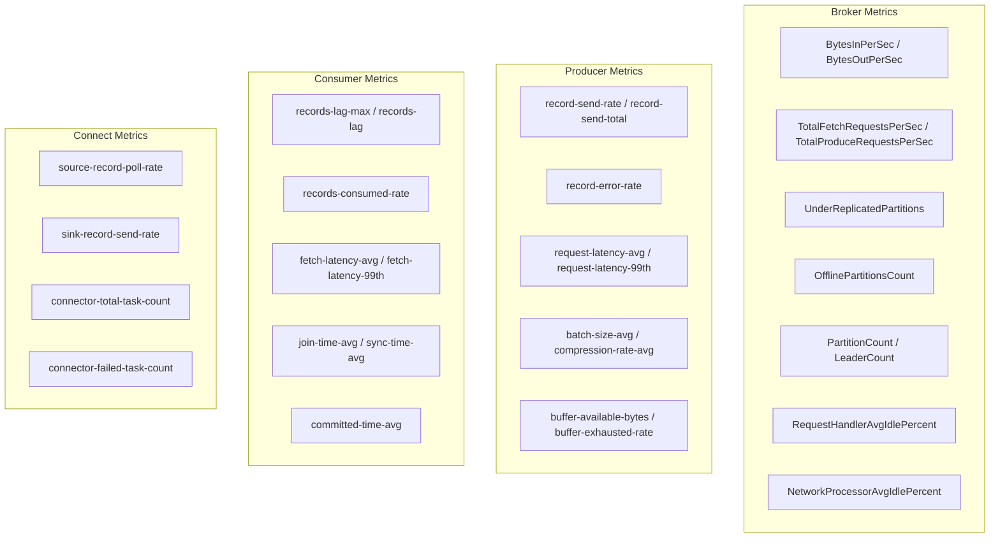
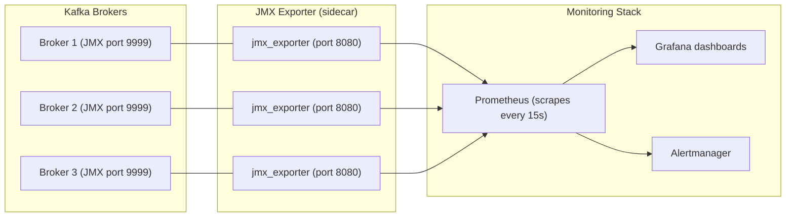

# Monitoring and Observability

> [!summary] Goal
> Understand Kafka monitoring and observability: key metrics (broker, producer, consumer, connectivity), JMX → Prometheus → Grafana stack, log monitoring, tracing with OpenTelemetry, and building dashboards for production clusters.

## Table of Contents

1. [Key Metrics](#key-metrics)
2. [Metrics Collection Stack](#metrics-collection-stack)
3. [Dashboards](#dashboards)
4. [Logging and Tracing](#logging-and-tracing)
5. [Pitfalls](#pitfalls)

---

## Key Metrics

> [!info] Key metrics
> Monitoring Kafka requires tracking metrics across four layers: **broker** (disk, network, request rates), **producer** (throughput, error rate, batch metrics), **consumer** (lag, rebalance time, fetch metrics), and **connectivity** (Schema Registry, Connect, Streams). Each layer has its own critical metrics.



### Critical broker metrics

| Metric | What it measures | Alert threshold | Why it matters |
|--------|:----------------:|:---------------:|----------------|
| **UnderReplicatedPartitions** | Partitions where replicas lag > HW | > 0 for > 1 min | Data loss risk, replication problem |
| **OfflinePartitionsCount** | Partitions with no leader | > 0 | Topic unavailable (critical) |
| **RequestHandlerAvgIdlePercent** | Request handler pool saturation | < 0.3 | Brokers overwhelmed by requests |
| **BrokerTopicMetrics.BytesInPerSec** | Cluster write throughput | Trend-based | Capacity planning |
| **BrokerTopicMetrics.BytesOutPerSec** | Cluster read throughput | Trend-based | Consumer demand, network saturation |
| **LogFlushRateAndTimeMs** | Disk flush latency | p99 > 100ms | Disk I/O bottleneck |
| **NetworkProcessorAvgIdlePercent** | Network thread saturation | < 0.3 | Network or CPU bottleneck |

### Lag monitoring

```bash
# CLI tool for consumer lag
kafka-consumer-groups --bootstrap-server localhost:9092 \
  --group my-group --describe

# GROUP           TOPIC     PARTITION  CURRENT-OFFSET  LOG-END-OFFSET  LAG
# my-group        orders    0          1500            5000            3500
# my-group        orders    1          2000            5000            3000

# Get per-consumer lag (Kafka 3.0+)
kafka-consumer-groups --bootstrap-server localhost:9092 \
  --group my-group --describe --members --verbose
```

### Producer-side metrics (JMX MBeans)

```text
Each producer exposes JMX metrics under:
  kafka.producer:type=producer-metrics,client-id=...
  kafka.producer:type=producer-topic-metrics,client-id=...,topic=...
  kafka.producer:type=producer-node-metrics,client-id=...,node-id=...

Key metric: request-latency-avg, request-latency-99th
  - High latency: network issues, broker overload, or acks=all waiting for ISR
  - Sudden increase: broker throttling, disk I/O spike, or slow follower

Key metric: buffer-exhausted-rate
  - Non-zero: producer is sending faster than broker can accept
  - Fix: increase buffer.memory, reduce produce rate, or add partitions
```

---

## Metrics Collection Stack

> [!info] JMX → Prometheus → Grafana
> The standard stack: Kafka exposes metrics via JMX (Java Management Extensions). The **JMX Exporter** for Prometheus scrapes JMX and exposes metrics in Prometheus format. **Prometheus** collects and stores metrics. **Grafana** visualizes them in dashboards.



### JMX Exporter config

```yaml
# jmx_exporter_config.yml
startDelaySeconds: 0
ssl: false
lowercaseOutputName: true
lowercaseOutputLabelNames: true
whitelistObjectNames:
  - "kafka.server:type=BrokerTopicMetrics,*"
  - "kafka.server:type=ReplicaManager,*"
  - "kafka.server:type=Request,*"
  - "kafka.network:type=RequestMetrics,*"
  - "kafka.consumer:type=consumer-fetch-manager-metrics,*"

rules:
  # Rename metrics for clarity
  - pattern: kafka.server<type=BrokerTopicMetrics, name=(BytesInPerSec|BytesOutPerSec)><>Count
    name: kafka_broker_$1
    type: COUNTER
  - pattern: kafka.server<type=ReplicaManager><>UnderReplicatedPartitions
    name: kafka_replica_under_replicated_partitions
    type: GAUGE
```

```bash
# Start Kafka with JMX Exporter
KAFKA_OPTS="-javaagent:/opt/jmx_exporter/jmx_prometheus_javaagent.jar=8080:/etc/jmx_exporter/config.yml"
export KAFKA_OPTS
kafka-server-start.sh /etc/kafka/server.properties
```

### Prometheus config

```yaml
# prometheus.yml
scrape_configs:
  - job_name: 'kafka-brokers'
    scrape_interval: 15s
    static_configs:
      - targets:
        - 'broker-1:8080'
        - 'broker-2:8080'
        - 'broker-3:8080'

  - job_name: 'kafka-producers'
    scrape_interval: 15s
    static_configs:
      - targets:
        - 'app-producer:8081'

  - job_name: 'kafka-consumers'
    scrape_interval: 15s
    static_configs:
      - targets:
        - 'app-consumer:8082'
```

---

## Dashboards

```text
Recommended Grafana dashboards:

1. Kafka Cluster Overview
   - Bytes in/out (per broker, aggregate)
   - Request rates (produce, fetch, metadata)
   - Under-replicated partitions, offline partitions
   - Request handler idle %, network thread idle %
   - Partition count, leader count per broker

2. Kafka Lag Dashboard
   - Consumer lag per group per partition
   - Max lag, avg lag, lag rate of change
   - Consumer group state (stable, rebalancing)
   - Rebalance frequency

3. Kafka System Resources
   - CPU utilization per broker
   - Disk I/O (read/write throughput, IOPS, queue depth)
   - Network I/O (bytes in/out, packet drops)
   - GC metrics (Young GC, Old GC, GC pause time)

4. Producer/Consumer App Dashboard
   - Producer send rate, error rate, latency
   - Consumer fetch rate, latency, processing time
   - Buffer utilization, compression ratio
```

---

## Logging and Tracing

### Broker logging

```properties
# log4j.properties
# Change log level at runtime without restart:
log4j.logger.kafka=INFO
log4j.logger.kafka.controller=INFO
log4j.logger.kafka.coordinator.group=INFO
log4j.logger.kafka.network.RequestChannel$=WARN
log4j.logger.kafka.log.LogCleaner=INFO
log4j.logger.org.apache.zookeeper=WARN

# Enable request logging (production: only for debugging)
# log4j.logger.kafka.request.logger=TRACE, requestAppender
```

### OpenTelemetry tracing

```java
// Producer tracing with OpenTelemetry
OpenTelemetry otel = ...;
KafkaTelemetry kafkaTelemetry = KafkaTelemetry.create(otel);

KafkaProducer<String, String> producer = new KafkaProducer<>(props);
producer = kafkaTelemetry.wrap(producer);

// Producer sends are now traced — spans show in Jaeger/Zipkin
producer.send(new ProducerRecord<>("orders", key, value));

// Consumer tracing
KafkaConsumer<String, String> consumer = new KafkaConsumer<>(props);
consumer = kafkaTelemetry.wrap(consumer);

while (true) {
    ConsumerRecords<String, String> records = consumer.poll(Duration.ofMillis(100));
    for (ConsumerRecord<String, String> record : records) {
        // Span is automatically created, carrying trace context
        process(record);
    }
}
```

---

## Pitfalls

### JMX port exposed without authentication

JMX exposes ALL broker internals — including configuration with passwords. Never expose JMX ports to the internet. Bind JMX to localhost or an internal network, and use firewall rules. For production, enable JMX authentication:

```bash
KAFKA_JMX_OPTS="-Dcom.sun.management.jmxremote \
  -Dcom.sun.management.jmxremote.authenticate=true \
  -Dcom.sun.management.jmxremote.ssl=true \
  -Dcom.sun.management.jmxremote.password.file=/etc/kafka/jmxremote.password \
  -Dcom.sun.management.jmxremote.access.file=/etc/kafka/jmxremote.access"
```

### Scrape interval too long for lag detection

If Prometheus scrapes every 60s and consumer lag spikes in 30s, you'll miss the spike. For lag monitoring, scrape every 10-15s. Better: use a push-based mechanism (e.g., Kafka's own metrics reporter) that sends lag metrics to a separate topic with higher frequency.

### Too many JMX metrics overwhelming Prometheus

Kafka has hundreds of JMX beans. Scraping all of them for every broker creates high cardinality (`client-id`, `topic`, `partition` labels). Filter to the essential metrics with the JMX Exporter whitelist. Use Prometheus recording rules for aggregated metrics.

---

> [!question]- Interview Questions
>
> **Q: What metrics would you alert on for a Kafka cluster?**
> A: P0 (page-worthy): OfflinePartitionsCount > 0, UnderReplicatedPartitions > 0 for > 1 min. P1 (ticket): Consumer lag > threshold, RequestHandlerAvgIdlePercent < 0.3, NetworkProcessorAvgIdlePercent < 0.3. P2 (investigate): BytesIn/Out trend deviation, GC time > 20%, disk usage > 80%. P3 (capacity): Partition count approaching 2000/broker, CPU > 80% sustained.
>
> **Q: How do you measure end-to-end latency?**
> A: Inject a record with a known timestamp at the producer. At the consumer, compute `System.currentTimeMillis() - record.timestamp()`. For production, use a "canary" topic that sends a heartbeat record every second and measures its end-to-end latency. This gives a real-world measure of cluster health.

---

## Cross-Links

- [[CICD/Kafka/02_Core/04_Performance_Tuning]] for metrics-driven tuning
- [[CICD/Kafka/04_Playbooks/01_Troubleshoot_Consumer_Lag]] for lag diagnosis
- [[CICD/Kafka/04_Playbooks/03_Performance_Optimization_Playbook]] for performance issue detection
