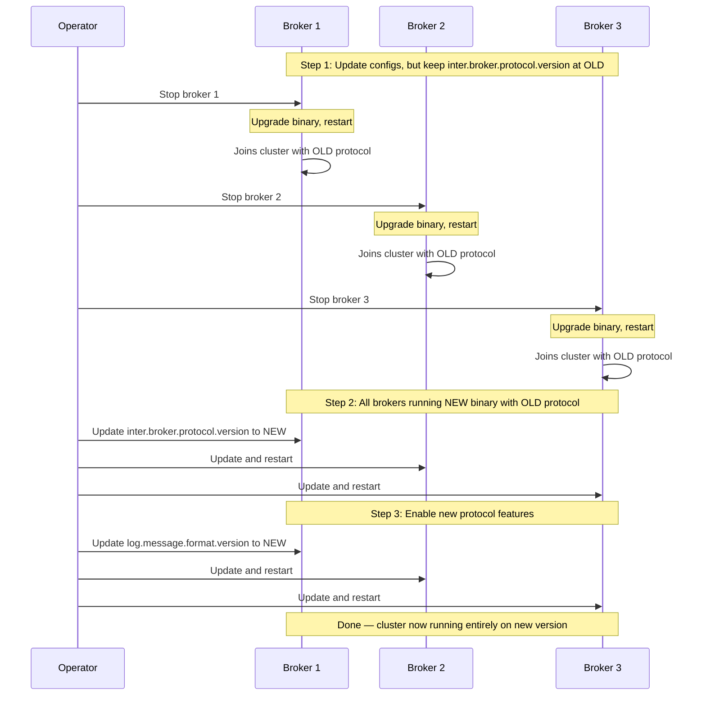

# Migration and Upgrades

> [!summary] Goal
> Understand Kafka upgrade strategies: rolling upgrades (no downtime), protocol version compatibility, ZooKeeper-to-KRaft migration, partition reassignment for cluster expansion, and data migration between clusters.

## Table of Contents

1. [Rolling Upgrade Strategy](#rolling-upgrade-strategy)
2. [Protocol Version Compatibility](#protocol-version-compatibility)
3. [Cluster Expansion](#cluster-expansion)
4. [Pitfalls](#pitfalls)

---

## Rolling Upgrade Strategy

> [!info] Rolling upgrade
> A rolling upgrade upgrades brokers one at a time (or in batches for large clusters) with zero consumer/producer downtime. The key: upgrade one broker, verify it's healthy, then move to the next. Keep at least `min.insync.replicas` brokers available at all times.



### Upgrade procedure (step by step)

```bash
# Step 1: Download new binary on ONE broker
tar -xzf kafka-3.7.0.tgz
cp -r kafka-3.7.0 /opt/kafka-new

# Step 2: Copy old config (keep protocol version at OLD)
cp /opt/kafka-old/config/server.properties /opt/kafka-new/config/
echo "inter.broker.protocol.version=3.6" >> /opt/kafka-new/config/server.properties

# Step 3: Gracefully stop the broker
kafka-server-stop.sh

# Step 4: Start with new binary
/opt/kafka-new/bin/kafka-server-start.sh /opt/kafka-new/config/server.properties &

# Step 5: Verify broker is healthy
kafka-broker-api-versions --bootstrap-server localhost:9093

# Step 6: Repeat for ALL brokers (one at a time)

# Step 7: Once ALL brokers are on new binary, update protocol version
# Update inter.broker.protocol.version to 3.7 (or remove the line)
# Restart each broker one at a time

# Step 8: Update log message format (if needed)
# log.message.format.version=3.7
# This is optional in Kafka 3.0+ (message format auto-detected)
```

---

## Protocol Version Compatibility

> [!info] Protocol version
> Each Kafka release adds or changes the wire protocol between brokers (`inter.broker.protocol.version`). During an upgrade, ALL brokers must run the NEW binary but communicate using the OLD protocol until ALL brokers are upgraded. This ensures compatibility during the rolling restart.

```text
When upgrading from 3.6 → 3.7:

Phase 1: All brokers on 3.7 binary, protocol 3.6
  - New features that DON'T require protocol change: available
  - Features that require protocol change: NOT available yet
  - Example: new metrics may appear, but new replication features wait

Phase 2: All brokers on 3.7 binary, protocol 3.7
  - All new features enabled
  - This is the final state

Never skip phases: going directly from 3.5 binary → 3.7 protocol is unsafe.
If a broker needs to roll back (unlikely but possible), all brokers
must be rolled back if the protocol version was changed.
```

### Checking compatibility

```bash
# List supported API versions
kafka-broker-api-versions --bootstrap-server localhost:9092

# Output:
# Produce API: (0-9) → supports versions 0 through 9
# Fetch API: (0-12)
# ...

# Verify a specific version is supported
kafka-broker-api-versions --bootstrap-server localhost:9092 \
  | grep -i "fetch"

# Check if all brokers are at the same version
kafka-metadata-quorum --bootstrap-server localhost:9092 \
  describe --status
```

---

## Cluster Expansion

> [!info] Cluster expansion
> Adding brokers to an existing cluster: new brokers join, but existing partitions remain on old brokers. Partitions must be manually reassigned to spread data across the expanded cluster. Kafka provides a partition reassignment tool for this.

```bash
# Step 1: Generate a reassignment plan
kafka-reassign-partitions --bootstrap-server localhost:9092 \
  --generate \
  --topics-to-move-json-file topics-to-move.json \
  --broker-list "0,1,2,3" \         # Old: 0,1,2 → New: 0,1,2,3
  > reassignment-plan.json

# topics-to-move.json
# {"topics": [{"topic": "orders"}, {"topic": "payments"}],
#  "version": 1}

# Step 2: Execute the reassignment
kafka-reassign-partitions --bootstrap-server localhost:9092 \
  --execute \
  --reassignment-json-file reassignment-plan.json

# Step 3: Monitor progress
kafka-reassign-partitions --bootstrap-server localhost:9092 \
  --verify \
  --reassignment-json-file reassignment-plan.json

# Status: "Reassignment of partition orders-0 completed successfully"
# Status: "Reassignment of partition orders-1 is in progress" (still moving)
```

### Throttling reassignments

```bash
# Limit bandwidth during reassignment to avoid cluster overload
# Set throttle (bytes/sec) per broker:
kafka-configs --bootstrap-server localhost:9092 \
  --entity-type brokers --entity-default \
  --alter --add-config 'leader.replication.throttled.rate=50000000'

# Remove throttle after reassignment completes:
kafka-configs --bootstrap-server localhost:9092 \
  --entity-type brokers --entity-default \
  --alter --delete-config 'leader.replication.throttled.rate'
```

### Preferred leader election

```bash
# After adding new brokers, leaders may be concentrated on old brokers.
# Trigger preferred leader election to redistribute leadership:
kafka-leader-election --bootstrap-server localhost:9092 \
  --election-type preferred \
  --all-topic-partitions
```

---

## Pitfalls

### Upgrading across multiple major versions

Kafka supports upgrading from N-2 (two versions back) in a single step. For example, 2.8 → 3.0 → 3.7 is supported, but 2.7 → 3.7 is not. If you're too many versions behind, upgrade incrementally (2.7 → 2.8 → 3.0 → ...). Read the upgrade notes for each intermediate version.

### Reassignment increases network traffic

Partition reassignment copies all partition data between brokers. For a 10 TB cluster, reassignment can saturate the network for hours. **Always use throttling** (`leader.replication.throttled.rate`). Monitor reassignment progress. Reassignment also increases load on the controller (it manages the reassignment state).

### Rolling restart with static group membership

If consumers use static group membership (`group.instance.id`), a broker restart does NOT trigger consumer rebalance — the coordinator keeps partition assignments until `group.idle.max.ms`. This makes rolling restarts of consumers unnecessary in many cases, but plan consumer restarts separately to avoid stale assignments.

---

> [!question]- Interview Questions
>
> **Q: Why do we need inter.broker.protocol.version during a rolling upgrade?**
> A: During the upgrade, some brokers run the new binary while others still run the old binary. If the new binary immediately used the new protocol, old brokers wouldn't understand the messages. Setting `inter.broker.protocol.version` to the old version forces all brokers to communicate using the old protocol until every broker is upgraded. Only then can the protocol version be safely updated.
>
> **Q: How do you add a new broker to a cluster without causing data imbalance?**
> A: New brokers join with zero partitions. Use `kafka-reassign-partitions --generate` to create a plan that redistributes a subset of partitions to the new brokers. Execute the plan with throttling (`leader.replication.throttled.rate`). After reassignment completes, trigger preferred leader election to redistribute leadership across all brokers evenly.

---

## Cross-Links

- [[CICD/Kafka/02_Core/03_Consumer_Group_Rebalancing]] for rebalance behavior during upgrades
- [[CICD/Kafka/03_Advanced/A06_KRaft_and_ZooKeeper_Removal]] for ZooKeeper-to-KRaft migration
- [[CICD/Kafka/04_Playbooks/04_Migration_Playbook]] for detailed migration steps
