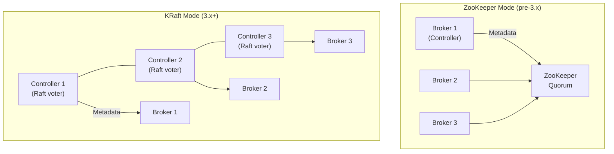
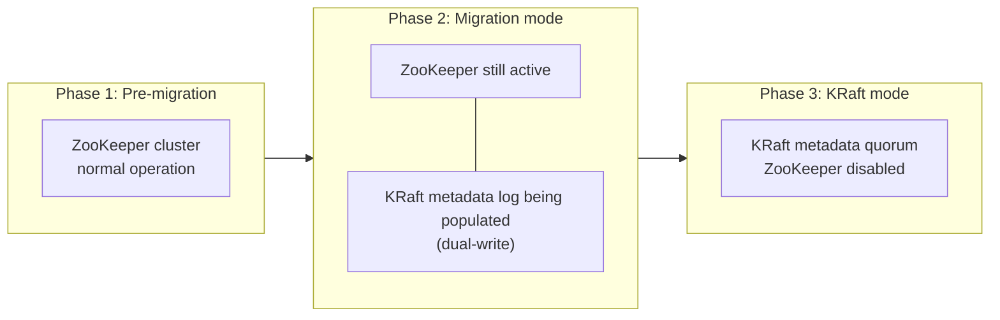

# KRaft — ZooKeeper Removal

> [!summary] Goal
> Understand KRaft (Kafka Raft): why ZooKeeper was removed, the KRaft metadata quorum architecture, deployment modes (combined vs dedicated controllers), migration from ZooKeeper mode, and operational differences.

## Table of Contents

1. [Why KRaft?](#why-kraft)
2. [Architecture](#architecture)
3. [Deployment Modes](#deployment-modes)
4. [Migration from ZooKeeper](#migration-from-zookeeper)
5. [Pitfalls](#pitfalls)

---

## Why KRaft?

> [!info] KRaft (KIP-500, KIP-866)
> Kafka originally used ZooKeeper for cluster metadata: broker membership, topic configuration, partition leadership, consumer group offsets, and ACLs. KRaft replaces ZooKeeper with an internal Raft-based metadata quorum. Benefits: simpler operations (one system instead of two), faster controller failover, better scalability (no ZooKeeper 1 MB request limit), and support for millions of partitions.



### What changes with KRaft

```text
ZooKeeper mode:
  - ZooKeeper stores broker metadata, topic configs, ACLs, quotas
  - Controller is one of the brokers (elected via ZooKeeper)
  - ZooKeeper handles leader election (controller)
  - Limit: ~200,000 partitions (ZooKeeper request size limit)

KRaft mode:
  - Controller quorum (separate or combined) stores ALL metadata
  - Controllers use Raft consensus for metadata replication
  - No ZooKeeper dependency at all
  - Limit: millions of partitions (no ZooKeeper bottleneck)
  - Faster controller failover (Raft leader election ~seconds vs ZooKeeper)
  - Single metadata log (__cluster_metadata) instead of ZooKeeper tree
```

---

## Architecture

> [!info] KRaft metadata quorum
> The KRaft metadata quorum is a Raft-based cluster of controllers. Controllers manage the metadata log (`__cluster_metadata` topic). Brokers are metadata consumers — they read metadata from the active controller. The active controller handles all metadata writes (topic creation, config changes, partition leadership).

```text
Metadata log record types:
  - RegisterBrokerRecord: a broker joined the cluster
  - TopicRecord: a topic was created
  - PartitionRecord: a partition's leader/ISR changed
  - ConfigRecord: a configuration was changed
  - ClientQuotaRecord: a quota was updated
  - AclRecord: an ACL was modified
  - DelegationTokenRecord: a delegation token
  - UserScramCredentialRecord: SCRAM credential

Each record is written to the metadata log (Raft replicated)
before being applied to the controller's in-memory state.
Brokers consume the metadata log to stay in sync.
```

### Combined vs dedicated controllers

| Mode | Controller nodes | Broker nodes | Use case |
|:----:|:----------------:|:------------:|----------|
| **Combined** | Same as brokers (e.g., 3 of 3) | 3 | Small clusters, dev/test |
| **Dedicated (recommended)** | Separate (e.g., 3 controllers) | N brokers | Production, large clusters |

```properties
# Combined mode (controller + broker on same process)
# process.roles=broker,controller
# node.id=1
# controller.quorum.voters=1@localhost:9094,2@localhost:9095,3@localhost:9096

# Dedicated controller
# process.roles=controller
# node.id=1
# controller.quorum.voters=1@controller-1:9094,2@controller-2:9094,3@controller-3:9094

# Dedicated broker
# process.roles=broker
# node.id=10
# controller.quorum.voters=1@controller-1:9094,2@controller-2:9094,3@controller-3:9094
```

### Controller election in KRaft

```text
KRaft uses Raft for controller election:
  1. Controllers elect a Raft leader (the active controller)
  2. The active controller handles ALL metadata writes
  3. If the leader fails, remaining controllers elect a new leader
  4. The new leader reads the metadata log to reconstruct state
  5. Brokers detect the leader change and reconnect

Raft election vs ZooKeeper:
  - ZooKeeper: ~30-60s to elect a new controller (ZAB protocol + GC)
  - KRaft: ~3-10s to elect a new controller (Raft with pre-vote)
```

---

## Deployment Modes

```bash
# server.properties — KRaft combined mode (dev)
process.roles=broker,controller
node.id=1
controller.quorum.voters=1@localhost:9094,2@localhost:9095,3@localhost:9096
listeners=PLAINTEXT://:9092,CONTROLLER://:9094
advertised.listeners=PLAINTEXT://localhost:9092
controller.listener.names=CONTROLLER

# Format the metadata log directory (one-time per cluster)
kafka-storage.sh format -t <cluster-id> -c /etc/kafka/server.properties

# cluster-id is a base64-encoded UUID. Generate with:
kafka-storage.sh random-uuid
# Or manually: echo "base64 for $UUID"

# Start the KRaft cluster
kafka-server-start.sh /etc/kafka/server.properties

# Verify quorum status
kafka-metadata-quorum --bootstrap-server localhost:9092 describe --status

# ClusterId: <id>
# LeaderId: 1
# LeaderEpoch: 5
# HighWatermark: 15000
# MaxFollowerLag: 0
```

```bash
# server.properties — KRaft dedicated controllers + brokers

# Controller 1 (node.id=1)
process.roles=controller
node.id=1
controller.quorum.voters=1@ctrl-1:9094,2@ctrl-2:9094,3@ctrl-3:9094
listeners=CONTROLLER://:9094
controller.listener.names=CONTROLLER

# Broker 1 (node.id=10)
process.roles=broker
node.id=10
controller.quorum.voters=1@ctrl-1:9094,2@ctrl-2:9094,3@ctrl-3:9094
listeners=PLAINTEXT://:9092
advertised.listeners=PLAINTEXT://b1.kafka.local:9092
controller.listener.names=CONTROLLER
```

---

## Migration from ZooKeeper

> [!info] KRaft migration (KIP-866)
> Kafka 3.5+ supports migrating a ZooKeeper-based cluster to KRaft mode with NO data loss and NO downtime. The migration process is automated via the `kafka-storage.sh` tool and is a one-way operation (KRaft → ZooKeeper rollback is NOT supported).



```bash
# Migration procedure (Kafka 3.5+)

# Step 1: Verify all brokers are at the minimum version (3.5+)
kafka-broker-api-versions --bootstrap-server localhost:9092

# Step 2: Run migration tool (dry-run first)
kafka-storage.sh migrate --config /etc/kafka/server.properties \
  --migration-metadata-json migration-metadata.json \
  --dry-run

# Step 3: Start migration (populates KRaft metadata log)
kafka-storage.sh migrate --config /etc/kafka/server.properties \
  --migration-metadata-json migration-metadata.json

# Step 4: Restart all brokers in migration mode
# Add to server.properties:
#   zookeeper.metadata.migration.enable=true

# Step 5: Verify dual-write mode is working
kafka-metadata-quorum --bootstrap-server localhost:9092 \
  describe --status

# Step 6: Finalize migration (ZooKeeper is no longer needed)
kafka-storage.sh finalize-migration --config /etc/kafka/server.properties

# Step 7: Remove ZooKeeper config, restart all brokers without ZK
```

---

## Pitfalls

### Metadata log directory must be formatted per controller

Each controller node must have its metadata directory formatted with `kafka-storage.sh format`. The `cluster-id` must be the same across all controllers. Failure to format or using different cluster IDs causes the controller to fail to join the quorum.

### No rollback from KRaft to ZooKeeper

Once migration is finalized, there is NO supported rollback path. Test migration thoroughly in a staging environment first. Back up the ZooKeeper data and the KRaft metadata directory before finalizing.

### Controller quorum size must be odd

KRaft uses Raft, which requires a majority to make progress. For fault tolerance: use 3 controllers (tolerate 1 failure) for most clusters, 5 controllers (tolerate 2 failures) for large/critical clusters. Even numbers are wasted (4 controllers tolerates only 1 failure, same as 3).

---

> [!question]- Interview Questions
>
> **Q: Why did Kafka remove ZooKeeper?**
> A: ZooKeeper had several limitations: (1) 1 MB request size limit capped the number of partitions (~200K), (2) slow controller failover (30-60s) during ZooKeeper session timeout, (3) operational complexity of maintaining a separate ZooKeeper cluster, (4) ZooKeeper's ZAB protocol couldn't match Kafka's performance requirements. KRaft solves all of these with an embedded Raft-based metadata quorum.
>
> **Q: How does KRaft handle metadata reads vs writes?**
> A: Only the active Raft leader (active controller) handles metadata WRITES (topic creation, config changes, ACL updates). Metadata READS are served by any controller. Brokers connect to the active controller to receive metadata changes (push-based — the controller pushes changes to brokers via the metadata log). This is similar to the ZooKeeper model but faster because the metadata log is a Kafka topic with all the performance benefits.

---

## Cross-Links

- [[CICD/Kafka/01_Foundations/01_Kafka_Architecture_and_Core_Concepts]] for ZK vs KRaft comparison
- [[CICD/Kafka/03_Advanced/A00_Storage_and_Replication_Internals]] for Raft consensus internals
- [[CICD/Kafka/03_Advanced/A05_Migration_and_Upgrades]] for general upgrade procedures
- [[CICD/Kafka/04_Playbooks/04_Migration_Playbook]] for ZK-to-KRaft migration steps
