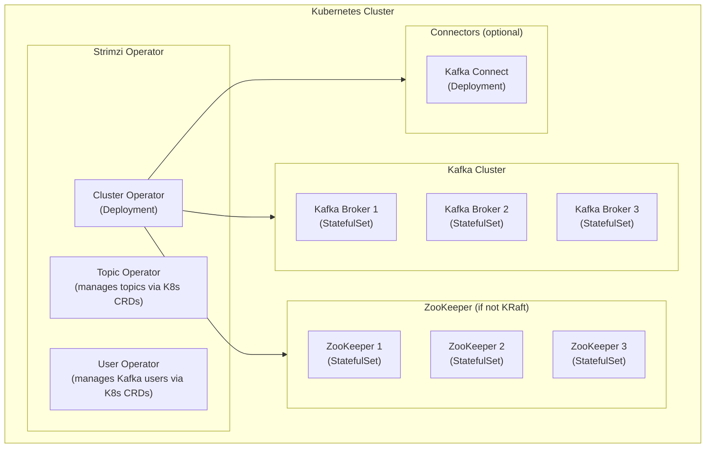

# Kafka on Kubernetes

> [!summary] Goal
> Understand running Kafka on Kubernetes: Strimzi operator, StatefulSets, persistent volumes, pod disruption budgets, node port vs load balancer, Cruise Control for rebalancing, and production best practices.

## Table of Contents

1. [Strimzi Operator](#strimzi-operator)
2. [StatefulSet and Persistent Storage](#statefulset-and-persistent-storage)
3. [Networking and Service Discovery](#networking-and-service-discovery)
4. [Cruise Control](#cruise-control)
5. [Production Checklist](#production-checklist)
6. [Pitfalls](#pitfalls)

---

## Strimzi Operator

> [!info] Strimzi
> Strimzi is a Kubernetes operator that manages Kafka clusters (brokers, ZooKeeper/KRaft, Connect, MirrorMaker, Schema Registry, Cruise Control) via custom resource definitions (CRDs). It handles: deployment, configuration, rolling updates, scaling, and health checks. Strimzi is the de-facto standard for Kafka on Kubernetes.



### Strimzi custom resources

```yaml
# kafka.yaml — Kafka cluster definition
apiVersion: kafka.strimzi.io/v1beta2
kind: Kafka
metadata:
  name: my-cluster
  namespace: kafka
spec:
  kafka:
    version: 3.7.0
    replicas: 3
    # KRaft mode (recommended for 3.5+)
    # metadataVersion: 3.7
    # ZooKeeper mode:
    # zookeeper: {}

    # Storage — must use persistent volumes for production
    storage:
      type: jbod
      volumes:
        - id: 0
          type: persistent-claim
          size: 1Ti
          deleteClaim: false
          class: ssd-storage

    # Listeners — how clients connect
    listeners:
      - name: plain
        port: 9092
        type: internal  # ClusterIP (for in-cluster clients)
        tls: false
      - name: tls
        port: 9093
        type: route    # OpenShift Route, or: loadbalancer / nodeport
        tls: true
      - name: external
        port: 9094
        type: loadbalancer
        tls: true

    # Resource requests/limits
    resources:
      requests:
        memory: 8Gi
        cpu: "4"
      limits:
        memory: 16Gi
        cpu: "8"

    # Config overrides
    config:
      offsets.topic.replication.factor: 3
      transaction.state.log.replication.factor: 3
      transaction.state.log.min.isr: 2
      default.replication.factor: 3
      min.insync.replicas: 2
      num.partitions: 6
      log.retention.hours: 168

    # Pod-level settings
    template:
      pod:
        affinity:
          podAntiAffinity:
            requiredDuringSchedulingIgnoredDuringExecution:
              - labelSelector:
                  matchExpressions:
                    - key: strimzi.io/name
                      operator: In
                      values:
                        - my-cluster-kafka
                topologyKey: kubernetes.io/hostname

  zookeeper:
    replicas: 3
    storage:
      type: persistent-claim
      size: 100Gi
      deleteClaim: false
      class: ssd-storage

  entityOperator:
    topicOperator: {}
    userOperator: {}
```

```yaml
# kafkatopic.yaml — Topic managed by Strimzi
apiVersion: kafka.strimzi.io/v1beta2
kind: KafkaTopic
metadata:
  name: orders
  namespace: kafka
  labels:
    strimzi.io/cluster: my-cluster
spec:
  partitions: 6
  replicas: 3
  config:
    retention.ms: 604800000  # 7 days
    cleanup.policy: delete

# kafkauser.yaml — User managed by Strimzi
apiVersion: kafka.strimzi.io/v1beta2
kind: KafkaUser
metadata:
  name: app-producer
  namespace: kafka
  labels:
    strimzi.io/cluster: my-cluster
spec:
  authentication:
    type: tls  # or scram-sha-512
  authorization:
    type: simple
    acls:
      - resource:
          type: topic
          name: "orders"
          patternType: literal
        operations:
          - Write
          - Describe
        host: "*"
```

---

## StatefulSet and Persistent Storage

> [!info] StatefulSet
> Kafka on Kubernetes uses StatefulSets (not Deployments) because each broker needs stable identity and persistent storage. Each pod gets: a stable hostname (`broker-0`, `broker-1`, ...), a dedicated PersistentVolumeClaim (PVC), and ordered startup/shutdown.

```yaml
# PersistentVolumeClaim — created automatically by StatefulSet
# StatefulSet spec: storage:
#   type: persistent-claim
#   size: 1Ti
#   class: ssd-storage
#   deleteClaim: false  # Keep PVC on pod delete

# PVC naming: data-<cluster-name>-kafka-<id>
# Example: data-my-cluster-kafka-0
```

### Storage considerations

```text
Production storage requirements:
  - SSD/NVMe: required for low-latency writes
  - Local NVMe (with Local Persistent Volumes): best performance
  - Network storage (EBS, Cinder): use gp3 or io2 with sufficient IOPS
  - RAID-0 across multiple volumes: use jbod storage type in Strimzi

Strimzi JBOD config (striping across multiple volumes):
  storage:
    type: jbod
    volumes:
      - id: 0
        type: persistent-claim
        size: 2Ti
        class: ssd-storage
      - id: 1
        type: persistent-claim
        size: 2Ti
        class: ssd-storage
  # Kafka will write to /var/lib/kafka/data-0 and /var/lib/kafka/data-1
  # Partitions are distributed across volumes (not software RAID)
```

### Pod identity and broker configuration

```properties
# Each broker pod gets its config from the StatefulSet
# broker.id (or node.id in KRaft) = pod ordinal (0, 1, 2, ...)
# advertised.listeners = <pod-name>.<service-name>.<namespace>.svc:9092

# Example broker 0:
#   broker.id=0
#   advertised.listeners=my-cluster-kafka-0.my-cluster-kafka-brokers.kafka.svc:9092
```

---

## Networking and Service Discovery

| Listener type | Access | TLS | Use case |
|:-------------:|:------:|:---:|----------|
| **internal** | ClusterIP (in-cluster only) | Optional | Apps in the same K8s cluster |
| **route** | OpenShift Route | Required | External access on OpenShift |
| **loadbalancer** | Cloud LB (AWS ELB, GCP LB) | Required | External access on cloud |
| **nodeport** | Node IP + static port | Required | External access on-premises |

### Client connectivity

```yaml
# For in-cluster applications:
# bootstrap.servers=my-cluster-kafka-bootstrap.kafka.svc:9092

# For external access (loadbalancer):
# bootstrap.servers=my-cluster-kafka-bootstrap.kafka.example.com:9094

# Strimzi handles TLS certificate management automatically
# (self-signed or cert-manager integration)
```

---

## Cruise Control

> [!info] Cruise Control
> Cruise Control is an open-source tool (integrated with Strimzi) that automatically rebalances partition load across brokers. It monitors disk usage, CPU, network I/O, and moves partitions to balance the cluster. Strimzi manages Cruise Control as a separate deployment.

```yaml
# Strimzi configuration to enable Cruise Control
# In kafka.yaml:
spec:
  cruiseControl:
    # Cruise Control pod resources
    resources:
      requests:
        memory: 4Gi
        cpu: "2"
    config:
      # Rebalance goals (in order of priority)
      goals:
        - com.linkedin.kafka.cruisecontrol.analyzer.goals.RackAwareGoal
        - com.linkedin.kafka.cruisecontrol.analyzer.goals.DiskCapacityGoal
        - com.linkedin.kafka.cruisecontrol.analyzer.goals.NetworkInboundCapacityGoal
        - com.linkedin.kafka.cruisecontrol.analyzer.goals.LeaderBytesInDistributionGoal
        - com.linkedin.kafka.cruisecontrol.analyzer.goals.ReplicaDistributionGoal
```

```bash
# Trigger a rebalance via Strimzi KafkaRebalance CR
# kafkarebalance.yaml
apiVersion: kafka.strimzi.io/v1beta2
kind: KafkaRebalance
metadata:
  name: cluster-rebalance
  namespace: kafka
  labels:
    strimzi.io/cluster: my-cluster
spec:
  mode: AddBrokers  # or: RemoveBrokers, Full, Goals

# Apply
kubectl apply -f kafkarebalance.yaml

# Check rebalance status
kubectl get kafkarebalance cluster-rebalance -o yaml

# Approve the rebalance proposal
kubectl annotate kafkarebalance cluster-rebalance \
  strimzi.io/rebalance-auto-approval="true"
```

---

## Production Checklist

```text
Production Kafka on K8s checklist:

  [x] Dedicated node pool for Kafka (not shared with other workloads)
  [x] Local SSD or high-IOPS EBS with `storage: persistent-claim`
  [x] Pod anti-affinity: one broker per K8s node (no two brokers on same node)
  [x] Topology spread constraints: spread brokers across zones
  [x] PodDisruptionBudget: minAvailable: 2 (tolerates 1 broker disruption)
  [x] Resource requests/limits configured (CPU, memory)
  [x] JVM heap: < 50% of pod memory (leave rest for OS page cache)
  [x] KRaft mode (3.5+): dedicated controllers recommended
  [x] Storage class with `volumeBindingMode: WaitForFirstConsumer`
  [x] Network policies restrict traffic to/from Kafka
  [x] CPU manager policy: static (set kubelet --cpu-manager-policy=static)
  [x] HugePages: optional but helps with page cache performance
  [x] Cruise Control enabled for auto-rebalancing
  [x] Prometheus JMX exporter for metrics collection
  [x] Grafana dashboard for Kafka on K8s
```

```yaml
# PodDisruptionBudget — ensures at most 1 broker is down during maintenance
apiVersion: policy/v1
kind: PodDisruptionBudget
metadata:
  name: my-cluster-kafka
  namespace: kafka
spec:
  minAvailable: 2
  selector:
    matchLabels:
      strimzi.io/name: my-cluster-kafka
```

---

## Pitfalls

### Non-local storage causes performance degradation

Using network storage (EBS gp2, Cinder, NFS) for Kafka data volumes causes high latency and low throughput. Kafka needs low-latency, high-IOPS storage. Use local NVMe SSDs (with Local Persistent Volume CSI driver) or high-IOPS cloud volumes (EBS io2, GCP PD-SSD with provisioned IOPS).

### Pod restart destroys page cache

When a Kafka broker pod restarts on Kubernetes, it starts on a new node (or a new pod on the same node with a cold page cache). All page cache is lost. The broker must re-read data from disk, causing high latency until the page cache warms up again. Mitigations: (1) use `terminationGracePeriodSeconds` to allow graceful shutdown, (2) pin pods to nodes (but this reduces scheduling flexibility).

### Node port exhaustion with many clients

Using `NodePort` listeners with many external clients can exhaust the node port range (default 30000-32767). Prefer `LoadBalancer` for external access or use a proxy (e.g., HAProxy, Envoy) to route traffic to the Kafka brokers.

---

> [!question]- Interview Questions
>
> **Q: Why use Strimzi instead of deploying Kafka manually on K8s?**
> A: Strimzi handles all the Kafka-specific K8s complexity: StatefulSet management with stable broker identities, PVC lifecycle, rolling upgrades with protocol version management, listener configuration (internal/loadbalancer/nodeport), TLS certificate management, Cruise Control integration, and Topic/User CRDs for declarative management. Without Strimzi, each of these requires significant manual configuration and custom scripts.
>
> **Q: How do clients outside Kubernetes connect to Kafka on K8s?**
> A: Strimzi supports multiple listener types: (1) `loadbalancer` — creates a LoadBalancer Service per broker + a bootstrap LB for initial connection, (2) `nodeport` — exposes a static port on each node, (3) `route` — OpenShift Route with TLS passthrough. The recommended approach for cloud: `loadbalancer` with TLS. Each broker gets its own LoadBalancer, and the bootstrap service routes the client to the correct broker.

---

## Cross-Links

- [[CICD/Kafka/01_Foundations/01_Kafka_Architecture_and_Core_Concepts]] for broker architecture
- [[CICD/Kafka/03_Advanced/A03_Security]] for TLS and authentication on K8s
- [[CICD/Kafka/03_Advanced/A04_Monitoring_and_Observability]] for Prometheus/Grafana on K8s
- [[CICD/Kubernetes/]] for Kubernetes fundamentals
