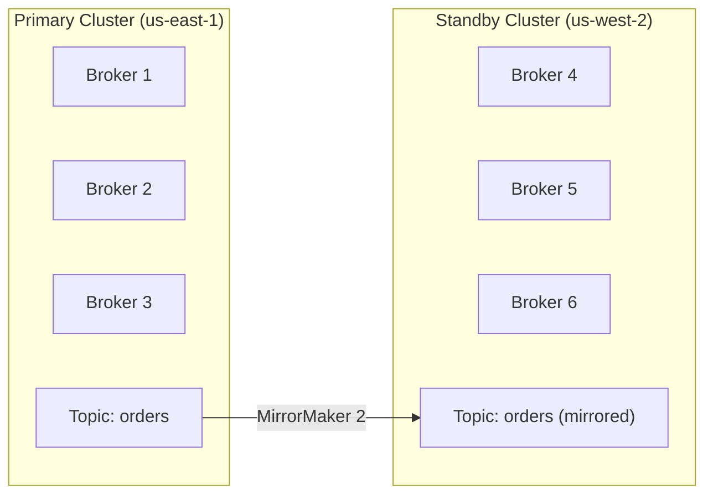

# Production Hardening

> [!summary] Goal
> Hardening checklist for production Kafka clusters: OS tuning, broker config, security, monitoring, backup, and disaster recovery.

## Table of Contents

1. [OS and JVM Tuning](#os-and-jvm-tuning)
2. [Broker Configuration](#broker-configuration)
3. [Security Checklist](#security-checklist)
4. [Backup and Disaster Recovery](#backup-and-disaster-recovery)
5. [Pitfalls](#pitfalls)

---

## OS and JVM Tuning

```bash
# /etc/sysctl.conf — OS tuning for Kafka
# Run: sysctl -p

# File descriptors (Kafka opens many files: segments, connections)
# 1 broker with 100 partitions = ~1000 file descriptors
# Set to at least 100000
fs.file-max = 200000

# Network tuning
net.core.rmem_max = 16777216
net.core.wmem_max = 16777216
net.ipv4.tcp_rmem = 4096 87380 16777216
net.ipv4.tcp_wmem = 4096 65536 16777216
net.core.netdev_max_backlog = 5000
net.ipv4.tcp_max_syn_backlog = 10240
net.ipv4.tcp_fin_timeout = 15

# Virtual memory
# Disable swap (or set very low)
vm.swappiness = 1
# Allow overcommit (Kafka pre-allocates segment files)
vm.overcommit_memory = 1

# Dirty page limits (more buffered writes before flushing to disk)
vm.dirty_background_ratio = 10
vm.dirty_ratio = 40
```

```bash
# /etc/security/limits.conf
kafka soft nofile 100000
kafka hard nofile 100000
kafka soft nproc 32768
kafka hard nproc 32768
```

### JVM heap settings

```bash
# KAFKA_HEAP_OPTS — JVM memory settings

# Rule of thumb: heap = min(6-8 GB, 25% of total RAM)
# Rest of RAM → OS page cache

# For 64 GB RAM broker:
export KAFKA_HEAP_OPTS="-Xms8g -Xmx8g"

# For 32 GB RAM broker:
# export KAFKA_HEAP_OPTS="-Xms6g -Xmx6g"

# For 16 GB RAM broker (memory-constrained):
# export KAFKA_HEAP_OPTS="-Xms4g -Xmx4g"

# Additional JVM options
export KAFKA_JVM_PERFORMANCE_OPTS="-server \
  -XX:+UseG1GC \
  -XX:MaxGCPauseMillis=20 \
  -XX:InitiatingHeapOccupancyPercent=35 \
  -XX:+DisableExplicitGC \
  -Djava.awt.headless=true"

# G1GC: good balance, low pause times
# ParallelGC: higher throughput but longer pauses (not recommended for latency-sensitive)
```

---

## Broker Configuration

```properties
# server.properties — production broker config

# Basics
broker.id=0  # Unique per broker
log.dirs=/data/kafka-0,/data/kafka-1  # Multiple disks (JBOD)
num.network.threads=8
num.io.threads=16

# Topic defaults
num.partitions=6
default.replication.factor=3
min.insync.replicas=2

# Durability
offsets.topic.replication.factor=3
transaction.state.log.replication.factor=3
transaction.state.log.min.isr=2
unclean.leader.election.enable=false

# Retention
log.retention.hours=168  # 7 days
log.segment.bytes=1073741824  # 1 GB
log.retention.check.interval.ms=300000  # 5 min

# Limits
message.max.bytes=1048576  # 1 MB per message (increase for large messages)
replica.fetch.max.bytes=10485760  # 10 MB per fetch
max.request.size=10485760  # 10 MB per request

# Connection limits (prevent connection storms)
max.connections.per.ip=1000
max.connections.per.ip.overrides=10.0.0.1:5000

# Compression
compression.type=producer

# Monitoring
metric.reporters=com.example.CustomMetricsReporter
```

---

## Security Checklist

```properties
# Minimal security: encryption + authentication + authorization

# 1. Encryption (SSL)
listeners=SASL_SSL://:9093
ssl.keystore.location=/etc/kafka/secrets/broker.keystore.jks
ssl.keystore.password=${SSL_KEYSTORE_PASSWORD}
ssl.truststore.location=/etc/kafka/secrets/broker.truststore.jks
ssl.truststore.password=${SSL_TRUSTSTORE_PASSWORD}
ssl.client.auth=required  # mTLS

# 2. Authentication (SASL/SCRAM)
sasl.enabled.mechanisms=SCRAM-SHA-512
sasl.mechanism.inter.broker.protocol=SCRAM-SHA-512
security.inter.broker.protocol=SASL_SSL

# 3. Authorization (ACLs)
authorizer.class.name=kafka.security.authorizer.AclAuthorizer
allow.everyone.if.no.acl.found=false  # DENY by default!
super.users=User:admin

# 4. Auditing
# Enable request logging (only for troubleshooting, can be verbose)
# log4j.logger.kafka.request.logger=TRACE, requestAppender
```

### Secrets management

```bash
# Use environment variables for secrets (Kafka 2.8+)
# In server.properties:
# ssl.keystore.password=${SSL_KEYSTORE_PASSWORD}
# etc.

# In systemd service file:
Environment=SSL_KEYSTORE_PASSWORD=changeit
Environment=SSL_TRUSTSTORE_PASSWORD=changeit

# Or use Kubernetes Secrets + K8s env vars
```

---

## Backup and Disaster Recovery

> [!info] Disaster recovery
> Kafka replication handles broker failures within a cluster. For cross-cluster DR: (1) MirrorMaker 2 for async replication to a standby cluster, or (2) backup topic data + consumer offsets to S3/GCS, or (3) Confluent Cluster Linking for continuous async replication.



### MirrorMaker 2 configuration

```properties
# mm2.properties
clusters=primary,standby
primary.bootstrap.servers=primary-cluster:9092
standby.bootstrap.servers=standby-cluster:9092

# Enable replication from primary to standby
primary->standby.enabled=true

# Replicate all topics
primary->standby.topics=.*

# Replication policy: add source cluster prefix
# replication.policy.class=org.apache.kafka.connect.mirror.IdentityReplicationPolicy
# IdentityReplicationPolicy: topic names stay the same (Kafka 2.5+)
# Default: topics are renamed as "primary.orders"
```

### Backup offsets

```bash
# Backup consumer offsets (for restoring consumer positions after DR)
kafka-consumer-groups --bootstrap-server primary:9092 \
  --group my-group --describe > /backup/offsets-2024-01-01.txt

# On standby cluster, reset offsets to match
kafka-consumer-groups --bootstrap-server standby:9092 \
  --group my-group --reset-offsets \
  --to-offset 1500 --topic orders:0 --execute
```

### Data backup to object storage

```bash
# Export topic data to Parquet/Avro files in S3
# Use S3 Sink Connector with format=avro
# Schedule periodic exports (e.g., every 6 hours)

# Restore from backup:
# 1. Read the backup files
# 2. Produce to a new topic on the restored cluster
# 3. Use Kafka Connect or custom producer
```

---

## Pitfalls

### Superfluous Kafka configs

Many default configs should NOT be changed unless you understand the impact. For example: `log.cleaner.threads`, `log.cleaner.dedupe.buffer.size`, `log.cleaner.io.max.bytes.per.second`. Changing these without benchmarking can degrade performance.

### Backup without testing restore

Backing up topic data is useless if you can't restore it. Test the restore procedure quarterly: (1) provision a new Kafka cluster, (2) restore the backup, (3) verify data integrity, (4) measure restore time. Document the procedure.

### Over-allocating heap

Setting heap too large (> 16 GB) causes long GC pauses. Kafka's performance comes from the OS page cache, not the JVM heap. Keep heap at 6-8 GB. The rest of RAM goes to the OS page cache. For 64 GB RAM: heap = 8 GB, page cache = 56 GB.

---

> [!question]- Interview Questions
>
> **Q: What's the most important OS tuning for Kafka?**
> A: File descriptor limits (`fs.file-max`, `nofile`). Kafka opens one file descriptor per segment file, each network connection, and each log directory. A production broker with 2000 partitions and 500 connections uses ~5000+ file descriptors. The default limit (1024) is far too low. Set to at least 100,000.
>
> **Q: How do you plan disaster recovery for Kafka?**
> A: MirrorMaker 2 for active-standby replication across regions. The standby cluster continuously mirrors topics. On failure: (1) promote standby to primary (update DNS), (2) point producers/consumers to standby, (3) restore consumer offsets from backup. Test the procedure quarterly. RPO (recovery point objective) = MirrorMaker replication lag; RTO (recovery time objective) = DNS propagation + offset restore time.

---

## Cross-Links

- [[CICD/Kafka/03_Advanced/A03_Security]] for security configuration details
- [[CICD/Kafka/03_Advanced/A04_Monitoring_and_Observability]] for monitoring setup
- [[CICD/Kafka/02_Core/04_Performance_Tuning]] for OS/networking tuning
- [[CICD/Kafka/03_Advanced/A06_KRaft_and_ZooKeeper_Removal]] for KRaft migration
