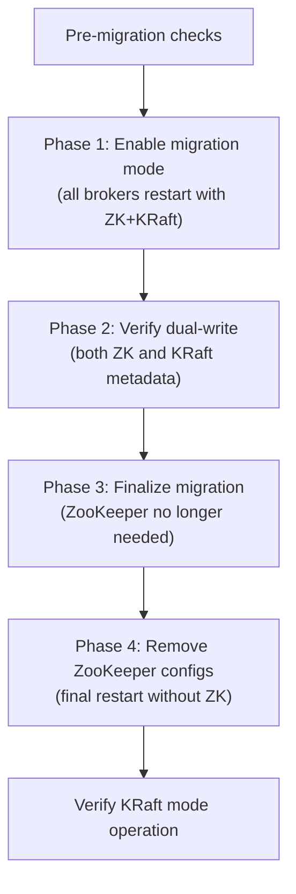

# Migration Playbook

> [!summary] Goal
> Step-by-step procedures for common Kafka migrations: ZooKeeper-to-KRaft, cluster-to-cluster data migration, topic migration, and consumer migration.

## Table of Contents

1. [ZooKeeper to KRaft Migration](#zookeeper-to-kraft-migration)
2. [Cluster-to-Cluster Data Migration](#cluster-to-cluster-data-migration)
3. [Topic Migration](#topic-migration)
4. [Consumer Migration](#consumer-migration)
5. [Pitfalls](#pitfalls)

---

## ZooKeeper to KRaft Migration

> [!info] ZK-to-KRaft migration
> Migrate a ZooKeeper-based cluster to KRaft (Kafka 3.5+). The migration is a one-way, multi-phase process with NO data loss and minimal downtime (one rolling restart per phase).



### Pre-migration checklist

```bash
# 1. Verify ALL brokers are at Kafka 3.5+
kafka-broker-api-versions --bootstrap-server localhost:9092

# 2. Verify ZooKeeper cluster is healthy
echo "ruok" | nc zookeeper-1 2181
echo "stat" | nc zookeeper-1 2181

# 3. Back up ZooKeeper data
# Stop ZooKeeper, archive data directory:
tar -czf /backup/zk-data-$(date +%Y%m%d).tar.gz /var/lib/zookeeper/data

# 4. Back up broker configs
cp -r /etc/kafka /backup/kafka-config-$(date +%Y%m%d)

# 5. Verify no under-replicated partitions
kafka-topics --bootstrap-server localhost:9092 --describe \
  | grep -i "underreplicated"
# Should return nothing
```

### Phase 1: Enable migration mode

```bash
# On EACH broker, one at a time:

# Step 1: Add KRaft config to server.properties
# Add:
#   zookeeper.metadata.migration.enable=true
#   node.id=<unique-id-per-broker>  # e.g., 1, 2, 3
#   process.roles=broker  # Keep "broker" (not controller)

# Step 2: Generate a cluster ID
CLUSTER_ID=$(kafka-storage.sh random-uuid)

# Step 3: Format KRaft metadata directory
kafka-storage.sh format -t $CLUSTER_ID -c /etc/kafka/server.properties

# Step 4: Restart broker
kafka-server-stop.sh && sleep 10
kafka-server-start.sh -daemon /etc/kafka/server.properties

# Step 5: Verify broker is healthy
kafka-broker-api-versions --bootstrap-server localhost:9092

# Repeat for ALL brokers
```

### Phase 2: Verify dual-write

```bash
# KRaft metadata is being populated while ZooKeeper is still active

# 1. Check KRaft metadata log
kafka-metadata-quorum --bootstrap-server localhost:9092 describe --status
# Expected: LeaderId present, MaxFollowerLag small

# 2. Create a test topic (should work through both ZK and KRaft)
kafka-topics --bootstrap-server localhost:9092 \
  --create --topic migration-test --partitions 3

# 3. Produce and consume test data
echo "test" | kafka-console-producer --topic migration-test \
  --bootstrap-server localhost:9092
kafka-console-consumer --topic migration-test \
  --bootstrap-server localhost:9092 --from-beginning

# 4. Delete test topic
kafka-topics --bootstrap-server localhost:9092 \
  --delete --topic migration-test
```

### Phase 3: Finalize migration

```bash
# Run on ONE broker (the migration tool uses the cluster metadata)
kafka-storage.sh finalize-migration \
  --config /etc/kafka/server.properties

# After finalize:
# - ZooKeeper is no longer used
# - ZooKeeper process can be stopped
# - KRaft metadata log is authoritative
```

### Phase 4: Remove ZooKeeper config

```bash
# On EACH broker, one at a time:

# 1. Remove from server.properties:
#    zookeeper.connect
#    zookeeper.metadata.migration.enable

# 2. Restart broker
kafka-server-stop.sh && sleep 10
kafka-server-start.sh -daemon /etc/kafka/server.properties

# 3. Verify no ZooKeeper dependency
# In broker logs: "ZooKeeper migration completed, running in KRaft mode"

# 4. Stop ZooKeeper (optional, but recommended to reduce resource usage)
# /opt/zookeeper/bin/zkServer.sh stop
```

---

## Cluster-to-Cluster Data Migration

### MirrorMaker 2 (preferred)

```bash
# MirrorMaker 2 — async replication between clusters
# Use for: DR, cross-region, data center migration

# 1. Create MirrorMaker 2 config
cat > mm2.properties <<EOF
clusters=source,target
source.bootstrap.servers=source-cluster:9092
target.bootstrap.servers=target-cluster:9092

source->target.enabled=true
source->target.topics=orders,payments,customers

# Topic config replication
sync.topic.configs.enabled=true
sync.topic.acls.enabled=true

# Consumer group offset sync (for DR failover)
# groups=.*
# sync.group.offsets.enabled=true

# Replication policy
replication.policy.class=org.apache.kafka.connect.mirror.IdentityReplicationPolicy
EOF

# 2. Start MirrorMaker 2
./bin/connect-mirror-maker.sh mm2.properties

# 3. Verify replication
kafka-console-consumer --bootstrap-server target-cluster:9092 \
  --topic orders --from-beginning --max-messages 10
```

### Manual data copy (for smaller migrations)

```bash
# Step 1: Export data from source cluster to files
kafka-console-consumer --bootstrap-server source:9092 \
  --topic orders --from-beginning \
  --property print.key=true \
  --property key.separator="|" \
  > /tmp/orders-export.txt

# Step 2: Import into target cluster (with key re-partitioning)
cat /tmp/orders-export.txt | kafka-console-producer \
  --bootstrap-server target:9092 \
  --topic orders \
  --property "parse.key=true" \
  --property "key.separator=|"

# For better throughput: use kafka-connect or kafka-replicator
```

---

## Topic Migration

### Change partition count (requires new topic)

```bash
# Step 1: Create new topic with desired partition count
kafka-topics --bootstrap-server localhost:9092 \
  --create --topic orders-v2 --partitions 12 --replication-factor 3

# Step 2: Mirror data from old to new (using Kafka Streams or custom producer)
# Kafka Streams approach:
KStream<String, Order> oldOrders = builder.stream("orders");
oldOrders.to("orders-v2");

# Step 3: Re-point consumers to new topic
# Update consumer config: topics=orders-v2 (instead of orders)

# Step 4: Wait for all consumers to catch up, then delete old topic
kafka-topics --bootstrap-server localhost:9092 \
  --delete --topic orders
```

### Topic rename

```bash
# Step 1: Create new topic with correct name
kafka-topics --bootstrap-server localhost:9092 \
  --create --topic new-orders --partitions 6 --replication-factor 3

# Step 2: Mirror data
# Using MirrorMaker 2's IdentityReplicationPolicy with specific topics

# Step 3: Migrate producers to new topic
# Step 4: Migrate consumers to new topic
# Step 5: Delete old topic
```

---

## Consumer Migration

### Re-point consumers to a new cluster

```bash
# 1. On the source cluster, commit the latest offsets
# Consumer should commitSync() before shutdown

# 2. Record the committed offsets
kafka-consumer-groups --bootstrap-server source:9092 \
  --group my-group --describe > /tmp/offsets-before-migration.txt

# 3. On the target cluster, reset offsets to match source
# If data is already mirrored (same offsets):
kafka-consumer-groups --bootstrap-server target:9092 \
  --group my-group --reset-offsets --to-latest --execute

# If offsets differ (MirrorMaker 2 with topic renaming):
kafka-consumer-groups --bootstrap-server target:9092 \
  --group my-group --reset-offsets \
  --to-offset 1500 --topic new-orders:0 --execute

# 4. Update consumer config: bootstrap.servers → target cluster
# 5. Restart consumers
```

---

## Pitfalls

### Attempting rollback after KRaft migration finalization

Once `kafka-storage.sh finalize-migration` is run, there is NO supported rollback. ZooKeeper becomes out of sync with the KRaft metadata log within seconds. If you must roll back, restore from backup (pre-migration backup). Never attempt to "merge" ZK and KRaft metadata.

### MirrorMaker 2 topic name collision

With default replication policy, MirrorMaker 2 renames topics to `source-cluster.topic-name`. With `IdentityReplicationPolicy` (Kafka 2.5+), topic names stay the same. If both clusters have topics with the same name, the replication fails. Use different topic names or ensure one cluster's topics don't exist during initial mirroring.

### Offset gap during consumer migration

If consumers migrate to a new topic but the topic doesn't have data at the same offsets, consumers may miss messages or re-read old data. Always commit offsets to the source topic before migration, and reset offsets on the target topic to match the source's committed offsets.

---

> [!question]- Interview Questions
>
> **Q: What is the minimum downtime for a ZK-to-KRaft migration?**
> A: One rolling restart per phase (4 restarts total: migration mode, verify, finalize, remove ZK config). Each restart takes seconds per broker. If the cluster has 3 brokers and you restart one at a time with verification, total downtime per broker is ~1-2 minutes. During the restart of one broker, the other 2 remain available (with RF=3 and min.insync.replicas=2).
>
> **Q: How do you migrate a topic to more partitions without losing data?**
> A: Partition count cannot be changed on an existing topic. Create a new topic with the desired partition count. Use Kafka Streams or a custom producer to copy data from the old topic to the new one. While copying, producers should dual-write (write to both old and new topics). Once the copy catches up, switch producers to the new topic, then consumers. Finally, delete the old topic. This is a blue-green deployment for topics.

---

## Cross-Links

- [[CICD/Kafka/03_Advanced/A05_Migration_and_Upgrades]] for upgrade procedures
- [[CICD/Kafka/03_Advanced/A06_KRaft_and_ZooKeeper_Removal]] for KRaft architecture
- [[CICD/Kafka/03_Advanced/A01_Kafka_Connect]] for MirrorMaker 2 configuration
- [[CICD/Kafka/02_Core/04_Performance_Tuning]] for benchmark baselines
