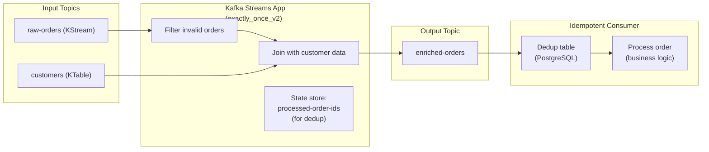

# Exactly-Once Pipeline with Idempotent Consumers

> [!summary] Goal
> Build an end-to-end exactly-once pipeline: produce from one topic, join with a KTable, transform, and produce to another topic. Covers Kafka Streams EOS, idempotent consumers with dedup tables, and transactional producers.

## Table of Contents

1. [Architecture Overview](#architecture-overview)
2. [Kafka Streams EOS Pipeline](#kafka-streams-eos-pipeline)
3. [Idempotent Consumer with Dedup Table](#idempotent-consumer-with-dedup-table)
4. [Testing and Verification](#testing-and-verification)
5. [Pitfalls](#pitfalls)

---

## Architecture Overview

> [!info] Project goal
> Build a pipeline that reads raw orders, enriches them with customer data (KTable), and writes enriched orders to an output topic — with exactly-once semantics end-to-end. The pipeline must survive producer failures, consumer failures, and broker failures without data loss or duplication.



---

## Kafka Streams EOS Pipeline

### Config

```properties
# streams.properties
application.id=enriched-orders-pipeline
bootstrap.servers=localhost:9092

# Exactly-once semantics
processing.guarantee=exactly_once_v2
# v2 (Kafka 2.5+): fewer transactions, lower latency

# Default serialization
default.key.serde=org.apache.kafka.common.serialization.Serdes$StringSerde
default.value.serde=io.confluent.kafka.streams.serdes.avro.SpecificAvroSerde

# State store
state.dir=/tmp/kafka-streams-state

# Transactional config (auto-configured with exactly_once_v2)
# transaction.timeout.ms=60000
# commit.interval.ms=100
```

### Topology

```java
import org.apache.kafka.streams.*;
import org.apache.kafka.streams.kstream.*;
import org.apache.kafka.streams.state.*;
import io.confluent.kafka.serializers.AbstractKafkaSchemaSerDeConfig;
import java.util.Properties;

public class EnrichedOrdersPipeline {

    public static void main(String[] args) {
        Properties props = new Properties();
        props.put(StreamsConfig.APPLICATION_ID_CONFIG, "enriched-orders-pipeline");
        props.put(StreamsConfig.BOOTSTRAP_SERVERS_CONFIG, "localhost:9092");
        props.put(StreamsConfig.PROCESSING_GUARANTEE_CONFIG, "exactly_once_v2");
        props.put(StreamsConfig.STATE_DIR_CONFIG, "/tmp/kafka-streams-state");
        props.put(AbstractKafkaSchemaSerDeConfig.SCHEMA_REGISTRY_URL_CONFIG,
            "http://localhost:8081");

        StreamsBuilder builder = new StreamsBuilder();

        // Input: raw orders (KStream)
        KStream<String, RawOrder> rawOrders = builder.stream(
            "raw-orders",
            Consumed.with(Serdes.String(), orderSerde)
        );

        // Input: customers (KTable)
        KTable<String, Customer> customers = builder.table(
            "customers",
            Consumed.with(Serdes.String(), customerSerde)
        );

        // Filter and join
        KStream<String, EnrichedOrder> enrichedOrders = rawOrders
            .filter((key, order) -> order != null && order.getAmount() > 0)
            .join(
                customers,
                (order, customer) -> new EnrichedOrder(order, customer),
                Joined.with(Serdes.String(), orderSerde, customerSerde)
            );

        // Dedup store: keep processed order IDs for 7 days
        // This prevents duplicates if Streams restarts and re-processes
        KStream<String, EnrichedOrder> deduped = enrichedOrders
            .transform(() -> new DedupTransformer(), Named.as("dedup"));

        // Output
        deduped.to(
            "enriched-orders",
            Produced.with(Serdes.String(), enrichedOrderSerde)
        );

        KafkaStreams streams = new KafkaStreams(builder.build(), props);
        streams.start();

        // Graceful shutdown
        Runtime.getRuntime().addShutdownHook(new Thread(streams::close));
    }
}
```

### Dedup Transformer (Processor API)

```java
import org.apache.kafka.streams.kstream.Transformer;
import org.apache.kafka.streams.processor.ProcessorContext;
import org.apache.kafka.streams.state.KeyValueStore;
import org.apache.kafka.streams.KeyValue;

/**
 * DedupTransformer: checks if an order ID has already been processed.
 * Uses a persistent state store (backed by RocksDB + changelog topic).
 * The store is part of the same EOS transaction as the output.
 */
public class DedupTransformer
    implements Transformer<String, EnrichedOrder, KeyValue<String, EnrichedOrder>> {

    private KeyValueStore<String, Long> dedupStore;
    private ProcessorContext context;

    @Override
    public void init(ProcessorContext context) {
        this.context = context;
        this.dedupStore = context.getStateStore("dedup-store");
    }

    @Override
    public KeyValue<String, EnrichedOrder> transform(String key, EnrichedOrder value) {
        if (value == null) {
            return null; // tombstone, pass through
        }

        String dedupKey = value.getOrderId();

        // Check if this order was already processed
        if (dedupStore.get(dedupKey) != null) {
            // Duplicate — silently drop
            return null;
        }

        // Not yet processed — mark and pass through
        dedupStore.put(dedupKey, System.currentTimeMillis());
        return KeyValue.pair(key, value);
    }

    @Override
    public void close() {
        // Cleanup if needed
    }
}

// In StreamsBuilder:
// Store supplier
StoreBuilder<KeyValueStore<String, Long>> dedupStoreBuilder =
    Stores.keyValueStoreBuilder(
        Stores.persistentKeyValueStore("dedup-store"),
        Serdes.String(),
        Serdes.Long()
    ).withCachingEnabled();

builder.addStateStore(dedupStoreBuilder);
```

### Windowed dedup (alternative — TTL-based)

```java
// For large-order-volume pipelines, use windowed dedup:
// Only dedup within a 1-hour window (avoids state explosion)

import org.apache.kafka.streams.kstream.Transformer;
import org.apache.kafka.streams.state.WindowStore;

public class WindowedDedupTransformer
    implements Transformer<String, EnrichedOrder, KeyValue<String, EnrichedOrder>> {

    private WindowStore<String, Long> dedupStore;
    private long windowSizeMs = 3600000; // 1 hour

    @Override
    public KeyValue<String, EnrichedOrder> transform(String key, EnrichedOrder value) {
        if (value == null) return null;

        String dedupKey = value.getOrderId();
        long now = System.currentTimeMillis();

        // Check if order was processed in the last `windowSizeMs`
        // windowStore.fetch() returns all entries for the key
        try (var iter = dedupStore.fetch(dedupKey, now - windowSizeMs, now)) {
            if (iter.hasNext()) {
                return null; // Already processed within the window
            }
        }

        // Store the current timestamp
        dedupStore.put(dedupKey, now, now);
        return KeyValue.pair(key, value);
    }

    @Override
    public void init(ProcessorContext context) {
        this.dedupStore = context.getStateStore("dedup-window-store");
    }

    @Override
    public void close() {}
}
```

---

## Idempotent Consumer with Dedup Table

> [!info] Idempotent consumer pattern
> For downstream consumers (not Kafka Streams), use a dedup table: store processed record IDs and the business result in the same database transaction. If the consumer crashes and restarts, it checks the dedup table before processing. This is the ONLY reliable end-to-end exactly-once pattern for non-Streams consumers.

### Consumer with PostgreSQL dedup

```java
import java.sql.*;
import java.util.Properties;
import org.apache.kafka.clients.consumer.*;

/**
 * Idempotent consumer using PostgreSQL dedup table.
 * The dedup check + business logic + dedup insert are in the SAME
 * database transaction. If the consumer crashes between poll and commit,
 * the DB transaction rolls back and the record is reprocessed.
 */
public class IdempotentConsumer {

    private static final String DEDUP_SQL =
        "INSERT INTO processed_orders(order_id, processed_at) VALUES (?, ?) " +
        "ON CONFLICT (order_id) DO NOTHING RETURNING order_id";

    private static final String BUSINESS_SQL =
        "INSERT INTO order_fulfillment(order_id, customer_id, amount) VALUES (?, ?, ?)";

    public static void main(String[] args) {
        Properties props = new Properties();
        props.put(ConsumerConfig.BOOTSTRAP_SERVERS_CONFIG, "localhost:9092");
        props.put(ConsumerConfig.GROUP_ID_CONFIG, "order-fulfillment");
        props.put(ConsumerConfig.ENABLE_AUTO_COMMIT_CONFIG, "false");
        props.put(ConsumerConfig.ISOLATION_LEVEL_CONFIG, "read_committed");
        props.put(ConsumerConfig.AUTO_OFFSET_RESET_CONFIG, "earliest");

        try (KafkaConsumer<String, EnrichedOrder> consumer =
                new KafkaConsumer<>(props);
             Connection db = DriverManager.getConnection(
                 "jdbc:postgresql://localhost:5432/orders",
                 "app", "password")) {

            consumer.subscribe(List.of("enriched-orders"));

            while (true) {
                ConsumerRecords<String, EnrichedOrder> records =
                    consumer.poll(Duration.ofMillis(100));

                for (ConsumerRecord<String, EnrichedOrder> record : records) {
                    // Database transaction boundaries
                    db.setAutoCommit(false);

                    try {
                        // 1. Check dedup table
                        PreparedStatement dedupStmt =
                            db.prepareStatement(DEDUP_SQL);
                        dedupStmt.setString(1, record.value().getOrderId());
                        dedupStmt.setTimestamp(2, new Timestamp(System.currentTimeMillis()));
                        ResultSet rs = dedupStmt.executeQuery();

                        if (!rs.next()) {
                            // ON CONFLICT DO NOTHING → no row returned
                            // Order was ALREADY processed. Skip.
                            db.rollback();
                            continue;
                        }

                        // 2. Business logic (INSERT, UPDATE, etc.)
                        PreparedStatement bizStmt =
                            db.prepareStatement(BUSINESS_SQL);
                        bizStmt.setString(1, record.value().getOrderId());
                        bizStmt.setString(2, record.value().getCustomerId());
                        bizStmt.setDouble(3, record.value().getAmount());
                        bizStmt.executeUpdate();

                        // 3. Commit DB transaction
                        db.commit();
                    } catch (SQLException e) {
                        db.rollback();
                        throw new RuntimeException("DB error", e);
                    }
                }

                // Commit Kafka offset AFTER all DB transactions in this batch succeeded
                consumer.commitSync();
            }
        } catch (Exception e) {
            e.printStackTrace();
        }
    }
}
```

### Dedup table schema

```sql
CREATE TABLE processed_orders (
    order_id   VARCHAR(64) PRIMARY KEY,
    processed_at TIMESTAMPTZ NOT NULL DEFAULT NOW(),
    created_at TIMESTAMPTZ NOT NULL DEFAULT NOW()
);

-- Index for cleanup queries
CREATE INDEX idx_processed_orders_created_at
    ON processed_orders(created_at);

-- Cleanup old entries (optional, keep last 30 days)
-- Run via scheduler:
DELETE FROM processed_orders
WHERE created_at < NOW() - INTERVAL '30 days';
```

---

## Testing and Verification

```java
// Unit test: DedupTransformer
@Test
public void testDedupTransformer_DuplicateIsDropped() {
    DedupTransformer transformer = new DedupTransformer();
    // Mock the state store + context
    // Send first record → should pass through
    // Send second record with same order ID → should be null
    // Verify: transformer.transform() returns null for duplicate
}

// Integration test: end-to-end pipeline
@Test
public void testE2E_Pipeline() {
    // 1. Produce records to raw-orders topic
    // 2. Produce customer records to customers topic
    // 3. Start Streams app
    // 4. Consume from enriched-orders
    // 5. Verify: enriched records appear
    // 6. Produce same records again (simulate producer retry)
    // 7. Verify: NO duplicates in enriched-orders (dedup works)
}

// Integration test: consumer dedup
@Test
public void testConsumerDedup() {
    // 1. Start consumer
    // 2. Produce record to enriched-orders
    // 3. Verify: consumer processed it (appears in DB)
    // 4. Reset consumer offset to the same record
    // 5. Verify: consumer does NOT re-process (dedup table rejects it)
}
```

### Verification commands

```bash
# 1. Produce test data
kafka-console-producer --topic raw-orders --bootstrap-server localhost:9092 \
  --property parse.key=true --property key.separator="|"
# order-1|{"order_id":"order-1","customer_id":"cust-1","amount":100.0}

kafka-console-producer --topic customers --bootstrap-server localhost:9092 \
  --property parse.key=true --property key.separator="|"
# cust-1|{"customer_id":"cust-1","name":"Alice","email":"alice@example.com"}

# 2. Consume enriched output (verify join + EOS)
kafka-console-consumer --topic enriched-orders --bootstrap-server localhost:9092 \
  --from-beginning --property print.key=true

# 3. Simulate producer retry: produce the SAME record again
kafka-console-producer --topic raw-orders --bootstrap-server localhost:9092 \
  --property parse.key=true --property key.separator="|"
# order-1|{"order_id":"order-1","customer_id":"cust-1","amount":100.0}

# 4. Verify NO duplicate in output (if dedup works)
kafka-console-consumer --topic enriched-orders --bootstrap-server localhost:9092 \
  --from-beginning --property print.key=true --max-messages 2
# order-1 should appear ONLY ONCE in the first message
```

---

## Pitfalls

### Dedup store grows unboundedly

The dedup store keeps every order ID forever. For high-volume pipelines, this causes disk usage to grow without bound.

**Fix**: Use windowed dedup (WindowStore) with a TTL, or periodically purge old entries from the store using a punctuation/processor.

### Off-by-one in consumer offset commit

Committing `record.offset() + 1` is the convention — it means "I've processed up to this offset." Committing `record.offset()` (without +1) means the record is re-processed on restart. Always commit `offset + 1`.

### Database transaction timeout

If the dedup table's dedup check + business logic takes longer than the DB transaction timeout, the transaction is aborted. Set a reasonable timeout (30-60s). If processing takes longer, break it into smaller batches.

---

> [!question]- Interview Questions
>
> **Q: What's the difference between exactly-once in Kafka Streams vs a consumer with dedup table?**
> A: Kafka Streams exactly-once (`processing.guarantee=exactly_once_v2`) uses transactions to atomically commit state store updates, output writes, and offset advancement. It requires NO external dedup store. A consumer with dedup table achieves exactly-once by storing processed IDs in the same DB transaction as the business logic. Both work, but Streams EOS doesn't require an external DB (only Kafka).
>
> **Q: How do you test that exactly-once is working?**
> A: (1) Kill the consumer/streams app mid-processing. (2) Restart it. (3) Check that the output topic/DB has NO duplicate records. (4) Check that NO records were lost (output count matches input count, minus intentional filters). For automated testing: produce records with unique IDs, consume from output, verify all IDs are present exactly once.

---

## Cross-Links

- [[CICD/Kafka/02_Core/01_Delivery_Semantics_and_Exactly_Once]] for EOS fundamentals
- [[CICD/Kafka/03_Advanced/A02_Kafka_Streams]] for Streams architecture
- [[CICD/Kafka/03_Advanced/A00_Storage_and_Replication_Internals]] for changelog topics in EOS
- [[CICD/SQL_PostgreSQL/]] for PostgreSQL transaction basics
