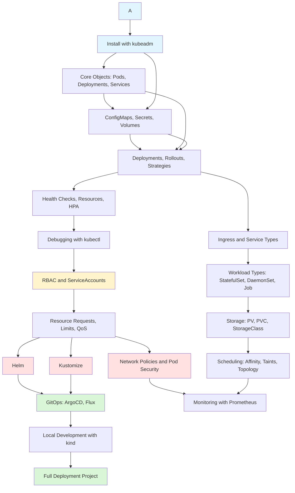

# Kubernetes (K8s)

> [!summary] Scope
> Container orchestration with Kubernetes: cluster installation and architecture, core objects, workload types, networking, storage, configuration, RBAC, security, Helm, Kustomize, scheduling, GitOps, monitoring, and debugging.

## Learning Path

## Topic Map

### Foundations (4 files)

#### [[CICD/Kubernetes/01_Foundations/01_Core_Objects_Pods_Deployments_Services]]
- Pod lifecycle (Pending → Running → CrashLoopBackOff → Succeeded/Failed)
- Deployment → ReplicaSet → Pod relationship with YAML manifests
- Service types: ClusterIP, NodePort, LoadBalancer — comparison table
- Minimal `kubectl` commands reference (get, describe, logs, exec, apply, delete)

#### [[CICD/Kubernetes/01_Foundations/02_Labels_Selectors_and_Namespaces]]
- `matchLabels` vs `matchExpressions` with operators (In, NotIn, Exists, DoesNotExist)
- Label convention strategy (`app`, `version`, `environment`, `tier`)
- Namespace isolation, ResourceQuota, LimitRange with YAML examples
- Namespace-scoped vs cluster-scoped resources

#### [[CICD/Kubernetes/01_Foundations/03_ConfigMaps_Secrets_and_Volumes]]
- ConfigMap creation from literals, files, `.env` files
- Secret types (Opaque, TLS, dockerconfigjson), encryption at rest
- Volume types: emptyDir, hostPath, configMap, secret, PVC, projected
- Injection patterns: `envFrom`, `valueFrom`, volume mounts, projected volumes

#### [[CICD/Kubernetes/01_Foundations/04_Cluster_Architecture_and_Components]]
- Control plane: API server, etcd, scheduler, controller manager — roles and interactions
- Worker node: kubelet, kube-proxy, container runtime (containerd, CRI-O, Docker)
- API request flow (sequence diagram): `kubectl apply` → auth → admission → etcd → scheduler → kubelet
- etcd backup/restore, OCI runtime stack (dockerd → containerd → runc)

### Core (7 files)

#### [[CICD/Kubernetes/02_Core/01_Deployments_Rollouts_and_Strategies]]
- RollingUpdate with `maxSurge`/`maxUnavailable`, Recreate strategy
- Blue/green: two Deployments + Service selector switch
- Canary: stable + canary Deployments sharing a Service, gradual traffic increase
- Rollout commands (`set image`, `rollout status/history/undo/pause/resume`)

#### [[CICD/Kubernetes/02_Core/02_Ingress_and_Service_Types]]
- Service types deep dive: ClusterIP, NodePort, LoadBalancer with YAML
- Ingress: path-based (`Prefix`, `Exact`) and host-based routing
- Ingress controllers comparison (nginx-ingress, AWS ALB, Traefik, GKE, Contour, Istio)
- TLS with cert-manager: ClusterIssuer, Let's Encrypt, HTTP-01 challenge flow

#### [[CICD/Kubernetes/02_Core/03_HealthChecks_Resources_and_HPA]]
- Probe types: liveness (restart), readiness (traffic), startup (delay) — with all parameters
- Probe handlers: HTTP, TCP, exec — YAML examples for each
- Resource requests (scheduler guarantee) vs limits (cgroup hard cap)
- HPA with `scaleTargetRef`, metrics, `behavior` scaling policies, VPA

#### [[CICD/Kubernetes/02_Core/04_Debugging_with_kubectl]]
- Quick triage workflow: pod status → describe → logs → events
- Exit code reference: 1 (error), 137 (OOM), 139 (segfault), 143 (SIGTERM)
- Ephemeral debug containers (`kubectl debug`), port-forward, `kubectl auth can-i`
- Service connectivity debugging (endpoints, DNS, port-forward, netshoot)

#### [[CICD/Kubernetes/02_Core/05_Workload_Types_StatefulSet_DaemonSet_Job_CronJob]]
- StatefulSet: ordinal naming, stable DNS, volumeClaimTemplates, sequential creation
- DaemonSet: one pod per node, nodeSelector subset, use cases (logging, monitoring, networking)
- Job: `completions`, `parallelism`, `backoffLimit`, `activeDeadlineSeconds`
- CronJob: cron schedule, `concurrencyPolicy`, Jobs history limits
- Workload type comparison table (5 rows: Deployment vs StatefulSet vs DaemonSet vs Job)

#### [[CICD/Kubernetes/02_Core/06_RBAC_and_ServiceAccounts]]
- Role (namespace) vs ClusterRole (cluster) vs RoleBinding vs ClusterRoleBinding
- RBAC verbs: get, list, watch, create, update, patch, delete
- ServiceAccount: pod identity, `automountServiceAccountToken`, API access from pods
- `kubectl auth can-i` for permission checking

#### [[CICD/Kubernetes/02_Core/07_Storage_PV_PVC_StorageClass_StatefulSet_Integration]]
- PV/PVC/StorageClass concepts and lifecycle (provision → bind → use → reclaim)
- Access modes: RWO, ROX, RWX, RWOP — with use cases
- CSI drivers per cloud (EBS, EFS, GCE PD, Azure Disk, Azure File, NFS)
- StatefulSet with `volumeClaimTemplates` — automatic per-replica PVC

### Core (10 files)

#### [[CICD/Kubernetes/02_Core/08_PDB_ClusterAutoscaler_AdmissionControllers]]
- PDB: minAvailable, maxUnavailable, unhealthyPodEvictionPolicy, voluntary vs involuntary disruptions, node drain with PDB, PDB + HPA + CA deadlock patterns
- Cluster Autoscaler vs Karpenter: comparison, CA flags (expander, scale-down, max-nodes), Karpenter provisioner with consolidation, disruption
- Admission Controllers: built-in list (PodSecurity, LimitRanger, ResourceQuota, NamespaceLifecycle), MutatingWebhookConfiguration/ValidatingWebhookConfiguration, webhook failurePolicy (Fail/Ignore), cert management with cert-manager, matchConditions

#### [[CICD/Kubernetes/02_Core/09_VPA_PriorityClass_kubeconfig_Descheduler]]
- VPA: update modes (Auto/Recreate/Initial/Off), recommender (target/uncapped/lower/upper bounds), containerPolicies, VPA + HPA coexistence rules (cannot share CPU metric)
- PriorityClass: value range, globalDefault, preemption policy, system-critical classes
- kubeconfig: clusters/users/contexts, merge logic ($KUBECONFIG), exec-based auth (aws/gcloud/kubelogin), kubectx/kubens
- Descheduler: strategies (RemoveDuplicates, LowNodeUtilization, RemovePodsViolatingInterPodAntiAffinity, PodLifeTime)

### Advanced (8 files)

#### [[CICD/Kubernetes/03_Advanced/01_Resource_Requests_Limits_and_QoS_Deep_Dive]]
- CPU/memory units (m, core, Mi, Gi, M, G), Guaranteed vs Burstable vs BestEffort QoS
- ResourceQuota (namespace limits) and LimitRange (defaults per container)
- Pod eviction ordering under node pressure: BestEffort → Burstable → Guaranteed
- OOMKilled behavior, CPU throttling with limits

#### [[CICD/Kubernetes/03_Advanced/02_Helm_Package_Management]]
- Chart structure: `Chart.yaml`, `values.yaml`, `templates/`, `_helpers.tpl`, `NOTES.txt`
- Template functions: `{{ .Values.* }}`, `{{ toYaml }}`, `{{ include }}`, `{{ nindent }}`
- CLI: `install`, `upgrade --install`, `rollback`, `template`, `list`, `repo add`
- Release management (history, revisions), Helm repositories, Helm vs Kustomize comparison

#### [[CICD/Kubernetes/03_Advanced/03_Kustomize_Native_Configuration_Management]]
- Base + overlay directory structure, `kustomization.yaml` fields
- Patches: strategic merge vs JSON patch vs inline patches
- Transformations: `namePrefix`, `commonLabels`, `images`, `replicas`, `namespace`
- `kustomize build`, `kubectl apply -k`, Helm vs Kustomize comparison

#### [[CICD/Kubernetes/03_Advanced/04_NetworkPolicies_and_Pod_Security]]
- NetworkPolicy: `podSelector`, `policyTypes`, ingress/egress rules, `ipBlock`
- Default deny patterns (deny all ingress/egress, allow DNS exception)
- Pod Security Standards: Privileged, Baseline, Restricted — with enforcement via labels
- OPA Gatekeeper (Rego) vs Kyverno (YAML) for policy enforcement

#### [[CICD/Kubernetes/03_Advanced/05_Scheduling_Affinity_Taints_Tolerations]]
- `nodeSelector`, nodeAffinity (required vs preferred, operators), podAffinity/podAntiAffinity
- Taints: NoSchedule, PreferNoSchedule, NoExecute — with tolerations
- Topology Spread Constraints: `maxSkew`, `topologyKey`, `whenUnsatisfiable`
- Scheduling decision flow: filtering → scoring → binding
- PriorityClass (value, globalDefault, preemptionPolicy, PreemptLowerPriority vs Never)
- Descheduler strategies: RemoveDuplicates, LowNodeUtilization, RemovePodsViolatingInterPodAntiAffinity, PodLifeTime

#### [[CICD/Kubernetes/03_Advanced/06_CRDs_and_Operators]]
- CRD YAML structure (openAPIV3Schema, subresources, scale, additionalPrinterColumns)
- Operator pattern: reconciler loop, controller-runtime, leader election, finalizers
- Kubebuilder/Operator SDK scaffolding, Helm chart packaging
- Worked example: Backup operator (reconciler creates Job + PVC from CR spec)
- Well-known operators: prometheus-operator, cert-manager, Strimzi, Crossplane, Vault, Postgres Operator, ArgoCD, KubeDB, Spark Operator

#### [[CICD/Kubernetes/03_Advanced/07_Service_Mesh_and_Gateway_API]]
- Service mesh comparison: Istio (Envoy, VirtualService, DestinationRule, mTLS, canary, Kiali/Jaeger), Linkerd (zero-config mTLS, ServiceProfile), Cilium Service Mesh (eBPF, no sidecar, Hubble), Consul (intentions, admin partitions)
- Istio canary: weighted routing across subsets, gradual traffic shift
- Gateway API: GatewayClass/Gateway/HTTPRoute/TCPRoute/GRPCRoute, cross-namespace ReferenceGrant
- Gateway API vs Ingress vs Istio comparison table

#### [[CICD/Kubernetes/03_Advanced/08_Audit_Logging_and_Multi_Cluster]]
- Audit policy: stages (RequestReceived/ResponseStarted/ResponseComplete/Panic), levels (None/Metadata/Request/RequestResponse)
- Audit log collection (Fluent Bit, Vector, S3, Elastic, Loki, S3, CloudWatch, GuardDuty EKS Audit)
- Multi-Cluster with CAPI: Cluster, Machine, MachineDeployment, clusterctl, providers (AWS, GCP, Azure, vSphere, Docker)
- Multi-cluster workload distribution: ArgoCD ApplicationSet (cluster generator), Karmada (PropagationPolicy, OverridePolicy, scheduling), Fleet/ACM
- Cross-cluster service discovery and service mesh federation

### Playbooks (5 files)

#### [[CICD/Kubernetes/04_Playbooks/01_Troubleshoot_CrashLoopBackOff]]
- Systematic debugging checklist, pod not starting vs restarting vs serving
- Common exit codes, OOMKilled detection, probe tuning

#### [[CICD/Kubernetes/04_Playbooks/02_Local_Development_with_kind]]
- kind: cluster creation, config YAML, `kind load docker-image`, ingress setup
- k3d/k3s/minikube alternatives comparison
- Tilt for live development: Tiltfile, `docker_build`, `k8s_yaml`, `k8s_resource`

#### [[CICD/Kubernetes/04_Playbooks/03_GitOps_with_ArgoCD_and_Flux]]
- GitOps principles (declarative, versioned, pulled, reconciled)
- ArgoCD: install, Application (YAML), ApplicationSet (multi-cluster), sync policies
- Flux: bootstrap, GitRepository, Kustomization, HelmRelease CRDs
- ArgoCD vs Flux comparison table (11 rows)

#### [[CICD/Kubernetes/04_Playbooks/04_Monitoring_and_Observability_with_Prometheus]]
- Prometheus architecture: Service Discovery, ServiceMonitor, TSDB, AlertManager
- kube-prometheus-stack Helm chart installation
- Grafana dashboards, alerting rules (PrometheusRule), AlertManager receivers (Slack, PagerDuty)
- Loki + Promtail for log aggregation, LogQL queries

#### [[CICD/Kubernetes/04_Playbooks/05_Install_a_Kubernetes_Cluster_with_kubeadm]]
- Prerequisites: OS, swap off, kernel modules, ports, firewall
- containerd installation with systemd cgroup driver
- kubeadm/kubelet/kubectl installation and version hold
- `kubeadm init` for single and HA control plane (sequence diagram)
- Calico CNI installation, worker node join with `kubeadm join`
- HA control plane architecture (3 nodes + HAProxy load balancer)
- Production hardening checklist, etcd backup
- Installation troubleshooting table with 10 failure patterns

### Projects (1 file)

#### [[CICD/Kubernetes/05_Projects/01_Deploy_a_Service_With_HPA_and_Ingress]]
- Step-by-step: Namespace + ConfigMap → Deployment + probes + resources → Service → Ingress + cert-manager TLS → HPA → rollout → cleanup
- Complete YAML manifests for every step
- Architecture diagram (Internet → Ingress Controller → Ingress → Service → Pods)

---

## Recommended Paths

| Path | Files | Target |
|------|-------|--------|
| **Quick Start** | F01, F02, F03, C04 | Deploy first app in minutes |
| **Production Workloads** | F01-F04, C01-C05 | Full production-ready deployments |
| **Security** | C06, A01, A04, A05 | RBAC, NetworkPolicy, Pod Security, Scheduling |
| **GitOps** | C06, A02, A03, P03 | Helm + Kustomize + ArgoCD/Flux |
| **Operations** | A01, P02, P04, PR01 | Resource management, local dev, monitoring |

## Cross-Links

- [[CICD/Docker/00_MOC/00_Docker_MOC]] for container fundamentals
- [[CICD/GitHubActions/00_MOC/00_GitHubActions_MOC]] for CI/CD that deploys to K8s
- [[CICD/Terraform/00_MOC/00_Terraform_MOC]] for cluster provisioning

---

## References

- [Kubernetes Documentation](https://kubernetes.io/docs/)
- [kubectl Cheat Sheet](https://kubernetes.io/docs/reference/kubectl/cheatsheet/)
- [Helm Docs](https://helm.sh/docs/)
- [Kustomize](https://kustomize.io/)
- [Prometheus Operator](https://prometheus-operator.dev/)
- [ArgoCD](https://argo-cd.readthedocs.io/)
- [Flux](https://fluxcd.io/)
