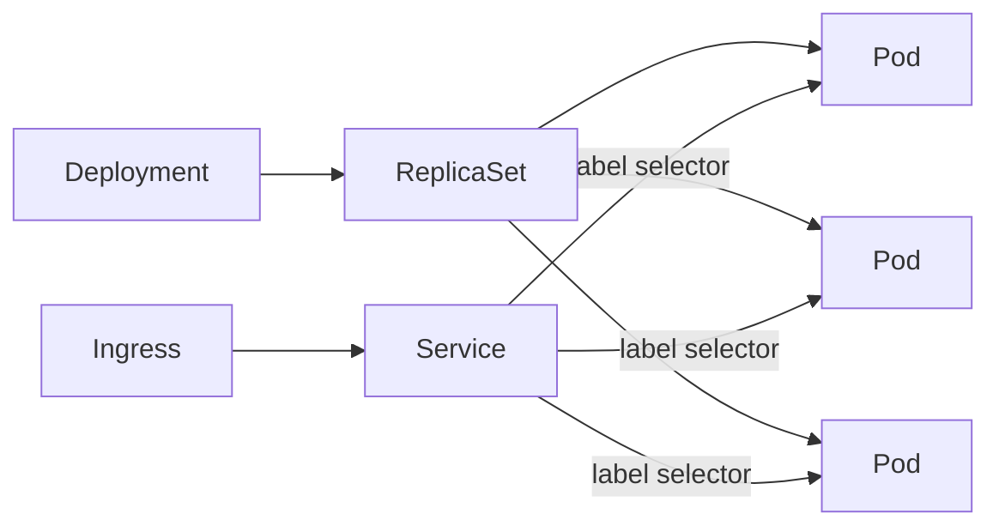
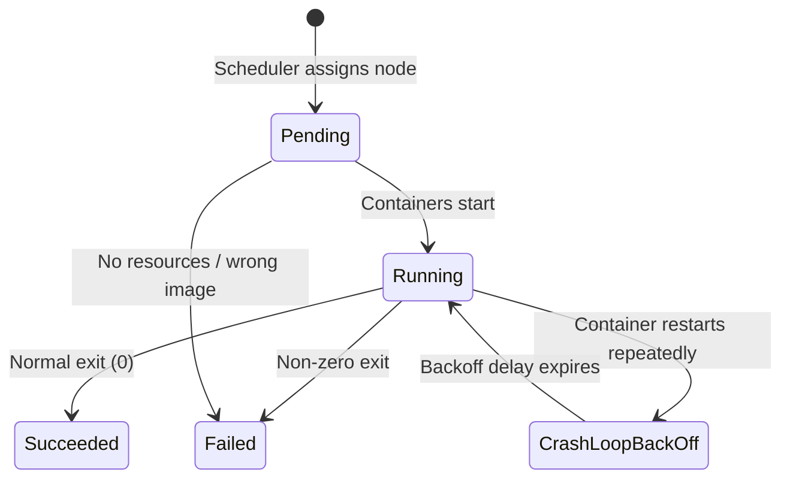
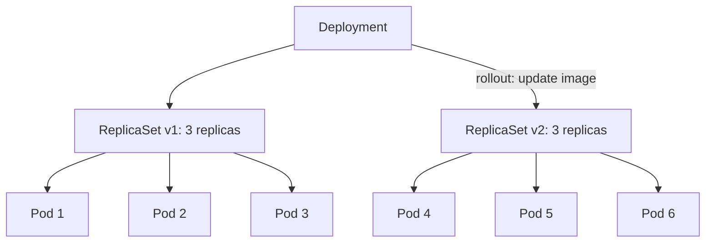
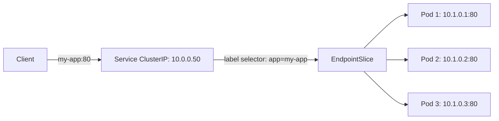

# Core Objects: Pods, Deployments, and Services

> [!summary] Goal
> Deploy, expose, and manage stateless applications in Kubernetes using the three essential resources: Pods, Deployments, and Services.

## Table of Contents

1. [Why Core Objects Matter](#why-core-objects-matter)
2. [Pod — The Smallest Unit](#pod-the-smallest-unit)
3. [Deployment — Stateless Workloads](#deployment-stateless-workloads)
4. [Service — Stable Networking](#service-stable-networking)
5. [Service Types Comparison](#service-types-comparison)
6. [Minimal kubectl Commands](#minimal-kubectl-commands)
7. [Pitfalls](#pitfalls)

---

## Why Core Objects Matter

These three resources are the foundation of every Kubernetes application.



---

## Pod — The Smallest Unit

A pod is the smallest schedulable unit in Kubernetes. It runs one or more containers that share network, storage, and lifecycle.

```yaml
apiVersion: v1
kind: Pod
metadata:
  name: my-app
  labels:
    app: my-app
    version: v1
spec:
  containers:
    - name: app
      image: nginx:1.25-alpine
      ports:
        - containerPort: 80
      resources:
        requests:
          cpu: 100m
          memory: 128Mi
        limits:
          memory: 256Mi
```

```bash
# Create and interact with a pod
kubectl apply -f pod.yaml
kubectl get pods
kubectl describe pod my-app
kubectl logs my-app
kubectl exec -it my-app -- sh
kubectl delete pod my-app
```



| Pod phase | Meaning |
|-----------|---------|
| `Pending` | Accepted but not running (image pull, scheduling, init containers) |
| `Running` | At least one container is running |
| `Succeeded` | All containers exited with code 0 (Jobs) |
| `Failed` | At least one container exited with non-zero |
| `CrashLoopBackOff` | Container keeps crashing — restarting with backoff |
| `Unknown` | Node lost contact with API server |

---

## Deployment — Stateless Workloads

A Deployment manages a ReplicaSet, which ensures the desired number of pod replicas are running at all times. Supports rolling updates and rollbacks.

```yaml
apiVersion: apps/v1
kind: Deployment
metadata:
  name: my-app
  labels:
    app: my-app
spec:
  replicas: 3
  strategy:
    type: RollingUpdate
    rollingUpdate:
      maxSurge: 1        # can create 1 extra pod during rollout
      maxUnavailable: 1  # can take down 1 pod at a time
  selector:
    matchLabels:
      app: my-app
  template:
    metadata:
      labels:
        app: my-app
        version: v1
    spec:
      containers:
        - name: app
          image: nginx:1.25-alpine
          ports:
            - containerPort: 80
          resources:
            requests:
              cpu: 100m
              memory: 128Mi
---
# Resulting ReplicaSet (created automatically)
# kubectl get replicaset -l app=my-app
```



```bash
# Deployment commands
kubectl create deployment my-app --image=nginx:1.25-alpine --replicas=3
kubectl scale deployment my-app --replicas=5
kubectl rollout status deployment my-app
kubectl rollout history deployment my-app
kubectl set image deployment my-app app=nginx:1.26-alpine
kubectl rollout undo deployment my-app
kubectl rollout undo deployment my-app --to-revision=2
kubectl rollout pause deployment my-app
kubectl rollout resume deployment my-app
```

---

## Service — Stable Networking

A Service provides a stable IP and DNS name to access a set of pods, abstracting away pod IP changes.

```yaml
apiVersion: v1
kind: Service
metadata:
  name: my-app
spec:
  selector:
    app: my-app
  ports:
    - port: 80
      targetPort: 80
      protocol: TCP
  type: ClusterIP
```

```bash
# Service commands
kubectl expose deployment my-app --port=80 --target-port=80 --type=ClusterIP
kubectl get services
kubectl describe service my-app
kubectl get endpoints my-app   # Shows pod IPs behind the service
```

### How Service → Pod routing works



---

## Service Types Comparison

| Type | Accessible from | Use case | Example |
|------|----------------|----------|---------|
| **ClusterIP** (default) | Inside cluster only | Internal API, database | `my-app:80` resolved by CoreDNS |
| **NodePort** | External via node IP:port | Dev/test, direct access | `http://node-ip:30080` |
| **LoadBalancer** | External via cloud LB | Production HTTP services | Cloud LB → NodePort → ClusterIP → Pods |
| **ExternalName** | Via CNAME alias | External service wrapper | `my-db.svc → my-db.example.com` |

```yaml
# NodePort — exposes on each node's IP at a static port (30000-32767)
apiVersion: v1
kind: Service
metadata:
  name: my-app-nodeport
spec:
  type: NodePort
  selector:
    app: my-app
  ports:
    - port: 80
      targetPort: 80
      nodePort: 30080
---
# LoadBalancer — creates cloud LB + NodePort + ClusterIP
apiVersion: v1
kind: Service
metadata:
  name: my-app-lb
spec:
  type: LoadBalancer
  selector:
    app: my-app
  ports:
    - port: 80
      targetPort: 80
```

---

## Minimal kubectl Commands

```bash
# View resources
kubectl get pods                     # Pods in current namespace
kubectl get pods -n kube-system      # Pods in another namespace
kubectl get pods -o wide             # Show pod IPs and nodes
kubectl get pods -l app=my-app       # Filter by label
kubectl get all                      # Common resources in namespace
kubectl get pods --watch             # Watch changes in real time
kubectl get deployments,services     # Multiple resource types

# Describe (detailed information)
kubectl describe pod my-app
kubectl describe node worker-1
kubectl describe svc my-app

# Debug
kubectl logs my-app                 # Container stdout
kubectl logs --previous my-app      # Previous crashed container's logs
kubectl exec -it my-app -- sh       # Shell inside container
kubectl port-forward svc/my-app 8080:80  # Local port to service
kubectl top pod                     # Resource usage

# Apply and delete
kubectl apply -f deployment.yaml    # Create/update from YAML
kubectl delete -f deployment.yaml   # Delete from YAML
kubectl delete pod my-app           # Delete by name
```

---

## kubeconfig and kubectl Context Management

> [!info] kubeconfig
> `~/.kube/config` stores cluster authentication and context information. It's a YAML file with three sections: `clusters` (API server URLs + CA), `users` (credentials — certs, tokens, exec-based auth), `contexts` (cluster + user + namespace pairs). `kubectl` uses the `current-context` field to determine which cluster/user to use.

```yaml
# Structure of ~/.kube/config:
apiVersion: v1
kind: Config
current-context: prod-eks
contexts:
  - context:
      cluster: prod-eks
      namespace: default
      user: prod-admin
    name: prod-eks
clusters:
  - cluster:
      certificate-authority: /etc/ssl/certs/ca.crt
      server: https://ABC.gr7.us-east-1.eks.amazonaws.com
    name: prod-eks
users:
  - name: prod-admin
    user:
      exec:
        apiVersion: client.authentication.k8s.io/v1beta1
        command: aws
        args: [eks, get-token, --cluster-name, prod]
```

### Merge logic

```bash
# Multiple kubeconfig files are merged in order:
export KUBECONFIG=~/.kube/config:/path/to/other/config

# Merge order:
# 1. First file in KUBECONFIG takes priority for duplicate cluster/user/context names.
# 2. current-context from first file wins.
# 3. kubectl config view --flatten merges all into one file.

# Common commands:
kubectl config get-contexts          # List all contexts
kubectl config use-context prod-eks  # Switch context
kubectl config set-context prod-eks --namespace=payment  # Set default namespace
kubectl config rename-context old-name new-name

# kubectx/kubens (install: kubectx on brew/apt):
kubectx                                # Interactive context switcher
kubectx prod-eks                       # Switch to prod-eks context
kubens payment                         # Switch to payment namespace within current context
```

### Authentication methods

```text
Method           kubeconfig entry               Provider
─────────────────────────────────────────────────────────
Bearer token     user.token                     Static PAT, service account
Client cert      user.client-certificate +      mTLS
                 user.client-key
Exec (AWS)       user.exec.command=aws          EKS
Exec (gcloud)    user.exec.command=gcloud       GKE
Exec (kubelogin) user.exec.command=kubelogin    OIDC
Exec (vault)     user.exec.command=vault        Vault token

Benefits of exec-based auth:
  - No long-lived credentials stored in kubeconfig.
  - Credentials are refreshed automatically (token expiry handled by CLI).
  - Cloud-specific auth (AWS IAM, GCP IAM) integrated.
```

---

## Pitfalls

### Pods not becoming Ready

A pod may be `Running` but not `Ready` — the readiness probe is failing.

**Fix**: `kubectl describe pod my-app` to check probe results. Ensure the app responds on the probe endpoint.

### Pods stuck in Pending

Usually due to insufficient resources, node selector mismatch, or taints.

**Fix**: `kubectl describe pod my-app` shows events. Check node resources, nodeSelector, taints/tolerations.

### Using `kubectl run` in production

```bash
kubectl run my-app --image=nginx  # Creates a bare Pod, not a Deployment
```

The pod won't restart if the node fails. No rollout, no scaling.

**Fix**: Use `kubectl create deployment my-app --image=nginx` which creates a Deployment with a ReplicaSet.

---

> [!question]- Interview Questions
>
> **Q: What is a Pod?**
> A: The smallest schedulable unit in Kubernetes. It runs one or more containers that share the same network namespace (IP, port space) and storage volumes.
>
> **Q: How does a Service route traffic to Pods?**
> A: The Service uses a label selector to find matching pods. kube-proxy on each node creates iptables/IPVS rules that forward traffic from the Service ClusterIP to the pod IPs.
>
> **Q: What are the four Service types and when would you use each?**
> A: ClusterIP (internal only), NodePort (external dev access), LoadBalancer (production HTTP), ExternalName (aliasing external services).

---

## Cross-Links

- [[CICD/Kubernetes/02_Core/01_Deployments_Rollouts_and_Strategies]] for deployment strategies
- [[CICD/Kubernetes/02_Core/02_Ingress_and_Service_Types]] for Ingress and advanced networking
- [[CICD/Kubernetes/02_Core/03_HealthChecks_Resources_and_HPA]] for probes and autoscaling
- [[CICD/Kubernetes/04_Playbooks/02_Local_Development_with_kind]] for local cluster setup

---

## References

- [Kubernetes Pods](https://kubernetes.io/docs/concepts/workloads/pods/)
- [Kubernetes Deployments](https://kubernetes.io/docs/concepts/workloads/controllers/deployment/)
- [Kubernetes Services](https://kubernetes.io/docs/concepts/services-networking/service/)
- [kubectl Cheat Sheet](https://kubernetes.io/docs/reference/kubectl/cheatsheet/)
