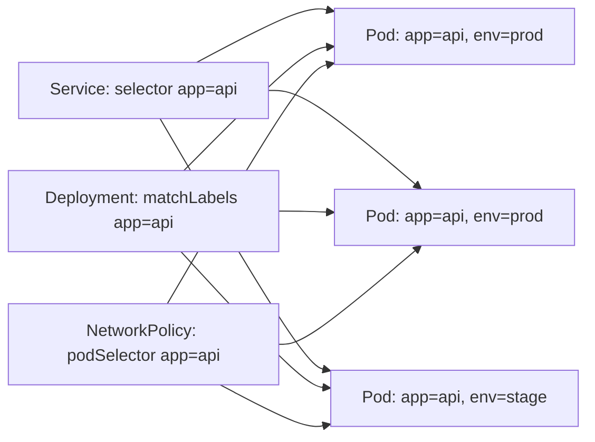
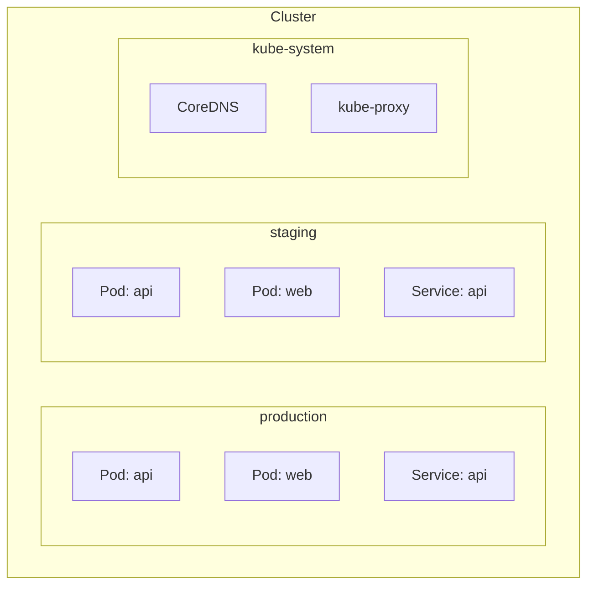

# Labels, Selectors, and Namespaces

> [!summary] Goal
> Organize Kubernetes resources with labels and selectors for flexible routing and management, and use namespaces to isolate teams and workloads.

## Table of Contents

1. [Why Labels Matter](#why-labels-matter)
2. [Label Conventions](#label-conventions)
3. [`matchLabels` vs `matchExpressions`](#matchlabels-vs-matchexpressions)
4. [Namespaces — Logical Isolation](#namespaces-logical-isolation)
5. [Resource Quotas and Limits](#resource-quotas-and-limits)
6. [Pitfalls](#pitfalls)

---

## Why Labels Matter

Labels are key-value pairs attached to any Kubernetes object. Services, Deployments, NetworkPolicies, and other resources use label selectors to find the right pods.



> [!tip] Definition
> **Label**: a key-value pair attached to a resource (`app=api`, `env=prod`, `tier=frontend`). Used for organization, selection, and grouping.
> **Selector**: a query that finds resources by their labels. Resources that match the selector's label query are selected.

---

## Label Conventions

Use consistent label keys to make selectors predictable:

```yaml
app: api                # Application name
version: v1.2.3         # Application version (for blue/green canary)
tier: frontend          # Tier: frontend, backend, data
environment: production # Deployment environment
release: stable         # Release track: stable, canary, beta
team: payments          # Responsible team
```

```yaml
# Pod with standard labels
apiVersion: v1
kind: Pod
metadata:
  name: api-v1
  labels:
    app: api
    version: v1.2.3
    environment: production
    tier: backend
spec:
  containers:
    - name: api
      image: my-api:1.2.3
```

---

## `matchLabels` vs `matchExpressions`

### `matchLabels` — exact equality (AND)

```yaml
selector:
  matchLabels:
    app: api
    environment: production
# Matches pods that have BOTH app=api AND environment=production
```

### `matchExpressions` — richer operators (AND + OR)

```yaml
selector:
  matchExpressions:
    - key: environment
      operator: In
      values: [production, staging]
    - key: tier
      operator: NotIn
      values: [data]
# Matches pods where environment IS production OR staging AND tier IS NOT data
```

| Operator | Behavior |
|----------|----------|
| `In` | Value must be in the set |
| `NotIn` | Value must not be in the set |
| `Exists` | Key must exist (any value) |
| `DoesNotExist` | Key must not exist |

### Combined

```yaml
selector:
  matchLabels:
    app: api
  matchExpressions:
    - key: environment
      operator: In
      values: [production, staging]
# Both conditions must match
```

---

## Namespaces — Logical Isolation

Namespaces partition a cluster for multi-team or multi-environment workloads.

```bash
# View namespaces
kubectl get namespaces
kubectl get all -n team-a
kubectl get all -n team-b

# Namespace-scoped resources
kubectl -n production get pods
kubectl -n staging get deployments

# Switch namespace (install kubens or use --namespace)
kubectl config set-context --current --namespace=production
```

### Typical namespace structure

```yaml
apiVersion: v1
kind: Namespace
metadata:
  name: production
  labels:
    environment: production
    team: platform
---
apiVersion: v1
kind: Namespace
metadata:
  name: staging
---
apiVersion: v1
kind: Namespace
metadata:
  name: development
```



### Namespace vs cluster-scoped resources

| Resource type | Scope | Examples |
|--------------|-------|----------|
| Namespaced | Isolated per namespace | Pod, Service, Deployment, ConfigMap, Secret |
| Cluster-scoped | Global across cluster | Node, Namespace, PersistentVolume, ClusterRole |

---

## Resource Quotas and Limits

Prevent teams from consuming too many cluster resources:

```yaml
apiVersion: v1
kind: ResourceQuota
metadata:
  name: team-a-quota
  namespace: team-a
spec:
  hard:
    requests.cpu: 4
    requests.memory: 8Gi
    limits.cpu: 8
    limits.memory: 16Gi
    persistentvolumeclaims: 5
    pods: 20
```

```yaml
apiVersion: v1
kind: LimitRange
metadata:
  name: team-a-limits
  namespace: team-a
spec:
  limits:
    - default:
        cpu: 500m
        memory: 512Mi
      defaultRequest:
        cpu: 100m
        memory: 128Mi
      type: Container
```

### Resource quota commands

```bash
kubectl get resourcequota -n team-a
kubectl describe quota team-a-quota -n team-a
kubectl create quota my-quota --hard=pods=10 -n team-a
```

---

## Pitfalls

### Service selector doesn't match pod labels

A Service with `selector: app: api` won't route to pods labeled `application: api` (different key) or `app: api-v2` (wrong value).

**Fix**: Ensure pod label keys and values exactly match the service selector.

### Changing labels on a running Deployment's selector

The `spec.selector.matchLabels` on a Deployment is immutable after creation. You can't change it.

**Fix**: Delete the Deployment (pods are recreated by ReplicaSet) or create a new one.

### Namespace deletion cascading

Deleting a namespace deletes ALL resources inside it, including PVCs with data.

**Fix**: Never delete a production namespace. Use `kubectl delete ns <name>` only after verifying nothing important is inside.

### No quota on resource-heavy teams

Without ResourceQuota, one team can consume all cluster resources and starve others.

**Fix**: Create ResourceQuota and LimitRange per namespace.

---

> [!question]- Interview Questions
>
> **Q: What is the difference between `matchLabels` and `matchExpressions`?**
> A: `matchLabels` requires exact equality on all specified labels (AND). `matchExpressions` supports operators like In, NotIn, Exists for more flexible matching.
>
> **Q: When would you use namespaces?**
> A: To isolate environments (prod/staging/dev) or teams within a single cluster. Each namespace has its own resource quotas, RBAC, and network policies.
>
> **Q: What happens when you delete a namespace?**
> A: All resources in that namespace are deleted: pods, services, deployments, configmaps, secrets, PVCs (including data). It's a nuclear option.

---

## Cross-Links

- [[CICD/Kubernetes/02_Core/06_RBAC_and_ServiceAccounts]] for namespace-scoped RBAC
- [[CICD/Kubernetes/03_Advanced/04_NetworkPolicies_and_Pod_Security]] for namespace-level network policies
- [[CICD/Kubernetes/03_Advanced/05_Scheduling_Affinity_Taints_Tolerations]] for label-based scheduling

---

## References

- [Labels and Selectors](https://kubernetes.io/docs/concepts/overview/working-with-objects/labels/)
- [Namespaces](https://kubernetes.io/docs/concepts/overview/working-with-objects/namespaces/)
- [Resource Quotas](https://kubernetes.io/docs/concepts/policy/resource-quotas/)
- [Limit Ranges](https://kubernetes.io/docs/concepts/policy/limit-range/)
