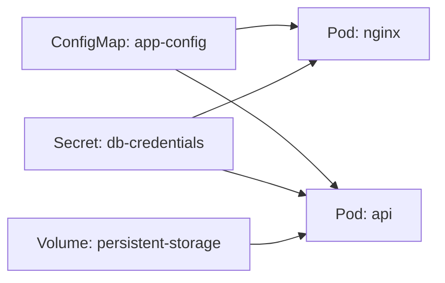

# ConfigMaps, Secrets, and Volumes

> [!summary] Goal
> Separate configuration from container images by injecting config and secrets via ConfigMaps, Secrets, and Volumes.

## Table of Contents

1. [Why Configuration Management Matters](#why-configuration-management-matters)
2. [ConfigMap — Non-Sensitive Configuration](#configmap-non-sensitive-configuration)
3. [Secret — Sensitive Data](#secret-sensitive-data)
4. [Volume Types](#volume-types)
5. [Injection Patterns](#injection-patterns)
6. [Projected Volumes](#projected-volumes)
7. [Pitfalls](#pitfalls)

---

## Why Configuration Management Matters

Hardcoding config in container images means rebuilding for every environment. ConfigMaps and Secrets decouple configuration from the image.



> [!tip] Definition
> **ConfigMap**: non-sensitive configuration data (env vars, config files) injected into pods.
> **Secret**: sensitive data (passwords, API keys, certificates) stored base64-encoded and encrypted at rest.
> **Volume**: a directory accessible to containers in a pod, backed by various storage types.

---

## ConfigMap — Non-Sensitive Configuration

### Creating ConfigMaps

```bash
# From literal values
kubectl create configmap app-config --from-literal=APP_ENV=production --from-literal=LOG_LEVEL=info

# From a file (creates key = filename)
kubectl create configmap nginx-config --from-file=nginx.conf

# From a .env file (key=value per line)
kubectl create configmap env-config --from-env-file=.env.prod

# From YAML
kubectl apply -f configmap.yaml
```

```yaml
apiVersion: v1
kind: ConfigMap
metadata:
  name: app-config
data:
  APP_ENV: production
  LOG_LEVEL: info
  nginx.conf: |
    server {
      listen 80;
      server_name _;
    }
```

---

## Secret — Sensitive Data

Secrets are stored base64-encoded (not encrypted — enable encryption at rest).

```bash
# Create from literal
kubectl create secret generic db-credentials \
  --from-literal=username=admin \
  --from-literal=password=s3cret!

# Create from file
kubectl create secret generic tls-cert \
  --from-file=tls.crt=server.crt \
  --from-file=tls.key=server.key

# View (base64-decoded)
kubectl get secret db-credentials -o jsonpath='{.data.password}' | base64 -d
```

```yaml
apiVersion: v1
kind: Secret
metadata:
  name: db-credentials
type: Opaque
data:
  username: YWRtaW4=          # echo -n 'admin' | base64
  password: czNjcjM0dCE=       # echo -n 's3cret!' | base64
```

### Secret types

| Type | Use case |
|------|----------|
| `Opaque` | Arbitrary key-value pairs (passwords, API keys) |
| `kubernetes.io/tls` | TLS certificates (`tls.crt`, `tls.key`) |
| `kubernetes.io/dockerconfigjson` | Docker registry credentials |
| `kubernetes.io/basic-auth` | Basic auth credentials |
| `kubernetes.io/ssh-auth` | SSH credentials |

### Encryption at rest

```yaml
# Enable encryption at rest — otherwise base64 is NOT encrypted
apiVersion: apiserver.config.k8s.io/v1
kind: EncryptionConfiguration
resources:
  - resources:
      - secrets
    providers:
      - aescbc:
          keys:
            - name: key1
              secret: <base64-encoded-32-byte-key>
```

---

## Volume Types

```yaml
apiVersion: v1
kind: Pod
metadata:
  name: volume-example
spec:
  containers:
    - name: app
      image: nginx
      volumeMounts:
        - name: shared-logs
          mountPath: /var/log/app
        - name: config
          mountPath: /etc/config
          readOnly: true
        - name: temp
          mountPath: /tmp/cache
  volumes:
    - name: shared-logs
      emptyDir: {}
    - name: config
      configMap:
        name: app-config
    - name: temp
      emptyDir:
        medium: Memory
```

| Volume type | Lifetime | Use case |
|-------------|----------|----------|
| `emptyDir` | Pod lifetime | Scratch space, cache, shared between containers in a pod |
| `emptyDir` (Memory) | Pod lifetime | In-memory cache (tmpfs, no disk I/O) |
| `configMap` | Pod lifetime | Config file injection |
| `secret` | Pod lifetime | Secret file injection (auto-mounted in tmpfs) |
| `hostPath` | Node lifetime | Node-level access (logs, Docker socket — avoid) |
| `persistentVolumeClaim` | Beyond pod | Databases, persistent state (StatefulSet) |
| `projected` | Pod lifetime | Combine multiple sources into one directory |

---

## Injection Patterns

### 1. Environment variables from ConfigMap

```yaml
containers:
  - name: app
    env:
      - name: DATABASE_URL
        value: postgres://localhost:5432/mydb  # Hardcoded (avoid)
      - name: APP_ENV
        valueFrom:
          configMapKeyRef:
            name: app-config
            key: APP_ENV
      - name: DB_PASSWORD
        valueFrom:
          secretKeyRef:
            name: db-credentials
            key: password
```

### 2. All env vars from ConfigMap

```yaml
containers:
  - name: app
    envFrom:
      - configMapRef:
          name: app-config
      - secretRef:
          name: db-credentials
```

### 3. Config file mounted as volume

```yaml
volumes:
  - name: config
    configMap:
      name: nginx-config
      items:
        - key: nginx.conf
          path: nginx.conf
          mode: 0644
```

### 4. Secret as volume (files auto-mounted in tmpfs)

```yaml
volumes:
  - name: certs
    secret:
      secretName: tls-cert
      defaultMode: 0600
```

---

## Projected Volumes

Combine multiple ConfigMaps, Secrets, and service account tokens into a single directory:

```yaml
volumes:
  - name: all-in-one
    projected:
      sources:
        - configMap:
            name: app-config
            items:
              - key: config.yaml
                path: app-config.yaml
        - secret:
            name: db-credentials
            items:
              - key: password
                path: db/password
        - serviceAccountToken:
            path: token
            expirationSeconds: 3600
```

---

## Downward API — Inject Pod Metadata

> [!info] Downward API
> The Downward API injects pod metadata (name, namespace, labels, annotations, node name, service account, resource requests/limits) into containers via environment variables or volume mounts. Use cases: expose pod identity to the app, pass resource limits for auto-scaling configuration.

### Environment variables (fieldRef)

```yaml
apiVersion: v1
kind: Pod
spec:
  containers:
    - name: app
      env:
        - name: POD_NAME
          valueFrom:
            fieldRef:
              fieldPath: metadata.name
        - name: POD_NAMESPACE
          valueFrom:
            fieldRef:
              fieldPath: metadata.namespace
        - name: NODE_NAME
          valueFrom:
            fieldRef:
              fieldPath: spec.nodeName
        - name: SERVICE_ACCOUNT
          valueFrom:
            fieldRef:
              fieldPath: spec.serviceAccountName
```

### Resource fields (resourceFieldRef)

```yaml
spec:
  containers:
    - name: app
      resources:
        requests:
          memory: "512Mi"
          cpu: "250m"
        limits:
          memory: "1Gi"
          cpu: "500m"
      env:
        - name: MEMORY_REQUEST
          valueFrom:
            resourceFieldRef:
              containerName: app
              resource: requests.memory
        - name: CPU_LIMIT
          valueFrom:
            resourceFieldRef:
              containerName: app
              resource: limits.cpu
        - name: EPHEMERAL_STORAGE_REQUEST
          valueFrom:
            resourceFieldRef:
              containerName: app
              resource: requests.ephemeral-storage
```

### Volume mount (fieldRef + resourceFieldRef)

```yaml
spec:
  containers:
    - name: app
      volumeMounts:
        - name: podinfo
          mountPath: /etc/podinfo
  volumes:
    - name: podinfo
      projected:
        sources:
          - downwardAPI:
              items:
                - path: "name"
                  fieldRef:
                    fieldPath: metadata.name
                - path: "namespace"
                  fieldRef:
                    fieldPath: metadata.namespace
                - path: "labels"
                  fieldRef:
                    fieldPath: metadata.labels
                - path: "annotations"
                  fieldRef:
                    fieldPath: metadata.annotations
                - path: "cpu-limit"
                  resourceFieldRef:
                    containerName: app
                    resource: limits.cpu

# Pod reads /etc/podinfo/name → "payment-api-7d5f9c6b9f-abcde"
```

## Init Containers — Setup Before Main Containers

> [!info] Init containers
> Init containers run sequentially BEFORE the main application containers start. They must complete successfully before the main containers are launched. Use cases: database schema migrations, config file generation, wait-for-dependency, file permission fixups.

```yaml
apiVersion: v1
kind: Pod
spec:
  initContainers:
    - name: wait-for-db
      image: busybox:1.36
      command:
        - sh
        - -c
        - |
          until nc -z -w 5 postgres-service 5432; do
            echo "Waiting for postgres..."
            sleep 2
          done
          echo "Postgres is ready!"
    - name: migrate-db
      image: my-app-migrations:latest
      env:
        - name: DB_URL
          value: postgres://postgres-service:5432/myapp
      volumeMounts:
        - name: config
          mountPath: /etc/config
  containers:
    - name: app
      image: my-app:latest
      volumeMounts:
        - name: config
          mountPath: /etc/config
  volumes:
    - name: config
      configMap:
        name: app-config
      # init containers and main container share volumes
```

### Init container patterns

```text
Pattern                    Init container command          Use case
──────────────────────────────────────────────────────────────────────
Wait for dependency        nc -z -w 5 service 5432         DB/cache readiness
DB migration              ./migrate up                    Schema migrations
Generate config           echo "${ENV}" > config.yaml     Dynamic config
Setup permissions         chown 1000:1000 /data           File ownership fix
Check secrets             if [ ! -f /secret/file ]...     Ensure secrets exist

Init container resource behavior:
  - The HIGHEST resource requests/limits across ALL init containers is used for scheduling.
  - Init containers share the pod's resource pool with the main containers.
  - If an init container fails with exit code ≠ 0, the pod restarts -> repeated initialize.
```

---

## Pitfalls

### Secrets are not encrypted by default

Secret data is only base64-encoded — anyone with `get` access to secrets can decode them immediately.

**Fix**: Enable encryption at rest. Use RBAC to restrict secret access. Use External Secrets Operator or SealedSecrets for GitOps.

### ConfigMap/Secret updates don't auto-restart pods

Updating a ConfigMap changes mounted files, but the process inside the container won't restart.

**Fix**: Use tools like Reloader, or restart the Deployment manually: `kubectl rollout restart deployment my-app`.

### Using `subPath` breaks ConfigMap updates

When a volume mount uses `subPath`, file updates from ConfigMap changes are NOT propagated to the pod.

**Fix**: Don't use `subPath` for config file mounts. Mount the whole volume instead.

### `emptyDir` data loss

When a pod is deleted, all `emptyDir` data is lost.

**Fix**: Use PVC-backed volumes for data that must persist beyond pod lifetime.

---

> [!question]- Interview Questions
>
> **Q: What is the difference between a ConfigMap and a Secret?**
> A: ConfigMaps store non-sensitive configuration (env vars, config files). Secrets store sensitive data (passwords, keys) with base64 encoding and optional encryption at rest.
>
> **Q: How do you inject a ConfigMap as environment variables?**
> A: Use `envFrom` with `configMapRef` in the container spec. All keys become environment variables.
>
> **Q: What happens to a mounted ConfigMap when it's updated?**
> A: Files in mounted volumes are updated (eventually consistent), but environment variables are NOT updated — the pod must be restarted.
>
> **Q: What are the security considerations for Secrets?**
> A: They're only base64-encoded by default. Enable encryption at rest, restrict RBAC, use External Secrets Operator or Vault for production.

---

## Cross-Links

- [[CICD/Kubernetes/02_Core/06_RBAC_and_ServiceAccounts]] for restricting Secret access
- [[CICD/Kubernetes/02_Core/07_Storage_PV_PVC_StorageClass_StatefulSet_Integration]] for PVC volumes
- [[CICD/Kubernetes/05_Projects/01_Deploy_a_Service_With_HPA_and_Ingress]] for practical ConfigMap usage

---

## References

- [ConfigMaps](https://kubernetes.io/docs/concepts/configuration/configmap/)
- [Secrets](https://kubernetes.io/docs/concepts/configuration/secret/)
- [Volumes](https://kubernetes.io/docs/concepts/storage/volumes/)
- [Projected Volumes](https://kubernetes.io/docs/concepts/storage/projected-volumes/)
- [Encrypting Secrets at Rest](https://kubernetes.io/docs/tasks/administer-cluster/encrypt-data/)
