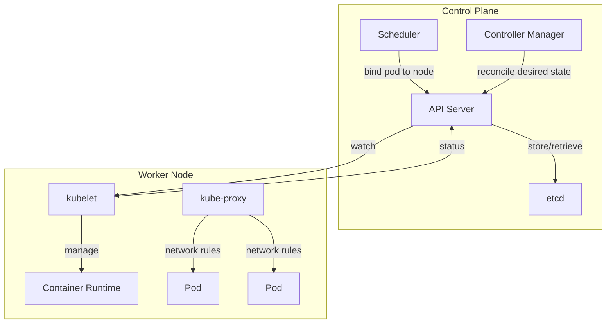
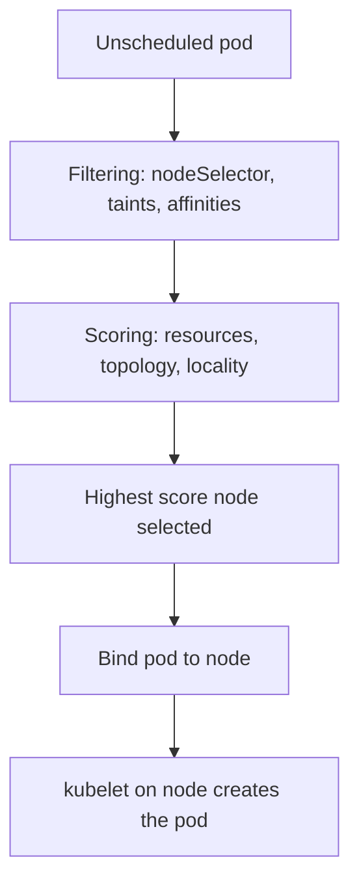
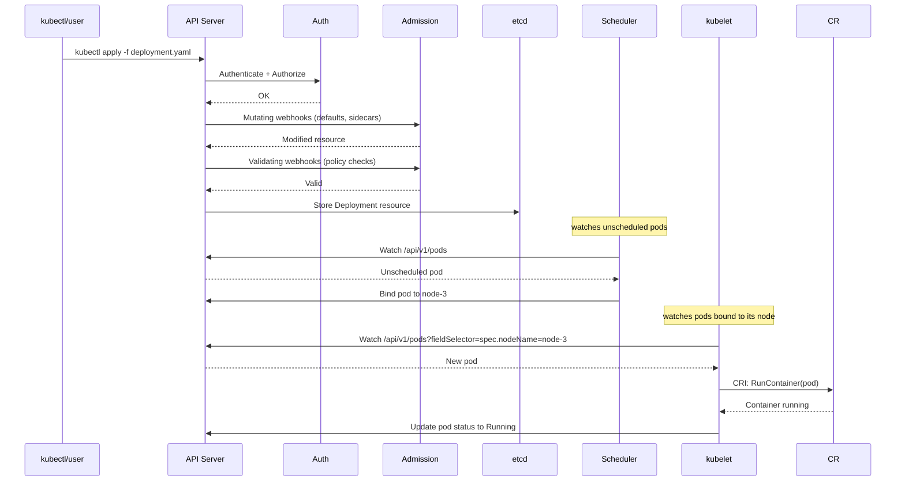
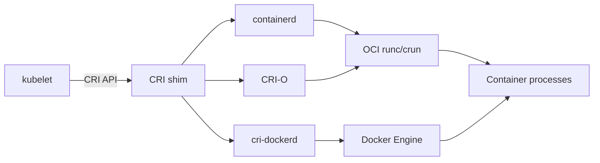

# Cluster Architecture and Components

> [!summary] Goal
> Understand every component of a Kubernetes cluster — from the API server through etcd, the scheduler, kubelet, container runtime — and how they work together to run your containers.

## Table of Contents

1. [Why Cluster Architecture Matters](#why-cluster-architecture-matters)
2. [Control Plane Components](#control-plane-components)
3. [Worker Node Components](#worker-node-components)
4. [API Request Flow](#api-request-flow)
5. [etcd — The Source of Truth](#etcd-the-source-of-truth)
6. [Container Runtime Interface](#container-runtime-interface)
7. [Add-ons](#add-ons)
8. [Pitfalls](#pitfalls)

---

## Why Cluster Architecture Matters

When a pod crashes, a node goes down, or a deployment stalls, understanding which component is responsible helps you fix it faster.



---

## Control Plane Components

### API Server (`kube-apiserver`)

The front-end of the cluster. All communication goes through the API server.

```bash
# Available as a pod in kube-system (if self-hosted)
kubectl get pods -n kube-system | grep api-server

# API server endpoints
kubectl get --raw /api/v1/namespaces/default/pods
kubectl get --raw /healthz?verbose
```

| Function | Description |
|----------|-------------|
| Authentication | Verifies identity (certs, tokens, OIDC) |
| Authorization | Checks RBAC/ABAC permissions |
| Admission | Mutating/validating webhooks modify/validate requests |
| Validation | Validates resource schemas against OpenAPI spec |
| Persistence | Stores cluster state in etcd |

### Scheduler (`kube-scheduler`)

Assigns pods to nodes based on resource requirements, constraints, policies.

```bash
kubectl get events --field-selector reason=FailedScheduling
```



| Step | What it checks |
|------|---------------|
| Filtering | Node has enough CPU/memory? Node taints tolerated? nodeSelector matched? |
| Scoring | How much would be left after scheduling? Pod affinity satisfied? Topology spread balanced? |

### Controller Manager (`kube-controller-manager`)

Runs controller loops that watch the desired state and reconcile the actual state:

| Controller | Watches | Reconciles |
|------------|---------|------------|
| Node Controller | Node health | Marks unreachable nodes, evicts pods |
| ReplicaSet Controller | ReplicaSet count | Creates/deletes pods to match desired replicas |
| Deployment Controller | Deployment | Creates/updates ReplicaSet for rollout |
| EndpointSlice Controller | Service + Pods | Updates EndpointSlices for service routing |
| Namespace Controller | Namespace deletion | Cleans up all resources in deleted namespace |
| ServiceAccount Controller | ServiceAccount | Creates default token in each namespace |

### etcd

Distributed key-value store — the cluster's source of truth.

```bash
# If managed (kubeadm), access etcd via:
kubectl exec -n kube-system etcd-master -- etcdctl get / --prefix --keys-only

# Backup etcd (critical!)
ETCDCTL_API=3 etcdctl snapshot save snapshot.db
```

| Aspect | Detail |
|--------|--------|
| Data stored | All cluster state: pods, secrets, configmaps, deployments |
| Consensus | Raft protocol — majority of nodes must agree |
| Backup | **Critical.** Without etcd backup, cluster state is unrecoverable |

---

## Worker Node Components

### kubelet

The primary node agent. Registers the node with the cluster, manages pods.

```bash
# Check kubelet status on a node
kubectl get nodes
kubectl describe node worker-1

# View kubelet logs (from the node itself, not via kubectl)
journalctl -u kubelet -f
```

| kubelet function | What it does |
|-----------------|-------------|
| Pod lifecycle | Creates, updates, and deletes containers |
| Health probes | Executes liveness, readiness, startup probes |
| Resource reporting | Reports node capacity, pod resource usage |
| Volume management | Mounts configmaps, secrets, PVCs |
| Image pulling | Pulls container images from registries |

### kube-proxy

Manages network rules on each node. Routes traffic to the correct pods.

```bash
# Check iptables (default mode) or IPVS rules created by kube-proxy
iptables-save | grep KUBE-
```

| Mode | Description |
|------|-------------|
| `iptables` | Default. Random selection, O(1) per service |
| `IPVS` | More features: weighted, least-connection. Requires `ipvsadm` |
| `userspace` | Legacy. Slow, rarely used |

### Container Runtime

The software that actually runs containers:

```bash
kubectl get nodes -o jsonpath='{.items[*].status.nodeInfo.containerRuntimeVersion}'
```

| Runtime | Description |
|---------|-------------|
| **containerd** | Default in Docker Desktop, k3s, most managed K8s. High performance, CNCF graduated |
| **CRI-O** | Lightweight, optimized for Kubernetes. Used by OpenShift |
| **Docker** | Legacy. Deprecated in K8s 1.24. Still works via dockershim → cri-dockerd |
| **CRI** | Container Runtime Interface — standard API for any runtime |

---

## API Request Flow



---

## etcd — The Source of Truth

### Data structure

```
/registry/pods/default/my-app-7d8f9c
/registry/deployments/default/my-app
/registry/services/specs/default/my-app
/registry/secrets/default/my-token
```

### Backup and restore

```bash
# Take snapshot (critical for DR)
ETCDCTL_API=3 etcdctl --endpoints=https://127.0.0.1:2379 \
  --cacert=/etc/kubernetes/pki/etcd/ca.crt \
  --cert=/etc/kubernetes/pki/etcd/server.crt \
  --key=/etc/kubernetes/pki/etcd/server.key \
  snapshot save /backup/etcd-snapshot.db

# Restore
ETCDCTL_API=3 etcdctl snapshot restore /backup/etcd-snapshot.db \
  --data-dir=/var/lib/etcd-restored
```

---

## Container Runtime Interface



| Runtime | CNCF? | Default in | Strengths |
|---------|-------|------------|-----------|
| containerd | Graduated | GKE, EKS, AKS, k3s | Mature, fast, widely adopted |
| CRI-O | Sandbox | OpenShift | Lightweight, K8s-native |
| Docker via cri-dockerd | — | Legacy clusters | Familiar tooling |

---

## Add-ons

| Add-on | Purpose |
|--------|---------|
| **CNI** (Calico, Cilium, Flannel) | Pod networking, NetworkPolicies |
| **CoreDNS** | Cluster DNS — service discovery |
| **Metrics Server** | Resource metrics for `kubectl top` and HPA |
| **Ingress Controller** | nginx-ingress, Traefik, AWS ALB |
| **CSI Drivers** | Storage integration (EBS, EFS, GCE PD) |

---

## RuntimeClass and Container Runtime Deep Dive

> [!info] RuntimeClass
> RuntimeClass enables selecting a different container runtime configuration per pod. The default runtime is `runc` (via containerd or CRI-O). Alternative runtimes: **gVisor** (`runsc`, sandboxed kernel), **Kata Containers** (VM per pod), **Firecracker** (microVM, used by AWS Lambda/Fargate). RuntimeClass selects based on `handler` name.

```yaml
apiVersion: node.k8s.io/v1
kind: RuntimeClass
metadata:
  name: gvisor
handler: runsc                          # Maps to containerd runsc plugin
overhead:
  podFixed:                             # Additional resource overhead for the runtime
    cpu: 250m
    memory: 128Mi
scheduling:
  nodeSelector:                         # Only run gVisor on nodes labeled for it
    runtime: gvisor
---
apiVersion: v1
kind: Pod
spec:
  runtimeClassName: gvisor              # Use gVisor sandbox
  containers:
    - name: untrusted-app
      image: untrusted:latest
```

### Container runtime comparison

| Runtime | Isolation | Performance | Security | Use case |
|:--------|:---------:|:-----------:|:--------:|----------|
| **runc** (containerd) | Kernel (namespaces + cgroups) | Native | Standard | Default, trusted workloads |
| **cri-o** | Kernel (same as runc) | Native | Standard | K8s-native (no Docker CLI), minimal footprint |
| **gVisor** (runsc) | Application kernel (strace-like) | Moderate | Strong | Untrusted code, multi-tenant |
| **Kata Containers** | VM per pod (QEMU + Firecracker) | Slower (VM boot) | Strongest | Highest isolation, multi-tenant |
| **Firecracker** | MicroVM | Fast VM boot, lower overhead | Strong | AWS Lambda/Fargate |

```text
containerd vs CRI-O:
  - containerd: graduated CNCF project, used by Docker Desktop, Amazon EKS, AKS, GKE.
  - CRI-O: built specifically for K8s (no Docker compatibility), lighter weight, used by OpenShift.
  - Both implement CRI (Container Runtime Interface) — K8s talks to them via gRPC.
  - Migration: most K8s distros moved from Docker → containerd (or CRI-O) in v1.24+.
```

---

## Pitfalls

### No etcd backup

This is the single biggest operational risk. If etcd is corrupted, the entire cluster is lost.

**Fix**: Automate etcd snapshots to S3/GCS. Test restore periodically.

### Scheduling without resource requests

Without `resources.requests`, the scheduler has no data to make placement decisions — pods get placed on overloaded nodes.

**Fix**: Always set `resources.requests.cpu` and `resources.requests.memory` on every container.

### Using Docker runtime assumptions

Kubernetes 1.24+ no longer supports Docker. Clusters use containerd or CRI-O.

**Fix**: Test CRI compatibility before upgrading. Use `crictl` instead of `docker` for debugging.

---

> [!question]- Interview Questions
>
> **Q: What is the role of the Kubernetes API server?**
> A: The front-end of the cluster. Authenticates, authorizes, validates, and processes all API requests. Persists cluster state to etcd.
>
> **Q: How does the scheduler decide where to place a pod?**
> A: First, filtering removes nodes that don't satisfy constraints (resources, taints, affinity). Then, scoring ranks remaining nodes. The highest-scored node is selected.
>
> **Q: What is the difference between kubelet and kube-proxy?**
> A: kubelet manages pods on the node (container lifecycle, health probes, volume mounts). kube-proxy manages network rules (service-to-pod traffic routing).
>
> **Q: What happens when you run `kubectl apply -f deployment.yaml`?**
> A: The API server authenticates/authorizes the request, runs admission webhooks, persists the Deployment to etcd. The controller manager detects the new Deployment and creates a ReplicaSet. The scheduler assigns pods to nodes. kubelet creates the containers.

---

## Cross-Links

- [[CICD/Kubernetes/01_Foundations/01_Core_Objects_Pods_Deployments_Services]] for pod and deployment basics
- [[CICD/Kubernetes/02_Core/04_Debugging_with_kubectl]] for debugging component issues
- [[CICD/Kubernetes/04_Playbooks/02_Local_Development_with_kind]] for running a cluster locally

---

## References

- [Kubernetes Cluster Architecture](https://kubernetes.io/docs/concepts/architecture/)
- [kubelet](https://kubernetes.io/docs/reference/command-line-tools-reference/kubelet/)
- [container runtimes](https://kubernetes.io/docs/setup/production-environment/container-runtimes/)
- [etcd FAQ](https://etcd.io/docs/v3.5/faq/)
