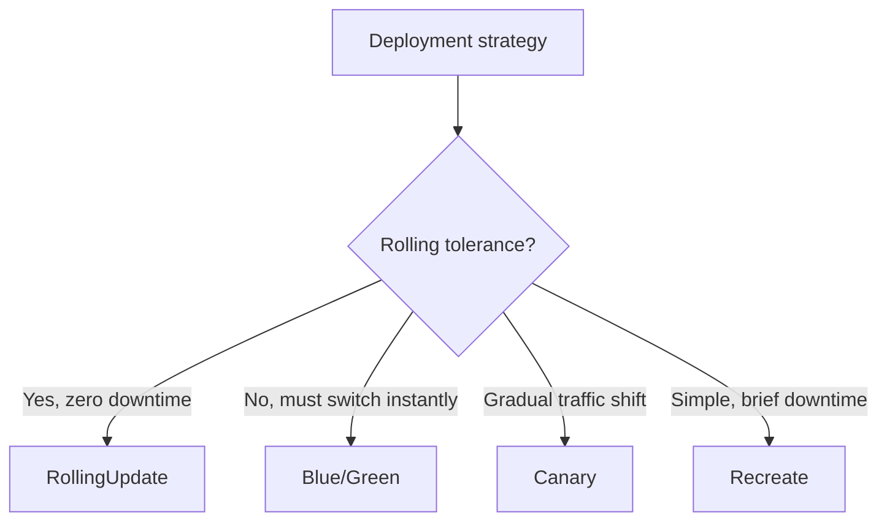
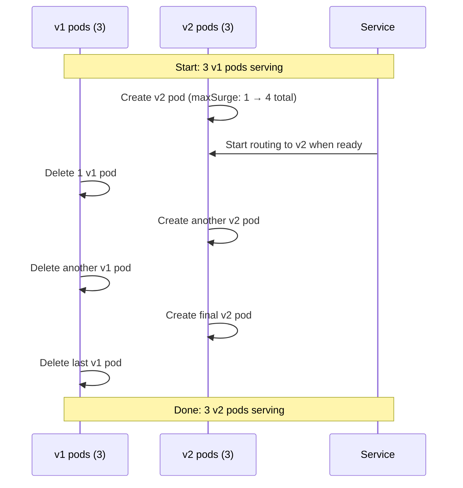
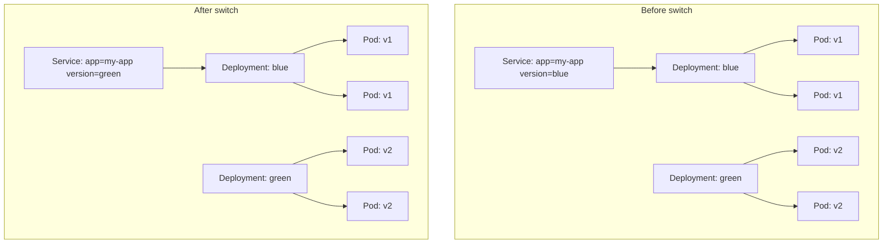

# Deployments, Rollouts, and Strategies

> [!summary] Goal
> Roll out changes safely with rolling updates, blue/green, and canary deployments — and rollback quickly when things go wrong.

## Table of Contents

1. [Why Deployment Strategies Matter](#why-deployment-strategies-matter)
2. [RollingUpdate Strategy](#rollingupdate-strategy)
3. [Recreate Strategy](#recreate-strategy)
4. [Blue/Green Deployment](#blue-green-deployment)
5. [Canary Deployment](#canary-deployment)
6. [Rollout Commands](#rollout-commands)
7. [Rollback Mechanics](#rollback-mechanics)
8. [Pitfalls](#pitfalls)

---

## Why Deployment Strategies Matter

The default RollingUpdate strategy is safe for most stateless services. Blue/green and canary reduce risk for critical production deployments.



---

## RollingUpdate Strategy

The default. Replaces old pods with new pods gradually — zero downtime.

```yaml
apiVersion: apps/v1
kind: Deployment
metadata:
  name: my-app
spec:
  replicas: 5
  strategy:
    type: RollingUpdate
    rollingUpdate:
      maxSurge: 1          # Can create 1 extra pod above desired 5
      maxUnavailable: 1    # Can take down 1 pod below desired 5
  selector:
    matchLabels:
      app: my-app
  template:
    metadata:
      labels:
        app: my-app
        version: v2
    spec:
      containers:
        - name: app
          image: my-app:2.0.0
```



```bash
# Trigger a rollout
kubectl set image deployment/my-app app=my-app:2.0.0
kubectl annotate deployment/my-app kubernetes.io/change-cause="Update to v2.0.0"

# Monitor
kubectl rollout status deployment/my-app --watch
kubectl rollout history deployment/my-app
```

---

## Recreate Strategy

All old pods are killed before new pods are created. Brief downtime. Use when you can't run two versions simultaneously (schema migrations, stateful work).

```yaml
apiVersion: apps/v1
kind: Deployment
metadata:
  name: my-app
spec:
  replicas: 3
  strategy:
    type: Recreate
  template:
    spec:
      containers:
        - name: app
          image: my-app:2.0.0
```

---

## Blue/Green Deployment

Run two identical environments (blue = current, green = new). Switch traffic atomically by updating the Service selector.



```yaml
# Blue deployment
apiVersion: apps/v1
kind: Deployment
metadata:
  name: my-app-blue
  labels:
    app: my-app
    version: blue
spec:
  replicas: 3
  template:
    metadata:
      labels:
        app: my-app
        version: blue
    spec:
      containers:
        - name: app
          image: my-app:1.0.0
---
# Service pointing to blue
apiVersion: v1
kind: Service
metadata:
  name: my-app
spec:
  selector:
    app: my-app
    version: blue    # ← Change this to 'green' to switch
  ports:
    - port: 80
```

```bash
# Deploy green
kubectl apply -f deployment-green.yaml

# Verify green is healthy
kubectl get pods -l version=green

# Switch traffic: update service selector
kubectl patch service my-app -p '{"spec":{"selector":{"version":"green"}}}'

# If green fails, switch back
kubectl patch service my-app -p '{"spec":{"selector":{"version":"blue"}}}'

# Clean up blue after verification
kubectl delete deploy my-app-blue
```

---

## Canary Deployment

Send a small percentage of traffic to the new version. Gradually increase based on metrics. If error rate spikes, rollback the canary.

```yaml
# Stable (90% of replicas)
apiVersion: apps/v1
kind: Deployment
metadata:
  name: my-app-stable
spec:
  replicas: 9
  template:
    metadata:
      labels:
        app: my-app
        track: stable
    spec:
      containers:
        - name: app
          image: my-app:1.0.0
---
# Canary (10% of replicas)
apiVersion: apps/v1
kind: Deployment
metadata:
  name: my-app-canary
spec:
  replicas: 1
  template:
    metadata:
      labels:
        app: my-app
        track: canary
    spec:
      containers:
        - name: app
          image: my-app:2.0.0  # new version
---
# Service splits traffic to both (by app label)
apiVersion: v1
kind: Service
metadata:
  name: my-app
spec:
  selector:
    app: my-app
  ports:
    - port: 80
```

```mermaid
flowchart LR
    A[Service] --> B[Stable: 9 pods (90%)]
    A --> C[Canary: 1 pod (10%)]
    C --> D{Metrics OK?}
    D -->|Yes| E[Increase canary: 3 pods → 5 pods → 9 pods]
    D -->|No| F[Rollback: delete canary]
    E --> G[Promote: canary becomes stable]
```

---

## Rollout Commands

```bash
# Status
kubectl rollout status deployment/my-app --watch
kubectl rollout history deployment/my-app
kubectl rollout history deployment/my-app --revision=2

# Rollback
kubectl rollout undo deployment/my-app
kubectl rollout undo deployment/my-app --to-revision=2

# Pause / resume (for canary validation)
kubectl rollout pause deployment/my-app
# ... verify metrics ...
kubectl rollout resume deployment/my-app

# Restart (without changing image — reloads config)
kubectl rollout restart deployment/my-app
```

---

## Rollback Mechanics

When you run `kubectl rollout undo`, Kubernetes reverts to the previous ReplicaSet:

```yaml
# After the rollback, the old ReplicaSet is scaled up, the new one is scaled down
kubectl get replicasets -l app=my-app

# revisions are kept (default: 10)
# controlled by:
spec:
  revisionHistoryLimit: 10
```

```bash
# The undo command triggers a new rollout to the previous revision
kubectl rollout undo deployment/my-app
# Equivalent to: 'kubectl set image deployment/my-app app=<previous-image>'
```

---

## Pitfalls

### `progressDeadlineSeconds` timeout

A rollout that doesn't make progress within `progressDeadlineSeconds` (default 10 min) is marked as failed.

```yaml
spec:
  progressDeadlineSeconds: 600
```

**Fix**: Check `kubectl describe deployment` for `ProgressDeadlineExceeded`. Common causes: image pull failure, probe misconfiguration, insufficient resources.

### `maxSurge` and `maxUnavailable` for zero-downtime

Setting both to 0 is invalid (can't scale down and up at the same time). For zero-downtime, set both to 1 (or 25%).

```yaml
strategy:
  rollingUpdate:
    maxSurge: 1         # Can go above desired replicas
    maxUnavailable: 1   # Can go below desired replicas
```

### Blue/green resource cost

Running two full environments doubles resource consumption during deployment.

**Fix**: Use canary for cost efficiency. Keep blue/green for critical services where instant rollback is required.

---

> [!question]- Interview Questions
>
> **Q: What is the difference between RollingUpdate and Recreate?**
> A: RollingUpdate replaces pods gradually with zero downtime. Recreate kills all old pods first, then creates new ones — brief downtime, simpler, no two versions running simultaneously.
>
> **Q: How do you implement blue/green deployment in Kubernetes?**
> A: Run two Deployments (blue and green). A single Service selects one version via label. To switch, update the Service selector from `version: blue` to `version: green`.
>
> **Q: What does `kubectl rollout undo` do?**
> A: It reverts the Deployment to the previous revision by scaling down the current ReplicaSet and scaling up the previous one.
>
> **Q: What are `maxSurge` and `maxUnavailable`?**
> A: `maxSurge` controls how many extra pods can be created above the desired count during a rolling update. `maxUnavailable` controls how many pods can be unavailable below the desired count.

---

## Cross-Links

- [[CICD/Kubernetes/02_Core/03_HealthChecks_Resources_and_HPA]] for probes that gate rollouts
- [[CICD/Kubernetes/03_Advanced/05_Scheduling_Affinity_Taints_Tolerations]] for pod placement during rollout
- [[CICD/02_Core/01_Deployment_Strategies]] for deployment strategy overview

---

## References

- [Kubernetes Deployments](https://kubernetes.io/docs/concepts/workloads/controllers/deployment/)
- [Rolling Update](https://kubernetes.io/docs/tutorials/kubernetes-basics/update/update-intro/)
- [Blue/Green Deployment](https://www.weave.works/blog/kubernetes-blue-green-deployment)
