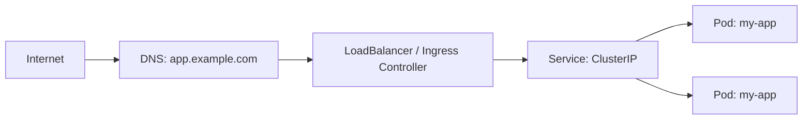
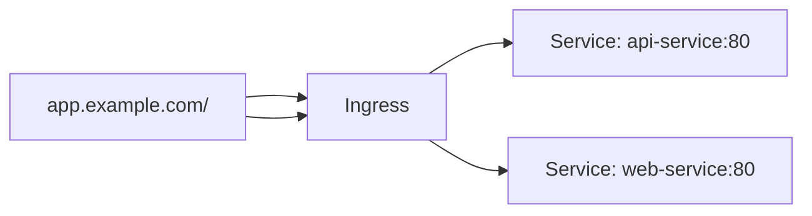
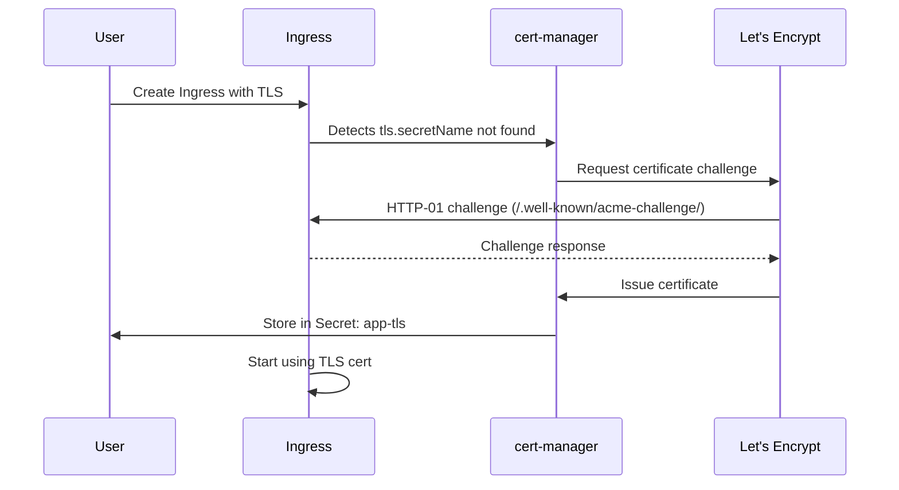
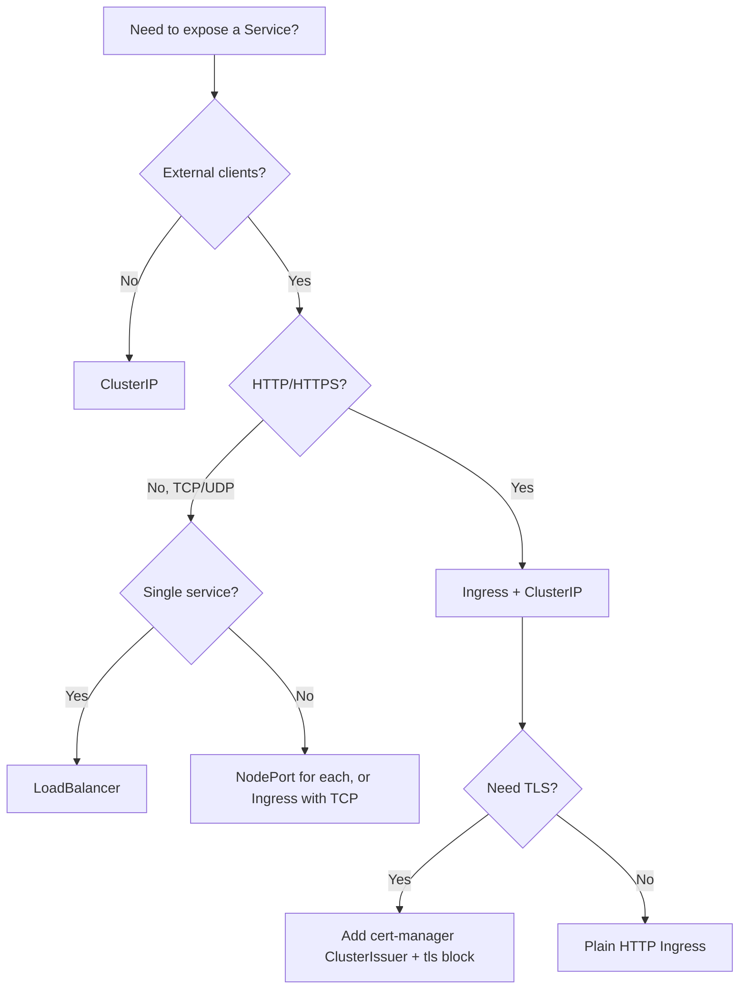

# Ingress and Service Types

> [!summary] Goal
> Expose services safely inside and outside the cluster using the right Service type and Ingress for HTTP/HTTPS traffic with TLS termination.

## Table of Contents

1. [Why Service Exposure Matters](#why-service-exposure-matters)
2. [Service Types Recap](#service-types-recap)
3. [Ingress — HTTP/HTTPS Routing](#ingress-http-https-routing)
4. [Ingress Controllers](#ingress-controllers)
5. [TLS with cert-manager](#tls-with-cert-manager)
6. [Service Type Decision Tree](#service-type-decision-tree)
7. [Pitfalls](#pitfalls)

---

## Why Service Exposure Matters

Choosing the right Service type and Ingress controller determines how traffic reaches your application — from internal cluster access to production HTTPS with TLS.



---

## Service Types Recap

```yaml
# ClusterIP — internal only (default)
apiVersion: v1
kind: Service
metadata:
  name: my-app-internal
spec:
  type: ClusterIP
  selector:
    app: my-app
  ports:
    - port: 80
      targetPort: 8080
---
# NodePort — expose on each node's IP
apiVersion: v1
kind: Service
metadata:
  name: my-app-nodeport
spec:
  type: NodePort
  selector:
    app: my-app
  ports:
    - port: 80
      targetPort: 8080
      nodePort: 30080        # optional: 30000-32767
---
# LoadBalancer — cloud LB (on supported platforms)
apiVersion: v1
kind: Service
metadata:
  name: my-app-lb
spec:
  type: LoadBalancer
  selector:
    app: my-app
  ports:
    - port: 80
      targetPort: 8080
```

| Type | Traffic flow | When to use |
|------|-------------|-------------|
| **ClusterIP** | Service IP → Pod IPs | Internal APIs, databases, inter-service calls |
| **NodePort** | NodeIP:NodePort → ClusterIP → Pods | Dev/test, direct node access |
| **LoadBalancer** | Cloud LB → NodePort → ClusterIP → Pods | Simple external HTTP services |
| **ExternalName** | CNAME alias to external DNS | Wrapping external services |

---

## Ingress — HTTP/HTTPS Routing

Ingress provides HTTP/HTTPS routing to Services based on hostnames and paths.

```yaml
apiVersion: networking.k8s.io/v1
kind: Ingress
metadata:
  name: my-app
  annotations:
    nginx.ingress.kubernetes.io/rewrite-target: /
    cert-manager.io/cluster-issuer: letsencrypt-prod
spec:
  ingressClassName: nginx
  tls:
    - hosts:
        - app.example.com
      secretName: app-tls    # Created by cert-manager
  rules:
    - host: app.example.com
      http:
        paths:
          - path: /api
            pathType: Prefix
            backend:
              service:
                name: api-service
                port:
                  number: 80
          - path: /
            pathType: Prefix
            backend:
              service:
                name: web-service
                port:
                  number: 80
```



### Path types

| Type | Behavior | Example |
|------|----------|---------|
| `Prefix` | Matches paths starting with `/api` | `/api/users` matches |
| `Exact` | Matches exactly `/api` | `/api` matches, `/api/` does not |
| `ImplementationSpecific` | Controller-dependent | nginx: treats as Prefix |

---

## Ingress Controllers

The Ingress resource is just a configuration. An **Ingress Controller** must be running in the cluster to implement it.

```bash
# Install nginx-ingress
kubectl apply -f https://raw.githubusercontent.com/kubernetes/ingress-nginx/controller-v1.10.0/deploy/static/provider/cloud/deploy.yaml

# Verify
kubectl get pods -n ingress-nginx
kubectl get ingressclasses
```

| Controller | Installation | Best for |
|-----------|-------------|----------|
| **nginx-ingress** | Helm, YAML manifest | Most common, feature-rich, widely documented |
| **AWS ALB Ingress** | AWS Load Balancer Controller | AWS EKS, native ALB integration |
| **GKE Ingress** | Built-in | Google Kubernetes Engine |
| **Traefik** | Helm, Docker | Small clusters, automatic Let's Encrypt, dashboard |
| **Contour** | Helm | Envoy-based, gRPC, advanced traffic splitting |
| **Istio Ingress Gateway** | Istio operator | Service mesh environments |

---

## TLS with cert-manager

cert-manager automates TLS certificate provisioning and renewal.

```bash
# Install cert-manager
kubectl apply -f https://github.com/cert-manager/cert-manager/releases/latest/download/cert-manager.yaml

# Create a ClusterIssuer for Let's Encrypt
kubectl apply -f cluster-issuer.yaml
```

```yaml
apiVersion: cert-manager.io/v1
kind: ClusterIssuer
metadata:
  name: letsencrypt-prod
spec:
  acme:
    server: https://acme-v02.api.letsencrypt.org/directory
    email: admin@example.com
    privateKeySecretRef:
      name: letsencrypt-prod-key
    solvers:
      - http01:
          ingress:
            class: nginx
```



### Ingress with TLS using the cert-manager-generated secret

```yaml
apiVersion: networking.k8s.io/v1
kind: Ingress
metadata:
  name: secure-app
  annotations:
    cert-manager.io/cluster-issuer: letsencrypt-prod
spec:
  ingressClassName: nginx
  tls:
    - hosts:
        - app.example.com
      secretName: app-tls
  rules:
    - host: app.example.com
      http:
        paths:
          - path: /
            pathType: Prefix
            backend:
              service:
                name: my-app
                port:
                  number: 80
```

---

## Service Type Decision Tree



---

## Pitfalls

### Ingress without a controller

Creating an Ingress resource without an Ingress Controller running will do nothing — the Ingress status stays empty and no routing happens.

**Fix**: `kubectl get ingressclass` to verify an IngressClass exists. `kubectl get pods -n ingress-nginx` to verify the controller is running.

### LoadBalancer Service without cloud provider

Running on bare metal or kind? A LoadBalancer Service will remain `<pending>` because there's no LB provisioner.

**Fix**: Use NodePort + external LB, or install MetalLB for bare-metal LoadBalancer support.

### cert-manager certificate not issued

Common causes: DNS not pointing to the Ingress Controller's external IP, HTTP-01 challenge blocked by firewall, email not reachable.

```bash
kubectl describe certificate app-tls
kubectl describe orders.acme.cert-manager.io
kubectl describe challenges.acme.cert-manager.io
```

---

> [!question]- Interview Questions
>
> **Q: What is the difference between a Service and an Ingress?**
> A: A Service provides stable networking for pods within the cluster (ClusterIP) or basic external access (NodePort, LoadBalancer). Ingress provides HTTP/HTTPS routing with host/path-based rules, TLS termination, and works with a controller.
>
> **Q: How do you configure TLS for an Ingress?**
> A: Install cert-manager, create a ClusterIssuer (Let's Encrypt), then add `tls:` and `cert-manager.io/cluster-issuer` annotation to the Ingress. cert-manager automatically provisions and renews the certificate.
>
> **Q: What is the difference between `Prefix` and `Exact` path types?**
> A: `Prefix` matches any path starting with the given prefix (e.g., `/api/users` matches `/api`). `Exact` matches only the exact path (e.g., `/api` but not `/api/`).

---

## Cross-Links

- [[CICD/Kubernetes/01_Foundations/02_Labels_Selectors_and_Namespaces]] for Service label selectors
- [[CICD/Kubernetes/01_Foundations/03_ConfigMaps_Secrets_and_Volumes]] for TLS secrets
- [[CICD/Kubernetes/04_Playbooks/02_Local_Development_with_kind]] for Ingress on local clusters

---

## References

- [Kubernetes Services](https://kubernetes.io/docs/concepts/services-networking/service/)
- [Kubernetes Ingress](https://kubernetes.io/docs/concepts/services-networking/ingress/)
- [Ingress Controllers](https://kubernetes.io/docs/concepts/services-networking/ingress-controllers/)
- [cert-manager](https://cert-manager.io/docs/)
