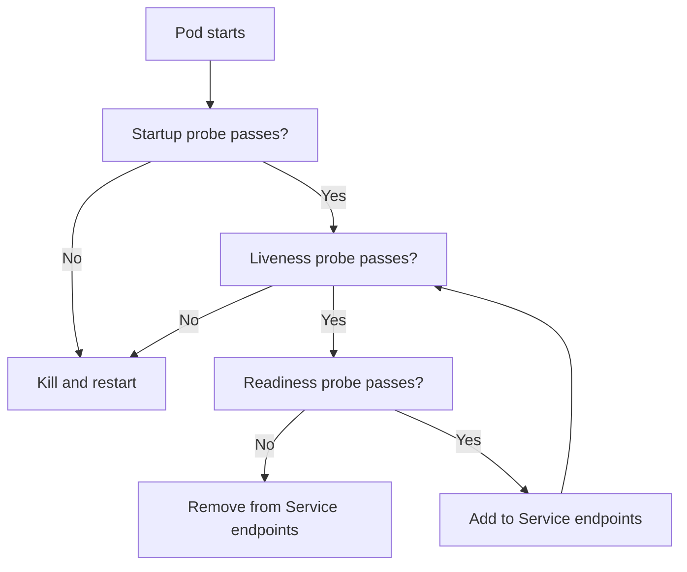
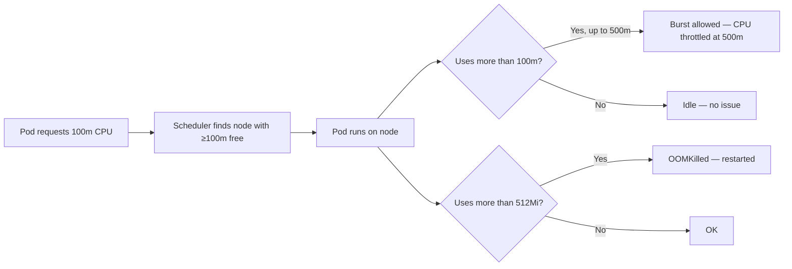
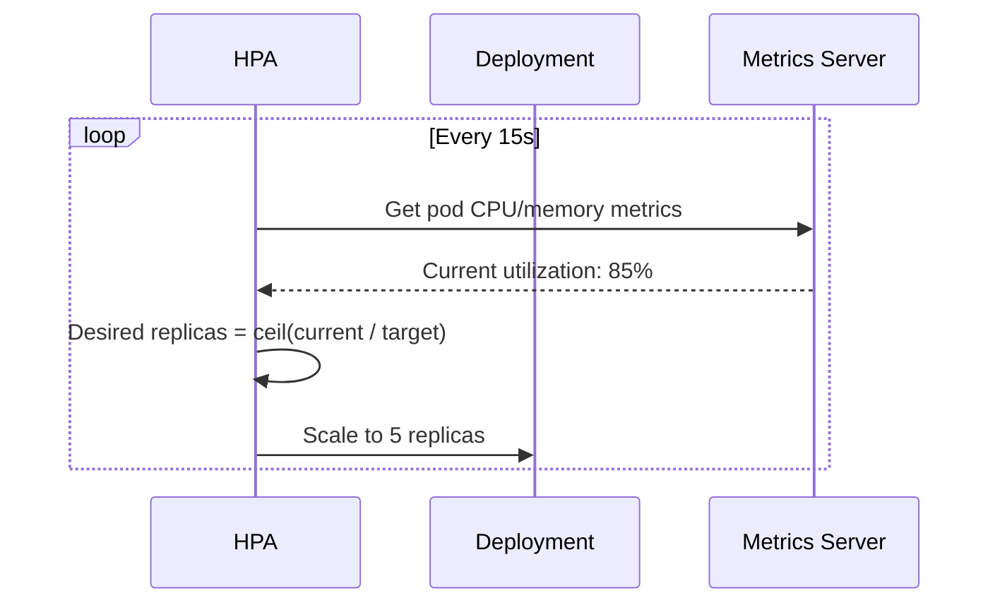

# Health Checks, Resources, and HPA

> [!summary] Goal
> Keep pods healthy with proper probes, set realistic resource requests/limits, and autoscale based on load.

## Table of Contents

1. [Why Probes and Resources Matter](#why-probes-and-resources-matter)
2. [Liveness, Readiness, and Startup Probes](#liveness-readiness-and-startup-probes)
3. [Probe Handler Types](#probe-handler-types)
4. [Resource Requests and Limits](#resource-requests-and-limits)
5. [Horizontal Pod Autoscaler](#horizontal-pod-autoscaler)
6. [Vertical Pod Autoscaler](#vertical-pod-autoscaler)
7. [Pitfalls](#pitfalls)

---

## Why Probes and Resources Matter

Without probes, Kubernetes doesn't know if your app is alive or ready to serve traffic. Without resource requests, the scheduler places pods blindly.



---

## Liveness, Readiness, and Startup Probes

```yaml
apiVersion: v1
kind: Pod
metadata:
  name: my-app
spec:
  containers:
    - name: app
      image: my-app:1.0.0
      ports:
        - containerPort: 8080
      startupProbe:        # Delays liveness until app is initialized
        httpGet:
          path: /health/startup
          port: 8080
        initialDelaySeconds: 0
        periodSeconds: 5
        failureThreshold: 30
      livenessProbe:        # Restarts pod if stuck
        httpGet:
          path: /health/live
          port: 8080
        initialDelaySeconds: 10
        periodSeconds: 10
        failureThreshold: 3
      readinessProbe:       # Removes from Service if not ready
        httpGet:
          path: /health/ready
          port: 8080
        initialDelaySeconds: 5
        periodSeconds: 5
        failureThreshold: 2
```

| Probe | Purpose | Failure consequence |
|-------|---------|-------------------|
| **Liveness** | Is the app alive? (not stuck/deadlocked) | Container restart |
| **Readiness** | Is the app ready to serve traffic? | Removed from Service endpoints |
| **Startup** | Is the app initialized? (slow start) | Delays liveness checks |

### Probe parameters

| Parameter | Default | Description |
|-----------|---------|-------------|
| `initialDelaySeconds` | 0 | Wait before first probe |
| `periodSeconds` | 10 | How often to probe |
| `timeoutSeconds` | 1 | Probe timeout |
| `successThreshold` | 1 | Consecutive successes to mark healthy |
| `failureThreshold` | 3 | Consecutive failures to mark unhealthy |

---

## Probe Handler Types

### HTTP probe

```yaml
livenessProbe:
  httpGet:
    path: /healthz
    port: 8080
    httpHeaders:
      - name: X-Custom-Header
        value: health-check
```

### TCP probe

```yaml
readinessProbe:
  tcpSocket:
    port: 3306
  initialDelaySeconds: 5
  periodSeconds: 10
```

### Command probe (exec)

```yaml
livenessProbe:
  exec:
    command:
      - pg_isready
      - -U
      - postgres
```

---

## Resource Requests and Limits

```yaml
containers:
  - name: app
    image: my-app
    resources:
      requests:     # Scheduler guarantee — pod will get at least this
        cpu: 100m    # 100 millicores (0.1 CPU)
        memory: 128Mi
      limits:       # Cgroup hard cap — pod cannot exceed this
        cpu: 500m
        memory: 512Mi
```



### CPU and memory units

| Unit | Meaning | Example |
|------|---------|---------|
| `100m` | 100 millicores (0.1 CPU) | `cpu: 250m` = 0.25 CPU |
| `1` | 1 full CPU core | `cpu: 2` = 2 cores |
| `128Mi` | 128 Mebibytes (2^20 bytes) | `memory: 512Mi` |
| `1Gi` | 1 Gibibyte | `memory: 2Gi` |

---

## Horizontal Pod Autoscaler

HPA automatically scales the number of pods based on CPU, memory, or custom metrics.

```yaml
apiVersion: autoscaling/v2
kind: HorizontalPodAutoscaler
metadata:
  name: my-app-hpa
spec:
  scaleTargetRef:
    apiVersion: apps/v1
    kind: Deployment
    name: my-app
  minReplicas: 2
  maxReplicas: 10
  metrics:
    - type: Resource
      resource:
        name: cpu
        target:
          type: Utilization
          averageUtilization: 70
    - type: Resource
      resource:
        name: memory
        target:
          type: Utilization
          averageUtilization: 80
  behavior:
    scaleDown:
      stabilizationWindowSeconds: 300
      policies:
        - type: Percent
          value: 10
          periodSeconds: 60
    scaleUp:
      stabilizationWindowSeconds: 0
      policies:
        - type: Percent
          value: 100
          periodSeconds: 60
```



```bash
# Prerequisite: metrics-server must be installed
kubectl apply -f https://github.com/kubernetes-sigs/metrics-server/releases/latest/download/components.yaml

# HPA commands
kubectl autoscale deployment my-app --cpu-percent=70 --min=2 --max=10
kubectl get hpa
kubectl describe hpa my-app-hpa
kubectl get hpa my-app-hpa --watch
```

---

## Vertical Pod Autoscaler

VPA adjusts resource requests/limits automatically based on historical usage, rather than scaling replicas.

```yaml
apiVersion: autoscaling.k8s.io/v1
kind: VerticalPodAutoscaler
metadata:
  name: my-app-vpa
spec:
  targetRef:
    apiVersion: apps/v1
    kind: Deployment
    name: my-app
  updatePolicy:
    updateMode: Auto   # or: Initial, Recreate, Off
  resourcePolicy:
    containerPolicies:
      - containerName: '*'
        minAllowed:
          cpu: 50m
          memory: 64Mi
        maxAllowed:
          cpu: 2
          memory: 4Gi
```

---

---

## Vertical Pod Autoscaler (VPA)

> [!info] VPA
> VPA automatically adjusts CPU/memory resource requests (and optionally limits) based on historical usage. It complements HPA — HPA adds/removes pods (horizontal), VPA changes pod sizes (vertical). VPA requires pods to be recreated to apply new recommendations.

### Update modes

| Mode | Behavior | Use case |
|:-----|:---------|:---------|
| **Auto** | VPA deletes and recreates pods with updated resource requests | Default for long-running services |
| **Recreate** | Same as Auto | Same |
| **Initial** | Only sets resources at pod creation time | Batch jobs, first-boot sizing |
| **Off** | Only recommends — does NOT apply | Dry-run, what-if analysis |

```yaml
apiVersion: autoscaling.k8s.io/v1
kind: VerticalPodAutoscaler
metadata:
  name: payment-service-vpa
spec:
  targetRef:
    apiVersion: apps/v1
    kind: Deployment
    name: payment-service
  updatePolicy:
    updateMode: Auto
  resourcePolicy:
    containerPolicies:
      - containerName: "*"
        minAllowed:
          cpu: 100m
          memory: 256Mi
        maxAllowed:
          cpu: 4
          memory: 8Gi
        controlledResources: ["cpu", "memory"]
        controlledValues: RequestsAndLimits
```

### VPA + HPA coexistence rules

```text
VPA and HPA CANNOT both use the same metric (CPU or memory):
  - ❌ HPA on CPU + VPA on CPU → conflict (VPA changes CPU requests, HPA sees different CPU/request ratio).
  - ✅ HPA on custom metrics (QPS, latency) + VPA on CPU/memory → OK.
  - ✅ HPA on CPU + VPA on memory → OK (different metrics).
  - ✅ HPA on memory + VPA on CPU → OK.

Recommendation: if you need both, let HPA handle CPU-based scaling and VPA handle memory.
```

---

## Pitfalls

### Not setting resource requests

Without requests, the scheduler doesn't know how much to reserve — pods may be packed onto overloaded nodes and get OOMKilled.

**Fix**: Always set `resources.requests.cpu` and `resources.requests.memory` on every container.

### CPU limits cause throttling

CPU limits use CFS quotas, which can throttle CPU-intensive workloads even when the node has free CPU, causing latency spikes.

**Fix**: For latency-sensitive apps, set CPU requests but NOT CPU limits. Memory limits are still recommended.

### Readiness probe tied to external dependency

If the readiness probe checks a database connection, a DB outage takes ALL replicas out of service — even though the app itself is functional.

**Fix**: Use readiness for app-level readiness (is the HTTP server up?), not external dependency checks. Use liveness for self-health.

### HPA without metrics-server

HPA requires the metrics-server to be installed. Without it, `kubectl get hpa` shows `<unknown>` for metrics.

**Fix**: `kubectl top pod` should return data. If it doesn't, metrics-server is not running.

---

> [!question]- Interview Questions
>
> **Q: What is the difference between liveness, readiness, and startup probes?**
> A: Liveness determines if the container should be restarted. Readiness determines if the pod should receive traffic. Startup delays liveness checks for slow-starting applications.
>
> **Q: How does the Horizontal Pod Autoscaler work?**
> A: HPA periodically queries metrics (CPU/memory/custom). It calculates `desiredReplicas = ceil(currentMetricValue / targetMetricValue * currentReplicas)` and updates the Deployment's replicas field.
>
> **Q: What happens when a container exceeds its memory limit?**
> A: The container is OOMKilled (exit code 137) and restarted by kubelet. It will be OOMKilled again if the same memory pressure occurs.
>
> **Q: What is the difference between HPA and VPA?**
> A: HPA scales the number of pod replicas horizontally. VPA adjusts the resource requests/limits of existing pods vertically.

---

## Cross-Links

- [[CICD/Kubernetes/03_Advanced/01_Resource_Requests_Limits_and_QoS_Deep_Dive]] for QoS classes and resource details
- [[CICD/Kubernetes/02_Core/04_Debugging_with_kubectl]] for debugging probe issues
- [[CICD/Kubernetes/04_Playbooks/04_Monitoring_and_Observability_with_Prometheus]] for custom metrics

---

## References

- [Configure Probes](https://kubernetes.io/docs/tasks/configure-pod-container/configure-liveness-readiness-startup-probes/)
- [Resource Management for Pods and Containers](https://kubernetes.io/docs/concepts/configuration/manage-resources-containers/)
- [Horizontal Pod Autoscaling](https://kubernetes.io/docs/tasks/run-application/horizontal-pod-autoscale/)
- [Vertical Pod Autoscaling](https://github.com/kubernetes/autoscaler/tree/master/vertical-pod-autoscaler)
