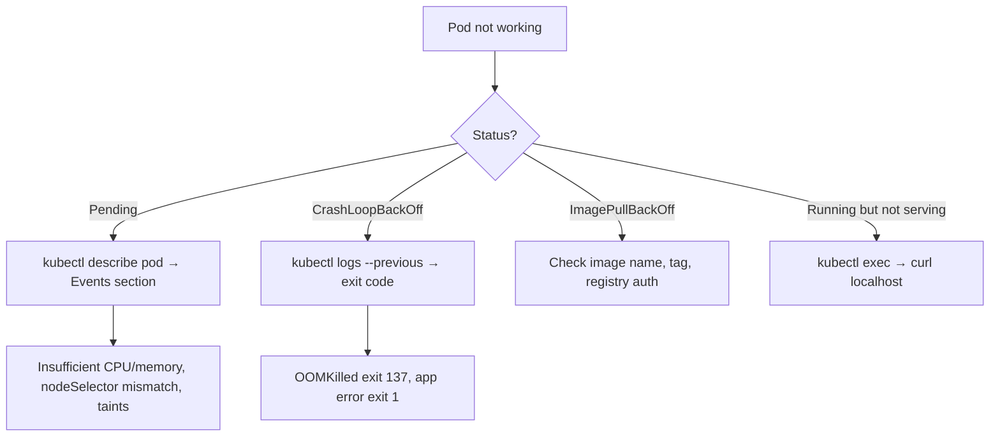

# Debugging with kubectl

> [!summary] Goal
> Quickly answer: what is broken, where, and why — using kubectl commands, log inspection, and ephemeral debug containers.

## Table of Contents

1. [Quick Triage](#quick-triage)
2. [Pods Not Starting](#pods-not-starting)
3. [Pods Restarting](#pods-restarting)
4. [Service Connectivity](#service-connectivity)
5. [Debugging with Ephemeral Containers](#debugging-with-ephemeral-containers)
6. [Advanced Debugging](#advanced-debugging)
7. [Pitfalls](#pitfalls)

---

## Quick Triage

```bash
# What's in the cluster?
kubectl get all                         # Pods, Services, Deployments
kubectl get pods -A                     # All pods, all namespaces
kubectl get events --sort-by='.lastTimestamp'  # Recent events

# What's wrong with this pod?
kubectl describe pod <pod-name>         # Events, conditions, container status
kubectl logs <pod-name>                 # Container logs
kubectl logs --previous <pod-name>      # Logs of the crashed container

# What's happening on this node?
kubectl describe node <node-name>       # Resource usage, conditions, pods
kubectl top node                        # Node resource usage
kubectl top pod                         # Pod resource usage
```



---

## Pods Not Starting

### Pending — not scheduled

```bash
kubectl describe pod pending-pod | grep -A5 Events

# Common causes:
# - Insufficient CPU/memory (check `kubectl top nodes`)
# - nodeSelector has no matching node
# - Node has taints with no toleration
# - PVC not bound

# Solution
kubectl describe node  # Check allocatable resources
kubectl get nodes -l <label>  # Check nodeSelector matches
```

### ImagePullBackOff / ErrImagePull

```bash
kubectl describe pod <pod-name>

# Causes:
# - Image name wrong (typo)
# - Tag doesn't exist
# - Registry credentials missing
# - Registry rate limit hit (Docker Hub: 200 pulls/6h for free)

kubectl create secret docker-registry regcred \
  --docker-server=https://index.docker.io/v1/ \
  --docker-username=<user> \
  --docker-password=<token>

# Make the secret available to the pod:
# spec.imagePullSecrets:
#   - name: regcred
```

---

## Pods Restarting

### CrashLoopBackOff

Container exits immediately after starting, repeatedly.

```bash
# Check the exit code
kubectl logs --previous <pod-name> --tail=50

# Check probe failures
kubectl describe pod <pod-name> | grep -A5 Probe

# Exec into the container (if it stays up long enough)
kubectl exec -it <pod-name> -- sh
```

### Common exit codes

| Code | Signal | Meaning |
|------|--------|---------|
| `0` | — | Normal exit |
| `1` | — | Application error (code bug, config issue) |
| `127` | — | Command not found (check Dockerfile CMD/ENTRYPOINT) |
| `137` | SIGKILL | OOMKilled (exceeded memory limit) |
| `139` | SIGSEGV | Segmentation fault |
| `143` | SIGTERM | Graceful shutdown |

### OOMKilled

```bash
# Check if pod was killed for memory
kubectl describe pod <pod-name> | grep -i oom

# Status shows: State: Terminated, Reason: OOMKilled
# Exit Code: 137

# Solution
# Increase memory limits in the Deployment spec
```

---

## Service Connectivity

```bash
# Does the service exist?
kubectl get svc <service-name>
kubectl get endpoints <service-name>    # Are there any endpoints?

# Check if the service selector matches pod labels
kubectl get pods --show-labels
kubectl describe svc <service-name> | grep Selector

# Test DNS resolution
kubectl run -it --rm debug --image=nicolaka/netshoot -- sh
# Inside: nslookup <service-name>
# Inside: curl -v http://<service-name>:<port>

# Port-forward to test locally
kubectl port-forward svc/<service-name> 8080:80
curl http://localhost:8080

# Check Ingress
kubectl describe ingress <ingress-name>
kubectl get ingress -A
```

---

## Debugging with Ephemeral Containers

Ephemeral containers let you add a debug container to a running pod without restarting it (K8s 1.28+):

```bash
# Add a debug container to a running pod
kubectl debug my-pod -it --image=nicolaka/netshoot --target=app

# Create a copy of a pod with a debug container
kubectl debug my-pod -it --image=nicolaka/netshoot --copy-to=my-pod-debug

# Debug a node (creates a debug pod on the node)
kubectl debug node/worker-1 -it --image=nicolaka/netshoot
```

---

## Advanced Debugging

```bash
# Check RBAC permissions
kubectl auth can-i create deployments
kubectl auth can-i list pods --as=system:serviceaccount:default:my-sa

# Check API server health
kubectl get --raw /healthz
kubectl get --raw /livez
kubectl get --raw /readyz

# Watch events
kubectl get events --watch
kubectl get events --field-selector involvedObject.name=<pod-name>

# Check resource quotas
kubectl get resourcequota -A
kubectl describe quota <quota-name> -n <ns>

# Check API server component status
kubectl get componentstatuses
```

---

## Pitfalls

### Forgetting `-n` flag

`kubectl get pods` only shows the current namespace. If the pod is in `production`, you get nothing.

**Fix**: `kubectl get pods -A` or `kubectl -n production get pods`.

### Not checking events

Pod status alone doesn't tell you why it failed. The Events section of `kubectl describe pod` contains the root cause.

**Fix**: Always check events: `kubectl describe pod <pod-name> | grep -A10 Events`.

### Using `exec` on a crashing pod

If a pod keeps crashing, `kubectl exec` won't work — the container is not running.

**Fix**: Use `kubectl logs --previous` to see the last run's logs, or `kubectl debug` to add an ephemeral container.

---

> [!question]- Interview Questions
>
> **Q: What does `kubectl logs --previous` do?**
> A: It shows the logs from the previous instance of a container that has crashed and restarted. Essential for debugging CrashLoopBackOff.
>
> **Q: What are ephemeral debug containers?**
> A: Temporary containers added to a running pod for debugging without restarting it. Useful when a pod doesn't include debugging tools like curl or netcat.
>
> **Q: How do you check if a Service has healthy endpoints?**
> A: `kubectl get endpoints <service-name>`. If the endpoints list is empty, the Service selector doesn't match any pod labels.

---

## Cross-Links

- [[CICD/Kubernetes/04_Playbooks/01_Troubleshoot_CrashLoopBackOff]] for CrashLoopBackOff debugging
- [[CICD/Kubernetes/03_Advanced/01_Resource_Requests_Limits_and_QoS_Deep_Dive]] for OOM debugging
- [[CICD/Kubernetes/01_Foundations/03_ConfigMaps_Secrets_and_Volumes]] for config issues

---

## References

- [kubectl Cheat Sheet](https://kubernetes.io/docs/reference/kubectl/cheatsheet/)
- [Debug Running Pods](https://kubernetes.io/docs/tasks/debug/debug-application/debug-running-pod/)
- [Troubleshoot Applications](https://kubernetes.io/docs/tasks/debug/debug-application/)
- [Ephemeral Containers](https://kubernetes.io/docs/concepts/workloads/pods/ephemeral-containers/)
