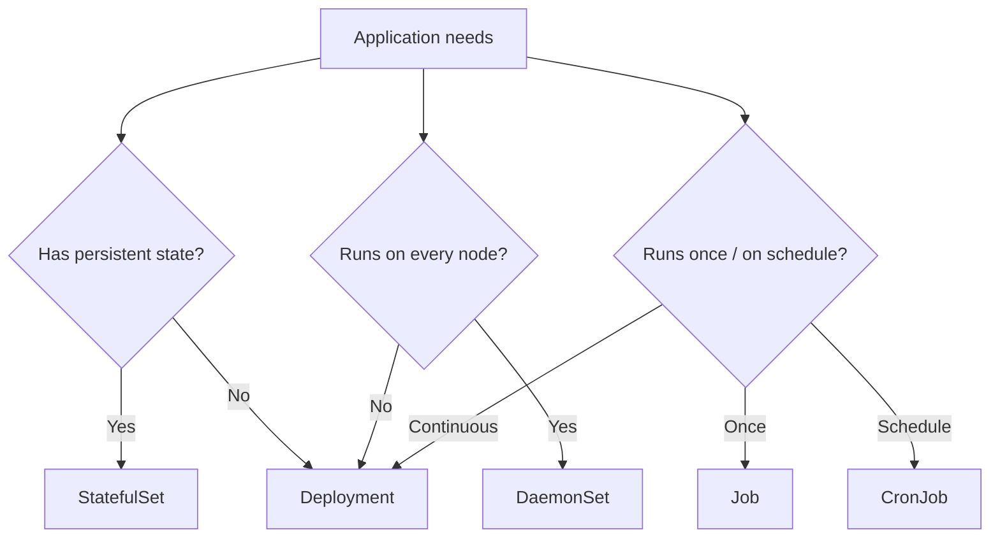
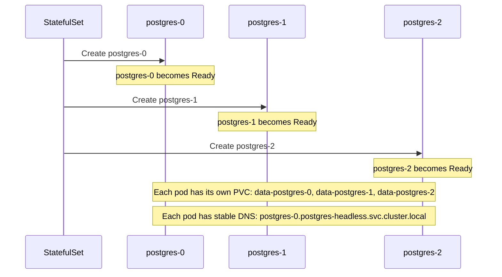
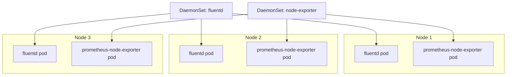

# Workload Types: StatefulSet, DaemonSet, Job, and CronJob

> [!summary] Goal
> Choose the right workload controller for every job: stateful applications with StatefulSet, node-level agents with DaemonSet, batch processing with Job, and scheduled tasks with CronJob.

## Table of Contents

1. [Why Workload Types Matter](#why-workload-types-matter)
2. [StatefulSet — Stateful Applications](#statefulset-stateful-applications)
3. [DaemonSet — Node-Level Agents](#daemonset-node-level-agents)
4. [Job — Batch Processing](#job-batch-processing)
5. [CronJob — Scheduled Tasks](#cronjob-scheduled-tasks)
6. [Workload Type Comparison](#workload-type-comparison)
7. [Pitfalls](#pitfalls)

---

## Why Workload Types Matter

Deployment is for stateless workloads. Use the right controller for each pattern.



---

## StatefulSet — Stateful Applications

StatefulSets provide stable network identities and persistent storage per pod.

```yaml
apiVersion: apps/v1
kind: StatefulSet
metadata:
  name: postgres
spec:
  serviceName: postgres-headless
  replicas: 3
  selector:
    matchLabels:
      app: postgres
  template:
    metadata:
      labels:
        app: postgres
    spec:
      containers:
        - name: postgres
          image: postgres:16-alpine
          volumeMounts:
            - name: data
              mountPath: /var/lib/postgresql/data
  volumeClaimTemplates:
    - metadata:
        name: data
      spec:
        accessModes: [ReadWriteOnce]
        resources:
          requests:
            storage: 10Gi
        storageClassName: standard
```



### Key characteristics

| Feature | StatefulSet | Deployment |
|---------|-------------|------------|
| Pod naming | `postgres-0`, `postgres-1`, `postgres-2` | `my-app-7d8f9c-a1b2c` (random hash) |
| Storage | Each pod has its own PVC (via volumeClaimTemplates) | Shared PVC or none |
| Pod creation order | Sequential (0 → 1 → 2) | Parallel |
| Pod deletion order | Reverse sequential (2 → 1 → 0) | Any order |
| Stable network identity | `pod-name.service-name` DNS | Random hash, no stable name |
| Use case | Databases, message queues, anything with persistent identity | Stateless web apps, APIs |

---

## DaemonSet — Node-Level Agents

A DaemonSet runs exactly one pod on every node (or a subset, using nodeSelector).

```yaml
apiVersion: apps/v1
kind: DaemonSet
metadata:
  name: fluentd
  namespace: logging
spec:
  selector:
    matchLabels:
      name: fluentd
  template:
    metadata:
      labels:
        name: fluentd
    spec:
      # Run on specific nodes only
      nodeSelector:
        kubernetes.io/os: linux
      containers:
        - name: fluentd
          image: fluent/fluentd:v1.16
          resources:
            limits:
              memory: 200Mi
            requests:
              cpu: 100m
              memory: 200Mi
          volumeMounts:
            - name: varlog
              mountPath: /var/log
            - name: docker-logs
              mountPath: /var/lib/docker/containers
              readOnly: true
      volumes:
        - name: varlog
          hostPath:
            path: /var/log
        - name: docker-logs
          hostPath:
            path: /var/lib/docker/containers
```



| Use case | Examples |
|----------|----------|
| Log collection | fluentd, Filebeat, Logstash |
| Monitoring | Prometheus Node Exporter, Datadog Agent |
| Networking | Calico, Cilium, kube-proxy |
| Storage | CSI drivers (host path mounting) |

---

## Job — Batch Processing

A Job runs one or more pods to completion. If a pod fails, the Job creates a replacement.

```yaml
apiVersion: batch/v1
kind: Job
metadata:
  name: data-migration
spec:
  completions: 1      # Number of successful completions needed
  parallelism: 1      # Number of pods to run in parallel
  backoffLimit: 3     # Retries before marking as failed
  activeDeadlineSeconds: 300  # Max total time for the job
  template:
    spec:
      restartPolicy: Never    # or: OnFailure
      containers:
        - name: migration
          image: my-app:1.0.0
          command: ["npm", "run", "migrate"]
```

```bash
# Job commands
kubectl create job migration --image=my-app -- npm run migrate
kubectl get jobs
kubectl describe job data-migration
kubectl logs job/data-migration

# Wait for completion
kubectl wait --for=condition=complete job/data-migration

# CronJob
kubectl create cronjob backup --image=postgres --schedule="0 2 * * *" -- pg_dump
```

### Parallel Job patterns

```yaml
# Work queue — parallel tasks
spec:
  completions: 10     # 10 successful completions in total
  parallelism: 3      # 3 concurrent pods at a time
---
# Single job, multiple completions
spec:
  completions: 1
  parallelism: 5      # 5 pods racing — first completion wins
```

---

## CronJob — Scheduled Tasks

```yaml
apiVersion: batch/v1
kind: CronJob
metadata:
  name: hourly-backup
spec:
  schedule: "0 * * * *"           # Every hour (cron format)
  startingDeadlineSeconds: 120    # Max delay after missed schedule
  concurrencyPolicy: Forbid       # Don't run if previous still running
  successfulJobsHistoryLimit: 3   # Keep 3 successful job records
  failedJobsHistoryLimit: 1       # Keep 1 failed job record
  jobTemplate:
    spec:
      template:
        spec:
          containers:
            - name: backup
              image: postgres:16-alpine
              command:
                - pg_dump
                - -h
                - postgres
                - -U
                - admin
                - mydb
          restartPolicy: Never
```

| CronJob option | Purpose |
|----------------|---------|
| `schedule` | Standard cron syntax: `minute hour day month weekday` |
| `startingDeadlineSeconds` | Max delay if the CronJob controller misses a schedule |
| `concurrencyPolicy` | `Allow` (default), `Forbid` (skip if running), `Replace` (kill and restart) |
| `successfulJobsHistoryLimit` | How many completed Jobs to keep |
| `failedJobsHistoryLimit` | How many failed Jobs to keep |

---

## Workload Type Comparison

| Aspect | Deployment | StatefulSet | DaemonSet | Job |
|--------|------------|-------------|-----------|-----|
| Replicas | Configurable | Configurable | 1 per node | Configurable |
| Pod identity | Random hash | Ordinal (`-0`, `-1`) | Random hash | Random hash |
| Storage | Shared/Stateless | Per-pod PVC (volumeClaimTemplate) | hostPath | Ephemeral |
| Scaling | Up/down, fast | Up/down, sequential | Adds/removes with nodes | Up/down |
| Update strategy | RollingUpdate | RollingUpdate, OnDelete | RollingUpdate | — |
| Use case | Stateless apps | Databases, queues | Node agents, loggers | Batch, migration |

---

## Pitfalls

### StatefulSet scaling down deletes PVCs

StatefulSet `volumeClaimTemplates` create a PVC per pod. Deleting the pod does NOT delete the PVC — you must delete it manually.

**Fix**: Use `kubectl delete pvc data-postgres-2` after confirming the data is no longer needed.

### DaemonSet scheduling on all nodes

DaemonSet runs on every node by default, including control plane nodes (if they're not tainted).

**Fix**: Add `nodeSelector` or tolerations to limit which nodes the DaemonSet runs on.

### CronJob concurrency unexpected

Default `concurrencyPolicy: Allow` means a new Job can start while the previous is still running — causing conflicts.

**Fix**: Use `concurrencyPolicy: Forbid` for database operations. Use `Replace` for idempotent tasks.

### Job `restartPolicy: Never` vs `OnFailure`

`Never`: Job creates a new pod on failure. `OnFailure`: kubelet restarts the container in place.

**Fix**: Use `Never` for idempotent jobs, `OnFailure` for jobs where retrying in the same pod is safe.

---

> [!question]- Interview Questions
>
> **Q: When would you use a StatefulSet instead of a Deployment?**
> A: When you need stable pod identities (for clustering) and persistent storage per pod (databases, message queues, distributed systems like Cassandra or Zookeeper).
>
> **Q: What is a DaemonSet used for?**
> A: Running exactly one pod per node for node-level infrastructure services: log collectors (fluentd), monitoring agents (Node Exporter), networking (Calico), and storage (CSI).
>
> **Q: What is the difference between a Job and a CronJob?**
> A: A Job runs a batch task once. A CronJob runs jobs on a schedule (cron syntax). The CronJob creates a Job object each time the schedule triggers.

---

## Cross-Links

- [[CICD/Kubernetes/01_Foundations/01_Core_Objects_Pods_Deployments_Services]] for Deployment comparison
- [[CICD/Kubernetes/02_Core/07_Storage_PV_PVC_StorageClass_StatefulSet_Integration]] for StatefulSet storage
- [[CICD/Kubernetes/04_Playbooks/04_Monitoring_and_Observability_with_Prometheus]] for DaemonSet monitoring

---

## References

- [StatefulSet](https://kubernetes.io/docs/concepts/workloads/controllers/statefulset/)
- [DaemonSet](https://kubernetes.io/docs/concepts/workloads/controllers/daemonset/)
- [Job](https://kubernetes.io/docs/concepts/workloads/controllers/job/)
- [CronJob](https://kubernetes.io/docs/concepts/workloads/controllers/cron-jobs/)
