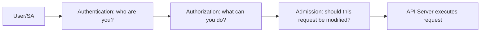
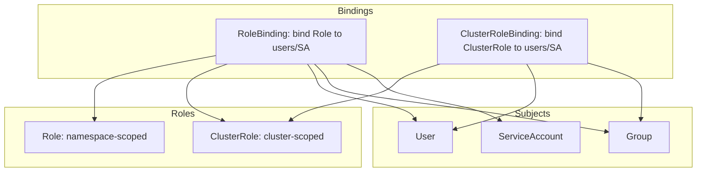

# RBAC and ServiceAccounts

> [!summary] Goal
> Control who can do what in the cluster using Kubernetes Role-Based Access Control — Roles, ClusterRoles, RoleBindings, ServiceAccounts, and `kubectl auth`.

## Table of Contents

1. [Why RBAC Matters](#why-rbac-matters)
2. [RBAC Resources](#rbac-resources)
3. [Role and ClusterRole](#role-and-clusterrole)
4. [RoleBinding and ClusterRoleBinding](#rolebinding-and-clusterrolebinding)
5. [ServiceAccount](#serviceaccount)
6. [Checking Permissions](#checking-permissions)
7. [RBAC Best Practices](#rbac-best-practices)
8. [Pitfalls](#pitfalls)

---

## Why RBAC Matters

Without RBAC, every user and service account has full access to the cluster — a security risk for multi-team environments.



---

## RBAC Resources



| Resource | Scope | Bind to | Grants access to |
|----------|-------|---------|-----------------|
| **Role** | Namespace | RoleBinding | Resources in that namespace |
| **ClusterRole** | Cluster | RoleBinding or ClusterRoleBinding | Cluster-wide resources or namespaced resources in any namespace |
| **RoleBinding** | Namespace | Users, Groups, SAs | Permissions from the referenced Role/ClusterRole |
| **ClusterRoleBinding** | Cluster | Users, Groups, SAs | Permissions from the referenced ClusterRole |

---

## Role and ClusterRole

### Role — namespace-scoped

```yaml
apiVersion: rbac.authorization.k8s.io/v1
kind: Role
metadata:
  name: pod-reader
  namespace: production
rules:
  - apiGroups: [""]           # Core API group
    resources: ["pods"]        # Pod resources
    verbs: ["get", "list", "watch"]  # Allowed actions
  - apiGroups: ["apps"]
    resources: ["deployments"]
    verbs: ["get", "list"]
```

### ClusterRole — cluster-scoped

```yaml
apiVersion: rbac.authorization.k8s.io/v1
kind: ClusterRole
metadata:
  name: cluster-admin
rules:
  - apiGroups: ["*"]
    resources: ["*"]
    verbs: ["*"]
---
# Can also grant access to namespaced resources across ALL namespaces
apiVersion: rbac.authorization.k8s.io/v1
kind: ClusterRole
metadata:
  name: global-pod-reader
rules:
  - apiGroups: [""]
    resources: ["pods"]
    verbs: ["get", "list", "watch"]
```

### RBAC verbs

| Verb | Description |
|------|-------------|
| `get` | Read a single resource |
| `list` | List resources (collection) |
| `watch` | Watch for changes |
| `create` | Create a new resource |
| `update` | Update an existing resource |
| `patch` | Partially update a resource |
| `delete` | Delete a single resource |
| `deletecollection` | Delete a collection |

---

## RoleBinding and ClusterRoleBinding

### RoleBinding — bind Role to user in a namespace

```yaml
apiVersion: rbac.authorization.k8s.io/v1
kind: RoleBinding
metadata:
  name: read-pods
  namespace: production
subjects:
  - kind: User
    name: alice@example.com
    apiGroup: rbac.authorization.k8s.io
  - kind: ServiceAccount
    name: my-sa
    namespace: production
roleRef:
  kind: Role
  name: pod-reader
  apiGroup: rbac.authorization.k8s.io
```

### ClusterRoleBinding — bind ClusterRole cluster-wide

```yaml
apiVersion: rbac.authorization.k8s.io/v1
kind: ClusterRoleBinding
metadata:
  name: cluster-admins
subjects:
  - kind: User
    name: admin@example.com
    apiGroup: rbac.authorization.k8s.io
roleRef:
  kind: ClusterRole
  name: cluster-admin
  apiGroup: rbac.authorization.k8s.io
```

### Binding a ClusterRole to a namespace via RoleBinding

```yaml
# This gives the subject the pod-reader permissions ONLY in the production namespace
apiVersion: rbac.authorization.k8s.io/v1
kind: RoleBinding
metadata:
  name: limited-pod-reader
  namespace: production
subjects:
  - kind: User
    name: dev-user
    apiGroup: rbac.authorization.k8s.io
roleRef:
  kind: ClusterRole
  name: pod-reader
  apiGroup: rbac.authorization.k8s.io
```

---

## ServiceAccount

ServiceAccounts provide identity for pods, not humans.

```bash
kubectl create serviceaccount my-app-sa
kubectl get serviceaccounts
kubectl describe sa my-app-sa
```

```yaml
apiVersion: v1
kind: ServiceAccount
metadata:
  name: my-app-sa
automountServiceAccountToken: false  # Don't mount token by default
---
apiVersion: v1
kind: Pod
metadata:
  name: my-app
spec:
  serviceAccountName: my-app-sa
  automountServiceAccountToken: true
  containers:
    - name: app
      image: my-app
```

### Pod identity with ServiceAccount

```yaml
# ServiceAccount for a pod that needs to list pods via API
apiVersion: v1
kind: ServiceAccount
metadata:
  name: pod-lister
---
apiVersion: rbac.authorization.k8s.io/v1
kind: Role
metadata:
  name: pod-lister-role
rules:
  - apiGroups: [""]
    resources: ["pods"]
    verbs: ["get", "list"]
---
apiVersion: rbac.authorization.k8s.io/v1
kind: RoleBinding
metadata:
  name: pod-lister-binding
subjects:
  - kind: ServiceAccount
    name: pod-lister
roleRef:
  kind: Role
  name: pod-lister-role
  apiGroup: rbac.authorization.k8s.io
---
apiVersion: v1
kind: Pod
metadata:
  name: pod-lister
spec:
  serviceAccountName: pod-lister
  containers:
    - name: app
      image: curlimages/curl
      command: ["sh", "-c", "curl -s -H \"Authorization: Bearer $(cat /var/run/secrets/kubernetes.io/serviceaccount/token)\" https://kubernetes.default.svc/api/v1/namespaces/default/pods --insecure"]
```

---

## Checking Permissions

```bash
# Check what the current user can do
kubectl auth can-i create deployments
kubectl auth can-i list pods --all-namespaces

# Check what another user can do
kubectl auth can-i get pods --as=alice@example.com
kubectl auth can-i delete pods --as=system:serviceaccount:default:my-sa

# List all permissions for the current user
kubectl auth can-i --list

# Check if a specific ServiceAccount has access
kubectl auth can-i create pods --as=system:serviceaccount:default:pod-lister
```

---

## RBAC Best Practices

- [ ] Use RoleBindings with Roles (namespace-scoped) unless the permission must be cluster-wide
- [ ] Grant the minimum verbs required — `get, list, watch` not `*`
- [ ] Use `automountServiceAccountToken: false` on ServiceAccounts that don't need API access
- [ ] Never bind `cluster-admin` to a user or SA unless absolutely necessary
- [ ] Use Groups for team-level access management (tied to OIDC or LDAP)
- [ ] Regularly audit permissions with `kubectl auth can-i --list` and third-party tools (kubescape, kube-bench)
- [ ] Configure audit logging for RBAC changes

---

## Pitfalls

### Default ServiceAccount has no permissions

The default ServiceAccount in each namespace has no RBAC permissions (K8s 1.24+). Pods using the default SA can't access the API.

**Fix**: Create explicit ServiceAccounts and bind them to Roles.

### ClusterRoleBinding gives access to ALL namespaces

A ClusterRoleBinding binds a ClusterRole across every namespace. A RoleBinding binding the same ClusterRole only gives access to that one namespace.

**Fix**: Use a RoleBinding + ClusterRole for namespace-scoped permissions. Use ClusterRoleBinding only for truly cluster-wide permissions.

### API group must match

```yaml
# This won't work:
rules:
  - apiGroups: [""]
    resources: ["deployments"]  # deployments are in "apps" group, not core ""
```

**Fix**: `kubectl api-resources` shows the apiGroup for each resource.

---

> [!question]- Interview Questions
>
> **Q: What is the difference between a Role and a ClusterRole?**
> A: A Role grants permissions within a specific namespace. A ClusterRole grants permissions cluster-wide (nodes, namespaces, PVs) or can be bound to a namespace via RoleBinding.
>
> **Q: What is a ServiceAccount and when would you create one?**
> A: A ServiceAccount provides an identity for a pod to authenticate to the API server. Create one when a pod needs to interact with the Kubernetes API (e.g., a custom operator, a CI/CD agent).
>
> **Q: How do you check if a user can create deployments?**
> A: `kubectl auth can-i create deployments --as=<username>`. If the user doesn't have access, the command returns "no".

---

## Cross-Links

- [[CICD/Kubernetes/01_Foundations/03_ConfigMaps_Secrets_and_Volumes]] for secret access via RBAC
- [[CICD/Kubernetes/02_Core/04_Debugging_with_kubectl]] for `kubectl auth can-i` usage
- [[CICD/Kubernetes/04_Playbooks/03_GitOps_with_ArgoCD_and_Flux]] for ArgoCD ServiceAccount permissions

---

## References

- [RBAC Authorization](https://kubernetes.io/docs/reference/access-authn-authz/rbac/)
- [ServiceAccounts](https://kubernetes.io/docs/concepts/security/service-accounts/)
- [kubectl auth](https://kubernetes.io/docs/reference/access-authn-authz/authentication/)
