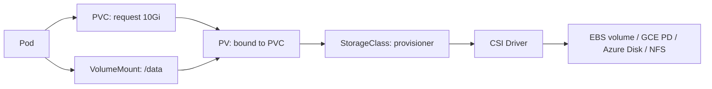
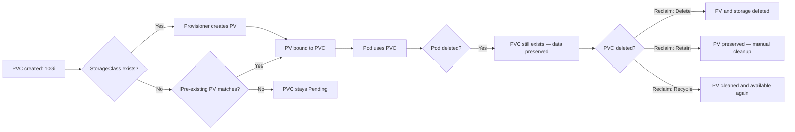
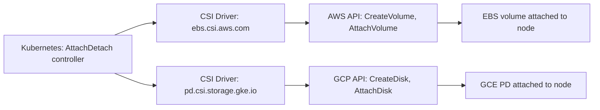

# Storage: PV, PVC, StorageClass, and StatefulSet Integration

> [!summary] Goal
> Provision and manage persistent storage in Kubernetes — understand PV/PVC lifecycle, StorageClass provisioners, CSI drivers, and integration with StatefulSets.

## Table of Contents

1. [Why Storage Matters](#why-storage-matters)
2. [PV, PVC, and StorageClass Concepts](#pv-pvc-and-storageclass-concepts)
3. [PVC Lifecycle](#pvc-lifecycle)
4. [StorageClass Provisioners](#storageclass-provisioners)
5. [StatefulSet with volumeClaimTemplates](#statefulset-with-volumeclaimtemplates)
6. [CSI Drivers](#csi-drivers)
7. [Storage Comparison](#storage-comparison)
8. [Pitfalls](#pitfalls)

---

## Why Storage Matters

Pods are ephemeral — their filesystem dies with them. Persistent storage survives pod restarts and can be shared across pods, nodes, and even Availability Zones.



---

## PV, PVC, and StorageClass Concepts

```yaml
# StorageClass — defines how storage is provisioned
apiVersion: storage.k8s.io/v1
kind: StorageClass
metadata:
  name: fast
provisioner: ebs.csi.aws.com        # CSI driver
parameters:
  type: gp3
  fsType: ext4
  iopsPerGB: "10"
allowVolumeExpansion: true
reclaimPolicy: Retain
volumeBindingMode: WaitForFirstConsumer  # Create PV only when pod is scheduled
---
# PersistentVolumeClaim — requests storage
apiVersion: v1
kind: PersistentVolumeClaim
metadata:
  name: data-claim
spec:
  accessModes:
    - ReadWriteOnce
  resources:
    requests:
      storage: 10Gi
  storageClassName: fast
---
# PersistentVolume — created automatically by the provisioner for the PVC
# (You typically don't create PVs manually — the StorageClass creates them)
```

| Resource | Purpose | Created by |
|----------|---------|------------|
| **StorageClass** | Defines how storage is provisioned (CSI driver, parameters, reclaim policy) | Admin |
| **PersistentVolumeClaim (PVC)** | User's request for storage (size, access mode) | User |
| **PersistentVolume (PV)** | The actual storage volume (EBS, GCE PD, NFS) | StorageClass provisioner |

---

## PVC Lifecycle



### Access modes

| Mode | Description | Use case |
|------|-------------|----------|
| **ReadWriteOnce (RWO)** | Single node read-write | Most common — databases |
| **ReadOnlyMany (ROX)** | Many nodes read-only | Shared config, static data |
| **ReadWriteMany (RWX)** | Many nodes read-write | Shared filesystem, NFS |
| **ReadWriteOncePod (RWOP)** | Single pod read-write | Strict single-writer |

---

## StorageClass Provisioners

| Cloud | Provisioner | Example parameters |
|-------|-------------|-------------------|
| **AWS** | `ebs.csi.aws.com` | `type: gp3, iops: 3000` |
| **AWS** | `efs.csi.aws.com` | RWX support, `performanceMode: generalPurpose` |
| **GCP** | `pd.csi.storage.gke.io` | `type: pd-balanced, replication-type: none` |
| **Azure** | `disk.csi.azure.com` | `skuname: Premium_LRS` |
| **Azure** | `file.csi.azure.com` | RWX support |
| **NFS** | `nfs.csi.k8s.io` | `server: nfs.example.com, share: /export` |
| **Rook/Ceph** | `rook-ceph.rbd.csi.ceph.com` | `clusterID: rook-ceph, pool: replicapool` |

### Example AWS EBS StorageClass

```yaml
apiVersion: storage.k8s.io/v1
kind: StorageClass
metadata:
  name: gp3
provisioner: ebs.csi.aws.com
parameters:
  type: gp3
  fsType: ext4
  encrypted: "true"
allowVolumeExpansion: true
reclaimPolicy: Delete
volumeBindingMode: WaitForFirstConsumer
```

---

## StatefulSet with volumeClaimTemplates

StatefulSets can create a unique PVC for each replica automatically:

```yaml
apiVersion: apps/v1
kind: StatefulSet
metadata:
  name: postgres
spec:
  serviceName: postgres
  replicas: 3
  selector:
    matchLabels:
      app: postgres
  template:
    metadata:
      labels:
        app: postgres
    spec:
      containers:
        - name: postgres
          image: postgres:16-alpine
          volumeMounts:
            - name: data
              mountPath: /var/lib/postgresql/data
  volumeClaimTemplates:
    - metadata:
        name: data
      spec:
        accessModes: ["ReadWriteOnce"]
        resources:
          requests:
            storage: 50Gi
        storageClassName: gp3
```

This creates:
```
PVC: data-postgres-0  →  PV vol-abc  →  50GB gp3 volume
PVC: data-postgres-1  →  PV vol-def  →  50GB gp3 volume
PVC: data-postgres-2  →  PV vol-ghi  →  50GB gp3 volume
```

---

## CSI Drivers

The Container Storage Interface (CSI) is the standard for storage plugins in Kubernetes.

```bash
# Check which CSI drivers are installed
kubectl get csidrivers

# AWS EBS CSI driver
kubectl get pods -n kube-system -l app=ebs-csi-controller
```



| Driver | Features | When to use |
|--------|----------|-------------|
| **aws-ebs-csi-driver** | EBS volumes, snapshots, encryption, IOPS tuning | AWS EKS, self-managed on AWS |
| **aws-efs-csi-driver** | EFS (RWX), NFS-based | Shared storage across AZs |
| **gcp-compute-persistent-disk-csi-driver** | PD volumes, snapshots, regional PD | GKE |
| **azure-disk-csi-driver** | Azure Disk, snapshots | AKS |
| **azure-file-csi-driver** | Azure Files (RWX) | Shared storage |
| **nfs-csi-driver** | NFS exports | On-prem, existing NAS |

---

## Storage Comparison

| Aspect | Deployment + PVC | StatefulSet + volumeClaimTemplate | emptyDir | hostPath |
|--------|-----------------|----------------------------------|----------|----------|
| Persistence | Survives pod restart | Survives pod restart | Lost on pod delete | Survives pod delete |
| Isolation | Per-pod with separate PVC | Per-replica with separate PVC | Shared within pod | Shared on node |
| Scaling | Manual PVC per new pod | Automatic PVC per new replica | Automatic | Automatic |
| Use case | Single-instance DB | Clustered DB, message queue | Cache, scratch | Node-level agents (DaemonSet) |

---

## Pitfalls

### PVC stuck in Pending

The PV hasn't been provisioned yet. Common causes: no StorageClass exists, CSI driver not installed, or cloud provider quota exceeded.

```bash
kubectl describe pvc <name>
# Events: waiting for first consumer to be created before binding
```

**Fix**: Check `kubectl get storageclass`, ensure CSI driver pods are running, check cloud provider limits.

### StatefulSet PVC not deleted on scale-down

When you scale down a StatefulSet, the pods are deleted but the PVCs remain. The data is preserved.

**Fix**: Delete PVCs manually after verifying data is backed up: `kubectl delete pvc data-postgres-2`.

### Upgrading a CSI driver breaks existing volumes

If the CSI driver is upgraded incompatibly, existing PVs might not attach.

**Fix**: Always back up critical PV data before upgrading CSI drivers. Follow the driver's upgrade guide.

---

> [!question]- Interview Questions
>
> **Q: What is the difference between a PV and a PVC?**
> A: A PersistentVolume (PV) is the actual storage resource (EBS volume, NFS share). A PersistentVolumeClaim (PVC) is a request for storage. The PVC binds to a PV that matches its requirements.
>
> **Q: What are the three reclaim policies for PVs?**
> A: `Retain` (PV preserved after PVC is deleted — manual cleanup), `Delete` (PV and storage deleted), `Recycle` (PV scrubbed and available for reuse).
>
> **Q: How does a StatefulSet use volumeClaimTemplates?**
> A: Each replica gets its own PVC created from the template. Pod `postgres-0` gets PVC `data-postgres-0`. This ensures each instance has its own persistent storage with a stable mapping.
>
> **Q: What is the Container Storage Interface (CSI)?**
> A: A standard API for storage plugins. Any storage vendor implementing CSI works with any CSI-capable container orchestrator (Kubernetes, Mesos, Nomad).

---

## Cross-Links

- [[CICD/Kubernetes/02_Core/05_Workload_Types_StatefulSet_DaemonSet_Job_CronJob]] for StatefulSet storage
- [[CICD/Kubernetes/01_Foundations/03_ConfigMaps_Secrets_and_Volumes]] for volume types
- [[CICD/Kubernetes/05_Projects/01_Deploy_a_Service_With_HPA_and_Ingress]] for practical volume usage

---

## References

- [Persistent Volumes](https://kubernetes.io/docs/concepts/storage/persistent-volumes/)
- [Storage Classes](https://kubernetes.io/docs/concepts/storage/storage-classes/)
- [CSI Drivers](https://kubernetes.io/docs/concepts/storage/volumes/#csi)
- [StatefulSet Storage](https://kubernetes.io/docs/concepts/workloads/controllers/statefulset/#storage)
