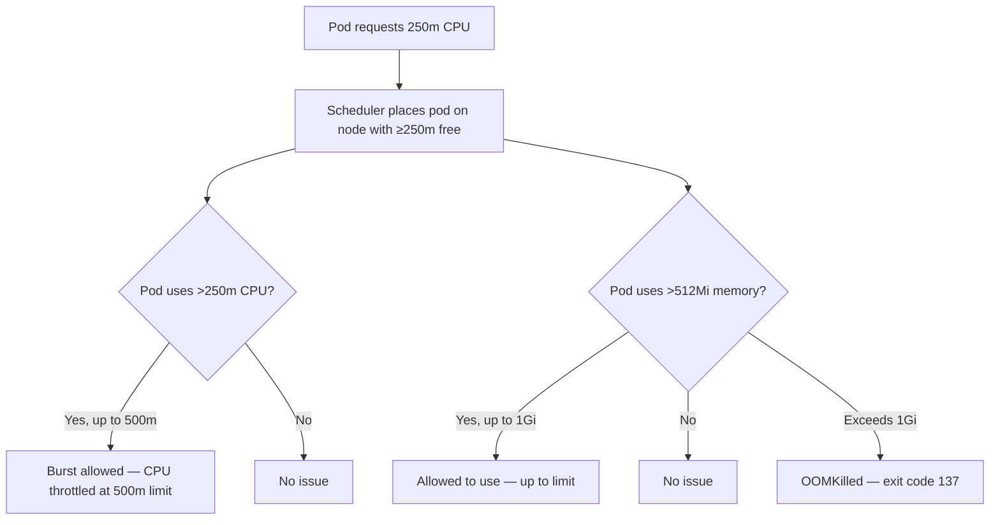
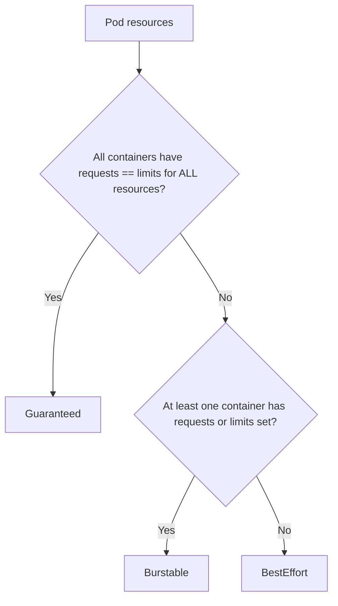

# Resource Requests, Limits, and QoS Deep Dive

> [!summary] Goal
> Prevent noisy neighbor issues, understand why pods get OOMKilled or throttled, and configure resource quotas and limit ranges effectively.

## Table of Contents

1. [Why Resource Management Matters](#why-resource-management-matters)
2. [Requests vs Limits](#requests-vs-limits)
3. [CPU and Memory Units](#cpu-and-memory-units)
4. [QoS Classes](#qos-classes)
5. [ResourceQuota and LimitRange](#resourcequota-and-limitrange)
6. [Pod Eviction Ordering](#pod-eviction-ordering)
7. [Pitfalls](#pitfalls)

---

## Why Resource Management Matters

Without requests, the scheduler has no data to make placement decisions — pods get packed into overloaded nodes. Without limits, one pod can starve all others on the same node.

---

## Requests vs Limits

```yaml
containers:
  - name: app
    resources:
      requests:     # Guaranteed — scheduler ensures this is available
        cpu: 250m
        memory: 512Mi
      limits:       # Maximum — cgroup enforces this (throttle or OOM)
        cpu: 500m
        memory: 1Gi
```



| Aspect | Request | Limit |
|--------|---------|-------|
| Purpose | Scheduler guarantee | Cgroup hard cap |
| CPU behavior | Minimum guaranteed | Throttled above limit |
| Memory behavior | Minimum guaranteed | OOMKilled above limit |
| Scheduler uses | Yes (for placement) | No |
| cgroup enforces | No | Yes |

---

## CPU and Memory Units

```yaml
resources:
  requests:
    cpu: 250m         # 250 millicores = 0.25 CPU
    cpu: 1            # 1 full CPU core
    cpu: 0.5          # 0.5 CPU (same as 500m)
    memory: 128Mi     # 128 Mebibytes (2^20 bytes)
    memory: 1Gi       # 1 Gibibyte
    memory: 512M      # 512 Megabytes (10^6 bytes — rare, prefer Mi/Gi)
```

```bash
kubectl run test --image=nginx \
  --requests='cpu=100m,memory=128Mi' \
  --limits='cpu=500m,memory=256Mi'
```

---

## QoS Classes

Kubernetes assigns every pod a QoS class based on requests and limits:



| QoS Class | Criteria | Eviction priority | Example |
|-----------|----------|-------------------|---------|
| **Guaranteed** | requests == limits for CPU and memory for ALL containers | Lowest (last to evict) | `requests.cpu=500m; limits.cpu=500m; requests.memory=256Mi; limits.memory=256Mi` |
| **Burstable** | At least one request or limit set, not meeting Guaranteed | Medium | `requests.cpu=100m` (no limit) or `requests.memory=128Mi; limits.memory=256Mi` |
| **BestEffort** | No requests, no limits | Highest (first to evict) | No resources block at all |

```yaml
# Guaranteed: requests == limits
apiVersion: v1
kind: Pod
metadata:
  name: guaranteed-pod
spec:
  containers:
    - name: app
      image: nginx
      resources:
        requests:
          cpu: 500m
          memory: 256Mi
        limits:
          cpu: 500m
          memory: 256Mi
---
# Burstable: requests < limits
apiVersion: v1
kind: Pod
metadata:
  name: burstable-pod
spec:
  containers:
    - name: app
      image: nginx
      resources:
        requests:
          cpu: 100m
          memory: 128Mi
        limits:
          cpu: 500m
          memory: 512Mi
---
# BestEffort: no resources at all
apiVersion: v1
kind: Pod
metadata:
  name: best-effort-pod
spec:
  containers:
    - name: app
      image: nginx
```

---

## ResourceQuota and LimitRange

### ResourceQuota — namespace-level limits

```yaml
apiVersion: v1
kind: ResourceQuota
metadata:
  name: dev-quota
  namespace: dev
spec:
  hard:
    requests.cpu: 8
    requests.memory: 16Gi
    limits.cpu: 16
    limits.memory: 32Gi
    pods: 50
    persistentvolumeclaims: 10
    configmaps: 10
---
# Scope: applies to all containers in the namespace
# Exceeding: kubectl returns "exceeded quota" error
```

### LimitRange — default requests/limits per container

```yaml
apiVersion: v1
kind: LimitRange
metadata:
  name: dev-limits
  namespace: dev
spec:
  limits:
    - default:           # Container default limits
        cpu: 500m
        memory: 512Mi
      defaultRequest:   # Container default requests
        cpu: 100m
        memory: 128Mi
      max:              # Container maximum
        cpu: 2
        memory: 4Gi
      min:              # Container minimum
        cpu: 10m
        memory: 32Mi
      type: Container
```

---

## Pod Eviction Ordering

When a node is under pressure (CPU, memory, disk), kubelet evicts pods in this order:

```mermaid
flowchart LR
    A[Node under memory pressure] --> B[Evict BestEffort pods first]
    B --> C[Evict Burstable pods exceeding requests]
    C --> D[Evict Burstable pods within requests]
    D --> E[Evict Guaranteed pods (last resort)]
```

| Node condition | What happens |
|---------------|-------------|
| `NodeMemoryPressure` | Evicts BestEffort → Burstable exceeding requests → Burstable within requests → Guaranteed |
| `NodeDiskPressure` | Evicts pods based on disk usage |
| `NodePIDPressure` | Evicts pods based on PID usage |
| `NodeNetworkUnavailable` | Marks node as network-unavailable, no eviction |

---

## Pitfalls

### CPU limits cause throttling

CPU limits use CFS quotas. A container at its limit gets throttled, even if the node has free CPU.

**Fix**: For latency-sensitive apps, set CPU requests but NOT CPU limits. Memory limits are still recommended.

### Not setting ANY requests or limits

The pod gets BestEffort QoS — first to be evicted under node pressure. It can also consume unbounded resources.

**Fix**: Always set at least `resources.requests`. Use LimitRange to enforce defaults.

### OOMKilled at limit boundary

If a container has `memory.limit=512Mi` and uses 513Mi, it's OOMKilled. There's no throttling for memory — only hard kill.

**Fix**: Monitor actual memory usage with `kubectl top pod`. Set limits at least 20% above peak usage. Use VPA for automatic adjustment.

### ResourceQuota blocks new pods without LimitRange

If a ResourceQuota exists but no LimitRange, pods without resources are rejected because they can't calculate against the quota.

**Fix**: Always create a LimitRange alongside a ResourceQuota in the same namespace.

---

> [!question]- Interview Questions
>
> **Q: What is the difference between requests and limits?**
> A: Requests are what the scheduler guarantees the container will get. Limits are the maximum the container is allowed to use. CPU limits cause throttling. Memory limits cause OOMKill.
>
> **Q: What are the three QoS classes?**
> A: Guaranteed (requests == limits — last to evict), Burstable (partial limits — medium priority), BestEffort (no limits — first to evict).
>
> **Q: How does Kubernetes decide which pod to evict under node pressure?**
> A: BestEffort pods first, then Burstable pods exceeding requests, then Burstable within requests, finally Guaranteed. Within the same class, the pod with higher resource usage relative to request is evicted first.
>
> **Q: What is the purpose of LimitRange?**
> A: It sets default requests/limits for containers that don't specify them, and enforces min/max constraints on individual containers.

---

## Cross-Links

- [[CICD/Kubernetes/02_Core/03_HealthChecks_Resources_and_HPA]] for HPA and resource metrics
- [[CICD/Kubernetes/02_Core/07_Storage_PV_PVC_StorageClass_StatefulSet_Integration]] for storage resource quotas
- [[CICD/Kubernetes/05_Projects/01_Deploy_a_Service_With_HPA_and_Ingress]] for practical resource configuration

---

## References

- [Resource Management](https://kubernetes.io/docs/concepts/configuration/manage-resources-containers/)
- [QoS Classes](https://kubernetes.io/docs/concepts/workloads/pods/pod-qos/)
- [ResourceQuota](https://kubernetes.io/docs/concepts/policy/resource-quotas/)
- [LimitRange](https://kubernetes.io/docs/concepts/policy/limit-range/)
- [Node Pressure Eviction](https://kubernetes.io/docs/concepts/scheduling-eviction/node-pressure-eviction/)
