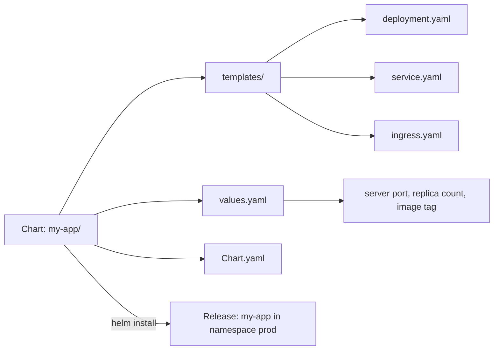
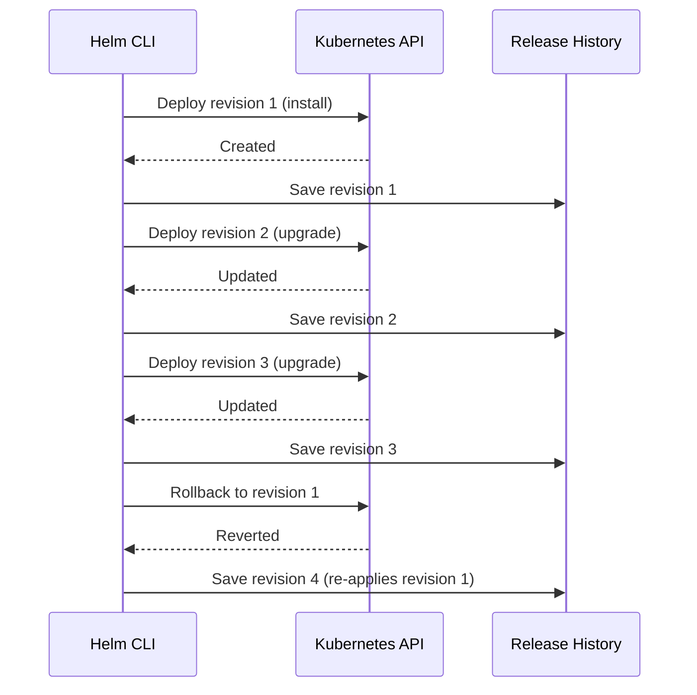

# Helm: Kubernetes Package Management

> [!summary] Goal
> Package, configure, and deploy Kubernetes applications with Helm — using charts, values, templates, and managing releases with install, upgrade, and rollback.

## Table of Contents

1. [Why Helm Matters](#why-helm-matters)
2. [Chart Structure](#chart-structure)
3. [Values and Templates](#values-and-templates)
4. [Helm CLI Commands](#helm-cli-commands)
5. [Managing Releases](#managing-releases)
6. [Helm Repositories](#helm-repositories)
7. [Creating a Chart from Scratch](#creating-a-chart-from-scratch)
8. [Helm vs Kustomize](#helm-vs-kustomize)
9. [Pitfalls](#pitfalls)

---

## Why Helm Matters

Helm is the Kubernetes package manager. A chart packages all YAML manifests + default values into a reusable, configurable unit.



> [!tip] Definition
> **Chart**: a Helm package containing templates and default values. **Release**: a specific instance of a chart deployed into the cluster. `helm install` creates a release. `helm upgrade` modifies it.

---

## Chart Structure

```
my-app/
├── Chart.yaml               # Metadata: name, version, description, dependencies
├── values.yaml              # Default configuration values
├── values.schema.json       # Optional: JSON schema for values validation
├── charts/                  # Dependent charts (subcharts)
│   └── postgres/
├── templates/               # Go template YAML files
│   ├── _helpers.tpl         # Named templates (partials)
│   ├── deployment.yaml
│   ├── service.yaml
│   ├── ingress.yaml
│   ├── hpa.yaml
│   ├── configmap.yaml
│   └── NOTES.txt            # Post-install instructions
└── README.md
```

```yaml
# Chart.yaml
apiVersion: v2
name: my-app
description: A Helm chart for my application
version: 1.0.0
appVersion: "1.0.0"
type: application
dependencies:
  - name: postgresql
    version: "15.5.x"
    repository: https://charts.bitnami.com/bitnami
    condition: postgresql.enabled
```

---

## Values and Templates

### values.yaml (defaults)

```yaml
replicaCount: 3

image:
  repository: nginx
  tag: 1.25-alpine
  pullPolicy: IfNotPresent

service:
  type: ClusterIP
  port: 80

ingress:
  enabled: true
  host: app.example.com
  tls:
    enabled: true
    secretName: app-tls

resources:
  requests:
    cpu: 100m
    memory: 128Mi
  limits:
    cpu: 500m
    memory: 512Mi

config:
  logLevel: info
  apiUrl: http://api:3000
```

### Template (deployment.yaml)

```yaml
{{- $name := include "my-app.name" . }}
{{- $labels := include "my-app.labels" . }}
apiVersion: apps/v1
kind: Deployment
metadata:
  name: {{ $name }}
  labels: {{ $labels | nindent 4 }}
spec:
  replicas: {{ .Values.replicaCount }}
  selector:
    matchLabels:
      app: {{ $name }}
  template:
    metadata:
      labels: {{ $labels | nindent 8 }}
    spec:
      containers:
        - name: {{ .Chart.Name }}
          image: "{{ .Values.image.repository }}:{{ .Values.image.tag }}"
          imagePullPolicy: {{ .Values.image.pullPolicy }}
          ports:
            - containerPort: {{ .Values.service.port }}
          env:
            - name: LOG_LEVEL
              value: {{ .Values.config.logLevel }}
            - name: API_URL
              value: {{ .Values.config.apiUrl }}
          resources: {{ toYaml .Values.resources | nindent 12 }}
```

### _helpers.tpl (named templates)

```yaml
{{- define "my-app.name" -}}
{{ .Chart.Name }}
{{- end -}}

{{- define "my-app.labels" -}}
helm.sh/chart: {{ .Chart.Name }}-{{ .Chart.Version }}
app.kubernetes.io/name: {{ include "my-app.name" . }}
app.kubernetes.io/instance: {{ .Release.Name }}
app.kubernetes.io/version: {{ .Chart.AppVersion | quote }}
app.kubernetes.io/managed-by: {{ .Release.Service }}
{{- end -}}
```

---

## Helm CLI Commands

```bash
# Install
helm repo add bitnami https://charts.bitnami.com/bitnami
helm install my-release bitnami/nginx
helm install my-release ./my-chart
helm install my-release ./my-chart --values prod-values.yaml --set image.tag=v2.0.0

# Upgrade
helm upgrade my-release ./my-chart --values prod-values.yaml
helm upgrade --install my-release ./my-chart   # Install or upgrade

# Rollback
helm rollback my-release 1         # Rollback to revision 1
helm rollback my-release 1 --wait

# List
helm list                        # All releases in current namespace
helm list -A                     # All namespaces
helm status my-release           # Release details
helm history my-release          # All revisions

# Uninstall
helm uninstall my-release

# Template (dry run)
helm template ./my-chart --values prod-values.yaml
helm install my-release ./my-chart --dry-run --debug

# Repo management
helm repo list
helm repo update
helm search repo nginx           # Search repositories
helm show values bitnami/nginx   # Show default values of a published chart
```

---

## Managing Releases

```bash
helm install my-release ./my-app --wait --timeout 10m

# Upgrade with new values
helm upgrade my-release ./my-app \
  --set image.tag=v2.0.0 \
  --set replicaCount=5 \
  --reuse-values           # Keep existing values, override only specified

# Rollback if upgrade fails
helm rollback my-release 1
```



---

## Helm Repositories

```bash
# Add a repository
helm repo add bitnami https://charts.bitnami.com/bitnami
helm repo add prometheus-community https://prometheus-community.github.io/helm-charts
helm repo add ingress-nginx https://kubernetes.github.io/ingress-nginx

# Install from repository
helm install my-nginx bitnami/nginx --values nginx-values.yaml

# Use OCI-based registries (Helm 3.8+)
helm install my-app oci://ghcr.io/org/charts/my-app --version 1.0.0
```

---

## Creating a Chart from Scratch

```bash
# Scaffold a new chart
helm create my-chart
# Creates: Chart.yaml, values.yaml, templates/deployment.yaml, templates/service.yaml, templates/ingress.yaml, templates/hpa.yaml, templates/_helpers.tpl, templates/NOTES.txt

# Create without scaffolding
mkdir custom-chart && cd custom-chart
# Create chart.yaml, values.yaml, and templates/ manually

# Package for distribution
helm package my-chart -d ./packages
helm repo index ./packages --url https://example.com/charts
```

---

## Helm vs Kustomize

| Aspect | Helm | Kustomize |
|--------|------|-----------|
| **Approach** | Templating (Go templates) | Patching (strategic merge, JSON patches) |
| **Learning curve** | Steeper (template syntax) | Gentler (plain YAML) |
| **Configuration** | `values.yaml` + `--set` | `kustomization.yaml` + overlays |
| **Package management** | Charts, repos, versions | No built-in package management |
| **Release management** | Yes (install, upgrade, rollback, history) | No (uses kubectl) |
| **Dependency management** | Yes (subcharts, requirements) | No (YAML including other kustomizations) |
| **Complex logic** | Loops, conditionals, functions | Labels, names, images, patches |
| **Best for** | Published apps, third-party software | Simple projects, organizational standards |

---

## Pitfalls

### Helm 2 Tiller security

Helm 2 had a server-side component (Tiller) with full cluster access. Helm 3 removed Tiller — all operations are client-side.

**Fix**: Use Helm 3. It uses the same RBAC as `kubectl`.

### `helm upgrade` without `--install`

If `helm upgrade my-release ./chart` is run on a non-existent release, it fails.

**Fix**: Always use `helm upgrade --install my-release ./chart` for idempotent runs.

### Values not applied

```bash
helm upgrade my-release ./chart --set image.tag=v2
# But the values.yaml inside the chart has been modified locally!
```

**Fix**: Use `--reuse-values` carefully. Prefer `-f prod-values.yaml` for explicit value files.

### Template debugging

```bash
# First, check template rendering
helm template ./chart --values prod-values.yaml | yq eval
# Then install
helm upgrade --install my-release ./chart --values prod-values.yaml --dry-run
```

---

> [!question]- Interview Questions
>
> **Q: What is the difference between Helm 2 and Helm 3?**
> A: Helm 2 required a server-side component (Tiller) with RBAC issues. Helm 3 removed Tiller — all operations are client-side, using the user's kubeconfig credentials.
>
> **Q: What is a Helm release?**
> A: A specific deployment of a chart in the cluster. Each `helm install` creates a release. Each `helm upgrade` creates a new revision. `helm rollback` reverts to a previous revision.
>
> **Q: How does Helm manage dependencies?**
> A: Helm charts declare dependencies in `Chart.yaml` under `dependencies:`. `helm dependency update` downloads them to the `charts/` directory. Dependencies can be conditionally enabled via values.
>
> **Q: What is the difference between Helm and Kustomize?**
> A: Helm uses Go templates with `values.yaml` for configuration. Kustomize uses plain YAML patching with overlays. Helm includes release management (install/upgrade/rollback). Kustomize generates YAML for direct `kubectl apply`.

---

## Cross-Links

- [[CICD/Kubernetes/03_Advanced/03_Kustomize_Native_Configuration_Management]] for Kustomize comparison
- [[CICD/Kubernetes/04_Playbooks/03_GitOps_with_ArgoCD_and_Flux]] for Helm with GitOps
- [[CICD/Kubernetes/05_Projects/01_Deploy_a_Service_With_HPA_and_Ingress]] for practical Helm usage

---

## References

- [Helm Documentation](https://helm.sh/docs/)
- [Helm Chart Template Guide](https://helm.sh/docs/chart_template_guide/)
- [Helm Commands](https://helm.sh/docs/helm/)
- [Helm Best Practices](https://helm.sh/docs/chart_best_practices/)
