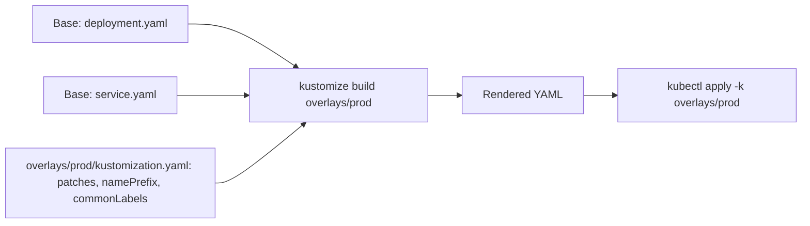

# Kustomize: Native Configuration Management

> [!summary] Goal
> Manage Kubernetes configurations declaratively with Kustomize — using bases, overlays, and patches to customize deployments across environments without templates.

## Table of Contents

1. [Why Kustomize Matters](#why-kustomize-matters)
2. [Directory Structure](#directory-structure)
3. [`kustomization.yaml` Fields](#kustomization-yaml-fields)
4. [Bases and Overlays](#bases-and-overlays)
5. [Common Transformations](#common-transformations)
6. [Patches](#patches)
7. [Kustomize CLI Commands](#kustomize-cli-commands)
8. [Pitfalls](#pitfalls)

---

## Why Kustomize Matters

Kustomize is built into `kubectl` (since 1.14). It lets you customize raw YAML without templates — no Go template syntax, no values files.



---

## Directory Structure

```
app/
├── base/
│   ├── kustomization.yaml
│   ├── deployment.yaml
│   ├── service.yaml
│   └── configmap.yaml
└── overlays/
    ├── dev/
    │   ├── kustomization.yaml
    │   ├── replica-patch.yaml
    │   └── configmap-dev.yaml
    ├── staging/
    │   ├── kustomization.yaml
    │   └── ingress-patch.yaml
    └── prod/
        ├── kustomization.yaml
        ├── resources-patch.yaml
        └── ingress.yaml
```

---

## `kustomization.yaml` Fields

```yaml
# base/kustomization.yaml
apiVersion: kustomize.config.k8s.io/v1beta1
kind: Kustomization

resources:
  - deployment.yaml
  - service.yaml
  - configmap.yaml

commonLabels:
  app: my-app
  managed-by: kustomize

commonAnnotations:
  version: 1.0.0
  environment: base

namePrefix: app-
nameSuffix: -v1

namespace: default

images:
  - name: nginx
    newName: myregistry/nginx
    newTag: 1.25-alpine
```

---

## Bases and Overlays

### Base (shared across environments)

```yaml
# base/deployment.yaml
apiVersion: apps/v1
kind: Deployment
metadata:
  name: my-app           # Rendered as: app-my-app-v1 (with namePrefix + nameSuffix)
spec:
  replicas: 1
  template:
    spec:
      containers:
        - name: nginx
          image: nginx   # Changed by overlays
```

### Dev overlay

```yaml
# overlays/dev/kustomization.yaml
apiVersion: kustomize.config.k8s.io/v1beta1
kind: Kustomization

resources:
  - ../../base

namePrefix: dev-

commonLabels:
  environment: development

patches:
  - path: replica-patch.yaml

configMapGenerator:
  - name: app-config
    behavior: merge
    literals:
      - LOG_LEVEL=debug
```

```yaml
# overlays/dev/replica-patch.yaml
apiVersion: apps/v1
kind: Deployment
metadata:
  name: my-app
spec:
  replicas: 1
```

### Prod overlay

```yaml
# overlays/prod/kustomization.yaml
apiVersion: kustomize.config.k8s.io/v1beta1
kind: Kustomization

resources:
  - ../../base
  - ingress.yaml

namePrefix: prod-

commonLabels:
  environment: production

patches:
  - path: resources-patch.yaml

images:
  - name: nginx
    newTag: 1.25-alpine

replicas:
  - name: my-app
    count: 5
```

---

## Common Transformations

```yaml
# Label all resources
commonLabels:
  team: backend
  environment: production

# Prefix all resource names
namePrefix: cluster1-

# Set namespace on all resources
namespace: production

# Change images
images:
  - name: nginx
    newTag: 1.26-alpine
  - name: postgres
    newName: my-registry/postgres
    newTag: 16-alpine

# Set replicas on all Deployments
replicas:
  - name: my-app
    count: 5

# Add annotations to all resources
commonAnnotations:
  deployed-at: "2026-05-03"
  version: "2.0.0"
```

---

## Patches

### Strategic merge patch

```yaml
# Increase replicas and resources in prod
apiVersion: apps/v1
kind: Deployment
metadata:
  name: my-app
spec:
  replicas: 5
  template:
    spec:
      containers:
        - name: nginx
          resources:
            requests:
              cpu: 500m
              memory: 512Mi
```

### JSON patch (more precise)

```yaml
# patches:
#   - target:
#       kind: Deployment
#       name: my-app
#     patch: |-
apiVersion: kustomize.config.k8s.io/v1beta1
kind: Kustomization
patches:
  - target:
      kind: Deployment
      name: my-app
    patch: |-
      - op: replace
        path: /spec/replicas
        value: 5
      - op: add
        path: /spec/template/spec/containers/0/env
        value:
          - name: LOG_LEVEL
            value: info
```

---

## Kustomize CLI Commands

```bash
# Build and output YAML
kustomize build overlays/prod
kustomize build overlays/dev > rendered.yaml

# Apply directly
kubectl apply -k overlays/prod
kubectl delete -k overlays/prod

# Diff against live cluster
kubectl diff -k overlays/prod

# Edit kustomization.yaml (kubectl built-in)
kubectl edit kustomization overlays/prod

# List resources
kustomize build overlays/prod | yq eval

# Compare overlays
diff <(kustomize build overlays/staging) <(kustomize build overlays/prod)
```

---

## Pitfalls

### `namePrefix` changes Service selectors

Adding a `namePrefix` changes Deployment names but NOT the Service selector — the Service won't find the pods.

**Fix**: Use `commonLabels` instead of `namePrefix` for service selection.

### Patches that don't match

If the patch target doesn't exist in the base, Kustomize returns an error.

**Fix**: Use `kustomize build` to verify the rendered output before applying.

### Secret/ConfigMap from generator

`configMapGenerator` and `secretGenerator` create resources with hashed names. Any change to the content changes the hash — triggering a rollout but also changing the name.

**Fix**: Use `behavior: merge` for updates. Use `namePrefix` to namespace generated resources.

---

> [!question]- Interview Questions
>
> **Q: What is Kustomize?**
> A: A Kubernetes configuration management tool built into kubectl. It customizes raw YAML using bases and overlays — no template syntax, just patching.
>
> **Q: What is the difference between a base and an overlay?**
> A: A base is the shared configuration for all environments. An overlay inherits the base and adds patches, name prefixes, and environment-specific resources.
>
> **Q: What is the difference between a strategic merge patch and a JSON patch?**
> A: Strategic merge patches override specific fields in the base YAML by specifying the resource kind and matching by name. JSON patches target specific paths with operations like replace, add, and remove.

---

## Cross-Links

- [[CICD/Kubernetes/03_Advanced/02_Helm_Package_Management]] for Helm vs Kustomize comparison
- [[CICD/Kubernetes/04_Playbooks/03_GitOps_with_ArgoCD_and_Flux]] for Kustomize with GitOps
- [[CICD/Kubernetes/05_Projects/01_Deploy_a_Service_With_HPA_and_Ingress]] for practical Kustomize usage

---

## References

- [Kustomize](https://kustomize.io/)
- [Kustomize Built-in kubectl](https://kubernetes.io/docs/tasks/manage-kubernetes-objects/kustomization/)
- [Kustomize Configuration](https://kubectl.docs.kubernetes.io/references/kustomize/)
