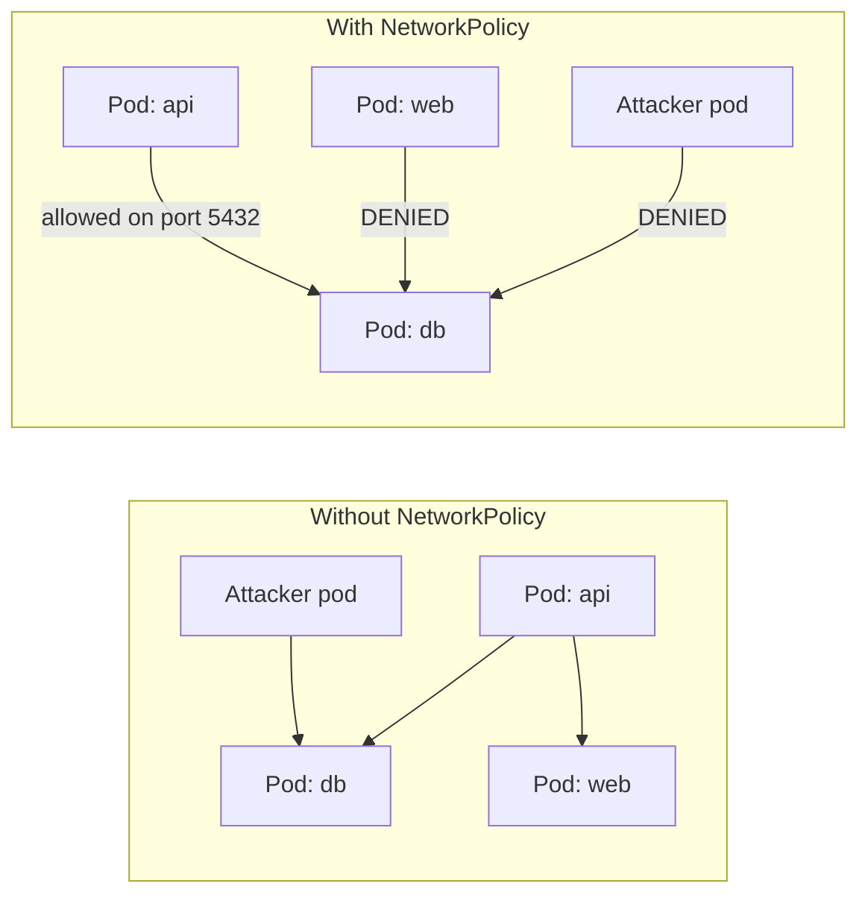

# Network Policies and Pod Security

> [!summary] Goal
> Secure your cluster at the network level with NetworkPolicies and enforce pod security standards with PSS, OPA Gatekeeper, or Kyverno.

## Table of Contents

1. [Why Network Security Matters](#why-network-security-matters)
2. [NetworkPolicy Basics](#networkpolicy-basics)
3. [Default Deny Patterns](#default-deny-patterns)
4. [Common NetworkPolicy Examples](#common-networkpolicy-examples)
5. [Pod Security Standards](#pod-security-standards)
6. [Pod Security Admission](#pod-security-admission)
7. [OPA Gatekeeper and Kyverno](#opa-gatekeeper-and-kyverno)
8. [Pitfalls](#pitfalls)

---

## Why Network Security Matters

By default, ALL pods can communicate with ALL other pods. NetworkPolicies restrict traffic at the IP address level (OSI layer 3/4).



---

## NetworkPolicy Basics

```yaml
apiVersion: networking.k8s.io/v1
kind: NetworkPolicy
metadata:
  name: db-network-policy
  namespace: default
spec:
  podSelector:
    matchLabels:
      app: postgres    # Target pod(s): applies to pods with app=postgres
  policyTypes:
    - Ingress         # Controls inbound traffic to the target pod
    - Egress          # Controls outbound traffic from the target pod
  ingress:
    - from:
        - podSelector:
            matchLabels:
              app: api      # Allow from pods with app=api
        - namespaceSelector:
            matchLabels:
              environment: production  # Allow from namespace with this label
      ports:
        - port: 5432
          protocol: TCP
  egress:
    - to:
        - podSelector:
            matchLabels:
              app: api
      ports:
        - port: 3000
```

| Field | Description |
|-------|-------------|
| `podSelector` | Which pods the policy applies to |
| `policyTypes` | `Ingress`, `Egress`, or both |
| `ingress.from` | Allowed sources by podSelector, namespaceSelector, ipBlock |
| `egress.to` | Allowed destinations |
| `ports` | Allowed ports and protocols |

---

## Default Deny Patterns

```yaml
# Deny ALL ingress traffic (default deny)
apiVersion: networking.k8s.io/v1
kind: NetworkPolicy
metadata:
  name: default-deny-ingress
  namespace: default
spec:
  podSelector: {}          # Applies to ALL pods in the namespace
  policyTypes:
    - Ingress              # No ingress rules → deny all ingress
---
# Deny ALL egress traffic
apiVersion: networking.k8s.io/v1
kind: NetworkPolicy
metadata:
  name: default-deny-egress
  namespace: default
spec:
  podSelector: {}
  policyTypes:
    - Egress               # No egress rules → deny all egress
---
# Allow DNS egress (required if default-deny-egress is applied)
apiVersion: networking.k8s.io/v1
kind: NetworkPolicy
metadata:
  name: allow-dns
  namespace: default
spec:
  podSelector: {}
  policyTypes:
    - Egress
  egress:
    - to:
        - namespaceSelector: {}
      ports:
        - port: 53
          protocol: UDP
        - port: 53
          protocol: TCP
```

---

## Common NetworkPolicy Examples

### Allow API to DB only

```yaml
apiVersion: networking.k8s.io/v1
kind: NetworkPolicy
metadata:
  name: postgres-allow-api-only
  namespace: default
spec:
  podSelector:
    matchLabels:
      app: postgres
  policyTypes:
    - Ingress
  ingress:
    - from:
        - podSelector:
            matchLabels:
              app: api
      ports:
        - port: 5432
```

### Allow ingress from specific namespace

```yaml
apiVersion: networking.k8s.io/v1
kind: NetworkPolicy
metadata:
  name: allow-from-monitoring
  namespace: default
spec:
  podSelector:
    matchLabels:
      app: api
  policyTypes:
    - Ingress
  ingress:
    - from:
        - namespaceSelector:
            matchLabels:
              name: monitoring
      ports:
        - port: 8080
```

### Allow external traffic to web tier

```yaml
apiVersion: networking.k8s.io/v1
kind: NetworkPolicy
metadata:
  name: web-allow-external
  namespace: default
spec:
  podSelector:
    matchLabels:
      app: web
  policyTypes:
    - Ingress
  ingress:
    - from: []       # Empty → allows all sources (including external)
      ports:
        - port: 80
        - port: 443
    - from:
        - ipBlock:
            cidr: 10.0.0.0/8    # Also allow from internal CIDR
```

---

## Pod Security Standards

Pod Security Standards (PSS) define three security levels:

| Level | Description | Example restrictions |
|-------|-------------|---------------------|
| **Privileged** | No restrictions | Run as root, all capabilities, host networking |
| **Baseline** | Minimal restrictions | No privileged containers, no host ports, no hostPID/IPC |
| **Restricted** | Hardened | Read-only root, no `latest` tag, specific seccomp, no `allowPrivilegeEscalation` |

### Pod Security Admission labels

```yaml
apiVersion: v1
kind: Namespace
metadata:
  name: production
  labels:
    pod-security.kubernetes.io/enforce: restricted    # Reject non-compliant pods
    pod-security.kubernetes.io/audit: restricted      # Log violations
    pod-security.kubernetes.io/warn: restricted       # Warn about violations
```

```yaml
# A pod that violates the "restricted" level
apiVersion: v1
kind: Pod
metadata:
  name: bad-pod
  namespace: production                              # Will be rejected!
spec:
  containers:
    - name: app
      image: nginx:latest                            # Restricted: no latest tag
      securityContext:
        privileged: true                             # Restricted: no privileged
```

---

## OPA Gatekeeper and Kyverno

For policy enforcement beyond PSS (custom rules, mutation, validation):

### Kyverno (simpler, K8s-native)

```yaml
apiVersion: kyverno.io/v1
kind: ClusterPolicy
metadata:
  name: require-labels
spec:
  validationFailureAction: Enforce
  rules:
    - name: check-for-labels
      match:
        resources:
          kinds:
            - Pod
      validate:
        message: "Label 'app' is required"
        pattern:
          metadata:
            labels:
              app: "?*"               # Must be non-empty
```

### OPA Gatekeeper (Rego-based, more powerful)

```yaml
apiVersion: templates.gatekeeper.sh/v1
kind: ConstraintTemplate
metadata:
  name: k8srequiredlabels
spec:
  crd:
    spec:
      names:
        kind: K8sRequiredLabels
  targets:
    - target: admission.k8s.gatekeeper.sh
      rego: |
        package k8srequiredlabels
        violation[{"msg": msg}] {
          provided := {label | input.review.object.metadata.labels[label]}
          required := {"app", "environment"}
          missing := required - provided
          count(missing) > 0
          msg := sprintf("Missing labels: %v", [missing])
        }
```

---

## Security Context Deep Dive

> [!info] Security context
> Security context defines privilege and access control settings for a pod or container. It supports: Linux capabilities (add/drop), user/group IDs (`runAsUser`, `runAsGroup`, `fsGroup`), seccomp profiles, AppArmor, SELinux, `readOnlyRootFilesystem`, `allowPrivilegeEscalation`, `procMount`, and fine-grained capability sets.

```yaml
apiVersion: v1
kind: Pod
spec:
  securityContext:                      # Pod-level security context
    runAsUser: 1000                    # All containers run as UID 1000
    runAsGroup: 3000                    # Primary GID 3000
    fsGroup: 2000                      # Volume ownership set to GID 2000
    runAsNonRoot: true                 # Reject if container runs as root
    seccompProfile:
      type: RuntimeDefault             # Use container runtime's default seccomp profile
      # type: Localhost
      # localhostProfile: profiles/my-custom-profile.json
    appArmorProfile:
      # type: RuntimeDefault           # Use runtime's default AppArmor profile
      # type: Localhost
      # localhostProfile: my-app-armor
    supplementalGroups: [4000]         # Additional GIDs for the process
    sysctls:                           # Kernel parameters (must be namespacesafe)
      - name: net.core.somaxconn
        value: "8192"
    seLinuxOptions:
      level: "s0:c123,c456"
  containers:
    - name: app
      securityContext:
        runAsUser: 1001                # Override pod-level — use UID 1001
        capabilities:
          drop: [ALL]                  # Drop ALL kernel capabilities
          add: [NET_BIND_SERVICE]      # Only allow binding to ports < 1024
        readOnlyRootFilesystem: true   # Root filesystem is read-only
        allowPrivilegeEscalation: false # No privilege escalation
        procMount: Default             # procfs mount type (Default or Unmasked)
        privileged: false              # NOT privileged
```

### PodSecurityContext vs Container SecurityContext

| Setting | Pod level | Container level | Scope |
|:--------|:---------:|:---------------:|:------|
| `runAsUser` | ✅ | ✅ (overrides pod) | Per-process UID |
| `runAsGroup` | ✅ | ✅ | GID |
| `fsGroup` | ✅ | ❌ | Volume ownership |
| `supplementalGroups` | ✅ | ❌ | Additional GIDs |
| `seLinuxOptions` | ✅ | ✅ | SELinux label |
| `seccompProfile` | ✅ (K8s 1.19+) | ✅ (K8s 1.25+) | Seccomp filter |
| `appArmorProfile` | ❌ | ✅ (annotation-based) | AppArmor profile |
| `capabilities` | ❌ | ✅ | Linux capabilities |
| `privileged` | ❌ | ✅ | Full host access |
| `readOnlyRootFilesystem` | ❌ | ✅ | Read-only root |
| `allowPrivilegeEscalation` | ❌ | ✅ | No_new_privs |
| `procMount` | ❌ | ✅ | /proc mount mode |

```yaml
# Pod Security Standards (PSS):
#   Privileged:   unrestricted
#   Baseline:     minimal restrictions (allows most workloads)
#   Restricted:   follows pod hardening best practices

# Apply PSS via namespace label:
metadata:
  name: payment-prod
  labels:
    pod-security.kubernetes.io/enforce: restricted   # Enforce (reject if not compliant)
    pod-security.kubernetes.io/enforce-version: v1.28
    pod-security.kubernetes.io/audit: baseline        # Allow but log warnings
    pod-security.kubernetes.io/warn: baseline         # Warn user but still allow
```

---

## Pitfalls

### NetworkPolicy with no CNI support

NetworkPolicies require a CNI plugin that supports them (Calico, Cilium, Weave). Flannel doesn't support NetworkPolicy.

**Fix**: Use Calico or Cilium if you need NetworkPolicy. Check `kubectl get pods -n kube-system | grep calico` or `cilium`.

### Default deny without DNS exception

Applying `default-deny-egress` without allowing DNS (port 53) breaks cluster DNS resolution — pods can't resolve service names.

**Fix**: Always create an `allow-dns` NetworkPolicy before applying default deny egress.

### PSS Restricted breaks many workloads

The `restricted` PSS level prevents using `latest` tag, running as root, and many common patterns. Most workloads need at least `baseline`.

**Fix**: Start with `baseline`. Apply `restricted` only to security-critical pods. Use `audit` and `warn` modes before `enforce`.

---

> [!question]- Interview Questions
>
> **Q: What is the default networking behavior in Kubernetes?**
> A: All pods can communicate with all other pods, regardless of namespace. NetworkPolicies restrict this by defining ingress and egress rules.
>
> **Q: How do you set up a default-deny NetworkPolicy?**
> A: Create a NetworkPolicy with `podSelector: {}`, `policyTypes: [Ingress]` (or Egress), and no rules. This denies all traffic of that type.
>
> **Q: What are the three Pod Security Standards levels?**
> A: Privileged (no restrictions), Baseline (minimal), Restricted (hardened). Enforced via `pod-security.kubernetes.io/enforce` namespace label.
>
> **Q: What is the difference between OPA Gatekeeper and Kyverno?**
> A: Gatekeeper uses Rego language and is more powerful for complex policies. Kyverno uses simplified YAML rules and is K8s-native, easier to write.

---

## Cross-Links

- [[CICD/Kubernetes/03_Advanced/05_Scheduling_Affinity_Taints_Tolerations]] for pod placement restrictions
- [[CICD/Kubernetes/01_Foundations/02_Labels_Selectors_and_Namespaces]] for namespace labeling
- [[CICD/Kubernetes/02_Core/06_RBAC_and_ServiceAccounts]] for access control

---

## References

- [Network Policies](https://kubernetes.io/docs/concepts/services-networking/network-policies/)
- [Pod Security Standards](https://kubernetes.io/docs/concepts/security/pod-security-standards/)
- [Pod Security Admission](https://kubernetes.io/docs/setup/best-practices/enforcing-pod-security-standards/)
- [Kyverno](https://kyverno.io/docs/)
- [OPA Gatekeeper](https://open-policy-agent.github.io/gatekeeper/website/docs/)
