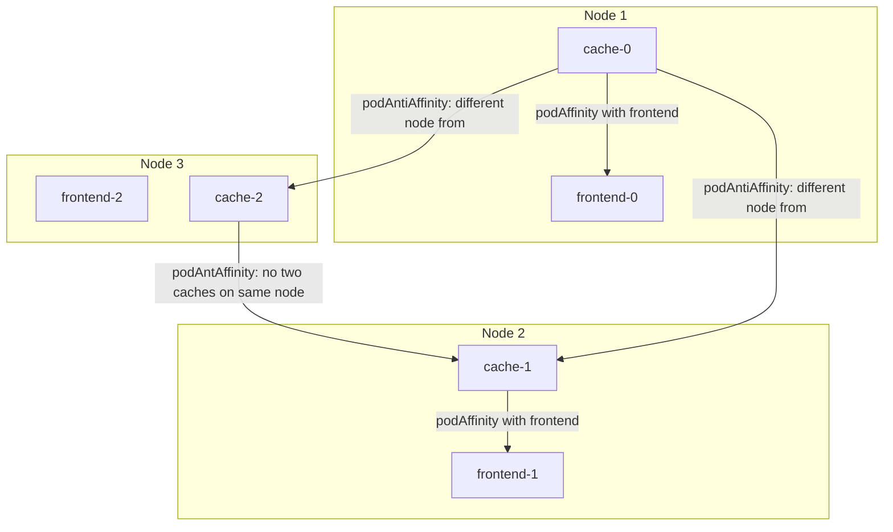
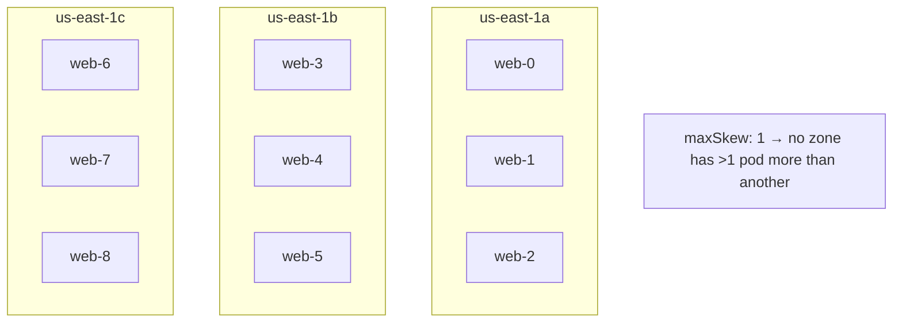
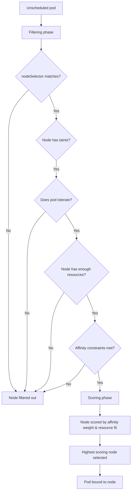

# Scheduling: Affinity, Taints, Tolerations, and Topology Spread

> [!summary] Goal
> Control exactly where pods run — use nodeSelector, affinity/anti-affinity, taints/tolerations, and topology spread constraints for optimal placement.

## Table of Contents

1. [Why Scheduling Control Matters](#why-scheduling-control-matters)
2. [nodeSelector](#nodeselector)
3. [Node Affinity](#node-affinity)
4. [Pod Affinity and Anti-Affinity](#pod-affinity-and-anti-affinity)
5. [Taints and Tolerations](#taints-and-tolerations)
6. [Topology Spread Constraints](#topology-spread-constraints)
7. [Scheduling Decision Flow](#scheduling-decision-flow)
8. [Pitfalls](#pitfalls)

---

## Why Scheduling Control Matters

You may need to run pods on specific nodes (GPU, SSD), colocate related services, spread pods across failure zones, or reserve nodes for critical workloads.

---

## nodeSelector

The simplest scheduling constraint:

```yaml
apiVersion: v1
kind: Pod
metadata:
  name: gpu-pod
spec:
  nodeSelector:
    gpu: nvidia-tesla-v100    # Node must have this label
  containers:
    - name: cuda
      image: nvidia/cuda:12.0
```

```bash
# Label a node
kubectl label node worker-2 gpu=nvidia-tesla-v100
```

---

## Node Affinity

More expressive than `nodeSelector` — supports required (hard) and preferred (soft) rules.

```yaml
apiVersion: v1
kind: Pod
metadata:
  name: affinity-pod
spec:
  affinity:
    nodeAffinity:
      requiredDuringSchedulingIgnoredDuringExecution:
        nodeSelectorTerms:
          - matchExpressions:
              - key: topology.kubernetes.io/zone
                operator: In
                values:
                  - us-east-1a
                  - us-east-1b
      preferredDuringSchedulingIgnoredDuringExecution:
        - weight: 50
          preference:
            matchExpressions:
              - key: instance-type
                operator: In
                values:
                  - m5.large
        - weight: 30
          preference:
            matchExpressions:
              - key: disk-type
                operator: In
                values:
                  - ssd
  containers:
    - name: app
      image: nginx
```

| Node affinity type | Behavior |
|-------------------|----------|
| `requiredDuringSchedulingIgnoredDuringExecution` | Pod must be placed on matching node. If no node matches, pod stays Pending |
| `preferredDuringSchedulingIgnoredDuringExecution` | Try to match but schedule elsewhere if no match. Weight 1-100 determines priority |
| `requiredDuringSchedulingRequiredDuringExecution` | (Future) Evict if node label changes |

### Operators

| Operator | Behavior |
|----------|----------|
| `In` | Value must be in the set |
| `NotIn` | Value must not be in the set |
| `Exists` | Label key must exist (any value) |
| `DoesNotExist` | Label key must not exist |
| `Gt` | Value must be greater than (numeric) |
| `Lt` | Value must be less than (numeric) |

---

## Pod Affinity and Anti-Affinity

Colocate or spread pods relative to other pods — not nodes.

```yaml
apiVersion: apps/v1
kind: Deployment
metadata:
  name: cache
spec:
  replicas: 3
  selector:
    matchLabels:
      app: cache
  template:
    metadata:
      labels:
        app: cache
    spec:
      affinity:
        # Colocate cache pods with frontend pods (same node)
        podAffinity:
          requiredDuringSchedulingIgnoredDuringExecution:
            - labelSelector:
                matchExpressions:
                  - key: app
                    operator: In
                    values:
                      - frontend
              topologyKey: kubernetes.io/hostname

        # Spread cache pods across different nodes (no two on same node)
        podAntiAffinity:
          preferredDuringSchedulingIgnoredDuringExecution:
            - weight: 100
              podAffinityTerm:
                labelSelector:
                  matchExpressions:
                    - key: app
                      operator: In
                      values:
                        - cache
                topologyKey: kubernetes.io/hostname
```



| Pod affinity type | Behavior |
|-------------------|----------|
| `podAffinity` | Pod should run on a node where another pod matching the label selector runs |
| `podAntiAffinity` | Pod should NOT run on a node where another pod matching runs |
| `topologyKey` | The scope of the check: `kubernetes.io/hostname` (node-level), `topology.kubernetes.io/zone` (AZ-level), `topology.kubernetes.io/region` |

---

## Taints and Tolerations

Taints repel pods from nodes. Tolerations allow pods to be scheduled on tainted nodes.

```bash
# Add a taint to a node
kubectl taint nodes worker-2 gpu=true:NoSchedule
kubectl taint nodes worker-2 gpu=true:NoExecute

# Remove a taint
kubectl taint nodes worker-2 gpu=true:NoSchedule-
```

```yaml
# Pod that tolerates the taint
apiVersion: v1
kind: Pod
metadata:
  name: gpu-pod
spec:
  tolerations:
    - key: gpu
      operator: Equal
      value: "true"
      effect: NoSchedule
    - key: gpu
      operator: Exists
      effect: NoExecute
      tolerationSeconds: 3600   # Evict other pods after 1 hour
  containers:
    - name: cuda
      image: nvidia/cuda:12.0
```

| Effect | Behavior |
|--------|----------|
| `NoSchedule` | Pods that don't tolerate the taint won't be scheduled on this node |
| `PreferNoSchedule` | Try not to schedule non-tolerating pods on this node (soft) |
| `NoExecute` | Pods already running are evicted; new pods must tolerate |

### Common use cases

```bash
# Dedicate nodes to specific workloads
kubectl taint nodes compute-pool dedicated=compute:NoSchedule
# Then add toleration to compute pods

# Reserve control plane from workloads (kubeadm does this automatically)
kubectl taint nodes master node-role.kubernetes.io/master:NoSchedule

// Node with special hardware (GPU)
kubectl taint nodes gpu-pool gpu=present:NoSchedule
```

---

## Topology Spread Constraints

Spread pods evenly across failure domains (nodes, zones, regions):

```yaml
apiVersion: apps/v1
kind: Deployment
metadata:
  name: web
spec:
  replicas: 9
  template:
    spec:
      topologySpreadConstraints:
        - maxSkew: 1                          # Max 1 pod difference between zones
          topologyKey: topology.kubernetes.io/zone
          whenUnsatisfiable: DoNotSchedule     # Schedule nothing if constraint can't be met
          labelSelector:
            matchLabels:
              app: web
        - maxSkew: 1
          topologyKey: kubernetes.io/hostname
          whenUnsatisfiable: ScheduleAnyway    # Try but schedule even if can't spread
          labelSelector:
            matchLabels:
              app: web
```



| Field | Description |
|-------|-------------|
| `maxSkew` | Maximum difference in pod count between any two topology domains |
| `topologyKey` | The topology domain (hostname, zone, region) |
| `whenUnsatisfiable` | `DoNotSchedule` (block) or `ScheduleAnyway` (best effort) |
| `labelSelector` | Which pods to count for skew calculation |

---

## Scheduling Decision Flow



---

---

## Priority Classes and Preemption

> [!info] PriorityClass
> PriorityClass controls pod scheduling priority. Higher priority pods are scheduled before lower priority ones. If the scheduler cannot find capacity, it may **preempt** (evict) lower-priority pods to make room. Use for: critical system components, production services, batch workloads.

```yaml
apiVersion: scheduling.k8s.io/v1
kind: PriorityClass
metadata:
  name: production-critical
value: 10000
globalDefault: false
description: "Production application pods — high priority"
preemptionPolicy: PreemptLowerPriority   # Evict lower-priority pods (default)
---
apiVersion: v1
kind: Pod
metadata:
  name: payment-api
spec:
  priorityClassName: production-critical
  containers:
    - name: app
      image: payment:latest

# Preemption behavior:
#   - High priority pod arrives → no capacity.
#   - Scheduler evicts low-priority pods (respecting PDBs).
#   - Low-priority pods requeue.
#   - High priority pod runs.

# Pod priority + QoS class
#   - Guaranteed + high priority = most likely to survive node pressure.
#   - BestEffort + low priority = first evicted.
```

### Descheduler strategies

> [!info] Descheduler
> The Descheduler evicts pods that are not optimally placed. It runs as a CronJob or Deployment. It evicts pods (subject to PDBs and priority), and the scheduler re-places them on better nodes.

```yaml
# Descheduler strategies:
#   RemoveDuplicates                    → Same replicas of a RS/Deployment on same node → evict one
#   LowNodeUtilization                  → Nodes below threshold (e.g., 20% CPU) → evict pods
#   RemovePodsViolatingInterPodAntiAffinity → Evict pods violating anti-affinity constraints
#   RemovePodsViolatingNodeAffinity     → Node labels changed → evict pods
#   RemovePodsViolatingTopologySpreadConstraint → Violating topology spread → evict
#   PodLifeTime                         → Pods older than max pod lifetime → evict
```

---

## Pitfalls

### Anti-affinity with low replicas

If you have 3 replicas and want to spread across 3 nodes but only have 2 nodes, the 3rd pod stays Pending with `whenUnsatisfiable: DoNotSchedule`.

**Fix**: Use `preferredDuringSchedulingIgnoredDuringExecution` for podAntiAffinity, or use `whenUnsatisfiable: ScheduleAnyway`.

### Taints without tolerations

New pods won't be scheduled on tainted nodes unless they have matching tolerations — including daemonsets (unless they have tolerations).

**Fix**: DaemonSets can be scheduled with `tolerations` in the pod template. Critical add-ons should tolerate control plane taints.

### `podAffinity` with `topologyKey: kubernetes.io/hostname`

This restricts pods to the exact same node. If the target pod moves (node failure), the affinity cannot be satisfied.

**Fix**: Use a broader `topologyKey` (`zone`) or use `preferredDuringScheduling`.

---

> [!question]- Interview Questions
>
> **Q: What is the difference between nodeSelector and nodeAffinity?**
> A: nodeSelector does simple label matching (must match all). nodeAffinity supports complex expressions (In, NotIn, Exists) and both required (hard) and preferred (soft) rules.
>
> **Q: What is the difference between a taint and a toleration?**
> A: Taints are applied to nodes to repel pods. Tolerations are applied to pods to allow scheduling on tainted nodes. A pod without the matching toleration cannot schedule on a tainted node (NoSchedule).
>
> **Q: What are topology spread constraints used for?**
> A: Spreading pods evenly across failure domains (nodes, zones, regions) to improve availability. `maxSkew` controls how unbalanced the distribution can be.
>
> **Q: What is the difference between podAffinity and podAntiAffinity?**
> A: podAffinity places pods near each other (colocation). podAntiAffinity keeps pods apart (for high availability).

---

## Cross-Links

- [[CICD/Kubernetes/02_Core/05_Workload_Types_StatefulSet_DaemonSet_Job_CronJob]] for DaemonSet scheduling
- [[CICD/Kubernetes/03_Advanced/01_Resource_Requests_Limits_and_QoS_Deep_Dive]] for resource-based scheduling
- [[CICD/Kubernetes/04_Playbooks/04_Monitoring_and_Observability_with_Prometheus]] for node metrics

---

## References

- [Node Affinity](https://kubernetes.io/docs/concepts/scheduling-eviction/assign-pod-node/#node-affinity)
- [Pod Affinity/Anti-Affinity](https://kubernetes.io/docs/concepts/scheduling-eviction/assign-pod-node/#inter-pod-affinity-and-anti-affinity)
- [Taints and Tolerations](https://kubernetes.io/docs/concepts/scheduling-eviction/taint-and-toleration/)
- [Topology Spread Constraints](https://kubernetes.io/docs/concepts/scheduling-eviction/topology-spread-constraints/)
