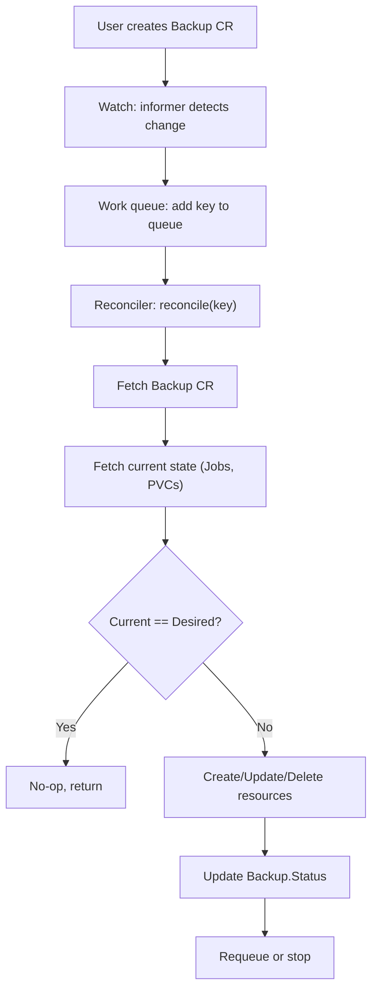

# CRDs and Operators

> [!summary] Goal
> Master Kubernetes Custom Resource Definitions (CRDs) and the operator pattern. Understand CRD structure (openAPIV3Schema, subresources, status), build an operator with controller-runtime (worked example: Backup operator), and know the major operators (Prometheus, cert-manager, Strimzi, Crossplane, Vault, Postgres).

## Table of Contents

1. [CRD Structure](#crd-structure)
2. [Operator Pattern — Reconciler Loop](#operator-pattern-reconciler-loop)
3. [Worked Example: Backup Operator](#worked-example-backup-operator)
4. [Major Operators Reference](#major-operators-reference)

---

## CRD Structure

> [!info] Custom Resource Definition
> A CRD extends the Kubernetes API with new resource types. Once created, you can interact with the new type via `kubectl` just like native K8s objects (`kubectl get backups`). CRDs require a **controller** to act on them — the CRD alone just stores data.

```yaml
apiVersion: apiextensions.k8s.io/v1
kind: CustomResourceDefinition
metadata:
  name: backups.backups.example.com
spec:
  group: backups.example.com
  names:
    kind: Backup
    plural: backups
    singular: backup
    shortNames:
      - bk
  scope: Namespaced
  versions:
    - name: v1
      served: true
      storage: true
      schema:
        openAPIV3Schema:
          type: object
          properties:
            spec:
              type: object
              properties:
                sourcePVC:
                  type: string
                schedule:
                  type: string
              required: [sourcePVC]
            status:
              type: object
              properties:
                lastBackup:
                  type: string
                  format: date-time
                phase:
                  type: string
                  enum: [Pending, Running, Completed, Failed]
      subresources:
        status: {}          # Enables /status endpoint
        scale:              # Enables HPA
          labelSelectorPath: .status.labelSelector
          specReplicasPath: .spec.replicas
          statusReplicasPath: .status.replicas
      additionalPrinterColumns:
        - name: Phase
          type: string
          jsonPath: .status.phase
        - name: Last Backup
          type: date
          jsonPath: .status.lastBackup
```

### CRD naming conventions

```text
- `spec.plural` + `.` + `spec.group` = full resource name (e.g., `backups.backups.example.com`)
- `spec.names.kind` must be PascalCase (e.g., `Backup`)
- `spec.scope`: `Namespaced` (per-namespace) or `Cluster` (cluster-wide, across namespaces)
- `spec.versions[].storage: true` — exactly one version must be the storage version
- `spec.versions[].served: true/false` — whether the API server serves this version
```

---

## Operator Pattern — Reconciler Loop

> [!info] Operator
> An operator extends Kubernetes with domain-specific knowledge. It watches CRDs and reconciles the actual state to the desired state specified in the custom resource. The core is the **reconciler loop** — a continuous reaction to events (create/update/delete CR).



### Controller-runtime components

```go
import (
    ctrl "sigs.k8s.io/controller-runtime"
    "sigs.k8s.io/controller-runtime/pkg/reconcile"
)

// Reconciler is the core of the operator
// controller-runtime provides: manager, cache, client, informer, workqueue,
// leader election, health endpoints, metrics, webhooks, finalizers

type BackupReconciler struct {
    client.Client
    Scheme *runtime.Scheme
}

func (r *BackupReconciler) Reconcile(ctx context.Context, req ctrl.Request) (ctrl.Result, error) {
    // 1. Fetch the Backup CR
    var backup backupv1.Backup
    if err := r.Get(ctx, req.NamespacedName, &backup); err != nil {
        return ctrl.Result{}, client.IgnoreNotFound(err)
    }

    // 2. Check if backup is due (based on schedule)
    // 3. Create a Job to run the backup (pod + PVC)
    // 4. Update Backup.Status
    return ctrl.Result{RequeueAfter: 1 * time.Minute}, nil
}

func main() {
    mgr, _ := ctrl.NewManager(ctrl.GetConfigOrDie(), ctrl.Options{
        LeaderElection: true,          // Prevent multiple operators from acting
        LeaderElectionID: "backup-operator.example.com",
        MetricsBindAddress: ":8080",
        HealthProbeBindAddress: ":8081",
    })
    ctrl.NewControllerManagedBy(mgr).
        For(&backupv1.Backup{}).       // Watch Backup CR
        Owns(&batchv1.Job{}).          // Also watch owned Jobs
        Complete(&BackupReconciler{Client: mgr.GetClient()})
}

// Helm chart for operator deployment includes:
// - RBAC (ClusterRole + ClusterRoleBinding)
// - CRD (installed before operator)
// - Operator Deployment
// - ServiceAccount
// - ServiceMonitor (for Prometheus metrics)
```

### Well-known operators

```text
Operator              CRD(s)                            Purpose
──────────────────────────────────────────────────────────────────────
prometheus-operator   Prometheus, ServiceMonitor,        K8s monitoring
                      Alertmanager, PrometheusRule       

cert-manager          Certificate, Issuer, ClusterIssuer, TLS certs
                      CertificateRequest

Strimzi               Kafka, KafkaTopic, KafkaUser        Kafka on K8s
                      KafkaConnector

Crossplane            ProviderConfig, Composition,         Managed resource
                      XR (CompositeResource)              provisioning

Vault (HashiCorp)     Vault, VaultAuth                    Vault integration

Postgres Operator     PostgresCluster, PostgresDB         Postgres on K8s

ArgoCD                Application, AppProject,            GitOps
                      ApplicationSet

Nginx Ingress         Ingress (native)                    Ingress routing

KubeDB                Postgres, MySQL, MongoDB             DB provisioning

Elasticsearch         Elasticsearch, Kibana, APMServer    Elastic on K8s

Spark Operator        SparkApplication, ScheduledSparkApp Spark on K8s
```

---

## Cross-Links

- [[CICD/Kubernetes/01_Foundations/04_Cluster_Architecture_and_Components]] for API server integration
- [[CICD/Kubernetes/02_Core/06_RBAC_and_ServiceAccounts]] for operator RBAC
- [[CICD/Kubernetes/04_Playbooks/03_GitOps_with_ArgoCD_and_Flux]] for ArgoCD operator
- [[CICD/Kubernetes/03_Advanced/02_Helm_Package_Management]] for Helm-operator integration
