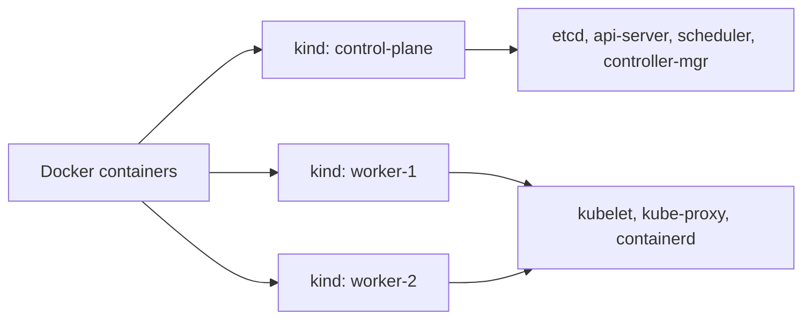

# Playbook: Local Development with kind

> [!summary] Goal
> Run a local Kubernetes cluster for development using kind (Kubernetes IN Docker), import images, install add-ons, and set up live-reload workflows.

## Table of Contents

1. [Why Local Clusters Matter](#why-local-clusters-matter)
2. [kind Setup](#kind-setup)
3. [kind Configuration](#kind-configuration)
4. [Working with kind](#working-with-kind)
5. [Alternative: k3d and k3s](#alternative-k3d-and-k3s)
6. [Live Development with Tilt](#live-development-with-tilt)
7. [Pitfalls](#pitfalls)

---

## Why Local Clusters Matter

A local cluster lets you test Kubernetes manifests, networking, and deployment patterns without a cloud cluster. kind runs entire clusters in Docker containers.



---

## kind Setup

```bash
# Install kind
brew install kind
# or: curl -Lo ./kind https://kind.sigs.k8s.io/dl/v0.22.0/kind-linux-amd64

# Create a cluster
kind create cluster
kind create cluster --name my-cluster

# Verify
kind get clusters
kubectl cluster-info --context kind-kind
```

---

## kind Configuration

```yaml
# kind-config.yaml
kind: Cluster
apiVersion: kind.x-k8s.io/v1alpha4
nodes:
  - role: control-plane
    extraPortMappings:
      - containerPort: 80        # Map host port 80 to node port 80
        hostPort: 80
      - containerPort: 443
        hostPort: 443
  - role: worker
  - role: worker

# Create with config
kind create cluster --config kind-config.yaml --name dev
```

### Advanced configuration

```yaml
kind: Cluster
apiVersion: kind.x-k8s.io/v1alpha4
name: dev
nodes:
  - role: control-plane
    kubeadmConfigPatches:
      - |
        apiVersion: kubeadm.k8s.io/v1beta3
        kind: InitConfiguration
        nodeRegistration:
          kubeletExtraArgs:
            node-labels: "ingress-ready=true"  # For nginx-ingress
    extraPortMappings:
      - containerPort: 80
        hostPort: 80
      - containerPort: 443
        hostPort: 443
  - role: worker
  - role: worker
```

---

## Working with kind

```bash
# Switch to kind context
kubectl config use-context kind-dev

# List clusters
kind get clusters

# Load a local image into the cluster (no registry needed)
kind load docker-image my-app:latest --name dev
kind load docker-image my-app:latest my-app:v2 --name dev

# Install ingress controller
kubectl apply -f https://raw.githubusercontent.com/kubernetes/ingress-nginx/main/deploy/static/provider/kind/deploy.yaml

# Install metrics-server
kubectl apply -f https://github.com/kubernetes-sigs/metrics-server/releases/latest/download/components.yaml
kubectl patch deployment metrics-server -n kube-system --type='json' \
  -p='[{"op": "add", "path": "/spec/template/spec/containers/0/args/-", "value": "--kubelet-insecure-tls"}]'

# Clean up
kind delete cluster --name dev
kind delete clusters --all
```

---

## Alternative: k3d and k3s

### k3d (k3s in Docker)

```bash
# Install k3d
brew install k3d

# Create a cluster
k3d cluster create dev \
  --servers 1 \
  --agents 2 \
  --port "80:80@loadbalancer" \
  --port "443:443@loadbalancer"

# Import images
k3d image import my-app:latest -c dev

# Delete
k3d cluster delete dev
```

### k3s (single-binary Kubernetes)

```bash
# Install k3s (good for lightweight VMs, Raspberry Pi)
curl -sfL https://get.k3s.io | sh -
kubectl get nodes
```

| Tool | Best for | Startup time | Resource usage |
|------|----------|-------------|---------------|
| **kind** | CI/CD, testing, local dev | ~30s | Moderate (Docker containers) |
| **k3d** | Local dev with load balancer | ~20s | Low |
| **k3s** | Edge, IoT, Raspberry Pi | ~10s | Very low |
| **minikube** | Full-featured local cluster | ~60s | High (VM-based) |
| **Docker Desktop** | Built-in K8s, easy setup | ~45s | Moderate |

---

## Live Development with Tilt

Tilt watches your files and automatically rebuilds images, pushes to kind, and updates running resources:

```bash
# Install Tilt
brew install tilt

# Create Tiltfile
```

```python
# Tiltfile
# Build and deploy with kind
docker_build('my-app', '.')
k8s_yaml('deploy/deployment.yaml')
k8s_yaml('deploy/service.yaml')
k8s_resource('my-app', port_forwards=8080)
```

```bash
# Start development
tilt up
# Opens a web UI showing pod status, logs, and build events
```

### Tiltfile common patterns

```python
# Development mode with live reload
docker_build('my-app', '.',
    live_update=[
        sync('.', '/app'),
        run('npm run build', trigger=['src/']),
    ],
    entrypoint=['/app/entrypoint-dev.sh'])

# Deploy manifests
k8s_yaml('deploy/')

# Port forwarding
k8s_resource('my-app', port_forwards=8080, labels=['frontend'])
k8s_resource('postgres', labels=['data'])

# Health endpoint
k8s_resource('my-app', health_checks=['curl -f http://localhost:8080/health'])
```

---

## Pitfalls

### Image not found in kind

`kind` runs its own container runtime. Images built locally aren't available unless you load them.

**Fix**: `kind load docker-image my-app:latest --name dev`. Or set `imagePullPolicy: IfNotPresent` and push to a registry.

### Port conflicts on host

Mapping containerPort 80 to hostPort 80 fails if you already have something listening on port 80.

**Fix**: Use different host ports (`hostPort: 8080` → `containerPort: 80`), or stop the conflicting service.

### Metrics-server not working in kind

kind doesn't support `kubelet-insecure-tls` by default. The metrics-server installation fails.

**Fix**: Patch the metrics-server deployment to add `--kubelet-insecure-tls` flag.

---

> [!question]- Interview Questions
>
> **Q: What is kind and how does it work?**
> A: kind (Kubernetes IN Docker) runs Kubernetes clusters as Docker containers. Each node is a container running containerd, kubelet, and kube-proxy.
>
> **Q: How do you make a local Docker image available to a kind cluster?**
> A: `kind load docker-image my-app:latest --name dev` imports the image from the local Docker daemon into the kind cluster's containerd registry.
>
> **Q: What is Tilt used for?**
> A: Tilt provides live development workflows for Kubernetes — watches files, rebuilds images, updates pods, and shows logs/status in a web UI.

---

## Cross-Links

- [[CICD/Kubernetes/01_Foundations/04_Cluster_Architecture_and_Components]] for cluster architecture
- [[CICD/Kubernetes/02_Core/04_Debugging_with_kubectl]] for local cluster debugging
- [[CICD/Kubernetes/05_Projects/01_Deploy_a_Service_With_HPA_and_Ingress]] for deploying on local cluster

---

## References

- [kind](https://kind.sigs.k8s.io/)
- [k3d](https://k3d.io/)
- [k3s](https://k3s.io/)
- [Tilt](https://tilt.dev/)
