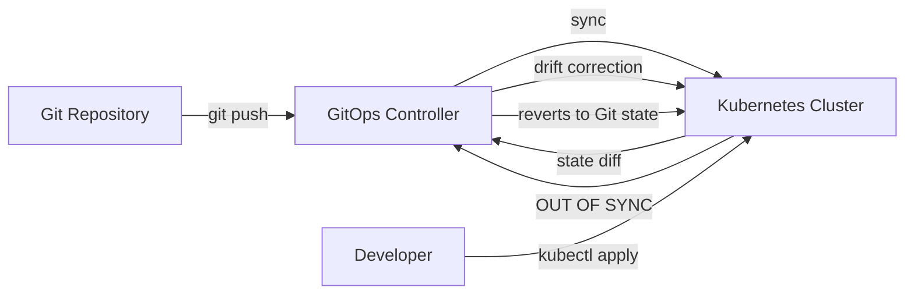
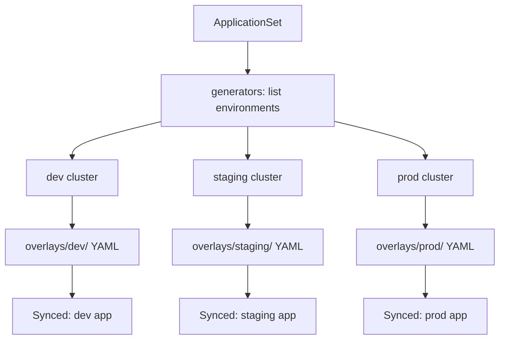

# Playbook: GitOps with ArgoCD and Flux

> [!summary] Goal
> Implement GitOps for Kubernetes: declarative deployments synchronized from Git repositories using ArgoCD or FluxCD.

## Table of Contents

1. [Why GitOps Matters](#why-gitops-matters)
2. [GitOps Principles](#gitops-principles)
3. [ArgoCD Setup](#argocd-setup)
4. [ArgoCD Application](#argocd-application)
5. [Flux Setup](#flux-setup)
6. [Flux Resources](#flux-resources)
7. [ArgoCD vs FluxCD Comparison](#argocd-vs-fluxcd-comparison)
8. [Pitfalls](#pitfalls)

---

## Why GitOps Matters

GitOps makes Git the single source of truth for Kubernetes resources. A controller in the cluster continuously reconciles the live state with the state defined in the Git repository.



---

## GitOps Principles

| Principle | Description |
|-----------|-------------|
| **Declarative** | Entire system is described declaratively in Git |
| **Versioned** | Git history is the change log — every change is traceable |
| **Pulled** | Changes are pulled by the operator, not pushed |
| **Continuous reconciliation** | Drift from the desired state is detected and corrected |
| **Observable** | Sync status, health, and drift are visible |

---

## ArgoCD Setup

```bash
# Install ArgoCD
kubectl create namespace argocd
kubectl apply -n argocd -f https://raw.githubusercontent.com/argoproj/argo-cd/stable/manifests/install.yaml

# Access the UI
kubectl port-forward svc/argocd-server -n argocd 8080:443

# Get the admin password
kubectl -n argocd get secret argocd-initial-admin-secret -o jsonpath="{.data.password}" | base64 -d

# Login via CLI
argocd login localhost:8080 --username admin
```

### Install via Helm

```bash
helm repo add argo https://argoproj.github.io/argo-helm
helm install argocd argo/argo-cd \
  --namespace argocd \
  --create-namespace \
  --set server.service.type=LoadBalancer
```

---

## ArgoCD Application

### Application via UI

```
New App → Name: my-app → Project: default
Sync Policy: Automatic → Prune: true → Self-Heal: true
Source: https://github.com/org/repo → Path: k8s/overlays/prod
Destination: https://kubernetes.default.svc → Namespace: production
```

### Application via YAML (Declarative Setup)

```yaml
apiVersion: argoproj.io/v1alpha1
kind: Application
metadata:
  name: my-app
  namespace: argocd
spec:
  project: default
  source:
    repoURL: https://github.com/org/repo.git
    targetRevision: main
    path: k8s/overlays/prod
  destination:
    server: https://kubernetes.default.svc
    namespace: production
  syncPolicy:
    automated:
      prune: true          # Delete resources not in Git
      selfHeal: true        # Revert manual changes
      allowEmpty: false
    syncOptions:
      - CreateNamespace=true
      - ApplyOutOfSyncOnly=true
      - PruneLast=true
    retry:
      limit: 2
      backoff:
        duration: 5s
        factor: 2
        maxDuration: 3m
```

### ApplicationSet (Multi-Cluster/Environment)

```yaml
apiVersion: argoproj.io/v1alpha1
kind: ApplicationSet
metadata:
  name: my-apps
  namespace: argocd
spec:
  generators:
    - list:
        elements:
          - environment: dev
            cluster: https://dev-cluster:6443
          - environment: staging
            cluster: https://staging-cluster:6443
          - environment: prod
            cluster: https://prod-cluster:6443
  template:
    metadata:
      name: 'my-app-{{environment}}'
    spec:
      project: default
      source:
        repoURL: https://github.com/org/repo.git
        targetRevision: main
        path: 'k8s/overlays/{{environment}}'
      destination:
        server: '{{cluster}}'
        namespace: '{{environment}}'
```



---

## Flux Setup

```bash
# Install Flux CLI
brew install fluxcd/tap/flux

# Check prerequisites
flux check --pre

# Bootstrap on a cluster
flux bootstrap github \
  --owner=my-org \
  --repository=fleet-infra \
  --branch=main \
  --path=./clusters/production \
  --personal

# This creates:
# - flux-system namespace with Flux controllers
# - GitHub repository with Flux manifests
# - Deploy key for authentication
```

---

## Flux Resources

```yaml
# Source: where to pull manifests from
apiVersion: source.toolkit.fluxcd.io/v1
kind: GitRepository
metadata:
  name: my-app
  namespace: flux-system
spec:
  interval: 1m                    # Check for changes every minute
  url: https://github.com/org/repo
  ref:
    branch: main
  secretRef:
    name: flux-auth
---
# Kustomization: what to apply to the cluster
apiVersion: kustomize.toolkit.fluxcd.io/v1
kind: Kustomization
metadata:
  name: my-app
  namespace: flux-system
spec:
  interval: 5m                    # Sync every 5 minutes
  sourceRef:
    kind: GitRepository
    name: my-app
  path: ./k8s/overlays/prod
  prune: true                     # Delete resources not in Git
  force: false                    # Don't force apply
  validation: client
  healthChecks:
    - apiVersion: apps/v1
      kind: Deployment
      name: my-app
      namespace: production
  patches:
    - patch: |
        - op: add
          path: /spec/template/spec/containers/0/env/-
          value:
            name: LOG_LEVEL
            value: debug
      target:
        kind: Deployment
---
# HelmRelease: deploy Helm charts via Flux
apiVersion: helm.toolkit.fluxcd.io/v2
kind: HelmRelease
metadata:
  name: postgres
  namespace: flux-system
spec:
  interval: 5m
  chart:
    spec:
      chart: postgresql
      sourceRef:
        kind: HelmRepository
        name: bitnami
        namespace: flux-system
      interval: 1m
  values:
    auth:
      database: myapp
      password: secret
```

---

## ArgoCD vs FluxCD Comparison

| Aspect | ArgoCD | FluxCD |
|--------|--------|-------|
| **Architecture** | Pull-based (agent polls Git) | Pull-based (controller reconciles) |
| **Installation** | `kubectl apply` or Helm | `flux bootstrap` CLI |
| **UI** | Rich web UI, SSO, RBAC | CLI-only (web UI via third-party) |
| **Multi-cluster** | ApplicationSet, cluster secrets | Kustomization with kubeconfig secrets |
| **Sync strategies** | Manual, automatic, self-heal | Automatic with intervals |
| **Drift detection** | Yes — highlights OUT OF SYNC | Yes — reverts automatically |
| **Helm support** | Native (repo, OCI, dependencies) | Native (HelmRepository, HelmRelease) |
| **Kustomize support** | Native (built-in) | Native (Kustomization CRD) |
| **Notifications** | Webhooks, Slack, Email | Webhook receivers, EventSeverity |
| **RBAC** | Built-in (projects, roles) | Kubernetes RBAC only |
| **Learning curve** | Moderate (many features) | Steeper (multiple CRDs) |
| **Best for** | Teams needing a UI and multi-cluster management | Teams wanting Git-native, CLI-driven workflows |

---

## Pitfalls

### Manual changes reverted by GitOps

If someone runs `kubectl edit deployment my-app`, ArgoCD (with selfHeal) or Flux will revert it to the Git state on the next sync — potentially losing config.

**Fix**: Disable selfHeal in ArgoCD, or use `force: false` in Flux. All changes should go through Git.

### Secrets in Git

Storing plaintext secrets in Git defeats the purpose of GitOps security.

**Fix**: Use SealedSecrets, External Secrets Operator, SOPS with age/GPG, or Vault.

### ArgoCD namespace management

ArgoCD can create namespaces via `syncOptions: CreateNamespace=true`, but it won't manage the Namespace resource itself.

**Fix**: Include the Namespace manifest in Git. Use an App of Apps pattern for multi-namespace deployments.

---

> [!question]- Interview Questions
>
> **Q: What is GitOps?**
> A: An operational model where Git is the single source of truth. A controller reconciles cluster state with the declared state in Git. Changes are made via PRs, not kubectl.
>
> **Q: What is the difference between ArgoCD and Flux?**
> A: ArgoCD has a rich web UI, SSO, multi-cluster ApplicationSet, and more traditional pull-based architecture. Flux is CLI-driven, uses Kustomize CRDs natively, and bootstraps via `flux bootstrap`.
>
> **Q: How does ArgoCD detect and correct drift?**
> A: ArgoCD continuously compares the live cluster state to the desired state in Git. When `selfHeal` is enabled, it reverts any manual changes to match Git.

---

## Cross-Links

- [[CICD/Kubernetes/03_Advanced/02_Helm_Package_Management]] for Helm charts in GitOps
- [[CICD/Kubernetes/03_Advanced/03_Kustomize_Native_Configuration_Management]] for Kustomize overlays in GitOps
- [[CICD/GitHubActions/01_Foundations/01_Workflow_Syntax_and_Triggers]] for CI triggering GitOps sync

---

## References

- [ArgoCD Documentation](https://argo-cd.readthedocs.io/)
- [Flux Documentation](https://fluxcd.io/docs/)
- [GitOps with ArgoCD](https://www.weave.works/technologies/gitops/)
- [OpenGitOps](https://opengitops.dev/)
