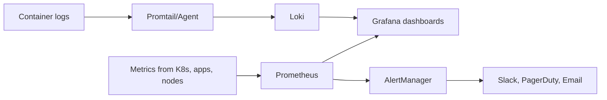
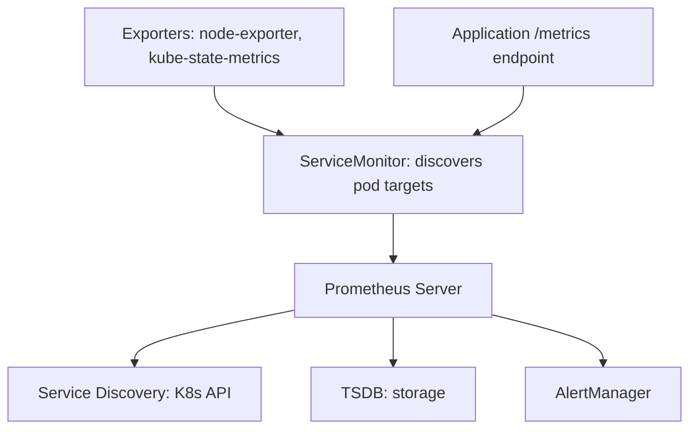

# Playbook: Monitoring and Observability with Prometheus

> [!summary] Goal
> Monitor Kubernetes clusters and applications with Prometheus, visualize with Grafana, collect logs with Loki, and set up alerting.

## Table of Contents

1. [Why Monitoring Matters](#why-monitoring-matters)
2. [Prometheus Architecture](#prometheus-architecture)
3. [Installing kube-prometheus-stack](#installing-kube-prometheus-stack)
4. [Prometheus Metrics and ServiceMonitors](#prometheus-metrics-and-servicemonitors)
5. [Grafana Dashboards](#grafana-dashboards)
6. [Alerting with AlertManager](#alerting-with-alertmanager)
7. [Logging with Loki and Promtail](#logging-with-loki-and-promtail)
8. [Pitfalls](#pitfalls)

---

## Why Monitoring Matters

Without monitoring, you can't know if your cluster is healthy, if applications are responding, or if you're about to run out of disk.



---

## Prometheus Architecture



| Component | Purpose |
|-----------|---------|
| **Prometheus Server** | Scrapes metrics, stores in TSDB, evaluates alert rules |
| **AlertManager** | Handles alerts: deduplicates, groups, routes to Slack/PagerDuty/Email |
| **ServiceMonitor** | CRD that tells Prometheus which pods to scrape |
| **Node Exporter** | DaemonSet exposing node-level metrics (CPU, memory, disk) |
| **kube-state-metrics** | Exposes K8s object metrics (pod count, deployment replicas) |

---

## Installing kube-prometheus-stack

The kube-prometheus-stack Helm chart installs Prometheus, AlertManager, Grafana, node-exporter, and kube-state-metrics:

```bash
# Add the Helm repo
helm repo add prometheus-community https://prometheus-community.github.io/helm-charts
helm repo update

# Create namespace
kubectl create namespace monitoring

# Install
helm install prometheus prometheus-community/kube-prometheus-stack \
  --namespace monitoring \
  --set grafana.enabled=true \
  --set grafana.service.type=LoadBalancer \
  --set prometheus.prometheusSpec.scrapeInterval=15s \
  --set alertmanager.enabled=true
```

### Access Grafana

```bash
# Get the admin password
kubectl get secret prometheus-grafana -n monitoring \
  -o jsonpath="{.data.admin-password}" | base64 -d

# Port-forward
kubectl port-forward svc/prometheus-grafana -n monitoring 3000:80
# Open http://localhost:3000 (admin / prom-operator)
```

---

## Prometheus Metrics and ServiceMonitors

### Metrics from your application

```yaml
apiVersion: v1
kind: Service
metadata:
  name: my-app
  labels:
    app: my-app
spec:
  selector:
    app: my-app
  ports:
    - name: http
      port: 8080
      targetPort: 8080
    - name: metrics    # Sidecar metrics port
      port: 9090
      targetPort: 9090
---
# ServiceMonitor instructs Prometheus to scrape /metrics from this Service
apiVersion: monitoring.coreos.com/v1
kind: ServiceMonitor
metadata:
  name: my-app
  labels:
    release: prometheus   # Must match the label that kube-prometheus-stack uses
spec:
  selector:
    matchLabels:
      app: my-app
  endpoints:
    - port: metrics
      interval: 15s
      path: /metrics
  namespaceSelector:
    any: true   # Scrape across all namespaces
```

### Adding custom scrape targets

```yaml
apiVersion: monitoring.coreos.com/v1
kind: PodMonitor
metadata:
  name: my-app
  labels:
    release: prometheus
spec:
  selector:
    matchLabels:
      app: my-app
  podMetricsEndpoints:
    - port: metrics
      interval: 15s
```

### Pre-built dashboards (included with kube-prometheus-stack)

- Kubernetes / Compute Resources / Cluster
- Kubernetes / Compute Resources / Namespace (Pods)
- Kubernetes / API Server
- Kubernetes / Nodes
- Kubernetes / Pods
- Node Exporter / Nodes
- 1860 — Node Exporter Full

---

## Grafana Dashboards

### Import a dashboard

```
Grafana → Create → Import → Dashboard ID: 315 (or 1860 for Node Exporter)
```

### Dashboard for application metrics

```json
{
  "title": "My App Dashboard",
  "panels": [
    {
      "title": "Request Rate",
      "type": "graph",
      "targets": [{
        "expr": "rate(http_requests_total[5m])",
        "legendFormat": "{{handler}}"
      }]
    },
    {
      "title": "Error Rate",
      "type": "graph",
      "targets": [{
        "expr": "rate(http_requests_total{status=~\"5..\"}[5m])",
        "legendFormat": "{{handler}}"
      }]
    },
    {
      "title": "P99 Latency",
      "type": "graph",
      "targets": [{
        "expr": "histogram_quantile(0.99, rate(http_request_duration_seconds_bucket[5m]))",
        "legendFormat": "{{handler}}"
      }]
    }
  ]
}
```

---

## Alerting with AlertManager

### PrometheusRule — define alerts

```yaml
apiVersion: monitoring.coreos.com/v1
kind: PrometheusRule
metadata:
  name: my-app-alerts
  namespace: monitoring
  labels:
    release: prometheus
spec:
  groups:
    - name: my-app
      rules:
        - alert: HighErrorRate
          expr: rate(http_requests_total{status=~"5.."}[5m]) > 0.05
          for: 5m
          labels:
            severity: critical
          annotations:
            summary: "High error rate on {{ $labels.pod }}"
            description: "Error rate is {{ $value | humanizePercentage }}"
```

### Configure AlertManager receivers

```yaml
apiVersion: v1
kind: Secret
metadata:
  name: alertmanager-config
  namespace: monitoring
stringData:
  alertmanager.yaml: |
    route:
      receiver: slack
      repeatInterval: 4h
      routes:
        - match:
            severity: critical
          receiver: pagerduty
    receivers:
      - name: slack
        slack_configs:
          - api_url: https://hooks.slack.com/services/...
            channel: '#alerts'
            title: '{{ .GroupLabels.alertname }}'
            text: '{{ .CommonAnnotations.description }}'
      - name: pagerduty
        pagerduty_configs:
          - routing_key: <pd-routing-key>
```

---

## Logging with Loki and Promtail

```bash
# Install Loki + Promtail
helm install loki grafana/loki-stack \
  --namespace monitoring \
  --set promtail.enabled=true \
  --set loki.persistence.enabled=true \
  --set loki.persistence.size=10Gi
```

```mermaid
flowchart LR
    A[Pod logs] --> B[Promtail: DaemonSet on each node]
    B --> C[Loki: log aggregation]
    C --> D[Grafana: Explore → LogQL]
    A --> E["kubectl logs -f"]
    B --> F["{app=\"my-app\"} |= \"error\""]
```

### LogQL queries in Grafana

```logql
# All logs from a specific pod
{app="my-app"} |= "error"

# Logs from a deployment with a search term
{namespace="production"} |= "timeout"
| json
| stats count() by level

# Rate of error logs
rate({app="my-app"} |= "error"[5m])
```

---

## Pitfalls

### Prometheus not scraping your metrics

The ServiceMonitor's `release` label must match the `prometheus.prometheusSpec.serviceMonitorSelector` (default: `release: prometheus`).

**Fix**: Add `release: prometheus` label to your ServiceMonitor. Check `kubectl get servicemonitors -A`.

### Too many metrics causing OOM

Prometheus with too many series or too-long retention can run out of memory.

**Fix**: Set `--storage.tsdb.retention.time=15d` and `--storage.tsdb.retention.size=50GB` limits. Use `metricRelabelings` to drop unnecessary metrics.

### AlertManager not sending

AlertManager needs a valid receiver configuration. Slack webhooks must be reachable.

**Fix**: `kubectl logs -n monitoring alertmanager-0` to see errors. Test webhook URLs with `curl`.

---

> [!question]- Interview Questions
>
> **Q: How does Prometheus collect metrics from Kubernetes pods?**
> A: Prometheus uses ServiceMonitors (CRDs) that define which services to scrape, how often, and which path to scrape. It discovers targets via the Kubernetes API.
>
> **Q: What is the difference between Prometheus and Grafana?**
> A: Prometheus collects and stores metrics. Grafana visualizes them. Prometheus is the data source. Grafana creates dashboards from that data.
>
> **Q: How does Loki differ from Prometheus?**
> A: Prometheus handles numeric metrics (counter, gauge, histogram). Loki handles log text. Both integrate with Grafana. PromQL is for metrics, LogQL is for logs.

---

## Cross-Links

- [[CICD/Kubernetes/03_Advanced/01_Resource_Requests_Limits_and_QoS_Deep_Dive]] for resource monitoring
- [[CICD/Kubernetes/02_Core/03_HealthChecks_Resources_and_HPA]] for HPA metrics
- [[CICD/GitHubActions/04_Playbooks/05_Actions_Monitoring_and_Observability]] for CI monitoring

---

## References

- [Prometheus Operator](https://prometheus-operator.dev/)
- [kube-prometheus-stack Helm Chart](https://github.com/prometheus-community/helm-charts/tree/main/charts/kube-prometheus-stack)
- [Grafana Dashboards](https://grafana.com/grafana/dashboards/)
- [Loki](https://grafana.com/oss/loki/)
