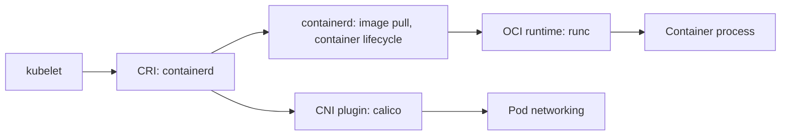
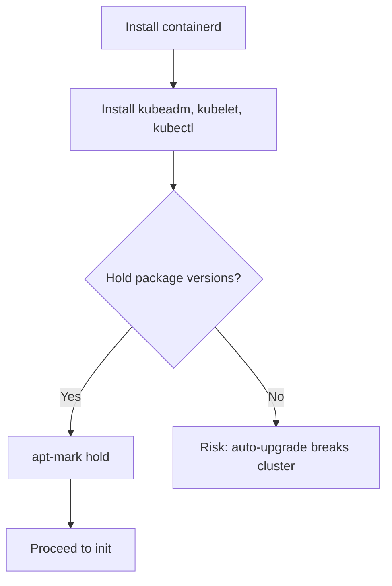
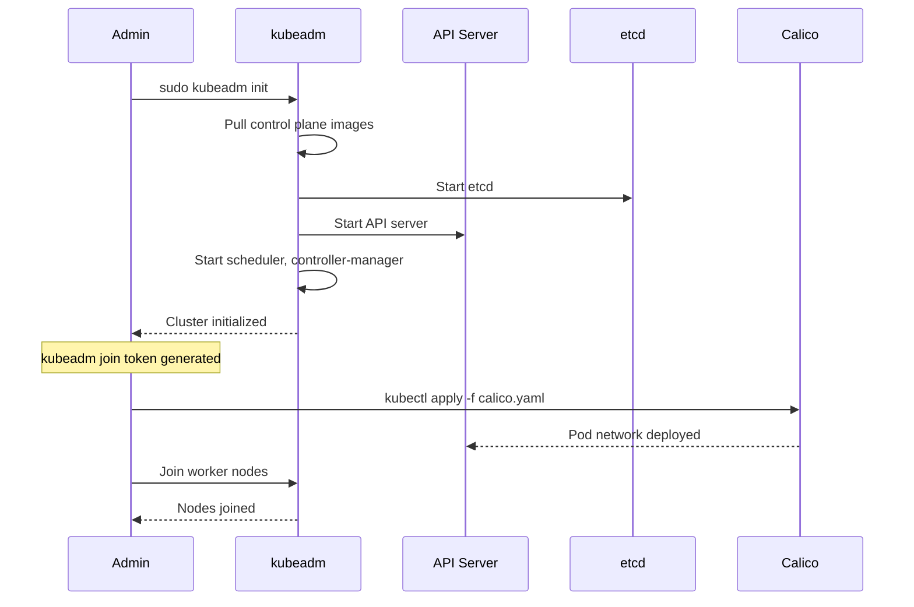
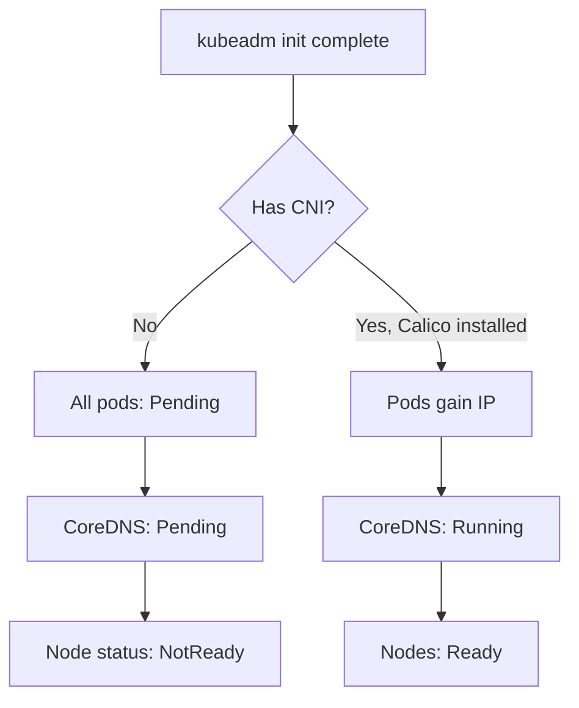
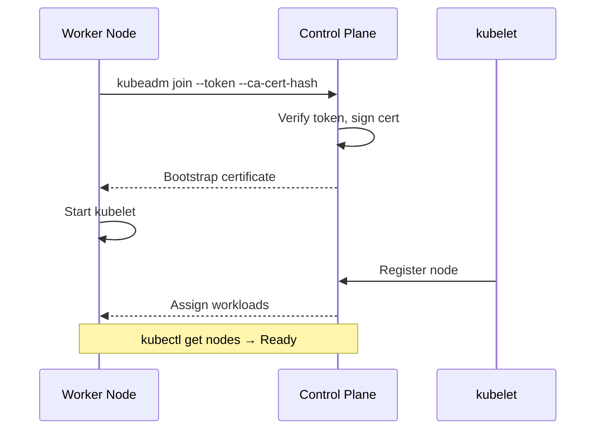
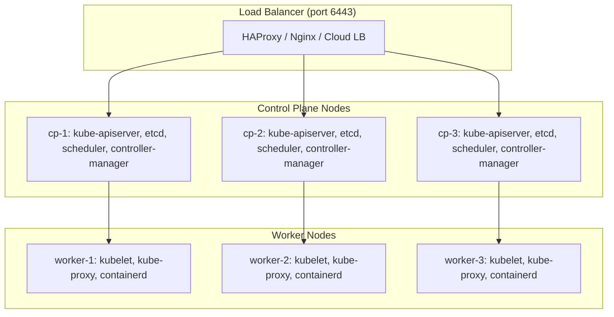
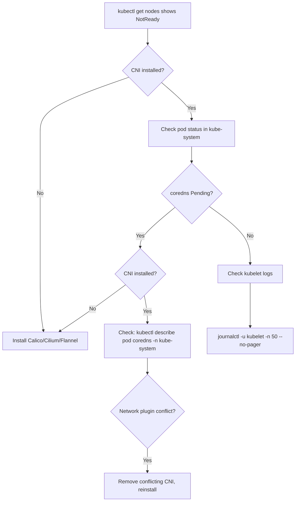

# Playbook: Install a Kubernetes Cluster with kubeadm

> [!summary] Goal
> Install a production-ready Kubernetes cluster on Linux servers from scratch using kubeadm — from container runtime through control plane, CNI, worker nodes, and production hardening.

## Table of Contents

1. [Prerequisites](#prerequisites)
2. [Install Container Runtime (containerd)](#install-container-runtime)
3. [Install kubeadm, kubelet, kubectl](#install-kubeadm-kubelet-kubectl)
4. [Initialize the Control Plane](#initialize-the-control-plane)
5. [Set Up kubeconfig](#set-up-kubeconfig)
6. [Install CNI (Calico)](#install-cni)
7. [Join Worker Nodes](#join-worker-nodes)
8. [Verify the Cluster](#verify-the-cluster)
9. [HA Control Plane Setup](#ha-control-plane-setup)
10. [Production Hardening](#production-hardening)
11. [Troubleshooting Installation](#troubleshooting-installation)
12. [Pitfalls](#pitfalls)

---

## Prerequisites

### Server requirements

| Requirement | Minimum | Recommended |
|-------------|---------|-------------|
| **OS** | Ubuntu 22.04 / Debian 12 / Rocky Linux 9 | Ubuntu 24.04 LTS |
| **CPU** | 2 cores (control plane), 1 core (worker) | 4+ cores per node |
| **RAM** | 4 GB (control plane), 2 GB (worker) | 8+ GB per node |
| **Disk** | 50 GB (etcd + images) | 100+ GB (SSD) |
| **Network** | 1 Gbps between nodes | 10 Gbps |
| **Swap** | **Must be disabled** | — |

### System preparation (run on ALL nodes)

```bash
# Disable swap
sudo swapoff -a
sudo sed -i '/ swap / s/^/#/' /etc/fstab

# Load kernel modules
cat <<EOF | sudo tee /etc/modules-load.d/k8s.conf
overlay
br_netfilter
EOF

sudo modprobe overlay
sudo modprobe br_netfilter

# Set sysctl params
cat <<EOF | sudo tee /etc/sysctl.d/k8s.conf
net.bridge.bridge-nf-call-iptables  = 1
net.bridge.bridge-nf-call-ip6tables = 1
net.ipv4.ip_forward                 = 1
EOF

sudo sysctl --system

# Set hostname (unique per node)
# Control plane:
sudo hostnamectl set-hostname cp-1
# Workers:
sudo hostnamectl set-hostname worker-1

# Add hosts (or use DNS)
cat <<EOF | sudo tee -a /etc/hosts
192.168.1.10 cp-1
192.168.1.11 cp-2
192.168.1.12 cp-3
192.168.1.20 worker-1
192.168.1.21 worker-2
192.168.1.22 worker-3
EOF
```

### Required ports

| Node type | Port range | Purpose |
|-----------|-----------|---------|
| **Control plane** | 6443 (API server), 2379-2380 (etcd), 10250 (kubelet), 10259 (scheduler), 10257 (controller-manager) | Inbound from all nodes |
| **Worker** | 10250 (kubelet), 30000-32767 (NodePort services) | Inbound from control plane + external |
| **All nodes** | 8472 (Calico VXLAN), 51820 (Calico WireGuard), 53 (CoreDNS) | Internal pod networking |

```bash
# Quick firewall check (UFW example)
sudo ufw allow 6443/tcp  # API server
sudo ufw allow 2379:2380/tcp  # etcd
sudo ufw allow 10250/tcp  # kubelet
sudo ufw allow 30000:32767/tcp  # NodePort
sudo ufw enable
```

---

## Install Container Runtime (containerd)



```bash
# Install containerd
sudo apt-get update
sudo apt-get install -y containerd

# Generate default config
sudo mkdir -p /etc/containerd
containerd config default | sudo tee /etc/containerd/config.toml

# Set systemd cgroup driver
sudo sed -i 's/SystemdCgroup = false/SystemdCgroup = true/' /etc/containerd/config.toml

# Restart containerd
sudo systemctl restart containerd
sudo systemctl enable containerd
sudo systemctl status containerd --no-pager
```

### Verify containerd

```bash
sudo ctr images pull docker.io/library/nginx:alpine
sudo ctr run --rm docker.io/library/nginx:alpine test echo "containerd works"
```

---

## Install kubeadm, kubelet, kubectl

```bash
# Add Kubernetes apt repository
sudo apt-get install -y apt-transport-https ca-certificates curl gpg

curl -fsSL https://pkgs.k8s.io/core:/stable:/v1.30/deb/Release.key | sudo gpg --dearmor -o /etc/apt/keyrings/kubernetes-apt-keyring.gpg

echo 'deb [signed-by=/etc/apt/keyrings/kubernetes-apt-keyring.gpg] https://pkgs.k8s.io/core:/stable:/v1.30/deb/ /' | sudo tee /etc/apt/sources.list.d/kubernetes.list

sudo apt-get update
sudo apt-get install -y kubelet kubeadm kubectl

# Hold versions (prevents accidental upgrades)
sudo apt-mark hold kubelet kubeadm kubectl

# Verify
kubeadm version
kubelet --version
kubectl version --client
```



---

## Initialize the Control Plane

### Single control plane (test/dev)

```bash
sudo kubeadm init \
  --pod-network-cidr=10.244.0.0/16 \
  --apiserver-advertise-address=192.168.1.10
```

### HA control plane with load balancer

```bash
# On cp-1, cp-2, cp-3 — run on FIRST control plane node only
sudo kubeadm init \
  --pod-network-cidr=10.244.0.0/16 \
  --control-plane-endpoint=cluster.example.com:6443 \
  --upload-certs
```



### What happens during init

| Step | What it does | Time |
|------|-------------|------|
| 1 | Runs pre-flight checks | 1s |
| 2 | Generates certificates (CA, API server, etcd, kubelet) | 5s |
| 3 | Writes kubeconfig to `/etc/kubernetes/` | 1s |
| 4 | Starts static pods for control plane (etcd, API server, scheduler, controller-manager) | 30s |
| 5 | Bootstraps CoreDNS and kube-proxy add-ons | 10s |
| 6 | Outputs join token and CA hash | 1s |

### Output

```
Your Kubernetes control-plane has been initialized successfully!

To start using your cluster, you need to run the following as a regular user:

  mkdir -p $HOME/.kube
  sudo cp -i /etc/kubernetes/admin.conf $HOME/.kube/config
  sudo chown $(id -u):$(id -g) $HOME/.kube/config

You can now join any number of worker nodes by running the following on each:

kubeadm join 192.168.1.10:6443 --token <token> \
  --discovery-token-ca-cert-hash sha256:<hash>
```

---

## Set Up kubeconfig

```bash
# Run as regular user (not root)
mkdir -p $HOME/.kube
sudo cp -i /etc/kubernetes/admin.conf $HOME/.kube/config
sudo chown $(id -u):$(id -g) $HOME/.kube/config

# Verify access
kubectl get nodes
kubectl get pods -A
```

### Distribute kubeconfig to users

```bash
# Copy admin.conf to another machine
scp user@cp-1:~/.kube/config user@laptop:~/.kube/config

# Alternatively: create a limited kubeconfig with RBAC-bound credentials
# (See RBAC and ServiceAccounts note)
```

---

## Install CNI (Calico)

Without a CNI plugin, pods cannot communicate and CoreDNS stays `Pending`.

```bash
# Install Calico
kubectl apply -f https://raw.githubusercontent.com/projectcalico/calico/v3.28/manifests/calico.yaml

# Verify
kubectl get pods -n kube-system -l k8s-app=calico-node -w
kubectl get nodes                    # Should all be Ready
kubectl get pods -n kube-system      # CoreDNS should be Running
```



### Alternative CNI options

| CNI | Features | Install command |
|-----|----------|----------------|
| **Calico** | NetworkPolicy, wireguard encryption, BGP routing | `kubectl apply -f https://.../calico.yaml` |
| **Cilium** | NetworkPolicy, eBPF, Hubble observability, Service Mesh | `helm install cilium cilium/cilium` |
| **Flannel** | Simple overlay, no NetworkPolicy | `kubectl apply -f https://.../kube-flannel.yml` |
| **Weave** | Simple, encryption | `kubectl apply -f https://.../weave-daemonset.yaml` |

---

## Join Worker Nodes

### Get the join token (if lost)

```bash
# On control plane — generate a new token
kubeadm token create --print-join-command

# Get CA cert hash
openssl x509 -pubkey -in /etc/kubernetes/pki/ca.crt | \
  openssl rsa -pubin -outform der 2>/dev/null | \
  openssl dgst -sha256 -hex | sed 's/^.* //'
```

### Join worker node

```bash
# On each worker node
sudo kubeadm join cp-1:6443 \
  --token <token> \
  --discovery-token-ca-cert-hash sha256:<hash>
```

### Verify from control plane

```bash
kubectl get nodes
# NAME       STATUS   ROLES           AGE   VERSION
# cp-1       Ready    control-plane   5m    v1.30.0
# worker-1   Ready    <none>          1m    v1.30.0
# worker-2   Ready    <none>          1m    v1.30.0

kubectl label node worker-1 node-role.kubernetes.io/worker=worker   # Optional label
```



---

## Verify the Cluster

```bash
# Node status
kubectl get nodes -o wide
kubectl describe node cp-1

# System pods
kubectl get pods -n kube-system
# Should see: coredns-*, calico-node-*, kube-proxy-*, etcd-*, kube-apiserver-*

# Deploy a test nginx
kubectl create deployment nginx --image=nginx:alpine --replicas=3
kubectl expose deployment nginx --port=80 --type=NodePort
kubectl get pods,svc

# Access the test app
NODE_PORT=$(kubectl get svc nginx -o jsonpath='{.spec.ports[0].nodePort}')
curl http://worker-1:$NODE_PORT

# Clean up test
kubectl delete deployment nginx
kubectl delete svc nginx
```

---

## HA Control Plane Setup

For production, run 3 or 5 control plane nodes with a load balancer:



### Set up HAProxy (on cp-1)

```bash
sudo apt-get install -y haproxy
```

```cfg
# /etc/haproxy/haproxy.cfg
frontend kubernetes-frontend
    bind *:6443
    mode tcp
    option tcplog
    default_backend kubernetes-backend

backend kubernetes-backend
    mode tcp
    option tcp-check
    balance roundrobin
    server cp-1 192.168.1.10:6443 check fall 3 rise 2
    server cp-2 192.168.1.11:6443 check fall 3 rise 2
    server cp-3 192.168.1.12:6443 check fall 3 rise 2
```

```bash
sudo systemctl restart haproxy
sudo systemctl enable haproxy
```

### Initialize with HA

```bash
# On cp-1 (first control plane)
sudo kubeadm init \
  --control-plane-endpoint=cluster.example.com:6443 \
  --pod-network-cidr=10.244.0.0/16 \
  --upload-certs

# Join additional control plane nodes (cp-2, cp-3)
sudo kubeadm join cluster.example.com:6443 \
  --token <token> \
  --discovery-token-ca-cert-hash sha256:<hash> \
  --control-plane \
  --certificate-key <key>

# Join worker nodes (same as single CP)
sudo kubeadm join cluster.example.com:6443 \
  --token <token> \
  --discovery-token-ca-cert-hash sha256:<hash>
```

---

## Production Hardening

### Control plane

- [ ] HA control plane with 3 or 5 nodes behind a load balancer
- [ ] etcd backup scheduled: `etcdctl snapshot save`
- [ ] etcd encryption at rest enabled
- [ ] API server audit logging enabled (`--audit-log-path`)
- [ ] Control plane nodes tainted: `node-role.kubernetes.io/control-plane:NoSchedule`
- [ ] Kubernetes version on the latest patch (`1.30.x`)

### Worker nodes

- [ ] Nodes labeled by role/environment: `node-role.kubernetes.io/worker=worker`, `environment=production`
- [ ] Container runtime (containerd) logging and monitoring configured
- [ ] Disk monitoring for image storage (`/var/lib/containerd`)
- [ ] Regular node patching — cordon, drain, upgrade kernel, reboot, uncordon

### Cluster-wide

- [ ] RBAC policies: restrict `cluster-admin`, use RoleBindings instead of ClusterRoleBindings when possible
- [ ] Pod Security Standards: enforce `baseline` or `restricted` per namespace
- [ ] NetworkPolicy: default-deny applied to non-system namespaces
- [ ] ResourceQuota + LimitRange per namespace
- [ ] Kubernetes version upgrades tested in staging first

### Backup

```bash
# Backup etcd daily
ETCDCTL_API=3 etcdctl \
  --endpoints=https://127.0.0.1:2379 \
  --cacert=/etc/kubernetes/pki/etcd/ca.crt \
  --cert=/etc/kubernetes/pki/etcd/server.crt \
  --key=/etc/kubernetes/pki/etcd/server.key \
  snapshot save /backup/etcd-$(date +%Y%m%d).db

# Backup Kubernetes PKI
tar czf /backup/k8s-pki-$(date +%Y%m%d).tar.gz /etc/kubernetes/pki/
```

---

## Troubleshooting Installation



| Symptom | Likely cause | Fix |
|---------|-------------|-----|
| `kubeadm init` fails pre-flight | Swap on, kernel modules not loaded, port conflict | `swapoff -a`, load `br_netfilter`, check port availability |
| `kubelet` not running | containerd not started, cgroup driver mismatch | `systemctl status containerd`, check `/etc/containerd/config.toml` SystemdCgroup |
| Node `NotReady` | No CNI, kubelet can't reach API server | `kubectl apply -f calico.yaml`, check network connectivity |
| CoreDNS `Pending` | CNI not installed, pod network CIDR mismatch | Install CNI, verify `--pod-network-cidr` matches CNI config |
| Worker node `kubeadm join` timeout | Token expired, wrong CA hash, firewall blocks 6443 | `kubeadm token create`, verify CA hash, check ports |
| `etcd` failing | Disk too slow/too small, clock skew | Use SSD, configure `--snapshot-count=10000`, sync NTP |
| API server crash loop | Certificate expiry, etcd unavailable | Check certs: `kubeadm certs check-expiration`, verify etcd health |
| `kubectl` can't connect | kubeconfig wrong, API server unreachable | `kubectl cluster-info`, check `~/.kube/config`, server URL, firewall |

---

## Pitfalls

### Forgetting to disable swap

kubelet won't start if swap is enabled. The pre-flight check catches this, but if you enable swap after installation, kubelet fails.

**Fix**: `sudo swapoff -a` and remove swap entries from `/etc/fstab`.

### Wrong CIDR mismatch

`kubeadm init --pod-network-cidr=10.244.0.0/16` must match what your CNI expects. Calico defaults to `192.168.0.0/16`. If they differ, pods don't get IPs.

**Fix**: Either use `--pod-network-cidr=192.168.0.0/16` with kubeadm, or configure Calico to use a different CIDR.

### Not holding kubeadm/kubelet/kubectl versions

```bash
sudo apt-get install -y kubelet=1.30.0-1.1
# Without apt-mark hold, apt upgrade breaks the cluster
```

**Fix**: Always run `sudo apt-mark hold kubelet kubeadm kubectl` after installation.

### Single control plane production

A single control plane node means etcd is a single point of failure. If it goes down, the cluster is read-only at best.

**Fix**: Use 3 control plane nodes with HAProxy load balancer for production.

---

> [!question]- Interview Questions
>
> **Q: What is kubeadm and why is it used?**
> A: kubeadm is a tool for bootstrapping Kubernetes clusters. It initializes the control plane (`kubeadm init`) and joins nodes (`kubeadm join`) following best practices.
>
> **Q: What happens during `kubeadm init`?**
> A: It runs pre-flight checks, generates certificates, starts static pods for etcd, API server, scheduler, controller-manager, and outputs a join token for worker nodes.
>
> **Q: Why do you need a CNI plugin and what happens without one?**
> A: CNI provides pod networking. Without it, pods can't communicate, CoreDNS stays Pending, and nodes stay NotReady because the kubelet can't assign pod IPs.
>
> **Q: What is the difference between `kubeadm init` for single vs HA control plane?**
> A: Single: `kubeadm init --pod-network-cidr=10.244.0.0/16`. HA: add `--control-plane-endpoint=cluster.example.com:6443 --upload-certs`, and join additional CP nodes with `--control-plane` flag.

---

## Cross-Links

- [[CICD/Kubernetes/01_Foundations/04_Cluster_Architecture_and_Components]] for component roles
- [[CICD/Kubernetes/04_Playbooks/02_Local_Development_with_kind]] for local testing before production
- [[CICD/Kubernetes/02_Core/04_Debugging_with_kubectl]] for post-installation debugging
- [[CICD/Kubernetes/03_Advanced/04_NetworkPolicies_and_Pod_Security]] for security hardening

---

## References

- [kubeadm Overview](https://kubernetes.io/docs/setup/production-environment/tools/kubeadm/)
- [kubeadm init](https://kubernetes.io/docs/reference/setup-tools/kubeadm/kubeadm-init/)
- [kubeadm join](https://kubernetes.io/docs/reference/setup-tools/kubeadm/kubeadm-join/)
- [Installing kubeadm](https://kubernetes.io/docs/setup/production-environment/tools/kubeadm/install-kubeadm/)
- [Creating HA Cluster with kubeadm](https://kubernetes.io/docs/setup/production-environment/tools/kubeadm/high-availability/)
- [Calico on Kubernetes](https://docs.tigera.io/calico/latest/getting-started/kubernetes/)
