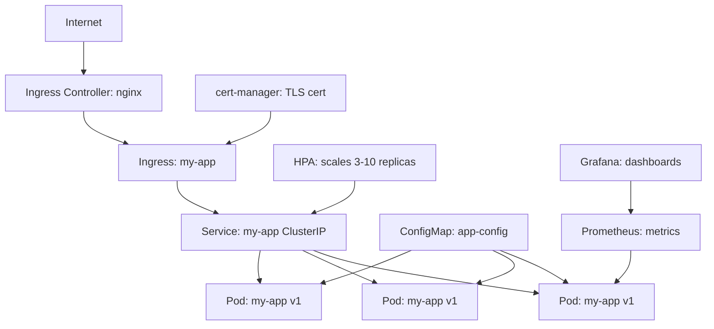

# Project: Deploy a Service With HPA and Ingress

> [!summary] Goal
> Deploy a complete production-shaped service on Kubernetes: Deployment with rolling updates, health probes, resource limits, autoscaling, Ingress with TLS, and monitoring.

## Prerequisites

- A Kubernetes cluster (local: `kind create cluster` or cloud: EKS/AKS/GKE)
- `kubectl` configured
- Helm installed
- A container image pushed to a registry (or use `kind load docker-image`)

---

## Step 1: Create Namespace and ConfigMap

```yaml
apiVersion: v1
kind: Namespace
metadata:
  name: production
---
apiVersion: v1
kind: ConfigMap
metadata:
  name: app-config
  namespace: production
data:
  LOG_LEVEL: info
  APP_ENV: production
```

```bash
kubectl apply -f 01-namespace.yaml
```

---

## Step 2: Create Deployment with Probes and Resources

```yaml
apiVersion: apps/v1
kind: Deployment
metadata:
  name: my-app
  namespace: production
  labels:
    app: my-app
    version: v1
spec:
  replicas: 3
  strategy:
    type: RollingUpdate
    rollingUpdate:
      maxSurge: 1
      maxUnavailable: 1
  selector:
    matchLabels:
      app: my-app
  template:
    metadata:
      labels:
        app: my-app
        version: v1
    spec:
      containers:
        - name: app
          image: nginx:1.25-alpine
          ports:
            - containerPort: 80
          envFrom:
            - configMapRef:
                name: app-config
          resources:
            requests:
              cpu: 100m
              memory: 128Mi
            limits:
              cpu: 500m
              memory: 256Mi
          startupProbe:
            httpGet:
              path: /
              port: 80
            periodSeconds: 5
            failureThreshold: 30
          livenessProbe:
            httpGet:
              path: /
              port: 80
            periodSeconds: 10
            failureThreshold: 3
          readinessProbe:
            httpGet:
              path: /
              port: 80
            periodSeconds: 5
            failureThreshold: 2
```

```bash
kubectl apply -f 02-deployment.yaml
kubectl rollout status deployment/my-app -n production
```

---

## Step 3: Create Service (ClusterIP)

```yaml
apiVersion: v1
kind: Service
metadata:
  name: my-app
  namespace: production
spec:
  selector:
    app: my-app
  ports:
    - port: 80
      targetPort: 80
  type: ClusterIP
```

```bash
kubectl apply -f 03-service.yaml
kubectl get svc my-app -n production
kubectl get endpoints my-app -n production
```

---

## Step 4: Create Ingress with TLS (cert-manager)

### Install cert-manager

```bash
kubectl apply -f https://github.com/cert-manager/cert-manager/releases/latest/download/cert-manager.yaml
kubectl wait --for=condition=Available --timeout=60s -n cert-manager deployment/cert-manager
```

### Create ClusterIssuer

```yaml
apiVersion: cert-manager.io/v1
kind: ClusterIssuer
metadata:
  name: letsencrypt-staging
spec:
  acme:
    server: https://acme-staging-v02.api.letsencrypt.org/directory
    email: admin@example.com
    privateKeySecretRef:
      name: letsencrypt-staging-key
    solvers:
      - http01:
          ingress:
            class: nginx
```

### Create Ingress

```yaml
apiVersion: networking.k8s.io/v1
kind: Ingress
metadata:
  name: my-app
  namespace: production
  annotations:
    cert-manager.io/cluster-issuer: letsencrypt-staging
    nginx.ingress.kubernetes.io/rewrite-target: /
spec:
  ingressClassName: nginx
  tls:
    - hosts:
        - app.example.com
      secretName: my-app-tls
  rules:
    - host: app.example.com
      http:
        paths:
          - path: /
            pathType: Prefix
            backend:
              service:
                name: my-app
                port:
                  number: 80
```

### Install Ingress Controller (if not present)

```bash
# For kind
kubectl apply -f https://raw.githubusercontent.com/kubernetes/ingress-nginx/main/deploy/static/provider/kind/deploy.yaml

# For cloud
helm upgrade --install ingress-nginx ingress-nginx/ingress-nginx --namespace ingress-nginx --create-namespace
```

```bash
kubectl apply -f 04-ingress.yaml
kubectl get ingress my-app -n production
```

---

## Step 5: Create HPA

```yaml
apiVersion: autoscaling/v2
kind: HorizontalPodAutoscaler
metadata:
  name: my-app-hpa
  namespace: production
spec:
  scaleTargetRef:
    apiVersion: apps/v1
    kind: Deployment
    name: my-app
  minReplicas: 3
  maxReplicas: 10
  metrics:
    - type: Resource
      resource:
        name: cpu
        target:
          type: Utilization
          averageUtilization: 70
    - type: Resource
      resource:
        name: memory
        target:
          type: Utilization
          averageUtilization: 80
  behavior:
    scaleDown:
      stabilizationWindowSeconds: 300
      policies:
        - type: Percent
          value: 10
          periodSeconds: 60
    scaleUp:
      stabilizationWindowSeconds: 0
      policies:
        - type: Percent
          value: 100
          periodSeconds: 60
```

```bash
# Ensure metrics-server is installed
kubectl apply -f https://github.com/kubernetes-sigs/metrics-server/releases/latest/download/components.yaml
# Patch for kind (insecure TLS)
kubectl patch deployment metrics-server -n kube-system --type='json' \
  -p='[{"op": "add", "path": "/spec/template/spec/containers/0/args/-", "value": "--kubelet-insecure-tls"}]'

kubectl apply -f 05-hpa.yaml
kubectl get hpa -n production --watch
```

---

## Step 6: Rollout a New Version

```bash
# Update the image
kubectl set image deployment/my-app -n production app=nginx:1.26-alpine

# Watch the rollout
kubectl rollout status deployment/my-app -n production --watch

# Check history
kubectl rollout history deployment/my-app -n production

# If something goes wrong
kubectl rollout undo deployment/my-app -n production
```

---

## Step 7: Verify Everything

```bash
# Pods running
kubectl get pods -n production

# Service endpoints
kubectl get endpoints my-app -n production

# Ingress status
kubectl get ingress my-app -n production

# HPA status
kubectl get hpa my-app-hpa -n production

# Port-forward to test without DNS
kubectl port-forward svc/my-app -n production 8080:80
curl http://localhost:8080

# Check cert-manager certificate
kubectl get certificate -n production
kubectl describe certificate my-app-tls -n production
```

---

## Step 8: Clean Up

```bash
kubectl delete namespace production
# Or delete individual resources:
# kubectl delete -f 05-hpa.yaml
# kubectl delete -f 04-ingress.yaml
# kubectl delete -f 03-service.yaml
# kubectl delete -f 02-deployment.yaml
# kubectl delete -f 01-namespace.yaml
```

---

## Architecture Overview



---

## Cross-Links

- [[CICD/Kubernetes/02_Core/01_Deployments_Rollouts_and_Strategies]] for deployment strategies
- [[CICD/Kubernetes/02_Core/02_Ingress_and_Service_Types]] for Ingress details
- [[CICD/Kubernetes/02_Core/03_HealthChecks_Resources_and_HPA]] for probes and autoscaling
- [[CICD/Kubernetes/04_Playbooks/04_Monitoring_and_Observability_with_Prometheus]] for monitoring setup
