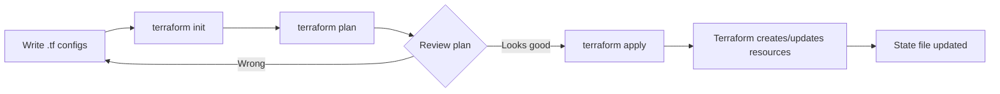

# Terraform Workflow and State

> [!summary] Goal
> Understand why Terraform exists, the core workflow (`init` → `plan` → `apply`), state fundamentals, and how Terraform differs from other IaC tools. Build from knowing nothing about Terraform to running your first `terraform apply`.

## Table of Contents

1. [Why Terraform](#why-terraform)
2. [Terraform vs Alternatives](#terraform-vs-alternatives)
3. [Core Workflow](#core-workflow)
4. [State Deep Dive](#state-deep-dive)
5. [Configuration Directory Structure](#configuration-directory-structure)

---

## Why Terraform

> [!info] Infrastructure as Code (IaC)
> IaC is managing infrastructure — servers, databases, networks, load balancers — through machine-readable definition files, not manual processes. Instead of clicking "Create Instance" in the AWS console, you write `resource "aws_instance" "web" { ami = "ami-abc" }` and run `terraform apply`.

**Problems Terraform solves**:

```text
Manual infra problems:
  - Click-ops is unrepeatable: no two environments are identical.
  - Configuration drift: manual fixes accumulate, state is unknown.
  - No version history: "who changed the security group and when?"
  - No code review: changes are made directly, not reviewed.
  - No disaster recovery: rebuilding after an outage takes days.

Terraform solutions:
  - Declarative: you describe the desired state, Terraform handles the how.
  - Immutable: resources are replaced with new ones (when needed), not modified in place.
  - State tracking: Terraform knows what it manages and can detect drift.
  - Plan: preview changes before applying them.
  - Version control: `.tf` files in Git → PRs, reviews, rollbacks.
```

---

## Terraform vs Alternatives

| Tool | Type | State | Language | Maturity | Best for |
|:-----|:----:|:----:|:--------:|:--------:|----------|
| **Terraform** | Declarative | Native (`.tfstate`) | HCL | Mature (1.x stable) | Multi-cloud, broadest provider ecosystem |
| **Pulumi** | Declarative | Managed | TypeScript, Python, Go, C#, Java | Growing | Teams that prefer general-purpose languages |
| **AWS CDK** | Declarative | CloudFormation | TypeScript, Python, Java, C#, Go | Mature | AWS-only, CloudFormation-based |
| **CloudFormation** | Declarative | Native | JSON/YAML | Mature | AWS-only, deep AWS integration |
| **OpenTofu** | Declarative | Native (TF state) | HCL | New (fork) | Terraform-compatible, open-source governance |
| **Ansible** | Imperative | No native | YAML | Mature | Config management, app deployment, not pure IaC |
| **Bicep** | Declarative | ARM template | Bicep | Mature | Azure-only |

```text
Terraform wins when:
  - You need multi-cloud (AWS + GCP + Azure in one codebase).
  - You want the largest provider ecosystem (2,000+ providers).
  - Your team knows HCL or prefers DSL over general-purpose languages.
  - You need a mature, battle-tested tool with the most community content.
```

---

## Core Workflow



### `terraform init`

```bash
# Initialize a working directory:
terraform init

# With specific backend config (no interactive prompts):
terraform init -backend-config="bucket=my-tf-state" \
               -backend-config="key=prod/network/terraform.tfstate" \
               -backend-config="region=us-east-1"

# Upgrade providers and modules to latest allowed versions:
terraform init -upgrade

# Migrate state from local to remote backend:
terraform init -migrate-state

# Reconfigure backend (no migration — discard local cache):
terraform init -reconfigure
```

```text
What init does:
  1. Downloads providers (from registry or mirrors).
  2. Downloads modules (from registry, git, or local).
  3. Configures the backend (local or remote).
  4. Locks provider version in `.terraform.lock.hcl`.
```

### `terraform plan`

```bash
# Generate and review execution plan:
terraform plan

# Output to a file (for CI — apply with plan):
terraform plan -out=tfplan

# Save plan as JSON (for policy checks):
terraform plan -out=tfplan && terraform show -json tfplan > plan.json

# Plan with variable file:
terraform plan -var-file=production.tfvars
```

### `terraform apply`

```bash
# Apply with plan file (safe — only applies what was planned):
terraform apply tfplan

# Interactive apply (plan shown, prompts for yes):
terraform apply

# Non-interactive (CI):
terraform apply -auto-approve

# Replace a specific resource (force recreation):
terraform apply -replace="aws_instance.web"

# Apply with parallelism control:
terraform apply -parallelism=5
```

### `terraform destroy`

```bash
# Destroy everything managed by this config:
terraform destroy

# Auto-approve destroy:
terraform destroy -auto-approve

# Destroy specific resources (via plan):
terraform plan -destroy -target="aws_instance.web" -out=destroy_plan
terraform apply destroy_plan
```

---

## State Deep Dive

> [!info] State file
> Terraform state maps the resources in your configuration to the real-world infrastructure it manages. Every time Terraform runs, it compares the current state to the configuration and detects differences. The state file (`.tfstate`) is a JSON document.
resource registry `aws_instance.web` → real EC2 instance `i-0abcd1234`.

### State file anatomy

```json
{
  "version": 4,
  "terraform_version": "1.6.0",
  "resources": [
    {
      "module": "module.vpc",              // Empty = root module
      "mode": "managed",                    // "data" = data source
      "type": "aws_vpc",
      "name": "main",
      "provider": "provider[\"registry.terraform.io/hashicorp/aws\"]",
      "instances": [
        {
          "index_key": 0,                  // count.index or for_each key
          "schema_version": 1,
          "attributes": {
            "id": "vpc-0a1b2c3d4e5f",
            "cidr_block": "10.0.0.0/16",
            "enable_dns_support": true
          },
          "sensitive_attributes": [],
          "private": "...base64..."         // Encrypted sensitive data
        }
      ]
    },
    {
      "mode": "data",
      "type": "aws_availability_zones",
      "name": "available",
      "instances": [{ "attributes": { "names": ["us-east-1a", "us-east-1b"] }}]
    }
  ]
}
```

### State management commands

```bash
# List all resources in state:
terraform state list
# module.vpc.module.eks.aws_eks_cluster.this[0]
# data.aws_availability_zones.available

# Show full attributes of a resource:
terraform state show aws_instance.web

# Move a resource (rename or move between modules):
terraform state mv aws_instance.web module.frontend.aws_instance.web

# Remove a resource from state (without destroying it):
terraform state rm aws_instance.web

# Pull state to local file (for debugging):
terraform state pull > backup.tfstate

# Push local state (dangerous — overwrites remote state):
terraform state push backup.tfstate

#$ Force unlock (⚠️ use only when sure no other process is applying):
terraform force-unlock <LOCK_ID>
```

### State security

```text
State files CAN contain secrets:
  - Resource attributes like `initial_password`, `secret_key`, `private_key_pem`.
  - Mark variables as `sensitive = true` to reduce exposure.
  - Always: store state in encrypted backends (S3 + DynamoDB, GCS, AzureRM).
  - Never: commit `.tfstate` to Git (add `*.tfstate` to `.gitignore`).
  - Always: control access to state (IAM roles, bucket policies).
```

---

## Configuration Directory Structure

```text
Standard layout for a real project:

my-infra/
├── main.tf              # Root configuration, provider config, backend config
├── variables.tf         # Input variables
├── outputs.tf           # Output values
├── versions.tf          # Required provider versions (optional but recommended)
├── terraform.tfvars     # Variable values (production)
├── terraform.tfvars.staging  # Variable values for staging
├── modules/
│   ├── vpc/
│   │   ├── main.tf
│   │   ├── variables.tf
│   │   └── outputs.tf
│   └── eks/
│       ├── main.tf
│       ├── variables.tf
│       └── outputs.tf
└── .terraform.lock.hcl  # Auto-generated dependency lock file
```

### `.gitignore` for Terraform

```gitignore
*.tfstate
*.tfstate.*
.terraform/
crash.log
override.tf
override.tf.json
*_override.tf
*_override.tf.json
```

---

## Cross-Links

- [[CICD/Terraform/01_Foundations/02_Providers_Resources_and_Data_Sources]] for HCL syntax, resources, and data sources
- [[CICD/Terraform/01_Foundations/03_Variables_Outputs_and_Locals]] for variable types and validation
- [[CICD/Terraform/02_Core/02_State_Backends_and_Locking]] for S3/DDB backend and state migration
- [[CICD/Terraform/02_Core/03_Plan_Apply_Safety_and_Drift]] for `terraform apply` safety features
