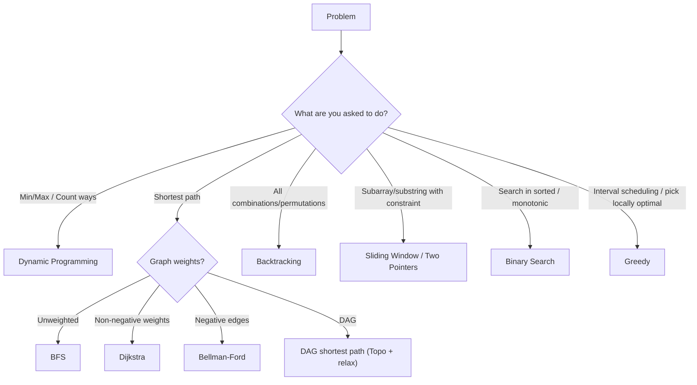
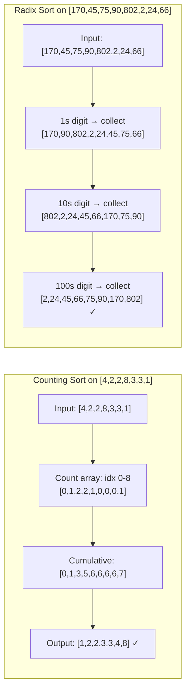
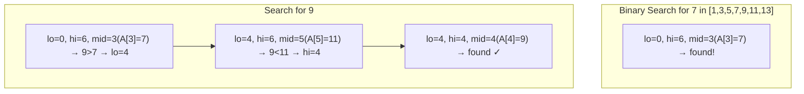
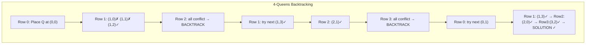
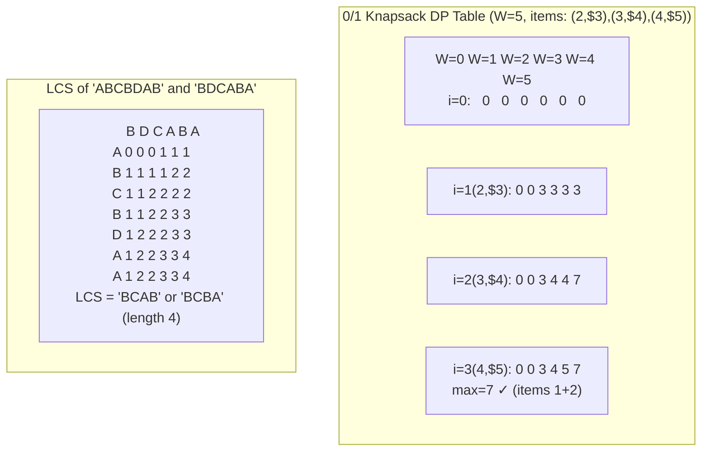
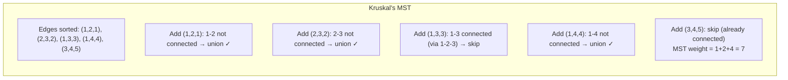
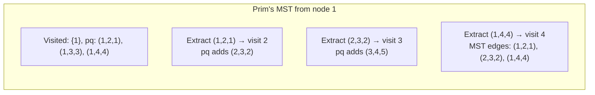
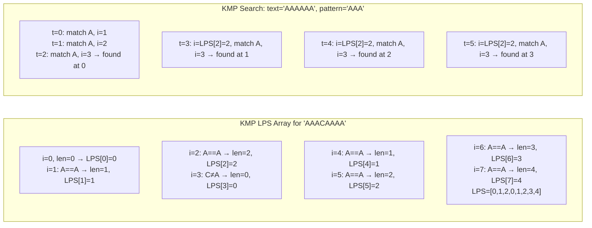

# Algorithms - Complete Guide (Beginner to Advanced)

> [!summary] One-Stop Revision
> Use this note for patterns, invariants, and decision rules. For full Java implementations, jump to `[[JAVA_IMPL/Java_03_Algorithms_Part1]]` and `[[JAVA_IMPL/Java_04_Algorithms_Part2]]` (embedded at the relevant sections below).

> [!tip] Quick Jump
> - Implementations index: [[JAVA_IMPL/Java_00_Index_and_CheatSheet]]
> - Data structures reference: [[DataStructures]]
> - Practice list: [[Questions]]

![[assets/big-o-comparison.png|700]]

---

## Table of Contents

1. [Time and Space Complexity Analysis](#1-time-and-space-complexity-analysis)
2. [Sorting Algorithms](#2-sorting-algorithms)
3. [Searching Algorithms](#3-searching-algorithms)
4. [Recursion and Backtracking](#4-recursion-and-backtracking)
5. [Divide and Conquer](#5-divide-and-conquer)
6. [Greedy Algorithms](#6-greedy-algorithms)
7. [Dynamic Programming](#greedy-vs-dynamic-programming)
8. [Graph Algorithms](#8-graph-algorithms)
9. [String Algorithms](#9-string-algorithms)
10. [Mathematical Algorithms](#10-mathematical-algorithms)
11. [Bit Manipulation](#11-bit-manipulation)
12. [Two Pointers and Sliding Window](#12-two-pointers-and-sliding-window)
13. [Binary Search (Advanced Applications)](#binary-search)
14. [Interval Algorithms](#14-interval-algorithms)
15. [Randomized Algorithms](#15-randomized-algorithms)
16. [Computational Geometry](#16-computational-geometry)
17. [Network Flow](#17-network-flow)
18. [NP-Completeness and Approximation](#18-np-completeness-and-approximation)

---

## Algorithm Selection (Fast)



## 1. Time and Space Complexity Analysis

### Big-O Notation

> [!summary] Recall
> - Big-O is an upper bound on growth; constants and lower-order terms drop.
> - Most interview complexity questions: identify loops, recursion tree, and dominant operations.

| Notation | Name | Example |
|----------|------|---------|
| O(1) | Constant | Array access, hash lookup |
| O(log n) | Logarithmic | Binary search |
| O(n) | Linear | Linear search, single loop |
| O(n log n) | Linearithmic | Merge sort, heap sort |
| O(n^2) | Quadratic | Bubble sort, nested loops |
| O(n^3) | Cubic | Floyd-Warshall, matrix multiplication |
| O(2^n) | Exponential | Subsets, recursive Fibonacci |
| O(n!) | Factorial | Permutations |

### Asymptotic Notations

| Notation | Meaning |
|----------|---------|
| **O (Big-O)** | Upper bound (worst case) |
| **Ω (Omega)** | Lower bound (best case) |
| **Θ (Theta)** | Tight bound (exact growth rate) |
| **o (Little-o)** | Strict upper bound (not tight) |
| **ω (Little-omega)** | Strict lower bound (not tight) |

### Recurrence Relations

> [!tip] Common shape recognition
> - `T(n)=T(n/2)+O(1)` is repeated halving (binary search).
> - `T(n)=2T(n/2)+O(n)` is split + merge (merge sort).

| Recurrence | Solution | Algorithm |
|------------|----------|-----------|
| T(n) = T(n/2) + O(1) | O(log n) | Binary search |
| T(n) = T(n-1) + O(1) | O(n) | Linear recursion |
| T(n) = 2T(n/2) + O(n) | O(n log n) | Merge sort |
| T(n) = 2T(n/2) + O(1) | O(n) | Tree traversal |
| T(n) = T(n-1) + O(n) | O(n^2) | Selection sort |
| T(n) = 2T(n-1) + O(1) | O(2^n) | Tower of Hanoi |

### Master Theorem

For recurrences of the form `T(n) = aT(n/b) + O(n^d)`:

| Condition | Result |
|-----------|--------|
| d < log_b(a) | O(n^(log_b(a))) |
| d = log_b(a) | O(n^d * log n) |
| d > log_b(a) | O(n^d) |

### Amortized Analysis

- **Aggregate method** — total cost over n operations / n
- **Accounting method** — assign amortized cost to each operation; save credits
- **Potential method** — define potential function Φ; amortized = actual + ΔΦ

### Space Complexity

- **Auxiliary space** — extra space used beyond input
- **In-place** — O(1) auxiliary space
- **Recursion stack** — counts toward space complexity (O(depth))

### Resources

- *CLRS* — Chapters 3-4
- [Big-O Cheat Sheet](https://www.bigocheatsheet.com/)
- [Abdul Bari - Time Complexity (YouTube)](https://www.youtube.com/watch?v=9TlHvipP5yA)

---

## 2. Sorting Algorithms

> [!summary] When to Use What

```mermaid
flowchart TD
    subgraph Quick["QuickSort Partition on [3,7,8,5,2,1,9,4]"]
        Q1["pivot=4, i=-1, j=0"] --> Q2["j=0: 3≤4 → swap(3,3), i=0"]
        Q2 --> Q3["j=1: 7>4 → skip"]
        Q3 --> Q4["j=2: 8>4 → skip"]
        Q4 --> Q5["j=3: 5>4 → skip"]
        Q5 --> Q6["j=4: 2≤4 → swap(7,2), i=1"]
        Q6 --> Q7["j=5: 1≤4 → swap(8,1), i=2"]
        Q7 --> Q8["j=6: 9>4 → skip"]
        Q8 --> Q9["swap pivot: swap(7,4) → [3,2,1,4,8,7,9,5]<br/>pivot=4 at index 3 ✓"]
    end
    subgraph Merge["MergeSort divide + merge"]
        M1["[38,27,43,3,9,82,10]"] --> M2["[38,27,43,3] & [9,82,10]"]
        M2 --> M3["divide down to singles"]
        M3 --> M4["merge [27,38] & [3,43] → [3,27,38,43]"]
        M4 --> M5["merge [9,82] & [10] → [9,10,82]"]
        M5 --> M6["merge [3,27,38,43] & [9,10,82]"]
        M6 --> M7["Result: [3,9,10,27,38,43,82] ✓"]
    end
```



> - Nearly sorted / small n: insertion sort.
> - General purpose: quick sort (randomized/3-way) or built-in sorts.
> - Stability required: merge sort / timsort.
> - Hard worst-case guarantees: heap sort / merge sort.

> [!tip] Java implementation reference
> ![[JAVA_IMPL/Java_03_Algorithms_Part1#Section J: Sorting Algorithms]]

### Comparison-Based Sorts

| Algorithm | Best | Average | Worst | Space | Stable | In-Place |
|-----------|:---:|:---:|:---:|:---:|:---:|:---:|
| **Bubble Sort** | O(n) | O(n^2) | O(n^2) | O(1) | Yes | Yes |
| **Selection Sort** | O(n^2) | O(n^2) | O(n^2) | O(1) | No | Yes |
| **Insertion Sort** | O(n) | O(n^2) | O(n^2) | O(1) | Yes | Yes |
| **Merge Sort** | O(n log n) | O(n log n) | O(n log n) | O(n) | Yes | No |
| **Quick Sort** | O(n log n) | O(n log n) | O(n^2) | O(log n) | No | Yes |
| **Heap Sort** | O(n log n) | O(n log n) | O(n log n) | O(1) | No | Yes |
| **Tim Sort** | O(n) | O(n log n) | O(n log n) | O(n) | Yes | No |
| **Shell Sort** | O(n log n) | Depends on gap | O(n^2) | O(1) | No | Yes |
| **Tree Sort** | O(n log n) | O(n log n) | O(n^2) | O(n) | Yes | No |

### Non-Comparison Sorts

| Algorithm | Time | Space | Condition |
|-----------|:---:|:---:|-----------|
| **Counting Sort** | O(n + k) | O(n + k) | k = range of input |
| **Radix Sort** | O(d * (n + k)) | O(n + k) | d = number of digits |
| **Bucket Sort** | O(n + k) avg | O(n + k) | Uniformly distributed |

### Lower Bound

- Comparison-based sorting has a lower bound of **Ω(n log n)**
- Non-comparison sorts can achieve O(n) under constraints



### Detailed Notes on Key Sorts

#### Quick Sort

```
QuickSort(arr, low, high):
    if low < high:
        pivotIndex = Partition(arr, low, high)
        QuickSort(arr, low, pivotIndex - 1)
        QuickSort(arr, pivotIndex + 1, high)

Partition(arr, low, high):
    pivot = arr[high]
    i = low - 1
    for j = low to high - 1:
        if arr[j] <= pivot:
            i++
            swap(arr[i], arr[j])
    swap(arr[i+1], arr[high])
    return i + 1
```

- **Pivot selection strategies**: Last element, first element, median-of-three, random
- **3-way partition (Dutch National Flag)**: Handles duplicates efficiently
- **Randomized QuickSort**: Expected O(n log n) regardless of input
- **Tail Call Optimization**: Recurse on smaller partition first

#### Merge Sort

```
MergeSort(arr, l, r):
    if l < r:
        mid = (l + r) / 2
        MergeSort(arr, l, mid)
        MergeSort(arr, mid+1, r)
        Merge(arr, l, mid, r)
```

- Stable, predictable O(n log n)
- Natural choice for linked lists (no random access needed)
- External sorting: merge sort variant for data exceeding memory
- Count inversions using merge sort

#### Heap Sort

1. Build max-heap from array: O(n)
2. Repeatedly extract max and place at end: O(n log n)
- Not stable, but in-place and guaranteed O(n log n)

### When to Use What

| Scenario | Best Choice |
|----------|-------------|
| Small arrays (n < 50) | Insertion Sort |
| Nearly sorted | Insertion Sort or Tim Sort |
| General purpose | Quick Sort (randomized) |
| Guaranteed worst case | Merge Sort or Heap Sort |
| Stability required | Merge Sort or Tim Sort |
| Limited memory | Heap Sort |
| Integer keys in range | Counting Sort |
| Strings / large integers | Radix Sort |
| Uniform distribution | Bucket Sort |
| Linked list | Merge Sort |

### Pseudocode

#### Insertion Sort
```
InsertionSort(A[1 .. n]):
    for i ← 2 to n:
        key ← A[i]
        j ← i - 1
        while j ≥ 1 and A[j] > key:
            A[j + 1] ← A[j]
            j ← j - 1
        A[j + 1] ← key
```

#### Selection Sort
```
SelectionSort(A[1 .. n]):
    for i ← 1 to n - 1:
        minIdx ← i
        for j ← i + 1 to n:
            if A[j] < A[minIdx]:
                minIdx ← j
        swap A[i] and A[minIdx]
```

#### Counting Sort
```
CountingSort(A[1 .. n], k):       // elements in range [0, k]
    count[0 .. k] ← {0}
    output[1 .. n] ← {0}
    for i ← 1 to n:
        count[A[i]] ← count[A[i]] + 1
    for i ← 1 to k:
        count[i] ← count[i] + count[i - 1]
    for i ← n downto 1:
        output[count[A[i]]] ← A[i]
        count[A[i]] ← count[A[i]] - 1
    return output
```

#### Radix Sort (LSD)
```
RadixSort(A[1 .. n], d):          // d = max number of digits
    for pos ← 1 to d:
        // Use stable sort on digit pos (typically Counting Sort)
        CountingSortByDigit(A, pos)
```

#### Bucket Sort
```
BucketSort(A[1 .. n]):
    number of buckets ← n
    buckets[1 .. n] ← n empty lists
    for i ← 1 to n:
        idx ← ⌊n * A[i]⌋ + 1         // map value to bucket
        buckets[idx].insert(A[i])
    for i ← 1 to n:
        Sort(buckets[i])              // insertion sort
    concatenate buckets[1 .. n] into result
    return result
```

### Resources

- [Sorting Algorithms - GeeksforGeeks](https://www.geeksforgeeks.org/sorting-algorithms/)
- [Sorting Algorithms Animations](https://www.toptal.com/developers/sorting-algorithms)
- [Abdul Bari - Sorting (YouTube)](https://www.youtube.com/playlist?list=PLDN4rrl48XKpZkf03iYFl-O29szjTrs_O)
- *CLRS* — Chapters 6-9

---

## 3. Searching Algorithms

> [!summary] Binary Search Checklist
> - Predicate is monotonic.
> - Loop invariants are explicit (`low` is feasible/infeasible depending on style).
> - Mid computation avoids overflow.

> [!tip] Java implementation reference



> ![[JAVA_IMPL/Java_03_Algorithms_Part1#Section K: Searching Algorithms]]

### Linear Search

- Time: O(n), Space: O(1)
- Works on unsorted data

### Binary Search

- Time: O(log n), Space: O(1) iterative / O(log n) recursive
- **Requires sorted input**

```
BinarySearch(arr, target):
    low = 0, high = n - 1
    while low <= high:
        mid = low + (high - low) / 2    # prevents overflow
        if arr[mid] == target: return mid
        elif arr[mid] < target: low = mid + 1
        else: high = mid - 1
    return -1
```

### Binary Search Variants

| Variant | Description |
|---------|-------------|
| Lower bound | First element ≥ target |
| Upper bound | First element > target |
| First occurrence | First index of target |
| Last occurrence | Last index of target |
| Search in rotated sorted array | Modified binary search |
| Peak element | Find local maximum |
| Search in 2D matrix | Treat as 1D / staircase search |
| Binary search on answer | Minimize/maximize with monotonic predicate |
| Ternary search | Unimodal function max/min |

### Interpolation Search

- Time: O(log log n) average for uniformly distributed data, O(n) worst
- Estimates position: `pos = low + ((target - arr[low]) * (high - low)) / (arr[high] - arr[low])`

### Exponential Search

- Time: O(log n)
- Find range using exponential jumps, then binary search within range
- Useful for unbounded/infinite arrays

### Jump Search

- Time: O(√n), Space: O(1)
- Jump by √n steps, then linear search in block

### Fibonacci Search

- Time: O(log n)
- Divides array using Fibonacci numbers; no multiplication/division

### Pseudocode

#### Linear Search
```
LinearSearch(A[1 .. n], key):
    for i ← 1 to n:
        if A[i] = key:
            return i
    return -1
```

#### Binary Search Variants

##### Lower Bound (first element ≥ x)
```
LowerBound(A[1 .. n], x):
    lo ← 1, hi ← n, ans ← n + 1
    while lo ≤ hi:
        mid ← (lo + hi) / 2
        if A[mid] ≥ x:
            ans ← mid
            hi ← mid - 1
        else:
            lo ← mid + 1
    return ans
```

##### Upper Bound (first element > x)
```
UpperBound(A[1 .. n], x):
    lo ← 1, hi ← n, ans ← n + 1
    while lo ≤ hi:
        mid ← (lo + hi) / 2
        if A[mid] > x:
            ans ← mid
            hi ← mid - 1
        else:
            lo ← mid + 1
    return ans
```

##### First Occurrence
```
FirstOccurrence(A[1 .. n], x):
    idx ← LowerBound(A, x)
    if idx ≤ n and A[idx] = x: return idx
    return -1
```

##### Search in Rotated Sorted Array
```
SearchRotated(A[1 .. n], target):
    lo ← 1, hi ← n
    while lo ≤ hi:
        mid ← (lo + hi) / 2
        if A[mid] = target: return mid
        if A[lo] ≤ A[mid]:              // left half is sorted
            if A[lo] ≤ target < A[mid]:
                hi ← mid - 1
            else:
                lo ← mid + 1
        else:                           // right half is sorted
            if A[mid] < target ≤ A[hi]:
                lo ← mid + 1
            else:
                hi ← mid - 1
    return -1
```

#### Exponential Search
```
ExponentialSearch(A[1 .. n], x):
    if A[1] = x: return 1
    i ← 1
    while i ≤ n and A[i] ≤ x:
        i ← i * 2
    return BinarySearch(A, i/2 + 1, min(i, n), x)
```

### Resources

- [Binary Search - GeeksforGeeks](https://www.geeksforgeeks.org/binary-search/)
- [Binary Search - Errichto (YouTube)](https://www.youtube.com/watch?v=GU7DpgHINWQ)
- *CLRS* — Chapter 2

---

## 4. Recursion and Backtracking



> [!warning] Common pitfalls
> - Missing base case.
> - Shared mutable state not undone during backtracking.
> - Exponential blowups: add pruning, ordering heuristics, or memoization.

### Recursion

#### Key Concepts

- **Base case** — termination condition
- **Recursive case** — problem broken into smaller subproblems
- **Call stack** — each call pushes a frame; unwinds on return
- **Stack overflow** — too many recursive calls exceed stack limit
- **Tail recursion** — recursive call is the last operation; can be optimized by compiler

#### Types of Recursion

| Type | Description |
|------|-------------|
| **Linear** | Single recursive call |
| **Binary/Tree** | Two or more recursive calls |
| **Tail** | Recursive call is last operation |
| **Head** | Recursive call is first operation |
| **Mutual** | Function A calls B, B calls A |
| **Nested** | Argument to recursive call is itself a recursive call |

#### Common Recursive Problems

- Factorial, Fibonacci
- Tower of Hanoi — O(2^n)
- Power function (fast exponentiation) — O(log n)
- Print all subsequences
- Merge sort, quick sort

### Backtracking

Backtracking is a refined brute-force approach that systematically searches for solutions by building candidates incrementally and abandoning a candidate ("backtracking") as soon as it determines the candidate cannot lead to a valid solution.

#### Template

```
Backtrack(candidate, state):
    if isComplete(candidate):
        record(candidate)
        return
    for each choice in getChoices(state):
        if isValid(choice, state):
            makeChoice(choice, state)
            Backtrack(candidate, state)
            undoChoice(choice, state)    # backtrack
```

#### Pruning Techniques

- **Constraint propagation** — eliminate choices early
- **Ordering heuristics** — try most constrained variable first (MRV)
- **Symmetry breaking** — avoid redundant explorations
- **Bounding** — skip branches that cannot improve on current best (branch & bound)

#### Classic Backtracking Problems

| Problem | Description | Complexity |
|---------|-------------|:---:|
| N-Queens | Place N queens on N×N board | O(N!) |
| Sudoku Solver | Fill 9×9 grid | Exponential |
| Permutations | Generate all permutations | O(N! * N) |
| Combinations | Generate C(n, k) combinations | O(C(n,k) * k) |
| Subsets (Power Set) | Generate all subsets | O(2^n * n) |
| Word Search | Find word in grid | O(N * M * 4^L) |
| Palindrome Partitioning | All palindrome partitions | Exponential |
| Combination Sum | Combinations summing to target | Exponential |
| Generate Parentheses | Valid parentheses strings | O(4^n / √n) |
| Letter Combinations of Phone | All letter combos | O(4^n) |
| Rat in a Maze | Path finding with constraints | O(2^(n^2)) |
| Graph Coloring | Color graph with m colors | O(m^V) |
| Hamiltonian Cycle | Visit all vertices once | O(N!) |
| Knight's Tour | Visit all squares on chessboard | O(8^(N^2)) |

### Pseudocode

#### Tower of Hanoi
```
TowerOfHanoi(n, source, target, auxiliary):
    if n = 1:
        Move disk from source to target
        return
    TowerOfHanoi(n - 1, source, auxiliary, target)
    Move disk from source to target
    TowerOfHanoi(n - 1, auxiliary, target, source)
```

#### N-Queens
```
NQueens(n):
    board[1 .. n][1 .. n] ← empty
    Solve(board, col ← 1)

Solve(board, col):
    if col > n: return true (solution found)
    for row ← 1 to n:
        if IsSafe(board, row, col):
            board[row][col] ← 'Q'
            if Solve(board, col + 1): return true
            board[row][col] ← empty
    return false

IsSafe(board, row, col):
    // Check row on left side
    for j ← 1 to col - 1:
        if board[row][j] = 'Q': return false
    // Check upper diagonal
    for i, j ← row - 1, col - 1; i ≥ 1 and j ≥ 1; i ← i - 1, j ← j - 1:
        if board[i][j] = 'Q': return false
    // Check lower diagonal
    for i, j ← row + 1, col - 1; i ≤ n and j ≥ 1; i ← i + 1, j ← j - 1:
        if board[i][j] = 'Q': return false
    return true
```

#### Generate All Permutations
```
Permute(A[1 .. n], index ← 1):
    if index = n:
        output A
        return
    for i ← index to n:
        swap A[index] and A[i]
        Permute(A, index + 1)
        swap A[index] and A[i]          // backtrack
```

#### Generate All Subsets
```
Subsets(A[1 .. n]):
    result ← [[]]
    for i ← 1 to n:
        newSubsets ← []
        for each subset in result:
            newSubsets.append(subset + [A[i]])
        result ← result + newSubsets
    return result
```

#### Combination Sum
```
CombinationSum(A[1 .. n], target):
    result ← []
    Backtrack(A, target, 1, [], result)
    return result

Backtrack(A, remain, start, path, result):
    if remain = 0:
        result.append(copy of path)
        return
    if remain < 0: return
    for i ← start to n:
        path.append(A[i])
        Backtrack(A, remain - A[i], i, path, result)   // i for unlimited, i+1 for one-use
        path.pop()
```

### Resources

- [Backtracking - GeeksforGeeks](https://www.geeksforgeeks.org/backtracking-algorithms/)
- [Recursion - Aditya Verma (YouTube)](https://www.youtube.com/playlist?list=PL_z_8CaSLPWeT1ffjiImo0sYTcnLzo-wY)
- [Backtracking - Striver (YouTube)](https://www.youtube.com/playlist?list=PLgUwDviBIf0p4ozDR_kJJkONnb1wdx2Ma)

---

## 5. Divide and Conquer

### Overview

Split the problem into smaller subproblems, solve recursively, and combine results.

**Three steps:**
1. **Divide** — break problem into subproblems
2. **Conquer** — solve subproblems recursively
3. **Combine** — merge subproblem solutions

### Classic Problems

| Problem | Recurrence | Complexity |
|---------|------------|:---:|
| **Binary Search** | T(n) = T(n/2) + O(1) | O(log n) |
| **Merge Sort** | T(n) = 2T(n/2) + O(n) | O(n log n) |
| **Quick Sort** | T(n) = T(k) + T(n-k-1) + O(n) | O(n log n) avg |
| **Strassen's Matrix Multiplication** | T(n) = 7T(n/2) + O(n^2) | O(n^2.807) |
| **Karatsuba Multiplication** | T(n) = 3T(n/2) + O(n) | O(n^1.585) |
| **Closest Pair of Points** | T(n) = 2T(n/2) + O(n) | O(n log n) |
| **Count Inversions** | T(n) = 2T(n/2) + O(n) | O(n log n) |
| **Median of Medians** | T(n) = T(n/5) + T(7n/10) + O(n) | O(n) |
| **FFT** | T(n) = 2T(n/2) + O(n) | O(n log n) |
| **Maximum Subarray (D&C)** | T(n) = 2T(n/2) + O(n) | O(n log n) |

### Quick Select (Kth Smallest)

- Average O(n), Worst O(n^2)
- With Median of Medians pivot: guaranteed O(n)
- Uses partition step from QuickSort

### Pseudocode

#### QuickSelect (Kth Smallest)
```
QuickSelect(A[1 .. n], k):
    return SelectHelper(A, 1, n, k)

SelectHelper(A, lo, hi, k):
    pivotIdx ← Partition(A, lo, hi)
    if pivotIdx = k: return A[pivotIdx]
    if pivotIdx > k:
        return SelectHelper(A, lo, pivotIdx - 1, k)
    else:
        return SelectHelper(A, pivotIdx + 1, hi, k)

Partition(A, lo, hi):
    pivot ← A[hi]
    i ← lo - 1
    for j ← lo to hi - 1:
        if A[j] ≤ pivot:
            i ← i + 1, swap A[i] and A[j]
    swap A[i + 1] and A[hi]
    return i + 1
```

#### Closest Pair of Points (D&C)
```
ClosestPair(P[1 .. n]):                          // points sorted by x
    return CPHelper(P, 1, n)

CPHelper(P, lo, hi):
    if hi - lo + 1 ≤ 3: return BruteForceMinDist(P, lo, hi)
    mid ← (lo + hi) / 2
    midX ← P[mid].x
    dL ← CPHelper(P, lo, mid)
    dR ← CPHelper(P, mid + 1, hi)
    d ← min(dL, dR)
    // Build strip of points within d of midX
    strip ← []
    for i ← lo to hi:
        if |P[i].x - midX| < d: strip.append(P[i])
    // Sort strip by y and check d-separated pairs (at most 7 checks)
    Sort strip by y
    for i ← 1 to |strip|:
        for j ← i + 1 to min(|strip|, i + 7):
            dist ← EuclideanDist(strip[i], strip[j])
            d ← min(d, dist)
    return d
```

#### Count Inversions (Merge-Based)
```
CountInversions(A[1 .. n]):
    return MergeSortCount(A, 1, n)

MergeSortCount(A, lo, hi):
    if lo ≥ hi: return 0
    mid ← (lo + hi) / 2
    count ← MergeSortCount(A, lo, mid) + MergeSortCount(A, mid + 1, hi)
    // Merge and count cross-inversions
    left ← A[lo .. mid], right ← A[mid + 1 .. hi]
    i ← 1, j ← 1, k ← lo
    while i ≤ |left| and j ≤ |right|:
        if left[i] ≤ right[j]:
            A[k] ← left[i], i ← i + 1
        else:
            A[k] ← right[j], j ← j + 1
            count ← count + (|left| - i + 1)   // all remaining left elements
        k ← k + 1
    copy remaining left and right into A
    return count
```

#### Maximum Subarray (D&C)
```
MaxSubarrayDC(A[1 .. n]):
    return DCHelper(A, 1, n)

DCHelper(A, lo, hi):
    if lo = hi: return A[lo]
    mid ← (lo + hi) / 2
    leftMax ← DCHelper(A, lo, mid)
    rightMax ← DCHelper(A, mid + 1, hi)
    crossMax ← MaxCrossingSum(A, lo, mid, hi)
    return max(leftMax, rightMax, crossMax)

MaxCrossingSum(A, lo, mid, hi):
    leftSum ← -∞, sum ← 0
    for i ← mid downto lo:
        sum ← sum + A[i], leftSum ← max(leftSum, sum)
    rightSum ← -∞, sum ← 0
    for i ← mid + 1 to hi:
        sum ← sum + A[i], rightSum ← max(rightSum, sum)
    return leftSum + rightSum
```

### Resources

- [Divide & Conquer - GeeksforGeeks](https://www.geeksforgeeks.org/divide-and-conquer/)
- *CLRS* — Chapter 4

---

## 6. Greedy Algorithms

### Overview

A greedy algorithm makes the locally optimal choice at each step, hoping to find the global optimum. Works when the problem has:

1. **Greedy choice property** — a locally optimal choice leads to a globally optimal solution
2. **Optimal substructure** — an optimal solution contains optimal solutions to subproblems

### Proof Techniques

- **Greedy stays ahead** — show greedy solution is at least as good at each step
- **Exchange argument** — show any optimal solution can be transformed to the greedy solution without loss

### Classic Greedy Problems

| Problem | Description | Complexity |
|---------|-------------|:---:|
| **Activity Selection** | Max non-overlapping intervals | O(n log n) |
| **Fractional Knapsack** | Maximize value with fractional items | O(n log n) |
| **Huffman Coding** | Optimal prefix-free encoding | O(n log n) |
| **Job Sequencing with Deadlines** | Maximize profit | O(n^2) or O(n log n) |
| **Minimum Platforms** | Train station problem | O(n log n) |
| **Coin Change (specific denominations)** | Min coins (greedy works for canonical systems) | O(n) |
| **Kruskal's MST** | Minimum spanning tree | O(E log E) |
| **Prim's MST** | Minimum spanning tree | O(E log V) |
| **Dijkstra's Shortest Path** | Single source shortest path (non-negative weights) | O(E log V) |
| **Interval Scheduling** | Max non-overlapping intervals | O(n log n) |
| **Interval Partitioning** | Min rooms/resources | O(n log n) |
| **Task Scheduler** | Min idle time between same tasks | O(n) |
| **Gas Station** | Circular route feasibility | O(n) |
| **Jump Game** | Can reach last index? | O(n) |
| **Candy Distribution** | Min candies with neighbor constraints | O(n) |
| **Non-overlapping Intervals** | Min removals for no overlap | O(n log n) |
| **Assign Cookies** | Maximize satisfied children | O(n log n) |

### Greedy vs Dynamic Programming

| Aspect | Greedy | DP |
|--------|--------|-----|
| Approach | Local optimal choice | Consider all subproblems |
| Guarantee | Not always optimal | Always optimal (if applicable) |
| Speed | Usually faster | Often slower |
| Example | Fractional knapsack | 0/1 knapsack |

### Pseudocode

#### Activity Selection
```
ActivitySelection(activities[1 .. n]):     // sorted by finish time
    result ← [activities[1]]
    lastFinish ← activities[1].finish
    for i ← 2 to n:
        if activities[i].start ≥ lastFinish:
            result.append(activities[i])
            lastFinish ← activities[i].finish
    return result
```

#### Fractional Knapsack
```
FractionalKnapsack(items[1 .. n], capacity):
    // items have weight and value; sort by value/weight descending
    Sort items by (value/weight) descending
    totalValue ← 0
    for each item in items:
        if capacity ≥ item.weight:
            totalValue ← totalValue + item.value
            capacity ← capacity - item.weight
        else:
            totalValue ← totalValue + item.value * (capacity / item.weight)
            break
    return totalValue
```

#### Huffman Coding
```
HuffmanCoding(freq[1 .. n]):      // freq of each character
    pq ← MinHeap of nodes (char, freq)
    for each character c:
        pq.insert(new Node(c, freq[c]))
    while pq.size > 1:
        left ← pq.extractMin()
        right ← pq.extractMin()
        parent ← new Node(NIL, left.freq + right.freq)
        parent.left ← left, parent.right ← right
        pq.insert(parent)
    root ← pq.extractMin()
    Build codes from root (left ← '0', right ← '1')
    return codeMap
```

#### Prim's MST
```
PrimMST(adj[1 .. V]):             // adjacency list with (to, weight)
    key[1 .. V] ← ∞       // min edge weight to MST
    parent[1 .. V] ← NIL
    inMST[1 .. V] ← false
    key[1] ← 0
    pq ← MinHeap of (key, vertex)
    pq.insert((0, 1))
    while pq is not empty:
        (_, u) ← pq.extractMin()
        if inMST[u]: continue
        inMST[u] ← true
        for each (v, weight) in adj[u]:
            if not inMST[v] and weight < key[v]:
                key[v] ← weight
                parent[v] ← u
                pq.insert((key[v], v))
    return parent               // MST edges: (parent[v], v)
```

### Resources

- [Greedy Algorithms - GeeksforGeeks](https://www.geeksforgeeks.org/greedy-algorithms/)
- [Greedy - Abdul Bari (YouTube)](https://www.youtube.com/watch?v=ARvQcqJ_-NY)
- *CLRS* — Chapter 16

---

## 7. Dynamic Programming



> [!summary] DP Identification
> - The prompt asks for min/max/ways and you can define a reusable state.
> - Overlapping subproblems show up as repeated recursion calls.

> [!tip] Java implementation reference
> ![[JAVA_IMPL/Java_04_Algorithms_Part2#Section O: Dynamic Programming]]

### Overview

Dynamic programming solves complex problems by breaking them into overlapping subproblems and storing results to avoid redundant computation.

### Two Conditions for DP

1. **Optimal Substructure** — optimal solution can be built from optimal solutions of subproblems
2. **Overlapping Subproblems** — same subproblems are solved multiple times

### Approaches

| Approach | Description | Pros | Cons |
|----------|-------------|------|------|
| **Top-Down (Memoization)** | Recursive + cache | Natural, solves only needed subproblems | Stack overflow risk, function call overhead |
| **Bottom-Up (Tabulation)** | Iterative, build table from base cases | No recursion overhead, often faster | Must solve all subproblems |

### Space Optimization

- Many DP problems only depend on previous row/state
- Can reduce O(n*m) space to O(m) or O(1) by keeping only necessary rows
- Example: Fibonacci from O(n) to O(1)

### DP Patterns

#### Pattern 1: 0/1 Knapsack Family

| Problem | Description | Complexity |
|---------|-------------|:---:|
| 0/1 Knapsack | Max value with weight limit | O(n * W) |
| Subset Sum | Does subset with given sum exist? | O(n * sum) |
| Equal Sum Partition | Split array into two equal-sum subsets | O(n * sum/2) |
| Count of Subset Sum | Number of subsets with given sum | O(n * sum) |
| Target Sum | Assign +/- to elements for target | O(n * sum) |
| Minimum Subset Sum Difference | Min difference between two subsets | O(n * sum) |

```
# 0/1 Knapsack Template
dp[i][w] = max(dp[i-1][w], dp[i-1][w - weight[i]] + value[i])
```

#### Pattern 2: Unbounded Knapsack

| Problem | Description | Complexity |
|---------|-------------|:---:|
| Unbounded Knapsack | Items can be picked multiple times | O(n * W) |
| Coin Change (min coins) | Min coins to make amount | O(n * amount) |
| Coin Change 2 (count ways) | Number of ways to make amount | O(n * amount) |
| Rod Cutting | Maximize revenue from rod cuts | O(n^2) |
| Integer Break | Max product of parts | O(n^2) |

```
# Unbounded Knapsack Template
dp[i][w] = max(dp[i-1][w], dp[i][w - weight[i]] + value[i])
#                                  ^^^^ note: dp[i] not dp[i-1]
```

#### Pattern 3: Longest Common Subsequence (LCS) Family

| Problem | Description | Complexity |
|---------|-------------|:---:|
| LCS | Longest common subsequence | O(n * m) |
| Longest Common Substring | Contiguous common substring | O(n * m) |
| Edit Distance | Min operations to convert string A to B | O(n * m) |
| Shortest Common Supersequence | Shortest string containing both | O(n * m) |
| Distinct Subsequences | Count ways s contains t | O(n * m) |
| Interleaving String | Is s3 interleaving of s1 and s2? | O(n * m) |
| Minimum Insertions for Palindrome | n - LPS length | O(n^2) |

```
# LCS Template
if s1[i-1] == s2[j-1]:
    dp[i][j] = dp[i-1][j-1] + 1
else:
    dp[i][j] = max(dp[i-1][j], dp[i][j-1])
```

#### Pattern 4: Longest Increasing Subsequence (LIS)

| Problem | Description | Complexity |
|---------|-------------|:---:|
| LIS | Longest increasing subsequence | O(n log n) |
| Longest Decreasing Subsequence | LIS on reversed array | O(n log n) |
| Longest Bitonic Subsequence | LIS + LDS | O(n log n) |
| Maximum Sum Increasing Subsequence | Max sum of increasing subseq | O(n^2) |
| Russian Doll Envelopes | 2D LIS variant | O(n log n) |
| Number of LIS | Count of longest increasing subsequences | O(n^2) |

```
# O(n^2) LIS
dp[i] = max(dp[j] + 1) for all j < i where arr[j] < arr[i]

# O(n log n) LIS using patience sorting (binary search)
tails = []
for num in arr:
    pos = bisect_left(tails, num)
    if pos == len(tails): tails.append(num)
    else: tails[pos] = num
return len(tails)
```

#### Pattern 5: Matrix Chain Multiplication / Interval DP

| Problem | Description | Complexity |
|---------|-------------|:---:|
| Matrix Chain Multiplication | Min scalar multiplications | O(n^3) |
| Burst Balloons | Max coins from bursting | O(n^3) |
| Palindrome Partitioning (min cuts) | Min cuts for all palindrome parts | O(n^2) |
| Optimal BST | Min search cost BST | O(n^3) |
| Boolean Parenthesization | Ways to parenthesize to True | O(n^3) |
| Stone Game variants | Various interval DP games | O(n^2) - O(n^3) |

```
# Interval DP Template
for length = 2 to n:
    for i = 0 to n - length:
        j = i + length - 1
        for k = i to j - 1:
            dp[i][j] = min/max(dp[i][k] + dp[k+1][j] + cost)
```

#### Pattern 6: DP on Strings

| Problem | Complexity |
|---------|:---:|
| Longest Palindromic Subsequence | O(n^2) |
| Longest Palindromic Substring | O(n^2) or O(n) Manacher's |
| Word Break | O(n^2) |
| Regular Expression Matching | O(n * m) |
| Wildcard Matching | O(n * m) |
| Decode Ways | O(n) |

#### Pattern 7: DP on Grid

| Problem | Complexity |
|---------|:---:|
| Unique Paths | O(m * n) |
| Unique Paths with Obstacles | O(m * n) |
| Minimum Path Sum | O(m * n) |
| Dungeon Game | O(m * n) |
| Cherry Pickup | O(n^3) |
| Maximal Square | O(m * n) |
| Maximal Rectangle | O(m * n) |

#### Pattern 8: DP on Trees

| Problem | Description |
|---------|-------------|
| Diameter of binary tree | Max path between any two nodes |
| Maximum path sum | Max sum path in binary tree |
| House Robber III | Max rob on tree (no adjacent) |
| Binary Tree Camera | Min cameras to monitor all nodes |
| Longest path in tree | DP on tree with rerooting |

#### Pattern 9: State Machine DP

| Problem | States |
|---------|--------|
| Best Time to Buy/Sell Stock I-IV | hold, not_hold, cooldown, transactions |
| House Robber | rob, skip |
| Paint House | color choices |

```
# Stock trading template
hold[i] = max(hold[i-1], not_hold[i-1] - price[i])
not_hold[i] = max(not_hold[i-1], hold[i-1] + price[i])
```

#### Pattern 10: Bitmask DP

| Problem | Complexity |
|---------|:---:|
| Travelling Salesman (TSP) | O(n^2 * 2^n) |
| Assign tasks to workers | O(n * 2^n) |
| Shortest Hamiltonian Path | O(n^2 * 2^n) |
| Count arrangements with constraints | O(n * 2^n) |
| Partition into K equal subsets | O(n * 2^n) |

```
# Bitmask DP Template
dp[mask] = best result using the set of items represented by mask
for mask = 0 to (1 << n) - 1:
    for i = 0 to n-1:
        if mask & (1 << i):
            dp[mask] = optimize(dp[mask], dp[mask ^ (1 << i)] + cost[i])
```

#### Pattern 11: Digit DP

- Count numbers in range [L, R] satisfying some property
- State: position, tight constraint, leading zeros, property-specific state
- O(digits * states)
- Examples: count numbers with digit sum = S, no consecutive same digits

#### Pattern 12: Probability / Expected Value DP

- Problems involving random events
- Examples: dice rolls, random walks, coupon collector

### DP Optimization Techniques

| Technique | When to Use | Effect |
|-----------|-------------|--------|
| **Space optimization** | Only depends on prev row | O(n*m) → O(m) |
| **Knuth's optimization** | Quadrangle inequality | O(n^3) → O(n^2) |
| **Divide & Conquer optimization** | Monotone minima | O(n*m*k) → O(n*m*log n) |
| **Convex Hull Trick** | Linear cost functions | O(n*m) → O(n*m) with better constant |
| **Li Chao Tree** | Dynamic CHT | O(n log n) |
| **SOS DP (Sum over Subsets)** | Bitmask subsets | O(n * 2^n) → O(3^n) avoided |

### How to Identify DP Problems

1. The problem asks for **optimal** (min/max) or **count** of something
2. You can define **states** and **transitions**
3. Subproblems **overlap** (same state computed multiple times)
4. Problem has **optimal substructure**
5. Keywords: "minimum cost", "maximum profit", "number of ways", "is it possible"

### How to Solve DP Problems

1. **Define the state** — what information do you need to uniquely identify a subproblem?
2. **Define the transition** — how does the current state relate to previous states?
3. **Define the base case** — what is the smallest subproblem you can solve directly?
4. **Define the answer** — which state(s) give you the final answer?
5. **Optimize** — can you reduce space? Use a more efficient approach?

### Pseudocode

#### Edit Distance (Levenshtein)
```
EditDistance(s1[1 .. n], s2[1 .. m]):
    dp[0 .. n][0 .. m] ← {0}
    for i ← 0 to n: dp[i][0] ← i
    for j ← 0 to m: dp[0][j] ← j
    for i ← 1 to n:
        for j ← 1 to m:
            if s1[i] = s2[j]:
                dp[i][j] ← dp[i - 1][j - 1]
            else:
                dp[i][j] ← 1 + min(dp[i - 1][j],      // delete
                                    dp[i][j - 1],      // insert
                                    dp[i - 1][j - 1])  // replace
    return dp[n][m]
```

#### Coin Change (Minimum Coins)
```
CoinChange(coins[1 .. k], amount):
    dp[0 .. amount] ← ∞
    dp[0] ← 0
    for i ← 1 to k:
        for a ← coins[i] to amount:
            dp[a] ← min(dp[a], dp[a - coins[i]] + 1)
    if dp[amount] = ∞: return -1
    return dp[amount]
```

#### Rod Cutting
```
RodCutting(prices[1 .. n]):    // price of rod of length i
    dp[0 .. n] ← 0
    for length ← 1 to n:
        maxProfit ← -∞
        for cut ← 1 to length:
            maxProfit ← max(maxProfit, prices[cut] + dp[length - cut])
        dp[length] ← maxProfit
    return dp[n]
```

#### Palindrome Partitioning (Min Cuts)
```
MinPalindromeCuts(s[1 .. n]):
    // Precompute palindrome substrings
    isPal[1 .. n][1 .. n] ← false
    for i ← 1 to n: isPal[i][i] ← true
    for len ← 2 to n:
        for i ← 1 to n - len + 1:
            j ← i + len - 1
            isPal[i][j] ← (s[i] = s[j] and (len = 2 or isPal[i + 1][j - 1]))

    cuts[1 .. n] ← 0
    for j ← 1 to n:
        if isPal[1][j]:
            cuts[j] ← 0
        else:
            minCuts ← ∞
            for i ← 1 to j:
                if isPal[i][j]:
                    minCuts ← min(minCuts, cuts[i - 1] + 1)
            cuts[j] ← minCuts
    return cuts[n]
```

#### Longest Palindromic Subsequence
```
LPS(s[1 .. n]):
    dp[1 .. n][1 .. n] ← 0
    for i ← 1 to n: dp[i][i] ← 1
    for len ← 2 to n:
        for i ← 1 to n - len + 1:
            j ← i + len - 1
            if s[i] = s[j]:
                dp[i][j] ← 2 + dp[i + 1][j - 1]
            else:
                dp[i][j] ← max(dp[i + 1][j], dp[i][j - 1])
    return dp[1][n]
```

#### Word Break
```
WordBreak(s[1 .. n], wordDict):
    n ← len(s)
    dp[0 .. n] ← false
    dp[0] ← true
    for i ← 1 to n:
        for j ← 0 to i - 1:
            if dp[j] and s[j + 1 .. i] is in wordDict:
                dp[i] ← true
                break
    return dp[n]
```

#### DP on Trees — Diameter
```
TreeDiameter(root):
    // returns (diameter, height)
    if root = NIL: return (0, 0)
    (leftD, leftH) ← TreeDiameter(root.left)
    (rightD, rightH) ← TreeDiameter(root.right)
    h ← 1 + max(leftH, rightH)
    d ← max(leftH + rightH, max(leftD, rightD))
    return (d, h)
```

#### Digit DP Template
```
// Count numbers in [L, R] satisfying some property
DigitDP(L, R):
    // Solve for [0, R] - [0, L-1] using memoisation
    digits ← extract digits of bound into array
    dp[pos][tight][...other states] ← -1  // memoisation

    Solve(pos, tight, ...states):
        if pos > len(digits): return (valid state ? 1 : 0)
        if dp[pos][tight][state] ≠ -1: return dp[pos][tight][state]
        limit ← tight ? digits[pos] : 9
        ans ← 0
        for digit ← 0 to limit:
            newTight ← tight and (digit = limit)
            // update other states based on digit
            ans ← ans + Solve(pos + 1, newTight, ...updated-states)
        dp[pos][tight][state] ← ans
        return ans
```

### Resources

- [Dynamic Programming - GeeksforGeeks](https://www.geeksforgeeks.org/dynamic-programming/)
- [Aditya Verma - DP Playlist (YouTube)](https://www.youtube.com/playlist?list=PL_z_8CaSLPWekqhdCPmFohncHwz8TY2Go) — highly recommended
- [Striver DP Series (YouTube)](https://www.youtube.com/playlist?list=PLgUwDviBIf0qUlt5H_kiKYaNSqJ81PMMY)
- [NeetCode DP Patterns](https://neetcode.io/roadmap)
- [AtCoder Educational DP Contest](https://atcoder.jp/contests/dp)
- *CLRS* — Chapter 15

---

## 8. Graph Algorithms

```mermaid
flowchart TD
    subgraph Dijk["Dijkstra from A on weighted graph"]
        D1["dist: A=0, B=∞, C=∞, D=∞, E=∞"] --> D2["Process A → update B=4, C=2"]
        D2 --> D3["Process C(2) → update D=5, E=3"]
        D3 --> D4["Process E(3) → update B=4(no change)"]
        D4 --> D5["Process B(4) → update D=5(no change)"]
        D5 --> D6["Process D(5) → done"]
    end
    subgraph Kahn["Kahn's Topological Sort"]
        T1["In-degrees: 0:0, 1:1, 2:1, 3:2"] --> T2["Queue: [0]"]
        T2 --> T3["Deq 0 → dec in-degree of 1,2<br/>Queue: [1,2]"]
        T3 --> T4["Deq 1 → dec in-degree of 3<br/>Queue: [2]"]
        T4 --> T5["Deq 2 → dec in-degree of 3<br/>Queue: [3]"]
        T5 --> T6["Deq 3 → done<br/>Topo order: 0,1,2,3"]
    end
```



> [!summary] Graph Toolkit
> - BFS: shortest path in unweighted graphs.
> - DFS: cycle detection, topo order (via postorder), components.
> - Dijkstra: non-negative edges.
> - Bellman-Ford: negative edges / cycle detection.

![[assets/bfs-tree.png|650]]

> [!tip] Java implementation reference
> ![[JAVA_IMPL/Java_04_Algorithms_Part2#Section P: Graph Algorithms]]

### Traversal

#### BFS (Breadth-First Search)

- **Time**: O(V + E)
- **Space**: O(V)
- Uses **queue**
- Finds shortest path in **unweighted** graphs
- Level-order traversal

```
BFS(source):
    queue = [source]
    visited[source] = true
    while queue not empty:
        node = queue.dequeue()
        for neighbor in adj[node]:
            if not visited[neighbor]:
                visited[neighbor] = true
                queue.enqueue(neighbor)
```

**Applications**: shortest path (unweighted), level-order, bipartite check, connected components, multi-source BFS (rotten oranges)

#### DFS (Depth-First Search)

- **Time**: O(V + E)
- **Space**: O(V)
- Uses **stack** (or recursion)

```
DFS(node, visited):
    visited[node] = true
    for neighbor in adj[node]:
        if not visited[neighbor]:
            DFS(neighbor, visited)
```

**Applications**: cycle detection, topological sort, connected components, SCC, bridges/articulation points, path finding, maze solving

#### DFS Edge Classification

| Edge Type | Description | Detection |
|-----------|-------------|-----------|
| **Tree edge** | Edge in DFS tree | Default DFS edges |
| **Back edge** | To ancestor (indicates cycle) | Gray → Gray (in directed) |
| **Forward edge** | To descendant (non-tree) | Gray → Black with disc[u] < disc[v] |
| **Cross edge** | Between unrelated nodes | Gray → Black with disc[u] > disc[v] |

### Shortest Path Algorithms

| Algorithm | Graph Type | Negative Weights | Complexity |
|-----------|-----------|:---:|:---:|
| **BFS** | Unweighted | N/A | O(V + E) |
| **Dijkstra's** | Non-negative weights | No | O(E log V) with min-heap |
| **Bellman-Ford** | Any | Yes (detects negative cycles) | O(V * E) |
| **Floyd-Warshall** | All pairs | Yes (no negative cycles) | O(V^3) |
| **SPFA** | Any | Yes | O(V * E) worst, fast in practice |
| **Johnson's** | All pairs, sparse | Yes | O(V^2 log V + VE) |
| **A*** | Heuristic-guided | No | O(E) with good heuristic |
| **0-1 BFS** | Weights 0 or 1 | N/A | O(V + E) |

#### Dijkstra's Algorithm

```
Dijkstra(source):
    dist[source] = 0, dist[all others] = ∞
    pq = MinHeap([(0, source)])
    while pq not empty:
        (d, u) = pq.extractMin()
        if d > dist[u]: continue    # stale entry
        for (v, weight) in adj[u]:
            if dist[u] + weight < dist[v]:
                dist[v] = dist[u] + weight
                pq.insert((dist[v], v))
```

#### Bellman-Ford Algorithm

```
BellmanFord(source):
    dist[source] = 0, dist[all others] = ∞
    for i = 1 to V-1:
        for each edge (u, v, w):
            if dist[u] + w < dist[v]:
                dist[v] = dist[u] + w
    # Negative cycle detection
    for each edge (u, v, w):
        if dist[u] + w < dist[v]:
            return "Negative cycle exists"
```

#### Floyd-Warshall Algorithm

```
for k = 0 to V-1:
    for i = 0 to V-1:
        for j = 0 to V-1:
            dist[i][j] = min(dist[i][j], dist[i][k] + dist[k][j])
```

### Minimum Spanning Tree

| Algorithm | Approach | Complexity | Best For |
|-----------|----------|:---:|----------|
| **Kruskal's** | Sort edges + Union-Find | O(E log E) | Sparse graphs |
| **Prim's** | Grow tree from vertex + min-heap | O(E log V) | Dense graphs |
| **Borůvka's** | Parallel-friendly MST | O(E log V) | Parallel computing |

#### Kruskal's Algorithm


Kruskal():
    sort edges by weight
    MST = []
    for each edge (u, v, w) in sorted order:
        if Find(u) != Find(v):
            Union(u, v)
            MST.append((u, v, w))
    return MST
```

#### Prim's Algorithm


Prim(source):
    visited[1 .. V] = false
    pq = MinHeap([(0, source)])         # (weight, vertex)
    mstWeight = 0, mstEdges = []

    while pq is not empty:
        (w, u) = pq.extractMin()
        if visited[u]: continue         # already in MST
        visited[u] = true
        mstWeight += w
        mstEdges.append((w, u))

        for each (v, edgeWeight) in Adj[u]:
            if not visited[v]:
                pq.insert((edgeWeight, v))

    if mstEdges.size < V-1: return "Graph disconnected"
    return mstWeight, mstEdges
```

### Topological Sort

- Only for **DAG** (Directed Acyclic Graph)
- **Kahn's Algorithm (BFS)**: Use in-degree array; enqueue nodes with in-degree 0
- **DFS-based**: Append to result in reverse post-order

```
# Kahn's Algorithm
TopologicalSort():
    inDegree = compute in-degrees
    queue = all nodes with inDegree == 0
    result = []
    while queue not empty:
        node = queue.dequeue()
        result.append(node)
        for neighbor in adj[node]:
            inDegree[neighbor]--
            if inDegree[neighbor] == 0:
                queue.enqueue(neighbor)
    if len(result) != V: return "Cycle exists"
    return result
```

### Cycle Detection

| Graph Type | Method | Complexity |
|-----------|--------|:---:|
| Undirected | DFS (parent tracking) | O(V + E) |
| Undirected | Union-Find | O(V + E) |
| Directed | DFS (3-color: white/gray/black) | O(V + E) |
| Directed | Kahn's algorithm (check if all visited) | O(V + E) |

### Strongly Connected Components

| Algorithm | Method | Complexity |
|-----------|--------|:---:|
| **Kosaraju's** | Two DFS passes (original + transpose) | O(V + E) |
| **Tarjan's** | Single DFS with stack and low-link values | O(V + E) |

### Bridges and Articulation Points

> [!summary] Bridges (cut-edges) and articulation points (cut-vertices) identify single points of failure in a network. Tarjan's algorithm uses a single DFS with discovery time and **low-link** values (the earliest reachable ancestor via back edges). A bridge `(u, v)` exists if `low[v] > disc[u]`. An articulation point exists if `low[v] ≥ disc[u]` for any child `v` (except root), or root with ≥ 2 children.

```
DFS-Bridge(u, parent):
    disc[u] ← low[u] ← timer++
    for each v in Adj[u]:
        if v = parent: continue
        if not visited[v]:
            visited[v] ← true
            DFS-Bridge(v, u)
            low[u] ← min(low[u], low[v])
            if low[v] > disc[u]:            // edge (u, v) is a BRIDGE
                bridges.append((u, v))
        else:                               // back edge to ancestor
            low[u] ← min(low[u], disc[v])
```

```
DFS-Articulation(u, parent):
    disc[u] ← low[u] ← timer++
    children ← 0
    for each v in Adj[u]:
        if v = parent: continue
        if not visited[v]:
            visited[v] ← true
            DFS-Articulation(v, u)
            low[u] ← min(low[u], low[v])
            children++
            if parent ≠ NIL and low[v] ≥ disc[u]:
                articulation[u] ← true      // u is articulation point
        else:
            low[u] ← min(low[u], disc[v])
    if parent = NIL and children ≥ 2:       // root with 2+ children
        articulation[u] ← true
```

### Bipartite Graphs

- **Check**: BFS/DFS 2-coloring — O(V + E)
- **Maximum Bipartite Matching**: Hopcroft-Karp O(E√V) or Hungarian O(V^3)

### Euler Path / Circuit

- **Euler Circuit exists** if: all vertices have even degree (undirected) or equal in/out degree (directed)
- **Euler Path exists** if: exactly 0 or 2 vertices with odd degree
- **Hierholzer's Algorithm**: O(V + E)

### Pseudocode

#### DFS 3-Color Cycle Detection (Directed)
```
HasCycle(G):
    color[1 .. V] ← WHITE
    for v ← 1 to V:
        if color[v] = WHITE and CycleDFS(v, G, color):
            return true
    return false

CycleDFS(u, G, color):
    color[u] ← GRAY
    for each v in Adj[u]:
        if color[v] = GRAY: return true
        if color[v] = WHITE and CycleDFS(v, G, color): return true
    color[u] ← BLACK
    return false
```

#### Kosaraju's SCC
```
KosarajuSCC(G):
    // Pass 1: fill stack by finish time
    visited[1 .. V] ← false, stack ← empty
    for v ← 1 to V:
        if not visited[v]: DFSPost(G, v, visited, stack)
    // Transpose graph
    GT ← ReverseAllEdges(G)
    // Pass 2: process in reverse finish order
    visited ← {false}
    sccList ← []
    while stack not empty:
        v ← stack.pop()
        if not visited[v]:
            comp ← [], DFSTranspose(GT, v, visited, comp)
            sccList.append(comp)
    return sccList
```

#### Tarjan's SCC (Single Pass)
```
TarjanSCC(G):
    index ← 0, stack ← empty
    indices[1 .. V] ← -1, lowlink[1 .. V] ← -1
    onStack[1 .. V] ← false
    sccList ← []
    for v ← 1 to V:
        if indices[v] = -1: StrongConnect(v)
    return sccList

StrongConnect(v):
    indices[v] ← index, lowlink[v] ← index, index ← index + 1
    stack.push(v), onStack[v] ← true
    for each w in Adj[v]:
        if indices[w] = -1:              // unvisited
            StrongConnect(w)
            lowlink[v] ← min(lowlink[v], lowlink[w])
        else if onStack[w]:
            lowlink[v] ← min(lowlink[v], indices[w])
    if lowlink[v] = indices[v]:          // root of SCC
        comp ← []
        repeat:
            w ← stack.pop(), onStack[w] ← false
            comp.append(w)
        until w = v
        sccList.append(comp)
```

#### Hierholzer's Euler Circuit (Directed)
```
EulerCircuit(G, start):
    circuit ← []
    stack ← empty
    stack.push(start)
    while stack not empty:
        u ← stack.top()
        if Adj[u] is empty:
            circuit.append(u)
            stack.pop()
        else:
            v ← any neighbor from Adj[u]
            remove edge (u, v) from Adj[u]
            stack.push(v)
    reverse circuit
    return circuit
```

#### 0-1 BFS
```
ZeroOneBFS(G, source):
    dist[1 .. V] ← ∞
    dist[source] ← 0
    dq ← Deque, dq.pushFront(source)
    while dq not empty:
        u ← dq.popFront()
        for each (v, weight) in Adj[u]:       // weight = 0 or 1
            if dist[u] + weight < dist[v]:
                dist[v] ← dist[u] + weight
                if weight = 0:
                    dq.pushFront(v)
                else:
                    dq.pushBack(v)
    return dist
```

#### A* Search
```
AStarSearch(G, start, goal, heuristic):
    gScore[1 .. V] ← ∞, gScore[start] ← 0
    fScore[1 .. V] ← ∞, fScore[start] ← heuristic(start)
    openSet ← MinHeap of (fScore, node), openSet.insert((fScore[start], start))
    while openSet not empty:
        (_, u) ← openSet.extractMin()
        if u = goal: return ReconstructPath(parent, goal)
        for each (v, weight) in Adj[u]:
            tentative ← gScore[u] + weight
            if tentative < gScore[v]:
                gScore[v] ← tentative
                fScore[v] ← tentative + heuristic(v)
                parent[v] ← u
                openSet.insert((fScore[v], v))
    return failure
```

### Resources

- [Graph Algorithms - GeeksforGeeks](https://www.geeksforgeeks.org/graph-data-structure-and-algorithms/)
- [William Fiset - Graph Theory (YouTube)](https://www.youtube.com/playlist?list=PLDV1Zeh2NRsDGO4--qE8yH72HFL1Km93)
- [Striver Graph Series (YouTube)](https://www.youtube.com/playlist?list=PLgUwDviBIf0oE3Ez5k1vh72d0UCKrpOyR)
- *CLRS* — Chapters 22-26

---

## 9. String Algorithms



> [!tip] Java implementation reference
> ![[JAVA_IMPL/Java_04_Algorithms_Part2#Section Q: String Algorithms]]

### Pattern Matching

| Algorithm | Preprocessing | Matching | Total |
|-----------|:---:|:---:|:---:|
| **Brute Force** | O(1) | O(n * m) | O(n * m) |
| **KMP** | O(m) | O(n) | O(n + m) |
| **Rabin-Karp** | O(m) | O(n) avg, O(n*m) worst | O(n + m) avg |
| **Z-Algorithm** | O(n + m) | O(n + m) | O(n + m) |
| **Aho-Corasick** | O(Σ patterns) | O(n + matches) | Multi-pattern |
| **Boyer-Moore** | O(m + alphabet) | O(n/m) best | O(n + m) avg |
| **Suffix Array** | O(n log n) | O(m log n) | O(n log n) build |

#### KMP (Knuth-Morris-Pratt)

- Builds a **failure function** (partial match table / LPS array)
- Never backtracks in the text

```
BuildLPS(pattern):
    lps = [0] * len(pattern)
    length = 0
    i = 1
    while i < len(pattern):
        if pattern[i] == pattern[length]:
            length++
            lps[i] = length
            i++
        elif length != 0:
            length = lps[length - 1]
        else:
            lps[i] = 0
            i++
    return lps
```

#### Rabin-Karp

- Uses **rolling hash** for O(1) window shift
- Hash: `h(s) = (s[0]*d^(m-1) + s[1]*d^(m-2) + ... + s[m-1]) mod q`
- Good for multiple pattern matching

#### Z-Algorithm

- Z[i] = length of longest substring starting at i that matches a prefix
- Concatenate `pattern + "$" + text` and compute Z-array

### Other String Algorithms

| Algorithm | Purpose | Complexity |
|-----------|---------|:---:|
| **Manacher's** | Longest palindromic substring | O(n) |
| **Longest Common Substring** | DP or Suffix Array + LCP | O(n*m) or O(n log n) |
| **Edit Distance (Levenshtein)** | Min edits to transform | O(n * m) |
| **Trie-based algorithms** | Prefix queries, autocomplete | O(L) per query |
| **Suffix Automaton** | All substrings in O(n) space | O(n) build |

### Pseudocode

#### KMP Full Search
```
KMPSearch(text[1 .. n], pattern[1 .. m]):
    lps ← BuildLPS(pattern)               // see BuildLPS above
    matches ← []
    i ← 1, j ← 1
    while i ≤ n:
        if pattern[j] = text[i]:
            i ← i + 1, j ← j + 1
        if j = m + 1:
            matches.append(i - j + 1)
            j ← lps[j - 1]
        else if i ≤ n and pattern[j] ≠ text[i]:
            if j ≠ 1: j ← lps[j - 1]
            else: i ← i + 1
    return matches
```

#### Rabin-Karp
```
RabinKarp(text[1 .. n], pattern[1 .. m]):
    // Using base 256 and large prime mod (e.g., 10^9 + 7)
    patternHash ← ComputeHash(pattern, m)
    textHash ← ComputeHash(text, m)
    matches ← []
    pow ← base^(m - 1) mod mod
    for i ← 1 to n - m + 1:
        if patternHash = textHash and text[i .. i + m - 1] = pattern:
            matches.append(i)
        if i < n - m + 1:
            textHash ← ((textHash - text[i] * pow) * base + text[i + m]) mod mod
            if textHash < 0: textHash ← textHash + mod
    return matches
```

#### Z-Algorithm
```
ZAlgorithm(s[1 .. n]):
    Z[1 .. n] ← 0
    l ← 1, r ← 1
    for i ← 2 to n:
        if i ≤ r:
            Z[i] ← min(r - i + 1, Z[i - l + 1])
        while i + Z[i] ≤ n and s[Z[i] + 1] = s[i + Z[i]]:
            Z[i] ← Z[i] + 1
        if i + Z[i] - 1 > r:
            l ← i, r ← i + Z[i] - 1
    return Z
```

#### Manacher's Algorithm
```
Manacher(s):
    // Transform: "aba" → "#a#b#a#"
    t ← "#" + interleave s with "#" + "#"
    n ← |t|, P[1 .. n] ← 0
    C ← 1, R ← 1
    for i ← 2 to n - 1:
        mirror ← 2 * C - i
        if i < R: P[i] ← min(R - i, P[mirror])
        while t[i + P[i] + 1] = t[i - P[i] - 1]:
            P[i] ← P[i] + 1
        if i + P[i] > R:
            C ← i, R ← i + P[i]
    maxLen ← max(P), center ← index of max in P
    start ← (center - maxLen) / 2
    return s[start .. start + maxLen - 1]
```

### Resources

- [String Algorithms - CP-Algorithms](https://cp-algorithms.com/string/)
- *CLRS* — Chapter 32

---

## 10. Mathematical Algorithms

> [!tip] Java implementation reference
> ![[JAVA_IMPL/Java_04_Algorithms_Part2#Section R: Mathematical Algorithms]]

---

## Assets and Attribution

- `assets/big-o-comparison.png`: derived from Wikimedia Commons file “Comparison computational complexity.svg” by Cmglee, licensed CC BY-SA 4.0. License: https://creativecommons.org/licenses/by-sa/4.0/ Source: https://commons.wikimedia.org/wiki/File:Comparison_computational_complexity.svg
- `assets/bfs-tree.png`: PNG preview of Wikimedia Commons file “Breadth-first-tree.svg” by Alexander Drichel, licensed CC BY 3.0 Unported. License: https://creativecommons.org/licenses/by/3.0/ Source: https://commons.wikimedia.org/wiki/File:Breadth-first-tree.svg

### Number Theory

| Algorithm | Purpose | Complexity |
|-----------|---------|:---:|
| **GCD (Euclidean)** | Greatest common divisor | O(log(min(a,b))) |
| **Extended Euclidean** | Find x, y: ax + by = gcd(a,b) | O(log(min(a,b))) |
| **Sieve of Eratosthenes** | All primes up to n | O(n log log n) |
| **Segmented Sieve** | Primes in range [L, R] | O(√R * log log R) |
| **Primality Test (Trial Division)** | Is n prime? | O(√n) |
| **Miller-Rabin** | Probabilistic primality test | O(k * log^2 n) |
| **Modular Exponentiation** | a^b mod m | O(log b) |
| **Modular Inverse** | a^(-1) mod m | O(log m) |
| **Chinese Remainder Theorem** | System of congruences | O(n log n) |
| **Euler's Totient Function** | Count of coprime numbers | O(√n) |
| **Fermat's Little Theorem** | a^(p-1) ≡ 1 (mod p) | Used for modular inverse |

### GCD and LCM

```
GCD(a, b):
    while b != 0:
        a, b = b, a % b
    return a

LCM(a, b) = (a * b) / GCD(a, b)
```

### Fast Exponentiation

```
Power(base, exp, mod):
    result = 1
    base = base % mod
    while exp > 0:
        if exp % 2 == 1:
            result = (result * base) % mod
        exp = exp >> 1
        base = (base * base) % mod
    return result
```

### Combinatorics

| Concept | Formula |
|---------|---------|
| **Permutations** | P(n, r) = n! / (n-r)! |
| **Combinations** | C(n, r) = n! / (r! * (n-r)!) |
| **Pascal's Triangle** | C(n, r) = C(n-1, r-1) + C(n-1, r) |
| **Stars and Bars** | Distributing n identical items into k bins: C(n+k-1, k-1) |
| **Catalan Numbers** | C_n = C(2n, n) / (n+1); valid parentheses, BSTs, etc. |
| **Fibonacci Numbers** | F(n) = F(n-1) + F(n-2); matrix exponentiation for O(log n) |
| **Inclusion-Exclusion** | |A∪B| = |A| + |B| - |A∩B| |
| **Pigeonhole Principle** | n items in m boxes (n > m) → at least one box has > 1 |

### Matrix Exponentiation

- Compute nth Fibonacci / linear recurrence in O(k^3 * log n)
- Matrix multiplication + fast exponentiation

### Pseudocode

#### Extended Euclidean Algorithm
```
ExtendedGCD(a, b):
    if b = 0:
        return (a, 1, 0)         // GCD, x, y such that ax + by = GCD
    (g, x1, y1) ← ExtendedGCD(b, a mod b)
    x ← y1
    y ← x1 - ⌊a / b⌋ * y1
    return (g, x, y)
```

#### Modular Inverse
```
ModInverse(a, m):
    (g, x, _) ← ExtendedGCD(a, m)
    if g ≠ 1: return NIL          // inverse doesn't exist
    return (x mod m + m) mod m
```

#### Sieve of Eratosthenes
```
Sieve(n):
    isPrime[1 .. n] ← true
    isPrime[1] ← false
    for i ← 2 to ⌊√n⌋:
        if isPrime[i]:
            for j ← i * i to n step i:
                isPrime[j] ← false
    return list of i where isPrime[i] = true
```

#### Miller-Rabin Primality Test
```
MillerRabin(n, k):                   // k = number of rounds
    if n ≤ 3: return true
    if n mod 2 = 0: return false
    // Write n - 1 = d * 2^s
    s ← 0, d ← n - 1
    while d mod 2 = 0: s ← s + 1, d ← d / 2
    for round ← 1 to k:
        a ← random in [2, n - 2]
        x ← ModularExp(a, d, n)
        if x = 1 or x = n - 1: continue
        for r ← 1 to s - 1:
            x ← (x * x) mod n
            if x = n - 1: break
        if x ≠ n - 1: return false
    return true
```

#### Matrix Exponentiation (Nth Fibonacci)
```
NthFibonacci(n):
    if n = 0: return 0
    M ← [[1, 1], [1, 0]]
    result ← MatrixPower(M, n - 1)     // fast exponentiation
    return result[1][1]

MatrixPower(M, exp):
    result ← IdentityMatrix(2)
    base ← M
    while exp > 0:
        if exp mod 2 = 1: result ← result * base
        base ← base * base
        exp ← exp / 2
    return result
```

#### nCr modulo m (using factorial precomputation)
```
BinomialMod(n, r, mod):
    fact[0 .. n] ← precompute factorials mod mod
    invFact[0 .. n] ← precompute inverse factorials mod mod
    return fact[n] * invFact[r] % mod * invFact[n - r] % mod
```

### Resources

- [Mathematical Algorithms - GeeksforGeeks](https://www.geeksforgeeks.org/mathematical-algorithms/)
- [Number Theory - CP-Algorithms](https://cp-algorithms.com/algebra/)
- *CLRS* — Chapter 31

---

## 11. Bit Manipulation

### Basic Operations

| Operation | Syntax | Result |
|-----------|--------|--------|
| AND | `a & b` | 1 if both bits are 1 |
| OR | `a \| b` | 1 if either bit is 1 |
| XOR | `a ^ b` | 1 if bits are different |
| NOT | `~a` | Flip all bits |
| Left Shift | `a << k` | Multiply by 2^k |
| Right Shift | `a >> k` | Divide by 2^k |

### Common Tricks

| Trick | Code | Purpose |
|-------|------|---------|
| Check if even | `n & 1 == 0` | Last bit is 0 |
| Check if power of 2 | `n & (n-1) == 0` | Only one bit set |
| Get ith bit | `(n >> i) & 1` | Extract bit |
| Set ith bit | `n \| (1 << i)` | Set to 1 |
| Clear ith bit | `n & ~(1 << i)` | Set to 0 |
| Toggle ith bit | `n ^ (1 << i)` | Flip bit |
| Count set bits | `__builtin_popcount(n)` | Number of 1s |
| Lowest set bit | `n & (-n)` | Isolate rightmost 1 |
| Turn off lowest set bit | `n & (n-1)` | Brian Kernighan's |
| Check if bits i..j are all set | `((n >> i) & ((1 << (j-i+1)) - 1)) == (1 << (j-i+1)) - 1` | Range check |
| Swap without temp | `a ^= b; b ^= a; a ^= b` | XOR swap |
| Get sign | `(n >> 31) & 1` | 0 positive, 1 negative |

### Bitmask / Subset Enumeration

```
# Enumerate all subsets of a set with n elements
for mask = 0 to (1 << n) - 1:
    # mask represents a subset

# Enumerate all subsets of a given mask
submask = mask
while submask > 0:
    # process submask
    submask = (submask - 1) & mask
```

### Common Problems

- Single Number (XOR all elements)
- Single Number II (bit counting mod 3)
- Missing Number (XOR with indices)
- Reverse bits
- Number of 1 bits (Hamming weight)
- Hamming distance
- Subsets using bitmask
- Maximum XOR of two numbers (trie-based)
- Bitwise AND of range
- Power of two/four
- Sum of two integers without + operator
- Divide two integers without / operator

### Pseudocode

#### Brian Kernighan's Popcount
```
Popcount(n):
    count ← 0
    while n > 0:
        n ← n & (n - 1)       // clears lowest set bit
        count ← count + 1
    return count
```

#### Gray Code Generation
```
GrayCode(n):
    result ← []
    for i ← 0 to (1 << n) - 1:
        result.append(i ^ (i >> 1))
    return result
```

#### Single Number III (find 2 unique numbers)
```
TwoUniqueNumbers(A[1 .. n]):
    xorAll ← 0
    for each x in A: xorAll ← xorAll ^ x
    // Find rightmost set bit (separates the two numbers)
    diff ← xorAll & (-xorAll)
    num1 ← 0, num2 ← 0
    for each x in A:
        if x & diff ≠ 0: num1 ← num1 ^ x
        else: num2 ← num2 ^ x
    return [num1, num2]
```

### Resources

- [Bit Manipulation - GeeksforGeeks](https://www.geeksforgeeks.org/bit-manipulation-technique/)
- [Bit Manipulation - Errichto (YouTube)](https://www.youtube.com/watch?v=xXKL9YBWgCY)

---

## 12. Two Pointers and Sliding Window

### Two Pointers

Technique using two indices that move through the data structure, typically in the same or opposite directions.

#### Patterns

| Pattern | When to Use | Example |
|---------|-------------|---------|
| **Opposite direction** | Sorted array, palindrome | Two Sum (sorted), Container With Most Water |
| **Same direction (fast/slow)** | Linked list cycle, middle | Floyd's cycle detection |
| **Same direction (read/write)** | Remove duplicates in-place | Remove Duplicates from Sorted Array |
| **Two arrays** | Merge, intersect | Merge Sorted Arrays |

#### Common Problems

- Two Sum (sorted array)
- Three Sum / Four Sum
- Container With Most Water
- Trapping Rain Water
- Remove duplicates from sorted array
- Sort colors (Dutch National Flag)
- Palindrome check
- Merge sorted arrays
- Squares of sorted array
- Backspace string compare

### Sliding Window

A window that slides over data to examine contiguous subarrays/substrings.

#### Fixed-Size Window

```
# Window of size k
windowSum = sum(arr[0:k])
maxSum = windowSum
for i = k to n-1:
    windowSum += arr[i] - arr[i-k]
    maxSum = max(maxSum, windowSum)
```

#### Variable-Size Window (Expand/Shrink)

```
left = 0
for right = 0 to n-1:
    # expand: add arr[right] to window
    while window is invalid:
        # shrink: remove arr[left] from window
        left++
    # update answer
```

#### Common Problems

| Problem | Type |
|---------|------|
| Max sum subarray of size k | Fixed |
| Longest substring without repeating chars | Variable |
| Minimum window substring | Variable |
| Longest substring with at most k distinct chars | Variable |
| Max consecutive ones III | Variable |
| Permutation in string | Fixed |
| Fruit into baskets | Variable |
| Sliding window maximum | Fixed (with deque) |
| Subarrays with k different integers | Variable |
| Minimum size subarray sum | Variable |

### Resources

- [Two Pointers - GeeksforGeeks](https://www.geeksforgeeks.org/two-pointers-technique/)
- [Sliding Window - Aditya Verma (YouTube)](https://www.youtube.com/playlist?list=PL_z_8CaSLPWeM8BDJmIYDnRPO1Jkt4f1p)

---

## 13. Binary Search (Advanced Applications)

### Binary Search on Answer

When the answer space is monotonic (if x works, then x+1 also works or vice versa), binary search on the answer.

```
BinarySearchOnAnswer(lo, hi):
    while lo < hi:
        mid = (lo + hi) / 2
        if feasible(mid):
            hi = mid        # or lo = mid (depending on direction)
        else:
            lo = mid + 1    # or hi = mid - 1
    return lo
```

### Common Problems

| Problem | Search Space |
|---------|-------------|
| Koko eating bananas | Speed (1 to max pile) |
| Capacity to ship packages in D days | Capacity |
| Split array largest sum | Max subarray sum |
| Magnetic balls (aggressive cows) | Minimum distance |
| Allocate books | Maximum pages |
| Median of two sorted arrays | Partition index |
| Nth magical number | Value |
| Find peak element | Index |
| Search in rotated sorted array | Index |
| Find minimum in rotated sorted array | Index |
| Time-based key-value store | Timestamp |

### Ternary Search

- For unimodal functions (single peak/valley)
- Divide range into thirds
- O(log n) with larger constant than binary search

### Pseudocode

#### Find Peak Element
```
FindPeak(A[1 .. n]):
    lo ← 1, hi ← n
    while lo < hi:
        mid ← (lo + hi) / 2
        if A[mid] > A[mid + 1]:
            hi ← mid
        else:
            lo ← mid + 1
    return lo
```

#### Median of Two Sorted Arrays
```
FindMedianSorted(A[1 .. n], B[1 .. m]):
    if n > m: return FindMedianSorted(B, A)   // ensure A is shorter
    total ← n + m
    half ← (total + 1) / 2
    lo ← 0, hi ← n
    while lo ≤ hi:
        i ← (lo + hi) / 2                     // partition of A
        j ← half - i                           // partition of B
        ALeft ← (i = 0) ? -∞ : A[i]
        ARight ← (i = n) ? ∞ : A[i + 1]
        BLeft ← (j = 0) ? -∞ : B[j]
        BRight ← (j = m) ? ∞ : B[j + 1]
        if ALeft ≤ BRight and BLeft ≤ ARight:
            if total mod 2 = 1:
                return max(ALeft, BLeft)
            else:
                return (max(ALeft, BLeft) + min(ARight, BRight)) / 2.0
        else if ALeft > BRight:
            hi ← i - 1
        else:
            lo ← i + 1
    return -1
```

### Resources

- [Binary Search - CP-Algorithms](https://cp-algorithms.com/num_methods/binary_search.html)
- [Binary Search - Striver (YouTube)](https://www.youtube.com/playlist?list=PLgUwDviBIf0pMFMWuuvDNMAkoQFi-h0ZF)

---

## 14. Interval Algorithms

### Common Operations

| Operation | Approach | Complexity |
|-----------|----------|:---:|
| Merge overlapping intervals | Sort by start, merge | O(n log n) |
| Insert interval | Binary search + merge | O(n) |
| Interval intersection | Two pointers | O(n + m) |
| Meeting rooms (can attend all?) | Sort, check overlap | O(n log n) |
| Meeting rooms II (min rooms) | Sort starts/ends separately | O(n log n) |
| Non-overlapping intervals | Greedy by end time | O(n log n) |
| Employee free time | Merge + find gaps | O(n log n) |

### Line Sweep

- Process events (start/end points) in sorted order
- Maintain active set
- Used for: interval scheduling, rectangle union area, skyline problem

### Pseudocode

#### Merge Overlapping Intervals
```
MergeIntervals(intervals[1 .. n]):           // sorted by start
    result ← [intervals[1]]
    for i ← 2 to n:
        last ← result.last()
        if intervals[i].start ≤ last.end:
            last.end ← max(last.end, intervals[i].end)
        else:
            result.append(intervals[i])
    return result
```

#### Insert Interval
```
InsertInterval(intervals[1 .. n], newInterval):   // intervals sorted, no overlap
    result ← []
    i ← 1
    // Add all intervals before newInterval
    while i ≤ n and intervals[i].end < newInterval.start:
        result.append(intervals[i]), i ← i + 1
    // Merge overlapping intervals
    while i ≤ n and intervals[i].start ≤ newInterval.end:
        newInterval.start ← min(newInterval.start, intervals[i].start)
        newInterval.end ← max(newInterval.end, intervals[i].end)
        i ← i + 1
    result.append(newInterval)
    // Add remaining intervals
    while i ≤ n:
        result.append(intervals[i]), i ← i + 1
    return result
```

### Resources

- [Interval Problems - LeetCode Discuss](https://leetcode.com/discuss/general-discussion/794725/)

---

## 15. Randomized Algorithms

| Algorithm | Purpose | Expected Time |
|-----------|---------|:---:|
| **Randomized QuickSort** | Sorting | O(n log n) |
| **Quick Select** | Kth smallest | O(n) |
| **Monte Carlo** | Approximate solutions | Varies |
| **Las Vegas** | Guaranteed correct, random runtime | Varies |
| **Reservoir Sampling** | Random sample from stream | O(n) |
| **Fisher-Yates Shuffle** | Random permutation | O(n) |
| **Skip List** | Probabilistic balanced search | O(log n) avg |
| **Randomized Min Cut** | Karger's algorithm | O(n^2 log n) |
| **Miller-Rabin** | Primality testing | O(k log^2 n) |

### Reservoir Sampling

```
# Select k items from stream of unknown size
reservoir = first k items
for i = k to n-1:
    j = random(0, i)
    if j < k:
        reservoir[j] = stream[i]
```

#### Fisher-Yates Shuffle
```
FisherYatesShuffle(A[1 .. n]):
    for i ← n downto 2:
        j ← Random(1, i)
        swap A[i] and A[j]
```

#### Randomized QuickSelect
```
RandomizedQuickSelect(A[1 .. n], k):
    lo ← 1, hi ← n
    while lo < hi:
        pivotIdx ← Random(lo, hi)
        swap A[pivotIdx] and A[hi]
        p ← Partition(A, lo, hi)
        if p = k: return A[p]
        if p > k: hi ← p - 1
        else: lo ← p + 1
    return A[lo]
```

### Resources

- [Randomized Algorithms - GeeksforGeeks](https://www.geeksforgeeks.org/randomized-algorithms/)
- *CLRS* — Chapter 5

---

## 16. Computational Geometry

### Basic Concepts

| Concept | Description |
|---------|-------------|
| **Cross Product** | Determines turn direction (left/right/collinear) |
| **Dot Product** | Projection, angle between vectors |
| **Distance** | Euclidean, Manhattan, Chebyshev |
| **Orientation** | Clockwise, counter-clockwise, collinear |

### Key Algorithms

| Algorithm | Purpose | Complexity |
|-----------|---------|:---:|
| **Convex Hull (Graham Scan)** | Smallest convex polygon containing all points | O(n log n) |
| **Convex Hull (Jarvis March)** | Gift wrapping | O(n * h) |
| **Closest Pair of Points** | Divide and conquer | O(n log n) |
| **Line Intersection** | Do two line segments intersect? | O(1) |
| **Point in Polygon** | Is point inside polygon? (ray casting) | O(n) |
| **Sweep Line** | Various geometric problems | O(n log n) |

### Pseudocode

#### Cross Product (Orientation)
```
CrossProduct(o, a, b):
    return (a.x - o.x) * (b.y - o.y) - (a.y - o.y) * (b.x - o.x)
    // > 0 → counter-clockwise (left turn)
    // < 0 → clockwise (right turn)
    // = 0 → collinear
```

#### Graham Scan (Convex Hull)
```
GrahamScan(P[1 .. n]):
    // Find lowest-then-leftmost point as pivot
    pivot ← point with min y (break ties by min x)
    Sort P by polar angle around pivot (break ties by distance)
    hull ← empty stack
    hull.push(P[1]), hull.push(P[2])
    for i ← 3 to n:
        while hull.size ≥ 2 and CrossProduct(hull.secondLast(), hull.last(), P[i]) ≤ 0:
            hull.pop()
        hull.push(P[i])
    return hull
```

#### Point in Polygon (Ray Casting)
```
PointInPolygon(polygon[1 .. n], point):
    count ← 0
    for i ← 1 to n:
        p1 ← polygon[i]
        p2 ← polygon[(i mod n) + 1]
        if (p1.y > point.y) ≠ (p2.y > point.y):
            xInter ← p1.x + (point.y - p1.y) * (p2.x - p1.x) / (p2.y - p1.y)
            if point.x < xInter:
                count ← count + 1
    return count mod 2 = 1
```

### Resources

- [Computational Geometry - CP-Algorithms](https://cp-algorithms.com/geometry/)

---

## 17. Network Flow

### Algorithms

| Algorithm | Complexity | Notes |
|-----------|:---:|-------|
| **Ford-Fulkerson** | O(E * max_flow) | DFS-based, may not terminate for irrational capacities |
| **Edmonds-Karp** | O(V * E^2) | BFS-based Ford-Fulkerson |
| **Dinic's** | O(V^2 * E) | Blocking flow + layered graph |
| **Push-Relabel** | O(V^2 * E) or O(V^3) | Local operations |

### Key Theorems

- **Max-Flow Min-Cut Theorem**: Maximum flow = minimum cut capacity
- **König's Theorem**: In bipartite graphs, max matching = min vertex cover

### Applications

- Maximum bipartite matching
- Minimum cut
- Circulation with demands
- Image segmentation
- Baseball elimination
- Project selection

### Pseudocode

#### Edmonds-Karp (BFS-Based Max Flow)
```
EdmondsKarp(G, source, sink):
    flow ← 0
    parent[1 .. V] ← NIL
    // Build residual graph: capacity[u][v] = initial capacity
    while true:
        // BFS to find augmenting path
        fill parent with NIL
        queue ← empty, queue.enqueue(source)
        parent[source] ← source
        while queue not empty and parent[sink] = NIL:
            u ← queue.dequeue()
            for v ← 1 to V:
                if parent[v] = NIL and capacity[u][v] > 0:
                    parent[v] ← u
                    queue.enqueue(v)
        if parent[sink] = NIL: break             // no augmenting path
        // Find bottleneck capacity
        bottleneck ← ∞
        v ← sink
        while v ≠ source:
            u ← parent[v]
            bottleneck ← min(bottleneck, capacity[u][v])
            v ← u
        // Augment flow
        v ← sink
        while v ≠ source:
            u ← parent[v]
            capacity[u][v] ← capacity[u][v] - bottleneck
            capacity[v][u] ← capacity[v][u] + bottleneck
            v ← u
        flow ← flow + bottleneck
    return flow
```

#### Dinic's Algorithm
```
Dinic(G, source, sink):
    flow ← 0
    while true:
        // BFS to build level graph
        level[1 .. V] ← -1
        level[source] ← 0
        queue.enqueue(source)
        while queue not empty:
            u ← queue.dequeue()
            for each v in Adj[u]:
                if level[v] = -1 and capacity[u][v] > 0:
                    level[v] ← level[u] + 1
                    queue.enqueue(v)
        if level[sink] = -1: break                // no path exists
        // DFS to send blocking flow
        ptr[1 .. V] ← 1
        while true:
            pushed ← DinicDFS(source, sink, ∞, level, ptr)
            if pushed = 0: break
            flow ← flow + pushed
    return flow

DinicDFS(u, sink, flow, level, ptr):
    if u = sink: return flow
    for v ← ptr[u] to V:
        if level[v] = level[u] + 1 and capacity[u][v] > 0:
            pushed ← DinicDFS(v, sink, min(flow, capacity[u][v]), level, ptr)
            if pushed > 0:
                capacity[u][v] ← capacity[u][v] - pushed
                capacity[v][u] ← capacity[v][u] + pushed
                return pushed
        ptr[u] ← ptr[u] + 1
    return 0
```

### Resources

- [Network Flow - CP-Algorithms](https://cp-algorithms.com/graph/edmonds_karp.html)
- *CLRS* — Chapter 26

---

## 18. NP-Completeness and Approximation

### Complexity Classes

| Class | Description |
|-------|-------------|
| **P** | Solvable in polynomial time |
| **NP** | Verifiable in polynomial time |
| **NP-Hard** | At least as hard as NP problems |
| **NP-Complete** | NP-Hard + in NP |

### Famous NP-Complete Problems

- Boolean Satisfiability (SAT)
- Travelling Salesman Problem (decision version)
- Graph Coloring
- Subset Sum
- Hamiltonian Cycle
- Vertex Cover
- Clique
- 0/1 Knapsack (decision version)

### Coping Strategies

| Strategy | Description |
|----------|-------------|
| **Approximation algorithms** | Polynomial time, bounded error |
| **Heuristics** | No guarantee, often good in practice (genetic algorithms, simulated annealing) |
| **Parameterized algorithms** | FPT: O(f(k) * n^c) where k is a parameter |
| **Special cases** | Exploit structure (e.g., tree decomposition) |
| **Randomized** | Monte Carlo, Las Vegas approaches |
| **Branch and Bound** | Prune search space with bounds |

### Pseudocode

#### Vertex Cover — 2-Approximation
```
ApproxVertexCover(G):
    C ← ∅               // cover set
    E' ← copy of all edges
    while E' is not empty:
        pick any edge (u, v) from E'
        C ← C ∪ {u, v}
        remove all edges incident to u or v from E'
    return C             // at most 2 * OPT
```

#### Unweighted Vertex Cover on Trees (DP)
```
TreeVertexCover(root):
    // returns (size including root, size excluding root)
    if root = NIL: return (0, 0)
    incl ← 1, excl ← 0
    for each child in root.children:
        (childIn, childOut) ← TreeVertexCover(child)
        incl ← incl + min(childIn, childOut)
        excl ← excl + childIn
    return (incl, excl)
```

### Resources

- *CLRS* — Chapter 34
- [NP-Completeness - GeeksforGeeks](https://www.geeksforgeeks.org/np-completeness-set-1/)

---


## Interactive Visualization References

> [!tip]- Visualize algorithms step-by-step
> - [VisuAlgo](https://visualgo.net/en) — Sorting (merge/quick/heap/radix), Graph (BFS/DFS/Dijkstra), DP, String
> - [USFCA Sorting](https://www.cs.usfca.edu/~galles/visualization/ComparisonSort.html) — Side-by-side sorting comparison
> - [Algorithm Visualizer](https://algorithm-visualizer.org/) — Step through with code + visualization
> - [Binary Search](https://visualgo.net/en/search) | [KMP](https://www.cs.usfca.edu/~galles/visualization/KMP.html) | [LCS](http://lcs-demo.sourceforge.net/)
> - [Knapsack](https://www.cs.usfca.edu/~galles/visualization/DPLCS.html) | [Floyd-Warshall](https://visualgo.net/en/sssp) | [Backtracking N-Queens](https://visualgo.net/en/recursion)

## Algorithm Selection Guide

### When to Use What

| Problem Characteristic | Likely Approach |
|----------------------|-----------------|
| "Find shortest path" | BFS (unweighted), Dijkstra (weighted) |
| "Find minimum/maximum" | Greedy, DP, or Binary Search on Answer |
| "Count number of ways" | DP |
| "Find all permutations/combinations" | Backtracking |
| "Optimal substructure + overlapping subproblems" | DP |
| "Locally optimal → globally optimal" | Greedy |
| "Connected components" | DFS/BFS or Union-Find |
| "Sorted data + search" | Binary Search |
| "Subarray/substring with property" | Sliding Window / Two Pointers |
| "Interval problems" | Sort + Greedy or Sweep Line |
| "Pattern matching" | KMP, Rabin-Karp, or Z-Algorithm |
| "Tree queries" | DFS/BFS, LCA, Segment Tree |
| "Range queries with updates" | Segment Tree / Fenwick Tree |
| "Subset problems" | Bitmask DP |

---

## Recommended Study Order

### Phase 1: Foundations (Weeks 1-3)
1. Time & Space Complexity
2. Sorting (insertion, merge, quick)
3. Binary Search
4. Two Pointers & Sliding Window
5. Basic Recursion

### Phase 2: Core Techniques (Weeks 4-7)
6. Backtracking
7. Greedy Algorithms
8. Dynamic Programming (1D, 2D, common patterns)
9. Graph Traversal (BFS, DFS)
10. Bit Manipulation

### Phase 3: Advanced (Weeks 8-12)
11. Advanced DP (bitmask, digit, trees)
12. Shortest Path Algorithms
13. MST, Topological Sort, SCC
14. String Algorithms (KMP, Z, Trie)
15. Binary Search on Answer
16. Segment Trees, Fenwick Trees

### Phase 4: Expert (Weeks 13+)
17. Network Flow
18. Computational Geometry
19. Advanced String (Suffix Array, Aho-Corasick)
20. NP-Completeness & Approximation
21. DP Optimizations (CHT, D&C optimization)

---

## Recommended Resources

### Books
- *Introduction to Algorithms* (CLRS)
- *Algorithm Design* by Kleinberg & Tardos
- *Competitive Programming 3* by Steven Halim
- *The Algorithm Design Manual* by Skiena
- *Algorithms* by Jeff Erickson (free online)

### Online Courses
- [MIT 6.006](https://ocw.mit.edu/courses/6-006-introduction-to-algorithms-fall-2011/)
- [MIT 6.046](https://ocw.mit.edu/courses/6-046j-design-and-analysis-of-algorithms-spring-2015/)
- [Stanford Algorithms (Coursera)](https://www.coursera.org/specializations/algorithms)
- [Abdul Bari - Algorithms (YouTube)](https://www.youtube.com/playlist?list=PLDN4rrl48XKpZkf03iYFl-O29szjTrs_O)
- [Striver's A2Z DSA Sheet](https://takeuforward.org/strivers-a2z-dsa-course/strivers-a2z-dsa-course-sheet-2/)

### Practice
- [LeetCode](https://leetcode.com/)
- [Codeforces](https://codeforces.com/)
- [AtCoder](https://atcoder.jp/)
- [CSES Problem Set](https://cses.fi/problemset/)
- [NeetCode Roadmap](https://neetcode.io/roadmap)

### Visualization
- [VisuAlgo](https://visualgo.net/)
- [Algorithm Visualizer](https://algorithm-visualizer.org/)
- [Sorting Algorithms Visualized](https://www.toptal.com/developers/sorting-algorithms)
