# Algorithms - Complete Guide (Beginner to Advanced)

> [!summary] One-Stop Revision
> Use this note for patterns, invariants, and decision rules. For full Java implementations, jump to `[[JAVA_IMPL/Java_03_Algorithms_Part1]]` and `[[JAVA_IMPL/Java_04_Algorithms_Part2]]` (embedded at the relevant sections below).

> [!tip] Quick Jump
> - Implementations index: [[JAVA_IMPL/Java_00_Index_and_CheatSheet]]
> - Data structures reference: [[DataStructures]]
> - Practice list: [[Questions]]

![[assets/big-o-comparison.png|700]]

---

## Table of Contents

1. [Time and Space Complexity Analysis](#1-time-and-space-complexity-analysis)
2. [Sorting Algorithms](#2-sorting-algorithms)
3. [Searching Algorithms](#3-searching-algorithms)
4. [Recursion and Backtracking](#4-recursion-and-backtracking)
5. [Divide and Conquer](#5-divide-and-conquer)
6. [Greedy Algorithms](#6-greedy-algorithms)
7. [Dynamic Programming](#greedy-vs-dynamic-programming)
8. [Graph Algorithms](#8-graph-algorithms)
9. [String Algorithms](#9-string-algorithms)
10. [Mathematical Algorithms](#10-mathematical-algorithms)
11. [Bit Manipulation](#11-bit-manipulation)
12. [Two Pointers and Sliding Window](#12-two-pointers-and-sliding-window)
13. [Binary Search (Advanced Applications)](#binary-search)
14. [Interval Algorithms](#14-interval-algorithms)
15. [Randomized Algorithms](#15-randomized-algorithms)
16. [Computational Geometry](#16-computational-geometry)
17. [Network Flow](#17-network-flow)
18. [NP-Completeness and Approximation](#18-np-completeness-and-approximation)
19. [Branch and Bound](#19-branch-and-bound)

---

## Algorithm Selection (Fast)

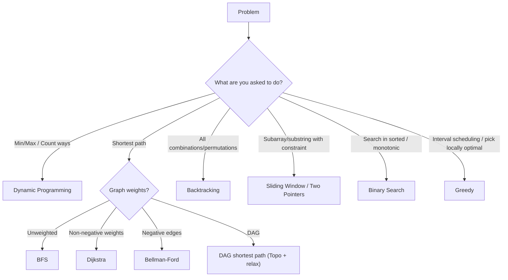

## 1. Time and Space Complexity Analysis

### Big-O Notation

> [!summary] Recall
> - Big-O is an upper bound on growth; constants and lower-order terms drop.
> - Most interview complexity questions: identify loops, recursion tree, and dominant operations.

| Notation | Name | Example |
|----------|------|---------|
| O(1) | Constant | Array access, hash lookup |
| O(log n) | Logarithmic | Binary search |
| O(n) | Linear | Linear search, single loop |
| O(n log n) | Linearithmic | Merge sort, heap sort |
| O(n^2) | Quadratic | Bubble sort, nested loops |
| O(n^3) | Cubic | Floyd-Warshall, matrix multiplication |
| O(2^n) | Exponential | Subsets, recursive Fibonacci |
| O(n!) | Factorial | Permutations |

### Asymptotic Notations

| Notation | Meaning |
|----------|---------|
| **O (Big-O)** | Upper bound (worst case) |
| **Ω (Omega)** | Lower bound (best case) |
| **Θ (Theta)** | Tight bound (exact growth rate) |
| **o (Little-o)** | Strict upper bound (not tight) |
| **ω (Little-omega)** | Strict lower bound (not tight) |

### Recurrence Relations

> [!tip] Common shape recognition
> - `T(n)=T(n/2)+O(1)` is repeated halving (binary search).
> - `T(n)=2T(n/2)+O(n)` is split + merge (merge sort).

| Recurrence | Solution | Algorithm |
|------------|----------|-----------|
| T(n) = T(n/2) + O(1) | O(log n) | Binary search |
| T(n) = T(n-1) + O(1) | O(n) | Linear recursion |
| T(n) = 2T(n/2) + O(n) | O(n log n) | Merge sort |
| T(n) = 2T(n/2) + O(1) | O(n) | Tree traversal |
| T(n) = T(n-1) + O(n) | O(n^2) | Selection sort |
| T(n) = 2T(n-1) + O(1) | O(2^n) | Tower of Hanoi |

### Master Theorem

For recurrences of the form `T(n) = aT(n/b) + O(n^d)`:

| Condition | Result |
|-----------|--------|
| d < log_b(a) | O(n^(log_b(a))) |
| d = log_b(a) | O(n^d * log n) |
| d > log_b(a) | O(n^d) |

### Amortized Analysis

- **Aggregate method** — total cost over n operations / n
- **Accounting method** — assign amortized cost to each operation; save credits
- **Potential method** — define potential function Φ; amortized = actual + ΔΦ

### Space Complexity

- **Auxiliary space** — extra space used beyond input
- **In-place** — O(1) auxiliary space
- **Recursion stack** — counts toward space complexity (O(depth))

> [!warning] Pitfalls
> - **Dropping lower-order terms too early** — when comparing O(n² + n log n), don't mentally drop the `n log n` before checking if it dominates a *different* algorithm's O(n log n). Keep all terms until you've identified the dominant one.
> - **Space complexity includes recursion stack** — a recursive DFS that mutates in-place is **not** O(1) space; the call stack adds O(depth) space. This is the #1 space complexity mistake in interviews.
> - **Master Theorem misapplication** — it only applies to recurrences of the form `T(n) = aT(n/b) + f(n)`. If `b` is not constant (e.g., `T(n) = T(n-1) + n`), use the substitution method or recurrence tree instead.
> - **Confusing amortized with average** — amortized analysis is a worst-case guarantee spread across operations, not an average over random inputs. A dynamic array has **amortized** O(1) push, but any specific push can still be O(n).
> - **Log base confusion** — O(log₂ n), O(log₁₀ n), and O(logₑ n) are all the same in big-O (differ by a constant factor). Don't overthink the base unless it appears in the exponent.
> - **Calling an algorithm O(1) because input is small** — by definition, complexity describes growth as input grows. A function with a fixed 100-element loop is O(100) = O(1), but an algorithm that runs 100× per input element is O(n), not O(1). Describe in terms of input size `n`.

> [!question]- Q: What's the difference between O, Θ, and Ω?
> **Answer:** **O (Big-O)** = worst-case upper bound (the function grows at most this fast). **Ω (Omega)** = best-case lower bound (grows at least this fast). **Θ (Theta)** = tight bound (grows exactly this fast). For example, merge sort is O(n log n), Ω(n log n), and Θ(n log n) in all cases. QuickSort is O(n²) worst, Ω(n log n) best, no tight Θ for all cases.

> [!question]- Q: How do you analyze space complexity for recursive algorithms?
> **Answer:** Sum the space at each level of the recursion tree. For each level, the call stack stores local variables + return address. In linear recursion (one call per level, depth d), space = O(d * size_per_frame). In divide-and-conquer (branching), the maximum stack depth is usually O(log n) because calls complete before siblings start, but this depends on evaluation order.

> [!question]- Q: What's an example of amortized analysis?
> **Answer:** A dynamic array (ArrayList) doubles capacity when full. Most `add()` calls are O(1), but one in `n` calls triggers an O(n) resize. Over `n` operations, total cost = `n*O(1) + O(n) + O(n/2) + O(n/4) + ... = O(n)`. Per operation: O(n)/n = O(1) amortized. The accounting method "charges" each cheap operation extra to build credit for future expensive ones.

> [!question]- Q: When does the Master Theorem NOT apply?
> **Answer:** When `b` is not constant (`T(n) = T(n-1) + n`), when `f(n)` is not polynomial (`T(n) = 2T(n/2) + n/log n`), or when `a` and `b` are not constants (`T(n) = n*T(n/2) + n`). In these cases, use recursion tree analysis or the substitution method.

### Resources

- *CLRS* — Chapters 3-4
- [Big-O Cheat Sheet](https://www.bigocheatsheet.com/)
- [Abdul Bari - Time Complexity (YouTube)](https://www.youtube.com/watch?v=9TlHvipP5yA)

---

## 2. Sorting Algorithms

> [!summary] When to Use What

```mermaid
flowchart TD
    subgraph Quick["QuickSort Partition on [3,7,8,5,2,1,9,4]"]
        Q1["pivot=4, i=-1, j=0"] --> Q2["j=0: 3≤4 → swap(3,3), i=0"]
        Q2 --> Q3["j=1: 7>4 → skip"]
        Q3 --> Q4["j=2: 8>4 → skip"]
        Q4 --> Q5["j=3: 5>4 → skip"]
        Q5 --> Q6["j=4: 2≤4 → swap(7,2), i=1"]
        Q6 --> Q7["j=5: 1≤4 → swap(8,1), i=2"]
        Q7 --> Q8["j=6: 9>4 → skip"]
        Q8 --> Q9["swap pivot: swap(7,4) → [3,2,1,4,8,7,9,5]<br/>pivot=4 at index 3 ✓"]
    end
    subgraph Merge["MergeSort divide + merge"]
        M1["[38,27,43,3,9,82,10]"] --> M2["[38,27,43,3] & [9,82,10]"]
        M2 --> M3["divide down to singles"]
        M3 --> M4["merge [27,38] & [3,43] → [3,27,38,43]"]
        M4 --> M5["merge [9,82] & [10] → [9,10,82]"]
        M5 --> M6["merge [3,27,38,43] & [9,10,82]"]
        M6 --> M7["Result: [3,9,10,27,38,43,82] ✓"]
    end
```

> - Nearly sorted / small n: insertion sort.
> - General purpose: quick sort (randomized/3-way) or built-in sorts.
> - Stability required: merge sort / timsort.
> - Hard worst-case guarantees: heap sort / merge sort.

> [!tip] Java implementation reference
> ![[JAVA_IMPL/Java_03_Algorithms_Part1#Section J: Sorting Algorithms]]

### Comparison-Based Sorts

| Algorithm | Best | Average | Worst | Space | Stable | In-Place |
|-----------|:---:|:---:|:---:|:---:|:---:|:---:|
| **Bubble Sort** | O(n) | O(n^2) | O(n^2) | O(1) | Yes | Yes |
| **Selection Sort** | O(n^2) | O(n^2) | O(n^2) | O(1) | No | Yes |
| **Insertion Sort** | O(n) | O(n^2) | O(n^2) | O(1) | Yes | Yes |
| **Merge Sort** | O(n log n) | O(n log n) | O(n log n) | O(n) | Yes | No |
| **Quick Sort** | O(n log n) | O(n log n) | O(n^2) | O(log n) | No | Yes |
| **Heap Sort** | O(n log n) | O(n log n) | O(n log n) | O(1) | No | Yes |
| **Tim Sort** | O(n) | O(n log n) | O(n log n) | O(n) | Yes | No |
| **Shell Sort** | O(n log n) | Depends on gap | O(n^2) | O(1) | No | Yes |
| **Tree Sort** | O(n log n) | O(n log n) | O(n^2) | O(n) | Yes | No |

### Non-Comparison Sorts

| Algorithm | Time | Space | Condition |
|-----------|:---:|:---:|-----------|
| **Counting Sort** | O(n + k) | O(n + k) | k = range of input |
| **Radix Sort** | O(d * (n + k)) | O(n + k) | d = number of digits |
| **Bucket Sort** | O(n + k) avg | O(n + k) | Uniformly distributed |

### Lower Bound

- Comparison-based sorting has a lower bound of **Ω(n log n)**
- Non-comparison sorts can achieve O(n) under constraints

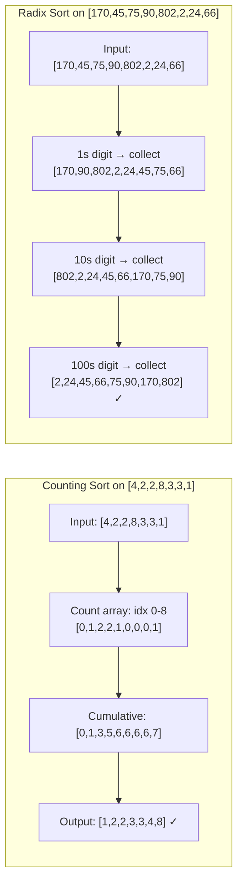

### Detailed Notes on Key Sorts

#### Quick Sort

```
QuickSort(arr, low, high):
    if low < high:
        pivotIndex = Partition(arr, low, high)
        QuickSort(arr, low, pivotIndex - 1)
        QuickSort(arr, pivotIndex + 1, high)

Partition(arr, low, high):
    pivot = arr[high]
    i = low - 1
    for j = low to high - 1:
        if arr[j] <= pivot:
            i++
            swap(arr[i], arr[j])
    swap(arr[i+1], arr[high])
    return i + 1
```

- **Pivot selection strategies**: Last element, first element, median-of-three, random
- **3-way partition (Dutch National Flag)**: Handles duplicates efficiently
- **Randomized QuickSort**: Expected O(n log n) regardless of input
- **Tail Call Optimization**: Recurse on smaller partition first

#### Merge Sort

```
MergeSort(arr, l, r):
    if l < r:
        mid = (l + r) / 2
        MergeSort(arr, l, mid)
        MergeSort(arr, mid+1, r)
        Merge(arr, l, mid, r)
```

- Stable, predictable O(n log n)
- Natural choice for linked lists (no random access needed)
- External sorting: merge sort variant for data exceeding memory
- Count inversions using merge sort

#### Heap Sort

1. Build max-heap from array: O(n)
2. Repeatedly extract max and place at end: O(n log n)
- Not stable, but in-place and guaranteed O(n log n)

### When to Use What

| Scenario | Best Choice |
|----------|-------------|
| Small arrays (n < 50) | Insertion Sort |
| Nearly sorted | Insertion Sort or Tim Sort |
| General purpose | Quick Sort (randomized) |
| Guaranteed worst case | Merge Sort or Heap Sort |
| Stability required | Merge Sort or Tim Sort |
| Limited memory | Heap Sort |
| Integer keys in range | Counting Sort |
| Strings / large integers | Radix Sort |
| Uniform distribution | Bucket Sort |
| Linked list | Merge Sort |

### Pseudocode

#### Insertion Sort
```
InsertionSort(A[1 .. n]):
    for i ← 2 to n:
        key ← A[i]
        j ← i - 1
        while j ≥ 1 and A[j] > key:
            A[j + 1] ← A[j]
            j ← j - 1
        A[j + 1] ← key
```

#### Selection Sort
```
SelectionSort(A[1 .. n]):
    for i ← 1 to n - 1:
        minIdx ← i
        for j ← i + 1 to n:
            if A[j] < A[minIdx]:
                minIdx ← j
        swap A[i] and A[minIdx]
```

#### Counting Sort
```
CountingSort(A[1 .. n], k):       // elements in range [0, k]
    count[0 .. k] ← {0}
    output[1 .. n] ← {0}
    for i ← 1 to n:
        count[A[i]] ← count[A[i]] + 1
    for i ← 1 to k:
        count[i] ← count[i] + count[i - 1]
    for i ← n downto 1:
        output[count[A[i]]] ← A[i]
        count[A[i]] ← count[A[i]] - 1
    return output
```

#### Radix Sort (LSD)
```
RadixSort(A[1 .. n], d):          // d = max number of digits
    for pos ← 1 to d:
        // Use stable sort on digit pos (typically Counting Sort)
        CountingSortByDigit(A, pos)
```

#### Bucket Sort
```
BucketSort(A[1 .. n]):
    number of buckets ← n
    buckets[1 .. n] ← n empty lists
    for i ← 1 to n:
        idx ← ⌊n * A[i]⌋ + 1         // map value to bucket
        buckets[idx].insert(A[i])
    for i ← 1 to n:
        Sort(buckets[i])              // insertion sort
    concatenate buckets[1 .. n] into result
    return result
```

> [!warning] Pitfalls
> - **Stability confusion** — stable sorts (merge, insertion, bubble) preserve relative order of equal elements; unstable sorts (quick, heap, selection) do not. When sorting objects by one key then another (chained sorting), you *must* use a stable sort for the second pass.
> - **Quicksort O(n²) with sorted/pivoted worst-case** — always pick a pivot from the middle or random; picking the first or last element on sorted/nearly-sorted data triggers O(n²). This is why libraries use IntroSort (quicksort + heapsort fallback).
> - **Merge Sort's O(n) auxiliary space** — merge sort requires a temporary array of size n. For linked lists, it's O(1) extra space; for arrays, it's not in-place. Mention this trade-off in interviews.
> - **Counting Sort on large range** — if `k` (range) >> `n`, counting sort is O(n+k) which degenerates to O(k), potentially worse than O(n log n). Only use when `k = O(n)`.
> - **Radix Sort with variable-length keys** — LSD radix sort requires equal-length keys or padding. MSD radix sort handles variable-length naturally but is more complex.
> - **Sorting floating-point with comparison sorts** — NaN comparisons are undefined; sorting arrays with NaN can lead to inconsistent ordering. Handle NaN separately or use a total order comparator.

> [!question]- Q: What makes a sorting algorithm "stable" and why does it matter?
> **Answer:** Stable = equal elements retain their original relative order. Example: sorting a list of people by name, then by age — if the age sort is stable, people with the same age remain sorted by name. Without stability, the name ordering is lost.

> [!question]- Q: When would you use Insertion Sort over QuickSort?
> **Answer:** Insertion sort is O(n) on nearly-sorted data and has tiny constant factors. Hybrid sorts (TimSort, IntroSort) use Insertion Sort for small subarrays (n < 32–64) since the overhead of recursion and partitioning exceeds the cost of quadratic sorting on tiny arrays.

> [!question]- Q: How does Counting Sort achieve O(n + k) and when is it better than comparison sorts?
> **Answer:** It counts frequencies of each key, then computes prefix sums to determine positions. Since it never compares elements, it bypasses the Ω(n log n) lower bound. Best when k = O(n) and keys are integers in a known range.

> [!question]- Q: What's the Ω(n log n) comparison-sorting lower bound, and why?
> **Answer:** Any comparison-based sort makes decisions via a decision tree with n! leaves (one per permutation). A binary tree with L leaves has height ≥ log₂(L). Thus height ≥ log₂(n!) ≈ n log n. Non-comparison sorts (counting, radix) escape this bound because they use key values as array indices.

### Resources

- [Sorting Algorithms - GeeksforGeeks](https://www.geeksforgeeks.org/sorting-algorithms/)
- [Sorting Algorithms Animations](https://www.toptal.com/developers/sorting-algorithms)
- [Abdul Bari - Sorting (YouTube)](https://www.youtube.com/playlist?list=PLDN4rrl48XKpZkf03iYFl-O29szjTrs_O)
- *CLRS* — Chapters 6-9

---

## 3. Searching Algorithms

> [!summary] Binary Search Checklist
> - Predicate is monotonic.
> - Loop invariants are explicit (`low` is feasible/infeasible depending on style).
> - Mid computation avoids overflow.

> [!tip] Java implementation reference

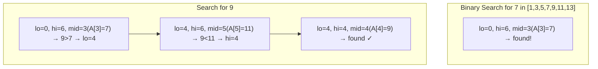

> ![[JAVA_IMPL/Java_03_Algorithms_Part1#Section K: Searching Algorithms]]

### Linear Search

- Time: O(n), Space: O(1)
- Works on unsorted data

### Binary Search

- Time: O(log n), Space: O(1) iterative / O(log n) recursive
- **Requires sorted input**

```
BinarySearch(arr, target):
    low = 0, high = n - 1
    while low <= high:
        mid = low + (high - low) / 2    # prevents overflow
        if arr[mid] == target: return mid
        elif arr[mid] < target: low = mid + 1
        else: high = mid - 1
    return -1
```

### Binary Search Variants

| Variant | Description |
|---------|-------------|
| Lower bound | First element ≥ target |
| Upper bound | First element > target |
| First occurrence | First index of target |
| Last occurrence | Last index of target |
| Search in rotated sorted array | Modified binary search |
| Peak element | Find local maximum |
| Search in 2D matrix | Treat as 1D / staircase search |
| Binary search on answer | Minimize/maximize with monotonic predicate |
| Ternary search | Unimodal function max/min |

### Interpolation Search

- Time: O(log log n) average for uniformly distributed data, O(n) worst
- Estimates position: `pos = low + ((target - arr[low]) * (high - low)) / (arr[high] - arr[low])`

### Exponential Search

- Time: O(log n)
- Find range using exponential jumps, then binary search within range
- Useful for unbounded/infinite arrays

### Jump Search

- Time: O(√n), Space: O(1)
- Jump by √n steps, then linear search in block

### Fibonacci Search

- Time: O(log n)
- Divides array using Fibonacci numbers; no multiplication/division

### Pseudocode

#### Linear Search
```
LinearSearch(A[1 .. n], key):
    for i ← 1 to n:
        if A[i] = key:
            return i
    return -1
```

#### Binary Search Variants

##### Lower Bound (first element ≥ x)
```
LowerBound(A[1 .. n], x):
    lo ← 1, hi ← n, ans ← n + 1
    while lo ≤ hi:
        mid ← (lo + hi) / 2
        if A[mid] ≥ x:
            ans ← mid
            hi ← mid - 1
        else:
            lo ← mid + 1
    return ans
```

##### Upper Bound (first element > x)
```
UpperBound(A[1 .. n], x):
    lo ← 1, hi ← n, ans ← n + 1
    while lo ≤ hi:
        mid ← (lo + hi) / 2
        if A[mid] > x:
            ans ← mid
            hi ← mid - 1
        else:
            lo ← mid + 1
    return ans
```

##### First Occurrence
```
FirstOccurrence(A[1 .. n], x):
    idx ← LowerBound(A, x)
    if idx ≤ n and A[idx] = x: return idx
    return -1
```

##### Search in Rotated Sorted Array
```
SearchRotated(A[1 .. n], target):
    lo ← 1, hi ← n
    while lo ≤ hi:
        mid ← (lo + hi) / 2
        if A[mid] = target: return mid
        if A[lo] ≤ A[mid]:              // left half is sorted
            if A[lo] ≤ target < A[mid]:
                hi ← mid - 1
            else:
                lo ← mid + 1
        else:                           // right half is sorted
            if A[mid] < target ≤ A[hi]:
                lo ← mid + 1
            else:
                hi ← mid - 1
    return -1
```

#### Exponential Search
```
ExponentialSearch(A[1 .. n], x):
    if A[1] = x: return 1
    i ← 1
    while i ≤ n and A[i] ≤ x:
        i ← i * 2
    return BinarySearch(A, i/2 + 1, min(i, n), x)
```

> [!warning] Pitfalls
> - **Integer overflow in mid calculation** — `(lo + hi) / 2` overflows when `lo + hi > Integer.MAX_VALUE`. Always use `lo + (hi - lo) / 2` in languages with fixed-width integers.
> - **Infinite loop with `mid = (lo + hi) / 2` and `lo = mid`** — when `lo` and `hi` differ by 1, `mid = lo` (floor division), and `lo = mid` never advances. Fix: use `mid = lo + (hi - lo + 1) / 2` (upper mid) or `lo = mid + 1`.
> - **Boundary conditions in lower/upper bound** — the returned index might be `n + 1` (beyond array). Always check bounds before accessing the result.
> - **Interpolation search on non-uniform data** — assumes uniform distribution. On skewed data (e.g., exponentially distributed), performance degrades to O(n). Use binary search unless you know the distribution.
> - **Exponential search forgetting to bound** — `i = min(i*2, n)` is critical; without the min, you'll exceed the array bounds.
> - **Searching in sorted 2D matrix** — staircase search (start from top-right, move left or down) is O(m+n), while binary search on 1D projection is O(log m + log n). Know both approaches — staircase search doesn't require converting the 2D index.

> [!question]- Q: When should I use Interpolation Search over Binary Search?
> **Answer:** Only when the data is uniformly distributed and you need maximum speed (O(log log n) average). Phone books and dictionary lookups are good candidates. For general purpose sorted data, binary search is more reliable (consistent O(log n)).

> [!question]- Q: What's the difference between lower bound and first occurrence?
> **Answer:** **Lower bound** returns the first position where an element **≥ target** can be inserted (even if the target doesn't exist). **First occurrence** returns the first position where the element **== target** exists, or -1 if absent. Lower bound is more general — first occurrence = lower_bound; then check if array[ans] == target.

> [!question]- Q: Why does Exponential Search make sense for unbounded arrays?
> **Answer:** When you don't know the array size (e.g., a sorted stream or infinite array), you can't binary search because you don't know the right boundary. Exponential search finds the range [2^(k-1), 2^k] where the target lies in O(log n) comparisons, then binary searches within that range.

> [!question]- Q: How do you handle binary search with duplicates?
> **Answer:** To find the **first** occurrence, when `A[mid] == target`, set `hi = mid` (not `return mid`). To find the **last** occurrence, use `mid = lo + (hi - lo + 1) / 2` and when `A[mid] == target`, set `lo = mid`. Both terminate with lo pointing to the boundary.

### Resources

- [Binary Search - GeeksforGeeks](https://www.geeksforgeeks.org/binary-search/)
- [Binary Search - Errichto (YouTube)](https://www.youtube.com/watch?v=GU7DpgHINWQ)
- *CLRS* — Chapter 2

---

## 4. Recursion and Backtracking

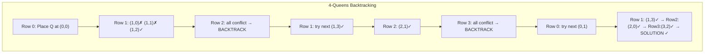

> [!warning] Common pitfalls
> - Missing base case.
> - Shared mutable state not undone during backtracking.
> - Exponential blowups: add pruning, ordering heuristics, or memoization.

### Recursion

#### Key Concepts

- **Base case** — termination condition
- **Recursive case** — problem broken into smaller subproblems
- **Call stack** — each call pushes a frame; unwinds on return
- **Stack overflow** — too many recursive calls exceed stack limit
- **Tail recursion** — recursive call is the last operation; can be optimized by compiler

#### Types of Recursion

| Type | Description |
|------|-------------|
| **Linear** | Single recursive call |
| **Binary/Tree** | Two or more recursive calls |
| **Tail** | Recursive call is last operation |
| **Head** | Recursive call is first operation |
| **Mutual** | Function A calls B, B calls A |
| **Nested** | Argument to recursive call is itself a recursive call |

#### Common Recursive Problems

- Factorial, Fibonacci
- Tower of Hanoi — O(2^n)
- Power function (fast exponentiation) — O(log n)
- Print all subsequences
- Merge sort, quick sort

### Backtracking

Backtracking is a refined brute-force approach that systematically searches for solutions by building candidates incrementally and abandoning a candidate ("backtracking") as soon as it determines the candidate cannot lead to a valid solution.

#### Template

```
Backtrack(candidate, state):
    if isComplete(candidate):
        record(candidate)
        return
    for each choice in getChoices(state):
        if isValid(choice, state):
            makeChoice(choice, state)
            Backtrack(candidate, state)
            undoChoice(choice, state)    # backtrack
```

#### Pruning Techniques

- **Constraint propagation** — eliminate choices early
- **Ordering heuristics** — try most constrained variable first (MRV)
- **Symmetry breaking** — avoid redundant explorations
- **Bounding** — skip branches that cannot improve on current best (see [[#19-branch-and-bound|Branch and Bound]])

#### Classic Backtracking Problems

| Problem | Description | Complexity |
|---------|-------------|:---:|
| N-Queens | Place N queens on N×N board | O(N!) |
| Sudoku Solver | Fill 9×9 grid | Exponential |
| Permutations | Generate all permutations | O(N! * N) |
| Combinations | Generate C(n, k) combinations | O(C(n,k) * k) |
| Subsets (Power Set) | Generate all subsets | O(2^n * n) |
| Word Search | Find word in grid | O(N * M * 4^L) |
| Palindrome Partitioning | All palindrome partitions | Exponential |
| Combination Sum | Combinations summing to target | Exponential |
| Generate Parentheses | Valid parentheses strings | O(4^n / √n) |
| Letter Combinations of Phone | All letter combos | O(4^n) |
| Rat in a Maze | Path finding with constraints | O(2^(n^2)) |
| Graph Coloring | Color graph with m colors | O(m^V) |
| Hamiltonian Cycle | Visit all vertices once | O(N!) |
| Knight's Tour | Visit all squares on chessboard | O(8^(N^2)) |

### Pseudocode

#### Tower of Hanoi
```
TowerOfHanoi(n, source, target, auxiliary):
    if n = 1:
        Move disk from source to target
        return
    TowerOfHanoi(n - 1, source, auxiliary, target)
    Move disk from source to target
    TowerOfHanoi(n - 1, auxiliary, target, source)
```

#### N-Queens
```
NQueens(n):
    board[1 .. n][1 .. n] ← empty
    Solve(board, col ← 1)

Solve(board, col):
    if col > n: return true (solution found)
    for row ← 1 to n:
        if IsSafe(board, row, col):
            board[row][col] ← 'Q'
            if Solve(board, col + 1): return true
            board[row][col] ← empty
    return false

IsSafe(board, row, col):
    // Check row on left side
    for j ← 1 to col - 1:
        if board[row][j] = 'Q': return false
    // Check upper diagonal
    for i, j ← row - 1, col - 1; i ≥ 1 and j ≥ 1; i ← i - 1, j ← j - 1:
        if board[i][j] = 'Q': return false
    // Check lower diagonal
    for i, j ← row + 1, col - 1; i ≤ n and j ≥ 1; i ← i + 1, j ← j - 1:
        if board[i][j] = 'Q': return false
    return true
```

#### Generate All Permutations
```
Permute(A[1 .. n], index ← 1):
    if index = n:
        output A
        return
    for i ← index to n:
        swap A[index] and A[i]
        Permute(A, index + 1)
        swap A[index] and A[i]          // backtrack
```

#### Generate All Subsets
```
Subsets(A[1 .. n]):
    result ← [[]]
    for i ← 1 to n:
        newSubsets ← []
        for each subset in result:
            newSubsets.append(subset + [A[i]])
        result ← result + newSubsets
    return result
```

#### Combination Sum
```
CombinationSum(A[1 .. n], target):
    result ← []
    Backtrack(A, target, 1, [], result)
    return result

Backtrack(A, remain, start, path, result):
    if remain = 0:
        result.append(copy of path)
        return
    if remain < 0: return
    for i ← start to n:
        path.append(A[i])
        Backtrack(A, remain - A[i], i, path, result)   // i for unlimited, i+1 for one-use
        path.pop()
```

> [!warning] Pitfalls (continued)
> - **Exploding state space without memoization** — recursive Fibonacci without memoization recalculates the same subproblem exponentially many times. Always check for overlapping subproblems before writing pure recursion.
> - **Backtracking vs recursion confusion** — all backtracking uses recursion, but not all recursion is backtracking. Backtracking means you **undo** choices to explore alternatives; simple divide-and-conquer recursion does not.
> - **Mutable arrays shared across recursive calls** — when the same array/object is modified in each recursive call, ensure you undo changes during backtracking. Forgetting `board[row][col] ← empty` is the single most common backtracking bug.
> - **Pruning too aggressively** — a bounding function that accidentally prunes valid solutions (e.g., wrong constraint check) makes backtracking silently miss answers. Test pruning logic independently on small cases.
> - **Recursion depth limits** — recursion depth > 10,000 typically causes StackOverflowError. For problems with n > 10,000, use an explicit stack (iterative approach) or increase stack size via JVM flags.

> [!question]- Q: How do you convert a recursive solution to an iterative one?
> **Answer:** Use an explicit stack that stores the state (function parameters + local variables). For tail-recursive functions, you can convert to a simple while loop. For tree/graph traversals, use a Stack or Queue with a visited set. The explicit stack gives you control over memory and avoids recursion limits.

> [!question]- Q: What's the difference between permutations, combinations, and subsets in backtracking?
> **Answer:** **Permutations**: order matters, use all elements → swap-based backtracking. **Combinations**: order doesn't matter, pick k from n → include/exclude with start index. **Subsets**: all combinations of any size → include/exclude with start index or bitmask. The `start` parameter prevents revisiting and distinguishes combinations from permutations.

> [!question]- Q: When does backtracking beat BFS/DFS for search problems?
> **Answer:** Backtracking is for **constraint satisfaction** (N-Queens, Sudoku, graph coloring) where you build solutions incrementally and check constraints early. BFS/DFS are for state-space search where the graph structure is explicit (mazes, puzzles). Backtracking prunes via constraints; BFS/DFS explore all reachable states.

> [!question]- Q: What's the worst-case time complexity of backtracking and how do you control it?
> **Answer:** Most backtracking problems are O(b^d) where b = branching factor, d = decision depth (e.g., O(N!) for N-Queens, O(9^81) for Sudoku). Control it with: pruning (constraint propagation), ordering heuristics (most constrained first), symmetry breaking, and bounding (branch & bound for optimization).

### Resources

- [Backtracking - GeeksforGeeks](https://www.geeksforgeeks.org/backtracking-algorithms/)
- [Recursion - Aditya Verma (YouTube)](https://www.youtube.com/playlist?list=PL_z_8CaSLPWeT1ffjiImo0sYTcnLzo-wY)
- [Backtracking - Striver (YouTube)](https://www.youtube.com/playlist?list=PLgUwDviBIf0p4ozDR_kJJkONnb1wdx2Ma)

---

## 5. Divide and Conquer

> [!summary] Intuition
> Instead of tackling a problem head-on, divide and conquer says: "Break it into smaller pieces, solve each piece, and stitch the answers together." Think of Merge Sort — sorting a million numbers seems hard, but sorting two sorted half-million arrays and merging them is trivial. The magic is that the merge step (O(n)) plus the recursive splitting (O(log n)) gives you O(n log n) — far better than brute force.

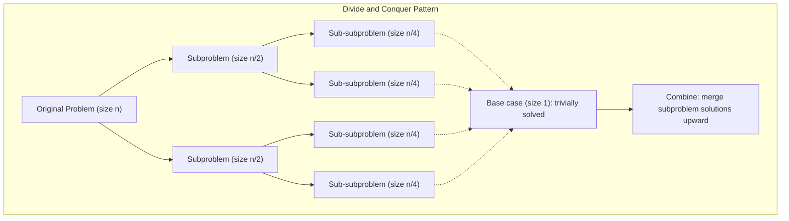

### How to Recognize

| Problem Pattern | D&C Technique |
|-----------------|--------------|
| "Divide array, process halves, combine results" | Merge Sort, Count Inversions |
| "Find kth smallest / order statistic" | QuickSelect |
| "Closest / farthest pair among points" | Closest Pair of Points |
| "Multiply large numbers / matrices efficiently" | Karatsuba, Strassen's |
| "Maximum subarray crossing a midpoint" | Max Subarray (D&C) |
| "Recurrence has form T(n) = aT(n/b) + O(n^d)" | Master Theorem applies |
| "Problem can be split into independent halves" | Candidate for D&C |

### Overview

Split the problem into smaller subproblems, solve recursively, and combine results.

**Three steps:**
1. **Divide** — break problem into subproblems
2. **Conquer** — solve subproblems recursively
3. **Combine** — merge subproblem solutions

### Classic Problems

| Problem | Recurrence | Complexity |
|---------|------------|:---:|
| **Binary Search** | T(n) = T(n/2) + O(1) | O(log n) |
| **Merge Sort** | T(n) = 2T(n/2) + O(n) | O(n log n) |
| **Quick Sort** | T(n) = T(k) + T(n-k-1) + O(n) | O(n log n) avg |
| **Strassen's Matrix Multiplication** | T(n) = 7T(n/2) + O(n^2) | O(n^2.807) |
| **Karatsuba Multiplication** | T(n) = 3T(n/2) + O(n) | O(n^1.585) |
| **Closest Pair of Points** | T(n) = 2T(n/2) + O(n) | O(n log n) |
| **Count Inversions** | T(n) = 2T(n/2) + O(n) | O(n log n) |
| **Median of Medians** | T(n) = T(n/5) + T(7n/10) + O(n) | O(n) |
| **FFT** | T(n) = 2T(n/2) + O(n) | O(n log n) |
| **Maximum Subarray (D&C)** | T(n) = 2T(n/2) + O(n) | O(n log n) |

### Quick Select (Kth Smallest)

- Average O(n), Worst O(n^2)
- With Median of Medians pivot: guaranteed O(n)
- Uses partition step from QuickSort

### Pseudocode

#### QuickSelect (Kth Smallest)
```
QuickSelect(A[1 .. n], k):
    return SelectHelper(A, 1, n, k)

SelectHelper(A, lo, hi, k):
    pivotIdx ← Partition(A, lo, hi)
    if pivotIdx = k: return A[pivotIdx]
    if pivotIdx > k:
        return SelectHelper(A, lo, pivotIdx - 1, k)
    else:
        return SelectHelper(A, pivotIdx + 1, hi, k)

Partition(A, lo, hi):
    pivot ← A[hi]
    i ← lo - 1
    for j ← lo to hi - 1:
        if A[j] ≤ pivot:
            i ← i + 1, swap A[i] and A[j]
    swap A[i + 1] and A[hi]
    return i + 1
```

#### Closest Pair of Points (D&C)
```
ClosestPair(P[1 .. n]):                          // points sorted by x
    return CPHelper(P, 1, n)

CPHelper(P, lo, hi):
    if hi - lo + 1 ≤ 3: return BruteForceMinDist(P, lo, hi)
    mid ← (lo + hi) / 2
    midX ← P[mid].x
    dL ← CPHelper(P, lo, mid)
    dR ← CPHelper(P, mid + 1, hi)
    d ← min(dL, dR)
    // Build strip of points within d of midX
    strip ← []
    for i ← lo to hi:
        if |P[i].x - midX| < d: strip.append(P[i])
    // Sort strip by y and check d-separated pairs (at most 7 checks)
    Sort strip by y
    for i ← 1 to |strip|:
        for j ← i + 1 to min(|strip|, i + 7):
            dist ← EuclideanDist(strip[i], strip[j])
            d ← min(d, dist)
    return d
```

#### Count Inversions (Merge-Based)
```
CountInversions(A[1 .. n]):
    return MergeSortCount(A, 1, n)

MergeSortCount(A, lo, hi):
    if lo ≥ hi: return 0
    mid ← (lo + hi) / 2
    count ← MergeSortCount(A, lo, mid) + MergeSortCount(A, mid + 1, hi)
    // Merge and count cross-inversions
    left ← A[lo .. mid], right ← A[mid + 1 .. hi]
    i ← 1, j ← 1, k ← lo
    while i ≤ |left| and j ≤ |right|:
        if left[i] ≤ right[j]:
            A[k] ← left[i], i ← i + 1
        else:
            A[k] ← right[j], j ← j + 1
            count ← count + (|left| - i + 1)   // all remaining left elements
        k ← k + 1
    copy remaining left and right into A
    return count
```

#### Maximum Subarray (D&C)
```
MaxSubarrayDC(A[1 .. n]):
    return DCHelper(A, 1, n)

DCHelper(A, lo, hi):
    if lo = hi: return A[lo]
    mid ← (lo + hi) / 2
    leftMax ← DCHelper(A, lo, mid)
    rightMax ← DCHelper(A, mid + 1, hi)
    crossMax ← MaxCrossingSum(A, lo, mid, hi)
    return max(leftMax, rightMax, crossMax)

MaxCrossingSum(A, lo, mid, hi):
    leftSum ← -∞, sum ← 0
    for i ← mid downto lo:
        sum ← sum + A[i], leftSum ← max(leftSum, sum)
    rightSum ← -∞, sum ← 0
    for i ← mid + 1 to hi:
        sum ← sum + A[i], rightSum ← max(rightSum, sum)
    return leftSum + rightSum
```

> [!warning] Pitfalls
> - **Incorrect base case** — the D&C base case determines correctness and performance. Too small → unnecessary recursion overhead. Too large → you're brute-forcing at the base. Size 1 for simple problems, size ≤ 3 or 10 for geometry/numeric problems.
> - **Merge step dominates** — if the combine step is O(n²) and the divide step is O(n log n), the total complexity is O(n²), not O(n log n). Always check which phase dominates the recurrence.
> - **Uneven split degradation** — QuickSort's worst case (n-1 and 0 split) is technically still D&C but degrades to O(n²). For guaranteed performance, ensure balanced partitioning (median of medians, random pivot, or split around the middle).
> - **Stack overflow from deep recursion** — D&C recursions go O(log n) deep for balanced splits, but O(n) deep for worst-case splits. Use iterative versions for large inputs or when worst-case depth is a concern.
> - **Recomputing overlapping subproblems** — if subproblems overlap (e.g., naive recursive Fibonacci), D&C alone doesn't memoize. Switch to DP for overlapping subproblems. D&C requires **non-overlapping** subproblems.

> [!question]- Q: How is Divide and Conquer different from Dynamic Programming?
> **Answer:** Both split problems into subproblems. D&C subproblems are **independent/non-overlapping** (like merge sort — left half and right half don't share work). DP subproblems **overlap** (like Fibonacci — F(n-1) and F(n-2) both need F(n-3)). DP caches results; D&C just recurses.

> [!question]- Q: Why is Merge Sort's divide step O(1) while the combine step is O(n)?
> **Answer:** "Divide" in merge sort just computes the midpoint index — O(1). The "combine" merges two sorted halves, which requires comparing and copying each element — O(n). Not all D&C algorithms follow this pattern; in QuickSort, the "divide" (partitioning) is O(n) and the "combine" is O(1) (just concatenate).

> [!question]- Q: What's the Strassen algorithm and why is it important?
> **Answer:** Strassen multiplies two n×n matrices in O(n^2.807) instead of O(n³) by reducing 8 recursive multiplications to 7. It was the first algorithm to beat the naive O(n³) bound, proving the possibility of sub-cubic matrix multiplication. In practice, the constant overhead means it's only useful for very large matrices.

> [!question]- Q: When do you use Median of Medians vs randomized QuickSelect?
> **Answer:** Median of Medians gives **deterministic O(n)** worst-case selection by guaranteeing a good pivot (~30%-70% split). Randomized QuickSelect is O(n) expected with much smaller constants. Use MoM when worst-case guarantees are required (hard real-time systems); use randomized QuickSelect in practice (LeetCode, competitive programming).

### Resources

- [Divide & Conquer - GeeksforGeeks](https://www.geeksforgeeks.org/divide-and-conquer/)
- *CLRS* — Chapter 4

---

## 6. Greedy Algorithms

### Overview

A greedy algorithm makes the locally optimal choice at each step, hoping to find the global optimum. Works when the problem has:

1. **Greedy choice property** — a locally optimal choice leads to a globally optimal solution
2. **Optimal substructure** — an optimal solution contains optimal solutions to subproblems

### Proof Techniques

- **Greedy stays ahead** — show greedy solution is at least as good at each step
- **Exchange argument** — show any optimal solution can be transformed to the greedy solution without loss

### Classic Greedy Problems

| Problem | Description | Complexity |
|---------|-------------|:---:|
| **Activity Selection** | Max non-overlapping intervals | O(n log n) |
| **Fractional Knapsack** | Maximize value with fractional items | O(n log n) |
| **Huffman Coding** | Optimal prefix-free encoding | O(n log n) |
| **Job Sequencing with Deadlines** | Maximize profit | O(n^2) or O(n log n) |
| **Minimum Platforms** | Train station problem | O(n log n) |
| **Coin Change (specific denominations)** | Min coins (greedy works for canonical systems) | O(n) |
| **Kruskal's MST** | Minimum spanning tree | O(E log E) |
| **Prim's MST** | Minimum spanning tree | O(E log V) |
| **Dijkstra's Shortest Path** | Single source shortest path (non-negative weights) | O(E log V) |
| **Interval Scheduling** | Max non-overlapping intervals | O(n log n) |
| **Interval Partitioning** | Min rooms/resources | O(n log n) |
| **Task Scheduler** | Min idle time between same tasks | O(n) |
| **Gas Station** | Circular route feasibility | O(n) |
| **Jump Game** | Can reach last index? | O(n) |
| **Candy Distribution** | Min candies with neighbor constraints | O(n) |
| **Non-overlapping Intervals** | Min removals for no overlap | O(n log n) |
| **Assign Cookies** | Maximize satisfied children | O(n log n) |

### Greedy vs Dynamic Programming

| Aspect | Greedy | DP |
|--------|--------|-----|
| Approach | Local optimal choice | Consider all subproblems |
| Guarantee | Not always optimal | Always optimal (if applicable) |
| Speed | Usually faster | Often slower |
| Example | Fractional knapsack | 0/1 knapsack |

### How to Recognize

| Problem Pattern | Greedy Approach |
|-----------------|----------------|
| "Maximize number of non-overlapping intervals" | Activity Selection (sort by finish time) |
| "Minimum number of resources/rooms" | Interval Partitioning (sort by start time) |
| "Fill capacity to maximize value with fractional items" | Fractional Knapsack (sort by value/weight) |
| "Choose locally best option at each step" | Greedy (but verify with proof/counterexample) |
| "Spanning tree with minimum total weight" | Kruskal's or Prim's (greedy edge/vertex selection) |
| "Encoding with minimum average length" | Huffman Coding (merge two smallest frequencies) |
| "Schedule jobs to maximize profit with deadlines" | Job Sequencing (sort by profit descending) |

### Pseudocode

#### Activity Selection
```
ActivitySelection(activities[1 .. n]):     // sorted by finish time
    result ← [activities[1]]
    lastFinish ← activities[1].finish
    for i ← 2 to n:
        if activities[i].start ≥ lastFinish:
            result.append(activities[i])
            lastFinish ← activities[i].finish
    return result
```

#### Fractional Knapsack
```
FractionalKnapsack(items[1 .. n], capacity):
    // items have weight and value; sort by value/weight descending
    Sort items by (value/weight) descending
    totalValue ← 0
    for each item in items:
        if capacity ≥ item.weight:
            totalValue ← totalValue + item.value
            capacity ← capacity - item.weight
        else:
            totalValue ← totalValue + item.value * (capacity / item.weight)
            break
    return totalValue
```

#### Huffman Coding
```
HuffmanCoding(freq[1 .. n]):      // freq of each character
    pq ← MinHeap of nodes (char, freq)
    for each character c:
        pq.insert(new Node(c, freq[c]))
    while pq.size > 1:
        left ← pq.extractMin()
        right ← pq.extractMin()
        parent ← new Node(NIL, left.freq + right.freq)
        parent.left ← left, parent.right ← right
        pq.insert(parent)
    root ← pq.extractMin()
    Build codes from root (left ← '0', right ← '1')
    return codeMap
```

#### Prim's MST
```
PrimMST(adj[1 .. V]):             // adjacency list with (to, weight)
    key[1 .. V] ← ∞       // min edge weight to MST
    parent[1 .. V] ← NIL
    inMST[1 .. V] ← false
    key[1] ← 0
    pq ← MinHeap of (key, vertex)
    pq.insert((0, 1))
    while pq is not empty:
        (_, u) ← pq.extractMin()
        if inMST[u]: continue
        inMST[u] ← true
        for each (v, weight) in adj[u]:
            if not inMST[v] and weight < key[v]:
                key[v] ← weight
                parent[v] ← u
                pq.insert((key[v], v))
    return parent               // MST edges: (parent[v], v)
```

> [!warning] Pitfalls
> - **Assuming greedy always works** — greedy algorithms are problem-specific and must be **proven correct**. For coin change, greedy works for US denominations {1,5,10,25} but fails for {1,3,4} (greedy gives 4+1+1=3 coins, optimal is 3+3=2 coins). Always test on counterexamples.
> - **Incorrect sorting for interval problems** — activity selection sorts by **finish time**, not start time. Sorting by start time gives suboptimal results. The greedy choice property depends on the correct ordering.
> - **Fractional vs 0/1 Knapsack confusion** — greedy works for fractional knapsack (take items by value/weight ratio) but **fails** for 0/1 knapsack. In interviews, always confirm which variant is being asked.
> - **Prim's vs Kruskal's tie-breaking** — when multiple edges have the same weight, different tie-breaking produces different (but equally valid) MSTs. Don't assume the output matches a specific expected order.
> - **Dijkstra's with negative edges** — greedy Dijkstra fails on negative edges because it assumes "once a node is processed, its distance is final" — an assumption violated by negative edges. Use Bellman-Ford instead.
> - **Huffman coding on byte-aligned data** — Huffman is optimal for bit-level encoding but adds overhead for small alphabets. For text compression on 8-bit characters, the tree overhead may outweigh the savings.

> [!question]- Q: How do you prove a greedy algorithm is correct?
> **Answer:** Two standard techniques: **(1) Greedy stays ahead** — show that at every step, the greedy solution is at least as good as any optimal solution. **(2) Exchange argument** — take an optimal solution and transform it step-by-step into the greedy solution without making it worse, proving the greedy solution is also optimal.

> [!question]- Q: Why does greedy work for Fractional Knapsack but not 0/1 Knapsack?
> **Answer:** In fractional knapsack, you can take pieces of items, so the "best value per weight" strategy is globally optimal — you always fill remaining capacity with the highest-ratio item available. In 0/1, you can't take fractions, so a high-ratio item might block a combination of lower-ratio items that together are more valuable.

> [!question]- Q: What's the difference between coin change (greedy) and coin change (DP)?
> **Answer:** Greedy works when the coin system is **canonical** (like {1,5,10,25}). DP is required for **arbitrary** coin systems. In interviews, always ask: "Are the coin denominations standard?" If yes, try greedy. If no, use DP.

> [!question]- Q: How do you choose between Prim's and Kruskal's for MST?
> **Answer:** **Prim's**: O(E log V) with binary heap, better for dense graphs (E ≈ V²) since it processes vertices. **Kruskal's**: O(E log E), better for sparse graphs (E ≈ V) since it processes edges. Use Prim's when graph is given as adjacency list; Kruskal's when edges are given explicitly with weights.

### Resources

- [Greedy Algorithms - GeeksforGeeks](https://www.geeksforgeeks.org/greedy-algorithms/)
- [Greedy - Abdul Bari (YouTube)](https://www.youtube.com/watch?v=ARvQcqJ_-NY)
- *CLRS* — Chapter 16

---

## 7. Dynamic Programming

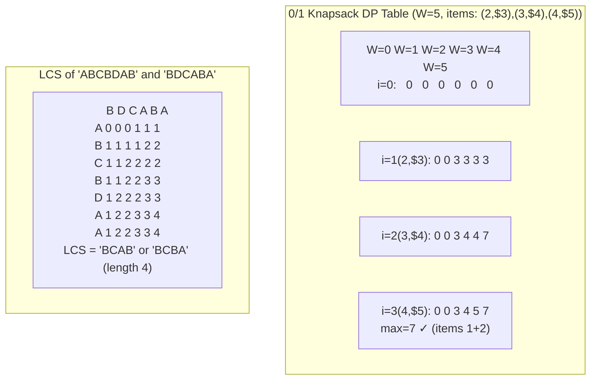

> [!summary] DP Identification
> - The prompt asks for min/max/ways and you can define a reusable state.
> - Overlapping subproblems show up as repeated recursion calls.

> [!tip] Java implementation reference
> ![[JAVA_IMPL/Java_04_Algorithms_Part2#Section O: Dynamic Programming]]

### Overview

Dynamic programming solves complex problems by breaking them into overlapping subproblems and storing results to avoid redundant computation.

### Two Conditions for DP

1. **Optimal Substructure** — optimal solution can be built from optimal solutions of subproblems
2. **Overlapping Subproblems** — same subproblems are solved multiple times

### Approaches

| Approach | Description | Pros | Cons |
|----------|-------------|------|------|
| **Top-Down (Memoization)** | Recursive + cache | Natural, solves only needed subproblems | Stack overflow risk, function call overhead |
| **Bottom-Up (Tabulation)** | Iterative, build table from base cases | No recursion overhead, often faster | Must solve all subproblems |

### Space Optimization

- Many DP problems only depend on previous row/state
- Can reduce O(n*m) space to O(m) or O(1) by keeping only necessary rows
- Example: Fibonacci from O(n) to O(1)

### DP Patterns

#### Pattern 1: 0/1 Knapsack Family

| Problem | Description | Complexity |
|---------|-------------|:---:|
| 0/1 Knapsack | Max value with weight limit | O(n * W) |
| Subset Sum | Does subset with given sum exist? | O(n * sum) |
| Equal Sum Partition | Split array into two equal-sum subsets | O(n * sum/2) |
| Count of Subset Sum | Number of subsets with given sum | O(n * sum) |
| Target Sum | Assign +/- to elements for target | O(n * sum) |
| Minimum Subset Sum Difference | Min difference between two subsets | O(n * sum) |

```
# 0/1 Knapsack Template
dp[i][w] = max(dp[i-1][w], dp[i-1][w - weight[i]] + value[i])
```

#### Pattern 2: Unbounded Knapsack

| Problem | Description | Complexity |
|---------|-------------|:---:|
| Unbounded Knapsack | Items can be picked multiple times | O(n * W) |
| Coin Change (min coins) | Min coins to make amount | O(n * amount) |
| Coin Change 2 (count ways) | Number of ways to make amount | O(n * amount) |
| Rod Cutting | Maximize revenue from rod cuts | O(n^2) |
| Integer Break | Max product of parts | O(n^2) |

```
# Unbounded Knapsack Template
dp[i][w] = max(dp[i-1][w], dp[i][w - weight[i]] + value[i])
#                                  ^^^^ note: dp[i] not dp[i-1]
```

#### Pattern 3: Longest Common Subsequence (LCS) Family

| Problem | Description | Complexity |
|---------|-------------|:---:|
| LCS | Longest common subsequence | O(n * m) |
| Longest Common Substring | Contiguous common substring | O(n * m) |
| Edit Distance | Min operations to convert string A to B | O(n * m) |
| Shortest Common Supersequence | Shortest string containing both | O(n * m) |
| Distinct Subsequences | Count ways s contains t | O(n * m) |
| Interleaving String | Is s3 interleaving of s1 and s2? | O(n * m) |
| Minimum Insertions for Palindrome | n - LPS length | O(n^2) |

```
# LCS Template
if s1[i-1] == s2[j-1]:
    dp[i][j] = dp[i-1][j-1] + 1
else:
    dp[i][j] = max(dp[i-1][j], dp[i][j-1])
```

#### Pattern 4: Longest Increasing Subsequence (LIS)

| Problem | Description | Complexity |
|---------|-------------|:---:|
| LIS | Longest increasing subsequence | O(n log n) |
| Longest Decreasing Subsequence | LIS on reversed array | O(n log n) |
| Longest Bitonic Subsequence | LIS + LDS | O(n log n) |
| Maximum Sum Increasing Subsequence | Max sum of increasing subseq | O(n^2) |
| Russian Doll Envelopes | 2D LIS variant | O(n log n) |
| Number of LIS | Count of longest increasing subsequences | O(n^2) |

```
# O(n^2) LIS
dp[i] = max(dp[j] + 1) for all j < i where arr[j] < arr[i]

# O(n log n) LIS using patience sorting (binary search)
tails = []
for num in arr:
    pos = bisect_left(tails, num)
    if pos == len(tails): tails.append(num)
    else: tails[pos] = num
return len(tails)
```

#### Pattern 5: Matrix Chain Multiplication / Interval DP

| Problem | Description | Complexity |
|---------|-------------|:---:|
| Matrix Chain Multiplication | Min scalar multiplications | O(n^3) |
| Burst Balloons | Max coins from bursting | O(n^3) |
| Palindrome Partitioning (min cuts) | Min cuts for all palindrome parts | O(n^2) |
| Optimal BST | Min search cost BST | O(n^3) |
| Boolean Parenthesization | Ways to parenthesize to True | O(n^3) |
| Stone Game variants | Various interval DP games | O(n^2) - O(n^3) |

```
# Interval DP Template
for length = 2 to n:
    for i = 0 to n - length:
        j = i + length - 1
        for k = i to j - 1:
            dp[i][j] = min/max(dp[i][k] + dp[k+1][j] + cost)
```

#### Pattern 6: DP on Strings

| Problem | Complexity |
|---------|:---:|
| Longest Palindromic Subsequence | O(n^2) |
| Longest Palindromic Substring | O(n^2) or O(n) Manacher's |
| Word Break | O(n^2) |
| Regular Expression Matching | O(n * m) |
| Wildcard Matching | O(n * m) |
| Decode Ways | O(n) |

#### Pattern 7: DP on Grid

| Problem | Complexity |
|---------|:---:|
| Unique Paths | O(m * n) |
| Unique Paths with Obstacles | O(m * n) |
| Minimum Path Sum | O(m * n) |
| Dungeon Game | O(m * n) |
| Cherry Pickup | O(n^3) |
| Maximal Square | O(m * n) |
| Maximal Rectangle | O(m * n) |

#### Pattern 8: DP on Trees

| Problem | Description |
|---------|-------------|
| Diameter of binary tree | Max path between any two nodes |
| Maximum path sum | Max sum path in binary tree |
| House Robber III | Max rob on tree (no adjacent) |
| Binary Tree Camera | Min cameras to monitor all nodes |
| Longest path in tree | DP on tree with rerooting |

#### Pattern 9: State Machine DP

| Problem | States |
|---------|--------|
| Best Time to Buy/Sell Stock I-IV | hold, not_hold, cooldown, transactions |
| House Robber | rob, skip |
| Paint House | color choices |

```
# Stock trading template
hold[i] = max(hold[i-1], not_hold[i-1] - price[i])
not_hold[i] = max(not_hold[i-1], hold[i-1] + price[i])
```

#### Pattern 10: Bitmask DP

| Problem | Complexity |
|---------|:---:|
| Travelling Salesman (TSP) | O(n^2 * 2^n) |
| Assign tasks to workers | O(n * 2^n) |
| Shortest Hamiltonian Path | O(n^2 * 2^n) |
| Count arrangements with constraints | O(n * 2^n) |
| Partition into K equal subsets | O(n * 2^n) |

```
# Bitmask DP Template
dp[mask] = best result using the set of items represented by mask
for mask = 0 to (1 << n) - 1:
    for i = 0 to n-1:
        if mask & (1 << i):
            dp[mask] = optimize(dp[mask], dp[mask ^ (1 << i)] + cost[i])
```

#### Pattern 11: Digit DP

- Count numbers in range [L, R] satisfying some property
- State: position, tight constraint, leading zeros, property-specific state
- O(digits * states)
- Examples: count numbers with digit sum = S, no consecutive same digits

#### Pattern 12: Probability / Expected Value DP

- Problems involving random events
- Examples: dice rolls, random walks, coupon collector

### DP Optimization Techniques

| Technique | When to Use | Effect |
|-----------|-------------|--------|
| **Space optimization** | Only depends on prev row | O(n*m) → O(m) |
| **Knuth's optimization** | Quadrangle inequality | O(n^3) → O(n^2) |
| **Divide & Conquer optimization** | Monotone minima | O(n*m*k) → O(n*m*log n) |
| **Convex Hull Trick** | Linear cost functions | O(n*m) → O(n*m) with better constant |
| **Li Chao Tree** | Dynamic CHT | O(n log n) |
| **SOS DP (Sum over Subsets)** | Bitmask subsets | O(n * 2^n) → O(3^n) avoided |

### How to Identify DP Problems

1. The problem asks for **optimal** (min/max) or **count** of something
2. You can define **states** and **transitions**
3. Subproblems **overlap** (same state computed multiple times)
4. Problem has **optimal substructure**
5. Keywords: "minimum cost", "maximum profit", "number of ways", "is it possible"

### How to Solve DP Problems

1. **Define the state** — what information do you need to uniquely identify a subproblem?
2. **Define the transition** — how does the current state relate to previous states?
3. **Define the base case** — what is the smallest subproblem you can solve directly?
4. **Define the answer** — which state(s) give you the final answer?
5. **Optimize** — can you reduce space? Use a more efficient approach?

### Pseudocode

#### Edit Distance (Levenshtein)
```
EditDistance(s1[1 .. n], s2[1 .. m]):
    dp[0 .. n][0 .. m] ← {0}
    for i ← 0 to n: dp[i][0] ← i
    for j ← 0 to m: dp[0][j] ← j
    for i ← 1 to n:
        for j ← 1 to m:
            if s1[i] = s2[j]:
                dp[i][j] ← dp[i - 1][j - 1]
            else:
                dp[i][j] ← 1 + min(dp[i - 1][j],      // delete
                                    dp[i][j - 1],      // insert
                                    dp[i - 1][j - 1])  // replace
    return dp[n][m]
```

#### Coin Change (Minimum Coins)
```
CoinChange(coins[1 .. k], amount):
    dp[0 .. amount] ← ∞
    dp[0] ← 0
    for i ← 1 to k:
        for a ← coins[i] to amount:
            dp[a] ← min(dp[a], dp[a - coins[i]] + 1)
    if dp[amount] = ∞: return -1
    return dp[amount]
```

#### Rod Cutting
```
RodCutting(prices[1 .. n]):    // price of rod of length i
    dp[0 .. n] ← 0
    for length ← 1 to n:
        maxProfit ← -∞
        for cut ← 1 to length:
            maxProfit ← max(maxProfit, prices[cut] + dp[length - cut])
        dp[length] ← maxProfit
    return dp[n]
```

#### Palindrome Partitioning (Min Cuts)
```
MinPalindromeCuts(s[1 .. n]):
    // Precompute palindrome substrings
    isPal[1 .. n][1 .. n] ← false
    for i ← 1 to n: isPal[i][i] ← true
    for len ← 2 to n:
        for i ← 1 to n - len + 1:
            j ← i + len - 1
            isPal[i][j] ← (s[i] = s[j] and (len = 2 or isPal[i + 1][j - 1]))

    cuts[1 .. n] ← 0
    for j ← 1 to n:
        if isPal[1][j]:
            cuts[j] ← 0
        else:
            minCuts ← ∞
            for i ← 1 to j:
                if isPal[i][j]:
                    minCuts ← min(minCuts, cuts[i - 1] + 1)
            cuts[j] ← minCuts
    return cuts[n]
```

#### Longest Palindromic Subsequence
```
LPS(s[1 .. n]):
    dp[1 .. n][1 .. n] ← 0
    for i ← 1 to n: dp[i][i] ← 1
    for len ← 2 to n:
        for i ← 1 to n - len + 1:
            j ← i + len - 1
            if s[i] = s[j]:
                dp[i][j] ← 2 + dp[i + 1][j - 1]
            else:
                dp[i][j] ← max(dp[i + 1][j], dp[i][j - 1])
    return dp[1][n]
```

#### Word Break
```
WordBreak(s[1 .. n], wordDict):
    n ← len(s)
    dp[0 .. n] ← false
    dp[0] ← true
    for i ← 1 to n:
        for j ← 0 to i - 1:
            if dp[j] and s[j + 1 .. i] is in wordDict:
                dp[i] ← true
                break
    return dp[n]
```

#### DP on Trees — Diameter
```
TreeDiameter(root):
    // returns (diameter, height)
    if root = NIL: return (0, 0)
    (leftD, leftH) ← TreeDiameter(root.left)
    (rightD, rightH) ← TreeDiameter(root.right)
    h ← 1 + max(leftH, rightH)
    d ← max(leftH + rightH, max(leftD, rightD))
    return (d, h)
```

#### Digit DP Template
```
// Count numbers in [L, R] satisfying some property
DigitDP(L, R):
    // Solve for [0, R] - [0, L-1] using memoisation
    digits ← extract digits of bound into array
    dp[pos][tight][...other states] ← -1  // memoisation

    Solve(pos, tight, ...states):
        if pos > len(digits): return (valid state ? 1 : 0)
        if dp[pos][tight][state] ≠ -1: return dp[pos][tight][state]
        limit ← tight ? digits[pos] : 9
        ans ← 0
        for digit ← 0 to limit:
            newTight ← tight and (digit = limit)
            // update other states based on digit
            ans ← ans + Solve(pos + 1, newTight, ...updated-states)
        dp[pos][tight][state] ← ans
        return ans
```

> [!warning] Pitfalls
> - **Incorrect DP state definition** — the most common DP mistake. The state must capture all information needed to make future decisions. Missing a dimension (e.g., tight/flag/skip count) makes the recurrence incorrect.
> - **Confusing 0/1 Knapsack with Unbounded Knapsack** — the recurrence differs in **one character**: `dp[i-1][w-weight[i]]` (0/1) vs `dp[i][w-weight[i]]` (unbounded). The wrong choice gives completely different results.
> - **Incorrect base cases** — DP depends on correct base values. For max problems, initialize with -∞ or Integer.MIN_VALUE. For min problems, use +∞. Incorrect initialization propagates through the entire table.
> - **1-indexed vs 0-indexed DP table** — when iterating over `i` and `w`, ensure your array bounds match. `dp[i][w]` with `i` from 0..n and `w` from 0..W needs size `[n+1][W+1]`.
> - **Forgetting the "no-pick" case** — in knapsack-style DP, always consider NOT taking the current item, regardless of whether taking it is feasible. The optimal solution often skips high-value items.
> - **Space optimization breaking backtracking** — when you reduce DP from O(n*W) to O(W) by using 1D arrays, you lose the ability to reconstruct *which* items were chosen. If the problem asks for the actual subset/path, keep the full table.
> - **String DP off-by-one** — LCS/LPS/Edit Distance recurrences use `dp[i-1][j-1]`, `dp[i-1][j]`, `dp[i][j-1]`. Off-by-one errors in the recurrence indices are extremely common. Always trace through a small example manually.

> [!question]- Q: How do you identify a DP problem?
> **Answer:** Look for three signals: **(1)** The prompt asks for "minimum/maximum/count/total number of ways." **(2)** You can express the answer in terms of smaller subproblems (optimal substructure). **(3)** The same subproblems are asked multiple times (overlapping subproblems). If only #1 and #2 hold, it might be greedy or divide-and-conquer instead.

> [!question]- Q: What's the difference between top-down and bottom-up DP?
> **Answer:** **Top-down** (memoization): write recursive function, cache results. Pros: intuitive, only computes needed states. Cons: recursion overhead, stack overflow risk. **Bottom-up** (tabulation): build table from base cases upward. Pros: no recursion, often faster. Cons: must compute all states, order matters.

> [!question]- Q: How do you approach a DP problem from scratch?
> **Answer:** **(1)** Define the state: what parameters uniquely describe a subproblem? **(2)** Define the recurrence: how does the answer for state X depend on smaller states? **(3)** Define base cases: what are the trivial answers? **(4)** Determine iteration order: which dimension is outer? **(5)** Implement: either recursive+memo or iterative table. **(6)** Optional: optimize space.

### Resources

- [Dynamic Programming - GeeksforGeeks](https://www.geeksforgeeks.org/dynamic-programming/)
- [Aditya Verma - DP Playlist (YouTube)](https://www.youtube.com/playlist?list=PL_z_8CaSLPWekqhdCPmFohncHwz8TY2Go) — highly recommended
- [Striver DP Series (YouTube)](https://www.youtube.com/playlist?list=PLgUwDviBIf0qUlt5H_kiKYaNSqJ81PMMY)
- [NeetCode DP Patterns](https://neetcode.io/roadmap)
- [AtCoder Educational DP Contest](https://atcoder.jp/contests/dp)
- *CLRS* — Chapter 15

---

## 8. Graph Algorithms

```mermaid
flowchart TD
    subgraph Dijk["Dijkstra from A on weighted graph"]
        D1["dist: A=0, B=∞, C=∞, D=∞, E=∞"] --> D2["Process A → update B=4, C=2"]
        D2 --> D3["Process C(2) → update D=5, E=3"]
        D3 --> D4["Process E(3) → update B=4(no change)"]
        D4 --> D5["Process B(4) → update D=5(no change)"]
        D5 --> D6["Process D(5) → done"]
    end
    subgraph Kahn["Kahn's Topological Sort"]
        T1["In-degrees: 0:0, 1:1, 2:1, 3:2"] --> T2["Queue: [0]"]
        T2 --> T3["Deq 0 → dec in-degree of 1,2<br/>Queue: [1,2]"]
        T3 --> T4["Deq 1 → dec in-degree of 3<br/>Queue: [2]"]
        T4 --> T5["Deq 2 → dec in-degree of 3<br/>Queue: [3]"]
        T5 --> T6["Deq 3 → done<br/>Topo order: 0,1,2,3"]
    end
```

> [!summary] Graph Toolkit
> - BFS: shortest path in unweighted graphs.
> - DFS: cycle detection, topo order (via postorder), components.
> - Dijkstra: non-negative edges.
> - Bellman-Ford: negative edges / cycle detection.

![[assets/bfs-tree.png|650]]

> [!tip] Java implementation reference
> ![[JAVA_IMPL/Java_04_Algorithms_Part2#Section P: Graph Algorithms]]

### Traversal

#### BFS (Breadth-First Search)

- **Time**: O(V + E)
- **Space**: O(V)
- Uses **queue**
- Finds shortest path in **unweighted** graphs
- Level-order traversal

```
BFS(source):
    queue = [source]
    visited[source] = true
    while queue not empty:
        node = queue.dequeue()
        for neighbor in adj[node]:
            if not visited[neighbor]:
                visited[neighbor] = true
                queue.enqueue(neighbor)
```

**Applications**: shortest path (unweighted), level-order, bipartite check, connected components, multi-source BFS (rotten oranges)

#### DFS (Depth-First Search)

- **Time**: O(V + E)
- **Space**: O(V)
- Uses **stack** (or recursion)

```
DFS(node, visited):
    visited[node] = true
    for neighbor in adj[node]:
        if not visited[neighbor]:
            DFS(neighbor, visited)
```

**Applications**: cycle detection, topological sort, connected components, SCC, bridges/articulation points, path finding, maze solving

#### DFS Edge Classification

| Edge Type | Description | Detection |
|-----------|-------------|-----------|
| **Tree edge** | Edge in DFS tree | Default DFS edges |
| **Back edge** | To ancestor (indicates cycle) | Gray → Gray (in directed) |
| **Forward edge** | To descendant (non-tree) | Gray → Black with disc[u] < disc[v] |
| **Cross edge** | Between unrelated nodes | Gray → Black with disc[u] > disc[v] |

### Shortest Path Algorithms

| Algorithm | Graph Type | Negative Weights | Complexity |
|-----------|-----------|:---:|:---:|
| **BFS** | Unweighted | N/A | O(V + E) |
| **Dijkstra's** | Non-negative weights | No | O(E log V) with min-heap |
| **Bellman-Ford** | Any | Yes (detects negative cycles) | O(V * E) |
| **Floyd-Warshall** | All pairs | Yes (no negative cycles) | O(V^3) |
| **SPFA** | Any | Yes | O(V * E) worst, fast in practice |
| **Johnson's** | All pairs, sparse | Yes | O(V^2 log V + VE) |
| **A*** | Heuristic-guided | No | O(E) with good heuristic |
| **0-1 BFS** | Weights 0 or 1 | N/A | O(V + E) |

#### Dijkstra's Algorithm

```
Dijkstra(source):
    dist[source] = 0, dist[all others] = ∞
    pq = MinHeap([(0, source)])
    while pq not empty:
        (d, u) = pq.extractMin()
        if d > dist[u]: continue    # stale entry
        for (v, weight) in adj[u]:
            if dist[u] + weight < dist[v]:
                dist[v] = dist[u] + weight
                pq.insert((dist[v], v))
```

#### Bellman-Ford Algorithm

```
BellmanFord(source):
    dist[source] = 0, dist[all others] = ∞
    for i = 1 to V-1:
        for each edge (u, v, w):
            if dist[u] + w < dist[v]:
                dist[v] = dist[u] + w
    # Negative cycle detection
    for each edge (u, v, w):
        if dist[u] + w < dist[v]:
            return "Negative cycle exists"
```

#### Floyd-Warshall Algorithm

```
for k = 0 to V-1:
    for i = 0 to V-1:
        for j = 0 to V-1:
            dist[i][j] = min(dist[i][j], dist[i][k] + dist[k][j])
```

### Minimum Spanning Tree

| Algorithm | Approach | Complexity | Best For |
|-----------|----------|:---:|----------|
| **Kruskal's** | Sort edges + Union-Find | O(E log E) | Sparse graphs |
| **Prim's** | Grow tree from vertex + min-heap | O(E log V) | Dense graphs |
| **Borůvka's** | Parallel-friendly MST | O(E log V) | Parallel computing |

#### Kruskal's Algorithm

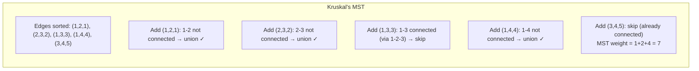

```
Kruskal():
    sort edges by weight
    MST = []
    for each edge (u, v, w) in sorted order:
        if Find(u) != Find(v):
            Union(u, v)
            MST.append((u, v, w))
    return MST
```

#### Prim's Algorithm

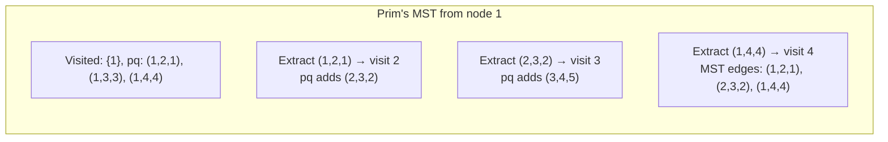
```

Prim(source):
    visited[1 .. V] = false
    pq = MinHeap([(0, source)])         # (weight, vertex)
    mstWeight = 0, mstEdges = []

    while pq is not empty:
        (w, u) = pq.extractMin()
        if visited[u]: continue         # already in MST
        visited[u] = true
        mstWeight += w
        mstEdges.append((w, u))

        for each (v, edgeWeight) in Adj[u]:
            if not visited[v]:
                pq.insert((edgeWeight, v))

    if mstEdges.size < V-1: return "Graph disconnected"
    return mstWeight, mstEdges
```

### Topological Sort

- Only for **DAG** (Directed Acyclic Graph)
- **Kahn's Algorithm (BFS)**: Use in-degree array; enqueue nodes with in-degree 0
- **DFS-based**: Append to result in reverse post-order


# Kahn's Algorithm
```
TopologicalSort():
    inDegree = compute in-degrees
    queue = all nodes with inDegree == 0
    result = []
    while queue not empty:
        node = queue.dequeue()
        result.append(node)
        for neighbor in adj[node]:
            inDegree[neighbor]--
            if inDegree[neighbor] == 0:
                queue.enqueue(neighbor)
    if len(result) != V: return "Cycle exists"
    return result
```

### Cycle Detection

| Graph Type | Method | Complexity |
|-----------|--------|:---:|
| Undirected | DFS (parent tracking) | O(V + E) |
| Undirected | Union-Find | O(V + E) |
| Directed | DFS (3-color: white/gray/black) | O(V + E) |
| Directed | Kahn's algorithm (check if all visited) | O(V + E) |

### Strongly Connected Components

| Algorithm | Method | Complexity |
|-----------|--------|:---:|
| **Kosaraju's** | Two DFS passes (original + transpose) | O(V + E) |
| **Tarjan's** | Single DFS with stack and low-link values | O(V + E) |

### Bridges and Articulation Points

> [!summary] Bridges (cut-edges) and articulation points (cut-vertices) identify single points of failure in a network. Tarjan's algorithm uses a single DFS with discovery time and **low-link** values (the earliest reachable ancestor via back edges). A bridge `(u, v)` exists if `low[v] > disc[u]`. An articulation point exists if `low[v] ≥ disc[u]` for any child `v` (except root), or root with ≥ 2 children.

```
DFS-Bridge(u, parent):
    disc[u] ← low[u] ← timer++
    for each v in Adj[u]:
        if v = parent: continue
        if not visited[v]:
            visited[v] ← true
            DFS-Bridge(v, u)
            low[u] ← min(low[u], low[v])
            if low[v] > disc[u]:            // edge (u, v) is a BRIDGE
                bridges.append((u, v))
        else:                               // back edge to ancestor
            low[u] ← min(low[u], disc[v])
```

```
DFS-Articulation(u, parent):
    disc[u] ← low[u] ← timer++
    children ← 0
    for each v in Adj[u]:
        if v = parent: continue
        if not visited[v]:
            visited[v] ← true
            DFS-Articulation(v, u)
            low[u] ← min(low[u], low[v])
            children++
            if parent ≠ NIL and low[v] ≥ disc[u]:
                articulation[u] ← true      // u is articulation point
        else:
            low[u] ← min(low[u], disc[v])
    if parent = NIL and children ≥ 2:       // root with 2+ children
        articulation[u] ← true
```

### Bipartite Graphs

- **Check**: BFS/DFS 2-coloring — O(V + E)
- **Maximum Bipartite Matching**: Hopcroft-Karp O(E√V) or Hungarian O(V^3)

### Euler Path / Circuit

- **Euler Circuit exists** if: all vertices have even degree (undirected) or equal in/out degree (directed)
- **Euler Path exists** if: exactly 0 or 2 vertices with odd degree
- **Hierholzer's Algorithm**: O(V + E)

### Pseudocode

#### DFS 3-Color Cycle Detection (Directed)
```
HasCycle(G):
    color[1 .. V] ← WHITE
    for v ← 1 to V:
        if color[v] = WHITE and CycleDFS(v, G, color):
            return true
    return false

CycleDFS(u, G, color):
    color[u] ← GRAY
    for each v in Adj[u]:
        if color[v] = GRAY: return true
        if color[v] = WHITE and CycleDFS(v, G, color): return true
    color[u] ← BLACK
    return false
```

#### Kosaraju's SCC
```
KosarajuSCC(G):
    // Pass 1: fill stack by finish time
    visited[1 .. V] ← false, stack ← empty
    for v ← 1 to V:
        if not visited[v]: DFSPost(G, v, visited, stack)
    // Transpose graph
    GT ← ReverseAllEdges(G)
    // Pass 2: process in reverse finish order
    visited ← {false}
    sccList ← []
    while stack not empty:
        v ← stack.pop()
        if not visited[v]:
            comp ← [], DFSTranspose(GT, v, visited, comp)
            sccList.append(comp)
    return sccList
```

#### Tarjan's SCC (Single Pass)
```
TarjanSCC(G):
    index ← 0, stack ← empty
    indices[1 .. V] ← -1, lowlink[1 .. V] ← -1
    onStack[1 .. V] ← false
    sccList ← []
    for v ← 1 to V:
        if indices[v] = -1: StrongConnect(v)
    return sccList

StrongConnect(v):
    indices[v] ← index, lowlink[v] ← index, index ← index + 1
    stack.push(v), onStack[v] ← true
    for each w in Adj[v]:
        if indices[w] = -1:              // unvisited
            StrongConnect(w)
            lowlink[v] ← min(lowlink[v], lowlink[w])
        else if onStack[w]:
            lowlink[v] ← min(lowlink[v], indices[w])
    if lowlink[v] = indices[v]:          // root of SCC
        comp ← []
        repeat:
            w ← stack.pop(), onStack[w] ← false
            comp.append(w)
        until w = v
        sccList.append(comp)
```

#### Hierholzer's Euler Circuit (Directed)
```
EulerCircuit(G, start):
    circuit ← []
    stack ← empty
    stack.push(start)
    while stack not empty:
        u ← stack.top()
        if Adj[u] is empty:
            circuit.append(u)
            stack.pop()
        else:
            v ← any neighbor from Adj[u]
            remove edge (u, v) from Adj[u]
            stack.push(v)
    reverse circuit
    return circuit
```

#### 0-1 BFS
```
ZeroOneBFS(G, source):
    dist[1 .. V] ← ∞
    dist[source] ← 0
    dq ← Deque, dq.pushFront(source)
    while dq not empty:
        u ← dq.popFront()
        for each (v, weight) in Adj[u]:       // weight = 0 or 1
            if dist[u] + weight < dist[v]:
                dist[v] ← dist[u] + weight
                if weight = 0:
                    dq.pushFront(v)
                else:
                    dq.pushBack(v)
    return dist
```

#### A* Search
```
AStarSearch(G, start, goal, heuristic):
    gScore[1 .. V] ← ∞, gScore[start] ← 0
    fScore[1 .. V] ← ∞, fScore[start] ← heuristic(start)
    openSet ← MinHeap of (fScore, node), openSet.insert((fScore[start], start))
    while openSet not empty:
        (_, u) ← openSet.extractMin()
        if u = goal: return ReconstructPath(parent, goal)
        for each (v, weight) in Adj[u]:
            tentative ← gScore[u] + weight
            if tentative < gScore[v]:
                gScore[v] ← tentative
                fScore[v] ← tentative + heuristic(v)
                parent[v] ← u
                openSet.insert((fScore[v], v))
    return failure
```

> [!warning] Pitfalls
> - **Dijkstra's with negative edges** — Dijkstra's greedily fixes distances; a negative edge can produce a shorter path through an already-processed node. Always use Bellman-Ford or SPFA when negative edges exist.
> - **DFS recursion depth on large graphs** — a graph with 10^5 nodes in a chain causes StackOverflowError with recursive DFS. Use an explicit Stack or BFS for large/deep graphs.
> - **Not tracking visited in undirected DFS** — without a visited set (or parent parameter to skip the previous node), DFS cycles infinitely between two connected nodes.
> - **Topological sort on cyclic graphs** — Kahn's algorithm (BFS) detects cycles (remaining nodes with non-zero indegree); DFS-based toposort requires cycle detection first. Attempting toposort on a cyclic graph silently produces incorrect orderings.
> - **MST for disconnected graphs** — Prim's and Kruskal's produce a **minimum spanning forest**, not a single tree, for disconnected graphs. Always check connectivity if the problem requires a single spanning tree.
> - **Floyd-Warshall for dense graphs only** — O(V³) is fine for V ≤ 500. For V > 500 with sparse edges, run Dijkstra from each source (O(V * E log V)) which is faster when E << V².
> - **Integer overflow in shortest path distances** — when using `Integer.MAX_VALUE` or `INF` for unreachable nodes, adding a weight to INF overflows to a negative number, breaking the algorithm. Use `Long.MAX_VALUE / 2` or add explicit overflow checks.

> [!question]- Q: When should I use BFS vs DFS?
> **Answer:** **BFS** = shortest path in unweighted graphs, level-order traversal, "minimum steps" problems. **DFS** = cycle detection, topological sort, connected components, SCCs, path existence (any path), backtracking on implicit graphs. BFS uses more memory (stores a level); DFS can get lost in deep paths.

> [!question]- Q: What's the difference between Dijkstra's and Bellman-Ford?
> **Answer:** **Dijkstra's** (O(E log V)): works only with non-negative edge weights; uses greedy selection via priority queue. **Bellman-Ford** (O(VE)): handles negative edges and detects negative cycles (n-th relaxation still improves distance). Use Dijkstra's unless negative edges are present.

> [!question]- Q: Why does Topological Sort matter and when is it used?
> **Answer:** Topological sort orders all vertices such that every directed edge u→v has u before v. Used for: task scheduling with dependencies, resolving build systems, finding shortest paths in DAGs (O(V+E)), and detecting deadlocks. Only possible on DAGs.

> [!question]- Q: What's the key idea behind Floyd-Warshall for all-pairs shortest paths?
> **Answer:** It iterates over intermediate vertices k, updating `dist[i][j] = min(dist[i][j], dist[i][k] + dist[k][j])`. After the k-th iteration, all shortest paths using vertices {1..k} as intermediates are computed. The DP recurrence is: either go through k or don't. O(V³) but extremely concise to implement.

### Resources

- [Graph Algorithms - GeeksforGeeks](https://www.geeksforgeeks.org/graph-data-structure-and-algorithms/)
- [William Fiset - Graph Theory (YouTube)](https://www.youtube.com/playlist?list=PLDV1Zeh2NRsDGO4--qE8yH72HFL1Km93)
- [Striver Graph Series (YouTube)](https://www.youtube.com/playlist?list=PLgUwDviBIf0oE3Ez5k1vh72d0UCKrpOyR)
- *CLRS* — Chapters 22-26

---

## 9. String Algorithms

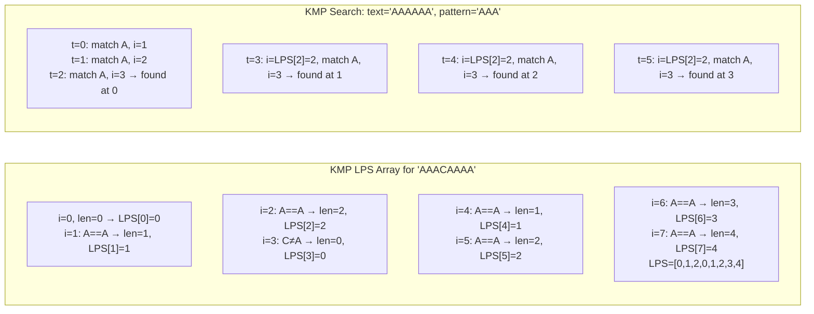

> [!tip] Java implementation reference
> ![[JAVA_IMPL/Java_04_Algorithms_Part2#Section Q: String Algorithms]]

### Pattern Matching

| Algorithm | Preprocessing | Matching | Total |
|-----------|:---:|:---:|:---:|
| **Brute Force** | O(1) | O(n * m) | O(n * m) |
| **KMP** | O(m) | O(n) | O(n + m) |
| **Rabin-Karp** | O(m) | O(n) avg, O(n*m) worst | O(n + m) avg |
| **Z-Algorithm** | O(n + m) | O(n + m) | O(n + m) |
| **Aho-Corasick** | O(Σ patterns) | O(n + matches) | Multi-pattern |
| **Boyer-Moore** | O(m + alphabet) | O(n/m) best | O(n + m) avg |
| **Suffix Array** | O(n log n) | O(m log n) | O(n log n) build |

#### Naive (Brute Force) String Search

> [!info] Naive search
> Slide the pattern over the text character by character. At each position, compare all `m` characters. If every character matches, record the match position. The simplest pattern-matching algorithm — useful for short patterns (m ≤ 5) or as a correctness baseline for advanced algorithms.

```
NaiveSearch(text[1 .. n], pattern[1 .. m]):
    matches ← []
    for i ← 1 to n - m + 1:           // Slide pattern over text
        j ← 1
        while j ≤ m and text[i + j - 1] = pattern[j]:
            j ← j + 1                 // Compare character by character
        if j = m + 1:                 // All m characters matched
            matches.append(i)         // Pattern found at position i
    return matches
```

| Operation | Complexity |
|:---------:|:----------:|
| Time (worst) | O(n * m) |
| Time (average) | O(n — early exit on mismatch) |
| Space | O(1) |

**Worst-case**: pattern = `"AAAA"`, text = `"AAAAAAAA"` — every shift compares all 4 characters.
**Best-case**: first character of pattern never matches — O(n) total comparisons.

```text
Example: text = "ABABC", pattern = "ABC"

Shift 0: A B A B C    Compare: A→A ✓  B→B ✓  A→C ✗  → mismatch at position 3
          | | |
          A B C
          
Shift 1: A B A B C    Compare: B→A ✗  → mismatch at position 1
            |
            A B C
            
Shift 2: A B A B C    Compare: A→A ✓  B→B ✓  C→C ✓  → found at position 3
              | | |
              A B C

Matches found at index 3.
```

#### KMP (Knuth-Morris-Pratt)

- Builds a **failure function** (partial match table / LPS array)
- Never backtracks in the text

```
BuildLPS(pattern):
    lps = [0] * len(pattern)
    length = 0
    i = 1
    while i < len(pattern):
        if pattern[i] == pattern[length]:
            length++
            lps[i] = length
            i++
        elif length != 0:
            length = lps[length - 1]
        else:
            lps[i] = 0
            i++
    return lps
```

#### Rabin-Karp

- Uses **rolling hash** for O(1) window shift
- Hash: `h(s) = (s[0]*d^(m-1) + s[1]*d^(m-2) + ... + s[m-1]) mod q`
- Good for multiple pattern matching

#### Z-Algorithm

- Z[i] = length of longest substring starting at i that matches a prefix
- Concatenate `pattern + "$" + text` and compute Z-array

### Other String Algorithms

| Algorithm | Purpose | Complexity |
|-----------|---------|:---:|
| **Manacher's** | Longest palindromic substring | O(n) |
| **Longest Common Substring** | DP or Suffix Array + LCP | O(n*m) or O(n log n) |
| **Edit Distance (Levenshtein)** | Min edits to transform | O(n * m) |
| **Trie-based algorithms** | Prefix queries, autocomplete | O(L) per query |
| **Suffix Automaton** | All substrings in O(n) space | O(n) build |

### Pseudocode

#### KMP Full Search
```
KMPSearch(text[1 .. n], pattern[1 .. m]):
    lps ← BuildLPS(pattern)               // see BuildLPS above
    matches ← []
    i ← 1, j ← 1
    while i ≤ n:
        if pattern[j] = text[i]:
            i ← i + 1, j ← j + 1
        if j = m + 1:
            matches.append(i - j + 1)
            j ← lps[j - 1]
        else if i ≤ n and pattern[j] ≠ text[i]:
            if j ≠ 1: j ← lps[j - 1]
            else: i ← i + 1
    return matches
```

#### Rabin-Karp
```
RabinKarp(text[1 .. n], pattern[1 .. m]):
    // Using base 256 and large prime mod (e.g., 10^9 + 7)
    patternHash ← ComputeHash(pattern, m)
    textHash ← ComputeHash(text, m)
    matches ← []
    pow ← base^(m - 1) mod mod
    for i ← 1 to n - m + 1:
        if patternHash = textHash and text[i .. i + m - 1] = pattern:
            matches.append(i)
        if i < n - m + 1:
            textHash ← ((textHash - text[i] * pow) * base + text[i + m]) mod mod
            if textHash < 0: textHash ← textHash + mod
    return matches
```

#### Z-Algorithm
```
ZAlgorithm(s[1 .. n]):
    Z[1 .. n] ← 0
    l ← 1, r ← 1
    for i ← 2 to n:
        if i ≤ r:
            Z[i] ← min(r - i + 1, Z[i - l + 1])
        while i + Z[i] ≤ n and s[Z[i] + 1] = s[i + Z[i]]:
            Z[i] ← Z[i] + 1
        if i + Z[i] - 1 > r:
            l ← i, r ← i + Z[i] - 1
    return Z
```

#### Manacher's Algorithm
```
Manacher(s):
    // Transform: "aba" → "#a#b#a#"
    t ← "#" + interleave s with "#" + "#"
    n ← |t|, P[1 .. n] ← 0
    C ← 1, R ← 1
    for i ← 2 to n - 1:
        mirror ← 2 * C - i
        if i < R: P[i] ← min(R - i, P[mirror])
        while t[i + P[i] + 1] = t[i - P[i] - 1]:
            P[i] ← P[i] + 1
        if i + P[i] > R:
            C ← i, R ← i + P[i]
    maxLen ← max(P), center ← index of max in P
    start ← (center - maxLen) / 2
    return s[start .. start + maxLen - 1]
```

> [!warning] Pitfalls
> - **KMP LPS array off-by-one** — the LPS value is the length of the longest proper prefix that is also a suffix. It is NOT the index to jump to; the jump target is `lps[j-1]` when a mismatch occurs at position j.
> - **Rabin-Karp hash collisions** — rolling hash is probabilistic; two different strings can have the same hash. Always verify matches with character-by-character comparison. Use a large prime modulus (e.g., 10^9+7) and double hashing to minimize collision probability.
> - **Z-Algorithm search string format** — when searching for pattern P in text T, concatenate `P + "$" + T`. The `$` separator (any character not in the alphabet) prevents Z-values from exceeding |P| by spanning across the pattern and text.
> - **Manacher's on non-padded strings** — Manacher's requires preprocessing: insert `#` between all characters (and at ends) to handle both even and odd-length palindromes uniformly. Skipping this step breaks the symmetry logic.
> - **Trie memory blowup** — a naive Trie with 26 children per node for the full alphabet wastes memory (26 * 10^5 pointers). Use a hashmap of children or compressed trie (Radix tree) for sparse alphabets.
> - **Comparing strings with `==` in Java** — `str1 == str2` compares references, not content. Always use `.equals()` for string value comparison.

> [!question]- Q: Why is KMP O(n + m) and not O(n * m) like brute force?
> **Answer:** KMP's text pointer `i` never backtracks. When a mismatch occurs, the LPS array tells exactly how much of the pattern prefix is still matched. Each character is compared at most twice — once when matching and once when a mismatch causes the pattern pointer to fall back. Total comparisons are bounded by O(2n).

> [!question]- Q: When should I use Rabin-Karp over KMP?
> **Answer:** Rabin-Karp shines for **multiple pattern matching** — searching for many patterns simultaneously. Compute hashes for all patterns, then slide the rolling hash over the text and check against a hash set. KMP builds a separate automaton per pattern. Also, RK's rolling hash is useful beyond string matching (e.g., finding duplicate substrings of fixed length).

> [!question]- Q: How does Manacher's algorithm achieve O(n) for longest palindromic substring?
> **Answer:** It exploits palindromic symmetry: when the current center i is inside a previously found palindrome centered at C with right boundary R, the palindrome at i matches the mirror palindrome at i' = 2C - i (at least up to R - i). This mirroring avoids re-checking known characters, giving O(n) total expansions.

> [!question]- Q: What's the difference between Suffix Array and Suffix Tree?
> **Answer:** Both index all suffixes of a string. **Suffix Tree** = explicit tree structure, O(n) construction but high memory overhead. **Suffix Array** = sorted array of suffix indices, O(n log n) or O(n) construction, lower memory. Suffix Array + LCP array provides the same functionality as Suffix Tree with less memory. Most competitive programming uses Suffix Array.

### Resources

- [String Algorithms - CP-Algorithms](https://cp-algorithms.com/string/)
- *CLRS* — Chapter 32

---

## 10. Mathematical Algorithms

> [!tip] Java implementation reference
> ![[JAVA_IMPL/Java_04_Algorithms_Part2#Section R: Mathematical Algorithms]]

---

## Assets and Attribution

- `assets/big-o-comparison.png`: derived from Wikimedia Commons file “Comparison computational complexity.svg” by Cmglee, licensed CC BY-SA 4.0. License: https://creativecommons.org/licenses/by-sa/4.0/ Source: https://commons.wikimedia.org/wiki/File:Comparison_computational_complexity.svg
- `assets/bfs-tree.png`: PNG preview of Wikimedia Commons file “Breadth-first-tree.svg” by Alexander Drichel, licensed CC BY 3.0 Unported. License: https://creativecommons.org/licenses/by/3.0/ Source: https://commons.wikimedia.org/wiki/File:Breadth-first-tree.svg

### Number Theory

| Algorithm | Purpose | Complexity |
|-----------|---------|:---:|
| **GCD (Euclidean)** | Greatest common divisor | O(log(min(a,b))) |
| **Extended Euclidean** | Find x, y: ax + by = gcd(a,b) | O(log(min(a,b))) |
| **Sieve of Eratosthenes** | All primes up to n | O(n log log n) |
| **Segmented Sieve** | Primes in range [L, R] | O(√R * log log R) |
| **Primality Test (Trial Division)** | Is n prime? | O(√n) |
| **Miller-Rabin** | Probabilistic primality test | O(k * log^2 n) |
| **Modular Exponentiation** | a^b mod m | O(log b) |
| **Modular Inverse** | a^(-1) mod m | O(log m) |
| **Chinese Remainder Theorem** | System of congruences | O(n log n) |
| **Euler's Totient Function** | Count of coprime numbers | O(√n) |
| **Fermat's Little Theorem** | a^(p-1) ≡ 1 (mod p) | Used for modular inverse |

### GCD and LCM

```
GCD(a, b):
    while b != 0:
        a, b = b, a % b
    return a

LCM(a, b) = (a * b) / GCD(a, b)
```

### Fast Exponentiation

```
Power(base, exp, mod):
    result = 1
    base = base % mod
    while exp > 0:
        if exp % 2 == 1:
            result = (result * base) % mod
        exp = exp >> 1
        base = (base * base) % mod
    return result
```

### Combinatorics

| Concept | Formula |
|---------|---------|
| **Permutations** | P(n, r) = n! / (n-r)! |
| **Combinations** | C(n, r) = n! / (r! * (n-r)!) |
| **Pascal's Triangle** | C(n, r) = C(n-1, r-1) + C(n-1, r) |
| **Stars and Bars** | Distributing n identical items into k bins: C(n+k-1, k-1) |
| **Catalan Numbers** | C_n = C(2n, n) / (n+1); valid parentheses, BSTs, etc. |
| **Fibonacci Numbers** | F(n) = F(n-1) + F(n-2); matrix exponentiation for O(log n) |
| **Inclusion-Exclusion** | |A∪B| = |A| + |B| - |A∩B| |
| **Pigeonhole Principle** | n items in m boxes (n > m) → at least one box has > 1 |

### How to Recognize

| Problem Pattern | Math Technique |
|-----------------|---------------|
| "GCD / LCM / factors / divisors" | Euclidean algorithm, prime factorization |
| "Prime numbers up to n" | Sieve of Eratosthenes |
| "Is this number prime?" | Miller-Rabin (large numbers), trial division (small) |
| "a^b mod m" (large exponent) | Fast exponentiation (binary exponentiation) |
| "nCr / permutations modulo p" | Precomputed factorials + modular inverse |
| "Solve system of congruences" | Chinese Remainder Theorem |
| "Linear recurrence (Fibonacci, tribonacci)" | Matrix exponentiation |
| "Count coprime numbers up to n" | Euler's Totient Function |
| "Distribute identical items into bins" | Stars and Bars combinatorics |

### Matrix Exponentiation

- Compute nth Fibonacci / linear recurrence in O(k^3 * log n)
- Matrix multiplication + fast exponentiation

### Pseudocode

#### Extended Euclidean Algorithm
```
ExtendedGCD(a, b):
    if b = 0:
        return (a, 1, 0)         // GCD, x, y such that ax + by = GCD
    (g, x1, y1) ← ExtendedGCD(b, a mod b)
    x ← y1
    y ← x1 - ⌊a / b⌋ * y1
    return (g, x, y)
```

#### Modular Inverse
```
ModInverse(a, m):
    (g, x, _) ← ExtendedGCD(a, m)
    if g ≠ 1: return NIL          // inverse doesn't exist
    return (x mod m + m) mod m
```

#### Sieve of Eratosthenes
```
Sieve(n):
    isPrime[1 .. n] ← true
    isPrime[1] ← false
    for i ← 2 to ⌊√n⌋:
        if isPrime[i]:
            for j ← i * i to n step i:
                isPrime[j] ← false
    return list of i where isPrime[i] = true
```

#### Miller-Rabin Primality Test
```
MillerRabin(n, k):                   // k = number of rounds
    if n ≤ 3: return true
    if n mod 2 = 0: return false
    // Write n - 1 = d * 2^s
    s ← 0, d ← n - 1
    while d mod 2 = 0: s ← s + 1, d ← d / 2
    for round ← 1 to k:
        a ← random in [2, n - 2]
        x ← ModularExp(a, d, n)
        if x = 1 or x = n - 1: continue
        for r ← 1 to s - 1:
            x ← (x * x) mod n
            if x = n - 1: break
        if x ≠ n - 1: return false
    return true
```

#### Matrix Exponentiation (Nth Fibonacci)
```
NthFibonacci(n):
    if n = 0: return 0
    M ← [[1, 1], [1, 0]]
    result ← MatrixPower(M, n - 1)     // fast exponentiation
    return result[1][1]

MatrixPower(M, exp):
    result ← IdentityMatrix(2)
    base ← M
    while exp > 0:
        if exp mod 2 = 1: result ← result * base
        base ← base * base
        exp ← exp / 2
    return result
```

#### nCr modulo m (using factorial precomputation)
```
BinomialMod(n, r, mod):
    fact[0 .. n] ← precompute factorials mod mod
    invFact[0 .. n] ← precompute inverse factorials mod mod
    return fact[n] * invFact[r] % mod * invFact[n - r] % mod
```

> [!warning] Pitfalls
> - **Integer overflow in modular arithmetic** — `(a * b) % mod` overflows if `a * b > Long.MAX_VALUE` in 64-bit. Use modular multiplication with binary exponentiation or 128-bit intermediates (`__int128` in C++, `BigInteger` in Java) for very large moduli.
> - **Sieve vs Primality Test confusion** — Sieve of Eratosthenes precomputes all primes up to n in O(n log log n) — good for many queries. For checking a single large number (n > 10^12), use Miller-Rabin (probabilistic). Running Sieve for a single primality check is wasteful.
> - **GCD of negative numbers** — `a % b` in some languages (C++, Java) returns a negative result when `a` is negative. `gcd(abs(a), abs(b))` guarantees correctness, or use `gcd(a, (b%a + a)%a)`.
> - **Fermat's Little Theorem assumptions** — `a^(p-1) ≡ 1 (mod p)` only holds when `p` is prime AND `a` is not divisible by `p`. For modular inverse: `a^(p-2) mod p` only works when p is prime and gcd(a,p) = 1.
> - **Combinatorics overflow in nCr** — `nCr` grows extremely fast (C(100, 50) has 30 digits). Use modulo arithmetic or big integers. Precomputing factorials up to n is O(n) space — use O(1) space multiplicative formula if memory is tight.
> - **Matrix exponentiation for non-linear recurrences** — only works for **linear** recurrences (like Fibonacci). Problems like "Catalan numbers" or "subset-based DP" cannot be expressed as matrix exponentiation.

> [!question]- Q: What's the time complexity of the Sieve of Eratosthenes and why?
> **Answer:** O(n log log n). For each prime p, we mark all multiples starting from p². The sum of 1/p over primes ≤ n is approximately log log n, giving total operations ≈ n * Σ(1/p) ≈ n log log n. The inner loop runs roughly n/2 + n/3 + n/5 + ... = n * (1/2 + 1/3 + 1/5 + ...).

> [!question]- Q: How do you compute nCr mod p when p is prime?
> **Answer:** Precompute factorials and inverse factorials up to n modulo p: `fact[i] = fact[i-1] * i % p`, `invFact[n] = pow(fact[n], p-2, p)` (Fermat's Little Theorem), and `invFact[i-1] = invFact[i] * i % p` (downward). Then `nCr = fact[n] * invFact[r] % p * invFact[n-r] % p`. O(n) preprocessing, O(1) per query.

> [!question]- Q: When would you use Extended Euclidean over Fermat for modular inverse?
> **Answer:** Extended Euclidean works for any modulus m (not necessarily prime) as long as gcd(a, m) = 1. Fermat's Little Theorem (a^(m-2) mod m) only works when m is prime. Use Extended Euclidean for composite moduli or when you're unsure about primality.

> [!question]- Q: How does matrix exponentiation compute Fibonacci in O(log n)?
> **Answer:** `[F(n), F(n-1)] = [F(1), F(0)] * M^(n-1)` where M = [[1,1],[1,0]]. Computing M^(n-1) uses fast exponentiation (square and multiply) in O(log n) matrix multiplications. Each 2×2 matrix mult is O(k³) = O(8). Total: O(log n).

### Resources

- [Mathematical Algorithms - GeeksforGeeks](https://www.geeksforgeeks.org/mathematical-algorithms/)
- [Number Theory - CP-Algorithms](https://cp-algorithms.com/algebra/)
- *CLRS* — Chapter 31

---

## 11. Bit Manipulation

> [!summary] Intuition
> Bit manipulation is the art of exploiting a number's **binary representation** for O(1) operations that would normally take loops. Instead of iterating through bits to count set bits, use `n & (n-1)` (clears the lowest set bit). Instead of checking even/odd with modulo, use `n & 1`. Bitwise operations are the **fastest CPU instructions** — they translate directly to single machine instructions with no branching.

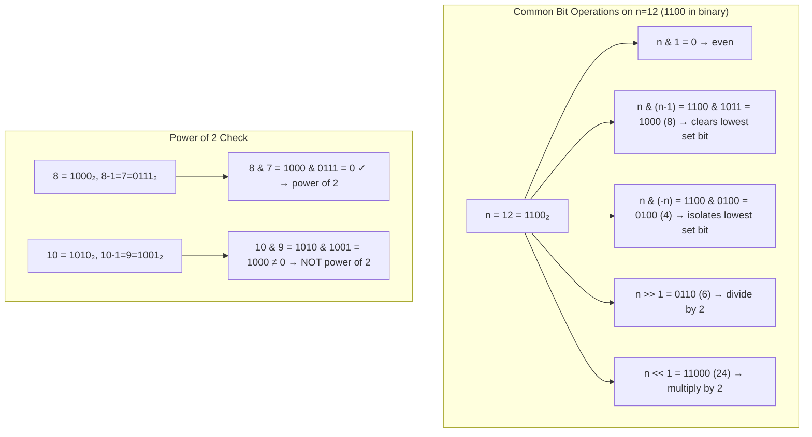

### How to Recognize

| Problem Pattern | Bit Manipulation Approach |
|-----------------|--------------------------|
| "Every number appears twice except one" | XOR all elements (a ^ a = 0) |
| "Find the only non-duplicate / missing number" | XOR with indices or expected values |
| "Power of 2 / 4 / 8 check" | `n & (n-1) == 0` |
| "Count set bits (popcount)" | Brian Kernighan's: `n &= n-1` in a loop |
| "Generate all subsets / combinations" | Bitmask: `for mask in 0..(1<<n)-1` |
| "Toggle / set / clear specific bits" | Shift and mask operations |
| "Reverse bits / swap bits" | Shift + mask + OR |
| "Add two numbers without +" | XOR for sum, AND for carry |
| "Division / multiplication by powers of 2" | `n >> k` (÷2^k), `n << k` (×2^k) |
| "Gray code generation" | `i ^ (i >> 1)` |

### Basic Operations

| Operation | Syntax | Result |
|-----------|--------|--------|
| AND | `a & b` | 1 if both bits are 1 |
| OR | `a \| b` | 1 if either bit is 1 |
| XOR | `a ^ b` | 1 if bits are different |
| NOT | `~a` | Flip all bits |
| Left Shift | `a << k` | Multiply by 2^k |
| Right Shift | `a >> k` | Divide by 2^k |

### Common Tricks

| Trick | Code | Purpose |
|-------|------|---------|
| Check if even | `n & 1 == 0` | Last bit is 0 |
| Check if power of 2 | `n & (n-1) == 0` | Only one bit set |
| Get ith bit | `(n >> i) & 1` | Extract bit |
| Set ith bit | `n \| (1 << i)` | Set to 1 |
| Clear ith bit | `n & ~(1 << i)` | Set to 0 |
| Toggle ith bit | `n ^ (1 << i)` | Flip bit |
| Count set bits | `__builtin_popcount(n)` | Number of 1s |
| Lowest set bit | `n & (-n)` | Isolate rightmost 1 |
| Turn off lowest set bit | `n & (n-1)` | Brian Kernighan's |
| Check if bits i..j are all set | `((n >> i) & ((1 << (j-i+1)) - 1)) == (1 << (j-i+1)) - 1` | Range check |
| Swap without temp | `a ^= b; b ^= a; a ^= b` | XOR swap |
| Get sign | `(n >> 31) & 1` | 0 positive, 1 negative |

### Bitmask / Subset Enumeration

```
# Enumerate all subsets of a set with n elements
for mask = 0 to (1 << n) - 1:
    # mask represents a subset

# Enumerate all subsets of a given mask
submask = mask
while submask > 0:
    # process submask
    submask = (submask - 1) & mask
```

### Common Problems

- Single Number (XOR all elements)
- Single Number II (bit counting mod 3)
- Missing Number (XOR with indices)
- Reverse bits
- Number of 1 bits (Hamming weight)
- Hamming distance
- Subsets using bitmask
- Maximum XOR of two numbers (trie-based)
- Bitwise AND of range
- Power of two/four
- Sum of two integers without + operator
- Divide two integers without / operator

### Pseudocode

#### Brian Kernighan's Popcount
```
Popcount(n):
    count ← 0
    while n > 0:
        n ← n & (n - 1)       // clears lowest set bit
        count ← count + 1
    return count
```

#### Gray Code Generation
```
GrayCode(n):
    result ← []
    for i ← 0 to (1 << n) - 1:
        result.append(i ^ (i >> 1))
    return result
```

#### Single Number III (find 2 unique numbers)
```
TwoUniqueNumbers(A[1 .. n]):
    xorAll ← 0
    for each x in A: xorAll ← xorAll ^ x
    // Find rightmost set bit (separates the two numbers)
    diff ← xorAll & (-xorAll)
    num1 ← 0, num2 ← 0
    for each x in A:
        if x & diff ≠ 0: num1 ← num1 ^ x
        else: num2 ← num2 ^ x
    return [num1, num2]
```

> [!warning] Pitfalls
> - **Operator precedence** — `n & 1 == 0` is parsed as `n & (1 == 0)`, not `(n & 1) == 0`. Always parenthesize: `(n & 1) == 0`.
> - **Right shift with signed integers** — `>>` on signed integers in Java does **arithmetic** right shift (preserves sign bit, fills with 1s for negatives). Use `>>>` for logical right shift when you need zero-fill.
> - **Overflow in left shift** — `1 << 31` on a 32-bit signed integer becomes `Integer.MIN_VALUE` (-2147483648). Use `1L << k` for positions beyond 30.
> - **`n & (n-1)` on zero** — this is undefined for n=0 in some contexts. Always guard with `while n > 0` in Kernighan's popcount.
> - **XOR swap with same variable** — `a ^= a` sets a to 0, not preserving the original. The XOR swap trick fails if `a` and `b` are the same memory location (aliasing).
> - **Bitmask subset enumeration order** — `submask = (submask - 1) & mask` visits subsets in **decreasing** order, ending at 0. If you need increasing order, sort the results separately.
> - **Assuming 0-based vs 1-based bit indexing** — the "ith bit" can mean the bit at position `1 << i` (0-indexed LSB) or the ith least significant bit (1-indexed). Clarify which convention the problem uses.

> [!question]- Q: Why use `n & 1` instead of `n % 2` to check even/odd?
> **Answer:** Bitwise operations are a single CPU cycle with no branching. Modulo involves division, which is ~10-30x slower. For hot loops, it matters. For readability, both are fine in most code.

> [!question]- Q: How do I generate all subsets of a set using bitmasks?
> **Answer:** Each subset of an n-element set corresponds to an n-bit number (0 to 2^n - 1). Bit j = 1 means "include element j". Loop `for (int mask = 0; mask < (1 << n); mask++)` to enumerate all subsets in O(2^n).

> [!question]- Q: What's the time complexity of Brian Kernighan's popcount?
> **Answer:** O(k) where k is the number of set bits, not the total number of bits. Each iteration clears one set bit. In the worst case (all bits set), it's O(number of bits). This is faster than checking each bit individually.

> [!question]- Q: How do you swap two numbers without a temporary variable?
> **Answer:** Using XOR: `a ^= b; b ^= a; a ^= b`. This works because XOR is its own inverse and commutative. However, modern compilers already optimize `temp = a; a = b; b = temp` to register-only operations, so XOR swap is mainly a curiosity, not a performance gain.

### Resources

- [Bit Manipulation - GeeksforGeeks](https://www.geeksforgeeks.org/bit-manipulation-technique/)
- [Bit Manipulation - Errichto (YouTube)](https://www.youtube.com/watch?v=xXKL9YBWgCY)

---

## 12. Two Pointers and Sliding Window

> [!summary] Intuition
> Instead of checking every possible subarray with nested loops (O(n²)), you maintain a **window** (or two pointers) that scans the array in a single pass. Think of it like a **sliding glass pane** moving along a bookshelf — you add to the right side, remove from the left, and the pane stays focused on the current section of interest. Two pointers are the same idea but with two markers that converge or chase each other.

```mermaid
flowchart TD
    subgraph TP["Two Pointers: Opposite Direction (Two Sum Sorted)"]
        T1["Array: [2, 7, 11, 15], target = 9"] --> T2["L=0(2), R=3(15): 2+15=17 > 9 → R=2"]
        T2 --> T3["L=0(2), R=2(11): 2+11=13 > 9 → R=1"]
        T3 --> T4["L=0(2), R=1(7): 2+7=9 = target ✓"]
    end
    subgraph SW["Sliding Window (Variable-Size): Longest Substring Without Repeating"]
        W1["'abcabcbb': {a}, max=1"] --> W2["'abc': {a,b,c}, max=3"]
        W2 --> W3["'abca': duplicate 'a' → shrink left to {b,c,a}, max=3"]
        W3 --> W4["'bcab': duplicate 'b' → shrink left to {c,a,b}, max=3"]
        W4 --> W5["'cabc': duplicate 'c' → shrink left to {a,b,c}, max=3"]
        W5 --> W6["Final: max = 3"]
    end
```

### How to Recognize

| Problem Pattern | Technique |
|-----------------|-----------|
| "Subarray with sum = X" or constraint | Sliding Window / Prefix Sum with Two Pointers |
| "Longest substring with at most K distinct chars" | Variable-size Sliding Window |
| Sorted array + find pair/triplet with sum | Two Pointers (opposite direction) |
| "Remove duplicates in-place from sorted array" | Two Pointers (slow/fast, read/write) |
| "Check if palindrome" | Two Pointers (opposite ends) |
| "Container with most water / trapping rain water" | Two Pointers (opposite direction, greedy) |
| "Linked list cycle detection / find middle" | Two Pointers (slow/fast, Floyd's algorithm) |

### Two Pointers

Technique using two indices that move through the data structure, typically in the same or opposite directions.

#### Patterns

| Pattern | When to Use | Example |
|---------|-------------|---------|
| **Opposite direction** | Sorted array, palindrome | Two Sum (sorted), Container With Most Water |
| **Same direction (fast/slow)** | Linked list cycle, middle | Floyd's cycle detection |
| **Same direction (read/write)** | Remove duplicates in-place | Remove Duplicates from Sorted Array |
| **Two arrays** | Merge, intersect | Merge Sorted Arrays |

#### Common Problems

- Two Sum (sorted array)
- Three Sum / Four Sum
- Container With Most Water
- Trapping Rain Water
- Remove duplicates from sorted array
- Sort colors (Dutch National Flag)
- Palindrome check
- Merge sorted arrays
- Squares of sorted array
- Backspace string compare

### Sliding Window

A window that slides over data to examine contiguous subarrays/substrings.

#### Fixed-Size Window

```
# Window of size k
windowSum = sum(arr[0:k])
maxSum = windowSum
for i = k to n-1:
    windowSum += arr[i] - arr[i-k]
    maxSum = max(maxSum, windowSum)
```

#### Variable-Size Window (Expand/Shrink)

```
left = 0
for right = 0 to n-1:
    # expand: add arr[right] to window
    while window is invalid:
        # shrink: remove arr[left] from window
        left++
    # update answer
```

#### Common Problems

| Problem | Type |
|---------|------|
| Max sum subarray of size k | Fixed |
| Longest substring without repeating chars | Variable |
| Minimum window substring | Variable |
| Longest substring with at most k distinct chars | Variable |
| Max consecutive ones III | Variable |
| Permutation in string | Fixed |
| Fruit into baskets | Variable |
| Sliding window maximum | Fixed (with deque) |
| Subarrays with k different integers | Variable |
| Minimum size subarray sum | Variable |

> [!warning] Pitfalls
> - **Window validity check** — forgetting to validate the window after shrinking leads to incorrect maximums/minimums. Always check `while (invalid) shrink` inside the loop.
> - **Off-by-one with fixed windows** — the window size `k` covers indices `[i-k+1, i]` or `[i, i+k-1]`, not `[i-k, i]`. Double-check the subtraction step.
> - **Using opposite-direction two pointers on unsorted data** — "Two Sum" with opposite pointers only works on sorted arrays. For unsorted, use a hash map.
> - **Infinite loop in slow/fast pointers** — the while condition `fast != null && fast.next != null` must check both, otherwise you'll null-dereference.
> - **Shrinking too much or too little** — in variable windows, the while condition should check if the window is **invalid**, not if it's just suboptimal. Otherwise you lose valid candidates.
> - **Nested for-each instead of sliding window** — for fixed-size windows, compute the first window separately, then slide. Don't recompute from scratch each time (O(n*k) instead of O(n)).
> - **Forgetting to update the answer inside the loop** — some problems need you to record the answer during expansion, some during shrinking, some after both. Read the problem constraints carefully.

> [!question]- Q: When should I use Two Pointers vs Sliding Window?
> **Answer:** Two Pointers is the umbrella term. **Sliding Window** = both pointers move monotonically forward (never backward), maintaining a subarray/substring. Other Two Pointer patterns include opposite-direction (sorted array pair search) and fast/slow (linked lists). If you're processing contiguous subarrays, it's a sliding window problem.

> [!question]- Q: How do I handle the fixed-size vs variable-size window distinction?
> **Answer:** **Fixed-size**: the right pointer moves forward each iteration, and the left follows at `right - k`. Compute first window separately, then slide by subtracting `A[left]` and adding `A[right]`. **Variable-size**: the right pointer also moves forward, but the left advances only when a constraint is violated. The window grows and shrinks dynamically.

> [!question]- Q: Why use while (invalid) instead of if (invalid) when shrinking?
> **Answer:** After removing one element, the window might still be invalid. For example, with "at most 2 distinct characters", removing one character might still leave 3 distinct characters in the window. A `while` loop ensures the window is fully valid before recording the answer.

> [!question]- Q: What's the time complexity of Sliding Window?
> **Answer:** O(n) — each element is added once (right pointer) and removed at most once (left pointer). Even though there's a nested while loop, the left pointer advances across the entire array exactly once, so total work is O(2n) = O(n).

### Resources

- [Two Pointers - GeeksforGeeks](https://www.geeksforgeeks.org/two-pointers-technique/)
- [Sliding Window - Aditya Verma (YouTube)](https://www.youtube.com/playlist?list=PL_z_8CaSLPWeM8BDJmIYDnRPO1Jkt4f1p)

---

## 13. Binary Search (Advanced Applications)

> [!summary] Intuition
> Binary search isn't just for finding numbers in sorted arrays. It's a **decision-to-answer** mapper: when you can answer "is X possible?" in O(n), you can find the **optimal** X in O(n log n) by binary searching the answer space. Imagine searching for the minimum speed to eat all bananas — instead of trying every speed from 1 to max, you binary search: "Can I finish at speed 50? Yes → try slower. No → try faster." The monotonic predicate does the heavy lifting.

```mermaid
flowchart TD
    subgraph BSAnswer["Binary Search on Answer: Koko Eating Bananas"]
        PA["piles = [3,6,7,11], hours = 8"] --> PB["mid=6: hours = ceil(3/6)+ceil(6/6)+ceil(7/6)+ceil(11/6) = 1+1+2+2 = 6 ≤ 8 ✓ → hi=6"]
        PB --> PC["mid=3: hours = 1+2+3+4 = 10 > 8 ✗ → lo=4"]
        PC --> PD["mid=5: hours = 1+2+2+3 = 8 ≤ 8 ✓ → hi=5"]
        PD --> PE["mid=4: hours = 1+2+2+3 = 8 ≤ 8 ✓ → hi=4"]
        PE --> PF["lo=hi=4 → optimal speed = 4 ✓"]
    end
    subgraph Rotated["Binary Search in Rotated Sorted Array"]
        R1["arr = [4,5,6,7,0,1,2], target = 0"] --> R2["mid=3(arr[3]=7): left half sorted(4≤7), 0 not in [4,7] → lo=4"]
        R2 --> R3["mid=5(arr[5]=1): left half sorted(0≤1), 0 in [0,1] → hi=4"]
        R3 --> R4["mid=4(arr[4]=0): found ✓"]
    end
```

### How to Recognize

| Problem Pattern | Likely Variation |
|-----------------|-----------------|
| "Minimize the maximum" / "Maximize the minimum" | Binary Search on Answer |
| "Capacity / speed / distance to meet a deadline" | Binary Search on Answer with feasibility check |
| Sorted but rotated/unknown pivot | Modified binary search |
| "Find peak / find valley" | Binary search on unimodal array |
| "Two sorted arrays → find median" | Binary search on partitions |
| "Value exists within a monotonic range" | Binary search on function output |
| "Allocate / split / divide with constraints" | Binary search on answer + greedy feasibility |

### Binary Search on Answer

When the answer space is monotonic (if x works, then x+1 also works or vice versa), binary search on the answer.

```
BinarySearchOnAnswer(lo, hi):
    while lo < hi:
        mid = (lo + hi) / 2
        if feasible(mid):
            hi = mid        # or lo = mid (depending on direction)
        else:
            lo = mid + 1    # or hi = mid - 1
    return lo
```

### Common Problems

| Problem | Search Space |
|---------|-------------|
| Koko eating bananas | Speed (1 to max pile) |
| Capacity to ship packages in D days | Capacity |
| Split array largest sum | Max subarray sum |
| Magnetic balls (aggressive cows) | Minimum distance |
| Allocate books | Maximum pages |
| Median of two sorted arrays | Partition index |
| Nth magical number | Value |
| Find peak element | Index |
| Search in rotated sorted array | Index |
| Find minimum in rotated sorted array | Index |
| Time-based key-value store | Timestamp |

### Ternary Search

- For unimodal functions (single peak/valley)
- Divide range into thirds
- O(log n) with larger constant than binary search

### Pseudocode

#### Find Peak Element
```
FindPeak(A[1 .. n]):
    lo ← 1, hi ← n
    while lo < hi:
        mid ← (lo + hi) / 2
        if A[mid] > A[mid + 1]:
            hi ← mid
        else:
            lo ← mid + 1
    return lo
```

#### Median of Two Sorted Arrays
```
FindMedianSorted(A[1 .. n], B[1 .. m]):
    if n > m: return FindMedianSorted(B, A)   // ensure A is shorter
    total ← n + m
    half ← (total + 1) / 2
    lo ← 0, hi ← n
    while lo ≤ hi:
        i ← (lo + hi) / 2                     // partition of A
        j ← half - i                           // partition of B
        ALeft ← (i = 0) ? -∞ : A[i]
        ARight ← (i = n) ? ∞ : A[i + 1]
        BLeft ← (j = 0) ? -∞ : B[j]
        BRight ← (j = m) ? ∞ : B[j + 1]
        if ALeft ≤ BRight and BLeft ≤ ARight:
            if total mod 2 = 1:
                return max(ALeft, BLeft)
            else:
                return (max(ALeft, BLeft) + min(ARight, BRight)) / 2.0
        else if ALeft > BRight:
            hi ← i - 1
        else:
            lo ← i + 1
    return -1
```

> [!warning] Pitfalls
> - **Incorrect feasibility direction** — when checking `feasible(mid)`, know which direction shrinks the answer. For "minimize maximum", if feasible → try smaller (hi=mid). For "maximize minimum", if feasible → try larger (lo=mid). Getting this backwards overcuts the search space.
> - **Off-by-one in mid and lo/hi updates** — the template `while lo < hi` with `mid = (lo+hi)/2`, `lo = mid+1` or `hi = mid` must be consistent. Mixing `hi = mid - 1` with `lo = mid` can cause infinite loops.
> - **Integer overflow in mid** — always use `mid = lo + (hi - lo) / 2` instead of `(lo + hi) / 2`.
> - **Assuming monotonicity without proof** — not every problem is monotonic. Test small examples: does "possible at X" imply "possible at X+1"? If not, binary search on answer won't work.
> - **Wrong binary search in rotated arrays** — after checking which half is sorted, verify the target is in that range using both boundary comparisons. Skipping the range check misses the target even in the sorted half.
> - **Ternary search on non-unimodal functions** — ternary search only works for strictly unimodal functions (single peak/valley, no plateaus). Use binary search instead when unsure.

> [!question]- Q: What makes a problem suitable for Binary Search on Answer?
> **Answer:** A monotonic predicate: "if X works, then all values > X also work" (or "< X"). Classic examples: can you finish eating by time T? If yes at speed 10, you can also finish at speeds 11, 12, etc. This monotonicity lets you binary search the answer directly.

> [!question]- Q: How is binary search in a rotated sorted array different from normal binary search?
> **Answer:** After computing the midpoint, you check **which half is sorted** (left half if `A[lo] <= A[mid]`, right half otherwise). Then check if the target falls within that sorted half. If yes, search that half; otherwise, search the other. Still O(log n), but with an extra conditional.

> [!question]- Q: When does Ternary Search make sense over Binary Search?
> **Answer:** Only for **unimodal** functions — finding the minimum/maximum of a parabola-like curve. Binary search works on monotonic predicates; ternary search works when the function increases then decreases (or vice versa). In practice, ternary search is rare — most "find peak" problems are solved with binary search comparing A[mid] with A[mid+1].

> [!question]- Q: Why use `while (lo < hi)` vs `while (lo <= hi)`?
> **Answer:** `while (lo < hi)` converges to a single element (the answer) and works well for "find minimum feasible value" problems. `while (lo <= hi)` is better for "does element exist?" problems. The key is that `lo < hi + mid=lo+(hi-lo)/2 + lo=mid+1` won't infinite-loop because mid rounds down, so lo always advances.

### Resources

- [Binary Search - CP-Algorithms](https://cp-algorithms.com/num_methods/binary_search.html)
- [Binary Search - Striver (YouTube)](https://www.youtube.com/playlist?list=PLgUwDviBIf0pMFMWuuvDNMAkoQFi-h0ZF)

---

## 14. Interval Algorithms

### Common Operations

| Operation | Approach | Complexity |
|-----------|----------|:---:|
| Merge overlapping intervals | Sort by start, merge | O(n log n) |
| Insert interval | Binary search + merge | O(n) |
| Interval intersection | Two pointers | O(n + m) |
| Meeting rooms (can attend all?) | Sort, check overlap | O(n log n) |
| Meeting rooms II (min rooms) | Sort starts/ends separately | O(n log n) |
| Non-overlapping intervals | Greedy by end time | O(n log n) |
| Employee free time | Merge + find gaps | O(n log n) |

> [!warning] Pitfalls
> - **Sorting by the wrong field** — merging intervals requires sorting by **start time**, but "minimum meeting rooms" requires sorting starts and ends **separately**. Mixing these up gives wrong results.
> - **Modifying the input array in-place** — intervals are often passed as references; mutating them breaks upstream code. Create a new result list instead of modifying the input.
> - **Forgetting to handle the last interval** — after merging, the last interval in the sorted list might not be added to results. Always handle the final state outside the loop.
> - **Overlapping vs touching** — some problems define overlap strictly (`[1,2]` and `[2,3]` don't overlap), others loosely. Clarify whether endpoints touch. For meeting rooms, back-to-back is fine; for conflict detection, it may not be.
> - **Binary search insert without merging** — inserting an interval into a sorted list and then merging is O(n log n). It's better to merge inline in O(n) by finding the insertion point and merging overlapping neighbors in one pass.
> - **Line sweep with open/close events** — interval start events should be processed before end events when they share the same timestamp, otherwise you may count an extra overlap that doesn't exist.

> [!question]- Q: What's the standard pattern for merging overlapping intervals?
> **Answer:** Sort by start time. Initialize `result = [intervals[0]]`. For each remaining interval, compare with `result.last()`. If overlapping (`interval.start <= last.end`), extend `last.end = max(last.end, interval.end)`. Otherwise, push the new interval. O(n log n) due to sorting.

> [!question]- Q: What's the difference between Interval Scheduling and Interval Partitioning?
> **Answer:** **Scheduling** = pick the maximum number of non-overlapping intervals (greedy: sort by end time). **Partitioning** = find the minimum number of resources/rooms needed (line sweep: track max concurrent intervals). They have different goals and different solutions.

> [!question]- Q: How do you handle the "insert interval" problem efficiently?
> **Answer:** Since intervals are already sorted and non-overlapping, scan to find the insertion point. Add all intervals that end before the new one starts. Then merge any overlapping ones. Then add the rest. O(n) total, no need to sort.

> [!question]- Q: Why does Meeting Rooms II work by sorting starts and ends separately?
> **Answer:** You process events in chronological order. A start event means a new room is needed; an end event means a room frees up. The max number of simultaneous meetings equals the max difference between starts and ends processed. This is effectively a line sweep.

### Pseudocode

#### Merge Overlapping Intervals
```
MergeIntervals(intervals[1 .. n]):           // sorted by start
    result ← [intervals[1]]
    for i ← 2 to n:
        last ← result.last()
        if intervals[i].start ≤ last.end:
            last.end ← max(last.end, intervals[i].end)
        else:
            result.append(intervals[i])
    return result
```

#### Insert Interval
```
InsertInterval(intervals[1 .. n], newInterval):   // intervals sorted, no overlap
    result ← []
    i ← 1
    // Add all intervals before newInterval
    while i ≤ n and intervals[i].end < newInterval.start:
        result.append(intervals[i]), i ← i + 1
    // Merge overlapping intervals
    while i ≤ n and intervals[i].start ≤ newInterval.end:
        newInterval.start ← min(newInterval.start, intervals[i].start)
        newInterval.end ← max(newInterval.end, intervals[i].end)
        i ← i + 1
    result.append(newInterval)
    // Add remaining intervals
    while i ≤ n:
        result.append(intervals[i]), i ← i + 1
    return result
```

### Resources

- [Interval Problems - LeetCode Discuss](https://leetcode.com/discuss/general-discussion/794725/)

---

## 15. Randomized Algorithms

> [!summary] Intuition
> Randomized algorithms use a **coin flip** somewhere in their logic. Instead of always picking the best or middle element, they roll the dice. This randomness breaks pathological worst-case inputs — even if an adversary knows your algorithm, they can't craft a worst-case input because the algorithm's behavior changes each run. Think of Random QuickSort: by picking a random pivot, no particular input can force O(n²) every time; the expected time is always O(n log n).

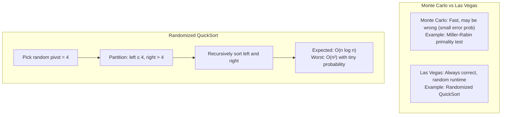

### How to Recognize

| Problem Pattern | Technique |
|-----------------|-----------|
| Need O(n) selection from unsorted data | Randomized QuickSelect |
| Stream of unknown length, need random sample | Reservoir Sampling |
| Generate random permutation | Fisher-Yates Shuffle |
| Primality test with probabilistic guarantee | Miller-Rabin |
| Large graph min-cut problem | Karger's Randomized Min-Cut |
| Avoid adversarial worst-case in sorting/selection | Random pivot selection |
| Hash-based data structures with collisions | Universal hashing / randomized hash |

### Two Key Flavors

| Type | Correctness | Runtime | Example |
|------|:---:|:---:|---------|
| **Monte Carlo** | Always fast | May be wrong (bounded error probability) | Miller-Rabin, Karger's Min-Cut |
| **Las Vegas** | Always correct | Random (expected bound, rare worst-case) | Randomized QuickSort, QuickSelect |

### Algorithms

| Algorithm | Purpose | Expected Time |
|-----------|---------|:---:|
| **Randomized QuickSort** | Sorting | O(n log n) |
| **Quick Select** | Kth smallest | O(n) |
| **Monte Carlo** | Approximate solutions | Varies |
| **Las Vegas** | Guaranteed correct, random runtime | Varies |
| **Reservoir Sampling** | Random sample from stream | O(n) |
| **Fisher-Yates Shuffle** | Random permutation | O(n) |
| **Skip List** | Probabilistic balanced search | O(log n) avg |
| **Randomized Min Cut** | Karger's algorithm | O(n^2 log n) |
| **Miller-Rabin** | Primality testing | O(k log^2 n) |
| **Randomized Treap** | BST with random priorities | O(log n) avg |
| **Bloom Filter** | Probabilistic set membership | O(k) |

### Why Randomization Helps

- **Avoids adversarial inputs** — worst-case inputs can't target a random pivot
- **Average-case becomes guaranteed** — the expectation holds regardless of input
- **Simpler than deterministic equivalents** — Randomized QuickSelect is much simpler than Median of Medians
- **Amplification by repetition** — running Miller-Rabin k times makes error probability ≤ (1/4)^k
- **Uniform sampling from streams** — Reservoir Sampling gives each element equal probability without knowing stream length

### Reservoir Sampling

```
# Select k items from stream of unknown size
reservoir = first k items
for i = k to n-1:
    j = random(0, i)
    if j < k:
        reservoir[j] = stream[i]
```

#### Fisher-Yates Shuffle
```
FisherYatesShuffle(A[1 .. n]):
    for i ← n downto 2:
        j ← Random(1, i)
        swap A[i] and A[j]
```

#### Randomized QuickSelect
```
RandomizedQuickSelect(A[1 .. n], k):
    lo ← 1, hi ← n
    while lo < hi:
        pivotIdx ← Random(lo, hi)
        swap A[pivotIdx] and A[hi]
        p ← Partition(A, lo, hi)
        if p = k: return A[p]
        if p > k: hi ← p - 1
        else: lo ← p + 1
    return A[lo]
```

> [!warning] Pitfalls
> - **Non-uniform randomness** — using `Random(0, n-1)` in Fisher-Yates at step `i=n-1` instead of `Random(0, i)` produces biased permutations. Each element must have exactly `1/n!` probability.
> - **Seeding issues** — using the system clock as a seed in competitive programming causes predictable/poor-quality randomness. Use `std::random_device` (C++) or `java.security.SecureRandom` when quality matters.
> - **Assuming Monte Carlo error bounds hold for all inputs** — Miller-Rabin's 1/4 error per round is a worst-case bound, but for most composites the error is much smaller. Still, for cryptographic use, deterministic Miller-Rabin variants are preferred.
> - **Reservoir sampling with incorrect probability** — the correct selection probability at step `i` is `k/i` (replace with probability k/i). Using `1/k` or `1/n` gives biased samples.
> - **Not accounting for expected vs worst case** — a randomized algorithm with expected O(n log n) can still hit O(n²). While extremely unlikely (probability ~1/n! for naive QuickSort), it's possible. Have a fallback.
> - **Re-running for probabilistic guarantees without analysis** — running Karger's Min-Cut once gives success probability ~1/n². You need O(log n) repetitions for high confidence. Know your probability bounds.

> [!question]- Q: What's the difference between Monte Carlo and Las Vegas algorithms?
> **Answer:** **Monte Carlo** = fixed runtime, may produce wrong answer (with bounded error probability). Example: Miller-Rabin may falsely say a composite is prime. **Las Vegas** = always produces correct answer, but runtime is random. Example: Randomized QuickSort always sorts correctly, but may be slower on unlucky pivots.

> [!question]- Q: Why is Randomized QuickSelect preferred over Median of Medians?
> **Answer:** Randomized QuickSelect is O(n) expected, with simple implementation (just pick a random pivot and partition). Median of Medians is deterministic O(n), but has large constant factors and complex implementation. In practice, the random version is faster and the worst-case probability is negligible.

> [!question]- Q: How does Reservoir Sampling give every element equal probability?
> **Answer:** When the ith element arrives (i > k), it's selected with probability k/i. If selected, it replaces a random element from the reservoir (each with probability 1/k). By induction, after processing n elements, every element has probability k/n of being in the final sample.

> [!question]- Q: When would you use randomized algorithms in production?
> **Answer:** Load balancing (random assignment), A/B testing (random sampling), cryptographic nonces, database query optimization (random sampling for cardinality estimation), distributed consensus (random backoff), and anytime you need to break symmetry without central coordination.

### Resources

- [Randomized Algorithms - GeeksforGeeks](https://www.geeksforgeeks.org/randomized-algorithms/)
- *CLRS* — Chapter 5

---

## 16. Computational Geometry

> [!summary] Intuition
> Computational geometry is about answering spatial questions efficiently: "Do these lines intersect?" "What's the smallest polygon containing these points?" "Is this point inside that shape?" The key insight is that **cross product** encodes direction (left turn vs right turn), and **sorting by angle** transforms an unordered set of points into an ordered path that reveals convex structure.

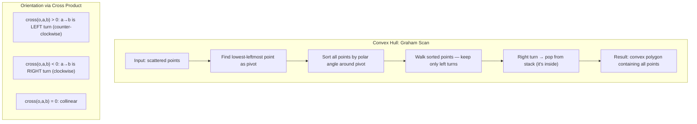

### How to Recognize

| Problem Pattern | Likely Algorithm |
|-----------------|-----------------|
| "Find boundary/envelope of points" | Convex Hull (Graham Scan / Jarvis March) |
| "Do these line segments intersect?" | Orientation + bounding box check |
| "Is point inside polygon?" | Ray Casting or Winding Number |
| "Find closest pair among points" | Divide & Conquer (Closest Pair) |
| "Rectangle overlap / union area" | Line Sweep |
| "Compute polygon area" | Shoelace Formula |
| "Point on which side of a line?" | Cross Product |

### Key Primitives

| Primitive | Formula / Method | Purpose |
|-----------|-----------------|---------|
| **Cross Product** | `(a.x-o.x)*(b.y-o.y) - (a.y-o.y)*(b.x-o.x)` | Orientation (left/right/collinear) |
| **Dot Product** | `a.x*b.x + a.y*b.y` | Angle, projection, perpendicular check |
| **Distance** | Euclid: `√(dx² + dy²)` — avoid sqrt when comparing | Closest pair, proximity |
| **Line Intersection** | Orientation check: (p1,q1,p2) × (p1,q1,q2) | Segment intersection test |
| **Point in Polygon** | Ray casting: count crossing edges | Membership test |
| **Shoelace Formula** | `½ * |Σ(x_i*y_{i+1} - x_{i+1}*y_i)|` | Polygon area |

### Basic Concepts

| Concept | Description |
|---------|-------------|
| **Cross Product** | Determines turn direction (left/right/collinear) |
| **Dot Product** | Projection, angle between vectors |
| **Distance** | Euclidean, Manhattan, Chebyshev |
| **Orientation** | Clockwise, counter-clockwise, collinear |

### Key Algorithms

| Algorithm | Purpose | Complexity |
|-----------|---------|:---:|
| **Convex Hull (Graham Scan)** | Smallest convex polygon containing all points | O(n log n) |
| **Convex Hull (Jarvis March)** | Gift wrapping | O(n * h) |
| **Closest Pair of Points** | Divide and conquer | O(n log n) |
| **Line Intersection** | Do two line segments intersect? | O(1) |
| **Point in Polygon** | Is point inside polygon? (ray casting) | O(n) |
| **Sweep Line** | Various geometric problems | O(n log n) |

> [!summary] Intuition
> Intervals represent **spans** — time ranges, segments, or events with start and end points. The two most important realizations: (1) **sorting by start or end time** unlocks greedy and merge algorithms, and (2) **line sweep** (processing events in chronological order) converts overlapping intervals into a counting problem on points. Almost every interval problem reduces to: sort the events, then walk through them maintaining some state.

```mermaid
flowchart TD
    subgraph Merge["Merge Overlapping Intervals"]
        M1["Input: [1,3],[2,6],[8,10],[15,18]"] --> M2["Sort by start: same order"]
        M2 --> M3["[1,3] vs [2,6]: 2 ≤ 3 → merge → [1,6]"]
        M3 --> M4["[1,6] vs [8,10]: 8 > 6 → push [1,6], start new"]
        M4 --> M5["[8,10] vs [15,18]: 15 > 10 → push [8,10]"]
        M5 --> M6["Result: [1,6], [8,10], [15,18]"]
    end
    subgraph Rooms["Meeting Rooms II: Line Sweep"]
        R1["Events: +1 at starts, -1 at ends"] --> R2["Walk chronologically"]
        R2 --> R3["Track current count → max = answer"]
    end
```

### How to Recognize

| Problem Pattern | Interval Technique |
|-----------------|-------------------|
| "Merge / flatten overlapping ranges" | Sort by start, merge |
| "Maximum concurrent events/meetings" | Line sweep (sort starts and ends separately) |
| "Insert an interval into sorted list" | Linear scan + merge in one pass |
| "Find gaps / free time between intervals" | Merge all, then scan for gaps |
| "Schedule non-overlapping intervals" | Greedy by finish time (Activity Selection) |
| "Minimum removals for no overlap" | Greedy by end time, count removals |
| "Rectangle overlap / skyline problem" | Line sweep + Segment Tree / priority queue |

### Pseudocode

#### Cross Product (Orientation)
```
CrossProduct(o, a, b):
    return (a.x - o.x) * (b.y - o.y) - (a.y - o.y) * (b.x - o.x)
    // > 0 → counter-clockwise (left turn)
    // < 0 → clockwise (right turn)
    // = 0 → collinear
```

#### Graham Scan (Convex Hull)
```
GrahamScan(P[1 .. n]):
    // Find lowest-then-leftmost point as pivot
    pivot ← point with min y (break ties by min x)
    Sort P by polar angle around pivot (break ties by distance)
    hull ← empty stack
    hull.push(P[1]), hull.push(P[2])
    for i ← 3 to n:
        while hull.size ≥ 2 and CrossProduct(hull.secondLast(), hull.last(), P[i]) ≤ 0:
            hull.pop()
        hull.push(P[i])
    return hull
```

#### Point in Polygon (Ray Casting)
```
PointInPolygon(polygon[1 .. n], point):
    count ← 0
    for i ← 1 to n:
        p1 ← polygon[i]
        p2 ← polygon[(i mod n) + 1]
        if (p1.y > point.y) ≠ (p2.y > point.y):
            xInter ← p1.x + (point.y - p1.y) * (p2.x - p1.x) / (p2.y - p1.y)
            if point.x < xInter:
                count ← count + 1
    return count mod 2 = 1
```

> [!warning] Pitfalls
> - **Integer overflow in cross product** — `(a.x-o.x)*(b.y-o.y) - (a.y-o.y)*(b.x-o.x)` can overflow 32-bit integers even for coordinates within ±10^4. Use 64-bit (`long long`) or Python's arbitrary precision.
> - **Collinear points in convex hull** — Graham Scan with `≤ 0` in the while condition keeps collinear points on the hull border. With `< 0`, it keeps only the extreme points. Know which variant you need.
> - **Polar angle sorting with duplicates** — points at the same angle must be sorted by distance. Otherwise the algorithm may add the farther point first and then remove the closer one, breaking the hull.
> - **Ray casting edge cases** — rays passing exactly through vertices or being collinear with edges require careful handling. Use a small random offset or the "crossing number" algorithm with strict inequality checks.
> - **Comparing floating-point distances** — avoid `sqrt()` when comparing distances; compare squared distances instead. Floating-point imprecision can break tie-breaking in closest-pair algorithms.
> - **Assuming the shortest distance is between adjacent sorted points** — in closest-pair, the strip check must consider up to 7 points in the y-sorted band, not just 1 or 2. The bound is proven: at most 6 points can fit in a d×2d rectangle without violating the minimum distance.

> [!question]- Q: What does the cross product actually tell you?
> **Answer:** The cross product `(b-a) × (c-a)` is signed area of the parallelogram. Positive = counter-clockwise turn (left), negative = clockwise (right), zero = collinear. It's the geometric equivalent of comparing slopes without division.

> [!question]- Q: When would you use Jarvis March over Graham Scan?
> **Answer:** Jarvis March (Gift Wrapping) is O(n*h) where h is the number of hull points. When the hull has very few points (h << n), Jarvis March is faster. Graham Scan is always O(n log n). Use Jarvis March when you expect a small convex hull.

> [!question]- Q: Why is the Shoelace formula useful?
> **Answer:** It computes the area of any simple polygon given its vertices in order, in O(n) time. The formula `½ * |Σ(x_i*y_{i+1} - x_{i+1}*y_i)|` handles convex and concave polygons equally well. Useful for geometric DP, area-based scoring, and polygon manipulation.

> [!question]- Q: How do you check if two line segments intersect?
> **Answer:** Check orientation of both endpoints of one segment relative to the other: `orient(p1,q1,p2) ≠ orient(p1,q1,q2)` AND `orient(p2,q2,p1) ≠ orient(p2,q2,q1)`. Additionally handle collinear cases with bounding box checks. O(1) per pair.

### Resources

- [Computational Geometry - CP-Algorithms](https://cp-algorithms.com/geometry/)

---

## 17. Network Flow

### Algorithms

| Algorithm | Complexity | Notes |
|-----------|:---:|-------|
| **Ford-Fulkerson** | O(E * max_flow) | DFS-based, may not terminate for irrational capacities |
| **Edmonds-Karp** | O(V * E^2) | BFS-based Ford-Fulkerson |
| **Dinic's** | O(V^2 * E) | Blocking flow + layered graph |
| **Push-Relabel** | O(V^2 * E) or O(V^3) | Local operations |

### Key Theorems

- **Max-Flow Min-Cut Theorem**: Maximum flow = minimum cut capacity
- **König's Theorem**: In bipartite graphs, max matching = min vertex cover

### Applications

- Maximum bipartite matching
- Minimum cut
- Circulation with demands
- Image segmentation
- Baseball elimination
- Project selection

### Pseudocode

#### Edmonds-Karp (BFS-Based Max Flow)
```
EdmondsKarp(G, source, sink):
    flow ← 0
    parent[1 .. V] ← NIL
    // Build residual graph: capacity[u][v] = initial capacity
    while true:
        // BFS to find augmenting path
        fill parent with NIL
        queue ← empty, queue.enqueue(source)
        parent[source] ← source
        while queue not empty and parent[sink] = NIL:
            u ← queue.dequeue()
            for v ← 1 to V:
                if parent[v] = NIL and capacity[u][v] > 0:
                    parent[v] ← u
                    queue.enqueue(v)
        if parent[sink] = NIL: break             // no augmenting path
        // Find bottleneck capacity
        bottleneck ← ∞
        v ← sink
        while v ≠ source:
            u ← parent[v]
            bottleneck ← min(bottleneck, capacity[u][v])
            v ← u
        // Augment flow
        v ← sink
        while v ≠ source:
            u ← parent[v]
            capacity[u][v] ← capacity[u][v] - bottleneck
            capacity[v][u] ← capacity[v][u] + bottleneck
            v ← u
        flow ← flow + bottleneck
    return flow
```

#### Dinic's Algorithm
```
Dinic(G, source, sink):
    flow ← 0
    while true:
        // BFS to build level graph
        level[1 .. V] ← -1
        level[source] ← 0
        queue.enqueue(source)
        while queue not empty:
            u ← queue.dequeue()
            for each v in Adj[u]:
                if level[v] = -1 and capacity[u][v] > 0:
                    level[v] ← level[u] + 1
                    queue.enqueue(v)
        if level[sink] = -1: break                // no path exists
        // DFS to send blocking flow
        ptr[1 .. V] ← 1
        while true:
            pushed ← DinicDFS(source, sink, ∞, level, ptr)
            if pushed = 0: break
            flow ← flow + pushed
    return flow

DinicDFS(u, sink, flow, level, ptr):
    if u = sink: return flow
    for v ← ptr[u] to V:
        if level[v] = level[u] + 1 and capacity[u][v] > 0:
            pushed ← DinicDFS(v, sink, min(flow, capacity[u][v]), level, ptr)
            if pushed > 0:
                capacity[u][v] ← capacity[u][v] - pushed
                capacity[v][u] ← capacity[v][u] + pushed
                return pushed
        ptr[u] ← ptr[u] + 1
    return 0
```

> [!warning] Pitfalls
> - **Infinite loop in Ford-Fulkerson with irrational capacities** — DFS-based augmenting path can pick infinitely smaller paths when capacities are irrational. Edmonds-Karp (BFS) and Dinic's guarantee termination with integer capacities.
> - **DFS-based max flow on large graphs** — DFS can select a single long augmenting path, leading to O(E * max_flow) runtime. Always use BFS (Edmonds-Karp) or Dinic's when max_flow is large.
> - **Forgetting residual capacity updates** — both `capacity[u][v] -= flow` AND `capacity[v][u] += flow` must be updated. The reverse edge allows flow to be "undone" later. Missing the reverse update breaks the algorithm.
> - **Using max flow for min cut without capacity tracking** — after computing max flow, the min cut is the set of vertices reachable from the source in the **residual graph** (edges with capacity > 0). Using the original graph gives the wrong cut.
> - **Bipartite matching: forgetting to add source/sink edges** — max bipartite matching requires a super-source connected to all left vertices and a super-sink from all right vertices, all with capacity 1. Without these, max flow won't find the matching.
> - **Integer vs double capacities** — network flow algorithms assume integer capacities to guarantee termination. With floating-point capacities, the flow increments can become arbitrarily small and the algorithm may never converge.

> [!question]- Q: What's the difference between Ford-Fulkerson, Edmonds-Karp, and Dinic's?
> **Answer:** **Ford-Fulkerson** uses DFS to find any augmenting path → O(E * max_flow), can loop forever with irrational capacities. **Edmonds-Karp** uses BFS to find the shortest augmenting path → O(V * E²), guaranteed termination. **Dinic's** uses BFS for level graph + DFS for blocking flow → O(V² * E), the fastest general-purpose max flow algorithm.

> [!question]- Q: What is the Max-Flow Min-Cut Theorem?
> **Answer:** In any flow network, the **maximum flow** from source to sink equals the **minimum cut capacity** (sum of capacities of edges crossing from the source side to the sink side). After running max flow, the min cut is: all vertices reachable from the source in the residual graph. This duality is fundamental.

> [!question]- Q: How do you use max flow for bipartite matching?
> **Answer:** Create a source connected to all left-side nodes (capacity 1), and a sink connected from all right-side nodes (capacity 1). Each edge between left and right has capacity 1. Max flow = maximum matching. The matched edges are those with flow = 1.

> [!question]- Q: When is Dinic's algorithm particularly fast?
> **Answer:** Dinic's runs in O(min(V^(2/3), √E) * E) on unit-capacity networks (like bipartite matching), making it O(E√V). It's also O(V²E) generally, which beats Edmonds-Karp's O(VE²) on dense graphs. In practice, Dinic's is the go-to max flow implementation.

### Resources

- [Network Flow - CP-Algorithms](https://cp-algorithms.com/graph/edmonds_karp.html)
- *CLRS* — Chapter 26

---

## 18. NP-Completeness and Approximation

### Complexity Classes

| Class | Description |
|-------|-------------|
| **P** | Solvable in polynomial time |
| **NP** | Verifiable in polynomial time |
| **NP-Hard** | At least as hard as NP problems |
| **NP-Complete** | NP-Hard + in NP |

### Famous NP-Complete Problems

- Boolean Satisfiability (SAT)
- Travelling Salesman Problem (decision version)
- Graph Coloring
- Subset Sum
- Hamiltonian Cycle
- Vertex Cover
- Clique
- 0/1 Knapsack (decision version)

### Coping Strategies

| Strategy | Description |
|----------|-------------|
| **Approximation algorithms** | Polynomial time, bounded error |
| **Heuristics** | No guarantee, often good in practice (genetic algorithms, simulated annealing) |
| **Parameterized algorithms** | FPT: O(f(k) * n^c) where k is a parameter |
| **Special cases** | Exploit structure (e.g., tree decomposition) |
| **Randomized** | Monte Carlo, Las Vegas approaches |
| **Branch and Bound** | Prune search space with bounds (see [[#19-branch-and-bound|dedicated section]]) |

### Pseudocode

#### Vertex Cover — 2-Approximation
```
ApproxVertexCover(G):
    C ← ∅               // cover set
    E' ← copy of all edges
    while E' is not empty:
        pick any edge (u, v) from E'
        C ← C ∪ {u, v}
        remove all edges incident to u or v from E'
    return C             // at most 2 * OPT
```

#### Unweighted Vertex Cover on Trees (DP)
```
TreeVertexCover(root):
    // returns (size including root, size excluding root)
    if root = NIL: return (0, 0)
    incl ← 1, excl ← 0
    for each child in root.children:
        (childIn, childOut) ← TreeVertexCover(child)
        incl ← incl + min(childIn, childOut)
        excl ← excl + childIn
    return (incl, excl)
```

> [!warning] Pitfalls
> - **Confusing NP-Hard with NP-Complete** — NP-Complete = NP-Hard + in NP (verifiable in polynomial time). NP-Hard problems may not even be in NP (e.g., TSP optimization, halting problem). Know the distinction for interviews.
> - **Approximation ratio misconceptions** — a 2-approximation for minimization means the algorithm's solution is at most 2× OPT. For maximization, the ratio is inverted (≥ OPT/2). Mixing these up reverses the interpretation.
> - **Using exponential algorithms for "small" n** — n=20 with O(2^n) is ~10^6 operations (fine). n=40 with O(2^n) is ~10^12 (too slow). Don't assume exponential is always tractable — check the input constraints.
> - **Heuristics without bounds** — simulated annealing, genetic algorithms, and hill climbing are heuristics — they find good solutions fast but with NO guarantee on optimality. Don't present them as algorithms with provable quality in an academic context.
> - **Reducing to the wrong problem** — to prove problem A is NP-Hard, you reduce a known NP-Complete problem B **to** A, not the other way. B → A means "if we could solve A, we could solve B." Getting the direction wrong invalidates the proof.

> [!question]- Q: What does it mean for a problem to be NP-Complete?
> **Answer:** A problem is NP-Complete if: (1) it is in NP (a solution can be verified in polynomial time), and (2) every problem in NP can be reduced to it in polynomial time (it is NP-Hard). If you solve any NP-Complete problem in polynomial time, you solve ALL problems in NP (P = NP).

> [!question]- Q: What's a polynomial-time reduction?
> **Answer:** A transformation from problem A to problem B such that: (1) the transformation takes polynomial time, (2) a solution to B can be converted to a solution to A. If B is solvable, A is solvable. Reductions are the primary tool for proving NP-Completeness.

> [!question]- Q: What's the difference between an approximation algorithm and a heuristic?
> **Answer:** **Approximation algorithm**: provable bound on solution quality (e.g., "at most 2× optimal") and polynomial runtime. **Heuristic**: no provable bound — it might find terrible solutions in worst cases, but works well in practice (e.g., greedy for TSP, local search).

> [!question]- Q: What are practical strategies for dealing with NP-Hard problems?
> **Answer:** (1) Use an approximation algorithm with a bounded ratio. (2) Parameterize — treat some parameter k as small, use O(f(k) * n^c) FPT algorithms. (3) Exploit structure — the problem may be polynomial on trees/interval graphs/planar graphs. (4) Branch and Bound for exact solutions on manageable instances. (5) Heuristics + local search for large instances where optimality isn't critical.

### Resources

- *CLRS* — Chapter 34
- [NP-Completeness - GeeksforGeeks](https://www.geeksforgeeks.org/np-completeness-set-1/)

---

## 19. Branch and Bound

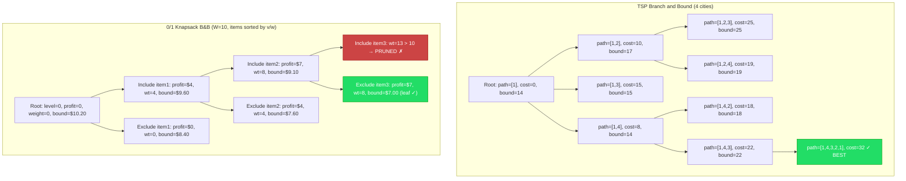

> [!summary] Branch and Bound
> Branch and Bound is a systematic state-space search for combinatorial optimization. It **branches** (generates subproblems) and **bounds** (computes optimistic estimates) to prune unpromising regions. Unlike backtracking, B&B explicitly tracks an **incumbent** (best solution so far) and abandons any partial solution whose best possible completion is worse than the incumbent.

### Intuition (Plain English)

Imagine you're searching for the cheapest flight route through 20 cities. You've already found one route costing $1,500. Now, before fully exploring another partial route that already costs $1,200 and still has 15 cities left, you estimate the absolute minimum it could cost in total — say $200 for the remaining cities. Best case: $1,400. Since $1,400 < $1,500, you keep exploring. But if the partial cost was $1,450 with a minimum remaining of $200 (best case $1,650), you'd **prune** that branch immediately — it can never beat $1,500.

That's the core idea: **use bounds to avoid exploring branches that can't improve on what you already have**.

### Key Concepts

| Term | Meaning |
|------|---------|
| **State Space Tree** | The tree of all partial solutions; each node = one subproblem |
| **Live Node** | Generated but not yet fully explored |
| **E-Node** | The node **currently** being expanded (branched from) |
| **Dead Node** | Fathomed: bound worse than incumbent, infeasible, or fully explored |
| **Bounding Function** | Computes an optimistic estimate of the best completion from a partial solution |
| **Incumbent** | The best complete solution found so far (global upper bound for minimization, lower bound for maximization) |
| **Pruning / Fathoming** | Killing a node because it cannot lead to a better solution than the incumbent |

### Branch and Bound vs Backtracking vs Dynamic Programming

| Aspect | Branch and Bound | Backtracking | Dynamic Programming |
|--------|:---:|:---:|:---:|
| **Goal** | Optimization (min/max with constraints) | Feasibility / enumeration (all solutions or one) | Optimization with overlapping subproblems |
| **State space** | Explicit tree with bounds | Implicit tree (constraint-driven) | Table of subproblem solutions |
| **Pruning mechanism** | Bounding function vs incumbent | Constraint checks, symmetry breaking | Overlap avoidance via memoization |
| **Search order** | LC (best-bound first) or FIFO/LIFO | DFS (depth-first) by default | Bottom-up or top-down |
| **Optimality guarantee** | Yes (given admissible bounds) | Not applicable (enumeration) | Yes (if optimal substructure holds) |
| **Memory** | Moderate to high (live node queue) | Low (recursion stack) | High (table, often O(n*m)) |
| **Classic problems** | 0/1 Knapsack, TSP, 15-puzzle, job assignment | N-Queens, Sudoku, permutations, subsets | Fibonacci, LCS, matrix chain, coin change |
| **Works when** | Bounding function exists and is tight | Constraints prune early | Optimal substructure + overlapping subproblems |

### Variants of Branch and Bound

| Variant | Data Structure | Expansion Strategy | Best For |
|---------|:---:|---------|----------|
| **FIFO** (BFS-based) | Queue | First-come, first-served; level-by-level | Guarantees shallow solutions; simple to implement |
| **LIFO** (DFS-based) | Stack | Go deep fast; find an incumbent quickly | Memory efficient; good when any solution helps prune |
| **LC-Branch and Bound** (Best-first) | Priority Queue (min/max heap) | Expand node with best (lowest) bound first | Most common in practice; reaches optimal fastest |

> [!tip] LC-Branch and Bound is the workhorse
> In almost all real-world implementations, you use a **priority queue** ordered by bound. The node with the most promising bound gets expanded next. This tends to find a good incumbent early and prune heavily.

### How to Recognize a Branch and Bound Problem

| You see... | Consider B&B when... |
|------------|----------------------|
| "Minimize cost / maximize profit with constraints" | The state space is exponential, but you can compute a bound |
| "Find the optimal assignment / schedule / route" | Multiple possible choices at each step |
| "Combinatorial optimization" — TSP-like patterns | Greedy is suboptimal, DP table is too large (e.g., O(2^n)) |
| "NP-Hard optimization" trade-off problems | You need the exact optimum, not an approximation |
| Problem has a natural sorting (by value/weight, by benefit) | Sorting gives you a tight fractional (continuous) bound |

### Classic Problems

| Problem | Description | Bounding Function | Complexity (worst case) |
|---------|-------------|-------------------|:---:|
| **0/1 Knapsack (B&B)** | Maximize value with weight limit | Fractional knapsack on remaining items | O(2^n) worst, much faster in practice |
| **Travelling Salesman (TSP)** | Min-cost tour visiting all cities once | Reduced cost matrix (row/column reduction) | O(n!) worst, practical for n≤40-60 |
| **15-Puzzle** | Slide tiles to reach goal configuration | Manhattan distance + linear conflicts | Exponential, practical for most instances |
| **N-Queens (B&B)** | Place N queens with no attacks | Row/column constraint propagation | Faster than pure backtracking |
| **Job Assignment** | Assign N workers to N jobs at min cost | Row/column reduction of cost matrix | O(n!) worst, bounded |
| **Graph Coloring (B&B)** | Color graph with k colors | Number of colors used so far + saturation degree | Exponential |
| **Subset Sum (B&B)** | Does a subset sum to target? | Remaining sum bounds | O(2^n) worst |

### Bounding Function Design

The **tighter** the bound, the more pruning — but computing the bound must be **fast**. There's a trade-off:

| Bound Type | Tightness | Compute Cost | Example |
|------------|:---:|:---:|---------|
| **Trivial bound** | Loose | O(1) | "Remaining items have zero weight" |
| **Fractional / continuous relaxation** | Moderate | O(n log n) | 0/1 Knapsack → fractional knapsack on remainder |
| **Problem-specific heuristic** | Tight | O(n) or O(n log n) | TSP: row/column reduction of cost matrix |
| **Lagrangian relaxation** | Very tight | O(m * log n) | Relax constraints, solve easier subproblem |
| **LP relaxation** | Tight | Polynomial (simplex) | Integer programming → solve as LP |

> [!warning] The bounding function must be **admissible**
> For minimization: bound must be a **lower bound** (underestimate) on the cost from this partial solution. For maximization: an **upper bound** (overestimate). A non-admissible bound may prune the optimal solution.

### Pseudocode

#### Generic B&B Template (LC - Least Cost)

```
BranchAndBound(initialProblem):
    pq ← MinPriorityQueue ordered by lowerBound (or MaxPQ for maximization)
    incumbent ← +∞  (or -∞ for maximization)
    bestSolution ← NIL
    root ← createNode(initialProblem)
    root.bound ← computeBound(root)
    pq.insert(root)

    while pq is not empty:
        current ← pq.extractMin()     # most promising node first

        if current.bound ≥ incumbent:  # cannot beat incumbent
            continue                    # PRUNE — skip this node

        if isLeaf(current):
            value ← evaluate(current)
            if value < incumbent:
                incumbent ← value
                bestSolution ← current
            continue

        # BRANCH: generate children
        for each choice in getChoices(current):
            child ← extend(current, choice)
            if not feasible(child):
                continue
            child.bound ← computeBound(child)
            if child.bound < incumbent:    # promising
                pq.insert(child)

    return (incumbent, bestSolution)
```

#### 0/1 Knapsack — Branch and Bound

```
KnapsackB&B(items[1 .. n], capacity):
    # Sort items by value/weight ratio descending
    Sort items by (value/weight) descending
    pq ← MaxPriorityQueue ordered by upperBound (profit + fractional remainder)
    incumbent ← -∞
    bestSubset ← NIL

    root.bound ← fractionalKnapsackRemaining(items, 0, 0, capacity)
    pq.insert(root)

    while pq is not empty:
        node ← pq.extractMax()
        if node.bound ≤ incumbent:
            continue                              # prune

        if node.level = n or node.weight = capacity:
            if node.profit > incumbent:
                incumbent ← node.profit
                bestSubset ← node.choices
            continue

        # Branch: INCLUDE next item
        if node.weight + items[node.level + 1].weight ≤ capacity:
            incl ← createInclude(node, items[node.level + 1])
            incl.bound ← incl.profit + fractionalKnapsackRemaining(
                items, incl.level + 1, incl.weight, capacity)
            if incl.bound > incumbent:
                pq.insert(incl)

        # Branch: EXCLUDE next item
        excl ← createExclude(node, items[node.level + 1])
        excl.bound ← excl.profit + fractionalKnapsackRemaining(
            items, excl.level + 1, excl.weight, capacity)
        if excl.bound > incumbent:
            pq.insert(excl)

    return (incumbent, bestSubset)

fractionalKnapsackRemaining(items, start, currentWeight, capacity):
    remainingCapacity ← capacity - currentWeight
    profit ← 0
    for i ← start to n:
        if items[i].weight ≤ remainingCapacity:
            profit ← profit + items[i].value
            remainingCapacity ← remainingCapacity - items[i].weight
        else:
            profit ← profit + items[i].value * (remainingCapacity / items[i].weight)
            break
    return profit
```

#### TSP — Branch and Bound

```
TSPB&B(cost[1 .. n][1 .. n]):
    # Row reduction + column reduction to get initial lower bound
    reducedCost ← reduceMatrix(cost)
    pq ← MinPriorityQueue ordered by lowerBound
    incumbent ← +∞
    bestTour ← NIL

    root.path ← [1]              # start at city 1
    root.bound ← reducedCost.lowerBound
    pq.insert(root)

    while pq is not empty:
        node ← pq.extractMin()
        if node.bound ≥ incumbent:
            continue

        if node.path.length = n:
            tourCost ← node.cost + cost[node.path.last][1]   # return to start
            if tourCost < incumbent:
                incumbent ← tourCost
                bestTour ← node.path + [1]
            continue

        lastCity ← node.path.last
        for each city i NOT in node.path:
            child.cost ← node.cost + cost[lastCity][i]
            child.path ← node.path + [i]
            child.matrix ← node.matrix with row lastCity, col i set to ∞
            child.bound ← child.cost + reduceMatrix(child.matrix).lowerBound
            if child.bound < incumbent:
                pq.insert(child)

    return (incumbent, bestTour)

reduceMatrix(matrix):
    lowerBound ← 0
    # Row reduction
    for each row r:
        minVal ← min in row r, excluding ∞
        if minVal ≠ 0 and minVal ≠ ∞:
            lowerBound ← lowerBound + minVal
            subtract minVal from each element in row r
    # Column reduction
    for each column c:
        minVal ← min in column c, excluding ∞
        if minVal ≠ 0 and minVal ≠ ∞:
            lowerBound ← lowerBound + minVal
            subtract minVal from each element in column c
    return (reducedMatrix, lowerBound)
```

### B&B Execution Walkthrough (0/1 Knapsack)

Consider: `items = [(wt:4, val:$4), (wt:7, val:$7), (wt:5, val:$5), (wt:3, val:$3)]`, capacity = 10. Sorted by value/weight: (4/4=1.0), (7/7=1.0), (5/5=1.0), (3/3=1.0).

| Step | E-Node | Action | Incumbent | Live Nodes (bound, profit) |
|------|--------|--------|:---:|---------|
| 0 | — | Start | -∞ | Root(bound=10.0, p=0) |
| 1 | Root | Branch | -∞ | Incl1(bound=10.0, p=4), Excl1(bound=9.3, p=0) |
| 2 | Incl1 | Branch (best bound) | -∞ | Incl1+Incl2: wt=11 > 10 → ✗ (pruned). Incl1+Excl2(bound=9.1, p=4), Excl1(bound=9.3) |
| 3 | Excl1 | Branch (best bound) | -∞ | Excl1+Incl2(bound=9.3, p=7), Incl1+Excl2(bound=9.1), Excl1+Excl2(bound=6.6) |
| 4 | Excl1+Incl2 | Branch | -∞ | Excl1+Incl2+Incl3: wt=12 > 10 → ✗. Excl1+Incl2+Excl3(bound=8.0, p=7) |
| 5 | Incl1+Excl2 | Branch | -∞ | Incl1+Excl2+Incl3(bound=9.5, p=9), Incl1+Excl2+Excl3(bound=7.5, p=4) |
| 6 | Incl1+Excl2+Incl3 | Leaf (wt=9, p=$9) | **$9** | Excl1+Incl2+Excl3(bound=8.0, p=7), Incl1+Excl2+Excl3(bound=7.5) |
| 7 | Excl1+Incl2+Excl3 | bound=8.0 < incumbent=$9 → **PRUNE** | $9 | Incl1+Excl2+Excl3(bound=7.5) |
| 8 | Incl1+Excl2+Excl3 | bound=7.5 < incumbent=$9 → **PRUNE** | $9 | (empty — done) |

**Optimal**: Items 1 + 3 = profit $9, weight 9.

> [!warning] Pitfalls
> - **Loose bounds kill performance** — a trivial bound (e.g., 0) means you explore the entire state space. Design tight, admissible bounds.
> - **Branching order matters** — expanding the wrong node first delays finding a good incumbent. Always use LC (best-bound-first) for hard problems.
> - **Inadmissible bounds** — a bound that overestimates (for minimization) may prune the optimal solution. Double-check your bounding function never crosses the true optimum.
> - **Memory explosion** — the live-node priority queue can grow to O(2^n) in worst case. Use LIFO (DFS) variant when memory is a concern, accepting slower convergence.
> - **Not for real-time systems** — B&B has no worst-case time guarantee. It may still explore exponential nodes if bounds are weak.
> - **Incorrect tie-breaking** — when multiple nodes have the same bound, break ties in favor of deeper nodes or use a consistent heuristic to avoid thrashing.
> - **Neglecting to update incumbent** — if you don't update the global incumbent when a better solution is found, pruning becomes ineffective and you explore the whole tree.
> - **Duplicate detection** — some problems generate the same state through different branching paths. Without memoization, B&B will re-explore.

> [!question]- Q: What is the difference between Branch and Bound and Backtracking?
> **Answer:** Backtracking is for **feasibility/enumeration** (find a solution / all solutions). B&B is for **optimization** (find the best solution). B&B uses a **bounding function** to prune based on optimality, while backtracking prunes based on constraints. B&B also tracks a global **incumbent** (best so far).

> [!question]- Q: What does "admissible bound" mean in B&B?
> **Answer:** For a minimization problem, the bound must be a **lower bound** — it must always be **less than or equal to** the true optimal cost of completing the partial solution. If the bound ever exceeds the true optimum, it's inadmissible and may cause B&B to discard the optimal branch.

> [!question]- Q: Why use LC (Least Cost) search over FIFO/LIFO?
> **Answer:** LC expands the node with the **best bound first**, which typically finds a good incumbent early. A good incumbent means aggressive pruning. FIFO may waste time on shallow unpromising nodes; LIFO may go very deep on a bad path. LC is the fastest to converge to the optimum in practice.

> [!question]- Q: How do you design a bounding function for 0/1 Knapsack?
> **Answer:** Use the **fractional knapsack** greedy solution on remaining items (sorted by value/weight). This is an admissible upper bound for maximization because fractional selection is always at least as good as integer selection. It's cheap to compute (O(k) for k remaining items) and reasonably tight.

> [!question]- Q: When would you use B&B over Dynamic Programming?
> **Answer:** When the DP state space is too large. For example, TSP with DP has O(n² * 2^n) states — infeasible for n > 25. B&B with a good bound can solve TSP for n=40–60 in practice. Also, when the problem lacks overlapping subproblems (DP's assumption), B&B is the natural choice.

### Resources

- *CLRS* — Chapter 35 (Approximation Algorithms) touches on B&B; detailed coverage in *Horowitz & Sahni* "Fundamentals of Computer Algorithms"
- *Algorithm Design Manual* (Skiena) — Section 7.7: Branch and Bound
- [Branch and Bound - GeeksforGeeks](https://www.geeksforgeeks.org/branch-and-bound-algorithm/)
- [0/1 Knapsack using Branch and Bound](https://www.geeksforgeeks.org/0-1-knapsack-using-branch-and-bound/)
- [Travelling Salesman Problem using Branch and Bound](https://www.geeksforgeeks.org/traveling-salesman-problem-using-branch-and-bound-2/)
- [Aditya Verma - Branch and Bound Playlist (YouTube)](https://www.youtube.com/playlist?list=PL_z_8CaSLPWdb4yWx1R7n2PcAq9K5QmhP)

---

## Interactive Visualization References

> [!tip]- Visualize algorithms step-by-step
> - [VisuAlgo](https://visualgo.net/en) — Sorting (merge/quick/heap/radix), Graph (BFS/DFS/Dijkstra), DP, String
> - [USFCA Sorting](https://www.cs.usfca.edu/~galles/visualization/ComparisonSort.html) — Side-by-side sorting comparison
> - [Algorithm Visualizer](https://algorithm-visualizer.org/) — Step through with code + visualization
> - [Binary Search](https://visualgo.net/en/search) | [KMP](https://www.cs.usfca.edu/~galles/visualization/KMP.html) | [LCS](http://lcs-demo.sourceforge.net/)
> - [Knapsack](https://www.cs.usfca.edu/~galles/visualization/DPLCS.html) | [Floyd-Warshall](https://visualgo.net/en/sssp) | [Backtracking N-Queens](https://visualgo.net/en/recursion)

## Algorithm Selection Guide

### When to Use What

| Problem Characteristic | Likely Approach |
|----------------------|-----------------|
| "Find shortest path" | BFS (unweighted), Dijkstra (weighted) |
| "Find minimum/maximum" | Greedy, DP, or Binary Search on Answer |
| "Count number of ways" | DP |
| "Find all permutations/combinations" | Backtracking |
| "Optimal substructure + overlapping subproblems" | DP |
| "Locally optimal → globally optimal" | Greedy |
| "Connected components" | DFS/BFS or Union-Find |
| "Sorted data + search" | Binary Search |
| "Subarray/substring with property" | Sliding Window / Two Pointers |
| "Interval problems" | Sort + Greedy or Sweep Line |
| "Pattern matching" | KMP, Rabin-Karp, or Z-Algorithm |
| "Tree queries" | DFS/BFS, LCA, Segment Tree |
| "Range queries with updates" | Segment Tree / Fenwick Tree |
| "Subset problems" | Bitmask DP |

---

## Recommended Study Order

### Phase 1: Foundations (Weeks 1-3)
1. Time & Space Complexity
2. Sorting (insertion, merge, quick)
3. Binary Search
4. Two Pointers & Sliding Window
5. Basic Recursion

### Phase 2: Core Techniques (Weeks 4-7)
6. Backtracking
7. Greedy Algorithms
8. Dynamic Programming (1D, 2D, common patterns)
9. Graph Traversal (BFS, DFS)
10. Bit Manipulation

### Phase 3: Advanced (Weeks 8-12)
11. Advanced DP (bitmask, digit, trees)
12. Shortest Path Algorithms
13. MST, Topological Sort, SCC
14. String Algorithms (KMP, Z, Trie)
15. Binary Search on Answer
16. Segment Trees, Fenwick Trees
17. Branch and Bound

### Phase 4: Expert (Weeks 13+)
18. Network Flow
19. Computational Geometry
20. Advanced String (Suffix Array, Aho-Corasick)
21. NP-Completeness & Approximation
22. DP Optimizations (CHT, D&C optimization)

---

## Recommended Resources

### Books
- *Introduction to Algorithms* (CLRS)
- *Algorithm Design* by Kleinberg & Tardos
- *Competitive Programming 3* by Steven Halim
- *The Algorithm Design Manual* by Skiena
- *Algorithms* by Jeff Erickson (free online)

### Online Courses
- [MIT 6.006](https://ocw.mit.edu/courses/6-006-introduction-to-algorithms-fall-2011/)
- [MIT 6.046](https://ocw.mit.edu/courses/6-046j-design-and-analysis-of-algorithms-spring-2015/)
- [Stanford Algorithms (Coursera)](https://www.coursera.org/specializations/algorithms)
- [Abdul Bari - Algorithms (YouTube)](https://www.youtube.com/playlist?list=PLDN4rrl48XKpZkf03iYFl-O29szjTrs_O)
- [Striver's A2Z DSA Sheet](https://takeuforward.org/strivers-a2z-dsa-course/strivers-a2z-dsa-course-sheet-2/)

### Practice
- [LeetCode](https://leetcode.com/)
- [Codeforces](https://codeforces.com/)
- [AtCoder](https://atcoder.jp/)
- [CSES Problem Set](https://cses.fi/problemset/)
- [NeetCode Roadmap](https://neetcode.io/roadmap)

### Visualization
- [VisuAlgo](https://visualgo.net/)
- [Algorithm Visualizer](https://algorithm-visualizer.org/)
- [Sorting Algorithms Visualized](https://www.toptal.com/developers/sorting-algorithms)
