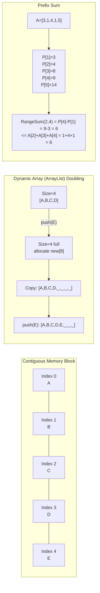
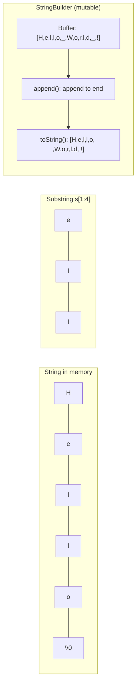
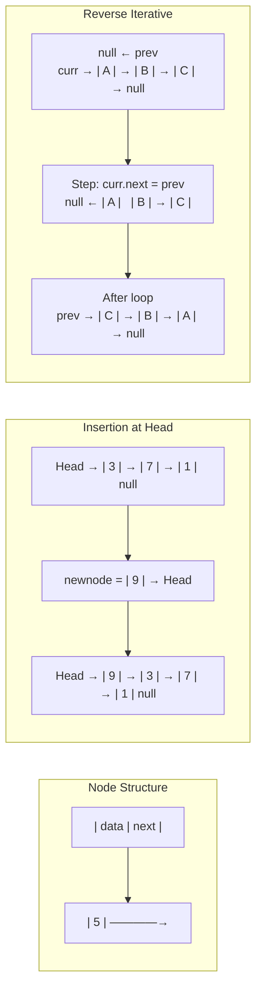
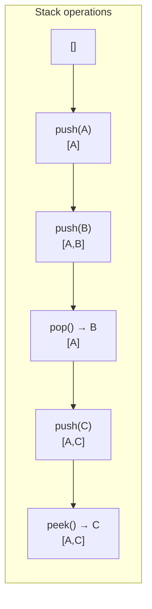
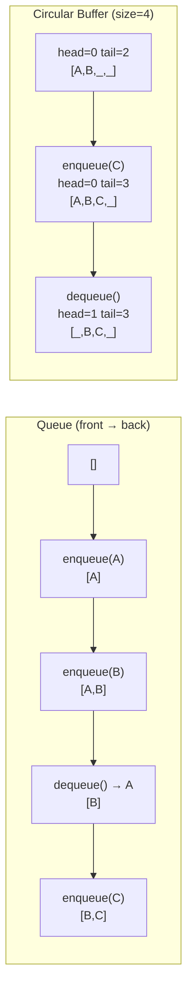
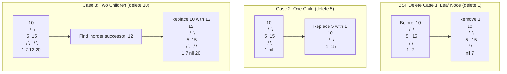
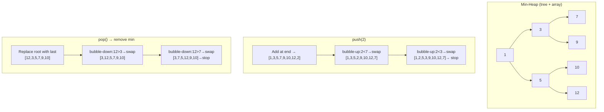

# Data Structures - Complete Guide (Beginner to Advanced)

> [!summary] One-Stop Revision
> Use this note for choosing the right structure, invariants, and common patterns. For full Java implementations, jump to `[[JAVA_IMPL/Java_01_Fundamental_DS]]` and `[[JAVA_IMPL/Java_02_Advanced_DS]]` (embedded at the relevant sections below).

> [!tip] Quick Jump
> - Implementations index: [[JAVA_IMPL/Java_00_Index_and_CheatSheet]]
> - Algorithms reference: [[Algorithms]]
> - Practice list: [[Questions]]

---

## Table of Contents

1. [Arrays](#1-arrays)
2. [Strings](#2-strings)
3. [Linked Lists](#3-linked-lists)
4. [Stacks](#4-stacks)
5. [Queues](#5-queues)
6. [Hash Tables](#6-hash-tables)
7. [Trees](#7-trees)
8. [Heaps / Priority Queues](#8-heaps-priority-queues)
9. [Graphs](#9-graphs)
10. [Tries (Prefix Trees)](#10-tries)
11. [Disjoint Set Union (Union-Find)](#11-disjoint-set-union)
12. [Segment Trees](#12-segment-trees)
13. [Binary Indexed Trees (Fenwick Trees)](#13-binary-indexed-trees)
14. [Suffix Arrays and Suffix Trees](#14-suffix-arrays-and-suffix-trees)
15. [Bloom Filters](#15-bloom-filters)
16. [Skip Lists](#16-skip-lists)
17. [LRU / LFU Caches](#17-lru-lfu-caches)

---

## 1. Arrays

> [!summary] Recall
> - Strength: O(1) random access, cache-friendly.
> - Weakness: inserts/deletes in the middle are O(n).
> - Typical tools: prefix sum, two pointers, sliding window, difference arrays.

> [!tip] Java implementation reference
> ![[JAVA_IMPL/Java_01_Fundamental_DS#A.1 Static Array]]
> ![[JAVA_IMPL/Java_01_Fundamental_DS#A.2 Dynamic Array]]



### Overview

An array is a contiguous block of memory storing elements of the same type, accessed by index.

### Types

| Type | Description |
|------|-------------|
| **Static Array** | Fixed size, allocated at compile time |
| **Dynamic Array** | Resizable (e.g., `ArrayList` in Java, `vector` in C++, `list` in Python) |
| **2D / Multi-dimensional Array** | Matrix representation, grids |
| **Sparse Array** | Most elements are zero/default; stored efficiently |

### Time Complexity

| Operation | Static Array | Dynamic Array |
|-----------|:---:|:---:|
| Access by index | O(1) | O(1) |
| Search (unsorted) | O(n) | O(n) |
| Search (sorted) | O(log n) | O(log n) |
| Insert at end | N/A | Amortized O(1) |
| Insert at index | O(n) | O(n) |
| Delete at index | O(n) | O(n) |

### Space Complexity

- O(n)

### Key Concepts

- **Contiguous memory** — cache-friendly, excellent locality of reference
- **Amortized doubling** — dynamic arrays double capacity when full; insertion is amortized O(1)
- **Prefix Sum Array** — precompute cumulative sums for O(1) range sum queries
- **Difference Array** — efficient range update in O(1), reconstruct with prefix sum
- **Kadane's Algorithm** — max subarray sum in O(n)
- **Two Pointer Technique** — used on sorted arrays for pair/triplet problems
- **Sliding Window** — fixed or variable window for subarray/substring problems
- **Dutch National Flag** — 3-way partitioning (0s, 1s, 2s)

### Common Patterns

- Reverse an array in-place
- Rotate array by k positions
- Merge two sorted arrays
- Find duplicates (using hash set or sorting)
- Subarray with given sum (prefix sum + hash map)
- Trapping rain water (two pointer / stack)
- Next permutation

### Pseudocode

#### Array Traversal
```
Traverse(A[1 .. n]):
    for i ← 1 to n:
        process A[i]
```

#### Insert at Index
```
Insert(A[1 .. n], index, value):
    for i ← n downto index + 1:
        A[i + 1] ← A[i]
    A[index] ← value
    n ← n + 1
```

#### Delete at Index
```
Delete(A[1 .. n], index):
    for i ← index to n - 1:
        A[i] ← A[i + 1]
    n ← n - 1
```

#### Kadane's Algorithm (Maximum Subarray Sum)
```
Kadane(A[1 .. n]):
    maxSoFar ← -∞
    maxEndingHere ← 0
    for i ← 1 to n:
        maxEndingHere ← max(A[i], maxEndingHere + A[i])
        maxSoFar ← max(maxSoFar, maxEndingHere)
    return maxSoFar
```

#### Dutch National Flag (3-way Partition)
```
DutchFlagPartition(A[1 .. n], pivot):
    low ← 1, mid ← 1, high ← n
    while mid ≤ high:
        if A[mid] < pivot:
            swap A[low] and A[mid]
            low ← low + 1
            mid ← mid + 1
        else if A[mid] = pivot:
            mid ← mid + 1
        else:
            swap A[mid] and A[high]
            high ← high - 1
```

#### Prefix Sum Array (Build)
```
BuildPrefixSum(A[1 .. n]):
    P[1 .. n]  // prefix sum array
    P[1] ← A[1]
    for i ← 2 to n:
        P[i] ← P[i - 1] + A[i]
    return P

RangeSum(P[1 .. n], L, R):
    if L = 1:
        return P[R]
    else:
        return P[R] - P[L - 1]
```

### Resources

- [Array Data Structure - GeeksforGeeks](https://www.geeksforgeeks.org/array-data-structure/)
- [Arrays - mycodeschool (YouTube)](https://www.youtube.com/watch?v=7EdaoE46BTI)
- *Introduction to Algorithms (CLRS)* — Chapter 1-2

---

## 2. Strings




> [!summary] Recall
> - In Java, `String` is immutable; repeated concatenation can be O(n^2). Use `StringBuilder`.

### Overview

A string is a sequence of characters. Internally represented as a character array (C/C++) or immutable object (Java, Python).

### Key Concepts

- **Immutability** — in Java/Python strings are immutable; modifications create new objects
- **Character encoding** — ASCII (7-bit), Extended ASCII (8-bit), UTF-8, UTF-16, UTF-32
- **StringBuilder / StringBuffer** — mutable string classes for efficient concatenation in Java

### Important Techniques

| Technique | Purpose | Complexity |
|-----------|---------|:---:|
| Two pointers | Palindrome check, reverse | O(n) |
| Sliding window | Longest substring without repeating chars | O(n) |
| Hashing (Rabin-Karp) | Pattern matching | O(n+m) avg |
| KMP Algorithm | Pattern matching | O(n+m) |
| Z-Algorithm | Pattern matching | O(n+m) |
| Manacher's Algorithm | Longest palindromic substring | O(n) |
| Trie | Prefix-based search, autocomplete | O(L) per query |
| Suffix Array | All occurrences, LCP | O(n log n) build |

### Common Operations & Complexity

| Operation | Complexity |
|-----------|:---:|
| Access char at index | O(1) |
| Concatenation | O(n+m) |
| Substring | O(k) where k = length of substring |
| Comparison | O(min(n,m)) |
| Search (brute force) | O(n*m) |

### Common Patterns

- Anagram detection (frequency count)
- Longest common prefix
- String to integer (atoi)
- Valid parentheses
- Palindrome partitioning
- Edit distance (DP)
- Regular expression matching (DP)

### Pseudocode

#### Palindrome Check (Two Pointer)
```
IsPalindrome(S[1 .. n]):
    left ← 1
    right ← n
    while left < right:
        if S[left] ≠ S[right]:
            return false
        left ← left + 1
        right ← right - 1
    return true
```

#### Reverse String In-Place
```
Reverse(S[1 .. n]):
    left ← 1
    right ← n
    while left < right:
        swap S[left] and S[right]
        left ← left + 1
        right ← right - 1
```

#### Substring Extraction
```
Substring(S[1 .. n], start, length):
    result ← new array of size length
    for i ← 0 to length - 1:
        result[i] ← S[start + i]
    return result
```

#### Efficient Concatenation Pattern
```
// Avoiding O(n^2) concatenation:
// Build by collecting and joining, or using a mutable builder.
Join(words[1 .. k]):
    result ← empty
    for i ← 1 to k:
        result ← result + words[i]   // use StringBuilder / buffer
    return result
```

#### Anagram Detection (Frequency Count)
```
IsAnagram(S1[1 .. n], S2[1 .. m]):
    if n ≠ m:
        return false
    count[1 .. 26] ← {0}       // for lowercase letters
    for i ← 1 to n:
        count[S1[i] - 'a'] ← count[S1[i] - 'a'] + 1
        count[S2[i] - 'a'] ← count[S2[i] - 'a'] - 1
    for c ← 1 to 26:
        if count[c] ≠ 0:
            return false
    return true
```

### Resources

- [String Algorithms - CP-Algorithms](https://cp-algorithms.com/string/)
- [KMP Algorithm - Abdul Bari (YouTube)](https://www.youtube.com/watch?v=V5-7GzOfADQ)

---

## 3. Linked Lists

> [!tip] Java implementation reference
> ![[JAVA_IMPL/Java_01_Fundamental_DS#A.3 Singly Linked List]]
> ![[JAVA_IMPL/Java_01_Fundamental_DS#A.4 Doubly Linked List]]

### Overview

A linked list is a linear data structure where each element (node) contains data and a pointer to the next node.



### Types

| Type | Description |
|------|-------------|
| **Singly Linked List** | Each node points to the next node |
| **Doubly Linked List** | Each node points to both next and previous |
| **Circular Linked List** | Last node points back to the first |
| **Circular Doubly Linked List** | Doubly linked + circular |
| **Skip List** | Multi-level linked list for O(log n) search |
| **XOR Linked List** | Memory-efficient doubly linked list using XOR of addresses |

### Time Complexity

| Operation | Singly | Doubly |
|-----------|:---:|:---:|
| Access by index | O(n) | O(n) |
| Search | O(n) | O(n) |
| Insert at head | O(1) | O(1) |
| Insert at tail | O(n) or O(1) with tail pointer | O(1) |
| Insert after node | O(1) | O(1) |
| Delete head | O(1) | O(1) |
| Delete given node | O(n) | O(1) |

### Space Complexity

- O(n)

### Key Concepts

- **Sentinel / Dummy Node** — simplifies edge cases (empty list, head deletion)
- **Fast and Slow Pointers (Floyd's)** — cycle detection, finding middle node
- **Runner Technique** — two pointers at different speeds

### Common Patterns

- Reverse a linked list (iterative & recursive)
- Detect cycle and find cycle start (Floyd's algorithm)
- Find middle element
- Merge two sorted lists
- Remove Nth node from end (two pointers with gap)
- Intersection point of two lists
- Flatten a multilevel linked list
- LRU Cache implementation (doubly linked list + hash map)
- Clone a linked list with random pointers

### Pseudocode

#### Node Structure
```
class Node:
    data
    next  → Node        # singly
    prev  → Node        # doubly (additional)
```

#### Insert at Head
```
InsertAtHead(head, value):
    newNode ← new Node with data ← value
    newNode.next ← head
    if head ≠ NIL:
        head.prev ← newNode        // if doubly linked
    head ← newNode
```

#### Insert After Node
```
InsertAfter(node, value):
    newNode ← new Node with data ← value
    newNode.next ← node.next
    newNode.prev ← node
    if node.next ≠ NIL:
        node.next.prev ← newNode
    node.next ← newNode
```

#### Delete Given Node
```
DeleteNode(head, node):
    if node.prev ≠ NIL:
        node.prev.next ← node.next
    else:
        head ← node.next            // deleting head
    if node.next ≠ NIL:
        node.next.prev ← node.prev
```

#### Reverse (Iterative)
```
Reverse(head):
    prev ← NIL
    curr ← head
    while curr ≠ NIL:
        next ← curr.next             // save next
        curr.next ← prev             // reverse link
        prev ← curr
        curr ← next
    return prev                      // new head
```

#### Floyd's Cycle Detection
```
DetectCycle(head):
    slow ← head
    fast ← head
    while fast ≠ NIL and fast.next ≠ NIL:
        slow ← slow.next
        fast ← fast.next.next
        if slow = fast:
            return true              // cycle exists
    return false
```

#### Merge Two Sorted Lists
```
MergeTwoSorted(L1, L2):
    dummy ← new Node
    tail ← dummy
    while L1 ≠ NIL and L2 ≠ NIL:
        if L1.data ≤ L2.data:
            tail.next ← L1
            L1 ← L1.next
        else:
            tail.next ← L2
            L2 ← L2.next
        tail ← tail.next
    if L1 ≠ NIL: tail.next ← L1
    if L2 ≠ NIL: tail.next ← L2
    return dummy.next
```

#### Remove Nth from End
```
RemoveNthFromEnd(head, n):
    dummy ← new Node with next ← head
    fast ← dummy
    slow ← dummy
    for i ← 1 to n + 1:
        fast ← fast.next
    while fast ≠ NIL:
        slow ← slow.next
        fast ← fast.next
    slow.next ← slow.next.next       // delete node
    return dummy.next
```

### Resources

- [Linked List - GeeksforGeeks](https://www.geeksforgeeks.org/data-structures/linked-list/)
- [Linked Lists - mycodeschool (YouTube)](https://www.youtube.com/playlist?list=PL2_aWCzGMAwI3W_JlcBbtYTwiQSsOTa6P)

---

## 4. Stacks

> [!tip] Java implementation reference
> ![[JAVA_IMPL/Java_01_Fundamental_DS#A.6 Stack (Array Implementation)]]
> ![[JAVA_IMPL/Java_01_Fundamental_DS#A.7 Stack (Linked Implementation)]]

### Overview

A stack is a Last-In-First-Out (LIFO) data structure. Think of it as a stack of plates.



### Operations & Complexity

| Operation | Complexity |
|-----------|:---:|
| Push | O(1) |
| Pop | O(1) |
| Peek / Top | O(1) |
| isEmpty | O(1) |
| Search | O(n) |

### Implementation

- **Array-based** — simple, fixed or dynamic size
- **Linked-list-based** — push/pop at head

### Key Concepts

- **Monotonic Stack** — stack where elements are in increasing or decreasing order; used for next greater/smaller element problems
- **Min Stack** — stack that supports getMin() in O(1)
- **Two Stacks in One Array** — space optimization
- **Stack using Queues** — and vice versa

### Common Patterns

- Valid parentheses / balanced brackets
- Next Greater Element (monotonic stack)
- Next Smaller Element
- Largest Rectangle in Histogram
- Evaluate Reverse Polish Notation
- Implement calculator (infix to postfix)
- Daily temperatures
- Trapping rain water (stack approach)
- Decode string (nested encoding)
- Asteroid collision

### Call Stack & Recursion

- Every recursive function uses the call stack implicitly
- Stack overflow occurs when recursion depth exceeds stack size
- Tail call optimization eliminates stack growth for tail-recursive functions

### Pseudocode

#### Stack (Array Implementation)
```
Stack:
    A[1 .. MAX]   // backing array
    top ← 0

Push(x):
    top ← top + 1
    A[top] ← x

Pop():
    if top = 0:
        error "underflow"
    x ← A[top]
    top ← top - 1
    return x

Peek():
    if top = 0:
        error "underflow"
    return A[top]

IsEmpty():
    return top = 0
```

#### Monotonic Stack — Next Greater Element
```
NextGreaterElement(A[1 .. n]):
    result[1 .. n] ← -1
    stack ← empty
    for i ← 1 to n:
        while stack is not empty and A[stack.top()] < A[i]:
            j ← stack.pop()
            result[j] ← A[i]
        stack.push(i)
    return result
```

#### Evaluate Reverse Polish Notation
```
EvalRPN(tokens[1 .. n]):
    stack ← empty
    for each token in tokens:
        if token is a number:
            stack.push(token)
        else:
            b ← stack.pop()
            a ← stack.pop()
            result ← apply operator(token, a, b)
            stack.push(result)
    return stack.top()
```

#### Infix to Postfix (Shunting-Yard)
```
InfixToPostfix(infix[1 .. n]):
    output ← []
    opStack ← empty
    for each token in infix:
        if token is operand:
            output.append(token)
        else if token = '(':
            opStack.push(token)
        else if token = ')':
            while opStack.top() ≠ '(':
                output.append(opStack.pop())
            opStack.pop()             // discard '('
        else if token is operator:
            while opStack is not empty and Precedence(opStack.top()) ≥ Precedence(token):
                output.append(opStack.pop())
            opStack.push(token)
    while opStack is not empty:
        output.append(opStack.pop())
    return output
```

### Resources

- [Stack Data Structure - GeeksforGeeks](https://www.geeksforgeeks.org/stack-data-structure/)
- [Stacks - William Fiset (YouTube)](https://www.youtube.com/watch?v=RBSGKlAvoiM)

---

## 5. Queues

> [!tip] Java implementation reference
> ![[JAVA_IMPL/Java_01_Fundamental_DS#A.8 Queue (Array Implementation)]]
> ![[JAVA_IMPL/Java_01_Fundamental_DS#A.9 Queue (Linked Implementation)]]
> ![[JAVA_IMPL/Java_01_Fundamental_DS#A.11 Deque]]

### Overview

A queue is a First-In-First-Out (FIFO) data structure.



### Types

| Type | Description |
|------|-------------|
| **Simple Queue** | FIFO order |
| **Circular Queue** | Wraps around; efficient use of array space |
| **Double-Ended Queue (Deque)** | Insert/delete from both ends |
| **Priority Queue** | Elements dequeued by priority (see Heaps) |
| **Monotonic Queue (Deque)** | Maintains monotonic order for sliding window problems |

### Operations & Complexity

| Operation | Queue | Deque |
|-----------|:---:|:---:|
| Enqueue / Push | O(1) | O(1) |
| Dequeue / Pop | O(1) | O(1) |
| Peek front | O(1) | O(1) |
| Peek back | N/A | O(1) |

### Common Patterns

- BFS traversal (graphs, trees)
- Sliding window maximum (monotonic deque)
- Generate binary numbers 1 to N
- First non-repeating character in stream
- Implement stack using queues
- Task scheduling (Round Robin)
- Rotten oranges (multi-source BFS)

### Pseudocode

#### Queue (Circular Array)
```
Queue:
    A[1 .. MAX]
    front ← 1, rear ← 1, size ← 0

Enqueue(x):
    if size = MAX:
        error "overflow"
    A[rear] ← x
    rear ← (rear mod MAX) + 1
    size ← size + 1

Dequeue():
    if size = 0:
        error "underflow"
    x ← A[front]
    front ← (front mod MAX) + 1
    size ← size - 1
    return x

Peek():
    if size = 0:
        error "underflow"
    return A[front]

IsEmpty():
    return size = 0
```

#### Deque (Doubly Ended Queue)
```
Deque:
    A[1 .. MAX]
    front ← 1, rear ← 1, size ← 0

PushFront(x):
    front ← front - 1; if front < 1: front ← MAX
    A[front] ← x
    size ← size + 1

PushBack(x):
    A[rear] ← x
    rear ← (rear mod MAX) + 1
    size ← size + 1

PopFront():
    x ← A[front]
    front ← (front mod MAX) + 1
    size ← size - 1
    return x

PopBack():
    rear ← rear - 1; if rear < 1: rear ← MAX
    size ← size - 1
    return A[rear]
```

#### Sliding Window Maximum (Monotonic Deque)
```
SlidingWindowMax(A[1 .. n], k):
    result ← []
    dq ← empty Deque    // stores indices
    for i ← 1 to n:
        // remove indices outside current window
        while dq is not empty and dq.front() < i - k + 1:
            dq.popFront()
        // maintain decreasing order
        while dq is not empty and A[dq.back()] ≤ A[i]:
            dq.popBack()
        dq.pushBack(i)
        if i ≥ k:
            result.append(A[dq.front()])
    return result
```

#### Stack Using Two Queues
```
StackUsingQueues:
    Push(x):
        q2.enqueue(x)
        while q1 is not empty:
            q2.enqueue(q1.dequeue())
        swap q1 and q2

    Pop():
        return q1.dequeue()

    Top():
        return q1.peek()
```

### Resources

- [Queue Data Structure - GeeksforGeeks](https://www.geeksforgeeks.org/queue-data-structure/)
- [Queues - William Fiset (YouTube)](https://www.youtube.com/watch?v=KxzhEQ-zpDc)

---

## 6. Hash Tables

### Overview

A hash table maps keys to values using a hash function. Provides average O(1) lookup, insertion, and deletion.

### Components

1. **Hash Function** — maps key to an index
   - Properties: deterministic, uniform distribution, fast computation
   - Examples: division method, multiplication method, universal hashing, MurmurHash, SHA-256
2. **Collision Resolution**
   - **Chaining** — each bucket holds a linked list / balanced BST
   - **Open Addressing** — probe for next empty slot
     - Linear Probing: `h(k, i) = (h(k) + i) mod m`
     - Quadratic Probing: `h(k, i) = (h(k) + c1*i + c2*i^2) mod m`
     - Double Hashing: `h(k, i) = (h1(k) + i*h2(k)) mod m`

### Time Complexity

| Operation | Average | Worst |
|-----------|:---:|:---:|
| Insert | O(1) | O(n) |
| Delete | O(1) | O(n) |
| Search | O(1) | O(n) |

### Space Complexity

- O(n)

### Key Concepts

- **Load Factor** — `α = n / m` (number of elements / number of buckets)
- **Rehashing** — resize and rehash when load factor exceeds threshold (~0.75)
- **Perfect Hashing** — O(1) worst-case for static sets
- **Consistent Hashing** — used in distributed systems
- **Rolling Hash** — used in Rabin-Karp string matching

### Language Implementations

| Language | Hash Map | Hash Set |
|----------|----------|----------|
| Java | `HashMap`, `LinkedHashMap`, `ConcurrentHashMap` | `HashSet` |
| Python | `dict` | `set` |
| C++ | `unordered_map` | `unordered_set` |
| JavaScript | `Map`, `Object` | `Set` |

### Common Patterns

- Two Sum (hash map for complement lookup)
- Group anagrams
- Longest consecutive sequence
- Subarray sum equals K (prefix sum + hash map)
- First unique character
- Isomorphic strings
- Design HashMap from scratch
- Count frequency of elements

### Pseudocode

#### Direct-Address Table
```
DirectAddressSearch(T, k):
    return T[k]

DirectAddressInsert(T, x):
    T[x.key] ← x

DirectAddressDelete(T, x):
    T[x.key] ← NIL
```

#### Chaining — Insert and Search
```
ChainedHashInsert(T, x):
    hash ← Hash(x.key)
    insert x at head of list T[hash]

ChainedHashSearch(T, k):
    hash ← Hash(k)
    for each node in list T[hash]:
        if node.key = k:
            return node
    return NIL

ChainedHashDelete(T, x):
    hash ← Hash(x.key)
    remove x from list T[hash]
```

#### Open Addressing — Linear Probing
```
HashInsert(T, x):
    i ← 0
    repeat:
        j ← Hash(x.key, i)       // h(k, i) = (h'(k) + i) mod m
        if T[j] = NIL or T[j] = DELETED:
            T[j] ← x
            return j
        i ← i + 1
    until i = m
    error "hash table overflow"

HashSearch(T, k):
    i ← 0
    repeat:
        j ← Hash(k, i)
        if T[j] = NIL:
            return NIL            // not found
        if T[j].key = k:
            return T[j]
        i ← i + 1
    until i = m
    return NIL
```

#### Rolling Hash (Polynomial Rolling)
```
// h(S) = (c1 * a^(n-1) + c2 * a^(n-2) + ... + cn) mod m
ComputeRollingHash(S[1 .. n], a, m):
    hash ← 0
    for i ← 1 to n:
        hash ← (hash * a + S[i]) mod m
    return hash

SlideHash(oldHash, leftChar, rightChar, a, aPow_n, m):
    // remove left char, add right char in O(1)
    newHash ← (oldHash - leftChar * aPow_n) mod m
    if newHash < 0: newHash ← newHash + m
    newHash ← (newHash * a + rightChar) mod m
    return newHash
```

### Resources

- [Hashing - GeeksforGeeks](https://www.geeksforgeeks.org/hashing-data-structure/)
- [Hash Tables - CS50 (YouTube)](https://www.youtube.com/watch?v=nvzVHwrrub0)
- *CLRS* — Chapter 11

---

## 7. Trees

![[assets/binary-tree.png|650]]

```mermaid
flowchart TD
  A[Tree Problem] --> B{Need ordered operations?}
  B -->|Yes| BST[BST / Balanced BST]
  B -->|No| BT[Binary Tree]
  BST --> AVL[AVL (more strict balance)]
  BST --> RB[Red-Black (fewer rotations)]
```

> [!tip] Java implementation reference
> ![[JAVA_IMPL/Java_01_Fundamental_DS#C.1 Binary Tree]]
> ![[JAVA_IMPL/Java_01_Fundamental_DS#C.2 Binary Search Tree]]
> ![[JAVA_IMPL/Java_01_Fundamental_DS#C.3 AVL Tree]]
> ![[JAVA_IMPL/Java_02_Advanced_DS#E.1 Red-Black Tree]]

### Overview

A tree is a hierarchical data structure consisting of nodes connected by edges, with one root node and zero or more subtrees.

### Terminology

| Term | Definition |
|------|------------|
| **Root** | Top node with no parent |
| **Leaf** | Node with no children |
| **Depth** | Number of edges from root to node |
| **Height** | Number of edges from node to deepest leaf |
| **Degree** | Number of children of a node |
| **Subtree** | Tree formed by a node and all its descendants |
| **Level** | Depth + 1 (root is level 1) |
| **Ancestor / Descendant** | Parent chain / child chain |

---

### 7.1 Binary Tree

A tree where each node has at most 2 children (left, right).

**Types of Binary Trees:**

| Type | Property |
|------|----------|
| **Full (Strict)** | Every node has 0 or 2 children |
| **Complete** | All levels filled except possibly last (filled left to right) |
| **Perfect** | All internal nodes have 2 children; all leaves at same level |
| **Balanced** | Height difference between left and right subtrees ≤ 1 |
| **Degenerate (Skewed)** | Each node has only one child (essentially a linked list) |

**Traversals:**

| Traversal | Order | Use Case |
|-----------|-------|----------|
| **Preorder** | Root → Left → Right | Copy tree, serialize |
| **Inorder** | Left → Root → Right | BST sorted order |
| **Postorder** | Left → Right → Root | Delete tree, evaluate expression |
| **Level Order (BFS)** | Level by level | Breadth-first problems |
| **Morris Traversal** | Inorder without stack/recursion | O(1) space traversal |

**Properties:**
- Max nodes at level `l` = `2^l`
- Max nodes in tree of height `h` = `2^(h+1) - 1`
- Min height of n nodes = `floor(log2(n))`
- Number of leaf nodes = number of internal nodes with 2 children + 1

#### Pseudocode — Binary Tree Traversals

##### Recursive Traversals
```
Preorder(root):
    if root = NIL: return
    Visit(root)
    Preorder(root.left)
    Preorder(root.right)

Inorder(root):
    if root = NIL: return
    Inorder(root.left)
    Visit(root)
    Inorder(root.right)

Postorder(root):
    if root = NIL: return
    Postorder(root.left)
    Postorder(root.right)
    Visit(root)
```

##### Iterative Traversals (Using Stack)
```
InorderIterative(root):
    stack ← empty
    curr ← root
    while curr ≠ NIL or stack is not empty:
        while curr ≠ NIL:
            stack.push(curr)
            curr ← curr.left
        curr ← stack.pop()
        Visit(curr)
        curr ← curr.right

PreorderIterative(root):
    if root = NIL: return
    stack ← empty
    stack.push(root)
    while stack is not empty:
        node ← stack.pop()
        Visit(node)
        if node.right ≠ NIL: stack.push(node.right)
        if node.left ≠ NIL:  stack.push(node.left)

PostorderIterative(root):
    stack1 ← empty, stack2 ← empty
    stack1.push(root)
    while stack1 is not empty:
        node ← stack1.pop()
        stack2.push(node)
        if node.left ≠ NIL:  stack1.push(node.left)
        if node.right ≠ NIL: stack1.push(node.right)
    while stack2 is not empty:
        Visit(stack2.pop())
```

##### Level Order (BFS)
```
LevelOrder(root):
    if root = NIL: return
    queue ← empty
    queue.enqueue(root)
    while queue is not empty:
        node ← queue.dequeue()
        Visit(node)
        if node.left ≠ NIL:  queue.enqueue(node.left)
        if node.right ≠ NIL: queue.enqueue(node.right)
```

##### Morris Inorder Traversal (O(1) space)
```
MorrisInorder(root):
    curr ← root
    while curr ≠ NIL:
        if curr.left = NIL:
            Visit(curr)
            curr ← curr.right
        else:
            pred ← curr.left
            while pred.right ≠ NIL and pred.right ≠ curr:
                pred ← pred.right
            if pred.right = NIL:
                pred.right ← curr       // create thread
                curr ← curr.left
            else:
                pred.right ← NIL        // remove thread
                Visit(curr)
                curr ← curr.right
```

---

### 7.2 Binary Search Tree (BST)

- Left child < Parent < Right child (for all nodes)
- Inorder traversal gives sorted sequence

**Operations:**

| Operation | Average | Worst (skewed) |
|-----------|:---:|:---:|
| Search | O(log n) | O(n) |
| Insert | O(log n) | O(n) |
| Delete | O(log n) | O(n) |
| Min / Max | O(log n) | O(n) |

**Deletion Cases:**
1. Leaf node — simply remove
2. One child — replace with child
3. Two children — replace with inorder successor (or predecessor)

#### Pseudocode — BST Operations



##### Search
```
BSTSearch(root, key):
    if root = NIL or root.key = key:
        return root
    if key < root.key:
        return BSTSearch(root.left, key)
    else:
        return BSTSearch(root.right, key)
```

##### Insert
```
BSTInsert(root, key):
    if root = NIL:
        return new Node with key
    if key < root.key:
        root.left ← BSTInsert(root.left, key)
    else if key > root.key:
        root.right ← BSTInsert(root.right, key)
    return root
```

##### Delete
```
BSTDelete(root, key):
    if root = NIL:
        return NIL
    if key < root.key:
        root.left ← BSTDelete(root.left, key)
    else if key > root.key:
        root.right ← BSTDelete(root.right, key)
    else:
        // Case 1 & 2: 0 or 1 child
        if root.left = NIL:
            return root.right
        if root.right = NIL:
            return root.left
        // Case 3: 2 children
        succ ← FindMin(root.right)
        root.key ← succ.key
        root.right ← BSTDelete(root.right, succ.key)
    return root

FindMin(root):
    while root.left ≠ NIL:
        root ← root.left
    return root
```

##### Validate BST
```
IsValidBST(root, min ← -∞, max ← +∞):
    if root = NIL: return true
    if root.key ≤ min or root.key ≥ max:
        return false
    return IsValidBST(root.left, min, root.key)
       and IsValidBST(root.right, root.key, max)
```

##### Kth Smallest in BST
```
KthSmallest(root, k):
    // Returns (node, k-left) pair or found value
    stack ← empty
    curr ← root
    while curr ≠ NIL or stack is not empty:
        while curr ≠ NIL:
            stack.push(curr)
            curr ← curr.left
        curr ← stack.pop()
        k ← k - 1
        if k = 0: return curr.key
        curr ← curr.right
    return NIL
```

---

### 7.3 Self-Balancing BSTs

> [!tip]
> Performance guaranteed: O(log n) for all operations.

```mermaid
flowchart TD
    subgraph LL["LL Imbalance → Right Rotate"]
        LA1["Before:<br/>&nbsp;&nbsp;10<br/>&nbsp;/&nbsp;&nbsp;\<br/>5&nbsp;&nbsp;T2<br/>/<br/>2"] --> LA2["After rotate right at 10:<br/>&nbsp;&nbsp;5<br/>&nbsp;/&nbsp;&nbsp;\<br/>2&nbsp;&nbsp;10<br/>&nbsp;&nbsp;&nbsp;&nbsp;/&nbsp;&nbsp;\<br/>&nbsp;&nbsp;T1&nbsp;T2"]
    end
    subgraph RR["RR Imbalance → Left Rotate"]
        RA1["Before:<br/>10<br/>&nbsp;\<br/>&nbsp;&nbsp;15<br/>&nbsp;&nbsp;&nbsp;\<br/>&nbsp;&nbsp;&nbsp;&nbsp;20"] --> RA2["After rotate left at 10:<br/>&nbsp;15<br/>&nbsp;/&nbsp;\<br/>10&nbsp;20"]
    end
    subgraph LR["LR Imbalance → Left Rotate Child → Right Rotate Parent"]
        LR1["Before:<br/>&nbsp;10<br/>&nbsp;/&nbsp;&nbsp;\<br/>5&nbsp;&nbsp;T3<br/>&nbsp;\<br/>&nbsp;&nbsp;7"] --> LR2["Step1: left rotate at 5<br/>&nbsp;10<br/>&nbsp;/&nbsp;\<br/>7&nbsp;T3<br/>/<br/>5"]
        LR2 --> LR3["Step2: right rotate at 10<br/>&nbsp;&nbsp;7<br/>&nbsp;/&nbsp;\<br/>5&nbsp;10"]
    end
    subgraph RL["RL Imbalance → Right Rotate Child → Left Rotate Parent"]
        RL1["Before:<br/>10<br/>&nbsp;\<br/>&nbsp;15<br/>&nbsp;/<br/>12"] --> RL2["Step1: right rotate at 15<br/>10<br/>&nbsp;\<br/>12<br/>&nbsp;\<br/>&nbsp;15"]
        RL2 --> RL3["Step2: left rotate at 10<br/>&nbsp;12<br/>&nbsp;/&nbsp;\<br/>10&nbsp;15"]
    end
```




#### AVL Tree
- Balance factor = height(left) - height(right) ∈ {-1, 0, 1}
- Rotations: Left, Right, Left-Right, Right-Left
- Strictly balanced — faster lookups than Red-Black Tree
- All operations O(log n)

##### AVL Rotations (Pseudocode)
```
Height(node):
    if node = NIL: return 0
    return node.height

BalanceFactor(node):
    if node = NIL: return 0
    return Height(node.left) - Height(node.right)

UpdateHeight(node):
    node.height ← 1 + max(Height(node.left), Height(node.right))

RotateRight(y):
    x ← y.left
    T2 ← x.right
    x.right ← y
    y.left ← T2
    UpdateHeight(y)
    UpdateHeight(x)
    return x                  // new root of subtree

RotateLeft(x):
    y ← x.right
    T2 ← y.left
    y.left ← x
    x.right ← T2
    UpdateHeight(x)
    UpdateHeight(y)
    return y                  // new root of subtree

AVLInsert(root, key):
    // Standard BST insert first
    if root = NIL:
        return new Node with key and height ← 1
    if key < root.key:
        root.left ← AVLInsert(root.left, key)
    else if key > root.key:
        root.right ← AVLInsert(root.right, key)
    else:
        return root            // duplicates not allowed

    UpdateHeight(root)
    balance ← BalanceFactor(root)

    // Left Heavy
    if balance > 1:
        if key < root.left.key:
            return RotateRight(root)           // Left-Left case
        else:
            root.left ← RotateLeft(root.left)  // Left-Right case
            return RotateRight(root)

    // Right Heavy
    if balance < -1:
        if key > root.right.key:
            return RotateLeft(root)            // Right-Right case
        else:
            root.right ← RotateRight(root.right) // Right-Left case
            return RotateLeft(root)

    return root
```

#### Red-Black Tree
- Each node is red or black
- Root and leaves (NIL) are black
- Red node's children must be black
- Every path from root to leaf has the same number of black nodes
- Less strictly balanced than AVL — fewer rotations on insert/delete
- Used in: Java `TreeMap`, C++ `std::map`, Linux kernel

#### Splay Tree
- Self-adjusting; recently accessed elements move to root
- Amortized O(log n) operations
- Good for caches with temporal locality

#### B-Tree / B+ Tree
- Generalized BST; each node can have multiple keys and children
- Used in databases and file systems
- B+ Tree: all data in leaves, leaves linked for range queries
- Minimizes disk I/O

---

### 7.4 N-ary Tree

- Each node can have up to N children
- Traversals similar to binary tree but iterate over all children

---

### 7.5 Lowest Common Ancestor (LCA)

| Method | Preprocessing | Query |
|--------|:---:|:---:|
| Naive (path comparison) | O(1) | O(n) |
| Binary Lifting | O(n log n) | O(log n) |
| Euler Tour + Sparse Table | O(n log n) | O(1) |
| Tarjan's Offline LCA | O(n + q) | O(1) amortized |

#### Pseudocode — LCA

##### Binary Lifting (Preprocessing + Query)
```
// Preprocessing
BinaryLifting(root):
    n ← number of nodes
    LOG ← floor(log2(n)) + 1
    up[1 .. n][0 .. LOG] ← NIL
    depth[1 .. n] ← 0
    DFS-LCA(root, NIL)

DFS-LCA(node, parent):
    up[node][0] ← parent
    for j ← 1 to LOG:
        if up[node][j - 1] ≠ NIL:
            up[node][j] ← up[ up[node][j - 1] ][j - 1]
    for each child of node:
        if child ≠ parent:
            depth[child] ← depth[node] + 1
            DFS-LCA(child, node)

// Query
LCA(u, v):
    if depth[u] < depth[v]: swap u, v
    // lift u to same depth as v
    diff ← depth[u] - depth[v]
    for j ← 0 to LOG:
        if diff has bit j set:
            u ← up[u][j]
    if u = v: return u
    // lift both together
    for j ← LOG downto 0:
        if up[u][j] ≠ up[v][j]:
            u ← up[u][j]
            v ← up[v][j]
    return up[u][0]
```

#### Pseudocode — Common Tree Operations

##### Diameter of Binary Tree
```
Diameter(root):
    if root = NIL: return 0
    leftHeight ← Height(root.left)
    rightHeight ← Height(root.right)
    leftDiam ← Diameter(root.left)
    rightDiam ← Diameter(root.right)
    return max(leftHeight + rightHeight, max(leftDiam, rightDiam))

// Optimised: compute height and diameter together
DiameterOptimised(root):
    // returns (diameter, height)
    if root = NIL: return (0, 0)
    (leftD, leftH) ← DiameterOptimised(root.left)
    (rightD, rightH) ← DiameterOptimised(root.right)
    h ← 1 + max(leftH, rightH)
    d ← max(leftH + rightH, max(leftD, rightD))
    return (d, h)
```

##### Serialize and Deserialize
```
Serialize(root):
    if root = NIL: return "NIL,"
    return str(root.key) + "," + Serialize(root.left) + Serialize(root.right)

Deserialize(data):
    // Use a queue of tokens split by comma
    return DeserializeHelper(tokenQueue)

DeserializeHelper(queue):
    token ← queue.dequeue()
    if token = "NIL": return NIL
    node ← new Node with key ← token
    node.left ← DeserializeHelper(queue)
    node.right ← DeserializeHelper(queue)
    return node
```

##### Construct Tree from Inorder + Preorder
```
BuildTree(preorder, inorder):
    // preorder[1 .. n], inorder[1 .. n]
    // Preorder[1] is always root
    // HashMap maps inorder values to indices for O(1) lookup
    inorderMap ← map each value → index
    return BuildHelper(preorder, 1, n, inorder, 1, n, inorderMap)

BuildHelper(pre, preStart, preEnd, in, inStart, inEnd, map):
    if preStart > preEnd: return NIL
    rootVal ← pre[preStart]
    root ← new Node with key ← rootVal
    rootIndex ← map[rootVal]
    leftSize ← rootIndex - inStart
    root.left ← BuildHelper(pre, preStart + 1, preStart + leftSize,
                             in, inStart, rootIndex - 1, map)
    root.right ← BuildHelper(pre, preStart + leftSize + 1, preEnd,
                              in, rootIndex + 1, inEnd, map)
    return root
```

### Common Tree Patterns

- Maximum depth / minimum depth
- Diameter of binary tree
- Check if balanced
- Symmetric tree / mirror tree
- Path sum problems
- Serialize and deserialize binary tree
- Construct tree from traversals (inorder + preorder/postorder)
- Validate BST
- Kth smallest element in BST
- Flatten binary tree to linked list
- Binary tree right side view
- Vertical order traversal
- Boundary traversal

### Resources

- [Tree Data Structure - GeeksforGeeks](https://www.geeksforgeeks.org/binary-tree-data-structure/)
- [Binary Trees - mycodeschool (YouTube)](https://www.youtube.com/playlist?list=PL2_aWCzGMAwI3W_JlcBbtYTwiQSsOTa6P)
- [Self-balancing BSTs - Abdul Bari (YouTube)](https://www.youtube.com/watch?v=jDM6_TnYIqE)
- *CLRS* — Chapters 12-14, 18

---

## 8. Heaps / Priority Queues

> [!tip] Java implementation reference
> ![[JAVA_IMPL/Java_01_Fundamental_DS#Section D: Heaps]]

### Overview



A heap is a complete binary tree satisfying the heap property:
- **Max-Heap**: parent ≥ children
- **Min-Heap**: parent ≤ children

Typically implemented as an array.

### Array Representation

For node at index `i` (0-indexed):
- Parent: `(i - 1) / 2`
- Left child: `2i + 1`
- Right child: `2i + 2`

### Operations

| Operation | Complexity |
|-----------|:---:|
| Insert (push) | O(log n) |
| Extract min/max (pop) | O(log n) |
| Peek (get min/max) | O(1) |
| Build heap from array | O(n) |
| Heapify (sift down) | O(log n) |
| Delete arbitrary | O(log n) |
| Update key | O(log n) |

### Types

| Type | Description |
|------|-------------|
| **Binary Heap** | Standard heap; complete binary tree |
| **d-ary Heap** | Each node has d children; shallower tree |
| **Fibonacci Heap** | Amortized O(1) insert, decrease-key; used in Dijkstra's |
| **Binomial Heap** | Collection of binomial trees; efficient merge |
| **Pairing Heap** | Simpler alternative to Fibonacci heap |
| **Min-Max Heap** | Alternating min and max levels |
| **Indexed Priority Queue** | Supports update/delete by key |

### Language Implementations

| Language | Min-Heap | Max-Heap |
|----------|----------|----------|
| Java | `PriorityQueue<>` | `PriorityQueue<>(Collections.reverseOrder())` |
| Python | `heapq` (min-heap) | Negate values for max |
| C++ | `priority_queue<>` (max by default) | `priority_queue<int, vector<int>, greater<int>>` for min |

### Common Patterns

- Kth largest/smallest element
- Merge K sorted lists/arrays
- Top K frequent elements
- Find median from data stream (two heaps)
- Task scheduler
- Reorganize string
- Sliding window median
- Heap sort
- Dijkstra's shortest path (min-heap)
- Prim's MST (min-heap)
- Huffman coding

### Pseudocode

#### Min-Heap Insert (Sift Up)
```
MinHeapInsert(A[1 .. n], x):
    n ← n + 1
    A[n] ← x
    i ← n
    while i > 1 and A[Parent(i)] > A[i]:
        swap A[i] and A[Parent(i)]
        i ← Parent(i)

Parent(i): return ⌊i / 2⌋
```

#### Min-Heap Extract-Min (Sift Down)
```
MinHeapExtractMin(A[1 .. n]):
    if n < 1: error "underflow"
    min ← A[1]
    A[1] ← A[n]
    n ← n - 1
    MinHeapify(A, 1)
    return min

MinHeapify(A[1 .. n], i):
    smallest ← i
    left ← Left(i)
    right ← Right(i)
    if left ≤ n and A[left] < A[smallest]:
        smallest ← left
    if right ≤ n and A[right] < A[smallest]:
        smallest ← right
    if smallest ≠ i:
        swap A[i] and A[smallest]
        MinHeapify(A, smallest)

Left(i):  return 2i
Right(i): return 2i + 1
```

#### Build Heap in O(n)
```
BuildMinHeap(A[1 .. n]):
    for i ← ⌊n / 2⌋ downto 1:
        MinHeapify(A, i)
```

#### Heap Sort
```
HeapSort(A[1 .. n]):
    // Build max-heap
    for i ← ⌊n / 2⌋ downto 1:
        MaxHeapify(A, n, i)
    // Extract elements
    for i ← n downto 2:
        swap A[1] and A[i]
        MaxHeapify(A, i - 1, 1)
```

#### Find Median from Data Stream (Two Heaps)
```
MedianFinder:
    maxHeap ← Max-Heap for lower half       // smaller half
    minHeap ← Min-Heap for upper half       // larger half

AddNum(x):
    if maxHeap is empty or x ≤ maxHeap.top():
        maxHeap.push(x)
    else:
        minHeap.push(x)
    // Balance: maxHeap may be ≤ 1 larger than minHeap
    if maxHeap.size > minHeap.size + 1:
        minHeap.push(maxHeap.pop())
    else if minHeap.size > maxHeap.size:
        maxHeap.push(minHeap.pop())

FindMedian():
    if maxHeap.size > minHeap.size:
        return maxHeap.top()
    return (maxHeap.top() + minHeap.top()) / 2
```

### Resources

- [Heap Data Structure - GeeksforGeeks](https://www.geeksforgeeks.org/heap-data-structure/)
- [Heaps - Abdul Bari (YouTube)](https://www.youtube.com/watch?v=HqPJF2L5h9U)
- *CLRS* — Chapter 6

---

## 9. Graphs

> [!summary] Pick a representation
> - Sparse graph: adjacency list.
> - Dense graph: adjacency matrix.
> - Weighted: store `(to, weight)` pairs.

> [!tip] Java implementation reference
> ![[JAVA_IMPL/Java_02_Advanced_DS#Section G: Graph Representations]]

### Overview

A graph G = (V, E) consists of vertices (nodes) and edges (connections between nodes).

### Types

| Type | Description |
|------|-------------|
| **Undirected** | Edges have no direction |
| **Directed (Digraph)** | Edges have direction |
| **Weighted** | Edges have associated weights/costs |
| **Unweighted** | All edges have equal weight |
| **Cyclic** | Contains at least one cycle |
| **Acyclic** | No cycles |
| **DAG** | Directed Acyclic Graph |
| **Connected** | Path exists between every pair of vertices |
| **Bipartite** | Vertices can be divided into two disjoint sets |
| **Complete** | Edge between every pair of vertices |
| **Sparse** | |E| << |V|^2 |
| **Dense** | |E| ≈ |V|^2 |

### Representations

| Representation | Space | Check Edge | Iterate Neighbors | Best For |
|----------------|:---:|:---:|:---:|----------|
| **Adjacency Matrix** | O(V^2) | O(1) | O(V) | Dense graphs |
| **Adjacency List** | O(V + E) | O(degree) | O(degree) | Sparse graphs |
| **Edge List** | O(E) | O(E) | O(E) | Kruskal's, simple storage |
| **Incidence Matrix** | O(V * E) | O(E) | O(E) | Rare, theoretical |

### Key Concepts

- **Degree** — number of edges incident to a vertex
  - In-degree / Out-degree (directed graphs)
- **Connected Components** — maximal connected subgraphs
- **Strongly Connected Components (SCC)** — every vertex reachable from every other (directed)
  - Algorithms: Kosaraju's, Tarjan's
- **Topological Sort** — linear ordering of vertices in a DAG
  - Kahn's algorithm (BFS-based), DFS-based
- **Bipartite Check** — BFS/DFS 2-coloring
- **Euler Path / Circuit** — traverse every edge exactly once
- **Hamiltonian Path / Cycle** — visit every vertex exactly once (NP-complete)

### Common Patterns

- BFS / DFS traversal
- Number of islands (connected components)
- Clone graph
- Course schedule (topological sort + cycle detection)
- Word ladder (BFS)
- Shortest path (BFS for unweighted, Dijkstra for weighted)
- Detect cycle (DFS with coloring, Union-Find)
- Network delay time
- Cheapest flights within K stops
- Critical connections (bridges — Tarjan's)
- Alien dictionary (topological sort)
- Graph coloring

### Pseudocode

#### Graph Representation (Adjacency List)
```
// Build adjacency list from edge list E[1 .. m]:
Adj[1 .. V] ← array of empty lists
for each edge (u, v) in E:
    Adj[u].append(v)
    if undirected: Adj[v].append(u)
```

#### BFS
```
BFS(G[1 .. V], source):
    for v ← 1 to V:
        color[v] ← WHITE, dist[v] ← ∞, parent[v] ← NIL
    color[source] ← GRAY, dist[source] ← 0
    queue ← empty, queue.enqueue(source)
    while queue is not empty:
        u ← queue.dequeue()
        for each v in Adj[u]:
            if color[v] = WHITE:
                color[v] ← GRAY
                dist[v] ← dist[u] + 1
                parent[v] ← u
                queue.enqueue(v)
        color[u] ← BLACK
```

#### DFS
```
DFS(G[1 .. V]):
    for v ← 1 to V:
        color[v] ← WHITE, parent[v] ← NIL
    time ← 0
    for v ← 1 to V:
        if color[v] = WHITE:
            DFS-Visit(v)

DFS-Visit(u):
    time ← time + 1
    disc[u] ← time
    color[u] ← GRAY
    for each v in Adj[u]:
        if color[v] = WHITE:
            parent[v] ← u
            DFS-Visit(v)
        else if color[v] = GRAY:
            // Back edge → cycle detected (directed graph)
    color[u] ← BLACK
    time ← time + 1
    fin[u] ← time
```

#### Cycle Detection — Directed (3-Color DFS)
```
HasCycleDirected(G):
    for v ← 1 to V: color[v] ← WHITE
    for v ← 1 to V:
        if color[v] = WHITE and CycleDFS(v):
            return true
    return false

CycleDFS(u):
    color[u] ← GRAY
    for each v in Adj[u]:
        if color[v] = GRAY: return true    // back edge
        if color[v] = WHITE and CycleDFS(v): return true
    color[u] ← BLACK
    return false
```

#### Cycle Detection — Undirected (Union-Find)
```
HasCycleUndirected(edges):
    for each vertex v: MakeSet(v)
    for each edge (u, v):
        if Find(u) = Find(v):
            return true                    // cycle found
        Union(u, v)
    return false
```

#### Topological Sort — Kahn's Algorithm (BFS)
```
TopologicalSort(G):
    inDegree[1 .. V] ← {0}
    for u ← 1 to V:
        for each v in Adj[u]:
            inDegree[v] ← inDegree[v] + 1
    queue ← empty
    for v ← 1 to V:
        if inDegree[v] = 0: queue.enqueue(v)
    result ← []
    while queue is not empty:
        u ← queue.dequeue()
        result.append(u)
        for each v in Adj[u]:
            inDegree[v] ← inDegree[v] - 1
            if inDegree[v] = 0:
                queue.enqueue(v)
    if |result| ≠ V: return "cycle exists"
    return result
```

#### Kosaraju's SCC
```
KosarajuSCC(G):
    // First DFS: compute finish order
    stack ← empty
    for v ← 1 to V: visited[v] ← false
    for v ← 1 to V:
        if not visited[v]:
            DFSPostorder(G, v, visited, stack)
    // Reverse graph
    GT ← ReverseEdges(G)
    // Second DFS: process in reverse finish order
    for v ← 1 to V: visited[v] ← false
    sccList ← []
    while stack is not empty:
        v ← stack.pop()
        if not visited[v]:
            component ← []
            DFSCollect(GT, v, visited, component)
            sccList.append(component)
    return sccList
```

#### Tarjan's Bridges (Critical Connections)
```
FindBridges(G):
    time ← 0
    disc[1 .. V] ← -1, low[1 .. V] ← -1
    bridges ← []
    for v ← 1 to V:
        if disc[v] = -1: BridgeDFS(v, NIL, G, disc, low, bridges, time)
    return bridges

BridgeDFS(u, parent, G, disc, low, bridges, time):
    time ← time + 1
    disc[u] ← time, low[u] ← time
    for each v in Adj[u]:
        if v = parent: continue
        if disc[v] ≠ -1:
            low[u] ← min(low[u], disc[v])    // back edge
        else:
            BridgeDFS(v, u, G, disc, low, bridges, time)
            low[u] ← min(low[u], low[v])
            if low[v] > disc[u]:
                bridges.append((u, v))        // bridge found
```

#### Bipartite Check (BFS 2-Coloring)
```
IsBipartite(G):
    color[1 .. V] ← -1  // uncolored
    for v ← 1 to V:
        if color[v] = -1:
            queue ← empty, queue.enqueue(v)
            color[v] ← 0
            while queue is not empty:
                u ← queue.dequeue()
                for each w in Adj[u]:
                    if color[w] = -1:
                        color[w] ← 1 - color[u]
                        queue.enqueue(w)
                    else if color[w] = color[u]:
                        return false         // not bipartite
    return true
```

### Resources

- [Graph Data Structure - GeeksforGeeks](https://www.geeksforgeeks.org/graph-data-structure-and-algorithms/)
- [Graph Theory - William Fiset (YouTube Playlist)](https://www.youtube.com/playlist?list=PLDV1Zeh2NRsDGO4--qE8yH72HFL1Km93)
- *CLRS* — Chapters 22-26

---

## 10. Tries (Prefix Trees)

### Overview

A trie is a tree-like data structure used to store strings, where each node represents a character. Useful for prefix-based operations.

### Types

| Type | Description |
|------|-------------|
| **Standard Trie** | One child per character |
| **Compressed Trie (Radix Tree / Patricia Trie)** | Merge chains of single-child nodes |
| **Ternary Search Trie** | Three children: less, equal, greater |
| **Suffix Trie** | Trie of all suffixes of a string |

### Operations

| Operation | Complexity |
|-----------|:---:|
| Insert | O(L) where L = word length |
| Search | O(L) |
| Delete | O(L) |
| Prefix search | O(P + K) where P = prefix length, K = results |
| Autocomplete | O(P + K) |

### Space Complexity

- O(ALPHABET_SIZE * L * N) worst case (N words of length L)
- Compressed trie significantly reduces space

### Node Structure

```
class TrieNode:
    children: Map<char, TrieNode>   # or array of size 26 for lowercase
    isEndOfWord: boolean
    count: int                       # optional: word frequency
    prefixCount: int                 # optional: words with this prefix
```

### Common Patterns

- Implement Trie (insert, search, startsWith)
- Word Search II (Trie + DFS on board)
- Longest common prefix
- Autocomplete system
- Replace words (dictionary + trie)
- Maximum XOR of two numbers (bitwise trie)
- Palindrome pairs
- Word squares
- Stream of characters (suffix-based trie)

### Pseudocode

#### Trie — Insert, Search, StartsWith
```
TrieNode:
    children: map of char → TrieNode  (or array of size 26)
    isEnd: boolean

TrieInsert(root, word):
    node ← root
    for each ch in word:
        if node.children does not contain ch:
            node.children[ch] ← new TrieNode()
        node ← node.children[ch]
    node.isEnd ← true

TrieSearch(root, word):
    node ← root
    for each ch in word:
        if node.children does not contain ch:
            return false
        node ← node.children[ch]
    return node.isEnd

TrieStartsWith(root, prefix):
    node ← root
    for each ch in prefix:
        if node.children does not contain ch:
            return NIL
        node ← node.children[ch]
    return node                        // subtree for autocomplete
```

#### Trie — Delete
```
TrieDelete(root, word, depth ← 0):
    if root = NIL: return NIL
    if depth = |word|:
        root.isEnd ← false
        if root.children is empty:
            return NIL                  // delete node
        return root
    ch ← word[depth]
    root.children[ch] ← TrieDelete(root.children[ch], word, depth + 1)
    if root.children is empty and not root.isEnd:
        return NIL
    return root
```

#### Maximum XOR (Bitwise Trie)
```
MaxXOR(nums[1 .. n]):
    // Build bitwise trie (31 bits for 32-bit integers)
    root ← new TrieNode()
    for each num in nums:
        InsertBits(root, num)
    maxXor ← 0
    for each num in nums:
        xor ← FindMaxXorPart(root, num)
        maxXor ← max(maxXor, xor)
    return maxXor

InsertBits(root, x):
    node ← root
    for bit 31 downto 0:
        b ← (x >> bit) & 1
        if node.children[b] = NIL:
            node.children[b] ← new TrieNode()
        node ← node.children[b]

FindMaxXorPart(root, x):
    node ← root
    result ← 0
    for bit 31 downto 0:
        b ← (x >> bit) & 1
        toggle ← 1 - b
        if node.children[toggle] ≠ NIL:
            result ← result | (1 << bit)
            node ← node.children[toggle]
        else:
            node ← node.children[b]
    return result
```

### Resources

- [Trie Data Structure - GeeksforGeeks](https://www.geeksforgeeks.org/trie-insert-and-search/)
- [Tries - Tushar Roy (YouTube)](https://www.youtube.com/watch?v=AXjmTQ8LEoI)

---

## 11. Disjoint Set Union (Union-Find)

> [!tip] Java implementation reference
> ![[JAVA_IMPL/Java_02_Advanced_DS#H.1 Union-Find (DSU)]]

### Overview

```mermaid
flowchart LR
    subgraph DSU_Init["Initial: each element is its own parent"]
        P1["0→0&nbsp;&nbsp;1→1&nbsp;&nbsp;2→2&nbsp;&nbsp;3→3&nbsp;&nbsp;4→4&nbsp;&nbsp;5→5&nbsp;&nbsp;6→6"]
    end
    subgraph DSU_Union["Union(1,2), Union(3,4), Union(5,6)"]
        U1["0→0&nbsp;&nbsp;1→1&nbsp;&nbsp;2→1&nbsp;&nbsp;3→3&nbsp;&nbsp;4→3&nbsp;&nbsp;5→5&nbsp;&nbsp;6→5"]
        U2["0→0&nbsp;&nbsp;1→1&nbsp;&nbsp;2→1&nbsp;&nbsp;3→3&nbsp;&nbsp;4→3&nbsp;&nbsp;5→5&nbsp;&nbsp;6→5<br/>Sets: {0}, {1,2}, {3,4}, {5,6}"]
    end
    subgraph DSU_Union2["Union(1,3) — union of two sets"]
        U3["Height of {1,2}=1, Height of {3,4}=1<br/>Attach 3's root to 1's root (arbitrary)"]
        U4["Result: 0→0&nbsp;&nbsp;3→1&nbsp;&nbsp;1→1&nbsp;&nbsp;2→1&nbsp;&nbsp;4→3<br/>&nbsp;&nbsp;&nbsp;&nbsp;&nbsp;&nbsp;&nbsp;&nbsp;&nbsp;5→5&nbsp;&nbsp;6→5"]
    end
    subgraph FindPC["Find(4) with Path Compression"]
        F1["Find(4): 4→3→1→1 → root=1"] --> F2["After: set 4→1 directly<br>parent: 4→1 (skip 3)"]
    end
// Initialisation
for i ← 1 to n:
    parent[i] ← i
    rank[i] ← 0

MakeSet(x):
    parent[x] ← x
    rank[x] ← 0

Find(x):
    if parent[x] ≠ x:
        parent[x] ← Find(parent[x])       // path compression
    return parent[x]

Union(x, y):
    rootX ← Find(x)
    rootY ← Find(y)
    if rootX = rootY: return
    if rank[rootX] < rank[rootY]:
        swap rootX and rootY
    parent[rootY] ← rootX
    if rank[rootX] = rank[rootY]:
        rank[rootX] ← rank[rootX] + 1

// Union by Size (alternative)
UnionBySize(x, y):
    rootX ← Find(x)
    rootY ← Find(y)
    if rootX = rootY: return
    if size[rootX] < size[rootY]:
        parent[rootX] ← rootY
        size[rootY] ← size[rootY] + size[rootX]
    else:
        parent[rootY] ← rootX
        size[rootX] ← size[rootX] + size[rootY]
```

### Common Patterns

- Number of connected components
- Detect cycle in undirected graph
- Kruskal's MST
- Redundant connection
- Accounts merge
- Longest consecutive sequence
- Number of islands (union-find approach)
- Satisfiability of equality equations
- Smallest string with swaps

### Resources

- [Union-Find - GeeksforGeeks](https://www.geeksforgeeks.org/union-find/)
- [Union-Find - William Fiset (YouTube)](https://www.youtube.com/watch?v=ibjEGG7ylHk)
- *CLRS* — Chapter 21

---

## 12. Segment Trees

> [!tip] Java implementation reference
> ![[JAVA_IMPL/Java_02_Advanced_DS#E.4 Segment Tree]]

### Overview

```mermaid
flowchart TD
    subgraph Build["Build from array [3,1,4,1,5]"]
        ROOT["[0-4]:14"] --> L1["[0-2]:8"] & R1["[3-4]:6"]
        L1 --> L2["[0-1]:4"] & L2R["[2]:4"]
        R1 --> R2["[3]:1"] & R2R["[4]:5"]
        L2 --> L3["[0]:3"] & L3R["[1]:1"]
    end
    subgraph Query["Range query [1-3]"]
        Q1["[0-4]:14 → partial"] --> Q2["[0-2]:8 → partial"]
        Q1 --> Q3["[3-4]:6 → partial"]
        Q2 --> Q4["[0-1]:4 → inside? NO→continue"]
        Q2 --> Q5["[2]:4 → inside ✓ → return 4"]
        Q3 --> Q6["[3]:1 → inside ✓ → return 1"]
        Q3 --> Q7["[4]:5 → outside → skip"]
        Q8["Result: 4 + 1 + 5 = 10 (sum of A[1]+A[2]+A[3])"]
    end

A segment tree is a binary tree used for storing intervals/segments. It allows querying and updating ranges in O(log n).

### Operations

| Operation | Complexity |
|-----------|:---:|
| Build | O(n) |
| Point update | O(log n) |
| Range query (sum, min, max, GCD, etc.) | O(log n) |
| Range update (lazy propagation) | O(log n) |

### Space Complexity

- O(4n) ≈ O(n) (array-based implementation uses ~4x the input size)

### Key Concepts

- **Lazy Propagation** — defer range updates; propagate only when needed; enables O(log n) range updates
- **Persistent Segment Tree** — maintain previous versions; immutable nodes; O(log n) per version
- **2D Segment Tree** — for 2D range queries
- **Merge Sort Tree** — segment tree where each node stores a sorted list

### Pseudocode

```
// 1-indexed: for node i, left ← 2i, right ← 2i + 1
// tree[1 .. 4n] stores segment values

Build(A[1 .. n], node, start, end):
    if start = end:
        tree[node] ← A[start]
    else:
        mid ← (start + end) / 2
        Build(A, 2*node, start, mid)
        Build(A, 2*node + 1, mid+1, end)
        tree[node] ← tree[2*node] + tree[2*node + 1]  // sum example
```

#### Point Update
```
PointUpdate(A, node, start, end, idx, val):
    if start = end:
        tree[node] ← val
    else:
        mid ← (start + end) / 2
        if idx ≤ mid:
            PointUpdate(A, 2*node, start, mid, idx, val)
        else:
            PointUpdate(A, 2*node + 1, mid+1, end, idx, val)
        tree[node] ← tree[2*node] + tree[2*node + 1]
```

#### Range Query (Sum)
```
RangeQuery(node, start, end, L, R):
    if R < start or end < L:       // no overlap
        return 0
    if L ≤ start and end ≤ R:      // complete overlap
        return tree[node]
    mid ← (start + end) / 2
    leftSum ← RangeQuery(2*node, start, mid, L, R)
    rightSum ← RangeQuery(2*node + 1, mid+1, end, L, R)
    return leftSum + rightSum
```

#### Range Update with Lazy Propagation
```
Lazy[1 .. 4n] ← {0}

RangeUpdate(node, start, end, L, R, val):
    if Lazy[node] ≠ 0:               // pending update
        tree[node] ← tree[node] + (end - start + 1) * Lazy[node]
        if start ≠ end:
            Lazy[2*node] ← Lazy[2*node] + Lazy[node]
            Lazy[2*node + 1] ← Lazy[2*node + 1] + Lazy[node]
        Lazy[node] ← 0

    if R < start or end < L:         // no overlap
        return
    if L ≤ start and end ≤ R:        // complete overlap
        tree[node] ← tree[node] + (end - start + 1) * val
        if start ≠ end:
            Lazy[2*node] ← Lazy[2*node] + val
            Lazy[2*node + 1] ← Lazy[2*node + 1] + val
        return

    mid ← (start + end) / 2
    RangeUpdate(2*node, start, mid, L, R, val)
    RangeUpdate(2*node + 1, mid+1, end, L, R, val)
    tree[node] ← tree[2*node] + tree[2*node + 1]
```

### Common Patterns

- Range sum query
- Range minimum/maximum query
- Count of elements in range
- Range update with lazy propagation
- Number of inversions
- Distinct values queries
- Interval scheduling

### Resources

- [Segment Tree - CP-Algorithms](https://cp-algorithms.com/data_structures/segment_tree.html)
- [Segment Trees - Algorithms Live (YouTube)](https://www.youtube.com/watch?v=Tr-xEGoByFQ)

---

## 13. Binary Indexed Trees (Fenwick Trees)

> [!tip] Java implementation reference
> ![[JAVA_IMPL/Java_02_Advanced_DS#E.5 Fenwick Tree (BIT)]]

---

## Assets and Attribution

- `assets/binary-tree.png`: PNG preview of Wikimedia Commons file “Binary tree.svg” by Derrick Coetzee, released into the public domain. Source: https://commons.wikimedia.org/wiki/File:Binary_tree.svg

### Overview

```mermaid
flowchart LR
    subgraph BIT["Fenwick Tree for [2,1,1,3]"]
        B1["BIT[1] = A[1] = 2\n(1=1 in binary → covers index 1)"]
        B2["BIT[2] = A[1]+A[2] = 3\n(2=10→covers indices 1-2)"]
        B3["BIT[3] = A[3] = 1\n(3=11→covers index 3)"]
        B4["BIT[4] = A[1]+A[2]+A[3]+A[4] = 7\n(4=100→covers indices 1-4)"]
    end
    subgraph Query_BIT["Prefix sum query(3)"]
        QB1["sum=0, idx=3"] --> QB2["add BIT[3]=1, sum=1, idx=2 (3-1)"]
        QB2 --> QB3["add BIT[2]=3, sum=4, idx=0 (2-2)"]
        QB3 --> QB4["idx=0 → stop, sum=4 = A[1]+A[2]+A[3]"]
    end
    subgraph Update["Update(2, +5)"]
        UB1["idx=2 → BIT[2]+=5, idx=4 (2+2)"] --> UB2["idx=4 > N → stop"]
    end

A Fenwick Tree (BIT) is a data structure that efficiently supports prefix sum queries and point updates. Simpler and more cache-friendly than segment trees for these operations.

### Operations

| Operation | Complexity |
|-----------|:---:|
| Build | O(n) or O(n log n) |
| Point update | O(log n) |
| Prefix sum query | O(log n) |
| Range sum query | O(log n) |

### Space Complexity

- O(n)

### Pseudocode

#### Point Update and Prefix Query
```
// BIT[1 .. n] is 1-indexed
// LSO(x) = x & (-x)   returns the lowest set bit

PointUpdate(i, delta):
    while i ≤ n:
        BIT[i] ← BIT[i] + delta
        i ← i + LSO(i)

PrefixQuery(i):   // sum of A[1 .. i]
    sum ← 0
    while i > 0:
        sum ← sum + BIT[i]
        i ← i - LSO(i)
    return sum

RangeQuery(L, R):
    return PrefixQuery(R) - PrefixQuery(L - 1)
```

#### Build BIT in O(n)
```
BuildBIT(A[1 .. n]):
    for i ← 1 to n:
        BIT[i] ← BIT[i] + A[i]
        next ← i + LSO(i)
        if next ≤ n:
            BIT[next] ← BIT[next] + BIT[i]
```

#### Range Update + Point Query (Using Difference Array)
```
// Apply difference array via BIT
RangeUpdate(L, R, val):
    PointUpdate(L, val)
    PointUpdate(R + 1, -val)

GetValue(i):
    return PrefixQuery(i)
```

### Common Patterns

- **2D BIT** — for 2D prefix sums and updates
- **Range Update + Point Query** — using difference array technique with BIT
- **Range Update + Range Query** — using two BITs

### Common Patterns

- Count inversions
- Range sum queries with updates
- Count of smaller numbers after self
- Coordinate compression + BIT

### Resources

- [Fenwick Tree - CP-Algorithms](https://cp-algorithms.com/data_structures/fenwick.html)
- [Fenwick Trees - William Fiset (YouTube)](https://www.youtube.com/watch?v=RgITNht_f4Q)

---

## 14. Suffix Arrays and Suffix Trees

### Overview

**Suffix Array**: A sorted array of all suffixes of a string, represented by their starting indices.

**Suffix Tree**: A compressed trie of all suffixes of a string.

### Complexity

| Structure | Build | Space | Pattern Search |
|-----------|:---:|:---:|:---:|
| Suffix Array | O(n log n) or O(n) | O(n) | O(m log n) |
| Suffix Array + LCP | O(n log n) | O(n) | O(m + log n) |
| Suffix Tree (Ukkonen's) | O(n) | O(n) but large constant | O(m) |

### Key Concepts

- **LCP Array** — Longest Common Prefix between consecutive suffixes in sorted order
- **Kasai's Algorithm** — build LCP array from suffix array in O(n)
- **SA-IS Algorithm** — build suffix array in O(n)

### Applications

- Pattern matching in text
- Longest repeated substring
- Longest common substring of two strings
- Number of distinct substrings
- Burrows-Wheeler Transform (used in bzip2)

### Pseudocode

#### Suffix Array — Prefix Doubling Build (O(n log n))
```
BuildSuffixArray(S[1 .. n]):
    // rank[i] = rank of i-th suffix, tmpRank[1 .. n] = temporary ranks
    sa[1 .. n] ← [1, 2, ..., n]
    // Initial sort by first character
    Sort sa by S[sa[i]]
    for i ← 1 to n:
        rank[sa[i]] ← rank[sa[i - 1]] + (S[sa[i]] ≠ S[sa[i - 1]])

    k ← 1
    while k < n:
        // Sort by (rank[i], rank[i + k])
        Sort sa using comparator:
            if rank[i] ≠ rank[j]: return rank[i] < rank[j]
            ri ← rank[i + k] if i + k ≤ n else -1
            rj ← rank[j + k] if j + k ≤ n else -1
            return ri < rj
        tmpRank[sa[1]] ← 1
        for i ← 2 to n:
            prev ← sa[i - 1], curr ← sa[i]
            tmpRank[curr] ← tmpRank[prev] + (rank[curr] ≠ rank[prev]
                         or rank[curr + k] ≠ rank[prev + k])
        copy tmpRank to rank
        k ← k * 2
    return sa
```

#### Kasai's LCP Array (O(n))
```
BuildLCP(S[1 .. n], sa[1 .. n]):
    // rank[i] = position of suffix i in sa
    rank[1 .. n] ← 0
    for i ← 1 to n: rank[sa[i]] ← i
    lcp[1 .. n] ← 0
    h ← 0
    for i ← 1 to n:
        if rank[i] > 1:
            j ← sa[rank[i] - 1]
            while S[i + h] = S[j + h]:
                h ← h + 1
            lcp[rank[i]] ← h
            if h > 0: h ← h - 1
    return lcp
```

#### Pattern Search using Suffix Array
```
FindPattern(S, sa[1 .. n], P[1 .. m]):
    // Lower bound: first start position where SA suffix ≥ P
    lo ← 1, hi ← n
    while lo < hi:
        mid ← (lo + hi) / 2
        if S[sa[mid] .. n] ≥ P: hi ← mid
        else: lo ← mid + 1
    // Upper bound: first start position where SA suffix > P
    if S[sa[lo] .. n] < P: return []   // not found
    left ← lo
    hi ← n
    while lo < hi:
        mid ← (lo + hi + 1) / 2
        if S[sa[mid] .. n] > P: hi ← mid - 1
        else: lo ← mid
    right ← lo
    return sa[left .. right]
```

### Resources

- [Suffix Array - CP-Algorithms](https://cp-algorithms.com/string/suffix-array.html)
- [Suffix Trees - Tushar Roy (YouTube)](https://www.youtube.com/watch?v=hPBPaF4pNUM)

---

## 15. Bloom Filters

### Overview

```mermaid
flowchart LR
    subgraph Bloom["Bloom Filter with 3 hash functions"]
        B0["BitArray[0]=0"] --- B1["BitArray[1]=1"] --- B2["BitArray[2]=1"]
        B2 --- B3["BitArray[3]=0"] --- B4["BitArray[4]=1"] --- B5["BitArray[5]=0"]
    end
    subgraph Insert_BF["Insert 'cat'"]
        I1["h1('cat')=1 → set bit 1"] --> I2["h2('cat')=4 → set bit 4"]
        I2 --> I3["h3('cat')=2 → set bit 2"]
    end
    subgraph Check["Check 'dog'"]
        C1["h1('dog')=1 → 1 ✓"] --> C2["h2('dog')=4 → 1 ✓"]
        C2 --> C3["h3('dog')=2 → 1 ✓ → maybe present (could be false positive)"]
    end

A space-efficient probabilistic data structure for set membership testing. May return false positives but never false negatives.

### Properties

- **Space**: O(m) bits where m is the filter size
- **Insert**: O(k) where k = number of hash functions
- **Query**: O(k)
- **False positive rate**: `(1 - e^(-kn/m))^k` where n = number of elements

### Use Cases

- Spell checkers
- Database query optimization (avoid disk lookups)
- Web crawlers (avoid revisiting URLs)
- Network routers (packet filtering)
- Cache filtering

### Pseudocode

#### Bloom Filter — Insert and Query
```
BloomFilter(m, k):           // m bits, k hash functions
    bitArray[1 .. m] ← {0}

Insert(element):
    for j ← 1 to k:
        idx ← Hashj(element) mod m + 1
        bitArray[idx] ← 1

Query(element):
    for j ← 1 to k:
        idx ← Hashj(element) mod m + 1
        if bitArray[idx] = 0:
            return false         // definitely not present
    return true                  // possibly present
```

### Resources

- [Bloom Filters - GeeksforGeeks](https://www.geeksforgeeks.org/bloom-filters-introduction-and-python-implementation/)

---

## 16. Skip Lists

### Overview

```mermaid
flowchart TD
    subgraph Skip["Skip List levels"]
        L3["Level 3: -∞ → 20 → null"]
        L2["Level 2: -∞ → 10 → 20 → 30 → null"]
        L1["Level 1: -∞ → 5 → 10 → 15 → 20 → 25 → 30 → 35 → null"]
    end
    subgraph Search_SL["Search for 25"]
        S1["Start at top-left (-∞)"] --> S2["Move right to 20 → 25>20 → go down"]
        S2 --> S3["Move down to level 2 → move right to 30 → 25<30 → go down"]
        S3 --> S4["Move down to level 1 → move right to 25 ✓ found"]
    end

A skip list is a layered linked list that allows O(log n) search, insertion, and deletion on average. A probabilistic alternative to balanced BSTs.

### Complexity

| Operation | Average | Worst |
|-----------|:---:|:---:|
| Search | O(log n) | O(n) |
| Insert | O(log n) | O(n) |
| Delete | O(log n) | O(n) |

### Space: O(n log n) expected

### Key Concepts

- Multiple layers of linked lists
- Each element is "promoted" to the next level with probability p (usually 1/2)
- Search starts at the top level and drops down
- Used in Redis sorted sets, LevelDB

### Pseudocode

#### Skip List — Search and Insert
```
SkipListNode:
    key
    next[0 .. maxLevel]     // array of forward pointers

SkipListSearch(list, key):
    curr ← list.header
    for level ← list.maxLevel downto 0:
        while curr.next[level] ≠ NIL and curr.next[level].key < key:
            curr ← curr.next[level]
    curr ← curr.next[0]
    if curr ≠ NIL and curr.key = key:
        return curr
    return NIL

SkipListInsert(list, key):
    update[0 .. maxLevel]  // nodes to update at each level
    curr ← list.header
    for level ← list.maxLevel downto 0:
        while curr.next[level] ≠ NIL and curr.next[level].key < key:
            curr ← curr.next[level]
        update[level] ← curr
    curr ← curr.next[0]
    if curr ≠ NIL and curr.key = key:
        return              // duplicate; update value if needed
    newLevel ← RandomLevel()
    if newLevel > list.maxLevel:
        for level ← list.maxLevel + 1 to newLevel:
            update[level] ← list.header
        list.maxLevel ← newLevel
    newNode ← new SkipListNode with key and next array of size newLevel + 1
    for level ← 0 to newLevel:
        newNode.next[level] ← update[level].next[level]
        update[level].next[level] ← newNode

RandomLevel():
    level ← 0
    while random() < 0.5:     // p = 0.5
        level ← level + 1
    return min(level, MAX_LEVEL)
```

### Resources

- [Skip Lists - MIT OCW](https://ocw.mit.edu/courses/6-046j-introduction-to-algorithms-sma-5503-fall-2005/resources/lecture-12-skip-lists/)

---

## 17. LRU / LFU Caches

```mermaid
flowchart TD
    subgraph LRU_State["LRU Cache (capacity=3)"]
        M1["Map: {A→nodeA, B→nodeB, C→nodeC}"]
        LL["List: Head ↔ A ↔ B ↔ C ↔ Tail"]
    end
    subgraph Get_B["get(B)"]
        G1["Find B in map O(1)"] --> G2["Move B to head"]
        G2 --> G3["List: Head ↔ B ↔ A ↔ C ↔ Tail"]
    end
    subgraph Put_D["put(D) — cache full"]
        P1["Create node for D"] --> P2["Remove Tail (C)"]
        P2 --> P3["Map remove C, List delete C"]
        P3 --> P4["Insert D at Head"]
        P4 --> P5["Map add D, List: Head ↔ D ↔ B ↔ A ↔ Tail"]
    end

### Overview

Cache eviction data structures used in operating systems, databases, and web servers.

### LRU (Least Recently Used)

- Evicts the least recently accessed item
- Implementation: **Doubly Linked List + Hash Map**
- All operations O(1)

#### LRU Cache Pseudocode
```
LRUCache(capacity):
    dll ← DoublyLinkedList()      // head = MRU, tail = LRU
    map ← HashMap(key → Node)

Get(key):
    if key not in map: return -1
    node ← map[key]
    dll.Remove(node)
    dll.AddToHead(node)           // mark as most recently used
    return node.value

Put(key, value):
    if key in map:
        node ← map[key]
        node.value ← value
        dll.Remove(node)
        dll.AddToHead(node)
    else:
        if map.size = capacity:
            lru ← dll.tail
            dll.Remove(lru)
            map.Delete(lru.key)
        newNode ← new Node(key, value)
        dll.AddToHead(newNode)
        map.Insert(key, newNode)
```

### LFU (Least Frequently Used)

- Evicts the least frequently accessed item (ties broken by LRU)
- Implementation: **Two Hash Maps + Doubly Linked Lists per frequency**
- All operations O(1)

#### LFU Cache Pseudocode
```
LFUCache(capacity):
    minFreq ← 0
    keyMap ← HashMap(key → Node)              // O(1) key lookup
    freqMap ← HashMap(freq → DLL)              // freq → doubly linked list

Node:
    key, value, freq, prev, next

Get(key):
    if key not in keyMap: return -1
    node ← keyMap[key]
    UpdateFrequency(node)
    return node.value

Put(key, value):
    if capacity = 0: return
    if key in keyMap:
        node ← keyMap[key]
        node.value ← value
        UpdateFrequency(node)
    else:
        if keyMap.size = capacity:
            evictList ← freqMap[minFreq]
            nodeToEvict ← evictList.tail
            evictList.Remove(nodeToEvict)
            keyMap.Delete(nodeToEvict.key)
        newNode ← new Node(key, value, freq ← 1)
        keyMap.Insert(key, newNode)
        freqMap[1].AddToHead(newNode)
        minFreq ← 1

UpdateFrequency(node):
    oldFreq ← node.freq
    freqMap[oldFreq].Remove(node)
    if freqMap[oldFreq].isEmpty and oldFreq = minFreq:
        minFreq ← minFreq + 1
    node.freq ← node.freq + 1
    freqMap[node.freq].AddToHead(node)
```

### Common Patterns

- LRU Cache (LeetCode 146)
- LFU Cache (LeetCode 460)
- Design patterns for caching systems

### Resources

- [LRU Cache - GeeksforGeeks](https://www.geeksforgeeks.org/lru-cache-implementation/)

---


## Visualization Resources

> [!tip]- Interactive visualizations
> - [VisuAlgo](https://visualgo.net/en) — Sorting, linked list, BST, AVL, heap, graph, TSP, suffix tree
> - [USFCA Visualization Tool](https://www.cs.usfca.edu/~galles/visualization/Algorithms.html) — All DS + sorting, searching, DP, geometry
> - [Algorithm Visualizer](https://algorithm-visualizer.org/) — Dynamic step-through with code
> - [BST Visualization](https://www.cs.usfca.edu/~galles/visualization/BST.html) | [AVL Tree](https://www.cs.usfca.edu/~galles/visualization/AVLtree.html) | [RBT](https://www.cs.usfca.edu/~galles/visualization/RedBlack.html)
> - [Heap](https://visualgo.net/en/heap) | [Hash Table](https://visualgo.net/en/hashtable) | [Graph traversal](https://visualgo.net/en/dfsbfs)
> - [Sorting](https://visualgo.net/en/sorting) | [Binary Search](https://visualgo.net/en/search) | [KMP](https://www.cs.usfca.edu/~galles/visualization/KMP.html)
> - [Radix Sort](https://www.cs.usfca.edu/~galles/visualization/RadixSort.html) | [Counting Sort](https://www.cs.usfca.edu/~galles/visualization/CountingSort.html)
> - [Dijkstra's Algorithm](https://visualgo.net/en/sssp) | [Prim's MST](https://www.cs.usfca.edu/~galles/visualization/Prim.html) | [Kruskal's MST](https://www.cs.usfca.edu/~galles/visualization/Kruskal.html)

## Comparison Summary

| Data Structure | Access | Search | Insert | Delete | Space |
|----------------|:---:|:---:|:---:|:---:|:---:|
| Array | O(1) | O(n) | O(n) | O(n) | O(n) |
| Linked List | O(n) | O(n) | O(1)* | O(1)* | O(n) |
| Stack | O(n) | O(n) | O(1) | O(1) | O(n) |
| Queue | O(n) | O(n) | O(1) | O(1) | O(n) |
| Hash Table | N/A | O(1) avg | O(1) avg | O(1) avg | O(n) |
| BST | O(log n) | O(log n) | O(log n) | O(log n) | O(n) |
| Balanced BST | O(log n) | O(log n) | O(log n) | O(log n) | O(n) |
| Heap | O(1)** | O(n) | O(log n) | O(log n) | O(n) |
| Trie | O(L) | O(L) | O(L) | O(L) | O(ALPHABET * L * N) |
| Segment Tree | O(log n) | O(log n) | O(log n) | O(log n) | O(n) |
| Fenwick Tree | O(log n) | O(log n) | O(log n) | N/A | O(n) |

\* At known position | \*\* Min/Max only

---

## Recommended Study Order

### Phase 1: Foundations (Weeks 1-3)
1. Arrays & Strings
2. Linked Lists
3. Stacks & Queues
4. Hash Tables

### Phase 2: Intermediate (Weeks 4-7)
5. Binary Trees & BST
6. Heaps / Priority Queues
7. Graphs (basics: BFS, DFS, adjacency list)

### Phase 3: Advanced (Weeks 8-12)
8. Tries
9. Union-Find
10. Graphs (advanced: SCC, bridges, topological sort)
11. Segment Trees & Fenwick Trees

### Phase 4: Expert (Weeks 13+)
12. Balanced BSTs (AVL, Red-Black)
13. Suffix Arrays & Trees
14. Bloom Filters, Skip Lists
15. Persistent & Advanced data structures

---

## Recommended Resources

### Books
- *Introduction to Algorithms* (CLRS) — the gold standard
- *Algorithms* by Robert Sedgewick — excellent Java-based
- *The Algorithm Design Manual* by Steven Skiena — practical focus
- *Competitive Programming 3* by Steven Halim — for contest prep

### Online Courses
- [MIT 6.006 Introduction to Algorithms](https://ocw.mit.edu/courses/6-006-introduction-to-algorithms-fall-2011/)
- [MIT 6.046 Design and Analysis of Algorithms](https://ocw.mit.edu/courses/6-046j-design-and-analysis-of-algorithms-spring-2015/)
- [Stanford Algorithms Specialization (Coursera)](https://www.coursera.org/specializations/algorithms)
- [Abdul Bari's Algorithms (YouTube)](https://www.youtube.com/playlist?list=PLDN4rrl48XKpZkf03iYFl-O29szjTrs_O)
- [William Fiset's Data Structures (YouTube)](https://www.youtube.com/playlist?list=PLDV1Zeh2NRsB6SWUrDFW2RmDotAfPbeHu)

### Practice Platforms
- [LeetCode](https://leetcode.com/) — interview-focused
- [Codeforces](https://codeforces.com/) — competitive programming
- [AtCoder](https://atcoder.jp/) — clean problems, editorial solutions
- [HackerRank](https://www.hackerrank.com/) — structured tracks
- [NeetCode](https://neetcode.io/) — curated 150 problems with video solutions

### Visualization Tools
- [VisuAlgo](https://visualgo.net/) — animated data structure operations
- [Data Structure Visualizations (USF)](https://www.cs.usfca.edu/~galles/visualization/Algorithms.html)
- [Algorithm Visualizer](https://algorithm-visualizer.org/)
