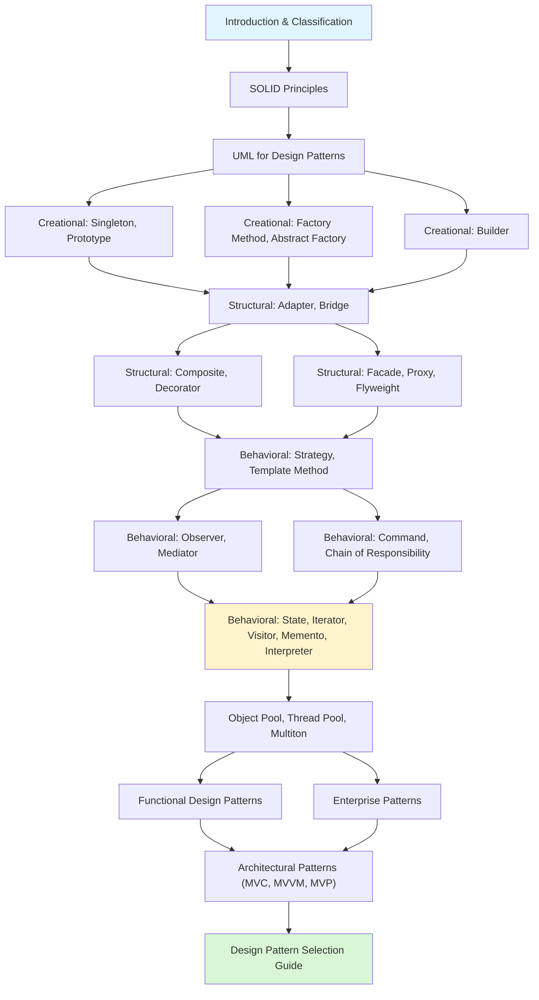

# Design Patterns

> [!summary] Scope
> Complete catalog of 23 Gang of Four design patterns, SOLID principles, UML notation, functional design patterns, enterprise patterns, and a selection guide — all with Java code, UML diagrams, and real-world usage.

## Learning Path

## Topic Map

### Foundations (3 files)

- [[DesignPatterns/01_Foundations/F01_Introduction_to_Design_Patterns]] — what patterns are, GoF classification (Creational/Structural/Behavioral), pattern anatomy, anti-patterns
- [[DesignPatterns/01_Foundations/F02_SOLID_Principles]] — SRP, OCP, LSP, ISP, DIP — each with UML violation/fix diagrams, Java examples, and detection flowchart
- [[DesignPatterns/01_Foundations/F03_UML_for_Design_Patterns]] — class diagram notation, relationships (inheritance, realization, dependency, aggregation, composition), sequence diagram notation

### Core — Creational (3 files)

- [[DesignPatterns/02_Core/C01_Singleton_and_Prototype]] — eager/lazy/enum singleton variants, Cloneable, shallow vs deep copy, prototype registry
- [[DesignPatterns/02_Core/C02_Factory_Method_and_Abstract_Factory]] — simple factory, factory method (subclass decides product), abstract factory (product families), comparison table
- [[DesignPatterns/02_Core/C03_Builder]] — telescoping constructor problem, fluent builder, immutable builder, Director

### Core — Structural (3 files)

- [[DesignPatterns/02_Core/C04_Adapter_and_Bridge]] — class vs object adapter, InputStream/HandlerAdapter, Bridge separating abstraction from implementation (JDBC/SLF4J)
- [[DesignPatterns/02_Core/C05_Composite_and_Decorator]] — tree structures (files + directories), decorator stacking (BufferedReader, Coffee), same structure different intent
- [[DesignPatterns/02_Core/C06_Facade_Proxy_Flyweight]] — facade (JdbcTemplate), proxy (virtual/protection/remote), flyweight (Integer cache, String.intern)

### Core — Behavioral (4 files)

- [[DesignPatterns/02_Core/C07_Strategy_and_Template_Method]] — interchangeable algorithms (Comparator, PaymentStrategy), algorithm skeleton with hooks (JdbcTemplate, HttpServlet)
- [[DesignPatterns/02_Core/C08_Observer_and_Mediator]] — push vs pull observer, event bus, mediator for UI dialogs, aircraft control analogy
- [[DesignPatterns/02_Core/C09_Command_and_Chain_of_Responsibility]] — command encapsulation with undo/redo, macro commands, middleware pipeline (servlet filters)
- [[DesignPatterns/02_Core/C10_State_Iterator_Visitor_Memento_Interpreter]] — state machines, collection traversal, double dispatch, object snapshots, expression evaluation, **Servant**
- [[DesignPatterns/02_Core/C11_Object_Pool_Thread_Pool_Multiton]] — object pool (borrow/return lifecycle), thread pool (work queue, fixed/cached), Multiton (named instance registry), connection pooling

### Advanced (3 files)

- [[DesignPatterns/03_Advanced/A01_Functional_Design_Patterns]] — Functor, Monad (Optional, CompletableFuture), pipeline, currying, immutability, Null Object, **RAII/Scope Guard, Type Erasure, PIMPL**
- [[DesignPatterns/03_Advanced/A02_Enterprise_Patterns]] — Repository, Data Mapper vs Active Record, Unit of Work, DAO, DTO, Service Layer, **Service Locator, Specification**
- [[DesignPatterns/03_Advanced/A03_Design_Pattern_Selection_Guide]] — creational/structural/behavioral decision trees, pattern relationships, refactoring guide, GoF quick reference
- [[DesignPatterns/03_Advanced/A04_Architectural_Patterns_MVC_MVVM_MVP]] — MVC, MVP, MVVM comparison, testability analysis, framework mapping, data binding

## Cross-Links

- [[Java/01_Foundations/01_Java_Basics_and_Idioms]] for Java language features used in patterns
- [[Java/01_Foundations/04_Streams_Lambdas_and_Functional_Java]] for functional patterns in Java
- [[SpringBoot/01_Foundations/02_DI_and_Bean_Lifecycle]] for DI, singleton scope, and factory beans
- [[SpringBoot/03_Advanced/02_AOP_Proxies_and_Internals]] for proxy pattern and AOP
- [[TypeScript/03_Advanced/07_Design_Patterns_in_TypeScript]] for TypeScript pattern implementations

## References

- Gamma, Helm, Johnson, Vlissides — *Design Patterns: Elements of Reusable Object-Oriented Software* (1994)
- Martin Fowler — *Patterns of Enterprise Application Architecture*
- Joshua Bloch — *Effective Java* (3rd Edition) — item 1-8 for creational patterns
- [Refactoring Guru](https://refactoring.guru/design-patterns) for pattern UML and code examples
