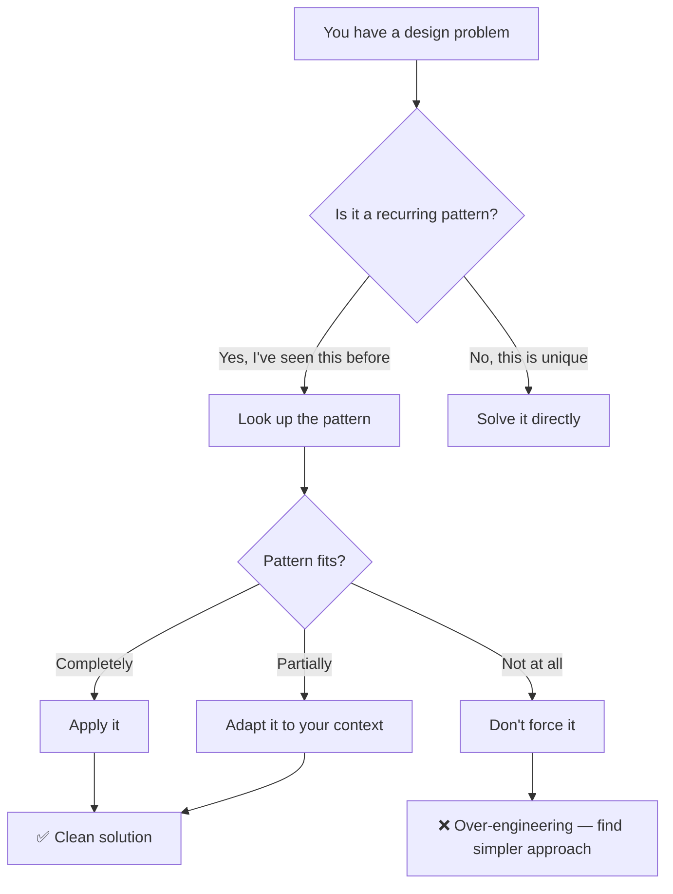

# Introduction to Design Patterns

> [!summary] Goal
> Understand what design patterns are, why they matter, how the Gang of Four classified them, and how to read this section effectively.

## Table of Contents

1. [What Are Design Patterns?](#what-are-design-patterns)
2. [GoF Classification](#gof-classification)
3. [Pattern Anatomy](#pattern-anatomy)
4. [When to Use Patterns](#when-to-use-patterns)
5. [Anti-Patterns](#anti-patterns)

---

## What Are Design Patterns?

A **design pattern** is a reusable, proven solution to a recurring problem in software design. Patterns are not code — they are templates describing how to solve a problem in a given context.

> [!info] Design Pattern
> A general, reusable solution to a commonly occurring problem within a given context in software design. A pattern is not a finished design that can be directly translated to code — it is a description or template for how to solve a problem. Patterns capture proven experience and provide a shared vocabulary for developers to communicate design decisions at a higher level of abstraction.

\`\`\`mermaid
flowchart TD
    A["Encounter a recurring design problem"] --> B["Identify the pattern context"]
    B --> C["Apply the pattern solution"]
    C --> D["Evaluate: does it fit?"]
    D -->|"Yes"| E["Problem solved ✅"]
    D -->|"No"| F["Adapt or choose another pattern"]
```

| Aspect | What a pattern is | What a pattern is NOT |
|--------|-------------------|----------------------|
| **Level** | Design guidance at the architecture level | Implementation code you copy-paste |
| **Reusability** | Reusable across projects, languages, domains | A library or framework |
| **Precision** | A named, documented solution with known tradeoffs | A rule you must follow blindly |
| **Origin** | Distilled from real-world experience | Academic theory without practical validation |

---

## GoF Classification

The Gang of Four (Erich Gamma, Richard Helm, Ralph Johnson, John Vlissides) — 1994 — catalogued **23 patterns** in three categories:

```mermaid
flowchart TD
    A["GoF Design Patterns"] --> B["Creational (5)"]
    A --> C["Structural (7)"]
    A --> D["Behavioral (11)"]
    
    B --> B1["Singleton"]
    B --> B2["Factory Method"]
    B --> B3["Abstract Factory"]
    B --> B4["Builder"]
    B --> B5["Prototype"]
    
    C --> C1["Adapter"]
    C --> C2["Bridge"]
    C --> C3["Composite"]
    C --> C4["Decorator"]
    C --> C5["Facade"]
    C --> C6["Flyweight"]
    C --> C7["Proxy"]
    
    D --> D1["Strategy"]
    D --> D2["Template Method"]
    D --> D3["Observer"]
    D --> D4["Mediator"]
    D --> D5["Command"]
    D --> D6["Chain of Responsibility"]
    D --> D7["State"]
    D --> D8["Iterator"]
    D --> D9["Visitor"]
    D --> D10["Memento"]
    D --> D11["Interpreter"]
```



| Category | Focus | Question it answers | Scope |
|----------|-------|-------------------|-------|
| **Creational** (5) | Object creation mechanisms | "How do I create objects flexibly?" | Hide creation logic; decouple client from concrete classes |
| **Structural** (7) | Object composition and relationships | "How do I build larger structures from parts?" | Compose interfaces and implementations to form larger structures |
| **Behavioral** (11) | Communication and responsibility distribution | "How do objects interact and distribute responsibility?" | Assign responsibilities; manage algorithms and communication |

### Creational Patterns — Detailed Classification

| Pattern              | Intent                                                  |             Flexibility              | What it hides                                |
| -------------------- | ------------------------------------------------------- | :----------------------------------: | -------------------------------------------- |
| **Singleton**        | Ensure a class has exactly one instance                 |      Low — global access point       | The instance count and lifetime              |
| **Factory Method**   | Subclass decides which concrete class to create         | Medium — product varies by subclass  | Which concrete class is instantiated         |
| **Abstract Factory** | Create families of related objects                      |    High — entire product families    | Which product family is used                 |
| **Builder**          | Construct complex objects step by step                  | Medium — construction process varies | Object construction steps and representation |
| **Prototype**        | Clone existing objects instead of creating from scratch |  Medium — clone registry can change  | Which concrete class to instantiate          |

### Structural Patterns — Detailed Classification

| Pattern | Intent | Structure focus | What it composes |
|---------|--------|:---------------:|------------------|
| **Adapter** | Convert one interface to another | Interface compatibility | Existing class adapted to a different interface |
| **Bridge** | Decouple abstraction from implementation | Abstraction vs implementation | Two independent hierarchies (abstraction + implementation) |
| **Composite** | Treat individuals and compositions uniformly | Part-whole hierarchy | Tree structure of objects |
| **Decorator** | Add behavior to objects dynamically | Layered wrapping | Behavior layers around an object |
| **Facade** | Provide a simplified interface to a subsystem | Subsystem simplification | Complex subsystem behind a simple interface |
| **Flyweight** | Share fine-grained objects efficiently | Memory optimization | Shared intrinsic state across many objects |
| **Proxy** | Control access to another object | Access control | Access layer around a target object |

### Behavioral Patterns — Detailed Classification

| Pattern | Intent | Communication style | Responsibility |
|---------|--------|:-------------------:|:--------------:|
| **Strategy** | Interchangeable algorithms | Delegation — client picks algorithm | Algorithm is selected by client |
| **Template Method** | Skeleton algorithm with overridable steps | Inheritance — subclass implements steps | Base class controls algorithm structure |
| **Observer** | One-to-many dependency notification | Broadcast — subject notifies observers | Subject notifies all dependents automatically |
| **Mediator** | Centralize complex communication | Hub-and-spoke — colleagues talk via mediator | Mediator coordinates all interactions |
| **Command** | Encapsulate a request as an object | Action object — invoker executes command | Command carries all request information |
| **Chain of Responsibility** | Pass request through handler chain | Pipeline — handler passes to next if unhandled | Each handler decides to process or forward |
| **State** | Object changes behavior when state changes | Self-transition — states decide transitions | State objects control behavior per state |
| **Iterator** | Traverse a collection without exposing structure | Sequential access — iterator walks elements | Iterator handles traversal logic |
| **Visitor** | Add operations to a stable object hierarchy | Double dispatch — visitor + element | Visitor adds operations without changing elements |
| **Memento** | Save and restore object state | Snapshot — caretaker saves/restores | Memento stores state without exposing internals |
| **Interpreter** | Evaluate expressions in a language | Grammar — expressions form an AST | Each expression node knows how to evaluate itself |

### Category Comparison

| Aspect | Creational | Structural | Behavioral |
|--------|:----------:|:----------:|:----------:|
| **Pattern count** | 5 | 7 | 11 |
| **Primary mechanism** | Inheritance or delegation for creation | Composition of classes/objects | Communication between objects |
| **Key benefit** | Flexibility in what gets created | Flexibility in how objects are composed | Flexibility in how objects interact |
| **Common theme** | "Who creates what?" | "How are things arranged?" | "Who does what and when?" |
| **Example patterns** | Singleton, Factory, Builder | Adapter, Decorator, Proxy | Strategy, Observer, Command |

---

## Pattern Anatomy

Every pattern in this section follows the same structure:

```text
1. Name & Classification — what it's called and which category it belongs to
2. Problem — what design issue does it solve?
3. Solution — the pattern structure with UML class diagram
4. How It Works — sequence/flow diagram
5. Java Implementation — code example
6. Where It's Used — real-world examples in Java and frameworks
7. Pros & Cons — tradeoffs at a glance
8. Decision Criteria — when to use / when not to use
9. Related Patterns — how it differs from similar patterns
10. Pitfalls — common mistakes
```

---

## When to Use Patterns



### Signs you need a pattern

| Symptom | Likely pattern |
|---------|---------------|
| Object creation is scattered and duplicated | Factory Method or Builder |
| A switch/if-else chain keeps growing | Strategy or State |
| Many classes are tightly coupled | Observer or Mediator |
| A class has too many responsibilities | Facade or Adapter |
| You need to add behavior without modifying existing code | Decorator |
| An algorithm has a fixed structure with varying steps | Template Method |

---

## Anti-Patterns

An **anti-pattern** is a common but ineffective solution that creates more problems than it solves.

> [!info] Anti-pattern
> A common response to a recurring problem that is usually ineffective and risks being counterproductive. Unlike a design pattern (a proven solution), an anti-pattern documents what NOT to do. Recognizing anti-patterns (God Class, Spaghetti Code, Golden Hammer) helps developers avoid known mistakes and refactor toward better designs.

| Anti-pattern | Symptom | Better approach |
|-------------|---------|-----------------|
| **God Class** | One class does everything | Split via SRP + Facade |
| **Spaghetti Code** | No clear structure | Layered architecture + patterns |
| **Golden Hammer** | Using a familiar pattern everywhere | Choose pattern based on problem |
| **Copy-Paste Programming** | Repeated code blocks | Extract into reusable abstractions |
| **Premature Optimization** | Complex patterns for simple needs | Start simple, refactor when needed |

> [!tip] Design patterns solve problems — they don't create them. If a pattern makes your code more complex without solving a real problem, don't use it. Simple > clever.

---

## Pitfalls

### Forcing patterns where they don't belong

The most common mistake is applying a pattern because you "should" or because it looks impressive. A `switch` statement with 3 cases does NOT need the Strategy pattern with 3 classes. Start simple. Refactor to patterns when the pain is real.

### Pattern over-engineering

A Singleton for every service, a Factory for every object, a Decorator for every method call — pattern abuse creates unmaintainable code. Each pattern adds indirection and complexity. Use patterns to solve problems, not to create them.

### Ignoring language features

Many GoF patterns were documented for C++ in 1994. Modern languages have built-in alternatives:
- Singleton → DI container / `@Singleton` annotation
- Iterator → `for-each` loop, streams
- Command → lambdas / method references
- Observer → reactive streams / event bus
- Strategy → lambdas / function interfaces

### Memorizing patterns instead of understanding principles

Knowing 23 pattern names is useless if you can't recognize the problem they solve. Focus on SOLID principles and the intent of each pattern. The pattern name is just a label for a well-known solution.

---

> [!question]- Interview Questions
>
> **Q: What are the three categories of GoF patterns?**
> A: Creational (how objects are created), Structural (how objects are composed), Behavioral (how objects communicate). 5 + 7 + 11 = 23 patterns total.
>
> **Q: What is the most important rule when using design patterns?**
> A: Don't force them. A pattern should solve an actual design problem — not be applied preemptively. Start simple, feel the pain, then introduce the pattern. Over-engineering with patterns is worse than not using patterns at all.
>
> **Q: How have modern programming languages made some patterns simpler?**
> A: Lambdas simplify Strategy, Command, and Observer (no need for separate classes). DI containers simplify Singleton and Factory (the framework manages instances). Streams simplify Iterator (internal iteration with map/filter/reduce).
>
> **Q: What is the difference between a design pattern and an architectural pattern?**
> A: Design patterns are at the class/object level (how objects interact). Architectural patterns are at the system level (how components are organized). Examples: Singleton is a design pattern; MVC, Microservices, Hexagonal are architectural patterns.
>
> **Q: When should you NOT use a design pattern?**
> A: (1) When the problem is simple enough for plain code. (2) When the pattern adds more complexity than the problem justifies. (3) When the team is unfamiliar with the pattern (a known pattern badly applied is worse than no pattern). (4) When the language provides a built-in alternative.

---

## Cross-Links

- [[DesignPatterns/01_Foundations/02_SOLID_Principles]] for the principles that patterns are built on
- [[DesignPatterns/02_Core/C01_Singleton_and_Prototype]] for creational patterns
- [[DesignPatterns/03_Advanced/A03_Design_Pattern_Selection_Guide]] for choosing the right pattern
- [[DesignPatterns/01_Foundations/03_UML_for_Design_Patterns]] for understanding the diagrams in this section
