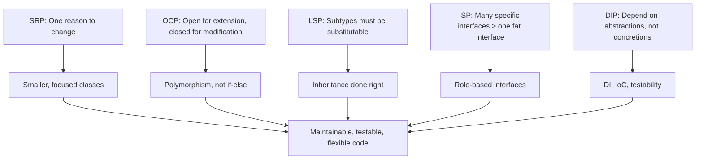
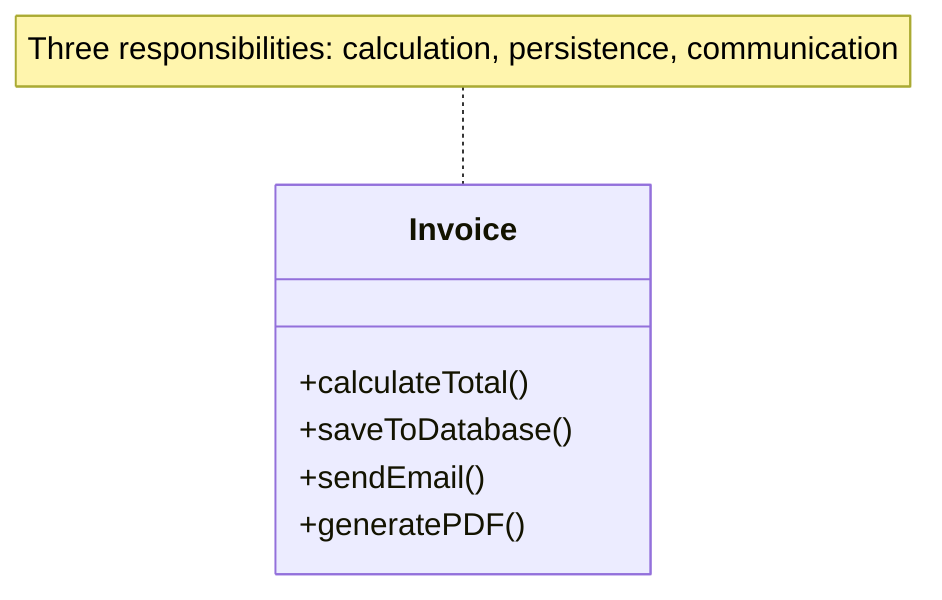
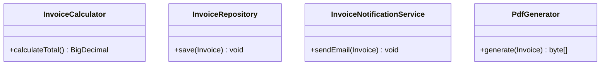
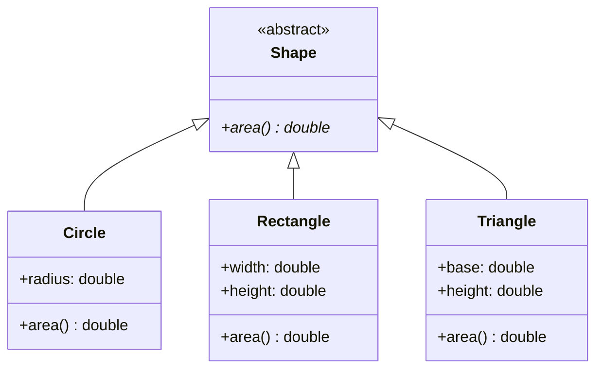
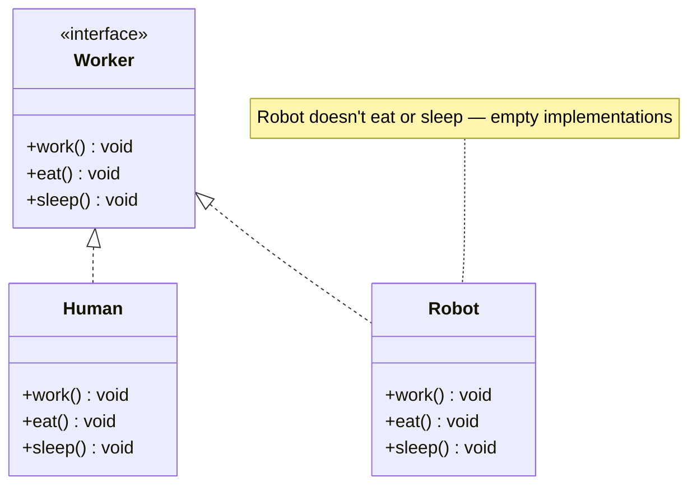
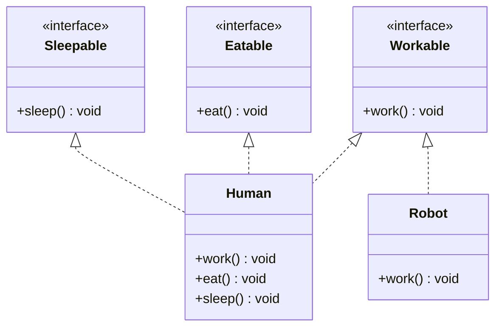
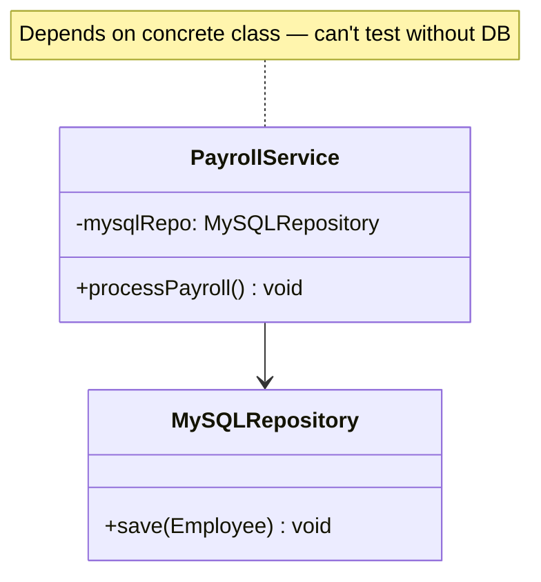
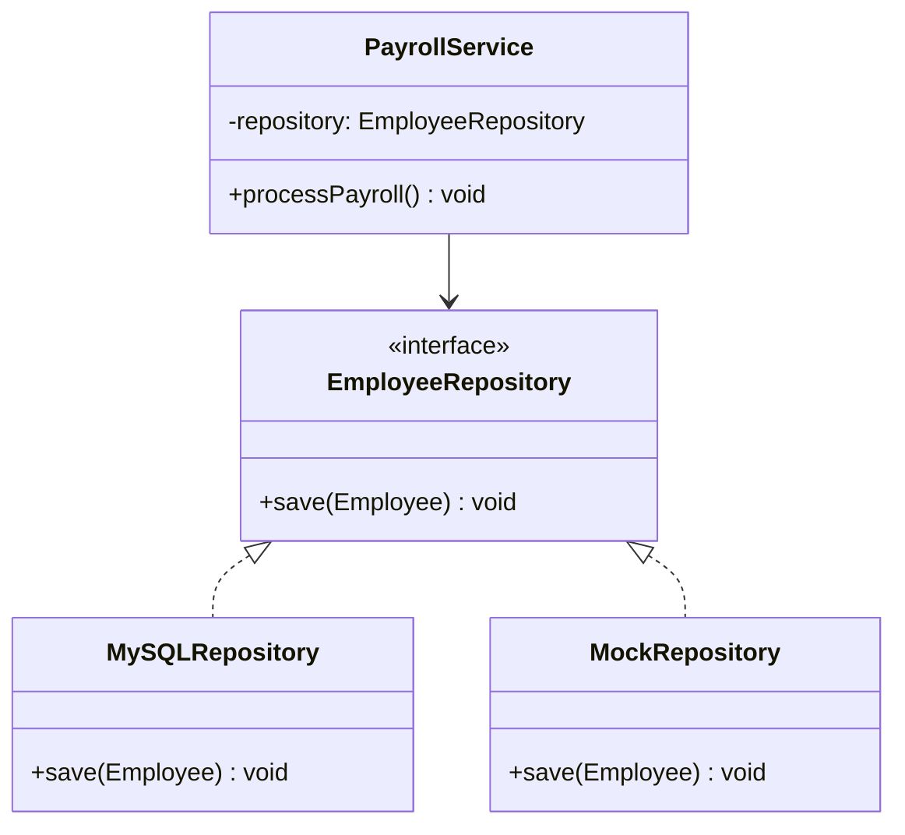
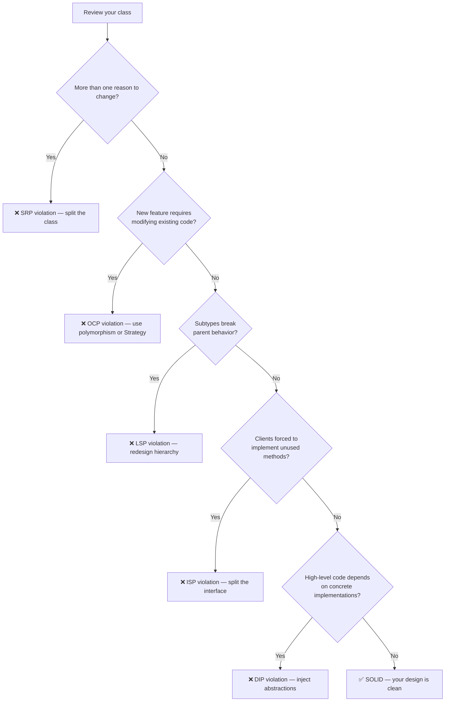

# SOLID Principles

> [!summary] Goal
> Understand the five SOLID principles of object-oriented design — the foundation that design patterns are built on. Each principle is explained with UML before/after diagrams, Java examples, and real-world application.

## Table of Contents

1. [Overview](#overview)
2. [SRP — Single Responsibility Principle](#srp-single-responsibility-principle)
3. [OCP — Open/Closed Principle](#ocp-open-closed-principle)
4. [LSP — Liskov Substitution Principle](#lsp-liskov-substitution-principle)
5. [ISP — Interface Segregation Principle](#isp-interface-segregation-principle)
6. [DIP — Dependency Inversion Principle](#dip-dependency-inversion-principle)
7. [SOLID Violation Detection Flowchart](#solid-violation-detection-flowchart)
8. [Pitfalls](#pitfalls)

---

## Overview



| Principle | Core idea | Violation smell | Fix |
|-----------|-----------|----------------|-----|
| **SRP** | A class should have one, and only one, reason to change | God classes, mixed concerns | Split into focused classes |
| **OCP** | Open for extension, closed for modification | Switch/if chains for new behaviors | Polymorphism, Strategy pattern |
| **LSP** | Subtypes must be substitutable for their base types | instanceof checks, overriding with no-op | Redesign hierarchy |
| **ISP** | Clients should not depend on methods they don't use | Fat interfaces with empty implementations | Split interfaces by role |
| **DIP** | Depend on abstractions, not concretions | New keyword in business logic, hardcoded references | Constructor injection |

---

## SRP — Single Responsibility Principle

> [!info] Single Responsibility Principle
> A class should have exactly one reason to change. If a class has multiple responsibilities, changes to one responsibility may affect the others. Violation smells include "God classes" that mix business logic, persistence, formatting, and communication. Fix by splitting into focused classes, each with a single, well-defined responsibility.

> A class should have **one reason to change**.

### Violation



```java
// ❌ Violates SRP — three reasons to change
public class Invoice {
    public BigDecimal calculateTotal() { /* ... */ }
    public void saveToDatabase() { /* ... */ }
    public void sendEmail() { /* ... */ }
    public byte[] generatePDF() { /* ... */ }
}
```

### Fixed



```java
// ✅ SRP — each class has one responsibility
public class InvoiceCalculator {
    public BigDecimal calculateTotal(Invoice invoice) { /* ... */ }
}

public class InvoiceRepository {
    public void save(Invoice invoice) { /* ... */ }
}
```

**When to apply**: When a class has methods that operate on different concerns (business logic + persistence + formatting). If you can describe the class with "and" ("it calculates AND saves AND emails"), it needs splitting.

---

## OCP — Open/Closed Principle

> [!info] Open/Closed Principle
> Software entities (classes, modules, functions) should be open for extension but closed for modification. You should be able to add new functionality by writing new code (extending), not by modifying existing, tested code. Achieved through polymorphism, abstraction, and patterns like Strategy and Template Method.

> Classes should be **open for extension** but **closed for modification**.

### Violation

```java
// ❌ Violates OCP — adding a new shape requires modifying this method
public double calculateArea(Object shape) {
    if (shape instanceof Circle) {
        Circle c = (Circle) shape;
        return Math.PI * c.radius() * c.radius();
    } else if (shape instanceof Rectangle) {
        Rectangle r = (Rectangle) shape;
        return r.width() * r.height();
    }
    throw new IllegalArgumentException("Unknown shape");
}
```

### Fixed



```java
// ✅ OCP — add new shapes without modifying existing code
public abstract class Shape {
    public abstract double area();
}

public class Circle extends Shape {
    private final double radius;
    public Circle(double radius) { this.radius = radius; }
    @Override public double area() { return Math.PI * radius * radius; }
}

public class Rectangle extends Shape {
    private final double width, height;
    public Rectangle(double width, double height) { this.width = width; this.height = height; }
    @Override public double area() { return width * height; }
}
```

**When to apply**: When you have switch/if chains that grow with each new variant. The Strategy and Template Method patterns are built on OCP.

---

## LSP — Liskov Substitution Principle

> [!info] Liskov Substitution Principle
> Objects of a superclass should be replaceable with objects of a subclass without affecting the correctness of the program. Subtypes must preserve the behavior expected by the client code that uses the base type. Classic violation: \`Square\` extends \`Rectangle\` — setting width on a Square also changes its height, breaking code that expects independent dimensions.

> Subtypes must be **substitutable** for their base types without altering the correctness of the program.

### Classic violation: Rectangle vs Square

```java
// ❌ Violates LSP
public class Rectangle {
    private int width, height;
    public void setWidth(int width) { this.width = width; }
    public void setHeight(int height) { this.height = height; }
    public int getArea() { return width * height; }
}

public class Square extends Rectangle {
    @Override
    public void setWidth(int width) {
        super.setWidth(width);
        super.setHeight(width);  // Maintains square invariant
    }

    @Override
    public void setHeight(int height) {
        super.setHeight(height);
        super.setWidth(height);
    }
}

// Client code that breaks with Square:
void resize(Rectangle r) {
    r.setWidth(5);
    r.setHeight(10);
    assert r.getArea() == 50;  // Fails for Square! (5×5 = 25, not 50)
}
```

### Fix: don't model Square as a subclass of Rectangle

```java
// ✅ LSP — separate shapes, common interface
public interface Shape {
    int getArea();
}

public class Rectangle implements Shape {
    private int width, height;
    public Rectangle(int width, int height) { this.width = width; this.height = height; }
    @Override public int getArea() { return width * height; }
}

public class Square implements Shape {
    private int side;
    public Square(int side) { this.side = side; }
    @Override public int getArea() { return side * side; }
}
```

> [!tip] If a subclass overrides methods in a way that breaks the parent's contract, it violates LSP. Common violations: overriding with no-op, strengthening preconditions, weakening postconditions.

---

## ISP — Interface Segregation Principle

> [!info] Interface Segregation Principle
> No client should be forced to depend on methods it does not use. Large, "fat" interfaces force implementing classes to provide empty or stub implementations for irrelevant methods. Fix by splitting interfaces into smaller, role-specific interfaces. Violation smells include \`UnsupportedOperationException\`, empty method bodies, and comments saying "not used in this implementation."

> Clients should not be forced to depend on methods they do not use.

### Violation



```java
// ❌ Violates ISP — Robot implements unnecessary methods
public interface Worker {
    void work();
    void eat();
    void sleep();
}

public class Robot implements Worker {
    @Override public void work() { /* ... */ }
    @Override public void eat() { /* no-op — forced to implement */ }
    @Override public void sleep() { /* no-op — forced to implement */ }
}
```

### Fixed



```java
// ✅ ISP — segregated interfaces
public interface Workable { void work(); }
public interface Eatable { void eat(); }
public interface Sleepable { void sleep(); }

public class Human implements Workable, Eatable, Sleepable { /* ... */ }
public class Robot implements Workable { /* ... */ }
```

**When to apply**: When you see `UnsupportedOperationException`, empty method bodies, or comments saying "not used in this implementation".

---

## DIP — Dependency Inversion Principle

> [!info] Dependency Inversion Principle
> High-level modules should not depend on low-level modules — both should depend on abstractions (interfaces). Abstractions should not depend on details; details should depend on abstractions. This is commonly achieved through constructor injection: instead of creating dependencies with \`new\`, accept them via the constructor as interface types. This improves testability and reduces coupling.

> High-level modules should not depend on low-level modules. Both should depend on **abstractions**.

### Violation



```java
// ❌ Violates DIP — high-level depends on low-level concrete class
public class PayrollService {
    private final MySQLRepository repository = new MySQLRepository();
    // Hard to test, hard to swap DB implementation
}
```

### Fixed



```java
// ✅ DIP — depend on abstraction, inject concrete implementation
public interface EmployeeRepository {
    void save(Employee employee);
}

public class PayrollService {
    private final EmployeeRepository repository;

    public PayrollService(EmployeeRepository repository) {   // Constructor injection
        this.repository = repository;
    }

    public void processPayroll(Employee employee) {
        // business logic...
        repository.save(employee);
    }
}
```

**When to apply**: When you use `new` for services, repositories, or any dependency that could change (test, environment, implementation). Use constructor injection + interfaces.

---

## SOLID Violation Detection Flowchart



---

## Pitfalls

### Over-engineering with SOLID

Following SOLID blindly creates too many small classes and interfaces. Five single-method interfaces are worse than one reasonable interface. Apply SOLID where you have real pain points, not preemptively.

### SRP taken to extremes

A class with three 50-line methods is fine. Splitting it into 150 single-line classes is not SRP — it's class explosion. The principle is about separation of concerns, not minimizing class size.

### LSP applied to value objects

`Square extends Rectangle` is the classic LSP violation, but many real-world type hierarchies don't have this problem. Don't contort your domain model to avoid every theoretical LSP edge case — apply it when you actually see substitution failures.

### DIP without DI container

Dependency Inversion requires injecting dependencies, which means someone must wire them together. Without a DI container (Spring, Guice, Dagger), you end up with manual factory code. Use Spring Boot for Java DI, or accept the manual wiring overhead.

---

> [!question]- Interview Questions
>
> **Q: What is the Single Responsibility Principle?**
> A: A class should have only one reason to change. If you can describe a class with "and" ("it calculates AND saves AND emails"), it has multiple responsibilities and should be split.
>
> **Q: Show an example of violating OCP and how to fix it.**
> A: A method with `if (shape instanceof Circle)` / `else if (shape instanceof Rectangle)` violates OCP — adding a triangle requires modifying the method. Fix: make `Shape` an abstract class with an `area()` method, and each shape implements it. New shapes don't modify existing code.
>
> **Q: Why is `Square extends Rectangle` an LSP violation?**
> A: A Square overrides setters to maintain the square invariant (setting width also sets height). Client code that calls `setWidth(5); setHeight(10)` on a Rectangle expects area = 50 but gets 25 for Square. Square is not substitutable for Rectangle.
>
> **Q: What is the difference between ISP and SRP?**
> A: SRP is about class responsibility (one reason to change). ISP is about interface design (don't force clients to depend on methods they don't use). SRP focuses on implementations; ISP focuses on contracts.
>
> **Q: How does Dependency Inversion improve testability?**
> A: When high-level code depends on abstractions (interfaces), you can inject mock/stub implementations in tests. With `PayrollService(EmployeeRepository)`, the test provides an in-memory `MockRepository`. Without DIP, the service creates its own database connection — impossible to unit test.

---

## Cross-Links

- [[DesignPatterns/01_Foundations/F01_Introduction_to_Design_Patterns]] for pattern classification
- [[DesignPatterns/02_Core/C07_Strategy_and_Template_Method]] for OCP in action
- [[DesignPatterns/03_Advanced/A02_Enterprise_Patterns]] for DIP with Repository
- [[DesignPatterns/03_Advanced/A01_Functional_Design_Patterns]] for ISP with small interfaces
- [[Java/01_Foundations/01_Java_Basics_and_Idioms]] for composition over inheritance
