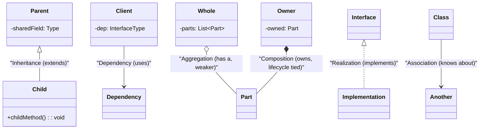
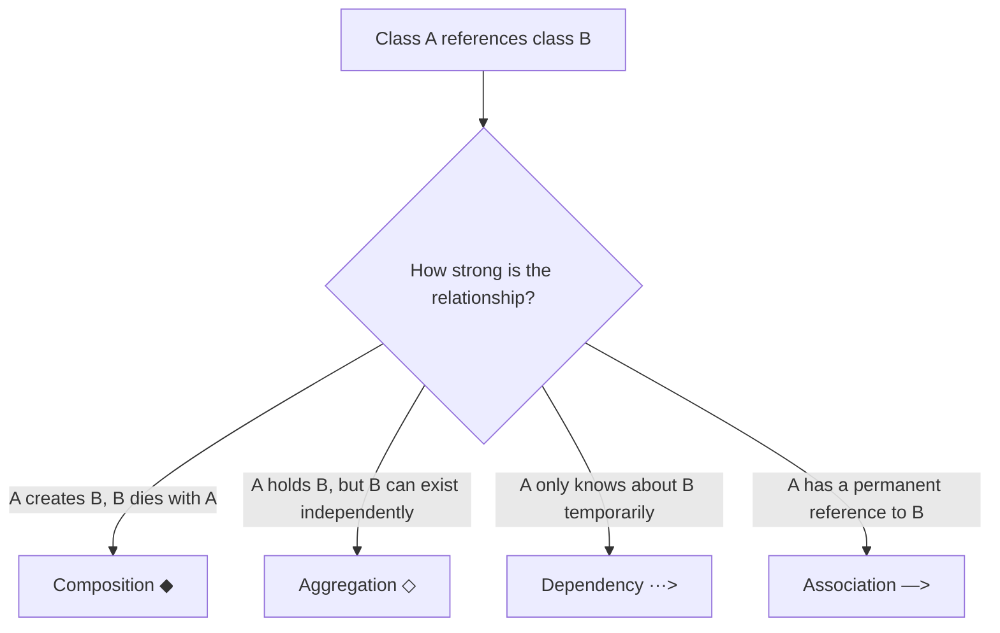

# UML for Design Patterns

> [!summary] Goal
> Read and draw UML class diagrams and sequence diagrams for design patterns. Understand the notation used throughout this section.

## Table of Contents

1. [Class Diagram Notation](#class-diagram-notation)
2. [Relationships](#relationships)
3. [Sequence Diagram Notation](#sequence-diagram-notation)
4. [Common Pattern Diagram Patterns](#common-pattern-diagram-patterns)

---

## Class Diagram Notation

> [!info] Class Diagram
> A UML diagram type that models the structure of a system by showing its classes, attributes, methods, and the relationships between them. Class diagrams are the primary notation used in this section to illustrate design pattern structures. They show inheritance (extends), realization (implements), dependency, association, aggregation, and composition relationships.

\`\`\`mermaid
classDiagram
    class ClassName {
        +publicField: Type
        -privateField: Type
        #protectedField: Type
        +publicMethod(param: Type): ReturnType
        -privateMethod(): void
        #protectedMethod(): void
    }
    class AbstractClass {
        <<abstract>>
        +concreteMethod(): void
        +abstractMethod()*
    }
    class InterfaceName {
        <<interface>>
        +abstractMethod(): void
    }
    note for ClassName "± denotes visibility:<br/>+ public, - private, # protected"
    note for AbstractClass "Italic method name = abstract<br/><<abstract>> stereotype"
```

| Notation          | Meaning                   | Example                         |
| ----------------- | ------------------------- | ------------------------------- |
| `+field: Type`    | Public field              | `+name: String`                 |
| `-field: Type`    | Private field             | `-id: Long`                     |
| `#field: Type`    | Protected field           | `#logger: Logger`               |
| `+method(): Type` | Public method             | `+calculateTotal(): BigDecimal` |
| `method()*`       | Abstract method           | `+area()*`                      |
| `<<interface>>`   | Interface stereotype      | Marks a type as interface       |
| `<<abstract>>`    | Abstract class stereotype | Marks a class as abstract       |
| `{abstract}`      | Property marking          | Alternative to stereotype       |

---

## Relationships



| Relationship | Line | Arrow | Meaning | Java example |
|-------------|------|-------|---------|-------------|
| **Inheritance** | Solid + hollow triangle | `Parent △— Child` | Class extends another | `class Dog extends Animal` |
| **Realization** | Dashed + hollow triangle | `Interface △··· Impl` | Class implements interface | `class Dog implements Pet` |
| **Dependency** | Dashed + arrow | `A ···> B` | A uses B temporarily | Method parameter type |
| **Association** | Solid + arrow | `A —> B` | A knows about B | Field reference |
| **Aggregation** | Solid + hollow diamond | \`A ◇— B\` | A has B, B can exist without A | \`Department\` has \`Employee\`s |
| **Composition** | Solid + filled diamond | \`A ◆— B\` | A owns B, B lives and dies with A | \`House\` has \`Room\`s |

> [!info] Aggregation vs Composition
> Both are "has-a" relationships but differ in lifecycle ownership. **Aggregation** (hollow diamond ◇) implies the child can exist independently of the parent — e.g., an \`Employee\` can move to another \`Department\`. **Composition** (filled diamond ◆) implies the child's lifecycle is fully tied to the parent — e.g., \`Room\`s are destroyed when the \`House\` is destroyed. Composition is a stronger form of containment.

### When to use each



---

## Sequence Diagram Notation

> [!info] Sequence Diagram
> A UML diagram type that shows how objects interact over time, capturing the sequence of messages exchanged between participants. Sequence diagrams complement class diagrams by showing the dynamic behavior of a pattern — the order of method calls, activation periods, conditional branches, and loops. In this section, every pattern includes a sequence diagram to illustrate runtime interactions.

Sequence diagrams show **how objects interact over time**:

\`\`\`mermaid
sequenceDiagram
    participant C as Client
    participant F as Factory
    participant P as Product
    
    C->>F: createProduct(type)
    activate F
    F->>P: new ConcreteProduct()
    activate P
    F-->>C: Product
    deactivate F
    P-->>C: call method
    deactivate P
    Note over C,P: Alt / Opt / Loop fragments
    alt condition
        C->>P: alternative path
    else
        C->>P: default path
    end
    opt optional
        C->>P: optional step
    end
    loop N times
        C->>P: repeated call
    end
```

| Element | Notation | Meaning |
|---------|----------|---------|
| **Lifeline** | `participant Name` | Vertical dashed line representing object lifetime |
| **Activation** | Thick rectangle on lifeline | Period when object is executing |
| **Message arrow** | `->>` | Solid arrow = call, dashed = return |
| **Self-call** | `->>` back to self | Object calls its own method |
| **alt / else** | Dashed horizontal line | Conditional branching |
| **opt** | Box with `opt` label | Optional step |
| **loop** | Box with `loop` label | Repeated section |
| **Note** | `Note over A,B` | Comment or explanation |
| **Destroy** | `X` at end of lifeline | Object is destroyed |

---

## Common Pattern Diagram Patterns

Throughout this section, you'll see these recurring diagram patterns:

| Diagram type | What it shows | Used in patterns |
|-------------|---------------|-----------------|
| **Class hierarchy** | Inheritance/realization tree | Most patterns show this |
| **Object interaction** | Sequence of method calls | Behavioral patterns |
| **Structure diagram** | How objects are composed | Structural patterns |
| **State machine** | States and transitions | State pattern |
| **Flowchart** | Decision logic | Strategy, Template Method |
| **Tree structure** | Composite hierarchy | Composite pattern |
| **Chain diagram** | Linked handlers | Chain of Responsibility |

---

## Pitfalls

### UML over-engineering

Drawing a full UML diagram for every class is not productive. Use UML for: (1) communicating the structure of a design pattern with examples, (2) documenting key abstractions and relationships, (3) discussing design alternatives during code review. Don't draw UML for every class in production.

### Misidentifying relationships

The most common mistake: using composition (`◆`) when aggregation (`◇`) is correct. If the child can exist without the parent (e.g., `Employee` in a `Department`), use aggregation. If the child dies with the parent (e.g., `Room` in a `House`), use composition.

### Overloading sequence diagrams

A sequence diagram with 15 participants and 50 messages is unreadable. Split into multiple diagrams focusing on specific interaction scenarios. Each diagram should tell one story.

---

> [!question]- Interview Questions
>
> **Q: What is the difference between aggregation and composition in UML?**
> A: Aggregation (hollow diamond `◇`) means the child can exist independently of the parent — e.g., `Department` has `Employee`s; employees can move to another department. Composition (filled diamond `◆`) means the child's lifecycle is tied to the parent — e.g., `House` has `Room`s; rooms are destroyed with the house.
>
> **Q: What does a dashed arrow with a hollow triangle represent?**
> A: Realization (implements). A class implements an interface. The dashed line goes from the implementing class to the interface. For example, `ArrayList` → `List` — `ArrayList` realizes the `List` interface.
>
> **Q: What is the difference between a dependency and an association?**
> A: Dependency (dashed arrow `··>`) means one class uses another temporarily — e.g., a method parameter type. Association (solid arrow `—>`) means a longer-term relationship — e.g., a field reference. Dependency is weaker and shorter-lived.
>
> **Q: What does a sequence diagram activation bar represent?**
> A: The thick vertical rectangle on a lifeline represents the period when an object is actively executing a method. It starts when the object receives a message and ends when it returns. Multiple stacked activations show nested calls.

---

## Cross-Links

- [[DesignPatterns/02_Core/C01_Singleton_and_Prototype]] for first pattern with class diagram
- [[DesignPatterns/02_Core/C10_State_Iterator_Visitor_Memento_Interpreter]] for state machine diagrams
- [[DesignPatterns/02_Core/C05_Composite_and_Decorator]] for tree structure diagrams
- [[DesignPatterns/02_Core/C09_Command_and_Chain_of_Responsibility]] for chain diagrams
