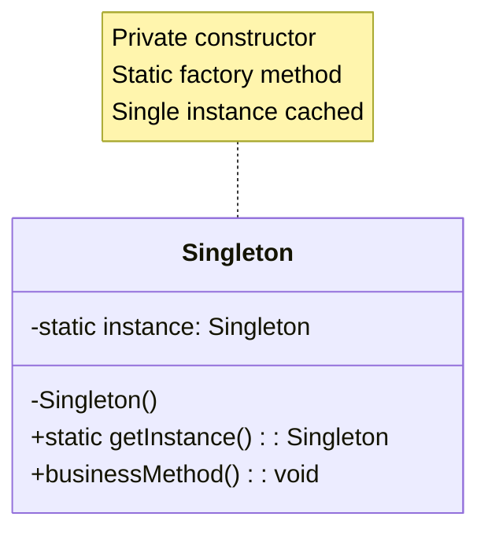
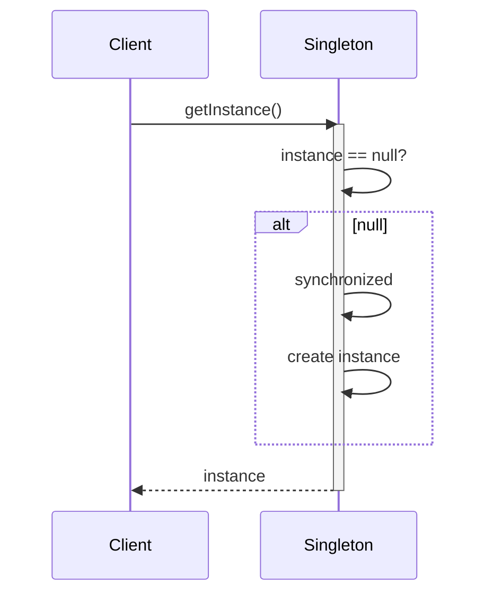
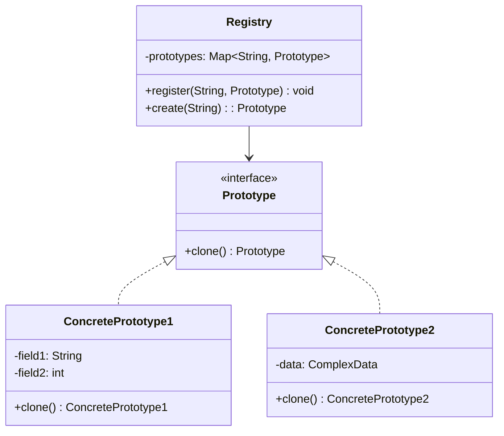
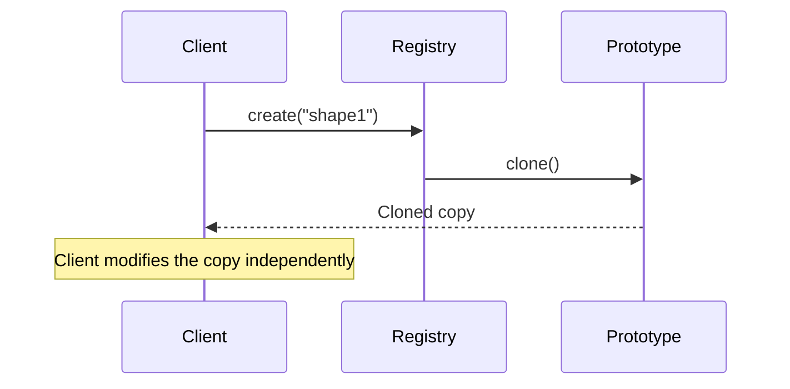
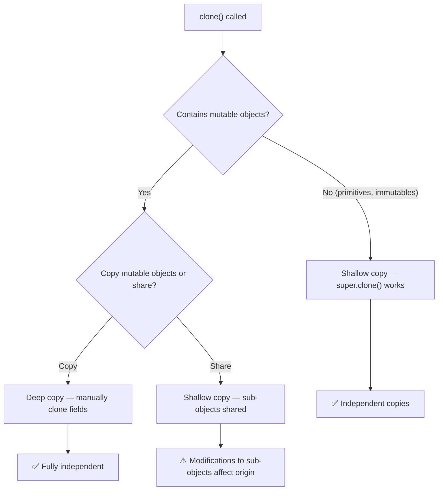
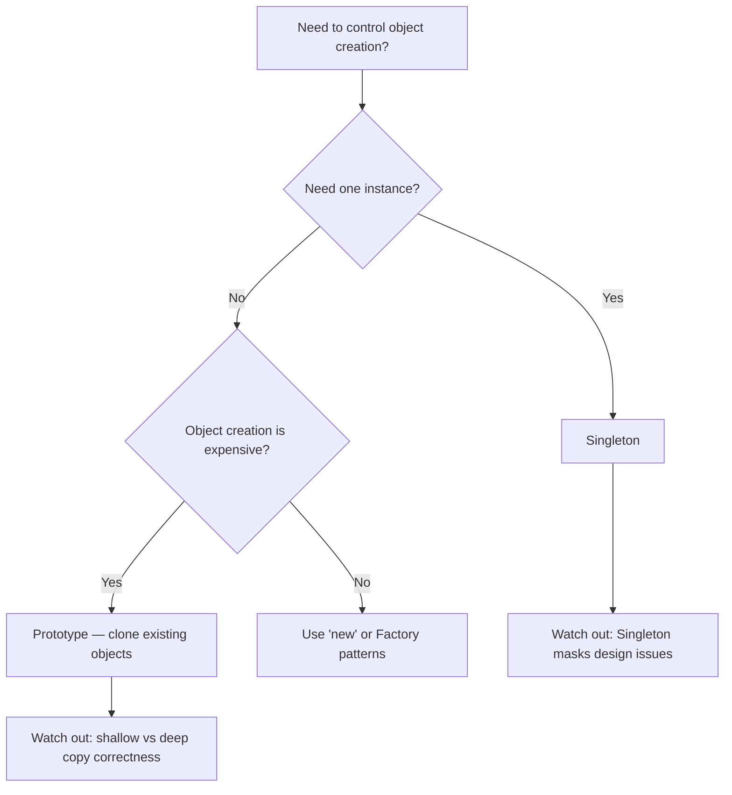

# Creational: Singleton & Prototype

> [!summary] Goal
> Control object creation: ensure a class has only one instance (Singleton) and create new objects by cloning existing ones (Prototype).

## Table of Contents

1. [Singleton](#singleton)
2. [Singleton Variants](#singleton-variants)
3. [Prototype](#prototype)
4. [Prototype Variants](#prototype-variants)
5. [Comparison and Decision Guide](#comparison-and-decision-guide)
6. [Pitfalls](#pitfalls)

---

## Singleton

### Problem

You need **exactly one instance** of a class (logging, configuration, thread pools, database connection pools) and a **global access point** to it.

> [!info] Singleton
> A design pattern that ensures a class has only one instance throughout the application's lifecycle and provides a single global access point to that instance. In Java, the JVM's `Runtime` class follows this pattern.

### Solution



```java
// Eager initialization (simple, thread-safe)
public class EagerSingleton {
    private static final EagerSingleton INSTANCE = new EagerSingleton();
    private EagerSingleton() {}
    public static EagerSingleton getInstance() { return INSTANCE; }
}
```

### Where it's used

| Example | Description |
|---------|-------------|
| `Runtime.getRuntime()` | JVM runtime singleton |
| `System.out` | Standard output stream |
| Spring beans (default scope) | Singleton per `ApplicationContext` |
| Logger instances | `LoggerFactory.getLogger()` often returns cached logger |

---

## Singleton Variants

### Lazy initialization (thread-safe)



```java
// Lazy, thread-safe with double-checked locking
public class LazySingleton {
    private static volatile LazySingleton instance;
    
    private LazySingleton() {}
    
    public static LazySingleton getInstance() {
        if (instance == null) {                    // First check (no lock)
            synchronized (LazySingleton.class) {
                if (instance == null) {            // Second check (with lock)
                    instance = new LazySingleton();
                }
            }
        }
        return instance;
    }
}
```

### Bill Pugh holder pattern

```java
// Thread-safe, lazy, no synchronization overhead
public class HolderSingleton {
    private HolderSingleton() {}
    
    private static class Holder {
        static final HolderSingleton INSTANCE = new HolderSingleton();
    }
    
    public static HolderSingleton getInstance() {
        return Holder.INSTANCE;   // Inner class loaded on first access
    }
}
```

> [!tip] Double-checked locking vs Holder
> Double-checked locking requires `volatile` and synchronization. The Holder pattern uses the JVM's class-loading mechanism — the inner class is loaded only when `getInstance()` is called, providing thread-safe lazy initialization without any synchronization overhead.

### Enum singleton (best for serialization safety)

```java
// Serialization-safe, reflection-safe, inherently single-instance
public enum EnumSingleton {
    INSTANCE;
    
    public void businessMethod() { /* ... */ }
}
```

| Variant | Lazy | Thread-safe | Serialization-safe | Reflection-safe |
|---------|:----:|:---------:|:-----------------:|:---------------:|
| Eager | ❌ | ✅ | ❌ (needs `readResolve`) | ❌ |
| Double-checked | ✅ | ✅ | ❌ | ❌ |
| Bill Pugh holder | ✅ | ✅ | ❌ | ❌ |
| Enum | ❌ | ✅ | ✅ | ✅ |

---

## Prototype

### Problem

Creating objects is expensive (database call, complex initialization, network request). Instead of creating from scratch, **clone** an existing object.

### Solution





```java
// Cloneable interface + super.clone() for shallow copy
public class Shape implements Cloneable {
    private String id;
    private String type;
    private Point position;

    @Override
    public Shape clone() {
        try {
            return (Shape) super.clone();    // Shallow copy
        } catch (CloneNotSupportedException e) {
            throw new RuntimeException(e);
        }
    }
}

// Client: clone instead of new
Shape shape1 = new Shape("circle", new Point(10, 20));
Shape shape2 = shape1.clone();   // No "new" — no expensive initialization
```

---

## Prototype Variants

### Shallow vs deep copy



```java
// Deep copy example
public class Employee implements Cloneable {
    private String name;
    private Address address;        // Mutable object — must deep copy

    @Override
    public Employee clone() {
        try {
            Employee cloned = (Employee) super.clone();
            cloned.address = this.address.clone();   // Deep copy mutable field
            return cloned;
        } catch (CloneNotSupportedException e) {
            throw new RuntimeException(e);
        }
    }
}
```

### Prototype registry

```java
// A registry (or prototype manager) stores and clones pre-configured prototypes
public class ShapeRegistry {
    private Map<String, Shape> prototypes = new HashMap<>();

    public void register(String key, Shape prototype) {
        prototypes.put(key, prototype);
    }

    public Shape create(String key) {
        return prototypes.get(key).clone();   // Clone, not new
    }
}

// Usage
ShapeRegistry registry = new ShapeRegistry();
registry.register("circle", new Circle(5, Color.RED));
Shape c1 = registry.create("circle");   // Both are independent
Shape c2 = registry.create("circle");   // c1 != c2
```

### Where it's used

| Example | Description |
|---------|-------------|
| `Object.clone()` | Java's built-in cloning mechanism |
| Spring `@Scope("prototype")` | New instance per injection (conceptually similar) |
| Game development | Cloning complex game entities (enemies, weapons) |
| Document editors | Cloning template documents (forms, invoices) |

---

## Comparison and Decision Guide



| Aspect | Singleton | Prototype |
|--------|-----------|-----------|
| **Purpose** | Ensure one instance | Clone existing instances |
| **Creation** | Created once | Created via cloning |
| **State** | Shared globally | Independent copies |
| **When to use** | Logging, config, connection pools | Expensive creation, similar objects |
| **Testability** | ❌ Hard (global state) | ✅ Easy (independent copies) |
| **Inheritance** | Can extend | Can extend (cloneable hierarchy) |

---

## Pitfalls

### Singleton is overused

Singletons introduce hidden global state, making code hard to test and reason about. Most "I need a singleton" problems are better solved with **dependency injection** (Spring beans are singletons by default but testable via DI).

### `Cloneable` is a broken interface

`Cloneable` is a **marker interface** (no methods) — `super.clone()` throws `CloneNotSupportedException` if the class doesn't implement it. The default clone is shallow, and there's no standard way to call a constructor during cloning. Consider a **copy factory** or **copy constructor** instead:

```java
// Copy constructor — safer than Cloneable
public class User {
    private final String name;
    private final List<String> roles;
    
    public User(User other) {                    // Copy constructor
        this.name = other.name;
        this.roles = new ArrayList<>(other.roles);  // Deep copy
    }
}
```

### Serialization breaks Singleton

Deserialization creates a new instance even with a private constructor. Fix with `readResolve()` or use Enum singleton:

```java
// Protect singleton from serialization
private Object readResolve() { return INSTANCE; }
```

### Prototype registry thread-safety

If the registry is accessed from multiple threads, protect it with `ConcurrentHashMap` or synchronization. The cloned objects are independent, but the registry itself must be thread-safe.

---

> [!question]- Interview Questions
>
> **Q: Implement a thread-safe singleton with lazy initialization.**
> A: Use the Bill Pugh holder pattern — a private static inner class holds the instance. It's loaded on first `getInstance()` call, thread-safe by classloader guarantees, and zero synchronization overhead after loading.
>
> **Q: What are the problems with the Singleton pattern?**
> A: (1) Global state — hidden dependencies, hard to test. (2) Tight coupling — code depends on a concrete singleton class. (3) Concurrency — lazy initialization needs synchronization. (4) Serialization/reflection — can break the singleton guarantee. Prefer DI containers that manage singletons at the framework level.
>
> **Q: What is the difference between shallow and deep copy in Prototype?**
> A: Shallow copy (`super.clone()`) copies primitive fields and references — the original and clone share mutable sub-objects. Deep copy recursively clones all mutable fields — original and clone are fully independent. Deep copy is safer but more complex and expensive.
>
> **Q: When would you use Prototype instead of Factory?**
> A: When object creation is significantly more expensive than cloning (database query, network call, complex computation). Also when you need many similar objects that differ only slightly — create one prototype, clone, and modify.
>
> **Q: How does Spring manage singletons differently from the GoF pattern?**
> A: Spring beans are singletons per `ApplicationContext`, but the framework manages them via DI. The bean is not a "global" — it's scoped to the context, can be mocked in tests, and doesn't need a private constructor. Spring's approach avoids the testability problems of GoF Singleton.

---

## Cross-Links

- [[DesignPatterns/01_Foundations/F02_SOLID_Principles]] for why singletons violate DIP
- [[DesignPatterns/02_Core/C02_Factory_Method_and_Abstract_Factory]] for alternatives to Prototype
- [[DesignPatterns/02_Core/C03_Builder]] for creating complex objects without cloning
- [[Java/02_Core/03_IO_NIO_and_Serialization]] for `readResolve()` in singleton serialization
- [[SpringBoot/01_Foundations/02_DI_and_Bean_Lifecycle]] for Spring singleton scope
