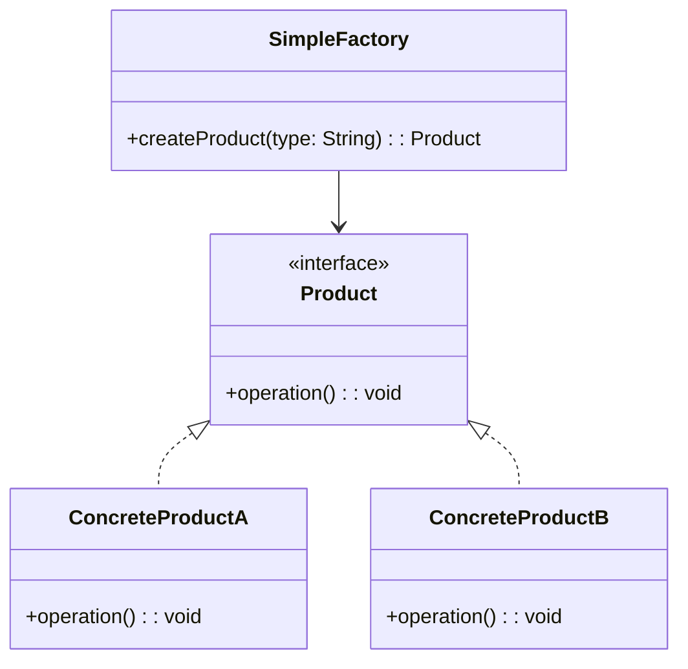
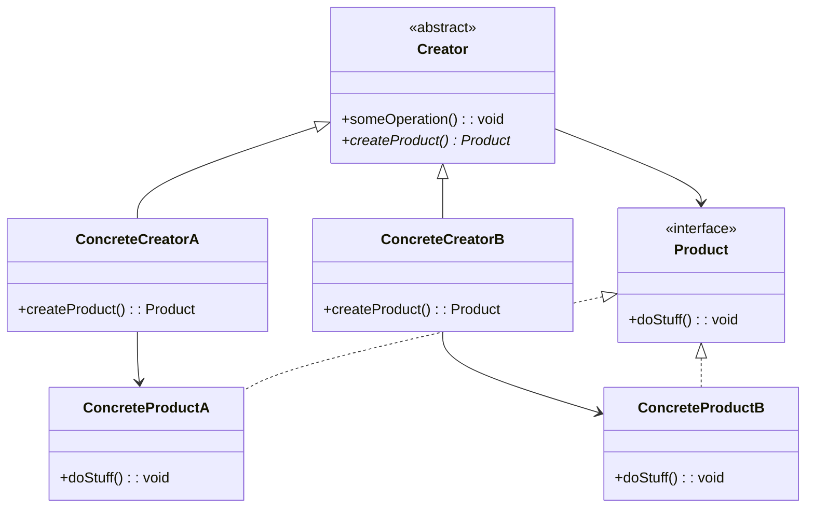
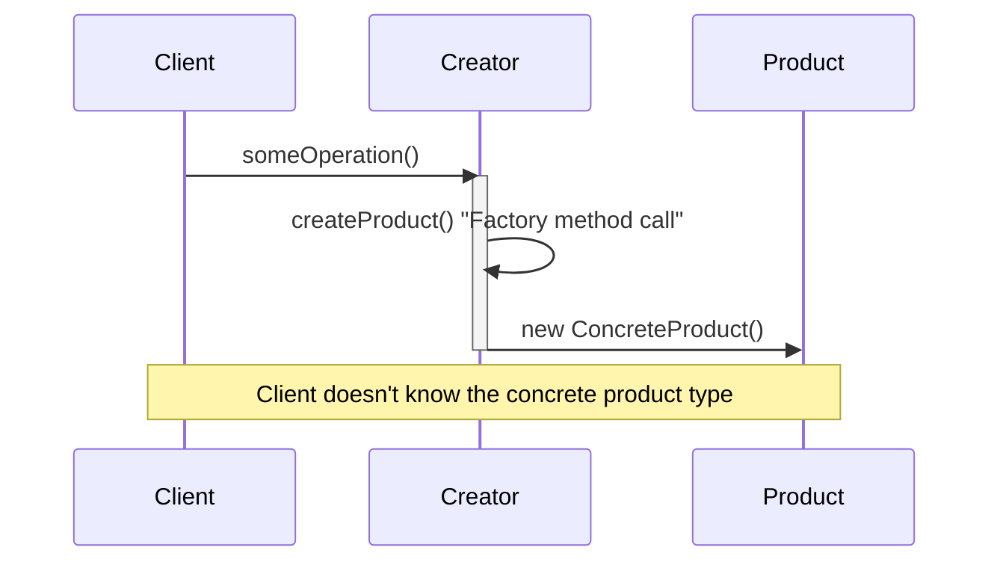
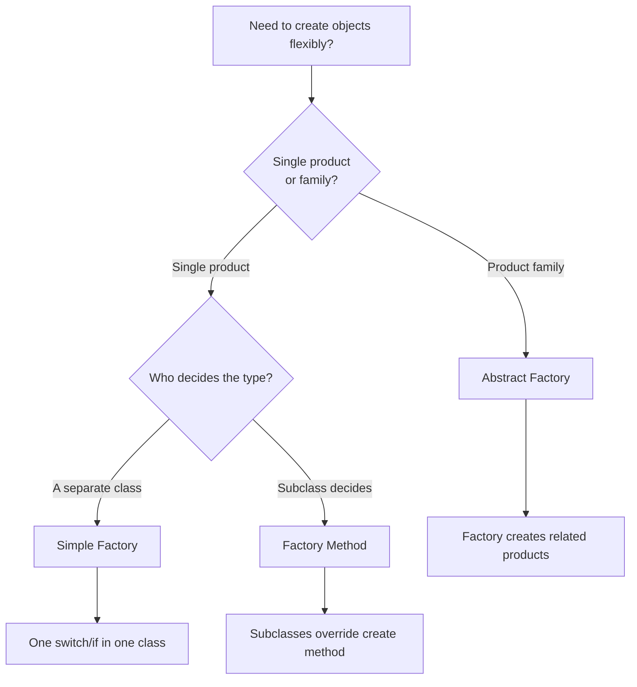

# Creational: Factory Method & Abstract Factory

> [!summary] Goal
> Delegate object creation to subclasses (Factory Method) and create families of related objects (Abstract Factory) without coupling client code to concrete classes.

## Table of Contents

1. [Simple Factory](#simple-factory)
2. [Factory Method](#factory-method)
3. [Abstract Factory](#abstract-factory)
4. [Comparison and Decision Guide](#comparison-and-decision-guide)
5. [Pitfalls](#pitfalls)

---

## Simple Factory

A **Simple Factory** is not a GoF pattern but a common starting point. A single factory class creates objects based on input.

> [!info] Simple Factory
> A creational idiom where a centralized class encapsulates the logic for instantiating one of several possible product types based on runtime input. It is not part of the original 23 GoF patterns — it lacks the abstraction and extensibility that true patterns provide — but it is a practical starting point for simple cases.



```java
public interface PaymentMethod {
    void pay(BigDecimal amount);
}

public class CreditCardPayment implements PaymentMethod {
    @Override public void pay(BigDecimal amount) { /* ... */ }
}

public class PayPalPayment implements PaymentMethod {
    @Override public void pay(BigDecimal amount) { /* ... */ }
}

// Simple Factory — one class decides which product to create
public class PaymentFactory {
    public PaymentMethod create(String type) {
        return switch (type) {
            case "credit" -> new CreditCardPayment();
            case "paypal" -> new PayPalPayment();
            default -> throw new IllegalArgumentException("Unknown: " + type);
        };
    }
}
```

---

## Factory Method

### Problem

A class needs to create objects, but the exact type should be determined by **subclasses**. The base class defines the algorithm; subclasses decide what to create.

> [!info] Factory Method
> A creational GoF pattern that defines an interface or abstract method for creating an object but lets subclasses decide which concrete class to instantiate. The base class (Creator) contains the core algorithm and calls the factory method; subclasses override it to supply the appropriate product. This inverts control — the Creator says what to do, subclasses say with what.

### Solution





```java
// Base class with factory method
public abstract class Dialog {
    public void render() {
        Button okButton = createButton();   // Call factory method
        okButton.onClick(() -> close());
        okButton.render();
    }

    // Factory method — subclasses override this
    public abstract Button createButton();
}

// Concrete creator
public class WindowsDialog extends Dialog {
    @Override
    public Button createButton() {
        return new WindowsButton();
    }
}

public class WebDialog extends Dialog {
    @Override
    public Button createButton() {
        return new HTMLButton();
    }
}

// Usage — the creator works with any product type
Dialog dialog = new WindowsDialog();
dialog.render();   // Creates WindowsButton internally
```

### Where it's used

| Example | Description |
|---------|-------------|
| `Collection.iterator()` | Each collection creates its own iterator |
| `InputStream.read()` | Subclasses define how bytes are read |
| Spring `FactoryBean<T>` | Factory method for bean creation |
| `Calendar.getInstance()` | Returns locale-specific calendar |

---

## Abstract Factory

### Problem

You need to create **families of related objects** (e.g., UI components for Windows vs Mac) without coupling client code to concrete classes. Adding a new OS means adding a complete family of products.

> [!info] Product Family
> A set of related or dependent objects that are designed to work together. In Abstract Factory, each concrete factory produces one complete family — e.g., WinFactory produces WinButton + WinCheckbox, which are guaranteed to be compatible. Mixing products from different families (WinButton + MacCheckbox) would create inconsistencies at runtime.

### Solution

```mermaid
classDiagram
    class GUIFactory {
        <<interface>>
        +createButton(): Button
        +createCheckbox(): Checkbox
    }
    class WinFactory {
        +createButton(): Button
        +createCheckbox(): Checkbox
    }
    class MacFactory {
        +createButton(): Button
        +createCheckbox(): Checkbox
    }
    class Button {
        <<interface>>
        +paint(): void
    }
    class Checkbox {
        <<interface>>
        +paint(): void
    }
    class WinButton {
        +paint(): void
    }
    class WinCheckbox {
        +paint(): void
    }
    class MacButton {
        +paint(): void
    }
    class MacCheckbox {
        +paint(): void
    }
    class Application {
        -factory: GUIFactory
        -button: Button
        -checkbox: Checkbox
        +createUI(): void
    }
    
    GUIFactory <|.. WinFactory
    GUIFactory <|.. MacFactory
    Button <|.. WinButton
    Button <|.. MacButton
    Checkbox <|.. WinCheckbox
    Checkbox <|.. MacCheckbox
    WinFactory --> WinButton
    WinFactory --> WinCheckbox
    MacFactory --> MacButton
    MacFactory --> MacCheckbox
    Application --> GUIFactory
\`\`\`

> [!info] Abstract Factory
> A creational GoF pattern that provides an interface for creating families of related or dependent objects without specifying their concrete classes. The client programs to the factory interface (e.g., \`GUIFactory\`) and never instantiates products directly. This guarantees products from the same family are used together, maintaining consistency across the system.

\`\`\`java
// Abstract factory interface
public interface GUIFactory {
    Button createButton();
    Checkbox createCheckbox();
}

// Concrete factory 1
public class WinFactory implements GUIFactory {
    @Override public Button createButton() { return new WinButton(); }
    @Override public Checkbox createCheckbox() { return new WinCheckbox(); }
}

// Concrete factory 2
public class MacFactory implements GUIFactory {
    @Override public Button createButton() { return new MacButton(); }
    @Override public Checkbox createCheckbox() { return new MacCheckbox(); }
}

// Client — works with any factory, never knows concrete classes
public class Application {
    private final Button button;
    private final Checkbox checkbox;

    public Application(GUIFactory factory) {
        button = factory.createButton();          // Families stay consistent
        checkbox = factory.createCheckbox();       // WinButton + WinCheckbox
    }
}

// Usage
Application app = new Application(new MacFactory());
// app now has MacButton + MacCheckbox — consistent family
```

### Where it's used

| Example | Description |
|---------|-------------|
| `DocumentBuilderFactory` | Creates XML document builders |
| `TransformerFactory` | Creates XML transformers |
| Spring `BeanFactory` | Creates beans, manages their lifecycle |
| JDBC `DriverManager` | Creates DB-specific connections |
| UI frameworks | Consistent look-and-feel across widgets |

---

## Comparison and Decision Guide



| Aspect | Simple Factory | Factory Method | Abstract Factory |
|--------|:--------------:|:--------------:|:----------------:|
| **Abstraction level** | Low (one class) | Medium (subclass) | High (factory family) |
| **Product count** | Single | Single | Multiple (family) |
| **Extensibility** | Modify factory class | Add new subclass | Add new factory + all products |
| **OCP compliant** | ❌ (modify factory) | ✅ (new subclass) | ✅ (new factory) |
| **Client coupling** | To factory class | To abstract creator | To abstract factory interface |
| **When to use** | Small number of products | One product, many variants | Families of related products |

> [!info] Open/Closed Principle (OCP)
> Software entities should be open for extension but closed for modification. Factory Method supports OCP because adding a new product only requires a new Creator subclass — existing code stays untouched. Abstract Factory also supports OCP: adding a new product family means adding a new concrete factory class without modifying the client or the factory interface. Simple Factory violates OCP because adding a new product requires editing the factory's switch statement.

---

## Pitfalls

### Too many factory levels

Simple Factory → Factory Method → Abstract Factory. Don't start with Abstract Factory for a single product type. Start with Simple Factory. If the switch grows, refactor to Factory Method. If you need product families, consider Abstract Factory.

### Abstract Factory class explosion

Each new product in the family requires adding a creation method to every concrete factory. If the family grows often, Abstract Factory becomes painful. Consider the Builder pattern or prototypical approaches instead.

### Factory method not actually overridden

A common mistake: the creator class calls `createProduct()`, but the subclass forgets to override it, so the base implementation creates a default product. Make the factory method **abstract** or throw an exception by default to force override.

### Complex factories that could be simpler

```java
// ❌ Over-engineered: Factory Method for every object
public class ServiceFactory {
    public UserService createUserService() { return new UserService(); }
    public OrderService createOrderService() { return new OrderService(); }
}

// ✅ Simpler: just use new or DI
// If there's no decision logic, a factory is just ceremony
```

---

> [!question]- Interview Questions
>
> **Q: What is the difference between Factory Method and Abstract Factory?**
> A: Factory Method is a single method that subclasses override to create one type of product. Abstract Factory is an interface with multiple creation methods that create a family of related products. Factory Method uses inheritance; Abstract Factory uses composition.
>
> **Q: When would you choose Factory Method over a simple constructor?**
> A: When the creation logic is complex (choosing a concrete class based on configuration/environment), when you want subclasses to control what's created, or when the class that uses the product shouldn't depend on its concrete type.
>
> **Q: Give a real-world example of Abstract Factory in Java.**
> A: `DocumentBuilderFactory.newInstance()` returns a factory that creates `DocumentBuilder` and `Document` objects. The specific implementation depends on the parser (Xerces, Crimson, etc.), but the client only depends on the abstract factory interface.
>
> **Q: How does Factory Method support OCP?**
> A: Adding a new product type doesn't modify existing creator code — you add a new Creator subclass that overrides the factory method. The original creator and other subclasses remain unchanged.
>
> **Q: When does Abstract Factory become a maintenance burden?**
> A: When you frequently add new product types to the family. Each new product requires adding a creation method to the abstract factory interface and every concrete factory — a lot of code change for one new feature. Consider if the family is stable before choosing Abstract Factory.

---

## Cross-Links

- [[DesignPatterns/02_Core/C01_Singleton_and_Prototype]] for alternative creational patterns
- [[DesignPatterns/02_Core/C03_Builder]] for constructing complex objects step by step
- [[DesignPatterns/02_Core/C06_Facade_Proxy_Flyweight]] for simplifying complex creation
- [[Java/01_Foundations/01_Java_Basics_and_Idioms]] for static factory methods
- [[SpringBoot/01_Foundations/02_DI_and_Bean_Lifecycle]] for Spring's `@Bean` factory methods
