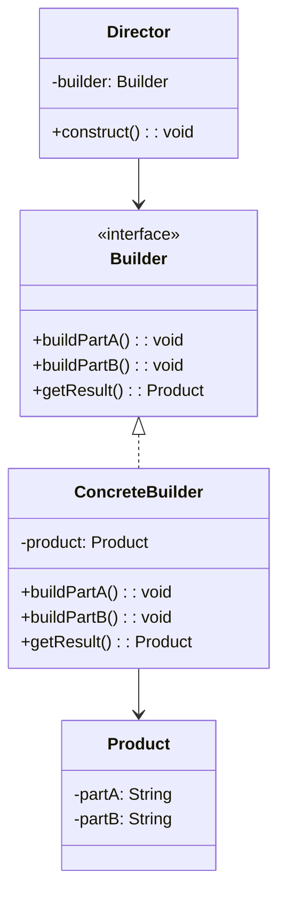
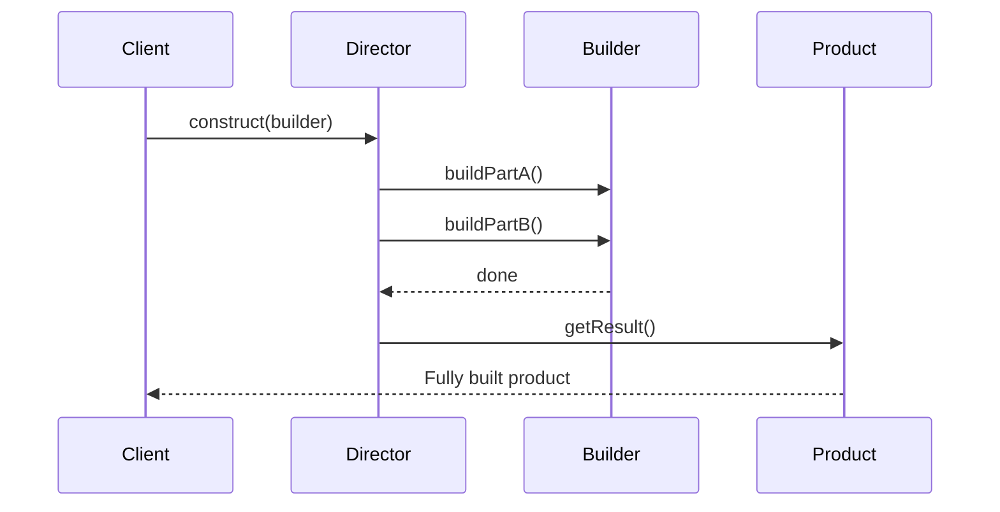
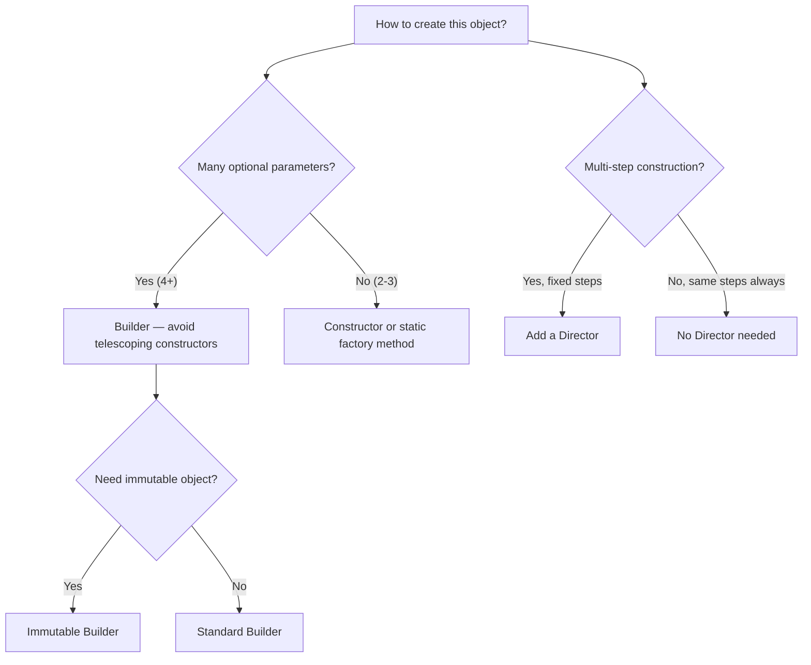

# Creational: Builder

> [!summary] Goal
> Construct complex objects step by step (Builder) — especially when an object has many optional parameters, needs to be immutable, or requires a multi-step construction process.

## Table of Contents

1. [Problem: Telescoping Constructors](#problem-telescoping-constructors)
2. [Builder Pattern](#builder-pattern)
3. [Fluent Builder](#fluent-builder)
4. [Immutable Builder](#immutable-builder)
5. [Director](#director)
6. [Comparison and Decision Guide](#comparison-and-decision-guide)
7. [Pitfalls](#pitfalls)

---

## Problem: Telescoping Constructors

```java
// ❌ Telescoping constructors — 6 overloads for different parameter combinations
public class HttpRequest {
    public HttpRequest(String url) { /* ... */ }
    public HttpRequest(String url, String method) { /* ... */ }
    public HttpRequest(String url, String method, Map<String,String> headers) { /* ... */ }
    public HttpRequest(String url, String method, Map<String,String> headers, String body) { /* ... */ }
    public HttpRequest(String url, String method, Map<String,String> headers, String body, int timeout) { /* ... */ }
    public HttpRequest(String url, String method, Map<String,String> headers, String body, int timeout, boolean followRedirects) { /* ... */ }
    
    // Hard to read: which parameter is which?
    new HttpRequest("https://api.example.com", "POST", headers, null, 5000, true);
}
```

The **telescoping constructor** anti-pattern: more optional parameters → more constructors → unreadable, error-prone code.

> [!info] Telescoping Constructor
> An anti-pattern where a class provides multiple constructor overloads, one for each combination of parameters. As optional parameters grow, the number of constructors explodes combinatorially, making the code hard to read and error-prone (it is easy to swap two parameters of the same type). The Builder pattern is the standard remedy — it replaces many constructors with named setter methods.

---

## Builder Pattern

### Solution





```java
// Product — complex object with many optional parts
public class HttpRequest {
    private final String url;
    private final String method;
    private final Map<String, String> headers;
    private final String body;
    private final int timeoutMs;
    private final boolean followRedirects;

    private HttpRequest(Builder builder) {
        this.url = builder.url;
        this.method = builder.method;
        this.headers = builder.headers;
        this.body = builder.body;
        this.timeoutMs = builder.timeoutMs;
        this.followRedirects = builder.followRedirects;
    }

    // Static nested Builder class
    public static class Builder {
        private String url;                              // Required
        private String method = "GET";                   // Default value
        private Map<String, String> headers = Map.of();  // Default
        private String body = null;                     // Optional
        private int timeoutMs = 3000;                   // Default
        private boolean followRedirects = true;         // Default

        public Builder(String url) {                    // Required in constructor
            this.url = url;
        }

        public Builder method(String method) { this.method = method; return this; }
        public Builder header(String key, String value) {
            if (this.headers.isEmpty()) this.headers = new HashMap<>();
            this.headers.put(key, value);
            return this;
        }
        public Builder body(String body) { this.body = body; return this; }
        public Builder timeout(int ms) { this.timeoutMs = ms; return this; }
        public Builder followRedirects(boolean v) { this.followRedirects = v; return this; }

        public HttpRequest build() {
            return new HttpRequest(this);               // Create immutable product
        }
    }
}

// Usage — clear, readable, extensible
HttpRequest request = new HttpRequest.Builder("https://api.example.com")
    .method("POST")
    .header("Authorization", "Bearer token")
    .header("Content-Type", "application/json")
    .body("{\"key\": \"value\"}")
    .timeout(5000)
    .build();
```

---

## Fluent Builder

Method chaining (\`.method().header().body().build()\`) is called a **fluent interface**. Each setter returns \`this\` so calls can be chained.

> [!info] Fluent Interface
> An API design style where method calls are chained together because each method returns \`this\` (the current object instance). This creates a domain-specific-language (DSL) feel: \`builder.setX().setY().build()\`. Fluent interfaces improve readability when configuring objects with many optional parameters, but can be overkill for simple cases with just one or two parameters.

\`\`\`java
// Fluent builder for SQL queries
public class QueryBuilder {
    private final StringBuilder select = new StringBuilder("SELECT *");
    private final StringBuilder from = new StringBuilder();
    private final StringBuilder where = new StringBuilder();
    private final StringBuilder orderBy = new StringBuilder();

    public QueryBuilder select(String columns) {
        this.select.replace(0, this.select.length(), "SELECT " + columns);
        return this;
    }

    public QueryBuilder from(String table) {
        this.from.append(" FROM ").append(table);
        return this;
    }

    public QueryBuilder where(String condition) {
        if (where.isEmpty()) where.append(" WHERE ");
        else where.append(" AND ");
        where.append(condition);
        return this;
    }

    public QueryBuilder orderBy(String column) {
        this.orderBy.append(" ORDER BY ").append(column);
        return this;
    }

    public String build() {
        return select.toString() + from + where + orderBy;
    }
}

// Fluent usage
String query = new QueryBuilder()
    .select("id, name, email")
    .from("users")
    .where("active = true")
    .where("created_at > '2024-01-01'")
    .orderBy("name")
    .build();
```

---

## Immutable Builder

The builder pattern is often used to create **immutable objects** — objects whose state cannot change after construction. This is critical for thread safety and caching.

> [!info] Immutable Object
> An object whose state cannot be modified after construction. All fields are \`final\` and set in the constructor; no setters are exposed; and any mutable fields (collections, dates) are defensively copied before being stored. Immutable objects are inherently thread-safe, cacheable, and free from side-effect bugs — they can be shared freely without defensive copying at every use site.

\`\`\`java
// Immutable value object built with Builder
public final class Email {
    private final List<String> to;
    private final String subject;
    private final String body;
    private final List<String> attachments;

    private Email(Builder builder) {
        this.to = List.copyOf(builder.to);                // Defensive copy
        this.subject = builder.subject;
        this.body = builder.body;
        this.attachments = builder.attachments == null
            ? List.of()
            : List.copyOf(builder.attachments);            // Immutable list
    }

    public List<String> getTo() { return to; }
    public String getSubject() { return subject; }
    public String getBody() { return body; }
    public List<String> getAttachments() { return attachments; }

    public static class Builder {
        private List<String> to = new ArrayList<>();
        private String subject;
        private String body;
        private List<String> attachments;

        public Builder to(String recipient) { to.add(recipient); return this; }
        public Builder subject(String subject) { this.subject = subject; return this; }
        public Builder body(String body) { this.body = body; return this; }
        public Builder attachment(String file) {
            if (attachments == null) attachments = new ArrayList<>();
            attachments.add(file);
            return this;
        }
        public Email build() {
            return new Email(this);
        }
    }
}
```

---

## Director

The **Director** encapsulates a multi-step construction process. It's optional — you don't need a Director if the client builds objects directly.

> [!info] Director
> In the Builder pattern, the Director is an object that defines the order in which builder methods are called to construct a product. It encapsulates standard construction sequences (recipes) so they can be reused. The Director does not know the concrete builder type — it works with the builder interface, meaning the same Director can produce different product representations depending on which builder is passed to it.

\`\`\`mermaid
sequenceDiagram
    participant C as Client
    participant D as Director
    participant B as Builder
    
    C->>D: constructMinimal(builder)
    D->>B: buildPartA()
    D->>B: buildPartB()
    D-->>C: done
    
    C->>D: constructFull(builder)
    D->>B: buildPartA()
    D->>B: buildPartB()
    D->>B: buildPartC()
    D->>B: buildPartD()
    D-->>C: done
```

```java
// Director defines common construction sequences
public class PizzaDirector {
    public void buildMargherita(PizzaBuilder builder) {
        builder.setSize("large");
        builder.addCheese();
        builder.addTomatoSauce();
    }

    public void buildPepperoni(PizzaBuilder builder) {
        builder.setSize("large");
        builder.addCheese();
        builder.addTomatoSauce();
        builder.addPepperoni();
        builder.setBakeTime(12);
    }
}

// Client uses director for standard recipes, or builds custom directly
PizzaDirector director = new PizzaDirector();
PizzaBuilder builder = new PizzaBuilder();

director.buildMargherita(builder);     // Director controls the steps
Pizza margherita = builder.build();

PizzaBuilder customBuilder = new PizzaBuilder();  // Or custom construction
Pizza custom = customBuilder.setSize("medium").addCheese().addPineapple().build();
```

---

## Comparison and Decision Guide



| Aspect | Builder | Factory Method | Abstract Factory | Constructor |
|--------|:-------:|:--------------:|:----------------:|:-----------:|
| **Controls** | How an object is built step by step | Which concrete class to instantiate | Which product families to create | — |
| **Parameter count** | High (4+) | Low | Low | Low to moderate |
| **Immutability** | ✅ Naturally | ❌ Not its focus | ❌ Not its focus | ❌ (needs defensive copy) |
| **Readability** | ✅ Fluent chain | ✅ Simple | ✅ Logical | ❌ Telescoping |
| **Complexity** | Medium | Low-Medium | Medium-High | None |

---

## Pitfalls

### Builder for 2-3 parameters

A builder for `new Point(int x, int y)` is over-engineering. Use a constructor or static factory method. The builder pays off when you have 4+ parameters, especially with defaults and optional fields.

### Mutable builder produces mutable product

If the builder stores collections and passes them directly to the product, changes to the builder after `build()` affect the product. Always make defensive copies (`List.copyOf()`, `new ArrayList<>(...)`) in the product constructor.

### Forgetting to call `build()`

A fluent builder without a terminal `build()` call returns a partially configured builder — easy to miss. Make `build()` required and consider having the builder constructor validate required fields.

### Lombok `@Builder` overuse

```java
// ❌ Lombok @Builder on every class creates unnecessary builders
@Builder
public class Address {   // 3 fields, no optional — just use constructor
    private String street;
    private String city;
    private String zip;
}
```

Use `@Builder` from Lombok only when you genuinely have many optional parameters. For simple data classes, prefer a regular constructor or `@AllArgsConstructor`.

---

> [!question]- Interview Questions
>
> **Q: What problem does the Builder pattern solve?**
> A: The telescoping constructor problem — when an object has many optional parameters, you need many constructors. Builder replaces them with a fluent API where each parameter is set by name, making the code readable and reducing parameter-order bugs.
>
> **Q: What is the difference between Builder and Factory?**
> A: Factory focuses on **which object** to create (deciding the concrete class). Builder focuses on **how to assemble** an object (step-by-step construction of a complex object). Factory creates the object in one call; Builder creates it in multiple steps and captures the result with `build()`.
>
> **Q: When would you use a Director with a Builder?**
> A: When you have standard construction sequences that should be reusable. For example, a `PizzaDirector` knows how to build a Margherita, a Pepperoni, and a Vegetarian pizza using the same builder. Clients can also bypass the director and use the builder directly for custom pizzas.
>
> **Q: How do you make a Builder produce immutable objects?**
> A: (1) Make the product class `final` with `final` fields. (2) Make the constructor private — only the builder can call it. (3) In the constructor, make defensive copies of all mutable parameters. (4) The builder's `build()` method creates a new product each time.
>
> **Q: What is a fluent interface?**
> A: A method-chaining API where each setter returns `this`, allowing calls to be chained: `builder.setX().setY().build()`. It improves readability by grouping related parameters together without punctuation noise between them.

---

## Cross-Links

- [[DesignPatterns/02_Core/C02_Factory_Method_and_Abstract_Factory]] for Factory vs Builder comparison
- [[DesignPatterns/02_Core/C01_Singleton_and_Prototype]] for alternative creational patterns
- [[Java/01_Foundations/05_Modern_Java_Language_Features]] for records and immutability
- [[TypeScript/03_Advanced/07_Design_Patterns_in_TypeScript]] for TS builder with generics
- [[SpringBoot/01_Foundations/02_DI_and_Bean_Lifecycle]] for builder-style bean configuration
