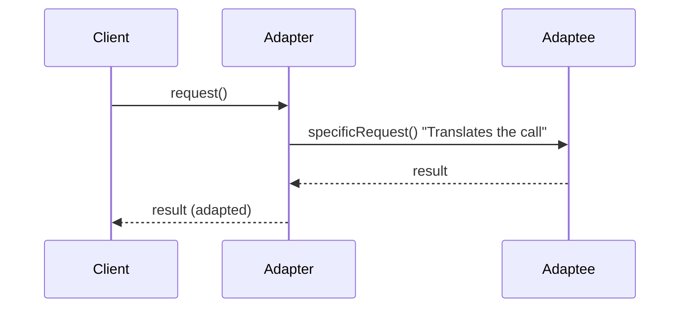
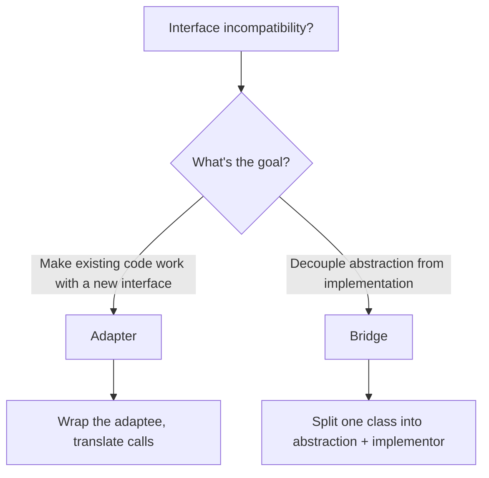

# Structural: Adapter & Bridge

> [!summary] Goal
> Make incompatible interfaces work together (Adapter) and decouple an abstraction from its implementation so both can vary independently (Bridge).

## Table of Contents

1. [Adapter](#adapter)
2. [Bridge](#bridge)
3. [Comparison and Decision Guide](#comparison-and-decision-guide)
4. [Pitfalls](#pitfalls)

---

## Adapter

### Problem

You have an existing class with a useful interface, but your client expects a **different interface**. You can't modify the existing class (legacy code, third-party library).

> [!info] Adapter
> A structural GoF pattern that converts the interface of a class into another interface that a client expects. Adapter lets classes work together that could not otherwise because of incompatible interfaces. It acts as a translator — the client calls the adapter's methods, and the adapter translates those calls into the adaptee's interface without either side knowing about the other.

### Solution

\`\`\`mermaid
classDiagram
    class Target {
        <<interface>>
        +request(): void
    }
    class Client {
        +doWork(target: Target): void
    }
    class Adapter {
        -adaptee: Adaptee
        +request(): void
    }
    class Adaptee {
        +specificRequest(): void
    }
    Target <|.. Adapter
    Adapter --> Adaptee
    Client --> Target
```



> [!info] Object Adapter vs Class Adapter
> **Object adapter** uses composition: the adapter holds a reference to an adaptee instance and delegates calls to it through the target interface. It is flexible — it can adapt the adaptee and any of its subclasses. **Class adapter** uses inheritance: the adapter extends the adaptee and implements the target interface. Java's single-inheritance constraint makes class adapter less flexible; object adapter is almost always the recommended approach.

### Object Adapter (composition — recommended)

\`\`\`java
// Target — the interface the client expects
public interface Logger {
    void info(String message);
    void error(String message);
}

// Adaptee — existing class with a different interface
public class Log4jLogger {
    public void log(int level, String msg) {
        // level: 1=INFO, 2=ERROR
        System.out.println("Log4j: [" + level + "] " + msg);
    }
}

// Adapter — makes Log4jLogger work as a Logger
public class Log4jAdapter implements Logger {
    private final Log4jLogger adaptee;

    public Log4jAdapter(Log4jLogger adaptee) {
        this.adaptee = adaptee;
    }

    @Override
    public void info(String message) {
        adaptee.log(1, message);          // Translates to adaptee's interface
    }

    @Override
    public void error(String message) {
        adaptee.log(2, message);
    }
}

// Client only depends on the Logger interface
public class Application {
    private final Logger logger;

    public Application(Logger logger) {        // Works with any Logger
        this.logger = logger;
    }
}

// Wiring
Application app = new Application(new Log4jAdapter(new Log4jLogger()));
```

### Class Adapter (inheritance — Java-specific, less flexible)

```java
// Class adapter — extends the adaptee, implements the target
// (Java can only extend one class, so this is less flexible than object adapter)
public class LoggerClassAdapter extends Log4jLogger implements Logger {
    @Override
    public void info(String message) {
        log(1, message);    // Inherited from Log4jLogger
    }

    @Override
    public void error(String message) {
        log(2, message);
    }
}
```

### Where it's used

| Example | Description |
|---------|-------------|
| `InputStreamReader(InputStream)` | Adapts byte stream → character stream |
| `Arrays.asList()` | Adapts array → List interface |
| `List.of()` | Adapts elements → unmodifiable List |
| Spring `HandlerAdapter` | Adapts different controller types to a common interface |
| `Mockito.when().thenReturn()` | Adapts method calls for mocking |

---

## Bridge

> [!info] Bridge
> A structural GoF pattern that decouples an abstraction from its implementation so that the two can vary independently. Instead of binding an abstraction to one implementation via inheritance, Bridge uses composition: the abstraction holds a reference to the implementation interface. This lets you extend both hierarchies (abstraction variants and implementation variants) without multiplying classes combinatorially.

### Problem

An abstraction (e.g., \`Remote\`) has multiple implementations (e.g., \`TV\`, \`Radio\`), and the abstraction itself has variants (e.g., \`BasicRemote\`, \`AdvancedRemote\`). With inheritance, you'd create classes for every combination. **Bridge** separates the abstraction from the implementation so both can vary independently.

> [!info] Abstraction and Implementor
> In the Bridge pattern, the **Abstraction** is the high-level control layer (e.g., \`Remote\`) that defines the business logic and delegates the actual work to the **Implementor**. The **Implementor** (e.g., \`Device\`) is the low-level interface that the abstraction uses to perform platform-specific operations. Both can be extended independently — you can add a new \`AdvancedRemote\` without touching \`TV\`, and add a new \`Projector\` without touching \`Remote\`. The two hierarchies grow independently.

### Solution

\`\`\`mermaid
classDiagram
    class Remote {
        -device: Device
        +turnOn(): void
        +turnOff(): void
        +volumeUp(): void
    }
    class BasicRemote {
        +volumeUp(): void
    }
    class AdvancedRemote {
        +volumeUp(): void
        +mute(): void
    }
    class Device {
        <<interface>>
        +isEnabled(): boolean
        +enable(): void
        +disable(): void
        +setVolume(int): void
        +getVolume(): int
    }
    class TV {
        +isEnabled(): boolean
        +enable(): void
        +disable(): void
        +setVolume(int): void
        +getVolume(): int
    }
    class Radio {
        +isEnabled(): boolean
        +enable(): void
        +disable(): void
        +setVolume(int): void
        +getVolume(): int
    }
    
    Remote --> Device
    Remote <|-- BasicRemote
    Remote <|-- AdvancedRemote
    Device <|.. TV
    Device <|.. Radio
```

```java
// Implementor — what remotes control
public interface Device {
    boolean isEnabled();
    void enable();
    void disable();
    int getVolume();
    void setVolume(int percent);
}

// Concrete implementor 1
public class TV implements Device {
    private boolean on = false;
    private int volume = 30;

    @Override public boolean isEnabled() { return on; }
    @Override public void enable() { on = true; System.out.println("TV on"); }
    @Override public void disable() { on = false; System.out.println("TV off"); }
    @Override public int getVolume() { return volume; }
    @Override public void setVolume(int percent) { volume = percent; System.out.println("TV volume: " + volume); }
}

// Concrete implementor 2
public class Radio implements Device {
    // Similar implementation for radio
}

// Abstraction — remote controls a device via the interface
public abstract class Remote {
    protected Device device;

    public Remote(Device device) { this.device = device; }

    public void turnOn() { device.enable(); }
    public void turnOff() { device.disable(); }
    public abstract void volumeUp();
    public abstract void volumeDown();
}

// Refined abstraction 1
public class BasicRemote extends Remote {
    public BasicRemote(Device device) { super(device); }

    @Override public void volumeUp() {
        device.setVolume(device.getVolume() + 10);
    }

    @Override public void volumeDown() {
        device.setVolume(device.getVolume() - 10);
    }
}

// Refined abstraction 2
public class AdvancedRemote extends Remote {
    public AdvancedRemote(Device device) { super(device); }

    @Override public void volumeUp() {
        device.setVolume(device.getVolume() + 1);    // Fine-grained
    }

    @Override public void volumeDown() {
        device.setVolume(device.getVolume() - 1);
    }

    public void mute() { device.setVolume(0); }
}

// Usage — freely combine any remote with any device
Remote basicTV = new BasicRemote(new TV());
AdvancedRemote advancedRadio = new AdvancedRemote(new Radio());

basicTV.turnOn();        // "TV on"
basicTV.volumeUp();      // "TV volume: 40"
advancedRadio.mute();    // Radio volume set to 0
```

### Where it's used

| Example | Description |
|---------|-------------|
| JDBC `Driver` | Abstraction (JDBC API) separated from implementation (MySQL, Postgres drivers) |
| SLF4J | Logging facade (abstraction) separated from backends (Logback, Log4j) |
| Spring `PlatformTransactionManager` | Abstraction over JPA, JDBC, Hibernate transaction managers |
| Java AWT `Peer` | UI component abstraction separated from platform implementation |

---

## Comparison and Decision Guide



| Aspect | Adapter | Bridge |
|--------|:-------:|:------:|
| **Intent** | Make existing classes work together | Separate abstraction from implementation |
| **When to use** | Existing code with incompatible interfaces | Abstraction and implementation both vary |
| **Direction** | Adapts a specific existing class | Designed from the start for decoupling |
| **Structure** | Wraps the adaptee | Two parallel hierarchies |
| **Known at design time?** | Usually retrofitted | Usually designed upfront |
| **Analogy** | Power plug adapter | TV remote (any remote works with any TV) |

### Adapter vs Proxy vs Decorator

| Pattern | Purpose | Controls access? | Adds behavior? |
|---------|---------|:----------------:|:--------------:|
| **Adapter** | Converts interface | No | No (translates) |
| **Proxy** | Controls access | Yes | Often (lazy, caching) |
| **Decorator** | Adds behavior dynamically | No | Yes |

---

## Pitfalls

### Adapter overuse

Wrapping every third-party dependency in an adapter "for testability" creates unnecessary indirection. Adapters are useful when the interface you're adapting is complex or when you need to swap implementations. For simple wrappers, consider the cost.

### Bridge complexity for simple cases

If the abstraction has only one implementation, or if the implementations don't vary independently, Bridge is over-engineering. Start with a single class. Split into Bridge only when you have multiple abstraction variants × multiple implementation variants.

### Class adapter in Java (multiple inheritance problem)

Java can't extend two classes. Class adapter (inheriting from adaptee + implementing target) only works when the adaptee is a single class. Object adapter (composition) is always preferred — it's more flexible and works with any adaptee.

### Bridge making code harder to follow

Bridge creates two parallel class hierarchies. Navigating the code requires understanding both the abstraction hierarchy and the implementor hierarchy. Document the relationship clearly.

---

> [!question]- Interview Questions
>
> **Q: What is the difference between class adapter and object adapter?**
> A: Class adapter uses inheritance (extends adaptee, implements target). Object adapter uses composition (wraps adaptee, implements target). Object adapter is preferred — it's more flexible (works with any adaptee subclass) and doesn't require adapting the constructor.
>
> **Q: Give a real-world example of the Adapter pattern in Java.**
> A: `InputStreamReader` adapts an `InputStream` (byte-oriented) to a `Reader` (character-oriented). It wraps the byte stream and translates bytes to characters using a specified charset.
>
> **Q: How does Bridge relate to the Open/Closed Principle?**
> A: Bridge adheres to OCP because you can add new abstractions (BasicRemote, AdvancedRemote) and new implementations (TV, Radio, Projector) independently without modifying existing code. The abstraction and implementation hierarchies are both open for extension.
>
> **Q: When would you choose Bridge over Adapter?**
> A: Adapter is for making existing, incompatible code work together (retrofit). Bridge is for designing from the start so that abstraction and implementation can vary independently. Choose Bridge when you anticipate multiple abstraction + implementation combinations.
>
> **Q: What is the difference between Adapter and Facade?**
> A: Adapter converts one interface to another (so existing code works). Facade provides a simplified interface to a complex subsystem (so clients don't need to understand every detail). Adapter preserves the level of abstraction; Facade reduces it.

---

## Cross-Links

- [[DesignPatterns/02_Core/C06_Facade_Proxy_Flyweight]] for Facade and Proxy comparison
- [[DesignPatterns/02_Core/C05_Composite_and_Decorator]] for Decorator comparison
- [[DesignPatterns/01_Foundations/F02_SOLID_Principles]] for OCP and how Bridge supports it
- [[Java/02_Core/03_IO_NIO_and_Serialization]] for `InputStreamReader` as adapter
- [[SystemDesign/02_Core/07_Architecture_Patterns]] for ports and adapters (hexagonal architecture)
